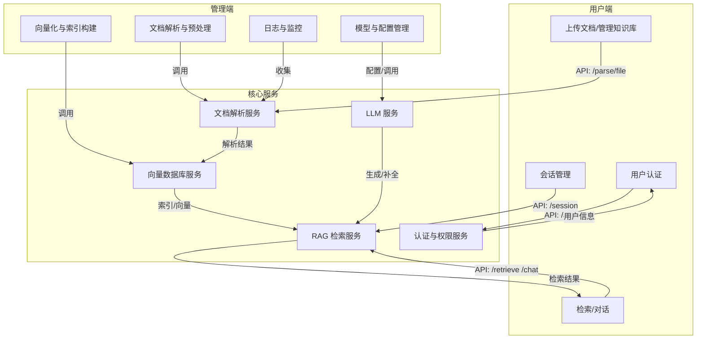

# RAG 系统整体流程与功能模块划分

本图表基于实际用户端与管理端的业务流程，结合代码实现逻辑，重新梳理功能模块，避免受现有代码文件拆分影响。

## 主要功能模块说明

- **用户端**：
  - 上传文档/管理知识库：负责知识的输入、管理，触发解析与入库流程。
  - 检索/对话：面向终端用户的问答、检索、对话等功能。
  - 会话管理：多轮对话、历史记录等。
  - 用户认证：登录、权限校验。

- **管理端**：
  - 文档解析与预处理：文档格式转换、OCR、分块等。
  - 向量化与索引构建：文本向量化、索引入库。
  - 模型与配置管理：模型加载、参数配置。
  - 日志与监控：系统运行状态、错误日志。

- **核心服务**：
  - 文档解析服务（document_parser/document_post_processor/mineru_parser）
  - 向量数据库服务（vector_store_builder/postgres_vector_store）
  - RAG 检索服务（rag_service）
  - LLM 服务（集成 HuggingFace/OpenAI 等）
  - 认证与权限服务（auth 模块）

---

> 本图表和说明有助于理解系统整体业务流和功能模块划分，便于后续架构优化和测试设计。