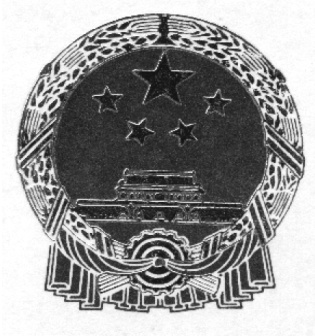

# 中华人民共和国海事局船舶与海上设施法定检验规则国内航行海船法定检验技术规则  

2020  

# 第 1 篇 检验与发证  

# 目 录  

# 第 1 章 通 则. 1-1  

第 1 节 一般规定. 1-1  
第 2 节 检验机构... 1-1  
第 3 节 检验依据.. 1-1  
第 4 节 法定证书.. 1-2  
第 5 节 船舶检验. 1-2  

# 第 2 章 检验与发证. 1-5  

第 1 节 检验种类与周期. .1-5  
第 2 节 证 书.. 1-7  
第 3 节 检验后状况的维持. 1-8  
第 4 节 图纸资料.. 1-8  

# 第 3 章 海上货船适航的检验. 1-9  

第 1 节 一般规定. .1-9  
第 2 节 初次检验/建造检验.. .1-9  
第 3 节 年度检验.. .1-11  
第 4 节 中间检验.. 1-14  
第 5 节 换证检验.. 1-15  

# 第 4 章 船底外部检查.. 1-19  

第 1 节 一般规定 .1-19  
第 2 节 船底外部检查. 1-19  
第 3 节 水下检验.. 1-19  

# 第 5 章 海上船舶载重线的检验 1-21  

第 1 节 一般规定 .1-21  
第 2 节 初次检验/建造检验. ..1-21  
第 3 节 年度检验. .1-22  
第 4 节 换证检验.. .1-23  

# 第 6 章 海上船舶防止油污的检验. 1-24  

第 1 节 一般规定. .1-24  
第 2 节 初次检验/建造检验.. ..1-24  
第 3 节 年度检验.. .1-24  
第 4 节 中间检验.. 1-24  
第 5 节 换证检验.. 1-25  

# 第 7 章 海上船舶防止生活污水污染的检验. 1-26  

第 1 节 一般规定. .1-26  
第 2 节 初次检验/建造检验. .1-26  
第 3 节 换证检验.. .1-26  

# 第 8 章 海上客船适航的检验. -27  

第 1 节 一般规定 ..1-27  
第 2 节 初次检验/建造检验.. .1-27  
第 3 节 年度检验.. .1-28  
第 4 节 换证检验.. .1-29  

# 第 9 章 海上高速船安全的检验 1-30  

第 1 节 一般规定. .1-30  
第 2 节 初次检验/建造检验. ..1-30  
第 3 节 年度检验.. ..1-30  
第 4 节 换证检验.. .1-31  

# 第 10 章 海上船舶浮船坞安全的检验. 1-32  

第 1 节 一般规定. .1-32  
第 2 节 初次检验/建造检验. ..1-32  
第 3 节 年度检验.. .1-33  
第 4 节 换证检验.. .1-33  

# 第 11 章 海上船舶吨位的丈量. 1-34  

第 1 节 一般规定. -34  

# 第 12 章 海上船舶船员舱室设备的检验. 1-35  

第 1 节 一般规定. .1-35  
第 2 节 初次检验/建造检验. .1-35  
第 3 节 临时检验.. .1-35  

# 第 13 章 海上船舶危险货物适装条件的检验. 1-36  

第 1 节 一般规定. .1-36  
第 2 节 初次检验/建造检验.. ..1-36  
第 3 节 年度检验.. ..1-36  
第 4 节 中间检验.. .1-37  
第 5 节 换证检验.. .1-37  

# 第 14 章 海上特殊用途船安全的检验 1-38  

# 第 1 节 一般规定. 1-38  

# 第 15 章 海上船舶防止散装运输有毒液体物质污染的检验 1-39  

第 1 节 一般规定 .1-39  
第 2 节 初次检验/建造检验. .1-39  
第 3 节 年度检验. ..1-40  
第 4 节 中间检验.. .1-40  
第 5 节 换证检验.. .1-40  

# 第 16 章 海上船舶防止空气污染的检验. 1-42  

第 1 节 一般规定 .1-42  
第 2 节 初次检验/建造检验. .1-42  
第 3 节 年度检验.. ..1-43  
第 4 节 中间检验. .1-45  
第 5 节 换证检验.. .1-45  

# 第 17 章 海上船舶防污底系统的检验. 1-46  

第 1 节 一般规定. .1-46  
第 2 节 初次检验/建造检验.. .1-46  
第 3 节 临时检验.. .1-46  

# 第 18 章 海上船舶散装运输危险化学品适装条件的检验 . 1-48  

第 1 节 一般规定. .1-48  
第 19 章 海上船舶散装运输液化气体适装条件的检验. . 1-49  
第 1 节 一般规定. .1-49  
第 20 章 海上船舶乘客定额的检验. .1-50  
第 1 节 一般规定. .1-50  
第 2 节 初次检验/建造检验. .1-50  
第 3 节 临时检验.. .1-50  

# 第 21 章 近海供应船散装运输有限数量有毒有害液体物质适装条件的检验. 1-51  

第 1 节 一般规定. .1-51  
第 2 节 初次检验/建造检验.. ..1-51  
第 3 节 年度检验. ..1-54  
第 4 节 中间检验.. .1-55  
第 5 节 换证检验.. .1-56  

# 第 22 章 螺旋桨轴/尾管轴的检验. 1-57  

第 1 节 检验间隔期. .1-57  
第 2 节 检验项目. .1-57  
第 3 节 展期检验.. .1-57  

# 第 23 章 锅炉检验. 1-59  

第 1 节 一般规定 .1-59  
第 2 节 检验间隔期.. ..1-59  
第 3 节 检验范围. .1-60  
第 4 节 蒸汽管检查. 1-61  

# 附录 1 送审图纸目录. .1-62  

1 一般规定. .1-62  
2 海上货船适航的送审图纸目录.. .. 1-62  
3 海上船舶载重线的送审图纸目录.. . 1-64  
4 海上船舶防止油污的送审图纸目录.. . 1-65  
5 海上客船适航的送审图纸目录. .. 1-65  
6 海上高速船安全的送审图纸目录.. ... 1-67  
7 海上船舶吨位丈量的送审图纸目录. .. 1-69  
8 海上船舶防止生活污水污染的送审图纸目录.. . 1-69  
9 海上船舶浮船坞安全的送审图纸目录.. . 1-69  
10 海上船舶危险货物适装条件的送审图纸目录. . 1-70  
11 海上船舶船员舱室设备的送审图纸目录.. .. 1-71  
12 海上特殊用途船安全的送审图纸目录.. ... 1-71  
13 海上船舶防止散装运输有毒液体物质污染的送审图纸目录... .. 1-71  
14 海上船舶防止空气污染的送审图纸目录. . 1-71  
15 海上船舶散装运输危险化学品适装条件/近海供应船散装运输有限数量有毒有害液  
体物质适装条件的送审图纸目录.. .1-72  
16 海上船舶散装运输液化气体适装条件的送审图纸目录. . 1-72  
17 海上船舶乘客定额的送审图纸目录. .. 1-73  
2 达到规定船龄的油船、散货船及化学品船的补充检验要求.. .. 1-74  
第 1 节 一般要求... ..1-74  
第 2 节 船体与设备检验... ..1-78  
附录 3 国内航行海船有关的法定证书格式及其填写说明. . 1-84  

# 第 1 章 通 则  

# 第1 节 一般规定  

# 1.1.1 适用范围  

1.1.1.1 本篇适用于所有船。2021 年1 月1 日及以后建造的船舶应满足本篇的要求。2021年 1 月 1 日之前建造的船舶结合最近一次换证检验签发本篇规定的证书。  

1.1.1.2 除本法规相应规定外，散装运输危险化学品船舶与散装运输液化气体船舶还应分别符合本局《国际航行海船法定检验技术规则》第 4 篇附则 5 和附则 6 的规定。  

1.1.1.3 起重设备应符合本局《起重设备法定检验技术规则》的规定。  

1.1.1.4 海上拖航应符合本局《海上拖航法定检验技术规则》的规定。  

1.1.1.5 潜水器应符合本局《潜水器法定检验技术规则》的规定。  

1.1.1.6 船长①小于 $20\mathrm{m}$ 的海船应符合本局《沿海小型船舶检验技术规则》的规定。  

1.1.1.7 本章 1.3.2.2 所述各项的检验，除本法规规定外，还应按本局依照规定程序认可和公布②的中国船级社相应规范的规定进行。  

# 第 2 节 检验机构  

1....2....1 执行国内航行海船法定检验的人员或组织及其职权和职责  

1.2.1.1 执行国内航行海船法定检验应由船舶检验机构进行。  

1.2.1.2 船舶检验机构的验船师在执行国内航行海船法定检验时有权：  

（1）对船舶提出修理要求；  

（2）在受到港口海事管理机构要求时，上船检查和检验。  

1.2.1.3 船舶检验机构的验船师在执行国内航行海船法定检验时，如确认船舶或其设备的状况在实质上与证书所载情况不符，或船舶不符合“出海航行或对船舶或船上人员均无危险”的条件时，该验船师或机构应立即要求船舶采取纠正措施。如船舶未能采取此种纠正措施，则应撤消该船的有关证书，并应及时通知本局。  

# 1.2.2 签发证书的人员或组织  

1.2.2.1 本法规规定的国内航行海船的法定证书应由船舶检验机构或其验船师签发。  

# 第 3 节 检验依据  

# 1.3.1 法规与规则  

1.3.1.1 本法规是执行国内航行海船法定检验的依据。  

1.3.1.2 本局(包括原船舶检验局)颁布的其他现行有效有关规则、规程和规定是本法规的组成部分。  

1.3.1.3 原船舶检验局颁布的有关规则和规定，均由本局管理和组织实施。  

# 1.3.2 其他标准  

1.3.2.1 本局(包括原船舶检验局)颁布的有关指导性文件，除另有规定外，均为非强制性的。  

1.3.2.2 船舶的强度、结构、布置、材料、构件尺寸、主辅机械、锅炉与受压容器、电气设备等，其设计与安装均应适合预定的用途。除本法规规定外，本局接受按规定程序认可和公布①的中国船级社相应的现行规范或其他等效标准作为其衡准。  

# 第 4 节 法定证书  

# 1.4.1 证书  

1.4.1.1 法定检验合格后，应签发或签署下列有关适用法定证书：  

（1）国内航行海船安全与环保证书；  
（2）海上船舶临时乘客定额证书；  
（3）海上船舶危险货物适装证书；  
（4）船舶试航证书。  

# 1.4.2 证书格式的制定  

1.4.2.1 国内航行海船有关的法定证书格式见本篇附录 3。  

# 1.4.3 证书的承认  

1.4.3.1 船舶检验机构或其验船师所签发的证书在本法规规定范围内使用时，应予以承认。  

1.4.4 保持证书有效性的条件  

1.4.4.1 满足如下条件，证书保持有效：  

（1）接受本法规规定的各种检验，并处于良好技术状态，适合预定用途；  
（2）证书经签署；  
（3）按证书限定的航区和条件进行营运/作业。  

# 第 5 节 船舶检验  

# 1.5.1 申请  

1.5.1.1 从事国内海上航行的中国籍船舶的所有人或经营人，应按规定向国内船舶检验机构申请下列检验：  

（1）建造检验；  
（2）初次检验；  
（3）定期检验；  

（4）临时检验。  

1.5.1.2 本法规生效之日及以后安装在国内海上航行的中国籍船舶上的有关海上安全和防止船舶造成水域污染和空气污染的重要设备、部件和材料等应持有船用产品证书，其制造厂应申请国内船舶检验机构进行产品检验①。1.5.1.3 船舶在中国水域试航前，船舶所有人或者经营人应当向国内船舶检验机构申请试航检验，并取得试航检验证书。国内船舶检验机构在签发试航检验证书前，应当按照相关技术检验要求进行检验，并确认船舶试航状态符合实施船舶图纸审查、建造检验的船舶检验机构批准的船舶配载及稳性状态。  

# 1.5.2 建造检验  

1.5.2.1 下列情况之一，应当向建造或者改建地船舶检验机构申请建造检验：  

（1）船舶建造；  

（2）船舶重大改建；  

1.5.2.2 与法定证书有关的图纸和资料应提交船舶检验机构审批，确认符合本法规的适用要求。图纸审查范围见本篇附录 1。  

1.5.2.3 经检验、试验，认为船舶符合经批准的图纸和资料的要求，且工艺和安装令人满意。  

# 1.5.3 初次检验  

1.5.3.1 下列情况之一，应申请初次检验：  

（1）外国籍船舶改为中国籍船舶；（2）体育运动船艇、渔船改为本法规适用的船舶；（3）营运船舶检验证书失效时间超过一个换证检验周期的；（4）老旧营运运输船舶检验证书失效时间超过一个特别定期检验周期的②。1.5.3.2 与法定证书有关的图纸和资料应提交船舶检验机构审批，确认符合本法规的适用要求。图纸审查范围见本篇附录 1。1.5.3.3 经检验、试验，认为船舶符合经批准的图纸和资料的要求，且工艺和安装令人满意。  

# 1.5.4 定期检验  

1.5.4.1 船舶投入营运后，应申请定期检验，包括年度检验、中间检验、换证检验、船底外部检查、螺旋桨轴与尾管轴检验、锅炉检验、特别定期检验。  

1.5.4.2 船舶应予适当维修保养，以使船舶的技术状况处于良好状态，并适合预定用途。  

# 1.5.5 临时检验  

1.5.5.1 下列情况之一，应申请临时检验：  

（1）因船舶发生事故，影响船舶适航性能；  
（2）改变船舶证书所限定的航区或者用途；  
（3）船舶检验机构签发的证书失效时间不超过一个换证周期；  
（4）涉及船舶安全的修理或改装，但重大改建除外；  

（5）变更船舶检验机构；  

（6）变更船名、船籍港；  

（7）存在重大安全缺陷影响航行和环境安全，海事管理机构责成检验的；  

（8）船舶法定证书展期。  

1.5.5.2 对客船，因维修等原因使船上救生设备容量少于额定数量，则该航次应依据船上实际的救生设备容量相应减少载客数，船舶所有人或经营人应申请临时检验并由船舶检验机构签发一份相应的船舶临时乘客定额证书，同时撤销原国内航行海船安全与环保证书的船舶乘客定额附页，新发的船舶临时乘客定额证书仅对预定的航次有效。  

# 1.5.6 证书的发放与保存  

1.5.6.1 船舶检验机构应直接将各种法定证书按申请人的要求发放给申请人/船舶所有人或经营人。  

1.5.6.2 船上应保存所持有的各种有效法定证书，并随时可供检查。  

# 第 2 章 检验与发证  

# 第 1 节 检验种类与周期  

2....1....1 建造检验：系指对船舶的设计图纸和相关资料进行审查，并在船舶新建或重大改建过程中，对船舶结构和装配、机械和设备、锅炉和压力容器、消防设备、救生设备、无线电装置、船载航行设备、防污染设备等进行全面检查和试验，以确认符合批准的图纸和资料并满足本法规的适用要求。  

2....1....2 初次检验：系指本篇第1章1.5.3所定义的情况下，对船舶签发特定证书时所进行的一次完整的检查。包括对船舶的设计图纸和相关资料进行审查，以及对船舶结构包括船底外部、机械和设备、锅炉和压力容器、消防设备、救生设备、无线电装置、船载航行设备、防污染设备等进行全面检查和试验，以确认符合本法规的适用要求。  

2....1....3 年度检验：对与特定船舶证书有关的项目进行总体检查以确保其处于良好状态，并满足船舶预定的用途。年度检验应在证书的每周年日 前、后各3 个月内进行。  

2....1....4 中间检验：对与特定证书有关的指定项目进行检验以确保其处于良好状态，并满足船舶预定的用途。中间检验应在相应证书的第二个周年日前、后各 3 个月内或第三个周年日前、后各 3 个月内进行，该中间检验应替代一次年度检验。  

2....1....5 换证检验：在船舶特定证书到期之前，对船舶结构、机械和设备、锅炉和压力容器、消防设备、救生设备、无线电装置、船载航行设备、防污染设备等进行全面检查和试验，以确认符合本法规的适用要求。换证检验应在证书到期前3个月内进行。  

2....1....6 船底外部检查：对船舶水下部分和有关项目进行检查以确保其处于良好状态，并满足船舶预定的用途。货船的船底外部检查，在国内航行海船安全与环保证书有效期间的5 年内应至少进行 2 次，且任何 2 次之间的间隔应不超过 3 年，其中 1 次应在换证检验时且在干坞内进行。客船的船底外部检查应每 2 年进行 1 次，任何情况下，任何 2 次干坞内的船底外部检查间隔期不应超过 36 个月。船龄15 年以下的客船（客滚船除外），如满足有关技术要求 ，任何 5 年期 内，在干坞内船底外部检查最少次数可从 2 次减少为 1 次，连续 2次干坞检验间隔期不应超过 60 个月。高速船的船底外部检查应每年进行 1 次；浮船坞的坞龄超过 10 年时，应在其一个换证检验间隔期内至少进行一次坞底外部检查。  

2..1..7 临时检验：在本篇第 1 章 1.5.5.1 所述情况下，根据具体情况进行全面的或局部的检验，其中：  

2.1.7.1 损坏的检验应按如下要求进行：  

（1）当影响船舶航行安全的海损或机损事故发生时，船舶所有人或经营人应及时向法定证书签发的船舶检验机构申请检验，以便确定损坏的程度和必要的修理。  

（2）检验范围应涉及能充分查明导致损坏的原因和程度所必需的范围，一般应检查包括船舶损坏项目和/或部位及其附近/相连的舱室、机械和设备。  

（3）除例外情况 外，对于影响证书有效性保持的任何损坏应根据本法规，结合船舶损坏的范围和程度予以修理。修理的范围及其相关方案应能使船舶的状况达到恢复或保持船  

舶安全航行水平。  

（4）对不能立即彻底修理的船舶损坏项目，根据船舶所有人或经营人要求并经法定证书签发的船舶检验机构评估，认为不影响安全的情况下，可接受暂不修理、局部修理或适当的临时性修理方案，但应签署相应的营运限制。  

2.1.7.2 船舶航区改变的检验应按如下要求进行：  

（1）当船舶申请航区变更时，法定证书签发的船舶检验机构对此变更所涉及的船舶布置、性能、设备和文件进行必要的检验和确认。  

（2）船舶从距岸近的航区向距岸远的航区变更时的检验至少应包括如下项目：  

$\textcircled{1}$ 船舶稳性/载重线核查；  
$\textcircled{2}$ 评估或校核船舶结构强度，必要时，进行厚度测量；  
$\textcircled{3}$ 检查船舶结构变更的部分；  
$\textcircled{4}$ 检查新增的设备；  
$\textcircled{5}$ 核查新航区或航线所要求配备的船舶文件和资料。  

2.1.7.3 修理或改装的检验应按如下要求进行：  

（1）涉及影响船舶航行安全的任何船舶修理或改装，均应在验船师的监督下进行，以确保消除缺陷，恢复其原技术状况，不对船舶的结构和性能作重大改变。（2）修理或改装检验应核实缺陷或损坏情况，确认修理或改装方案，审查修理或改装工艺，进行检验和试验，以确保修理或改装结果符合本法规相应要求。  

2.1.7.4 船名、船籍港变更的检验应按如下要求进行：  

（1）当船舶变更船名、船籍港时，申请人应将变更的信息提交船舶检验机构，并申请临时检验。（2）一般应包括核实船舶及其相关文件的船名、船籍港予以更改，经确认后，更改或签发变更船名或船籍港的新的法定证书和相应的检验文件。  

2.1.7.5 海事管理机构责成的检验应按如下要求进行：  

（1）如海事管理机构检查发现缺陷并责成检验时，船舶所有人或经营人应立即将检查结果报告法定证书签发的船舶检验机构并申请临时检验；（2）法定证书签发的船舶检验机构应核实与法定证书有关的缺陷，并提出纠正和检验要求，以确保消除缺陷。  

2....1....8 特别定期检验：国内海船在船舶达到规定的特别定期检验船龄的前后半年内，应进行初次特别定期检验，其后的特别定期检验应在证书的到期日前、后各 3 个月内完成。检验时按相应证书的换证检验要求进行，以确保其处于良好状态，并适合船舶预定的用途。  

# 2.1.9 重大改建：  

2.1.9.1 当船舶发生如下一个或多个重大特征的改建时，应申请建造检验：  

（1）船舶主尺度；  
（2）船舶类型；  
（3）船舶分舱水平；  
（4）船舶承载能力；  
（5）乘客居住处所；  
（6）影响船舶稳性；  
（7）主推进系统；  
（8）本局认为的其他情形  

2.1.9.2 重大改建船舶一般应进行倾斜试验。  

2.1.9.3 满足下列条件之一，经重大改建的船舶应进行航行试验：  

（1）改变主推进系统；  

（2）改变舵系；  
（3）改变船舶主尺度及型线；  
（4）改变吃水。  

# 2.1.10 螺旋桨轴与尾管轴检验  

2.1.10.1 除另有规定外，所有船舶的螺旋桨轴与尾管轴检验的间隔期和检验内容，见本篇第 22 章的规定。  

# 2.1.11 锅炉检验  

2.1.11.1 除另有规定外，所有船舶的锅炉检验的间隔期和检验内容，见本篇第 23 章的规定。  

# 第2 节 证 书  

# 2.2.1 证书的签发和签署  

（1）船舶经本章 2.1.1、2.1.2、2.1.5 和 2.1.8 以及 2.1.7（适用时）所述的检验合格后，应签发国内航行海船安全与环保证书及相应的附页；  

（2）船舶经本章 2.1.3、2.1.4 和 2.1.6 以及 2.1.7（适用时）所述的检验合格后，应在相应的证书上签署。  

# 2.2.2 证书的有效期  

（1）国内航行海船安全与环保证书的有效期：对客船不超过 2 年；对货船不超过 5 年；（2）如换证检验是在证书到期之日前 3 个月内完成，则新证书自换证检验完成日期起生效，其有效期从原证书到期之日算起；（3）如换证检验是在证书到期日后完成，则新证书自换证检验完成日期起生效，其有效期从原证书到期之日算起；（4）如换证检验是在证书到期日前 3 个月之前完成，则新证书自换证检验完成日期起生效，其有效期从换证检验完成日期算起；（5）如换证检验到期，在例外情况①下，经船舶检验机构认为正当和合理时，可给予证书不超过 3 个月的展期；经展期的船舶在抵达预定进行检验的港口后，不能再继续航行，必须进行换证检验。换证检验后的证书从换证检验完成之日起生效，其有效期从展期前证书到期之日算起；（6）如所发证书的有效期少于上述规定，只要按本篇各章适用的规定进行检验，且适合于发给证书有效期为上述的规定，船舶检验机构可延长证书有效期的到期日至上述规定的最长期限；（7）在船舶检验机构确定的特殊情况下，新证书不需按本章 2.2.2（2）和（5）的要求从原证书到期日起计算日期。在这种特殊情况下，新证书的有效期从换证检验完成之日期算起。（8）符合特别定期检验要求的船舶，新证书自周年日起算有效期不超过 1 年。（9）有本篇第 1 章 1.5.3.1 第（3）、（4）项所列情形之一的，新的检验周期按照原证书检验周期计算。  

（10）对于本篇第 1 章 1.5.5.1 第(3)项所列情形，船舶申请检验时，船舶检验机构须对失效期内应当进行的所有检验项目进行检验，检验周期按照原证书检验周期计算。  

# 第 3 节 检验后状况的维持  

2.3.1 船舶及其设备的状况应加以维持，使能符合本法规的各项规定，从而保证该船在各方面保持适合于出海航行而不致对船舶及船上人员产生危险。2.3.2 根据本法规对船舶所进行的任何检验完成以后，未经同意，对经过检验的结构、布置、机器、设备及其他项目，概不应变动。2.3.3 当船舶发生事故或发现缺陷且在任一情况都将影响该船的安全或影响该船救生设备或其他设备的有效性或完整性时，该船的船长或所有人/经营人应尽快向法定证书签发的船舶检验机构报告，供确定是否有必要作临时检验。  

# 第 4 节 图纸资料  

2.4.1 本篇第 3 章至第 21 章应提交的图纸资料详见本篇附录 1。  

2.4.2 有关船舶强度、机械装置、电气设备等要求的图纸资料，除本法规规定外，可按本局依照规定程序认可和公布①的中国船级社相应规范或其他等效标准的规定提交。  

# 第 3 章 海上货船适航的检验  

# 第 1 节 一般规定  

3.1.1 海上货船适航应进行下列检验：  

（1）初次检验/建造检验；（2）年度检验；（3）中间检验；（4）换证检验。3.1.2 检验要求按本章及本篇第 2 章的有关规定。达到规定船龄的油船、散货船及化学  
品船的检验尚应满足本篇附录 2 的要求。3.1.3 对船舶的强度、结构、布置、材料、结构尺寸、主辅机械、锅炉和受压容器、电  
气设备等的检验，应按本篇第 1 章 1.1.1.7 及 1.3.2.2 的规定进行。3.1.4 还应按本篇第 4 章、第 22 章、第 23 章要求进行船底外部检查、螺旋桨轴与尾管  
轴检验、锅炉检验。3.1.5 本章也适用于工程船、起重船、拖船、驳船和顶推船-驳船组合体的检验。  

# 第 2 节 初次检验/建造检验  

3.2.1 初次检验/建造检验应包括：  

（1）图纸的审查；  

（2）在建造期间和安装之后的检查应包括下列项目，并应符合批准的图纸要求：  

$\textcircled{1}$ 确认稳性资料、装载手册、装载仪(适用时)及破损控制图和破损控制小册子(适用时)；  
$\textcircled{2}$ 确认结构防火布置，包括舱壁和甲板结构、贯穿和防止热传递等节点布置；  
$\textcircled{3}$ 确认干舷甲板下的防撞舱壁、机器处所两端与货舱和其他处所分隔舱壁的水密性；  
$\textcircled{4}$ 确认水密甲板、围壁通道、隧道和通风管道的水密性；  
$\textcircled{5}$ 确认主、辅操舵装置符合规定的要求；  
$\textcircled{6}$ 确认关闭燃油、滑油和其他的燃油类舱柜上阀门遥控装置的操作功能；  
$\textcircled{7}$ 确认各种开口关闭设施和机械通风设备遥控切断、防火风闸控制的功能；  
$\textcircled{8}$ 确认救生设备的配备；  
$\textcircled{9}$ 确认救生艇、筏/救助艇的降落装置的降落和回收功能；  
$\textcircled{10}$ 确认水灭火系统符合规定的要求；  
$\textcircled{1}$ 确认防火控制图的存放；  
$\textcircled{12}$ 确认各处所的固定式灭火系统、探火及失火报警系统符合规定的要求；  
$\textcircled{13}$ 确认滚装处所的排水系统和排水口防堵措施符合规定的要求；  
$\textcircled{14}$ 确认消防设备(如手提式/大型灭火器、手提式泡沫枪装置、紧急逃生呼吸装置、消防员装备等)符合规定的要求；  
$\textcircled{15}$ 确认号灯、号型和声响信号器具的配备及功能。检查遇险信号和抛绳设备的配备、规格和存放。  
$\textcircled{16}$ 确认船上各种航行设备的配备和试验；$\textcircled{17}$ 确认舵机、锚机、消防泵、应急消防泵、舱底泵等电动机及其控制装置的效用；  
$\textcircled{1}$ 确认主电源、应急电源、临时应急电源、备用电源和船舶岸电系统船载装置（液货船除外）等的效用；  
$\textcircled{19}$ 确认船内报警系统和船内通信系统的效用；  
$\textcircled{20}$ 确认周期无人值班机器处所的功能；  
$\textcircled{21}$ 确认无线电通信设备的配备、安装及功能；  
$\textcircled{2}$ 确认设置货舱水位探测器的单货舱船舶的进水探测系统及其报警装置；  
$\textcircled{23}$ 确认海水压载舱涂有有效的防腐涂层，如环氧涂料；  

$\textcircled{24}$ 对油船的附加要求如下：  

(a) 货油舱开口，包括填料、围板、盖板和防火网及透气盖的检查；  
(b) 货油舱压力／真空阀及防火网的检查；  
(c) 货油舱透气管包括透气桅和集气管的检查；  
(d) 燃油舱、含油压载水舱、油污水舱及空舱透气管防火网的检查；  
(e) 确认货泵舱内及附近无潜在着火源，如松动的传动装置、舱底过多的积聚物、过多的蒸汽、易燃材料等，并确认进入梯道处于良好状态；  
(f) 货油泵舱内扶梯的检查；  
(g) 对货油泵舱舱壁渗漏和裂纹及穿孔密封装置的检查；  
(h) 对货油泵舱内管路的检查；  
(i) 对货油泵舱通风系统包括导管、风闸和防火网的检查；  
(j) 对油泵、舱底泵、压载泵、扫舱泵底座轴封及切断装置的检查；  
(k) 确认舱底污水系统的工作情况；  
(1) 确认油位指示系统；  
(m) 确认危险区域内的所有电气设备；  
(n) 确认甲板泡沫系统；  
(o) 确认甲板喷水系统和洒水系统；  
(p) 确认货油管路；  
(q) 确认货油泵舱的固定灭火装置；  
(r) 液货舱辅助透气装置的检查；  
(s) 货油泵舱内保护设备的检查(包括温度传感装置、通风照明联锁装置、监测碳氢化合物气体浓度的系统、舱底水位监测装置等)；  
(t) 确认惰性气体系统；  
(u) 确认载重量不小于 20000t 的油船应急拖带装置已按批准的图纸布置。  

$\textcircled{25}$ 本章3.1.3 规定的适用项目：  

(a) 船体检验和试验项目：  

$\textcircled{2}$ 应检查船体结构和设备，其材料、尺寸、制造、布置和安装等各方面与批准的图纸、图表、说明书、计算书和其他技术文件相符，且工艺等各方面均令验船师满意；  
$\Phi$ 对船舶建造检验应是对主要阶段控制(节点控制)检验，分段的构件尺寸检查及大合拢的焊接规格和焊接质量检查；当采用整体建造检验时，节点由验船师酌情考虑；  
$\mathbb{\odot}$ 结构和舱室完整性检查；  
$\textcircled{\scriptsize{\mathrm{d}}}$ 对舱室的舱壁，包括横向舱壁和纵向舱壁进行结构试验或渗漏试验或其他替代试验；  
$\boldsymbol{\mathbf{\rho}}_{\odot}$ 确认舵杆中心线、推进装置的轴系中心线；  
$\textcircled{6}$ 参加倾斜试验，包括试验前船舶状况检查和试验后的评估并确认船舶的空船重量；  
$\bigoplus$ 参加系泊试验和航行试验。  

(b) 机械检验和试验项目：  

$\textcircled{2}$ 应检查机械、设备、装置和系统的布置、安装和工艺等各方面符合批准的图纸、图表、说明书、计算书和其他技术文件；  
$\boldsymbol{\Phi}$ 应参加管路的制造、安装检查和试验；包括车间的强度试验和在装船后的密性试验；  
$\mathbb{\odot}$ 对机械、设备、装置和系统，诸如主机、推进轴系、螺旋桨、齿轮箱、发电机组、锅炉、压力容器、舵机、锚机、空压机、热交换器、海底阀、舷旁排出阀等的安装后的检查和效用试验；  
$\textcircled{\scriptsize{\mathrm{d}}}$ 对诸如燃油、滑油、冷却、加热、舱底、压载、消防、通风、测量、透气、货物、扫舱、惰性气体系统等泵系、管系的安装后效用试验；  
$\boldsymbol{\mathbf{\mathit{e}}}$ 对主机、辅机及其他辅助机械、装置的控制系统或遥控系统安装后的检查和效用试验；  
$\textcircled{6}$ 对遥控关闭装置，诸如燃油柜应急关闭装置、通风系统及开口关闭等安装后的检查和效用试验；  
$\displaystyle\textsuperscript{\textregistered}$ 参加系泊试验和航行试验。  

(c) 电气检验和试验项目：  

$\textcircled{2}$ 应检查电气设备，诸如发电机、电动机、电缆，主配电板和应急配电板的布置、安装和工艺等各方面符合批准的图纸、图表、说明书、计算书和其他技术文件；  
$\boldsymbol{\Phi}$ 对电气设备诸如发电机、电动机、电缆，主配电板和应急配电板等的安装后检查和试验；  
$\mathbb{\odot}$ 对应急操舵系统的检查和试验；  
$\textcircled{\scriptsize{\mathrm{d}}}$ 对危险区域(如有时)内电气设备安装后的检查和试验；  
$\boldsymbol{\mathbf{\mathit{e}}}$ 参加系泊试验和航行试验。  

$\textcircled{26}$ 对顶推船—驳船组合体的附加要求是确认顶推船和驳船的联结装置。  

（3）确认船上已配备所需的各种文件。  

3.2.2 初次检验/建造检验合格后，应签发国内航行海船安全与环保证书。  

对铰接式顶推船—驳船组合体，应分别对顶推船和驳船签发国内航行海船安全与环保证书，且对证书中船舶类型栏作交叉标注：  

对顶推船标注：顶推船-驳船组合体——顶推船 对驳船标注： 顶推船-驳船组合体——驳船  

对固定式顶推船—驳船组合体，应签发国内航行海船安全与环保证书，且对证书中船舶类型栏作标注：固定式顶推船—驳船组合体。  

# 第 3 节 年度检验  

3.3.1 年度检验应包括：  

（1）对水线以上的船壳板、强力甲板、内底板、水密舱壁板、上层建筑、甲板室等及其上的关闭装置进行检查；  

（2）对水密门的检查和操作试验；  

（3）确认结构防火和布置未作实质性改动。确认手动和/或自动防火门(如设有)操作试验。尽实际可行对火灾探测器和/或烟气探测器和报警器进行试验；  

（4）确认锚泊和系泊设备的状况，对锚设备进行外部检查，并检查其是否裂缝、弯扭、挡松动和脱落、与甲板连接的牢固性；（5）对主、辅操舵装置和控制系统的检查（包括舵角指示器的准确性）和效用试验；（6）对救生艇/救助艇及其属具和降落装置登乘装置的检查；（7）对救生筏及其登乘、降落装置和自动释放装置的检查；（8）对救生衣/救生服技术状况进行抽查，救生圈外部检查，核对数量和存放的位置；（9）确认遇险信号和抛绳火箭的有效期；（10）确认防火控制图已按规定张贴；（11）核对消防用品和紧急逃生呼吸装置的数量和存放位置。检查所有手提式灭火器和车式灭火器的配备，并随时抽查其状态，并核查其适当的维护保养资料。确认消防员装备括自给式呼吸器和紧急逃生呼吸装置（EEBD）齐全并处于良好状态，且所要求的自给式呼  
吸器的气瓶（包括备用气瓶）均予以适当充气，并确认演习期间所使用的呼吸气瓶配备了船充气装置或替换已使用气瓶的适当数量的备用气瓶，以及对 2016 年 11 月 12 日及以后安龙骨的船舶，确认配备了防爆型或本质安全型双向便携式无线电话机；（12）对固定式灭火系统进行外部检查及报警试验并确认其操作装置已予以明确标记。  
检查水消防泵、消防水带、水枪和国际通岸接头，并确认消防泵包括应急消防泵是否都能单操作，以保证在船舶任何部位的两个不同的消火栓，均能提供两股水柱，而消防总管仍保所需的压力；（13）对机器处所燃油舱柜、燃油泵及通风设备的遥控切断设施的检查和可行时进行效试验，对机器处所外对机舱风机、油泵遥控切断装置进行效用试验以及关闭和停止试验，认起居处所和厨房风机的遥控停止装置处于良好工作状态，如适用时；（14）通风筒、烟囱环围空间、天窗、门道及隧道关闭装置的操作试验；（15）确认磁罗经自差校正；（16）检查陀螺罗经和副罗经、回声测深仪等助航设备；（17）船舶号灯、闪光灯的检查和试验；（18）航行灯的主电源、应急电源试验；（19）船舶号型、号旗及烟火信号的检查；（20）声响信号器具的检查；（21）主机、推进系统及辅机外部的检查，查阅使用情况及有关记录；（22）确认机舱和起居处所的脱险通道畅通无阻；（23）确认船内报警系统和船内通信系统的效用。对驾驶室与机械控制站室、与舵机室  
及与主机机旁控制位置、应急操舵位置(如设有时)的所有通信手段应予以测试；（24）检查舱底排水系统和舱底泵以及滚装处所排水系统的动作试验，确认滚装处所排  
水口防堵措施的效用；（25）确认锅炉、压力容器及其附件仪表和安全阀的有效性；（26）构成主电气装置和应急电气装置的电气设备和电缆，应尽可能在工作状况下进行体检验。确认主电源、应急电源、临时应急电源、备用电源和船舶岸电系统船载装置（液船除外）等的效用。若是自动控制电源，则应以自动控制方式进行试验；（27）确认消防泵和应急消防泵的效用；（28）舵机、锚机、消防泵、应急消防泵、舱底泵等电动机及其控制装置的检查；（29）确认无线电通信设备的配备、安装和功能；  

（30）对于设置货舱水位探测器的单货舱船舶,应随机抽查进水探测系统及其报警装置；  

（31）油船还应包括本章 $3.2.1(2)\textcircled{24}$ 规定的适用项目；  

（32）顶推船-驳船组合体还应包括本章 3.2.1(2) $\textcircled{26}$ 规定的项目；  

（33）检查液货舱辅助透气装置；  

（34）检查惰性气体系统；  

（35）本章3.1.3 规定的适用项目：  

$\textcircled{1}$ 船体检验和试验项目：  

(a) 确认干舷甲板以下船壳板开口的关闭装置；  
(b) 尽实际可能，检查水密舱壁上的贯穿件；  
(c) 适用时，尽可能在检查油船和散货船的内部处所时确认装货处所和其他处所的出入通道保持良好状态；  
(d) 确认船上未新安装含石棉的材料；  
(e) 检查船体可疑区域，包括在以往中间检验和/或换证检验所识别的可疑区域。如发现大范围锈蚀，则对其进行测厚，对超出允许极限的部位，要求换新或修理；  
(f) 检查装货处所,车辆处所和滚装处所内的防火布置并在适当时尽可能确认关闭各种开口控制设施的操作功能；  
(g) 适用时，检查集装箱系固属具和设施。  

$\textcircled{2}$ 机械检验和试验项目：  

(a) 对机械处所和锅炉处所进行总体检查，特别是检查船舶推进和安全所必需的主机和辅机的操作装置，适用时包括从驾驶室遥控推进机械的装置（包括控制、监视、报告、报警和安全措施）以及从机器控制室操作主机和其他机器的装置，并确认处所内无潜在失火和爆炸危险，特别是内底板和污水阱处；运动部件和热表面对人员无伤害；  
(b) 如适用，对船上动力定位系统或侧推系统进行总体检查；  
(c) 确认计划维护保养系统执行情况(如适用)；  
(d) 对油船，还应对货油泵舱、泵舱舱底系统、货油泵舱通风系统及有关设备进行总体检查，如设有安全报警系统，应对其进行效用试验。  

$\textcircled{3}$ 电气检验和试验项目：  

(a) 若设有控制静电的搭接片和接地装置，则应进行检查；  
(b) 对于电力推进装置、动力定位系统和/或定位系泊系统的辅助推力器，其控制系统和有关的机械应进行总体检查；  
(c) 确认驱动为主推进机械和辅助机械服务泵的电动机及其控制设备处于良好状态；  
(d) 确认在船舶营运中船员自行修理项目；  
(e) 确认可能聚集易燃气体或蒸气和/或易燃粉尘的区域内的电气设备处于良好状态，并得到良好维护；  
(f) 确认在油船的货油泵舱及其附近无潜在的着火源(如无松动的设备、舱底水无过量的油和油气等)；  
(g) 船舶电力系统中含有谐波滤波器时，应核查船上记录的总谐波畸变。  

（36）对具有首门(外门和内门)、舷门和尾门的滚装船和其他类似船舶，还应增加如下检查项目：$\textcircled{1}$ 确认门及其周围的船体结构；$\textcircled{2}$ 确认门及其动力装置的操作；  

$\textcircled{3}$ 检查门的密封装置包括气密装置及有关设施；  
$\textcircled{4}$ 检查门的锁紧和紧固装置；  
$\textcircled{5}$ 检查锁紧/紧固装置的就地和/或遥控设施；  
$\textcircled{6}$ 检查门的开、关和系固的附属设备，如钢索、链、滑轮、杆、道板和卸扣等；  
$\textcircled{7}$ 确认门的密性；  
$\textcircled{8}$ 检查和试验遥控屏和附属的指示灯、电视监控系统、漏水显示器、灯和报警系统；  
$\textcircled{9}$ 检查船上有关注意事项和航海日志的记录；  
$\textcircled{10}$ 确认内门与首门之间及车辆甲板处所内的污水系统；  
$\textcircled{1}$ 确认船上有批准的操作和维护手册，且设备得到满意的保养。  

3.3.2 检查有关证书的有效性，核查已备有所需文件。  

3.3.3 年度检验合格后，应在国内航行海船安全与环保证书上签署。  

# 第 4 节 中间检验  

3.4.1 中间检验应包括：  

（1）按本章 3.3.1 的规定；  

（2）船龄 5 年及以上，但小于 10 年的船舶，应选择代表性的非双层底海水压载舱进行内部检查，如发现未使用保护涂层，或结构上的缺陷，可以扩大到对其他同类型的海水压载舱进行内部检查；船龄 10 年及以上的船舶，对所有海水压载舱进行内部检查，并对双层底海水压载舱范围内的装货处所内底板进行密性试验；  

（3）船龄超过 10 年的油船，对装货处所有选择性地进行内部检查；  

（4）船龄超过 15 年的干货船（见本法规第 4 篇第 1 章 1.2.1 定义），至少选择前后各 1个货舱进行内部检查；  

（5）对固定式灭火装置的灭火剂数量及其性能进行审核，对系统进行检查和试验；  

（6）试验所有火警探测及报警系统；  

（7）对机器处所的燃油柜、燃油泵及通风设备的遥控切断设施和开关天窗及其他开口的遥控装置进行效用试验；  

（8）当发现大范围的显著腐蚀时，可要求进行测厚；当腐蚀量超过规定极限值①时，应要求换新；  

（9）锚泊设备的检查，利用锚机对锚进行部分降落和起升试验；  

（10）驱动发电机的原动机应在工作情况下,确认其处于良好工作状态。  

（11）对油船的附加要求如下：  

$\textcircled{1}$ 露天甲板的检查，应包括检查货油、原油洗舱、燃料、压载、蒸汽和透气管系，包括透气管桅和集管。如认为必要，可要求对该管系进行压力试验和测厚检查，或两者都进行。  

$\textcircled{2}$ 货物管系的检查，应包括：  

(a) 检查露天甲板上和在货油泵舱的货物、原油洗舱、加装燃油、压载、通风管系。如有任何可疑情况，可以要求进行在工作压力下的管路压力试验和/或测厚。  

(b) 检查货物泵和扫舱泵包括机座、密封、遥控操作和速闭装置。  

(c) 确认货物压力表和液位指示系统处于运作状态。  

$\textcircled{3}$ 液货舱的检查：  

(a) 船龄 10 年及以上的油船，中间检验还应至少对中间、左舷和右舷的 3 个液货舱(如适用)进行内部检查。(b) 船龄 15 年及以上的油船，可视情况对液货舱和压载舱进行压力试验。  

$\textcircled{4}$ 电气设备检验：  

(a) 危险区域内的电气设备和电缆进行检验，确认无有缺陷的电气设备、不正确的设备安装和空端线路存在；  
(b) 测量在危险区域内终止和路过危险区域的电路的绝缘电阻。如船上没有除气，则可接受现有的测量记录。  

3.4.2 检查有关证书的有效性，核查已备有所需文件。  

3.4.3 中间检验合格后，应在国内航行海船安全与环保证书上签署。  

# 第 5 节 换证检验  

3.5.1 换证检验应包括：  

（1）本章3.4.1、3.4.2 规定的适用项目；（2）首、尾尖舱、双层底舱、锚链舱及其他舱柜的内部检查；（3）机舱的检查；（4）装货处所的检查；（5）水密门、货舱舷门、舱口盖作冲水试验；（6）救生艇/救助艇降落装置作降艇和脱钩试验；（7）救生艇/救助艇的艇机作起动及倒顺车试验；（8）货舱通风机、通风筒及其他开口关闭作操作试验；（9）舱底系统作效用试验；（10）锚设备作效用试验；（11）舵设备作效用试验；（12）对于设置货舱水位探测器的单货舱船舶,应检查和试验进水探测系统及其报警装置；  

（13）本章3.1.3 规定的适用项目：  

$\textcircled{1}$ 船龄小于等于 5 年的所有船舶还应包括如下项目：  

(a) 锚、锚链应拉出排列好进行检查，确认其数量和状况；  
(b) 检查所有货舱，甲板间舱、机炉舱、隔离空舱、甲板和上层建筑及其他处所；  
(c) 对甲板和货舱内底板上木铺板和其他敷料拆去适当数量，检查其下钢结构状况；  
(d) 检查货舱的大开口角隅，不连续结构以及甲板边板与舷侧顶列板的连接；  
(e) 对可疑区域，可要求作测厚；  
(f) 检查桅、起重柱、桅支索和起重机的底座和锚机底座，如发现大范围锈蚀，则对其进行测厚，对超出允许极限的部位，要求换新或修理；  
(g) 货舱舱口盖和舱口围板的检查：  
$\textcircled{2}$ 按年度检验所列项目进行全面检查，检查钢板、构件、密封填料和锁紧装置的蚀耗情况。如发现大范围腐蚀，可要求测厚，当腐蚀量超出规定极限值时 ，要求换新。对减少干舷的船舶的舱口盖，要特别注意舱口盖的风雨密和强度；  
$\Phi$ 所有货舱舱口盖应进行冲水试验或其他等效方法代替②，以确认舱盖板的风雨密状况；  

(h) 液舱的内部检查：  

$\textcircled{2}$ 用作海水压载的尖舱、双层底舱、顶边舱和底边舱等，每种型式至少选 1 个代表性舱进行内部检查。如发现保护涂层大范围脱落，或在建造时未使用保护涂层，应在年度检验时对所述舱室进行内部检查，认为必要时应予测厚；  
$\boldsymbol{\Phi}$ 全面检查无涂层保护和涂层脱落部位，其结构骨架、内底板、外底板、肋板、纵桁和舱壁等不应有裂纹、过度变形及过度腐蚀。应注意水密舱壁、水密肋板、水密纵桁和燃油舱内近加热盘管的板材的情况；  
$\mathbb{\odot}$ 检查舱内的管路，应注意弯管处的状况。同时检查管路上的管夹、法兰、螺栓和管系的吸口和滤网以及测深管下方衬板的蚀耗和技术状况。对管路上的各种阀件应进行操作试验，如首尖舱内防撞舱壁上的阀。隔离空舱应注意舱内油迹和水迹，如有时，应查明原因。  

(i) 液舱密性试验应包括：  

$\textcircled{2}$ 双层底舱、深舱、海水压载舱，以及用作液舱的尖舱和其他液舱，包括兼作海水压载的货舱边界应进行液压试验，其试验压头应至空气管顶部或至兼作压载的货舱舱口顶部附近；  
$\textcircled{6}$ 燃油舱、滑油舱和淡水舱的边界应进行液压试验，其试验压头至液舱内液体在营运状况下将产生的最大压头处。如果对这类液舱进行外部检查，并确认船舶在营运中按规定要求进行试验并处于满意状态，燃油舱、滑油舱和淡水舱的边界的液压试验可予以特别考虑；  

$\mathbb{\odot}$ 如果液舱经过影响完整性的结构修理，则修理后均应进行液压试验。  

$\textcircled{2}$ 船龄 5 年以上，但小于等于 10 年的船舶，除上述 $\textcircled{1}$ 所列项目外，还应包括如下项目：  

(a) 对所有货舱、隔离空舱、甲板和上层建筑应予以外部检查，当船底板内表面覆盖水泥、沥青或其他覆盖物时，如经敲铲，检查确认其与钢结构粘接状况良好，则可以免于除去这些覆盖物；  

(b) 锚泊设备的检查：  

$\textcircled{2}$ 锚链全部拉出，清洁并排列后检查锚和锚链并核对锚重量，测量锚链直径，如发现任何链环的最大磨损部分的平均直径③比规定直径减少超过 $15\%$ 时，应予以换新；  
$\mathbb{\oplus}$ 检查锚链舱及其排水设备、链端的固定装置、锚链筒、掣链器和锚机应予以检查，锚链舱的泵吸装置应予以试验；  

(c) 所有海水压载处所进行全面的内部检查。如经上述外部检查、压水试验和内部检查情况满意时，其他的舱柜可不作内部检查。  

$\textcircled{3}$ 船龄 10 年以上的船舶，除上述 $\textcircled{1}$ 和 $\textcircled{2}$ 所规定项目外，还应包括如下项目：  

(a) 检查空气管、测量管、蒸汽管和其他管路等状况；  
(b) 甲板上木质覆盖物或其他覆盖物，以及舷窗处的衬板部分拆去，检查其下钢板的情况；  
(c) 海水压载舱检查$\textcircled{2}$ 船龄 10 年以上，但小于等于15 年的船舶，除上述 $\textcircled{2}(\mathrm{c})$ 规定外，还应对具有燃油加热装置的燃油舱至少选 1 个进行内部检查。如经上述外部检查、水压试验和内部检查情况满意时，其他舱柜可不作内部检查；$\boldsymbol{\Phi}$ 船龄 15 年以上，但小于等于20 年的船舶，除上述 $\textcircled{2}(\mathrm{c})$ 规定外，还应对具有燃油加热装置的燃油舱至少选 2 个舱进行内部检查。如经上述外部检查、水压试验和内部检查情况满意时，其他舱柜可不作内部检查；$\boldsymbol{\mathbf{\mathit{\Phi}}}_{\infty}$ 船龄 20 年以上的船舶，船上所有舱柜(包括油舱、水舱和空舱等)进行外部检查、水压试验和内部检查。  

$\textcircled{4}$ 厚度测量范围  

(a) 除另有规定外的船舶的最低测厚范围见表 3.5.1(13) $\textcircled{4}(\mathrm{a})$ 规定。  

除另有规定外船舶换证检验时最低测厚要求 表 3.5.1(13) $\textcircled{4}$ (a)  

<html><body><table><tr><td>船龄≤15 年的船舶</td><td>15年<船龄≤20年的船舶</td><td>船龄>20 年的船舶</td></tr><tr><td>a 全船可疑区域。</td><td>a 全船可疑区域;</td><td>a 全船可疑区域;</td></tr><tr><td></td><td>b 在船中0.5Z范围内，每侧轻重载 水线间的舷侧外板以及开口线外 的强力甲板的每一列板上至少取 两点；</td><td>b在船中0.5Z范围内，每侧轻重载水 线间的舷侧外板以及开口线外的强 力甲板的每一列板上至少取两点;</td></tr><tr><td></td><td>c 在船中0.5Z范围内，一个横剖面 上的船壳板、甲板板、纵向构件和 横向构件。</td><td>c 在船中0.5Z范围内，不同货舱中的 2 个横剖面上的船壳板、甲板板、 纵向构件和横向构件；对于100m船 长以下的船舶，可仅测1个横剖面。</td></tr></table></body></html>  

(b) 厚度测量可以从换证检验开始时进行，或换证检验到期前 15 个月内的厚度测量报告可认作本次换证检验的厚度测量报告。  
(c) 验船师认为必要时可扩大测厚范围。当测厚显示显著腐蚀时，可增加测厚的数量以确定显著腐蚀的范围。表 3.5.1(13) $\textcircled{4}(\mathrm{c})$ 可用作这些附加测厚的指南。这些扩大的测厚应在换证检验完成前进行。  

显著腐蚀的附加测厚指南 表 3.5.1(13) $\textcircled{4}$ (c)  

<html><body><table><tr><td>结构构件</td><td>测量范围</td><td>测量方式</td></tr><tr><td>板</td><td>可疑区域及其邻接的板</td><td>在 1m²面积上作5 点形测量</td></tr></table></body></html>  

<html><body><table><tr><td>扶强材</td><td>可疑区域</td><td>腹板和折边在同一横截线上各测3点</td></tr></table></body></html>  

（14）油船的补充检验范围：  

$\textcircled{1}$ 所有货油舱、海水压载舱包括双层底舱、货油泵舱、管隧、隔离舱、邻接货油舱的空舱、甲板和外板应予检查，必要时，可进行试验和/或测厚，以确认结构完整性保持有效。检查应能足以发现显著腐蚀、较大变形、裂纹、损坏或其他结构上的缺陷。  
$\textcircled{2}$ 甲板上的货油管路包括原油洗舱管路以及上述液舱和处所内货油管路和压载管路应予检查，并在工作压力下进行操作试验，确认其密性和技术状况处于满意状态。应特别注意货油舱内的压载管路和压载舱及空舱内的货油管路情况。如有条件，应在舱内对这些管路包括阀进行检查。  

$\textcircled{3}$ 油船的测厚范围见表 3.5.1(14) $\textcircled{2}$ 规定。  

油船最低测厚要求 表 3.5.1(14)②  

<html><body><table><tr><td>船龄小于10年的船舶</td><td>船龄大于10 年的船舶</td></tr><tr><td>a 全船可疑区域。</td><td>a可疑区域;</td></tr><tr><td></td><td>b 船中0.5L范围两舷轻重载水线间的每块舷侧板；</td></tr><tr><td></td><td>c船中0.5L范围其余外板的每一列板;</td></tr><tr><td></td><td>d船中0.5L 范围强力甲板的每块板;</td></tr><tr><td></td><td>e 根据腐蚀程度，验船师认为必要，可以扩大测厚范围，包括 纵向强力构件。</td></tr></table></body></html>  

3.5.2 换证检验合格后，应签发新的国内航行海船安全与环保证书。  

# 第 4 章 船底外部检查  

# 第 1 节 一般规定  

4.1.1 船底外部检查应能确保船体水下部分的壳板及有关项目处于良好状态，并且适合于船舶所从事的营运业务。通常船舶在干坞内进行船底外部检查，但当条件良好并且具有适当的设备和经受过适当训练的人员时，也可考虑在船舶处于漂浮状态下以水下检验作为替代检查。对于 15 年及以上船龄的船舶，在进行水下检验之前应予以特殊考虑。高速船以及船龄 15 年及以上的油船、散货船和化学品船，其船底外部检查应在干坞内进行。  

# 第 2 节 船底外部检查  

4.2.1 船底外部检查应包括：  

（1）船壳板，包括船底板、平板龙骨、舷侧外板、舭龙骨、首柱、尾柱和尾框架；（2）螺旋桨和舵；（3）舵轴承间隙的测量；（4）螺旋桨轴承间隙的测量及检查轴封装置；（5）海底阀箱、海底阀、舷侧排出阀及船壳上的连接件，以及海水进口处的格栅。（6）锚和锚链应每 5 年全部拉出检查。对货船，锚链在第 2 次及以后的换证检验中应进行链径测量；对客船，船龄满10 年时，应进行一次链径测量，以后每5 年均应予以测量；（7）船体防腐和油漆。4.2.2 船底外部检查合格后，应在国内航行海船安全与环保证书上签署。  

# 第 3 节 水下检验  

4.3.1 如采用水下检验替代干坞内检验时，应满足下列条件：  

（1）原则上，船体船壳板、舵、螺旋桨和螺旋桨轴的水线以下部分无修理的遗留项目，除非船舶检验机构允许船舶在漂浮状态下进行相应的修理。  

（2）水下检验应在遮蔽且平静水域中进行。水下能见度及水线以下船体清洁度应能使潜水员确定板、附体及焊缝的状况；潜水员在船板上的定位方法应使船舶检验机构满意，必要时，定位点的选择应利用船板上的永久性标记。  

（3）水下检验之前，应会同有关各方商议在水下检验中用于观察和报告的设备、程序，并可执行水下检验的潜水公司有适当的时间预先进行所有设备的调试。  

（4）水下检验应由 1 名或多名合格的潜水员在船舶检验机构验船师在场的情况下进行。潜水员应是船舶检验机构认可的作为服务供应方的公司雇员；潜水员与验船师之间应有有效的双向通信联系。  

4.3.2 水下检验的范围和报告应满足下列要求：  

（1）水下检验应能提供与正常干坞内船底外部检查所能获得的相同的船底检验信息。水下检验的范围，应尽实际可能与本章第 2 节所列检验项目相同，但对舵轴承间隙和油润滑尾管轴承的尾轴衬套间隙的测定，可根据运行历史、船上试验和油样分析予以特别考虑。这些特别考虑的事宜由船舶所有人或经营人事先在水下检验申请中提出，以便船舶检验机构确认  

并同意有关水下检验所需布置；  

（2）完成检验后，执行水下检验的潜水公司，应向船舶检验机构现场验船师提交 1 份详细的检查报告,包括图像摄取录像带和主要部分的照片；（3）如水下检验发现任何损坏或需要及时处理的缺陷，应要求船舶进坞作详细的检验或必要的修理。  

# 第 5 章 海上船舶载重线的检验  

# 第 1 节 一般规定  

5.1.1 海上船舶载重线应进行下列检验：  

（1）初次检验/建造检验；  
（2）年度检验；  
（3）换证检验。  

5.1.2 检验要求按本章及本篇第 2 章的有关规定。  

# 第 2 节 初次检验/建造检验  

5.2.1 初次检验/建造检验应包括：  

（1）图纸的审查；  

（2）确认稳性计算书和装载手册；  

（3）在建造期间和安装之后的检查应包括下列项目，并应符合批准的图纸要求：  

$\textcircled{1}$ 核查船舶在其强度方面已按批准的图纸进行建造；  
$\textcircled{2}$ 确认已经按规定勘划了甲板线和载重线标志①；  
$\textcircled{3}$ 检查上层建筑端部舱壁及设置于其上的开口；  
$\textcircled{4}$ 检查在干舷甲板和上层建筑甲板上的货舱口、其他舱口及其他开口的风雨密关闭装置，并作冲水试验；  
$\textcircled{5}$ 检查通风筒和空气管，包括其围板和关闭装置；  
$\textcircled{6}$ 检查干舷甲板下的任何舷侧开口上的关闭装置的水密完整性；  
$\textcircled{7}$ 检查排水孔、吸入口和排出口；  
$\textcircled{8}$ 检查舷窗和风暴盖；  
$\textcircled{9}$ 检查舷墙，包括排水舷口的设施；  
$\textcircled{10}$ 检查为保护船员生活和工作而设的栏杆、梯道、通道和其他设施；  
$\textcircled{1}$ 适用时，检查被允许以减少干舷航行的船舶的特殊要求；  
$\textcircled{12}$ 适用时，检查用于装载木材甲板货的属具和设施。  

（4）核查装载及压载资料是否已提供给船长。  

# 第 3 节 年度检验  

5.3.1 年度检验应包括：  

（1）核查甲板线和载重线的位置；  

（2）核查船体和上层建筑未发生将影响确定载重线位置的计算的任何改变；  

（3）检查上层建筑端部舱壁及其上的开口；  

（4）检查在干舷甲板和上层建筑甲板上的货舱口、舱口围板、其他舱口及其他开口的风雨密关闭装置，必要时，作冲水试验：  

$\textcircled{1}$ 货舱开口的保护：  

（a）确认舱口盖、舱口围板及其紧固和密封装置自上次检验以来，无进行过未经批准的更改；  
（b）检查露天舱口盖以确认保持风雨密的结构完整性。如发现钢质舱口盖大范围锈蚀和/或显著腐蚀，则对其进行测厚，以确定腐蚀程度，对超出允许极限的部位，要求换新或修理；  

（c）对机械操作的钢质舱口盖，应检查下列部件，以确认其是否处于满意状态：  

$\textcircled{2}$ 舱口盖，包括舱盖板及其扶强材；  
$\mathbb{\oplus}$ 盖板的风雨密封装置(密封垫料、垫料槽和疏水槽道等)；  
$\mathbb{\odot}$ 夹紧装置包括螺栓和楔耳、围板顶部承压条；  
$\textcircled{\scriptsize{\mathrm{d}}}$ 导轮、导轨、链条(或钢索)及导动装置；  
$\boldsymbol{\mathbf{\mathit{e}}}$ 操作系统，包括液压系统和动力装置(如设有时)。  

（d）木质或钢质箱形活动舱盖(外加帆布)，应检查下列部件，以确认其是否处于满意状态：$\textcircled{2}$ 木质舱盖(包括端部金属包板)和活动梁、活动梁承座或插座及其紧固装置；$\mathbb{\oplus}$ 钢质箱形舱盖，包括定位楔；$\mathbb{\odot}$ 防水舱盖帆布(应至少 2 层)；$\textcircled{\scriptsize{\mathrm{d}}}$ 舱口压条和楔子；$\boldsymbol{\mathbf{\mathit{e}}}$ 舱口楔耳。  

（e）检查舱口围板包括与甲板的连接、扶强材、支柱、衬垫、木楔等。  

（f）检查舱口围上的泄水止回装置。  

$\textcircled{2}$ 其他开口的保护：  

（a）检查干舷甲板、上层建筑甲板上的平舱口、人孔、和天窗及其水密关闭设施；  
（b）检查干舷甲板和封闭上层建筑甲板上的机舱棚、锅炉舱棚、烟囱环型开口、天窗、升降口和甲板室围壁和开口及其风雨密关闭装置；  
（c）检查货舱舱口和露天甲板上的其他开口，以及其上的围板和关闭、紧固设施；  
（d）检查舷窗和风暴盖、窗和其他开口及其关闭设施；  
（e）检查通风筒包括其围板及其关闭装置和防火网、空气管和透气管；  
（f）检查封闭上层建筑端壁；  
（g）检查上述处所所有风雨密门及其关闭装置，包括加强材、铰链和密封装置。确认风雨密门及其关闭装置运作状态。  

$\textcircled{3}$ 排水口  

（a）排水孔、吸入口和污水排出口，及其管路上的阀和控制装置；（b）排水舷口及其保护铁条与挡板。（5）检查干舷甲板下的任何舷侧开口的关闭装置的水密完整性；（6）检查舷墙，包括排水舷口的设施；（7）检查为保护船员生活和工作而设的栏杆、梯道、通道和其他设施；（8）适用时，检查被允许以减少干舷航行的船舶的特殊要求；（9）适用时，检查用于装载木材甲板货的属具和设施。  

5.3.2 检查有关证书的有效性，核查已备有所需文件。  

# 第 4 节 换证检验  

5.4.1 换证检验应包括：  
（1）本章 5.3.1 及 5.3.2 规定的项目；  
（2）检查船体，确认在核定吃水时具有足够强度。  

# 第 6 章 海上船舶防止油污的检验  

# 第 1 节 一般规定  

6.1.1 海上船舶防止油污应进行下列检验：  

（1）初次检验/建造检验；  
（2）年度检验；  
（3）中间检验；  
（4）换证检验。  
6.1.2 检验要求按本章及本篇第 2 章的有关规定。  

# 第 2 节 初次检验/建造检验  

6.2.1 初次检验/建造检验包括：  

（1）图纸的审查；  

（2）在建造期间和安装之后的检查应包括下列项目，并应符合批准的图纸要求：$\textcircled{1}$ 确认防止油污染设备的产品证书；$\textcircled{2}$ 确认防止油污染设备的安装符合设计要求，且系统作效用试验；$\textcircled{3}$ 确认油类记录簿；$\textcircled{4}$ 确认按要求设置了标准排放接头。  

（3）确认船上已配备所需的各种文件。  

# 第 3 节 年度检验  

6.3.1 年度检验应包括：  

（1）一般检查油水分离设备或滤油设备，必要时，作效用试验；  
（2）一般检查排油监控系统，必要时，试验自动或人工停止排放装置；  
（3）确认排放监测装置指示器和记录器的工作情况；  
（4）核查残油舱(柜)、集存舱(柜)及其排放装置是否合格；  
（5）确认已配备了标准排放接头；  
（6）确认燃油和水压载系统的隔离；  
（7）确认防止油污染系统无实质更改；  
（8）确认油船防止油污染系统符合规定的要求(如适用)。  
6.3.2 检查有关证书的有效性及有关记录，核查已备有所需文件。  

# 第4 节 中间检验  

6.4.1 中间检验应包括：  

（1）本章 6.3.1 的规定；  
（2）检查油水分离设备或滤油设备，包括所连接的泵、管路和附件的磨损和腐蚀情况；  
（3）检查油分计(报警器和排油监控装置)是否有明显的缺陷、蚀耗或损坏，并校准油分计的标度；  
（4）检查确认油船防止油污染设备的有效性。  
6.4.2 检查有关证书的有效性，核查已备有所需文件。  

# 第 5 节 换证检验  

6.5.1 换证检验应包括：  

（1）本章 6.4.1 及 6.4.2 的规定；  
（2）油水分离设备或滤油设备进行效用试验；  
（3）排油监控系统或滤油系统报警器进行效用试验；  
（4）自动和手动停止排放装置进行效用试验。  

# 第 7 章 海上船舶防止生活污水污染的检验  

# 第 1 节 一般规定  

7.1.1 海上船舶防止生活污水污染应进行下列检验：  

（1）初次检验/建造检验；  
（2）换证检验。  

7.1.2 检验要求按本章及本篇第 2 章的有关规定。  

# 第 2 节 初次检验/建造检验  

7.2.1 初次检验/建造检验应包括：  

（1）图纸的审查；  

（2）在建造期间和安装之后的检查应包括下列项目，并应符合批准的图纸要求；$\textcircled{1}$ 确认生活污水处理装置的产品证书；$\textcircled{2}$ 确认设备的安装及系统的试验。  

# 第 3 节 换证检验  

7.3.1 换证检验的要求与本章7.2.1(2)要求相同。  

# 第 8 章 海上客船适航的检验  

# 第 1 节 一般规定  

8.1.1 海上客船适航应进行下列检验：  

（1）初次检验/建造检验；  
（2）年度检验；  
（3）换证检验。  

8.1.2 检验要求按本章及本篇第 2 章的有关规定。  

8.1.3 对船舶的强度、结构、布置、材料、结构尺寸、主辅机械、锅炉和受压容器、电气设备等的检验，应按本篇第 1 章 1.1.1.7 及 1.3.2.2 的规定进行。  

8.1.4 还应按本篇第 4 章、第 22 章、第 23 章要求进行船底外部检查、螺旋桨轴与尾管轴检验、锅炉检验。  

8.1.5 客船经初次检验/建造检验或换证检验合格后，在国内航行海船安全与环保证书中注明客船等级：Ⅰ级/Ⅱ级 /Ⅲ级。  

# 第 2 节 初次检验/建造检验  

8.2.1 初次检验/建造检验应包括：  

（1）图纸的审查；  

（2）在建造期间和安装之后的检验应包括下列项目，并应符合批准的图纸要求：  

$\textcircled{1}$ 船底外部检查；  
$\textcircled{2}$ 确认分舱布置，包括破舱稳性，并核查分舱载重线；  
$\textcircled{3}$ 确认限界线以下的舷门、装货门及其他开口关闭的有效性；  
$\textcircled{4}$ 确认为保持限界线以上水密完整性所采取的措施；  
$\textcircled{5}$ 在驾驶室和水密门旁进行主电源及应急电源断电时的水密门操作试验；  
$\textcircled{6}$ 确认主、辅操舵装置的布置及功能；  
$\textcircled{7}$ 确认结构防火设置，包括舱壁和甲板结构、贯穿和防止热传递等节点布置；对任何手动和自动防火门，包括 A、B 级分隔开口的关闭装置进行试验；  
$\textcircled{8}$ 确认各处所的固定式灭火系统；检查消防设备(如手提式/大型灭火器、手提式泡沫枪装置、紧急逃生呼吸装置、消防员装备等)的配备；  
$\textcircled{9}$ 确认失火探测和报警系统及自动喷水系统的功能；  
$\textcircled{10}$ 确认公共广播系统的配备和试验；  
$\textcircled{1}$ 确认关闭燃油、滑油和其他易燃油类舱柜上阀门遥控装置的功能；  
$\textcircled{12}$ 确认机舱开关天窗及其他开口、停止机械通风系统及停止燃油泵的遥控装置的功能；$\textcircled{13}$ 确认为防止油类溢流、泄漏与高温表面接触事故而采取的措施是有效的；  
$\textcircled{14}$ 确认救生艇、筏及救助艇的配备、登乘布置、降落和回收试验；  
$\textcircled{15}$ 确认救生衣、救生服和救生圈的配备和存放；  
$\textcircled{16}$ 确认乘客和船员脱险通道符合要求，畅通无阻；  
$\textcircled{17}$ 确认各种信号设备的配备和试验；  
$\textcircled{1}$ 确认各种航行设备的配备和试验；  
$\textcircled{19}$ 确认各种无线电通信设备的配备和试验；  
$\textcircled{20}$ 确认主、辅机械、锅炉和受压容器、电气设备等的安装与试验；  
$\textcircled{21}$ 本篇第 3 章 3.2.1（2）规定及本章 8.1.3 规定适用项目的检验。  

(3) 确认船上已配备所需的各种文件。  

# 第 3 节 年度检验  

8.3.1 年度检验应包括：  

（1）检查分舱布置，包括破损稳性，并核查分舱载重线；  

（2）检查限界线以下的舷门、装货门及其他开口关闭的有效性，确认煤渣和垃圾排出斜道的舷内端安装有水密封盖。检查船壳板界限线以下的舷窗和风暴盖的关闭装置以及排水、卫生污水泄水口和类似开口以及其他进水和排水出口。对横贯浸水装置的阀和管路应尽可能做一般检查，遥控系统应进行操作试验；  

（3）检查为保持限界线以上水密完整性所采取的措施；（4）在驾驶室和水密门旁进行主电源及应急电源断电时的水密门操作试验；（5）核查机舱内关闭主、辅海水进水和排水的阀门易于到达，并备有显示阀门开关的指  
示装置；（6）检查主、辅操舵装置，并做效用试验；（7）确认结构防火没有改动，检查和试验手动和自动防火门，包括 A、B 级分隔开口关  
闭装置；（8）检查各种固定式灭火系统和消防设备，可行时对水灭火系统、探火及失火报警系统  
进行效用试验；（9）检查和试验关闭燃油、滑油和其他易燃油类舱柜阀门的遥控装置；（10）检查机舱灭火特殊要求，确认开关天窗及其他开口、停止机械通风系统及停止燃  
油泵的遥控装置的功能；（11）检查舱底排水系统和舱底泵以及应急舱底水系统的动作试验，确认其工作正常；（12）检查救生艇、筏、救助艇(包括属具)及降落装置，可行时作降艇试验；（13）检查救生衣、救生服和救生圈的配备和存放；（14）检查乘客及船员脱险通道，确认符合要求；（15）检查各种信号设备，确认其工作正常；（16）检查各种航行设备，确认其工作正常；（17）检查各种无线电通信设备，确认其工作正常；（18）检查公共广播系统，确认其工作正常；（19）确认主、辅机械、锅炉和受压容器、电气设备工作正常；（20）本篇第 3 章 3.3.1 规定的适用项目的检验；（21）本章8.1.3 规定的适用项目的检验；其中水密舱壁及其布置的检验应包括：$\textcircled{1}$ 尽实际可能检查防撞和水密舱壁，并确认其水密完整性未受破坏；  
$\textcircled{2}$ 检查驾驶台用以表明水密门位置及指示其开/关位置的指示器位置的图表是否正确；  
$\textcircled{3}$ 试验就地控制和遥控水密门的操作，并特别注意舱壁每一侧操作的听觉和视觉警报和操作机构(如要求或设置时)；  
$\textcircled{4}$ 确认主电源和应急电源断电时，水密门的操作；  
$\textcircled{5}$ 确认注意告示张贴在适当的位置。  

8.3.2 检查有关证书的有效性，核查已备有所需的各种文件。  

# 第 4 节 换证检验  

8.4.1 换证检验应每2 年进行 1 次，并应包括：  

（1）船底外部检查；（2）本章 8.3.1 及 8.3.2 的规定。（3）定期间隔不超过 5 年应进行空船重量检查以核实空船排水量以及重心纵向位置的变化。如发现或预测空船重量变化超过 $2\%$ 或重心纵向位置变化超过 $1\%$ 船长(L)，则需要重新进行倾斜试验。  

# （4）客船、客滚船的厚度测量范围见表 8.4.1（4）规定  

客船、客滚船换证检验时最低测厚要求 表 8.4.1（4）  

<html><body><table><tr><td>船龄小于等于5年</td><td>船龄大于5年但小于等于10年</td><td>船龄大于10 年但小于等于15年</td><td>船龄大于15 年</td></tr><tr><td>a全船可疑区域。</td><td>a全船可疑区域;</td><td>a 全船可疑区域;</td><td>a 全船可疑区域;</td></tr><tr><td></td><td>b船中0.5Z范围的一个甲板横剖 面；</td><td>b船中0.5Z范围内不同压载水舱 中的2个甲板横剖面。</td><td>b船中0.5Z范围内至少3个压 载水舱中的甲板横剖面</td></tr><tr><td></td><td>c 选择轻重水线之间的舷侧外板。</td><td>c 首尖舱内的构件;</td><td>c首、尾尖舱内的构件;</td></tr><tr><td></td><td></td><td>d选择轻重水线之间的舷侧外板。</td><td>d整个船长范围内的所有露天 主甲板和车辆甲板;</td></tr><tr><td></td><td></td><td></td><td>e代表性的露天上层建筑甲 板；</td></tr><tr><td></td><td></td><td></td><td>f全船左、右舷轻重水线间的 舷侧外板;</td></tr><tr><td></td><td></td><td></td><td>g 所有龙骨板和液舱后端及机 器处所处的船底板;</td></tr><tr><td></td><td></td><td></td><td>h 用作车辆跳板的首尾门、舷 门。</td></tr></table></body></html>  

# 第 9 章 海上高速船安全的检验  

# 第 1 节 一般规定  

9.1.1 海上高速船安全应进行下列检验：  

（1）初次检验/建造检验；（2）年度检验；（3）换证检验。9.1.2 检验要求按本章及本篇第 2 章的有关规定。9.1.3 对船舶的强度、结构、布置、材料、主辅机械、电气设备等的检验，应按本篇第1 章 1.1.1.7 及 1.3.2.2 的规定进行。9.1.4 船底外部检查可参照本篇第 4 章的规定进行。  

# 第 2 节 初次检验/建造检验  

9.2.1 初次检验/建造检验应包括：  

（1）图纸的审查；  

在建造期间和安装之后的检验应包括下列项目，并应符合批准的图纸要求：  
$\textcircled{1}$ 确认有关装载、环境条件、航速和操纵性所作的假定和限制；  
$\textcircled{2}$ 确认来自计算、试验和试航的用于证明该设计是安全的各种数据；  
$\textcircled{3}$ 确认“故障模式和影响分析”(当有要求时)；  
$\textcircled{4}$ 确认船上已配备所需的各种手册及有关文件；  
$\textcircled{5}$ 对船舶的结构、安全设备、无线电设备和其他设备、装备、布置和材料作全面检验，以保证其符合本法规的要求，确信其处于满意的状态和适合该船预定的服务；  
$\textcircled{6}$ 检验项目可参照本篇第 8 章 8.2.1(2)的规定及本章 9.1.3 的规定。  
$\textcircled{7}$ 确认“简易撤离分析和程序”(当有要求时)。  

# 第 3 节 年度检验  

9.3.1 年度检验应于证书的每周年日前、后 3 个月内进行。年度检验应包括：  

（1）对船体结构、安全设备、无线电设备和其他设备作全面检查，以保证其符合本法规的要求，并确认其处于满意的状态和适合于该船预定的服务；  
（2）检查项目可参照本篇第 8 章 8.3.1 的规定及本章9.1.3 的规定；  
（3）船底外部检查；  
（4）检查有关证书的有效性，核查已备有所需的各种文件。  

# 第 4 节 换证检验  

9.4.1 换证检验的要求与年度检验的要求相同。  

# 第 10 章 海上船舶浮船坞安全的检验  

# 第 1 节 一般规定  

10.1.1 海上船舶浮船坞安全应进行下列检验：  

（1）初次检验/建造检验；（2）年度检验，在海水环境中(包括海河交替，以下同)作业的浮船坞应在证书的每周年日前、后 3 个月内进行 1 次年度检验；（3）换证检验，在海水环境中作业的浮船坞的第 1 次换证检验应在初次检验/建造检验之日起 5 年内完成，其后换证检验应在上次换证检验之日起 5 年内完成。  

10.1.2 检验要求按本章及本篇第 2 章的有关规定。  

10.1.3 浮船坞的技术要求应符合本局依照规定程序认可和公布①的中国船级社《浮船坞入级规范》的适用规定。  

10.1.4 浮船坞的坞底外部检查应符合本篇第 2 章及第 4 章的有关规定。  

10.1.5 对浮船坞的强度、结构、布置、材料、结构尺寸、锅炉和受压容器等的检验，应按本篇第 1 章 1.1.1.7 及 1.3.2.2 的规定进行。  

# 第 2 节 初次检验/建造检验  

10.2.1 初次检验/建造检验应包括：  

（1）图纸的审查；  

（2）在建造期间和安装之后的检查应包括下列项目，并应符合批准的图纸要求$\textcircled{1}$ 确认稳性及干舷资料；$\textcircled{2}$ 材料审查或复验，确认有关的产品证书；$\textcircled{3}$ 强度、结构及完整性检验；$\textcircled{4}$ 测量船体应力，一般可在浮船坞工作状态下用应力仪进行；$\textcircled{5}$ 确认救生、消防和信号设备的配备；$\textcircled{6}$ 浮箱的密性试验和压力试验；$\textcircled{7}$ 确认开口关闭装置，包括遥控装置；$\textcircled{8}$ 确认机械、锅炉等及其管系和属具的安装和保护；$\textcircled{9}$ 确认控制室与机器处所之间的通信设施；$\textcircled{10}$ 锚泊和系泊试验、沉浮试验；$\textcircled{1}$ 本章 10.1.5 的规定及其他有关的检验项目。  

(3) 确认浮船坞上已配备所需的文件。  

# 第 3 节 年度检验  

10.3.1 年度检验应检查如下项目：  

（1）轻载水线以上的结构(如露天内坞墙板、外坞墙板、浮箱甲板等)；  
（2）安全甲板和顶甲板；  
（3）龙骨墩及基座；  
（4）露天舱棚、天窗等；  
（5）升降口、梯道、舱口和人孔及其关闭与系固装置；  
（6）空气管、舷外泄排水孔；  
（7）天桥通道及连接；  
（8）起重机导轨和支座；  
（9）分离型浮船坞的浮箱联结处；  
（10）作业与最大沉深吃水标志；  
（11）本章 10.1.5 的规定及其他有关的检验项目。  

10.3.2 检查有关证书的有效性，核查已备有所需文件。  

# 第 4 节 换证检验  

10.4.1 换证检验应包括：  

（1）换证检验应包括本章 10.3.1 及 10.3.2 规定的项目；（2）浮箱及坞墙内液舱应予清洁和进行内部检查，并按其作业能经受到的最大压力的足  
够压头进行试验。坞龄超过 15 年的浮船坞，构成主体结构一部分的燃油舱应进行内部检查；（3）安全甲板以上的处所应予内部检查，如需要，舱壁护条、衬板、管子罩壳应予拆除，  
以便检查；（4）如果钢板表面覆盖水泥、敷料或木质铺层等覆盖层，则这些覆盖层应予检查。如发现  
水泥或敷料不贴合钢板，则应拆除这些覆盖层，检查钢板状况。如果木质覆盖层严重磨损，则  
应予以拆除并检查钢板状况；（5）检查控制室与机器处所的通信联络措施的有效性；（6）测深管(如安装)应予以检查，并确认设置在每个测深管下的垫板处于良好状态；（7）验船师可要求对有明显损耗迹象的结构进行测厚检查。如发现由于任何损坏或腐蚀  
而使构件尺寸严重减小的结构，则应进行修复，并使验船师满意；（8）坞龄已达 24 年的浮船坞的第一次换证检验，及此后的每隔 1 个换证检验间隔期，  
应进行结构测厚，以评估总体状况。测厚范围为在坞中部 0.5 坞长①范围内的两个横剖面上。（9）其他有关的检验项目。  

# 第 11 章 海上船舶吨位的丈量  

# 第 1 节 一般规定  

11.1.1 下列海船应按本法规第 2 篇的规定丈量船舶总吨位和净吨位：  

（1）自本法规生效之日起新建的船舶；  
（2）自本法规生效之日起经改建或改装，影响到吨位变更的船舶；  
（3）船舶所有人要求按本法规第 2 篇规定进行吨位丈量的现有船舶。  

# 第12 章 海上船舶船员舱室设备的检验  

# 第1 节 一般规定  

12.1.1 海上船舶船员舱室设备应进行下列检验：  

（1）初次检验/建造检验（2）临时检验  

# 第 2 节 初次检验/建造检验  

12.2.1 船员舱室图纸资料的审查应包括：  

（1）船员舱室布置图（包括舱室用途、尺寸、家具、通风、照明、取暖、卫生设施、供  
水系统及泄水系统布置等）；（2）船员舱室设备说明书。12.2.2 在建造期间和安装之后的检验应包括：（1）确认船员舱室按批准图纸布置；（2）确认船员舱室设备的配备符合批准图纸，且设备适应其预定的用途，并处于正常的  
适用状态；（3）船员起居处所的设备包括生活、居住和娱乐设施的配备符合批准图纸。  

# 第 3 节 临时检验  

12.3.1 当船舶进行改建或变动影响其船员舱室的布置和设备的配备时，应即申请临时检验，检验要求按本章第 2 节规定。  

# 第13 章 海上船舶危险货物适装条件的检验  

# 第 1 节 一般规定  

13.1.1 除另有规定外，本章规定适用于装运危险货物的所有国内航行海船。  

13.1.2 海上船舶危险货物适装条件应进行下列检验：  

（1）初次检验/建造检验；  
（2）年度检验；  
（3）中间检验；  
（4）换证检验。  

13.1.3 检验间隔期按本篇第 2 章有关规定。  

# 第 2 节 初次检验/建造检验  

# 13.2.1 图纸审查  

13.2.1.1 载运危险货物设备和装置，其图纸和设计的审查：  

（1）确认船舶拟载运危险货物及其要求的船舶类型、装货处所、载运形式 (散装或包装)及其相应的要求；  

（2）审查载运危险货物装货处所的防火布置图；  

（3）审查装运危险货物的特殊要求布置图，包括供水、电气设备和敷线、探火及失火报警、通风、货舱舱底排水系统、人员保护、手提灭火器以及喷水系统或灌水系统等要求。  

13.2.1.2 载运危险货物设备和装置，在建造期间和安装后的检验和试验项目：  

（1）检查危险货物装货处所的防火布置，符合特殊要求和符合批准的图纸；  

（2）检查载运危险货物的特殊要求布置，包括核查供水、电气设备和敷线、探火和失火报警、通风、货舱舱底排水系统、人员保护包括防护服和便携装置的配备、手提灭火器和以及喷水系统或灌水系统的检查和试验；  

（3）核查载运危险货物所需的证件、记录簿、操作手册及其他须知等资料；  

（4）检验合格后签发海上船舶危险货物适装证书。  

# 第3 节 年度检验  

13.3.1.1 海上船舶危险货物适装证书和其他记录的检查：  

（1）核查国内航行海船安全与环保证书的有效性；（2）核查安全管理证书的有效性及船上备有符合证明的副本（如适用）；（3）核查海上船舶危险货物适装证书的有效性。13.3.1.2 海上船舶危险货物适装条件关于设备和装置项目的检查：（1）确认危险货物装货处所的防火布置和特殊要求未发生变化；（2）检查载运危险货物的特殊要求布置，包括核查供水(试验遥控消防泵的效用，或检查消防泵总管充压压力)、电气设备和敷线、探火和失火报警、通风、货舱舱底排水系统、人员保护包括防护服和便携装置的配备、手提灭火器以及喷水系统或灌水系统；  

（3）检验合格后，应在海上船舶危险货物适装证书上签署；  
（4）如果检验表明船舶或其设备的状况不合格，应要求船舶所有人立即采取纠正措施。  

# 第 4 节 中间检验  

13.4.1.1 海上船舶危险货物适装证书和其他记录的检查：  

（1）按 13.3.1.1 的规定。13.4.1.2 海上船舶危险货物适装条件关于设备和装置项目的检查：  

（1）按 13.3.1.2（1）和（2）的规定；  

（2）危险货物装货处所(包括车辆处所、特种处所和滚装处所)内各种开口关闭装置的操纵功能进行试验；  

（3）检验合格后，应在海上船舶危险货物适装证书上签署；  

（4）如果检验表明船舶或其设备的状况不合格。应要求船舶所有人立即采取纠正措施。  

# 第 5 节 换证检验  

13.5.1.1 海上船舶危险货物适装证书和其他记录的检查：  

（1）除海上船舶危险货物适装证书的有效性外，检查国内航行海船安全与环保证书，安全管理证书及船上备有符合证明的副本（如适用）的有效性。  

13.5.1.2 海上船舶危险货物适装条件关于设备和装置项目的检查：  

（1）船舶载运危险货物设备和装置的检查按 13.4.1.2(1)和(2)；  

（2）核查载运危险货物所需的证件、记录簿、操作手册及其他须知；  

（3）检验合格后，签发海上船舶危险货物适装证书。  

# 第14 章 海上特殊用途船安全的检验  

# 第1 节 一般规定  

14.1.1 海上特殊用途船安全应进行对除油船以外的货船所规定的各种检验，并满足本法规各篇对特殊用途船舶的适用规定。  

# 第 15 章 海上船舶防止散装运输有毒液体物质污染的检验  

# 第 1 节 一般规定  

15.1.1 海上船舶防止散装运输有毒液体物质污染应进行下列检验:  

（1）初次检验/建造检验;  
（2）年度检验;  
（3）中间检验;  
（4）换证检验。  

# 第 2 节 初次检验/建造检验  

15.2.1 初次检验/建造检验应包括：  

（1）图纸的审查；  

（2）在建造期间和安装后的检验应包括下列项目，并应符合批准的图纸要求：  

$\textcircled{1}$ 确认泵系和扫舱系统合格，确认船上已设有足够数量的便携式管子或弯头(如有要求时)；  
$\textcircled{2}$ 用水进行试验，确定扫舱后的剩余量;  
$\textcircled{3}$ 确认设在船上的洗舱机工作正常, 且洗舱机是按程序和布置手册规定和批准的图纸安装的；  
$\textcircled{4}$ 确认洗舱水加热系统(如有要求时)是按批准的图纸安装的；  
$\textcircled{5}$ 确认用于便携式洗舱机的洗舱开口的数量和位置符合批准的图纸；  
$\textcircled{6}$ 确认水下排放出口符合批准的图纸；  
$\textcircled{7}$ 确认在公用排放管的水线以上开口，设有隔离装置；  
$\textcircled{8}$ 如使用变量泵,通过实际试验验证其排放率，能按程序和布置手册的规定予以控制；  
$\textcircled{9}$ 确认定量泵的排放流量装有限制流量的装置；  
$\textcircled{10}$ 确认记录装置(如设置)的运行合格,并通过实际流量试验，验证精度在± $15\%$ 或更好；  
$\textcircled{1}$ 确认用于清除残余物质的通风设备，已按批准的图纸安装，并工作正常,确认用于清除残余物质的通风设备的便携式风扇驱动介质的压力，能达到所要求通风量的要求；  
$\textcircled{12}$ 确认用于易凝固和高粘度物质的加热系统，已按批准的图纸安装。  

（3）确认船上配有所需的各种文件，包括：  

$\textcircled{1}$ 程序和布置手册；  
$\textcircled{2}$ 货物记录簿；  
$\textcircled{3}$ 用于列入国内航行海船安全与环保证书上的类油物质的排油监控装置已予核准；  
$\textcircled{4}$ 有关装载和破损稳性资料和数据；  
$\textcircled{5}$ “船上防止有毒液体物质污染应急计划”或“船上防止海洋污染应急计划”。  

# 第 3 节 年度检验  

15.3.1 年度检验应包括：  

（1）目视检查，确认泵吸和管系,包括扫舱系统(如设置),以及相关设备保持认可时的状态；（2）目视检查洗舱管路，确认洗舱机械的型号、容量、数量和布置保持认可状态；（3）目视检查洗舱水加热系统；（4）尽可能目视检查水下排放布置；（5）确认控制残余物质排放率的装置保持认可状态；（6）确认流量指示装置是可操作的；（7）确认清除残余物质的通风设备保持认可状态；（8）尽可能目视检查，用于易凝固和高粘度物质的加热系统；（9）确认任何液货舱高位报警系统是可操作的；（10）确认符合列入国内航行海船安全与环保证书中的任何附加要求。15.3.2 检查有关证书的有效性，核查已备有所需文件。  

# 第 4 节 中间检验  

15.4.l 中间检验应包括:  

（1）按本章 15.3.1 和 15.3.2 的规定；（2）从货物记录簿中证实泵系和扫舱装置已有效地排空液货舱，并工作正常；（3）如可能时,确认排放出口处于良好状态；（4）确认记录装置(如设置)的操作合格,并通过实际流量试验证实其精度在± $15\%$ 之内或更好；（5）确认用于清除残余物质的通风设备是合格的,确认用于清除残余物质的通风设备的便携式风扇驱动介质的压力能达到所要求的风扇能量。  

# 第 5 节 换证检验  

15.5.1 换证检验应包括:  

（1）本章 15.4.1 的规定；（2）确认泵和扫舱系统合格,并确认船上有足够数量的可携式管子或弯头(如有要求时);（3）用水进行试验，确定扫舱后的剩余量；（4）确认设在船上的洗舱机工作正常,是符合程序和布置手册中规定,且按批准的图纸安装；（5）确认洗舱水加热系统(如要求时)是按批准的图纸安装；（6）确认用于便携式机械的洗舱开口的数量和位置符合批准的图纸；（7）确认水下排放出口处于良好状态并符合批准的图纸；（8）确认在公用排放管系的水线以上开口设有隔离装置；（9）使用可变量泵时,通过实际试验，验证其排放率，能按程序和布置手册的规定予以控制；  

（10）确认定量泵排放流量装有限制装置；  
（11）确认用于清除残余物质的通风设备，按批准的图纸安装并工作正常；  
（12）确认用于易凝固和高粘度物质的加热系统，按批准的图纸安装。  

# 第16章 海上船舶防止空气污染的检验  

# 第 1 节 一般规定  

16.1.1 海上船舶防止空气污染应进行下列检验：  

（1）初次检验/建造检验；  
（2）年度检验；  
（3）中间检验；  
（4）换证检验。  

# 第 2 节 初次检验/建造检验  

16.2.1 初次检验/建造检验应包括：  

（1）图纸的审查；  

（2）在建造期间和安装之后的检查应包括下列项目，并应符合批准的图纸要求：  

$\textcircled{1}$ 确认使用消耗臭氧物质的系统安装和操作合格（如适用）；确认在 2009 年 9 月1 日以后未安装含消耗臭氧物质（氢化氯氟烃除外）的装置或设备；确认在 2020年 1 月 1 日以后未安装含氢化氯氟烃的装置或设备；  

$\textcircled{2}$ 确认 GB15097-2016 适用范围内的发动机满足 GB15097-2016《船舶发动机排气污染物排放限值及测量方法（中国第一、二阶段）》的要求；确认 GB 20891-2014适用范围内的发动机满足 GB20891-2014《非道路移动机械用柴油机排气污染物排放限值及测量方法(中国第三、四阶段）》的要求；确认对所有规定应备有EIAPP 证书的发动机，已按 IMO《NOx 技术规则(2008)》第 2.2 节要求进行了检验发证：  

(a) 如采用发动机参数检查方法，按 IMO《NOx 技术规则(2008)》第 6.2 节要求，进行船上核查检验；  
(b) 如采用的是简化的方法，按 IMO《NOx 技术规则(2008)》第 6.3 节要求，进行船上核查检验；  

$\textcircled{3}$ 硫氧化物，如适用，确认：  

(a) 为按要求使用合规燃油已进行了妥善安排；或  
(b) 当配备不同级别燃油舱时，燃油转换装置的安装和操作合格以及备有说明如何进行燃油转换的书面程序；或  
(c) 废气清洗系统 的安装和操作合格或审查其他技术方法；  

$\textcircled{4}$ 易挥发的有机化合物（如适用）：  

(a) 确认蒸气收集管路安装正确；  
(b) 确认用于消除系统中冷凝聚集（如管线末端低处泄水孔）的装置的安装正确且运行良好；  
(c) 确认蒸气总管的截止阀的安装正确且运行良好；  
(d) 确认每条管线的末端都清楚标明为蒸气收集管；  

(e) 确认蒸气收集法兰符合 IMO 指南和工业标准；$\textcircled{5}$ 如设有在 2009 年 9 月 1 日或之后安装的船上焚烧炉，应：(a) 确认每台焚烧炉安装正确且运行良好；(b) 确认焚烧炉上已经固定标示了制造厂名称，焚烧炉型号/类型和功率(热单位/小时)。  

(3) 初次检验/建造检验还应包括对船上的证书有效性和文件的检查：  

$\textcircled{1}$ 确认备有《消耗臭氧物质记录簿》，如适用；  
$\textcircled{2}$ 确认根据《NOx 技术规则(2008)》的第 2 章 2.1 规定，每台要求认证的发动机均有《防止发动机造成大气污染国际证书(EIAPP)》；  
$\textcircled{3}$ 确认船上每台要求认证的发动机都配有经认可的技术案卷；  
$\textcircled{4}$ 当采用发动机参数检查法对船上的 NOx 进行核查时，确认每台要求认证的发动机都配有发动机参数记录簿；  
$\textcircled{5}$ 当使用直接测量和监测方法进行船上 NOx 验证检验时，确认每台要求认证的船用柴油机备有认可的船上监测手册；  
$\textcircled{6}$ 确认备有涉及燃油转换的书面程序，如适用；  
$\textcircled{7}$ 确认备有一份燃油转换记录（如适用），且该记录应包括在本局规定的轮机日志等记录中；  
$\textcircled{8}$ 确认每台 SOx 废气清洗（EGC）系统持有认可的 SOx 排放符合计划、EGC 系统技术手册、船上监测手册和 EGC 系统记录簿（对使用方案 B 认可的废气清洗系统的船舶，还应核查其是否安装了经认可的废气连续监测系统），或达到符合性的其他技术方法的认可文件，如适用；  
$\textcircled{9}$ 确认备有 VOC 管理计划（对 2020 年 1 月 1 日及以后建造的 150 总吨及以上载运原油的油船适用）；  
$\textcircled{10}$ 确认每台 2009 年 9 月 1 日或之后安装的焚烧炉都备有型式认可证书，配有相应的使用说明，以及证明船员受过操作每一焚烧炉的培训记录，如适用。  

# 第 3 节 年度检验  

16.3.1 年度检验应包括：  

（1）检查有关证书的有效性，并核查下列文件：$\textcircled{1}$ 本章 16.2.1（3）所列的文件；$\textcircled{2}$ 确认船上有燃油供应记录单，且船上留存有燃油样品或燃油样品的保存由船方控制且符合监管机构的要求，或其他相关证明文件。  

（2）消耗臭氧物质的年度检验包括：  

$\textcircled{1}$ 确认在 2009 年 9 月 1 日以后，除船上安装了本法规第 5 篇第 7 章 7.2.1.2 所述的设备和装置外，没有再安装其他新的消耗臭氧物质的设备和装置；  
$\textcircled{2}$ 确认 2020 年 1 月 1 日以后没有再安装含有氢化氯氟烃(HCFCs)的装置；  
$\textcircled{3}$ 尽实际可能地检查设备和装置的外部情况，确保其维护良好，以防止臭氧消耗物质泄放；  
$\textcircled{4}$ 通过文件证据确认没有消耗臭氧物质的故意排放。  

（3）柴油机排气污染物排放的年度检验包括：$\textcircled{1}$ 确认每台船用柴油机按其适用的排放极限值的要求操作；$\textcircled{2}$ 确认船用柴油机在间隔期未进行重大改装；  

$\textcircled{3}$ 如采用了发动机参数检查法：  

(a) 检查技术档案中的发动机文件证明资料，以及发动机参数记录簿，以尽实际可能核查技术档案中发动机的功率、负荷和限值/限定情况；  
(b) 确认从上次检验以来，未对发动机进行过超出技术档案中许可选项和范围值的改装或调定；  
(c) 按技术档案中的规定进行检验；  

$\textcircled{4}$ 如采用简化法：  

(a) 检查技术档案中的发动机证明文件；  
(b) 确认测试程序系经主管机关的认可；  
(c) 确认分析仪、发动机性能传感器、环境状况测量设备和其他测试设备的型号正确，且已按 IMO 制定的《NOx 技术规则(2008)》的要求进行了调试；  
(d) 确认船上测试测量的核查时，采用了发动机技术规则中规定的正确的试验循环；  
(e) 确保试验时进行了燃油的取样，并送交分析；  
(f) 参与试验并在试验结束后，确认送审一份试验报告副本；  

$\textcircled{5}$ 如采用直接测量和监测法：  

(a) 检查发动机的证明文件和技术档案，并核查直接测量和监控手册已经船舶检验机构批准；  
(b) 应遵循在直接测量和监测法中应核查的程序，以及批准的船上监测手册中的数据。  

（4）硫氧化物的年度检验应包括，如适用：  

$\textcircled{1}$ 确认为按要求使用合规燃油已进行了妥善安排；或$\textcircled{2}$ 当配备不同级别燃油舱时，确认燃油转换装置的安装和操作合格，包括通过排放控制区时转为使用和不使用低硫含量燃油的转换记录；或$\textcircled{3}$ 按照认可的文件（包括船上监测手册中的传感器监控操作或排放参数），确认废气清洗系统的安装和操作合格，并确认 SOx 排放符合计划、EGC 系统技术手册和船上监测手册中的相关参数在表格和报告中记录和显示；或  

$\textcircled{4}$ 审查其他技术方法。  

（5）易挥发的有机化合物（VOCs）：  

$\textcircled{1}$ 确认蒸气收集系统（如要求）按其认可的布置予以维护；  
$\textcircled{2}$ 对 2020 年 1 月 1 日及以后建造的 150 总吨及以上载运原油的油船，确认 VOC管理计划已视具体情况予以实施。$\textcircled{1}$ 确认根据外观检查，焚烧炉情况良好且无烟气泄漏；  
$\textcircled{2}$ 确认操作员已按要求进行培训；  
$\textcircled{3}$ 确认已按要求维持燃烧室气体出口温度；  
$\textcircled{4}$ 确认每一焚烧炉按其认可的布置予以维护。  

（7）焚烧：  

$\textcircled{1}$ 确认没有焚烧受禁材料；  
$\textcircled{2}$ 确认当船舶在码头、港口或河口内时，锅炉或船舶发电机中的污泥或油渣未进行船上焚烧。  

（8）燃油质量：  

$\textcircled{1}$ 确认要求的燃油交付单符合本法规第 5 篇第7 章附录 III 的要求；  
$\textcircled{2}$ 确认要求的燃油样品保存在船上并适时完成标签，或保存由船方控制；  

$\textcircled{3}$ 确认船上备有代替上述 $\textcircled{1}$ 或 $\textcircled{2}$ 要求的文件。  

# 第 4 节 中间检验  

16.4.1 中间检验应包括：  

（1）按本章 16.3.1 的规定；  

# 第 5 节 换证检验  

16.5.1 换证检验应包括：  

（1）按本章 16.3.1 的规定；  

（2）确认焚烧炉的(如需要，可通过模拟试验或等效试验确认)报警装置和安全设备运行良好。  

# 第17章 海上船舶防污底系统的检验  

# 第 1 节 一般规定  

17.1.1 防污底系统应进行下列检验:  

（1）初次检验/建造检验；  
（2）临时检验。  

17.1.2 检验应能保证船舶防污底系统完全符合本法规第 5 篇第 8 章 8.1.3 的规定。  

17.1.3 本规定适用于 400 总吨及以上船舶。  

17.1.4 检验申请应附有防污底生产商的符合声明，该声明应包括下述资料：  

（1）防污底系统的类型、名称和颜色（2）生产商名称（3）活性成分及其化学文摘登记号(CAS编号) 。  

# 第 2 节 初次检验/建造检验  

17.2.1 初次检验/建造检验应包括：  

（1）验证所用的防污底系统与检验申请所述的系统是否一致。  
（2）检查与检验申请一起递交的文件资料，确认防污底系统符合规定。  
（3）为验证符合性，可采取以下一个或多个措施(如必要)：$\textcircled{1}$ 检查在施涂过程中所用的防污底系统容器上的产品标识是否与检验申请中所述的一致；$\textcircled{2}$ 在防污底系统使用前、使用中或使用后进行取样和化验；$\textcircled{3}$ 要求提供其它支持性文件，如材料安全数据单(MSDSs)、来自船厂和/或防污底系统生产商的发票等。$\textcircled{4}$ 其它现场检查。  

# 第 3 节 临时检验  

17.3.1 下列情况，应进行临时检验：  

（1）防污底系统有改变或更换时，均应进行检验 。（2）经船舶检验机构确定，对影响船舶防污底系统的重大改装可作为新建船舶考虑。（3）修理项目一般不要求检验，但影响达到 $25\%$ 或以上的防污底系统的修理应被认为是对防污底系统的改变或更换。  

17.3.2 临时检验应包括：  

（1）对已持有国内航行海船安全与环保证书的现有船，按本章17.3.2要求进行检验。（2）如果现有的防污底系统已被清除，除按本章17.3.2要求进行检查外，还应对清除情况进行验证。（3）如果使用了密封涂层，除按本章17.3.2要求进行检查外，还应对密封涂层进行验证，以确认其名称、类型和颜色与检验申请所述的一致，同时确认现有防污底系统已被密封涂层予以覆盖。  

# 第 18 章 海上船舶散装运输危险化学品适装条件的检验  

# 第1 节 一般规定  

18.1.1 海上船舶散装运输危险化学品适装条件的检验应符合本局《国际航行海船法定检验技术规则》第 1 篇第 11 章的规定。18.1.2 初次检验/建造检验合格后，应签发海上船舶散装运输危险化学品适装附页。  

# 第 19 章 海上船舶散装运输液化气体适装条件的检验  

# 第1 节 一般规定  

19.1.1 海上船舶散装运输液化气体适装条件的检验应符合本局《国际航行海船法定检验技术规则》第 1 篇第 12 章的规定。19.1.2 初次检验/建造检验合格后，应签发海上船舶散装运输液化气体适装附页。  

# 第20 章 海上船舶乘客定额的检验  

# 第1 节 一般规定  

20.1.1 海上船舶乘客定额应进行下列检验：  

（1）初次检验/建造检验；  
（2）临时检验。  

# 第 2 节 初次检验/建造检验  

20.2.1 初次检验/建造检验应包括：  

（1）图纸的审查；  
（2）确认载运乘客条件，客船/客舱的分类，乘客定额标准，公共处所与服务处所，卫生处所与医务处所，供水、通风、照明与暖气设备以及舷墙、栏杆与其他装置等满足审批图纸的要求。  

20.2.2 初次检验/建造检验合格后，应签发海上船舶乘客定额附页。  

# 第 3 节 临时检验  

20.3.1 遇有特殊情况或紧急任务时，由船舶所有人或经营人申请，经同意，临时变更乘客定额，应进行临时检验并签发“海上船舶临时乘客定额证书”。  

20.3.2 临时检验应包括：  

（1）图纸的审查；  
（2）确认载运乘客条件，客船/客舱的分类，乘客定额标准，公共处所与服务处所，卫生处所与医务处所，供水、通风、照明与暖气设备以及舷墙、栏杆与其他装置等满足审批图纸的要求。  

20.3.3 临时检验合格后，应签发海上船舶临时乘客定额证书。  

# 第 21 章 近海供应船散装运输有限数量有毒有害液  

# 体物质适装条件的检验  

# 第 1 节 一般规定  

21.1.1 近海供应船散装运输有限数量有毒有害液体物质适装条件应进行下列检验:  

（1）初次检验/建造检验；  
（2）年度检验；  
（3）中间检验；  
（4）换证检验。  

21.1.2 检验要求按本章及本篇第 2 章的有关规定。  

# 第 2 节 初次检验/建造检验  

21.2.1 初次检验/建造检验应包括：  

（1）图纸及船上配有所需文件的审查；  

在建造期间和安装后的检验应包括下列项目，并应符合批准的图纸要求：  
$\textcircled{1}$ 确认装有货物或残余货物的液货舱与起居处所、服务处所和机器处所适当隔离,并与饮用水舱和生活用品储藏室隔离。确认液货管系除在液货泵舱或泵舱外，未通过任何起居处所，服务处所或机器处所,确认液货没有在首尖舱或尾尖舱装运；  
$\textcircled{2}$ 检查起居处所、服务处所和机器处所的出入口、进气口和开口与货物管系、货舱透气系统的空气进口和开口，以及与货物区域的有关出入口、空气进口和开口；  
$\textcircled{3}$ 检查液货泵舱的布置；  
$\textcircled{4}$ 检查进入货物区域内处所的通道；  
$\textcircled{5}$ 检查舱底水和压载布置，确认泵和管路已予标识；  
$\textcircled{6}$ 如适用，检查船首或船尾装卸货装置,应特别注意其与起居处所、机器处所和服务处所有关的空气进口和出入口的布置要求。检查电气设备、消防装置和通信设施以及试验液货泵的遥控关闭装置；  
$\textcircled{7}$ 确认液货舱型式按批准的图纸布置和安装；内部检查液货舱、水压载舱和货物区域内的其他处所,并对其周界进行压力试验；  
$\textcircled{8}$ 检查液货驳运装置，确认所有货物软管适用于其所需用途，确认其已进行型式认可或标有试验日期；  
$\textcircled{9}$ 检查并试验任何货物加热系统和冷却系统；  
$\textcircled{10}$ 确认液货舱透气系统按批准的图纸安装；  
$\textcircled{1}$ 确认用于控制液位可能升高至透气系统的高位报警器,或溢流控制系统或溢流阀或其他等效设施的操作是合格的；  
$\textcircled{12}$ 确认透气管路已设有适当的泄水设施,如公共透气系统,确认在独立的透气管  

或透气集管的闭式透气系统的压力/真空释放阀上方或下方未设有关闭阀或其他停止设施,包括盲通法兰或盲板法兰；  

$\textcircled{13}$ 确认液货舱配备主透气装置和辅助透气装置（或替代措施）；  
$\textcircled{14}$ 检查透气出口高于露天甲板或纵向通道的高度，以及与起居处所、服务处所和机器处所空气进口或开口距最近点火源的距离。确认所有高速透气阀为经认可的；  
$\textcircled{15}$ 检查电气装置，适当时，确认电气设备使用特殊材料，设置在危险区域适用于所载运货物，且电气设备已由公认机构认可；  
$\textcircled{16}$ 确认独立液货舱与船体电气连接,并确认所有货物管连接处的密封和货物软管接头处均电气接地；  
$\textcircled{1}$ 检查防火与灭火装置；  
$\textcircled{1}$ 检查液货泵舱的固定式灭火系统，并确认该装置经试验合格,且其操作设施已清楚地标识；  
$\textcircled{19}$ 核查货物区域的甲板泡沫灭火系统或干粉灭火系统；  
$\textcircled{20}$ 确认在货物区域已配备适合用于所运输货物的手提式灭火设备；  

2○1 检查在装卸货物操作时,确认通常需要进入的货物区域处所的机械通风装置其  

操作是合格的,特别应检查：  

（a）可在该处所外对该装置进行控制；  
（b）已张贴有关使用的警告性告示；  
（c）处所的通风系统应为抽出式，且能从花钢板上和下抽出，驱动电动机室的通风系统是正压型除外；  
（d）通风管道应不穿过起居处所、机器处所和服务处所,并且排气管出口应远离向这些处所通风的进口和处所的开口；  
（e）驱动通风风扇的电动机应不位于通风管道内和通风扇内部,在危险处所或危险区域的风机和风扇应为非火花型结构。  

$\textcircled{2}$ 检查通常货物操作期间不需要进入的处所的机械通风装置的操作合格；  

2○3 确认双层底舱、隔离舱、箱形龙骨、管隧、货舱处所，及可能堆积货物的其他处所应进行有效通风。确保有必要进入这些处所时，有安全的环境。适用时，确认已设置固定式管道，且所有的通风扇均为无火花型结构；  

○4 检查在所有危险区域的本质安全系统，和用于测量、监测、控制、通信目的的电路；  

检查人员防护设备的配备，特别是：  

（a）为从事装卸操作的船员提供合适的防护服,且为防护服提供适当的储藏处所；  
（b）已配备所要求的安全设备，相关的呼吸器具和供气设施,以及适当时，应急逃生呼吸和眼睛保护设施,并作适当的储藏；  
（c）配备急救医疗设备,包括担架和输氧设备；  
（d）配备船上实际载运货物使用的解毒剂；  
（e）船上配备的清除污染的淋浴设施和洗眼设备；（f）船上配备要求的气体探测仪，并提供合适的蒸气探测管；（g）货物样品储藏布置是合格的。  
2○6 确认泵吸系统和扫舱系统合格，确认船上已设有足够数量的便携式管子或弯头(如有要求时)；  
$\textcircled{27}$ 用水试验确定扫舱后的剩余量；  
2○8 确认设在船上的洗舱机工作正常，且洗舱机是按程序和布置手册和批准的图纸安装的；  
$\textcircled{29}$ 确认洗舱水加热系统(如有要求时)是按批准的图纸安装的；  
$\textcircled{3}$ 确认用于便携式洗舱机的洗舱开口数量和位置符合批准的图纸；  
$\textcircled{3}$ 确认水下排放出口符合批准的图纸；  
$\textcircled{3}$ 确认在公用排放管的水线以上开口设有隔离装置；  
3○3 如使用变量泵,通过实际试验证实其排放率能按程序和布置手册的规定予以控制；  
$\textcircled{3}$ 证实定量泵排放流量装有限制流量装置；  
3○5 确认记录装置(如设置)的运行合格,并通过实际流量试验，验证其精度在士 $15\%$ 或更好；  
3○6 确认用于清除残余物质的通风设备（如适用时），已按批准的图纸安装并工作正常,确认用于清除残余物质的通风设备的便携式风扇驱动介质的压力，能达到所要求的风扇能量；  
3○7 确认用于易凝固和高粘度物质的加热系统（如适用时），已按批准的图纸进行安装；  
3○8 确认液货舱已按批准的图纸布置和安装, 确认已进行合适的无损探测和压力试验；（如装运液态氮气或液态二氧化碳）  
3○9 初始冷却、第 1 次装卸货物和货物围护系统全面运行期间的检查，确认系统符合设计参数；（如装运液态氮气或液态二氧化碳）  
$\textcircled{40}$ 第 1 次载货航行时，检查船体结构冷点；（如装运液态氮气或液态二氧化碳）  
$\textcircled{4}$ 检查液货舱和处理用管系,包括膨胀装置、与船体结构的绝缘、压力释放和排水装置,并进行泄漏探测试验；（如装运液态氮气或液态二氧化碳）  
4○2 检查货物压力/温度控制装置,包括任何制冷系统和再液化系统(如设置),并确认所有相关的报警装置是合格的；（如装运液态氮气或液态二氧化碳）；  
4○3 检查液化气货物总管或液化气货物管路上的其他法兰接头配有抗低温的滴盘（如装运液态氮气或液态二氧化碳）；  
4○4 检查载运液化气的货舱的出口管路应装有应急切断阀，并能按要求遥控关闭（如装运液态氮气或液态二氧化碳）。  

21.2.2 初次检验/建造检验合格后,应签发近海供应船散装运输有限数量有毒有害液体 物质适装附页。  

# 第 3 节 年度检验  

21.3.1 年度检验应包括:  

（1）确认驾驶室门、窗,上层建筑和甲板室面对货物区域端部的舷窗和窗均处于良好状态；  
（2）确认在货泵舱或其附近无潜在点火源,例如无松动的装置、无易燃材料等,无不正常泄漏现象，并确认出入梯子处于合格状态；  
（3）确认为货物隔离，可移式管段或其他认可设备是可使用的,并处于合格状态；  
（4）检查所有泵舱舱壁无货物漏泄现象或裂缝,特别是泵舱舱壁所有贯穿件的密封装置情况；  
（5）确认货泵舱舱底排水系统的遥控操作是合格的；  
（6）检查舱底水和压载布置并确认泵和管路已予以标识；  
（7）确认船首或船尾的装卸货装置正常(如适用时),试验通信设施及货泵的遥控关闭设施；  
（8）检查货物驳运装置，确认所有软管适用于其所用目的，适当时，检查认可型号或标示试验日期；  
（9）检查货物加热系统或冷却系统(如适用时),包括所有取样装置,并确认温度测量装置以及相关的报警装置操作是合格的；  
（10）尽可能检查液货舱透气系统,包括压力/真空阀，防止过压或欠压的辅助透气设施和防止火焰穿过的装置；  
（11）检查测量装置、高位报警器和溢流控制阀；  
（12）确认用于补偿正常损耗，载运或产生足够气体的装置，以及用于监测液位空档装置是合格的；  
（13）液舱环境控制时，有时要求使用干燥空气，则需要配备相应的干燥剂。；  
（14）确认在危险区域内的所有电气设备适合于该区域使用,处于良好状态，并得到适当保养；  
（15）检查用于货泵舱的固定式灭火系统和用于货物区域的甲板泡沫灭火系统,确认其操作设施，并作明显标记；  
（16）确认货物区域内，用于所载货物的手提式灭火设备是合格的；  
（17）尽可能检查在装卸货物期间，通常需进入的处所以及货物区域内的其他处所的通  

风装置,确认其操作是合格的；  

（18）尽可能确认在所有危险区域内用于测量、监控和通信目的电气设备是本质安全型的，并保持合格状态；  

（19）检查用于人员防护的设备,特别是：  

$\textcircled{1}$ 从事装卸作业的船员的防护服，其储藏处于合格状态；  
$\textcircled{2}$ 所要求的安全设备和相关的呼吸器具和供气设备,检查应急逃生呼吸器和眼睛防护设施等处于合格状态（如适用），并合适的储藏；  
$\textcircled{3}$ 急救医疗设备 , 包括担架和输氧设备处于合格状态；  
$\textcircled{4}$ 船上配备实际载运货物进行解毒的解毒剂；  
$\textcircled{5}$ 清除污染的淋浴设施及洗眼设备是可使用的；  
$\textcircled{6}$ 船上配备所要求的气体探测仪,并备有合适的蒸气探测管；  
$\textcircled{7}$ 用于货物样品保存的布置是合格的。  
（20）目视检查，确认泵吸系统和管路系统,包括扫舱系统(如设置),以及相关设备保持认可时的状态；  
（21）目视检查洗舱管路，确认洗舱机械的型号、容量、数量和布置保持认可状态；  
（22）目视检查洗舱水加热系统；  
（23）尽可能，目视检查水下排放装置；  
（24）确认控制残余物质排放率的装置保持认可状态；  
（25）确认流量指示装置是可操作的；  
（26）确认清除残余物质的通风设备保持认可状态（如适用时）；  
（27）尽可能，目视检查，用于易凝固和高粘度物质的加热系统（如适用时）；  
（28）确认任何液货舱高位报警器是可操作的；  
（29）检查列入国内航行海船安全与环保证书中的任何附加要求；  
（30）适当时,确认在发生单一故障时，重新获得操舵能力的必要装置运行良好；  
（31）确认液货舱气室上的密封装置是合格的（如装运液态氮气或液态二氧化碳）；  
（32）确认滴漏盘或甲板上为液货漏泄绝热装置是合格的（如装运液态氮气或液态二氧化碳）；  
（33）检查货物管系和处理管系,包括膨胀装置、与船体结构绝热、压力释放和排放装置（如装运液态氮气或液态二氧化碳）；  
（34）确认液货舱以及屏壁间处所和压力释放阀,包括安全系统和报警装置是合格的（如装运液态氮气或液态二氧化碳）；  
（35）检查用于货物压力/温度控制的装置,包括所有制冷系统、再液化系统(如设置时)，确认所有相关报警装置是合格的（如装运液态氮气或液态二氧化碳）。  

21.3.2 检查有关证书的有效性，核查已备有所需文件。  

# 第 4 节 中间检验  

21.4.1 中间检验应包括:  

（1）按本章 21.3.1 的规定；  
（2）检查透气管路泄水装置；  
（3）确认管路和独立液货舱与船体电气接地(如适用)；  
（4）普遍检查危险区域内,诸如液货泵舱及邻近液货舱区域的电气设备和敷线，核查设备、装置和线路无缺陷。测试电路的绝缘电阻,如船上保持有合适的试验记录,可  

考虑接受最近的测试读数；  

（5）确认配备用于货物区域机械通风扇的备件；  
（6）从货物记录册记录，验证泵吸和扫舱装置已有效地排空至液货舱，并工作完全正常；  
（7）如可能时,确认排放出口处于良好状态；  
（8）确认记录装置(如设置)的操作合格,并通过实际流量试验，验证其精度在 $\underline{{+}}15\%$ 或更好；  
（9）确认用于清除残余物质的通风设备是合格的,确认用于清除残余物质的通风设备的便携式风扇驱动介质的压力能达到所要求的风扇能量（如适用时）；  
（10）确认用于钢结构加热装置(如有时)是满意的。（如装运液态氮气或液态二氧化碳）。  

# 第 5 节 换证检验  

21.5.1 换证检验应包括:  

（1）按本章 21.4.1 的规定；  
（2）检查液货舱的绝缘和支持装置,确认货物维护系统保持有效。（如装运液态氮气或液态二氧化碳）  

# 第 22 章 螺旋桨轴////尾管轴的检验  

# 第 1 节 检验间隔期  

22.1.1 对水润滑轴承：  

（1）除另有规定外，螺旋桨轴有连续的金属衬套，或连续的镀层，或玻璃纤维增强塑料保护套包扎在金属衬套之间、并能有效地防止水与轴金属接触或轴由防腐蚀材料制造，检验间隔期为 5 年。  

（2）除上述（1）以外的轴，单桨轴检验间隔期为 3 年；多桨轴检验间隔期为 5 年。  
（3）如船舶所有人要求，可给予1 次 1 年展期。  

22.1.2 对油润滑轴承：  

（1）螺旋桨轴的设计符合本局按规定程序认可和公布的中国船级社相关规范要求，检验间隔期为 5 年。  

（2）如船舶所有人要求，可给予 2 次每次 1 年展期，除客船外的船舶，也可给予 1 次不超过 5 年的展期。  

22.1.3 对客船包括客滚船，上述（1）和（2）中的检验间隔期应为 4 年。  

# 第 2 节 检验项目  

22.2.1 检验项目应包括：  

（1）拆下螺旋桨并抽出螺旋桨轴，轴后端锥体前端 1/3 范围用裂纹探测方法检查整个表面包括键槽。对法兰连接螺旋桨轴，其法兰与轴过渡圆角处进行裂纹探测。（2）测量轴承间隙，可通过螺旋桨轴轴承档直径测量，螺旋桨轴轴承直径测量或总间隙或测量螺旋桨轴下沉量方法得到。（3）螺旋桨轴前后油封装置密性检查。（4）螺旋桨安装检查。（5）可调螺距螺旋桨，对叶片密性和功能进行检查。必要时对全部工作部件拆下检查；重新装妥后，连同控制机构进行操作试验和密性试验。（6）全方位推进装置按制造厂推荐的方法进行检查。（7）动力定位装置、系泊定位辅助装置、侧推器进行总体检查和操作试验，如有怀疑，应拆开检查；重新装妥后，应进行密性和操作试验。  

# 第 3 节 展期检验  

22.3.1 具有水润滑轴承的螺旋桨轴展期检验：  

（1）具有水润滑轴承的螺旋桨轴展期检验项目如下：  

$\textcircled{1}$ 核查螺旋桨轴运转记录；  
$\textcircled{2}$ 检查螺旋桨轴在机舱侧的轴封装配情况；  
$\textcircled{3}$ 核查上次螺旋桨轴检验的轴承磨耗记录。  

（2）在上述情况正常条件下，可给予1 次时间不超过 1 年的展期。  

22.3.2 具有油润滑轴承的螺旋桨轴 1 年展期检验（1）具有油润滑轴承的螺旋桨轴1 年展期检验项目如下：  

$\textcircled{1}$ 核查螺旋桨轴运转记录；  
$\textcircled{2}$ 检查润滑油耗量记录；  
$\textcircled{3}$ 检查轴在机舱侧的轴封装配情况和密封装置的内部情况；  
$\textcircled{4}$ 检查油样分析结果；  
$\textcircled{5}$ 确认轴承间隙在 1 年展期时间内，不会超过极限值。  
多显期 但是名屏期2次  

（2）在上述情况正常条件下，可给予1 次时间不超过 1 年的展期，但最多展期2 次。  

22.3.3 具有油润滑轴承的螺旋桨轴 5 年展期检验①：  

具有油润滑轴承的螺旋桨轴5 年展期检验项目如下  

$\textcircled{1}$ 核查螺旋桨轴运转记录；  
$\textcircled{2}$ 检查润滑油耗量记录；  
$\textcircled{3}$ 检查轴前后密封装置外部情况；  
$\textcircled{4}$ 检查密封套筒情况，视具体结构情况，轴后密封装置需要换新；  
$\textcircled{5}$ 检查油样分析结果；  
$\textcircled{6}$ 确认螺旋桨没有产生引起异常振动的损坏；  
$\textcircled{7}$ 测量轴承间隙，确认轴承间隙在 5 年展期时间内，不会超过极限值。  

（2）在上述情况正常条件下，可给予1 次时间不超过 5 年的展期。  

# 第 23 章 锅炉检验  

# 第1 节 一般规定  

# 23.1.1 适用范围  

（1）本节适用于船舶主锅炉、重要用途辅助锅炉、经济器、热油和热水加热器和工作压力超过 0.35Mpa 且受热面积超过 $4.5\mathrm{m}^{2}$ 的非重要用途锅炉，以及蒸汽管的检验。  

# 23.1.2 定义  

（1）主锅炉系指锅炉产生的蒸汽供给主推进机械的锅炉。（2）重要用途辅助锅炉(包括废气锅炉、经济器和蒸汽加热蒸汽发生器)：系指锅炉产生的蒸汽供给船舶在海上安全作业起重要作用的辅助机械，但不供给主推进机械的锅炉。如蒸汽供给加热为柴油机工作的高粘度的燃油。（3）非重要用途锅炉：系指锅炉产生的蒸汽不是供给船舶在海上安全作业所必需的锅炉，称之为生活锅炉。（4）废气加热经济器：系指强制循环废气热交换器，其不能直接提供蒸汽，而通过燃油锅炉作为蒸汽贮存器来提供蒸汽。（5）废气锅炉：系指能直接提供蒸汽的废气热交换器或强制循环废气热交换器，对于后者，其不能直接提供蒸汽，而通过本身带有的蒸汽贮存器来提供蒸汽。（6）热油加热器：系指由燃油、废气或电加热有机液体(热油)的一种加热装置，其中被加热有机液体的温度始终低于该液体在大气压力下的沸点温度。（7）热水加热器：系指由燃油、废气或电加热水的一种加热装置，其中被加热水的温度始终低于水在大气压力下的沸点温度。  

# 第 2 节 检验间隔期  

# 23.2.1 主锅炉内部检查  

（1）所有炉龄小于等于 10 年的主锅炉，应在每 5 年船舶换证检验期内至少进行 2 次内部检查。两次检验间隔期最大不超过 36 个月。  

（2）炉龄大于10 年的水管主锅炉：  

$\textcircled{1}$ 当船舶安装了 2 台或以上的水管主锅炉，应在每 5 年船舶的换证检验期内至少进行 2 次内部检查。任何情况下任何两次检验间隔期最大不超过 36 个月。$\textcircled{2}$ 当船舶仅安装 1 台水管主锅炉，则应每年进行 1 次内部检查。  

（3）炉龄大于10 年的火管主锅炉，应每年进行 1 次内部检查。  

# 23.2.2 其他锅炉内部检查  

（1）重要用途辅助锅炉、过热器、热油加热器，以及工作压力超过 0.35MPa 且受热面积超过 $4.5\mathrm{m}^{2}$ 的非重要用途锅炉，应在每 5 年船舶的换证检验期内至少进行 2 次内部检查。任何情况下任何两次检验间隔期最大不超过36 个月。  

# 23.2.3 锅炉外部检查  

（1）每次船舶年度检验应对锅炉进行外部总体检查。  

# 23.2.4 蒸汽管检验的检验周期  

（1）直径超过 $76\mathrm{mm}$ ，工作温度不超过 $450^{\circ}\mathrm{C}$ 的蒸汽管，以及直径超过 $76\mathrm{mm}$ 铜管和  

铜合金蒸汽管自其制造或安装之日第 10 年开始进行检验，其后检验每 5 年进行 1 次；  

（2）直径超过 $76\mathrm{mm}$ ，工作温度超过 $450^{\circ}\mathrm{C}$ 的蒸汽管，自其制造或安装之日第5 年开始进行检验，其后检验每 5 年进行 1 次。  

# 第 3 节 检验范围  

# 23.3.1 蒸汽锅炉内部检验  

（1）每次检验时，锅炉、过热器、经济器、蒸汽加热蒸汽发生器的水汽侧和燃烧侧均应进行内部检查，包括鼓、板、管、牵条管和绝缘；  

（2）每次检验时，锅炉的附件和安全阀应予以检查，船舶检验机构认为必要时，可予以打开；  

（3）如果由于内部空间尺寸限制，如小锅炉和/或内部空间狭小而无法进行内部检验时，则其可采用水压试验或船舶检验机构确定的其他方式予以替代；  

（4）每次锅炉内部检验期间，应验证在蒸汽压力下的安全阀的整定，并检查和试验锅炉安全阀和它的释放机构(应急切断装置)，确认其满意运作；  

（5）对废气加热经济器，如在港口，不能产生蒸汽，其安全阀可以由轮机长在海上进行整定，并将结果记录在航行日志，以报告船舶检验机构审查；  

（6）检查和试验仪表和自动化设备，以及所属的热油燃烧设备和系统；  

（7）为强制循环锅炉或经济器服务的泵应拆开检查；  

（8）作为检验的一部分，审核上次检验以来的下列记录：$\textcircled{1}$ 操作；$\textcircled{2}$ 维护；$\textcircled{3}$ 修理历史；$\textcircled{4}$ 给水化验。  

（9）如验船师认为必要时，可要求对任何部件进行液压试验、测厚和/或裂纹探测；  

（10）对于因结构原因，不能直接进行锅炉内部检验的锅炉，可以采用 1.25 倍工作压力的液压试验予以代替。  

# 23.3.2 锅炉外部检验  

（1）锅炉的外部检验应每年结合船舶年度检验进行。（2）锅炉外部检验应包括安全和保护装置的试验，以及使用其释放机构的安全阀的试验。（3）确认锅炉底座、绝缘、附件、防撞防摇装置、管系、燃烧装置、安全保护装置包括应释放机构等处于良好工作状态。（4）对于废气加热经济器及废气锅炉，在规定的船舶年度检验的时间窗口内，安全阀应由轮机长在海上试验，并在航行日志予以记载，以供现场验船师审查。  

# 23.3.3 展期检验  

（1）在例外情况下①，可允许锅炉内部检验到期后展期 3 个月进行，展期由船舶检验机  

构经下述项目检验满意后同意。  

$\textcircled{1}$ 锅炉外部检验；  
$\textcircled{2}$ 锅炉安全阀释放装置(松开装置)应进行检查和操作试验；  
$\textcircled{3}$ 锅炉保护装置操作试验；  
$\textcircled{4}$ 审查上次锅炉检验的下列记录；  
$\textcircled{5}$ 操作；  
$\textcircled{6}$ ） 维护；  
$\textcircled{7}$ 修理历史；  
$\textcircled{8}$ 给水化验。  

23.3.4 废气加热经济器检验  

（1）对壳式型废气加热经济器，除了内部检验的要求以外，所有可接近的焊接接头应进行目视裂纹检查。（2）必要时，可要求进行无损检测。  

# 23.3.5 热油加热器检验项目  

（1）加热器本体和附件进行总体检查，若未发现由于油的性质引起的内部腐蚀迹象，  
一般可不要求内部检验；（2）应尽实际可行将加热器吊出检查，包括检查管、管支承和吊架，确认其无腐蚀和  
摩擦变粗糙情况。对于部件和装置不能吊出检查的加热器，应在工作压力下进行操作试验，  
以确认部件和装置的完整性；（3）特别注意其燃烧装置和安全装置完整性；（4）热油加热器的底座、绝缘、部件、防撞防摇装置、管系、燃烧装置、安全保护装  
置包括应急装置等确认其处于良好状态；（5）压力泵的安全阀应在工作状态下进行校核。  

# 第 4 节 蒸汽管检查  

# 23.4.1 检验范围  

（1）应拆开进行内部检验和 1.5 倍工作压力的液压试验；（2）对于铜管和铜合金蒸汽管，应进行 2 倍工作压力的液压试验。（3）若认为不方便进行上述（1）、（2）检验，经船舶所有人要求，上述部分或全部检验可考虑给予延长。  

# 附录1 送审图纸目录  

# 1 一般规定  

1.1 本附录列出了取得法定证书应送审批准(或备查) 的图纸目录。每一艘船舶的图纸目录可不尽相同，但至少应包括这些内容。  

1.2 有关船舶的强度、船舶结构及其布置、结构材料、结构尺寸、主辅机械、锅炉和受压容器、电气设备等设计的图纸，除本法规规定外，可按本局依照规定程序认可和公布②的中国船级社相应规范或本局接受的其他等效标准所规定的图纸提交审查。  

1.3 上述送审图纸项目有重复时，则不必重复送审。  

1.4 下列配置在船的图纸资料至少应有中文表述：  

（1）总布置图；  
（2）防火控制图；  
（3）救生设备布置图；  
（4）机器处所布置图；  
（5）信号设备系统图和布置图；  
（6）破损控制图（7）破损稳性计算书；  
（8）装载手册（或完整稳性资料）；  
（9）系固手册；  
（10）船上油污染应急计划；  
（11）船上有毒液体物质污染海洋应急计划；  
（12）排油监控操作手册；  
（13）程序和布置手册；  
（14）垃圾管理计划；  
（15）船舶操作手册。  

# 2 海上货船适航的送审图纸目录  

2.1 船体部分  

（1）总布置图；  
（2）完整稳性计算书；  
（3）破损稳性计算书(如有要求时)；  
（4）防火区域划分图；  
（5）全船绝缘布置图；  
（6）全船甲板敷料布置图；  
（7）防火结构典型节点图；  

（8）防火控制图(对小于 500 总吨的货船和液货船，可改送消防设备布置图)；  
（9）全船通风、空调系统布置图；  
（10）救生设备布置图；  
（11）信号设备布置图；  
（12）引航员梯布置图（如有时）；  
（13）门窗布置图；  
（14）破损控制图(如有要求时)；  
（15）货物系固布置；  
（16）横贯浸水装置布置、计算及使用说明(如有时)；  
（17）型线图与型值表(备查)；  
（18）舱容图(备查)；  
（19）静水力曲线数据(备查)；  
（20）交叉曲线或数据(备查)；  
（21）吨位估算书(备查)；  
（22）顶推船-驳船组合体联结装置布置及操作手册；  
（23）半潜船的半潜作业操作手册；  
（24）应急拖带装置布置图(如有要求时)；  
（25）驾驶室视线图（适用于船舶总长不小于 $55\mathrm{m}$ 的船舶）；  
（26）登离船设施。  

# 2.2 轮机部分  

（1）机、炉舱布置图；  
（2）舱底水与压载管系图；  
（3）主、辅机与锅炉燃油系统图；  
（4）主、辅机滑油管系图；  
（5）主、辅机冷却水管系图；  
（6）压缩空气管系图；  
（7）蒸汽管系图（如适用时）；  
（8）主、辅机与锅炉排气管系图；  
（9）机舱通风管系图；  
（10）舵机电动液压系统图；  
（11）水灭火系统图；  
（12）固定式灭火系统图。  
（13）油船附加要求：$\textcircled{1}$ 货油管系图；$\textcircled{2}$ 货泵舱与隔离空舱舱底水管系图；$\textcircled{3}$ 透气系统布置图；$\textcircled{4}$ 货泵舱通风系统图；$\textcircled{5}$ 固定式甲板泡沫灭火系统图；$\textcircled{6}$ 惰性气体系统图（如适用时）。  

# 2.3 电气部分  

（1）电力系统图；  
（2）主要电力设备布置图；  

（3）主照明系统图；（4）主照明布置图；（5）应急和临时应急照明系统图；（6）应急和临时应急照明布置图；（7）船内通信系统图(应包括公共广播、主机传令钟、指挥电话及轮机员呼叫等系统)；（8）船内通信设备布置图(应包括公共广播、主机传令钟、指挥电话及轮机员呼叫等系统)；（9）船内报警系统图(应包括探火与失火报警、灭火剂施放预报警、通用应急报警及水密门关闭报警等系统)；（10）船内报警设备布置图(应包括探火和失火报警、灭火剂施放预报警、通用应急报警及水密门关闭报警等系统)；（11）危险区域划分图(适用于油船等载运有爆炸危险货物的船舶)；（12）航行灯与信号灯系统图；（13）电动号笛系统图；（14）航行设备系统图；（15）航行设备布置图；（16）无线电通信系统图；（17）无线电通信设备布置图；（18）天线布置图；（19）无线电备用电源容量估算书。（20）岸电连接时短路评估（如适用）；（21）岸电系统船载装置的系统图（如适用，且可合并在2.3（1）电力系统图中）；（22）岸电系统船载装置的布置图（如适用，且可合并在2.3（2）主要电力设备布置图中）。  

# 2..4 周期无人值班机器处所部分  

（1）安全系统项目表；  
（2）主、辅机自控与遥控系统图；  
（3）监测报警点表(应包括报警信号的显示部位)；  
（4）自动化系统的动力源系统图。  

# 3 海上船舶载重线的送审图纸目录  

3.1 干舷计算书（备查）；  
3.2 载重线标志图；  
3.3 风雨密门、窗布置图；  
3.4 舷门布置及结构图（如适用时）；  
3.5 首、尾门布置图（如适用时）；  
3.6 通风筒布置图(自然通风、机械通风、空调)；  
3.7 栏杆、扶手、安全通道与安全绳布置图；  
3.8 步桥布置图(A 型船)；  
3.9 小舱盖布置图；  
3.10 货舱舱口围板结构图；  
3.11 货舱盖板布置与结构图(包括强度计算)；  
3.12 机舱棚结构图；  
3.13 空气管布置图；  
3.14 泄水孔、进水孔和排水孔布置图；  
3.15 排水舷口布置图；  
3.16 木材装载布置图；  
3.17 浮力储备计算书(动力支承船、半潜船)；  
3.18 船舶强度计算书(含总纵强度计算、结构吃水)(备查)；  
3.19 船舶完整稳性计算书(备查)；  
3.20 船舶破损稳性计算书(备查)；  
3.21 总布置图(备查)；  
3.22 型线图(备查)；  
3.23 基本结构图(备查)；  
3.24 横剖面图(备查)；  
3.25 静水力曲线或数据(备查)。  
3.26 半潜船作业载重线说明书(备查)。  
3.27 最大沉深水线标志图(半潜船)  

# 4 海上船舶防止油污的送审图纸目录  

4.1 机器处所舱底水处理及控制系统布置图；4.2 燃油舱的油、水压载隔离装置(如有时)的布置与系统图；4.3 残油舱(包括舱容及油渣泵容量计算)及标准排放接头的布置图；4.4 油船污油水舱布置与系统图(包括容积计算)；4.5 油船污油水、压载水排放管系图；4.6 油船货油舱的尺度和布置(包括损坏的假定计算、假定流出量计算和货油舱尺度计算)；4.7 油船特殊区域内操作装置的布置图；4.8 船上油污染应急计划。  

# 5 海上客船适航的送审图纸目录  

# 5.1 船体部分  

（1）总布置图；  
（2）完整稳性计算书；  
（3）破损稳性计算书；  
（4）防火区域划分图；  
（5）全船绝缘布置图：（6）全船甲板敷料布置图；  
（7）防火结构典型节点图；  
（8）防火控制图；（9）全船通风、空调系统布置图；  
（10）救生设备布置图；  
（11）信号设备布置图；  
（12）引航员梯布置图（如有时）；  
（13）门窗布置图；  
（14）海损控制图；  
（15）型线图和型值表(备查)；  
（16）舱容图(备查)；  
（17）静水力曲线或数据(备查)；  
（18）交叉曲线或数据(备查)；  
（19）吨位估算计算书(备查)；  
（20）乘客撤离布置图；  
（21）驾驶室视线图（适用于船舶总长不小于 $55\mathrm{m}$ 的船舶）。  

# 5.2 轮机部分  

（1）机、炉舱布置图；  
（2）舱底水与压载管系图；  
（3）主、辅机与锅炉燃油系统图；  
（4）主、辅机滑油管系图；  
（5）主、辅机冷却水管系图；  
（6）压缩空气管系图；  
（7）蒸汽管系图（如适用时）；  
（8）主辅机与锅炉排气管系图；  
（9）机舱通风管系图；  
（10）舵机电动液压系统图；  
（11）水灭火系统图；  
（12）固定式灭火系统图。  

# 5.3 电气部分  

（1）电力系统图；（2）主要电力设备布置图；（3）主照明系统图；（4）主照明布置图；（5）应急与临时应急照明系统图；（6）应急与临时应急照明布置图；（7）附加应急照明系统图；（8）附加应急照明布置图；（9）船内通信系统图(应包括公共广播、主机传令钟、指挥电话及轮机员呼叫等系统)；（10）船内通信设备布置图(应包括公共广播、主机传令钟、指挥电话及轮机员呼叫等系统)；（11）船内报警系统图(应包括探火与失火报警、灭火剂施放预报警、通用应急报警及水密门关闭报警系统)；（12）船内报警设备布置图(应包括探火与失火报警、灭火剂施放预报警、通用应急报警及水密门关闭报警系统)；  

（13）主干电缆走向图；  
（14）航行灯与信号灯系统图；  
（15）电动号笛系统图；  
（16）航行设备系统图；  
（17）航行设备布置图；  
（18）无线电通信系统图；  
（19）无线电通信设备布置图；  
（20）天线布置图；  
（21）无线电备用电源容量估算书。  
（22） 岸电连接时短路评估（如适用）；  
（23） 岸电系统船载装置的系统图（可合并在5.3（1）电力系统图中）；  
（24） 岸电系统船载装置的布置图（可合并在5.3（2）主要电力设备布置图中）。  

5..4 周期无人值班机器处所部分  

（1）安全系统项目表；  
（2）主、辅机自控与遥控系统图；  
（3）监测报警点表(应包括报警信号的显示部位)；  
（4）自动化系统的动力源系统图。  

# 6 海上高速船安全的送审图纸目录  

# 6.1 船体部分  

（1）总布置图；  
（2）完整稳性计算书；  
（3）分舱与破损稳性计算书；  
（4）防火区域划分图；  
（5）全船绝缘布置图；  
（6）全船甲板敷料布置图；  
（7）防火结构典型节点图；  
（8）防火控制图；  
（9）全船通风、空调系统布置图；  
（10）信号设备布置图；  
（11）门、窗、盖布置图；  
（12）海损控制图；  
（13）舱室布置图；  
（14） 型线图与型值表(备查)；  
（15）静水力曲线或数据(备查)；  
（16）交叉曲线或数据(备查)；  
（17）舱容图(备查)；  
（18）重量重心计算书(备查)。  
（19）救生设备布置图；  
（20）客船乘客撤离布置图；  
（21）撤离时间计算与撤离分析（如适用时）（22）船舶在波浪中航行时的限速曲线图；  
（23） 高速船操作手册(备查)。  

# 6.2 轮机部分  

（1）机舱布置图；  
（2）舱底水与压载管系图；  
（3）主、辅机燃油系统图；  
（4）主、辅机滑油管系图；  
（5）主、辅机冷却水管系图；  
（6）压缩空气管系图；  
（7）主辅机及垫升机排气管系图；  
（8）机舱通风管系图；  
（9）舵机电动液压系统图；  
（10）水灭火系统图；  
（11）固定灭火系统图。  

# 6.3 电气部分  

（1）电力系统图；（2）主要电力设备布置图；（3）主照明系统图；（4）主照明布置图；（5）应急与临时应急照明系统图；（6）应急与临时应急照明布置图；（7）附加应急照明系统图（如适用时）；（8）附加应急照明布置图（如适用时）；（9）船内通信系统图(应包括公共广播、主机传令钟、指挥电话及轮机员呼叫等系统)；（10）船内通信设备布置图(应包括公共广播、主机传令钟、指挥电话及轮机员呼叫等系  
统)；（11）船内报警系统图(应包括探火与失火报警、灭火剂施放预报警、通用应急报警及水  
密门关闭报警等系统)；（12）船内报警设备布置图(应包括探火与失火报警、灭火剂施放预报警、通用应急报警  
及水密门关闭报警等系统)；（13）主干电缆走向图(适用于船长大于 $20\mathrm{m}$ 的高速客船)；（14）航行灯与信号灯系统图；（15）电动号笛系统图；（16）航行设备系统图；（17）航行设备布置图；（18）无线电通信系统图；（19）无线电通信设备布置图；（20）天线布置图；（21）无线电备用电源容量估算书。（22） 岸电连接时短路评估（如适用）；（23） 岸电系统船载装置的系统图（可合并在6.3（1）电力系统图中）；（24） 岸电系统船载装置的布置图（可合并在6.3（2）主要电力设备布置图中）。  

# 6..4 遥控、报警与安全系统部分  

（1）安全系统项目表；  
（2）主、辅机自控与遥控系统图；  
（3）监测报警点表(应包括报警信号的显示部位)；  
（4）自动化系统的动力源系统图。  

# 7 海上船舶吨位丈量的送审图纸目录  

7.1 总布置图；  
7.2 型线图与型值表（备查）；  
7.3 基本结构图；  
7.4 主要横剖面图；  
7.5 上层建筑及甲板室结构图；  
7.6 桅杆、起重机、通风总管、烟囱和起重柱等结构图；  
7.7 锚链筒、锚穴、海水阀箱等详细尺寸（备查）。  

# 8 海上船舶防止生活污水污染的送审图纸目录  

8.1 生活污水系统布置图(包括标准排放接头)；  
8.2 生活污水处理装置说明书(备查)。  

# 9 海上船舶浮船坞安全的送审图纸目录  

# 9.1 船体图纸资料  

（1）总布置图；（2）主要横剖面图；（3）基本结构图，包括浮箱、坞墙、顶甲板、安全甲板等结构图。对分离型浮船坞，还应包括各浮箱周界壁板的结构图和沿浮箱缝隙穿过坞墙底部板的结构图；（4）结构规范计算书(包括总纵强度、横向强度和局部强度等)；（5）稳性和干舷计算书及作业吃水、最大沉深吃水标志图；（6）焊接方式和规格；（7）挠度仪的类型及监测点布置的详细说明；（8）起重机基座及其支撑结构图；（9）压载水舱、淡水舱和燃油舱布置图(包括舱容表)；（10）浮船坞空坞重量重心计算书(如适用时)。（11）静水力曲线和沉浮曲线(备查)；（12）甲板室和控制室结构图(备查)；（13）坞体及设备说明书(备查)；  

（14）操作手册(备查)。  

# 9.2 轮机图纸资料  

（1）机、泵舱布置图；  
（2）浮箱进排水管系图；  
（3）舱底水管系图；  
（4）空气管、测量管和溢流管布置图；  
（5）辅机燃油管系图；  
（6）辅机滑油管系图；  
（7）辅机冷却水管系图；  
（8）疏排水管路和附件布置图；  
（9）辅机排气管系图；  
（10）机舱通风管布置图；  
（11）液压管系图；  
（12）压缩空气管系图。  
（13）轮机说明书(备查)；  
（14）机械设备明细表(备查)。  

# 9.3 电气装置图纸资料  

（1）电力负荷估算书；  
（2）电力系统短路电流计算书；  
（3）电力系统图；  
（4）电力设备布置图；  
（5）照明系统图和布置图；  
（6）浮船坞内通信系统图和布置图；  
（7）配电板单线图。  
（8）电气说明书(备查)。  

# 9.4 消防图纸资料  

（1）防火区域和舱室防火分隔图以及有关材料特性的说明；  
（2）防火舱壁、甲板结构图；  
（3）通风系统布置及挡火闸控制图；  
（4）固定式灭火系统布置图及灭火剂量计算书；  
（5）水灭火系统布置图及计算书；  
（6）固定式探火与失火报警系统布置图；  
（7）防火控制图(包括所有消防系统、设备和用品布置)。  

# 10 海上船舶危险货物适装条件的送审图纸目录  

10.1 船舶载运危险货物类别和拟定载运处所或区域清单；  
10.2 供水系统包括消防泵的遥控启动及排量和布置图；  
10.3 围蔽装货处所内电气设备和布线图；  
10.4 围蔽装货处所内火灾探测系统图；  

10.5 围蔽装货处所的通风布置图；  

10.6 装运包装闪点低于 $23^{\circ}\mathrm{C}$ 的易燃液体，以及易燃气体和在可能产生爆炸性气体环境的散装固体危险货物的围蔽装货处所通风布置图；  
10.7 装运易燃液体危险货物和有毒液体危险货物的围蔽处所的舱底水系统图；  
10.8 围蔽装货处所的防火布置图；  
10.9 露天装货区域和开式滚装装货处所及非装运危险货物装货处所装运危险货物的灭火设备布置图；  
10.10 每一个在上方有甲板的开式滚装处所和每一个被视作闭式滚装处所但不能密封的处所的手动操作的固定式压力水雾系统图及相关资料；  
10.11 人员保护设备资料；  
10.12 滚装装货处所的分隔要求资料。  

# 11 海上船舶船员舱室设备的送审图纸目录  

11.1 船员舱室布置图；11.2 船员舱室设备说明书(应包括船员舱室的用途、尺寸、家具、通风、取暖、卫生设施及供水系统的布置情况等)(备查)。  

# 12 海上特殊用途船安全的送审图纸目录  

12.1 对载运不超过 60 人的特殊用途船，送审图纸目录同本附录 2。  
12.2 对载运超过 60 人的特殊用途船，送审图纸目录同本附录 5。  

# 13 海上船舶防止散装运输有毒液体物质污染的送审图纸目录  

13.1 船舶拟定装运有毒液体物质清单；  
13.2 泵系布置及管系图；  
13.3 扫舱系统布置图；  
13.4 洗舱系统和设备布置图；  
13.5 水下排放布置图；  
13.6 用于清除残余物的通风设备布置图；  
13.7 用于易凝固和高粘度物质的加热系统布置图；  
13.8 程序和布置手册。  

# 14 海上船舶防止空气污染的送审图纸目录  

14.1 使用消耗臭氧物质的系统布置。  
14.2 NOx 排放控制的布置（如适用）。  
14.3 SOx 控制的布置（如适用）。  
14.4 作为等效适用时，审查废气清洗系统①或其他技术方法的图纸和布置。  
14.5 蒸气收集系统的布置（如适用）。  
14.6 船上焚烧炉布置(如适用)。  

# 15 海上船舶散装运输危险化学品适装条件/近海供应船散装运输有限数量有毒有害液体物质适装条件的送审图纸目录  

15.1 船舶拟予载运的货物清单；  

15.2 船型、液货舱位置、货物围护系统、构造材料、货物温度控制、液货舱透气系统、环境控制、电气设备、防火和灭火、人员防护设备的配备、规格和储存以及仪器仪表的图纸资料；  

15.3 稳性(包括完整稳性和破损稳性)和干舷资料、破损控制图；  

15.4 舱壁甲板以下的排水口布置图；  

15.5 船舶布置图；  

15.6 货物驳运布置图；  

15.7 货物区域内的机械通风布置图；  

15.8 泵系；  

15.9 有效扫舱系统；  

15.10 洗舱系统和设备；  

15.11 水下排放布置；  

15.12 用于残余物清除的通风设备；  

15.13 用于易凝固和高粘度物质的加热系统；  

15.14 《程序和布置手册》；  

15.15 船上有毒液体物质应急计划。  

# 16 海上船舶散装运输液化气体适装条件的送审图纸目录  

16.1 船舶拟予载运货物清单；  

16.2 船型、货物围护系统、液货舱内蒸气空间的控制、蒸气探测、测量、人员保护、液货舱的充装极限的图纸资料以及特殊要求；  

16.3 稳性(包括完整稳性和破损稳性)和干舷资料，舱壁甲板以下的排水口以及残存能力；  

16.4 船舶布置图；  

16.5 处理用压力容器以及液体、蒸气和压力管系布置图；  

16.6 货物压力/温度控制图；  
16.7 液货舱透气系统布置图；  
16.8 环境控制布置图；  
16.9 电气设备布置图；  
16.10 防火和灭火布置图；  
16.11 货物区域内机械通风布置图；  
16.12 仪表(测量、气体探测)布置图；  
16.13 用货物作燃料管路布置图(如设有时)。  

# 17 海上船舶乘客定额的送审图纸目录  

17.1 总布置图；  
17.2 各层甲板乘客及舱室设备布置图；  
17.3 稳性计算书；  
17.4 消防设备和救生设备配备说明。  

# 附录 2 达到规定船龄的油船、散货船及化学品船的补充检验要求  

# 第 1 节 一般要求  

# 1.1 适用范围  

1.1.1 本附录适用于下列船舶的换证检验：  

（1）500 总吨及以上、船龄大于等于 12 年的油船(包括双壳油船)及化学品船；（2）船长 $\operatorname{L}\geqslant90\mathrm{m}$ ，船龄大于等于 18 年的散货船(包括双壳散货船)。1.1.2 本附录包括检验、厚度测量和液舱试验的范围。如发现普遍腐蚀和/或结构上的缺陷，应扩大检验范围，必要时还应附加近观检验。1.1.3 厚度测量可以从换证检验开始时进行，或换证检验到期前 15 个月内的厚度测量报告可认作本次换证检验的厚度测量报告。  

# 1.2 定义  

1.2.1 就本附录而言，有关定义如下：  

（1）处所：系指独立的舱室，包括货舱、液舱、邻接货舱、甲板和外壳板的隔离舱和空舱。  

（2）代表性处所：系指能反映类似形式、用途和具有类似防腐蚀系统的其他处所的处所。当选择代表性处所时，应考虑到其营运和修理史及可识别的临界结构区域和/或可疑区域。  

（3）临界结构区域：系指经计算认为需要进行监督的、或从该船舶或类似船舶或系列船(适用时)的营运历史中确定的容易发生影响船舶结构整体性的破裂、屈曲或腐蚀的区域。  

（4）可疑区域：系指有显著腐蚀和/或验船师认为易于快速耗蚀的区域。  

（5）显著腐蚀：系指通过腐蚀状况评估表明其腐蚀量已超过许用极限的 $75\%$ ，但尚处于可接受的范围内的腐蚀程度。  

（6）防腐系统：通常可考虑全硬保护涂层。就本附录而言，全硬保护涂层通常是指环氧树脂或同等物。除软涂层和半硬涂层以外的其他涂层系统只要根据制造厂的规定应用和维护，可以考虑作为替代品接受。  

（7）立即彻底修理：系指在检验期间完成的令验船师满意的永久性修理，旨在消除必需批注的遗留项目。  

（8）干湿交变列板：系指轻重载重水线之间的舷侧外板。由于船舶的纵倾，这些列板在船长范围内可能变化。  

（9）全面检验：系指为报告船体结构总的状况和确定进行附加近观检验范围的检验。  

（10）近观检验：系指验船师在近距离范围内(即伸手可及)能见到结构元件的细节的检验。  

（11）特殊考虑：特殊考虑或特别考虑(与近观检验和测厚有关)系指至少应通过足够的近观检验和测厚，以确定保护涂层下结构的实际平均状态。  

（12）货物长度区域：系指所有货舱和邻近区域，包括燃油舱、隔离舱、压载舱和空舱。（13）涂层状况  

良好：系指只有小的点状锈斑；  

尚好：系指在扶强材边缘和焊缝的连接处涂层有局部脱落和/或所检验的区域中有超过$20\%$ 或更大的范围轻度锈蚀，但小于定义“差”的程度；  

差：系指在检验的区域中，有超过 $20\%$ 或更大范围的涂层普遍脱落，或有 $10\%$ 或更大范围的涂层产生硬质锈皮。  

（14）普遍腐蚀：系指参考区域中含有超过 $70\%$ 或更大范围的硬质和/或松脱的锈块腐蚀状态，包括点腐蚀，且伴随厚度减薄的证据。  

# 1.3 附加关于油船的定义  

1.3.1 除本节 1.2 适用的定义外，适用于油船的有关定义增加如下：  

（1）压载舱：系指单独用于海水压载的液舱。货油/压载兼用舱:系指作为船舶操作常规部分，用于运载货油或压载水的液舱将按压载  
舱处理。仅在例外情况下可以装载压载水的货油舱应按货油舱处理。（2）货物区域：系指包括货油舱、污油舱、货油/压载泵舱、隔离舱、压载舱和邻接货  
油舱的空舱以及在上述处所之上的船舶全长和全宽部分的甲板区域。（3）横剖面：系指包括所有纵向构件，如板和在甲板、舷侧外板、船底板、内底板以及  
纵舱壁上的纵骨和纵桁。（4）双壳油船：系指在覆盖整个货物区域范围，采用由用于装载压载水或作为留空处所  
的双侧边舱和双层底处所组成的双层船壳保护的货油舱构造，主要用于运输散装油类船舶。  

# 1.4 附加关于散货船的定义  

1.4.1 除本节 1.2 适用的定义外，适用于散货船的有关定义增加如下：  

（1）双壳散货船：系指一般在货物处所具有单甲板、顶边舱和底边舱构造，主要打算用于装运散装干货，包括矿砂船和兼用船①等这类船型，其所有货舱采用双舷侧板围闭作为边界(不管边舱的宽度)的船舶。  

（2）横剖面：  

$\textcircled{1}$ 散货船横剖面：系指包括所有纵向构件，如板和在甲板、舷侧外板、船底板、内底板、底边舱斜板以及纵舱壁和顶边舱斜底板上的纵骨和纵桁。  
$\textcircled{2}$ 双壳散货船横剖面：系指包括所有纵向构件，如板和在甲板、舷侧外板、船底板、内底板及底边舱斜板，以及内侧板、顶边舱斜板和纵舱壁上的纵骨和纵桁。  

（3）压载舱：  

$\textcircled{1}$ 散货船压载舱：系指单独用于海水压载的舱,或适用时，对可用于装货和海水压载的处所,当发现其显著腐蚀时,将视为压载舱。  
$\textcircled{2}$ 双壳散货船压载舱：系指单独用于海水压载的舱,或适用时，对可用于装货和海水压载的处所,当发现其显著腐蚀时，将视为压载舱。两舷的边舱即使其与顶边舱或底边舱相连，也应被认为是一个独立舱。  

# 1.5 检验前的准备  

1.5.1 检验条件  

（1）船舶所有人应提供必需的设施以确保检验工作的安全。  

（2）被检验的舱柜和处所应能安全进入，即油气清除、通风和足够的照明。  

（3）为便于检验、测厚和全面检查，船舶所有人应对所有处所进行清洁，包括清除所有表层积存的锈皮、积水、污物和残油等，以使能够显示腐蚀、变形、裂纹、损坏和其他结构缺陷的状况。但对于船舶所有人已经决定予以换新的结构区域的清洁和水垢清除，仅需要达到能确定换新范围所必需的程度。  

（4）应提供足够的照明, 以便显示腐蚀、变形、裂纹、损坏或其他结构缺陷。  

（5）若使用软涂层或半硬涂层，则应为验船师提供一条安全通道，以便能使其确认涂层的有效性和进行内部结构(可能包括涂层剥落的部分)的状况的评估。若无法提供安全通道，则软涂层或半硬涂层应予以去除。  

1.5.2 接近结构的措施  

（1）应提供安全和实际可行的措施，以便使验船师能够进行船体结构的检查。  
（2）对于货舱和海水压载舱的检验,应提供下列一种或多种措施，以供验船师接近结构：$\textcircled{1}$ 固定脚手架和通往结构的通道；$\textcircled{2}$ 临时脚手架和通往结构的通道；$\textcircled{3}$ 升降机和可移动的台架；$\textcircled{4}$ 其他等效的方式。  

1.5.3 检验设备  

（1）通常应使用超声波检测设备进行测厚，该设备的精度应经验船师确认满意。  

（2）如验船师认为必要可要求用下列一种或多种裂纹检测方法：$\textcircled{1}$ 射线照相设备；$\textcircled{2}$ 超声波探伤设备；$\textcircled{3}$ 磁粉探伤设备；$\textcircled{4}$ 着色渗透剂。  

1.5.4 检验计划会议  

（1）为确保检验的安全有效实施，应建立检验前及检验中现场验船师和船舶所有人代表之间适当准备和合作工作机制。检验期间船上应定期召开安全会议。（2）为确保检验能安全有效地进行，应在换证检验任何部分开始之前，召开由现场验船师、现场船舶所有人代表、测厚公司测厚人员(如适用)和船长或公司指派的具有相应资格的代表参加的检验计划会议，以确定检验计划中预见的所有布置均已到位。  

（3）会议应涉及下列事项：  

$\textcircled{1}$ 测厚的规定和布置(即通道、清洁/除垢、照明、通风、人员安全等)；  
$\textcircled{2}$ 测厚范围；  
$\textcircled{3}$ 认可标准；  
$\textcircled{4}$ 考虑了涂层状况和可疑区域/显著腐蚀区域后确定的近观检验范围和测厚范围；  
$\textcircled{5}$ 测厚实施；  
$\textcircled{6}$ 总体上和发现不均匀腐蚀/点蚀之处的代表性读数的采集；  
$\textcircled{7}$ 绘制出显著腐蚀区域；  
$\textcircled{8}$ 现场验船师、测厚公司测厚人员以及船舶所有人代表之间就相关检验发现的问题进行沟通。  

# 1.6 修理  

1.6.1 任何与超过允许极限的结构蚀耗有关的损坏(包括屈曲、凹槽、脱开或断裂)或大面积区域的蚀耗超过允许极限，并影响或验船师认为将影响船舶的结构、水密或风雨密完整性时，均应进行立即彻底修理。  

1.6.2 考虑的区域包括：（1）舷侧结构和舷侧板；  
（2）甲板结构和甲板板；  
（3）船底结构和船底板；  
（4）水密或油密舱壁；  
（5）舱口盖和舱口围板；  

（6）通风筒和空气管。  

1.6.3 对于散货船包括双壳散货船还应考虑增加如下区域：  

（1）内底结构和内底板（2）内侧结构和内侧板（3）燃料舱和通风管系统，包括通风设备。  

1.6.4 如在发现上述缺陷的港口完成上述修理有困难，船舶检验机构基于船舶所有人或经营人要求并经评估，认为不影响安全的情况下，可允许船舶直接驶往有能力的修理港口完成上述修理，并作出相应的签注。  

1.6.5 如验船师认为检验中发现的腐蚀或结构缺陷将影响船舶的航行安全时，则船舶在开航前应采取适当的补救措施。  

# 1.7 船上文件管理  

1.7.1 一般要求  

（1）在船舶的使用寿命周期内，本节 1.7.2 规定的文件应始终保存在船上，以便于验船师查阅；（2）测厚报告应是船上文件的一部分。  

1.7.2 支持性文件  

（1）下列附加的文件应可在船上获得：$\textcircled{1}$ 货油舱和压载舱的主要结构图；$\textcircled{2}$ 以前的修理史；$\textcircled{3}$ 装货和压载史；$\textcircled{4}$ 涉及如下方面的船员检查记录：（a） 总体结构变坏状况；（b） 舱壁和管路的泄漏；（c） 涂层或防腐蚀保护的状况(如有时)。$\textcircled{5}$ 惰性气体的使用范围和洗舱程序(适用于油船)；$\textcircled{6}$ 任何其他有助于识别要求检查可疑区域的资料。  

# 1.8 检验的报告和评估  

1.8.1 检验过程中收集到的船舶结构状况的数据和资料应予以评价，以评估船舶的连续结构完整性及其可接受性。  

1.8.2 在船舶由本局多个检验单位进行时，各部分的检验均应出具报告。下一个检验单位或/和验船师应在继续或完成检验前可以获得检查和/或试验过的项目清单(压力试验、测厚等)并识别需要验证项目。  

# 1.9 测厚程序  

1.9.1 一般要求  

（1）测厚应由应由检修、检测服务机构进行。该机构应由船舶检验机构对其进行安全质量、技术条件的控制和监督。  

# 1.9.2 报告  

（1）应编制测厚报告，并由测厚操作人员签名。报告应注明测量的位置、测量厚度、相应的原始厚度以及最大允许减少量，并应说明测厚日期、测量设备类型及其检测有效期、测量人员姓名、资质等。  

# 第 2 节 船体与设备检验  

# 2.1 油船(包括双壳油船)补充要求  

2.1.1 一般要求  

（1）应包括本篇第 3 章“换证检验”规定的项目。  

（2）甲板上的货油管路包括原油洗舱管路以及所有货油舱、压载舱包括双层底舱、泵舱、管隧、隔离舱、邻接液货舱的空舱内的货油管路和压载管路应予检查，并在工作压力下进行操作试验，确认其密性和技术状况处于满意状态。应特别注意货油舱内的压载管路和压载舱及空舱内的货油管路情况。在修理期间，当打开这些管路包括阀和附件时，应通知验船师，并可以对其进行内部检查。  

（3）在干坞内的检验是换证检验的一部分。如换证检验中还未对货舱和压载舱进行检验，则在坞内检验时应按换证检验的要求对货舱和压载舱下部(注：货舱和压载舱下部系指轻载水线以下的部分)进行全面检验、近观检验和测厚。  

# 2.1.2 液舱保护  

（1）货油舱内防腐蚀系统的状况(如有时)应予以检查。  

（2）压载舱，如存在下列情况之一时，应在随后每年予以检查，验船师认为必要时应予以测厚：  

$\textcircled{1}$ 在建造时未使用硬保护涂层；  
$\textcircled{2}$ 使用软涂层或半硬涂层；  
$\textcircled{3}$ 在舱内发现显著腐蚀；  
$\textcircled{4}$ 发现硬保护涂层未达到 “良好”的状况，且该涂层未进行验船师满意的修补。  

2.1.3 全面检验的范围  

（1）所有液舱和处所在每一次换证检验时应进行全面检验；  

（2）验船师考虑检验时液舱的维护、防腐保护系统的状况以及下述情况，认为必要时，可进行近观检验：  

$\textcircled{1}$ 特别是，根据可获得的资料，具有曾经在类似的液舱或类似的船舶上产生过缺陷的结构布置或构件的液舱；  
$\textcircled{2}$ 具有因液舱内使用认可的腐蚀控制系统，而采用经批准的减少构件尺寸结构的液舱。  

2.1.4 厚度测量范围  

（1）在换证检验时，测厚的最低要求见表 2.1.4（1）的规定。  

（2）显著腐蚀区域的扩大范围测厚按表 2.1.4（2）的规定进行。上述扩大范围的测厚应在检验确信完成之前进行。上次检验所确定的可疑区域应予以检查。上次检验确定的显著腐蚀区域应进行测厚。  

（3）验船师认为必要，可更进一步扩大测厚范围。  

（4）对检查发现液舱内涂层处于“良好”状态的区域，则表 2.1.4（1）所规定的测厚要求可予以特别考虑。  

（5）测厚的横剖面应选择在怀疑结构尺寸减小最大处或由甲板测厚显示结构尺寸减小最大处。  

（6）如需要测量 2 个横剖面，则至少应有 1 个横剖面包括船中 0.5L 范围内的 1 个压载舱。  

# 油船(包括双壳油船)、矿砂////油船等兼用船换证检验时的测厚最低要求 表 2.1.4(1)  

<html><body><table><tr><td>10 年<船龄≤15年的船舶</td><td>船龄>15年的船舶</td></tr><tr><td>1.全船可疑区域</td><td>1．全船可疑区域。</td></tr><tr><td>2．在货物区域: a）每块甲板板;</td><td>2．在货物区域:</td></tr><tr><td>b)2 个横剖面;</td><td>a)每块甲板板; b)3 个横剖面;</td></tr><tr><td>c）所有舷侧干湿交变列板。</td><td>c）每块船底板。</td></tr><tr><td>3.货物区域以外选择的舷侧干湿交变列板。</td><td>3.对兼用船，所有货舱舱口盖和舱口围板(板和扶强材)。</td></tr><tr><td></td><td>4.首尖舱和尾尖舱内的构件。</td></tr><tr><td></td><td>5.整个船长范围内的所有露天主甲板。</td></tr><tr><td></td><td>6.代表性的露天上层建筑甲板(尾楼、桥楼和首楼甲板)。</td></tr><tr><td></td><td>7.所有货舱横舱壁在中间甲板处的列板和最下列板及其内部构件。</td></tr><tr><td></td><td>8.全船左、右舷，所有舷侧干湿交变列板。</td></tr><tr><td></td><td>9.所有龙骨板及隔离舱、机舱和液舱后端处的船底板。</td></tr><tr><td></td><td>10.海底阀箱的板和验船师认为需要的外排出口处的外板。</td></tr></table></body></html>  

显著腐蚀的附加测厚指南  
表 2.1.4(2)  

<html><body><table><tr><td>结构构件</td><td>测量范围</td><td>测量方式</td></tr><tr><td>板</td><td>可疑区域及其邻接的板</td><td>在1m²面积上作5点形测量</td></tr><tr><td>扶强材</td><td>可疑区域</td><td>腹板和折边在同一横截线上各测3点</td></tr></table></body></html>  

2.1.5 液舱密性试验范围（1）液舱密性试验的最低要求：  

$\textcircled{1}$ 所有压载舱边界；$\textcircled{2}$ 所有货油舱舱壁。（2）如验船师认为必要时，可以扩大液舱密性试验范围；（3）对压载舱的边界进行试验的液体压头应至空气管顶部；（4）对货油舱的边界进行试验的液体压头应至在其各种服务状态下液体可能上升的最高  
点；（5）对于双壳油船，如对双层底舱和其他不是设计用于装载液体的处所的内部检查和内  
底板检查结果认为满意，则可不必进行液舱密性试验；（6）如液舱的内部检查是在船舶漂浮状态下进行，则液舱试验可在船舶漂浮状态下进行。2.1.6 应急拖带装置(如设有)的检查（1）确认拖力点、短拖索、拖带连接、回收装置、防擦装置和指示浮标处于良好和有效  
状态；（2）短拖索、回收装置和防擦装置的磨损情况在允许的范围；（3）导缆装置按规定进行正常的维护保养。2.1.7 首部/尾部装卸货装置(如设有)，应确认其处于可用状态并得到正常维护保养。  

# 2.2 散货船(包括双壳散货船)补充要求  

2.2.1 一般要求  

（1）应包括本篇第 3 章“换证检验”规定的项目。  

（2）上述处所内的所有管系(对双壳散货船为压载管系)应在工作状态下进行检查和操作试验并取得现场验船师的满意，以确定其密性及状况处于满意状态。（3）改为空舱的压载舱检查范围可按压载舱的检查要求予以特别考虑。（4）在干坞内的检验是换证检验的一部分。如换证检验中还未对货舱和压载舱进行检验，则在坞内检验时应按换证检验的要求对货舱和压载舱下部(注：货舱和压载舱下部系指轻载水线以下的部分)进行全面检验、近观检验和测厚。  

# 2.2.2 液舱的保护  

（1）应检查压载舱的防腐蚀系统的状况(如设有时)。如非双层底压载舱的硬保护涂层处于“差”状况且未换新，或该处使用软涂层或半硬涂层，或在建造时未使用硬保护涂层，应每年对所述舱进行检查，必要时应予以测厚。  

（2）当发现双层底压载水舱硬保护涂层脱落，且未换新，或该处使用软涂层或半硬涂层，或在建造时未使用硬保护涂层，可每年对所述舱进行检查。当验船师认为需要或存在显著腐蚀时，则应予测厚。  

（3）如发现货舱内硬保护涂层处于“良好”状态，则近观检验和厚度测量的范围可予特别考虑。  

# 2.2.3 舱口盖和舱口围板  

（1）所有机械操纵的舱口盖应检查下列操作状态：  

$\textcircled{1}$ 在开启状态下的存放和系固；  
$\textcircled{2}$ 在关闭状态下的装配正确和密封有效；  
$\textcircled{3}$ 液压和动力部件、钢索、链条和连接设施的操作试验。  

（2）采用冲水或等效方法，检查所有舱口盖密封装置的有效性。  

2.2.4 全面检验的范围  

（1）每次换证检验应对所有液舱和处所进行全面检验。  

（2）考虑到检验时处所的维护，防腐系统的状况以及根据可获得的资料已知具有曾经在类似的液舱或类似的船舶上产生过缺陷的结构布置或构件的液舱，验船师认为必要时，可以进行近观检验。  

2.2.5 厚度测量的范围（1）换证检验时厚度测量的最低要求如下：  

$\textcircled{1}$ 全船可疑区域。  

$\textcircled{2}$ 在货物长度区域内：  

（a） 货舱舱口线外的每块甲板板；（b） 货舱舱口线外3 个横剖面，其中 1 个剖面位于船中 0.5L 范围内；（c） 每块船底板。$\textcircled{3}$ 所有货舱舱口盖和舱口围板(板和扶强材)。$\textcircled{4}$ 首尖舱和尾尖舱内的构件。$\textcircled{5}$ 整个船长范围内的所有露天主甲板。$\textcircled{6}$ 代表性的露天上层建筑甲板(尾楼、桥楼和首楼甲板)。$\textcircled{7}$ 所有货舱横舱壁在中间甲板处的列板和最下列板及其内部构件。$\textcircled{8}$ 全船左、右舷，所有舷侧干湿交变列板。$\textcircled{9}$ 所有龙骨板及隔离舱、机舱和液舱后端处的船底板。$\textcircled{10}$ 海底阀箱的板和验船师认为需要的舷外排出口处的外板。  

（2）显著腐蚀区域的扩大范围测厚按表 2.1.4（2）的规定进行。这些扩大范围的测厚应在检验完成之前进行。上次检验确定的可疑区域应检查。上次检验确定的显著腐蚀区域应测厚。  

（3）验船师认为必要，可以进一步扩大厚度测量范围。  

（4）如液舱内硬保护涂层处于“良好”状态，则本节 2.2.5 规定的厚度测量范围可予特别考虑。（5）测厚的横剖面应选择在怀疑结构尺寸减小最大或由甲板测厚显示结构尺寸减小最大处。  

# 2.2.6 液舱密性试验的范围  

（1）货物长度区域内的压载水舱、深舱和用于水压载的货舱的所有边界面应作压力试验。对燃油舱，仅对代表性液舱进行压力试验；  

（2）如验船师认为需要，可以扩大液舱密性试验范围；  

（3）对压载舱的边界进行试验的液体压头应至空气管顶部  

（4）对兼作海水压载的货舱边界进行试验的液体压头应至接近舱口顶部；  

（5）对燃油舱边界的进行试验的液体压头应至其各种服务状态下液体可能上升的最高点。验船师基于对燃油舱边界的外部检查的满意结果和对船长关于已按要求进行压力试验的满意结果的陈述的确认，燃油舱的液舱密性试验可予以特别考虑；  

（6）如对双层底舱和其他不是设计用于装载液体的处所的内部检查和内底板检查认为满意，则可以不进行试验。  

# 2.3 化学品船补充要求  

2.3.1 一般要求  

（1）应包括本篇第 3 章“换证检验”规定的项目。  

（2）甲板上的液货管路以及所有液货舱、压载舱包括双层底舱、泵舱、管隧、隔离舱、邻接液货舱的空舱内的液货管路和压载管路应予检查，并在工作压力下进行操作试验，以确认其密性和状况处于满意状态。应特别注意液货舱内的压载管路和压载舱及空舱内的液货管路情况。在修理期间，当打开这些管路包括阀和附件时，应通知验船师，并能对其进行内部检查。  

（3）在干坞内的检验是换证检验的一部分。如对货舱和压载舱下部(注：货舱和压载舱下部系指轻载水线以下的部分)的全面检验、近观检验和测厚(如适用)尚未实施，则应按换证检验的适用要求进行。  

# 2.3.2 液舱的保护  

（1）液货舱内防腐蚀系统(如有时)的状况应予以检查。压载舱，如存在下列情况之一时，应在随后的每年予以检查，验船师认为必要时应予测厚：  

$\textcircled{1}$ 在建造时未使用硬保护涂层；  
$\textcircled{2}$ 使用软涂层或半硬涂层；  
$\textcircled{3}$ 在舱内发现显著腐蚀；  
$\textcircled{4}$ 发现硬保护涂层未处于“良好”的状况，且该硬保护涂层未进行令验船师满意修补。  

2.3.3 全面检验的范围  

（1）在每一次换证检验中，所有液舱和处所应进行全面检验。  

（2）如验船师认为有必要，不锈钢液货舱的检验可以采用近观检验补充全面检验予以进行。  

（3）考虑到所检验的液舱的维护保养、防腐蚀保护系统和下述情况，验船师认为需要时，可进行近观检验：  

$\textcircled{1}$ 根据可获得的资料，具有曾经在类似的液舱或类似的船舶上产生过缺陷的结构布置或构件的液舱；  

$\textcircled{2}$ 具有因液舱内使用认可的腐蚀控制系统，而采用经批准的减少构件尺寸结构的液舱。  

2.3.4 测厚范围  

（1）厚度测量的最低要求见表 2.3.4（1）的规定。除复合钢板外，不锈钢船体结构和管系的测厚可不做。（2）显著腐蚀区域的扩大范围测厚按表 2.1.4（2）的规定进行。这些扩大范围的测厚应在检验完成前进行。上次检验所确定的可疑区域应进行检查。上次检验确定的显著腐蚀区域应进行测厚。（3）验船师认为必要，可进一步扩大测厚范围。（4）对检查发现液舱内涂层处于“良好”状态的区域，则表 2.3.4（1）规定的测厚要求可予以特别考虑；（5）测厚的横剖面应选择在怀疑结构尺寸减小最大处，或由甲板测厚显示结构尺寸减小最大处；（6）如需要测量 2 个或 3 个横剖面，则至少应有 1 个横剖面包括船中 0.5L 范围内的 1个压载舱。  

化学品船换证检验时的测厚最低要求 表 2.3.4(1)  

<html><body><table><tr><td>10 年<船龄≤15年的船舶</td><td>船龄>15年的船舶</td></tr><tr><td>1.全船可疑区域。</td><td>1.全船可疑区域。</td></tr><tr><td>2.在货物区域: a)每块甲板板; b)2 个横剖面。 c）所有舷侧干湿交变列板。</td><td>2.在货物区域： a)每块甲板板; b)3 个横剖面;</td></tr><tr><td>3.货物区域以外选择的舷侧干湿交变列板。</td><td>c）每块船底板。 3.首尖舱和尾尖舱内的构件。</td></tr><tr><td></td><td>4.整个船长范围内的所有露天主甲板。</td></tr><tr><td></td><td>5.代表性的露天上层建筑甲板(尾楼、桥楼和首楼甲板)。</td></tr><tr><td></td><td>6.所有货舱横舱壁在中间甲板处的列板和最下列板及其内部构件。</td></tr><tr><td></td><td>7.全船左、右，所有舷侧干湿交变列板。</td></tr><tr><td></td><td>8.所有龙骨板及隔离舱、机舱和液舱后端处的船底板。</td></tr><tr><td></td><td>9.海底阀箱的板和验船师认为需要的舷外排出口处的外板。</td></tr></table></body></html>  

# 2.3.5 液舱试验范围  

（1）液舱密性试验的最低要求：  

$\textcircled{1}$ 所有压载舱边界；$\textcircled{2}$ 所有液货舱舱壁。从船长的陈述中确认有关压力试验已根据要求进行并取得满意结果的基础上，液货  
舱的压力试验可予以接受；（2）验船师认为必要时，可扩大液舱密性试验的范围；（3）对压载舱的边界进行试验的液体压头应至空气管顶部；（4）对液货舱的边界进行试验的液体压头,应至各服务状态下液体可能上升的最高点；（5）如对双层底舱和其他不是设计用于装载液体的处所的内部检查和内底板检查认为满  
意，则可不必进行试验；（6）如液舱的内部检查是在船舶漂浮状态下进行，则液舱试验可在船舶漂浮状态下进行。2.3.6 船龄10 年以上的化学品船  

（1）液货舱外部的钢质液货管和穿过液货舱的压载管，应予以选择性地进行：  

$\textcircled{1}$ 随机抽查测厚或打开所选择的一段或几段管子进行内部检查；$\textcircled{2}$ 以最大工作压力进行压力试验。应特别注意通过压载舱和空舱的液货/污液舱的排放管。  

# 附录3 国内航行海船有关的法定证书格式及其填写说明  

中 华 人 民 共 和 国  

  

# 国内航行海船安全与环保证书  

船 名船 籍 港航 区总 吨 位净 吨 位船舶识别号船检登记号中 华 人 民 共 和 国 海 事 局 印 制  

# 二维码  

一、本船于 _年____月_ _日，在 港经 检验，查明其安全技术状况和防止船舶造成环境污染等方面符合现行船舶技术法规适用的相关要求，准予航行 航区（航线）。  

二、本证书有效期至 _年____月____日止；自发证之日至有效期满期间尚须按《国内航行海船法定检验技术规则》适用规定申请定期检验。  

# 三、记事：  

主任验船师： 发证单位：  

检验编号： 发证地点： 发证日期：  

.本证书与《国内航行海船安全与环保设备记录》及下列适用附页（□X ）一同使用方为有效：船舶乘客定额附页（检验编号 ） 船舶免除附页（检验编号 ）散装危险化学品适装附页（检验编号 ） 散装液化气体适装附页（检验编号 ）近海供应船散装运输有毒有害液体物质附页（检验编号 ）  

2.证书在发生下列任一情况时即失效：  

2.1 船舶发生影响航行安全的机海损事故而未申请检验时；  
2.2 船体结构、上层建筑、机械装置、安全设备、防污染设备、固定压载等更改或变化，涉及到法规要求而未经检验单位批准时；  
2.3 证书中所涉及的适航条件发生变化或要求限期完成的项目没有按期执行时。  

# 检 验 签 证 栏  

检验种类：  

记事：  

检验编号：  

地点： 日期： 验船师：  

检验种类：  

记事：  

检验编号：  

地点： 日期： 验船师：  

检验种类：  

记事：  

检验编号：  

地点： 日期： 验船师：  

检验种类：  

记事：  

检验编号：  

地点： 日期： 验船师：  

<html><body><table><tr><td>检验签证栏</td><td></td></tr><tr><td>记事：</td><td></td></tr><tr><td>检验种类： 记事：</td><td>验船师： 检验编号：</td></tr><tr><td>地点：</td><td>验船师：</td></tr><tr><td>检验种类： 记事：</td><td>检验编号：</td></tr><tr><td>地点： 检验种类：</td><td>验船师： 检验编号：</td></tr><tr><td></td><td></td></tr><tr><td>地点： 检验种类：</td><td>检验编号：</td></tr><tr><td></td><td></td></tr><tr><td></td><td></td></tr><tr><td></td><td></td></tr><tr><td></td><td></td></tr><tr><td></td><td></td></tr><tr><td></td><td></td></tr><tr><td></td><td></td></tr><tr><td></td><td></td></tr><tr><td></td><td></td></tr><tr><td></td><td></td></tr><tr><td>记事：</td><td></td></tr><tr><td></td><td></td></tr><tr><td></td><td></td></tr><tr><td></td><td></td></tr><tr><td></td><td></td></tr><tr><td></td><td></td></tr><tr><td></td><td></td></tr><tr><td></td><td></td></tr><tr><td></td><td></td></tr><tr><td></td><td></td></tr><tr><td></td><td></td></tr><tr><td></td><td></td></tr><tr><td></td><td></td></tr><tr><td></td><td></td></tr><tr><td></td><td></td></tr><tr><td></td><td></td></tr><tr><td></td><td></td></tr><tr><td></td><td></td></tr><tr><td></td><td></td></tr><tr><td></td><td></td></tr><tr><td></td><td></td></tr><tr><td></td><td></td></tr><tr><td></td><td></td></tr><tr><td></td><td></td></tr><tr><td></td><td></td></tr><tr><td></td><td></td></tr><tr><td></td><td></td></tr><tr><td></td><td></td></tr><tr><td></td><td></td></tr><tr><td></td><td></td></tr><tr><td></td><td></td></tr><tr><td></td><td></td></tr><tr><td></td><td></td></tr><tr><td></td><td></td></tr><tr><td></td><td></td></tr><tr><td></td><td></td></tr><tr><td></td><td></td></tr><tr><td></td><td></td></tr><tr><td></td><td></td></tr><tr><td></td><td></td></tr><tr><td></td><td></td></tr><tr><td></td><td></td></tr><tr><td></td><td></td></tr><tr><td></td><td></td></tr><tr><td></td><td></td></tr><tr><td></td><td></td></tr><tr><td></td><td></td></tr><tr><td></td><td></td></tr><tr><td></td><td></td></tr><tr><td></td><td></td></tr><tr><td></td><td></td></tr><tr><td></td><td></td></tr><tr><td></td><td></td></tr><tr><td></td><td></td></tr><tr><td></td><td></td></tr><tr><td></td><td></td></tr><tr><td></td><td></td></tr><tr><td></td><td></td></tr><tr><td>地点：</td><td></td></tr><tr><td></td><td></td></tr><tr><td></td><td></td></tr><tr><td></td><td></td></tr><tr><td></td><td></td></tr><tr><td></td><td>验船师：</td></tr><tr><td></td><td></td></tr><tr><td></td><td></td></tr><tr><td></td><td></td></tr><tr><td></td><td></td></tr><tr><td></td><td></td></tr><tr><td></td><td></td></tr><tr><td></td><td></td></tr><tr><td></td><td></td></tr><tr><td></td><td></td></tr><tr><td></td><td></td></tr><tr><td></td><td></td></tr><tr><td></td><td></td></tr><tr><td></td><td></td></tr><tr><td></td><td></td></tr><tr><td></td><td></td></tr><tr><td></td><td></td></tr><tr><td></td><td></td></tr><tr><td></td><td></td></tr><tr><td></td><td></td></tr><tr><td></td><td></td></tr><tr><td></td><td></td></tr><tr><td></td><td></td></tr></table></body></html>  

# 船舶乘客定额附页  

船 名_ 船舶识别号船检登记号 检 验 编 号客船等级 客船分类  

适用技术法规 年  

<html><body><table><tr><td>席别</td><td>位置</td><td></td><td>人数</td></tr><tr><td></td><td></td><td></td><td></td></tr><tr><td></td><td></td><td></td><td></td></tr><tr><td></td><td></td><td></td><td></td></tr><tr><td></td><td></td><td></td><td></td></tr><tr><td></td><td></td><td></td><td></td></tr><tr><td>总 计</td><td></td><td></td><td></td></tr><tr><td>记事：</td><td colspan="3"></td></tr></table></body></html>  

# 散装运输危险化学品适装附页  

船 名 船舶识别号船 检 登 记 号 检 验 编 号货舱结构型式 货舱总容积  

适用技术法规 ____年  
本船的装载必须符合经检验单位或其主管机关承认的组织批准的装载手册。当要求不按经批准的装载手册装载时，则应将证明所拟装载条件可行的必须计算书提供给检验单位，检验单位可以书面批准所拟订的装载条件。  

适装清单   

<html><body><table><tr><td>舱号</td><td>货品</td><td>装运限制条件</td></tr><tr><td>（如未尽，则</td><td></td><td></td></tr></table></body></html>  

# 散装液化气体适装附页  

船 名 船舶识别号船检登记号 检 验 编 号  

适用技术法规 年  

本船的装载必须符合经检验单位或其主管机关承认的组织批准的装载手册。  

<html><body><table><tr><td>船型</td><td colspan="3"></td><td colspan="3">液舱总容积（m²）</td><td colspan="2"></td></tr><tr><td>环境气温（℃)</td><td colspan="3"></td><td colspan="2">环境水温（℃)</td><td colspan="2"></td></tr><tr><td colspan="2" rowspan="2">液舱型式和编号</td><td colspan="3">压力参数</td><td></td><td colspan="2">释放阀最大 材料 调正压力（MPa)</td></tr><tr><td>A</td><td>B</td><td>C</td><td>D</td><td colspan="2"></td></tr><tr><td colspan="2"></td><td></td><td></td><td></td><td></td><td colspan="2"></td><td></td></tr><tr><td colspan="2"></td><td></td><td></td><td></td><td></td><td colspan="2"></td><td></td></tr><tr><td colspan="2"></td><td></td><td></td><td></td><td></td><td colspan="2"></td><td></td></tr><tr><td colspan="2"></td><td></td><td></td><td></td><td></td><td colspan="2"></td><td></td></tr></table></body></html>  

适装清单   

<html><body><table><tr><td>舱号</td><td>货品</td><td>装运限制条件</td></tr><tr><td></td><td></td><td></td></tr><tr><td>（如未尽，则 此栏须说明续 附页...）</td><td></td><td></td></tr></table></body></html>  

# 近海供应船散装运输有限数量有毒有害液体物质适装附页  

船 名 船舶识别号船检登记号 检 验 编 号  

适用技术法规 年_  

<html><body><table><tr><td>货品名称</td><td>载运量 (t)</td><td>装货处所</td></tr><tr><td></td><td></td><td></td></tr></table></body></html>  

# 船舶免除附页  

船 名 船舶识别号船检登记号 检 验 编 号  

一、根据 _第 条的规定，免除 的要求。  

二、准予免除的条件：  

三、核准的航线：  

四、 记事：  

中 华 人 民 共 和 国  

  

# 海上船舶危险货物适装证书  

船 名 船舶识别号 船检登记号  

一、应 申请，于_ _ _年____月____日在 港\*／水域\*，对船舶装运危险货物的技术条件及有关设备进行检验。该船符合的要求，准予该船装运如下货品：  

<html><body><table><tr><td>货品名称</td><td>载运量 (t)</td><td>装货处所</td></tr><tr><td></td><td></td><td></td></tr><tr><td></td><td></td><td></td></tr><tr><td></td><td></td><td></td></tr><tr><td>（如未尽，则此栏须说明续附 页·）</td><td></td><td></td></tr></table></body></html>  

二、本证书核准的航线：  

三、本证书有效期至 年____月_ 日止。  

四、记事：  

主任验船师： 发证单位：  

检验编号： 发证地点： 发证日期：  

注：本证书同 HZS 证书一同使用方为有效。  

# 检 验 签 证 栏  

<html><body><table><tr><td>检验种类： 记事： 地点： 日期：</td><td>检验编号：</td></tr><tr><td>检验种类： 记事：</td><td>检验编号：</td></tr><tr><td>地点： 日期： 检验种类：</td><td>验船师： 检验编号：</td></tr><tr><td>记事： 地点： 日期：</td><td>验船师：</td></tr><tr><td>检验种类： 记事：</td><td>检验编号：</td></tr><tr><td>地点： 日期：</td><td>验船师：</td></tr><tr><td>检验种类： 记事：</td><td>检验编号：</td></tr><tr><td>地点： 日期： 检验种类：</td><td>验船师： 检验编号：</td></tr><tr><td>记事：</td><td></td></tr><tr><td>地点： 日期：</td><td>验船师：</td></tr></table></body></html>  

中 华 人 民 共 和 国  

  

# 海上船舶临时乘客定额证书  

船 名 船舶识别号 船检登记号  

一、应 申请，为适应 的需要，于_ _____年____月 _日，在 港，按照的规定，进行了检验，准予在 航线载客，临时乘客定额共 人。  

二、本证书有效期至 年____月 日止。  

三、救生设备变更情况：  

四、临时乘客定额的使用处所和人数：  

五、 记事：  

主任验船师： 发证单位：  

检验编号： 发证地点： 发证日期：  

注：本证书同 HZS 证书一同使用方为有效。  

中 华 人 民 共 和 国  

  

# 船 舶 试 航 证 书  

船 名 船舶识别号  

<html><body><table><tr><td>船长(m)</td><td></td><td>船宽(m)</td><td></td></tr><tr><td>型深(m)</td><td></td><td>满载吃水(m)</td><td></td></tr><tr><td>船舶类型</td><td></td><td>主机总功率(kW)</td><td></td></tr><tr><td>总吨位</td><td></td><td>净吨位</td><td></td></tr><tr><td>船舶制造厂</td><td colspan="2"></td><td></td></tr></table></body></html>  

一 、 根 据 我 国 现 行 船 舶 法 规 、 规 程 ， 于 年 月 日 ， 在港对本船进行了检查，认为本船具备试航条件，准予试航，试航时需悬挂试航标志。  

二、试航区域：  

三、核准试航人数： 人。  

四、本证书有效期至 年 月 日止。  

五、记事：  

主任验船师： 发证单位：检验编号： 发证地点： 发证日期：  

# 国内航行海船安全与环保设备记录  

# 一、船舶基本参数  

船舶类型 船舶类型说明  
最大船员人数 _人 乘客人数 人 特殊人员人数 人  
安放龙骨日期/建造完工日期 改建开工/完工日期  
船舶建造厂  
船舶改建厂  
船舶所有人  

# 二、船体部分  

总长 m 船长 m 满载水线长 m船宽 _m 型深 _m 空载吃水 m满载吃水 _m 满载排水量 _t 空船排水量 t参考载货量 _t 船体材料 水密横舱壁数结构型式 货舱的数量 货舱盖型式  

<html><body><table><tr><td rowspan="2">固定压载 双层底位置</td><td>重量(t)</td><td></td></tr><tr><td>位置和材质</td><td></td></tr><tr><td colspan="2"></td><td>进水角位置 抗沉性</td></tr></table></body></html>  

# 三、锚设备  

<html><body><table><tr><td rowspan="2">锚</td><td>名称</td><td>型式</td><td>重量（kg）</td><td>数量</td></tr><tr><td></td><td></td><td></td><td></td></tr></table></body></html>  

<html><body><table><tr><td rowspan="2">锚机</td><td>名称</td><td>型号</td><td>功率(kW)</td><td>数量</td></tr><tr><td></td><td></td><td></td><td></td></tr></table></body></html>  

<html><body><table><tr><td rowspan="2">锚链</td><td>名称</td><td>直径(mm)</td><td>长度(m)</td><td>等级</td><td>材料</td></tr><tr><td></td><td></td><td></td><td></td><td></td></tr></table></body></html>  

四、舵设备舵数量 主操舵装置型式应急能源种类 辅助操舵装置型式  

<html><body><table><tr><td rowspan="2">舵</td><td>名称</td><td>类型</td><td>舵面积(m")</td><td>舵杆直径(mm)</td><td>舵杆材料</td></tr><tr><td></td><td></td><td></td><td></td><td></td></tr></table></body></html>  

<html><body><table><tr><td rowspan="2">主 操舵 装置</td><td>名称</td><td>型号</td><td>扭矩(kN·m)</td><td>制造厂</td></tr><tr><td></td><td></td><td></td><td></td></tr></table></body></html>  

# 五、消防设备  

<html><body><table><tr><td rowspan="2">水灭 火系 统</td><td>消防泵类型</td><td>型号</td><td>排量(m²/h)</td><td>压头(MPa)</td><td>数量</td><td>安装位置</td></tr><tr><td></td><td></td><td></td><td></td><td></td><td></td></tr></table></body></html>  

消火栓 只 水枪 只 国际通岸接头 只  

<html><body><table><tr><td rowspan="2">其他 固定 灭火 系统</td><td>灭火剂或灭火 系统种类</td><td>灭火剂剂量/ 容器容积</td><td>数量</td><td>保护处所</td></tr><tr><td></td><td></td><td></td><td></td></tr></table></body></html>  

<html><body><table><tr><td rowspan="3">探火 报警器</td><td>名称</td><td></td></tr><tr><td>型式</td><td></td></tr><tr><td>安装位置</td><td></td></tr><tr><td></td><td>数量</td><td></td></tr></table></body></html>

防火控制示意图展示位置  

<html><body><table><tr><td rowspan="3">灭 火器</td><td>灭火器种类</td><td></td></tr><tr><td>数量</td><td></td></tr><tr><td>安放位置</td><td></td></tr></table></body></html>  

手提式泡沫枪 _套 消防员装备 _套 紧急逃生呼吸装置 _具太平桶 _只 太平斧 _把 黄沙箱 _个  

# 六、救生设备  

本船救生设备仅供总人数 人用  

救生衣 件 儿童救生衣 _件 婴儿救生衣 件 救生服 _件  

<html><body><table><tr><td rowspan="2">救生 艇</td><td>名称</td><td>定员</td><td>数量</td><td>机动/非机动</td><td>艇降落装置的型式</td><td>额定工作 负荷(kN)</td></tr><tr><td></td><td></td><td></td><td></td><td></td><td></td></tr></table></body></html>  

<html><body><table><tr><td rowspan="3">救生定员 筏</td><td>型式</td><td></td></tr><tr><td></td><td></td></tr><tr><td>数量</td><td></td></tr></table></body></html>  

<html><body><table><tr><td rowspan="3">撤定员</td><td>型式</td><td></td></tr><tr><td></td><td></td></tr><tr><td>数量</td><td></td></tr></table></body></html>  

<html><body><table><tr><td rowspan="2">救生 圈</td><td>型式</td><td></td></tr><tr><td>数量</td><td></td></tr></table></body></html>  

<html><body><table><tr><td>抛绳</td><td>型式</td><td></td></tr><tr><td>设备</td><td>数量</td><td></td></tr></table></body></html>  

七、航行设备  

<html><body><table><tr><td>名称</td><td></td></tr><tr><td>型号</td><td></td></tr><tr><td>数量</td><td></td></tr></table></body></html>  

八、信号设备  

<html><body><table><tr><td>名称</td><td></td></tr><tr><td>数量</td><td></td></tr></table></body></html>  

九、无线电设备（营运海区  

<html><body><table><tr><td>名称</td><td></td></tr><tr><td>型号</td><td></td></tr><tr><td>数量</td><td></td></tr></table></body></html>  

# 十、推进装置  

<html><body><table><tr><td rowspan="2"></td><td>型号</td><td>类型</td><td>机号</td><td>额定功率 (kW)</td><td>额定转速 (r/min)</td><td>制造日期</td><td>制造厂</td></tr><tr><td></td><td></td><td></td><td></td><td></td><td></td><td></td></tr></table></body></html>  

<html><body><table><tr><td rowspan="2">齿轮 箱</td><td>型号</td><td></td></tr><tr><td>数量</td><td></td></tr></table></body></html>  

<html><body><table><tr><td rowspan="3">轴系</td><td>名称</td><td></td></tr><tr><td>直径(mm)</td><td></td></tr><tr><td>数量</td><td></td></tr></table></body></html>  

船名 船舶识别号 船检登记号  

<html><body><table><tr><td rowspan="4">推进 器</td><td>种类</td><td></td></tr><tr><td>类型</td><td></td></tr><tr><td>材料</td><td></td></tr><tr><td>直径(mm)</td><td></td></tr></table></body></html>  

# 十一、锅 炉  

<html><body><table><tr><td>型号</td><td></td></tr><tr><td>用途</td><td></td></tr><tr><td>设计压力 (MPa)</td><td></td></tr><tr><td>工作压力 (MPa)</td><td></td></tr><tr><td>蒸发量(kg/h)</td><td></td></tr><tr><td>受热面积(m)</td><td></td></tr><tr><td>燃料种类</td><td></td></tr><tr><td>制造厂</td><td></td></tr></table></body></html>  

# 十二、空气瓶  

<html><body><table><tr><td>容量(m²)</td><td></td><td></td></tr><tr><td>数量</td><td></td><td> = =</td></tr><tr><td>用途</td><td></td><td> = =</td></tr><tr><td>设计压力 (MPa)</td><td></td><td></td></tr><tr><td>工作压力 (MPa)</td><td></td><td>=  </td></tr><tr><td>制造厂</td><td></td><td></td></tr></table></body></html>  

# 十三、电气设备  

机舱自动化  

<html><body><table><tr><td rowspan="10">发电 设备</td><td>名称</td><td>- --</td><td></td></tr><tr><td>发电机型号</td><td>---</td><td></td></tr><tr><td>数量</td><td></td><td></td></tr><tr><td>额定功率 (kW)</td><td>---</td><td></td></tr><tr><td>额定转速(r/min)</td><td></td><td>-- -</td></tr><tr><td>电流种类及大小</td><td></td><td>- - -</td></tr><tr><td>额定电压 (V)</td><td></td><td>- - -</td></tr><tr><td>原动机型号</td><td>- - -</td><td></td></tr><tr><td>数量</td><td></td><td>- - -</td></tr><tr><td>额定功率 (kW)</td><td></td><td></td></tr><tr><td>额定转速(r/min)</td><td></td><td>---</td></tr></table></body></html>  

配电系统  

<html><body><table><tr><td>蓄电</td><td>容量（Ah)</td><td>—---</td></tr><tr><td>池</td><td>用途</td><td></td></tr></table></body></html>  

<html><body><table><tr><td rowspan="2">配电 板</td><td>主配电板屏数</td><td></td></tr><tr><td>应急配电板屏数</td><td></td></tr></table></body></html>  

# 十四、船员舱室  

适用技术法规 _年  
核准本船的舱室布置和娱乐设施满足最大船员人数的要求。记事：  

# 十五、吨位丈量  

适用技术法规 年记事：  

# 十六、载重线  

适用技术法规 年_  

<html><body><table><tr><td>从甲板线量起的干舷</td><td>载重线</td></tr><tr><td>热带 mm (R)</td><td>高于X mm</td></tr><tr><td>夏季 mm (X)</td><td>线的上缘通过圆盘中心</td></tr><tr><td>热带木材 mm (MR)</td><td>高于MX mm</td></tr><tr><td>夏季木材 mm (MX)</td><td>高于X mm</td></tr></table></body></html>  

除木材以外各干舷的淡水宽限 夏季： mm 热带 mm木材干舷的淡水宽限 夏季： mm 热带 mm在船侧处，用以量计的甲板线上缘至 甲板上缘 mm客船分舱干舷 C1 mm， C2 mm， C3 mm工程船最大作业吃水 mm  

高速船基准线或甲板基准位上缘至干舷甲板上缘/龙骨底部 mm，设计水线上缘至基准  
线或甲板基准位上缘 mm  
浮船坞作业吃水标志上缘至浮箱甲板上缘上方 mm  

勘划的载重线标志记事：  

# 十七、防止油类污染  

适用技术法规 年  

<html><body><table><tr><td>油水分</td><td>型号</td><td></td></tr><tr><td>离设备</td><td>认可标准</td><td></td></tr></table></body></html>  

<html><body><table><tr><td rowspan="2">油分 计</td><td>型号</td><td></td></tr><tr><td>认可标准</td><td></td></tr></table></body></html>  

<html><body><table><tr><td rowspan="2">油水报 警装置</td><td>型号</td><td></td></tr><tr><td>认可标准</td><td></td></tr></table></body></html>  

<html><body><table><tr><td rowspan="3">舱柜 情况</td><td>舱柜名称</td><td></td></tr><tr><td>舱柜数量</td><td></td></tr><tr><td>总容积（m）</td><td></td></tr></table></body></html>  

<html><body><table><tr><td>排油监</td><td>型号</td><td></td></tr><tr><td>控系统</td><td>认可标准</td><td></td></tr></table></body></html>  

<html><body><table><tr><td rowspan="2">油水界面 探测器</td><td>型号</td><td></td></tr><tr><td>认可标准</td><td></td></tr></table></body></html>

含油污水排出舷外管路阀门未/已铅封。记事：  

十八、防止散装运输有毒液体物质污染  
适用技术法规 年  
记事：  

# 十九、防止生活污水污染  

适用技术法规 年_  

<html><body><table><tr><td>生活污水处理方式</td><td></td></tr><tr><td>集污舱柜总容积（m²)</td><td></td></tr></table></body></html>  

记事：  

# 二十、防止垃圾污染  

适用技术法规 _年_  

<html><body><table><tr><td>名称</td><td>数量</td><td>总容积（m3）</td></tr><tr><td></td><td></td><td></td></tr></table></body></html>  

记事：  

# 二十、防止空气污染  

适用技术法规 年  

下列发动机排气污染物符合相关要求：  

<html><body><table><tr><td>发动机型号</td><td>机号</td><td>额定功率</td></tr><tr><td></td><td></td><td></td></tr></table></body></html>  

<html><body><table><tr><td>焚烧炉型号</td><td>类型</td><td>功率（MJ/h)</td></tr><tr><td></td><td></td><td></td></tr></table></body></html>  

<html><body><table><tr><td>废气清洗系统装置型号/类型</td><td>序列号</td></tr><tr><td></td><td></td></tr></table></body></html>

记事：  

# 二十一、防污底系统  

适用技术法规 ____年_  
本船使用/不使用防污底系统，本船使用/不使用密封涂层。记事：  

# 二十二、备注  

格式 HZSJL/8  

照片拍摄时间：  
船检登记号位置：  
船舶识别号位置：  
船舶标识电子标签位置：  

四寸  

以上  

船舶照片  

（加盖发证机关钢印方为有效）  

# 国内航行海船安全与环保证书填写说明  

# 一、总体说明  

国内航行海船船舶检验证书分两部分：国内航行海船安全与环保证书（格式为 HZS）和短期或附加证书部分。  

（一）国内航行海船安全与环保证书分三部分：证书主体部分（格式为 HZS）、安全与环保设备记录部分（格式为 HZSJL）、附页部分（格式为 ZSFY）。  

证书主体部分（格式 HZS）是一艘船舶的基础证书，反映了船舶是否适航。HZS 必须与安全与环保设备记录、所选附页一同使用方为有效。  

附页部分（格式为 HZSFY）记录了船舶的特有要求，主要有：  

船舶乘客定额附页 格式 ZSFY/CK  
散装运输危险化学品适装附页 格式 ZSFY/SZ  
散装液化气体适装附页 格式 ZSFY/SY  
近海供应船散装运输有限数量有毒有害液体物质适装附页 格式 ZSFY/FD  
船舶免除附页 格式 ZSFY/MC附页必须与 HZS 一同使用方为有效。  
安全与环保设备记录部分（格式 HZSJL）记录了船舶的主要参数。  

（二）短期或附加证书部分是指船舶按照规定在一些特殊情况下需要获得检验单位出具的文书才能航行的一种船检证书，有效期可以是单航次或一段时间，主要有：  

海上船舶危险货物适装证书 格式HWS  
海上船舶临时乘客定额证书 格式HCKL  
船舶试航证书 格式 ZCSH  
短期或附加证书（船舶试航证书除外）必须与 HZS 一同使用方为有效。  

# 二、国内航行海船安全与环保证书的证书部分（格式 HZS）填写说明  

# 1 封面  

1.1 船名：船舶所有权登记证书上的船名。  
1.2 船籍港：船舶所有权登记证书上的船籍港。  
1.3 航区：按船舶核准的各级航区中最高一级航区填写。如：沿海、近海等。  
1.4 总吨位：根据检验单位计算的吨位计算书填写。  
1.5 净吨位：根据检验单位计算的吨位计算书填写。  
1.6 船舶识别号：由海事机构授予的识别号，详见海事局识别号授予办法。  
1.7 船检登记号：由检验机构授予的登记号，详见海事局登记号授予办法。  

1.8 二维码区域：显示船舶的防伪码。  

# 2 检验信息  

2.1 于 _年____月____日：填写检验完成日期。  

2.2 在 港：填写实施检验的港口。  

2.3 经 检验：按检验类别填写。  

2.4 准予航行 _：除填核定的航区外，如果有特殊航线限制还应填写航线限制。  

2.5 本证书有效期至 年____月____日止：证书有效期按《国内航行海船法定检验技术规则》的规定为不超过换证检验周年日前一天。  

2.6 记事：填写客船等级（如适用）；填写遗留项目及其他检验单位认为应记录的事项。可载运散装谷物的，应记载“本船可载运散装谷物，载运要求详见经批准的图纸文件。”对因专门用于装运矿砂、煤、谷物、未干透的木材和不燃货物或具有较小失火危险的货物而免除货舱固定式 $\mathrm{CO}_{2}$ 灭火系统或固定式惰性气体灭火系统的，应记载船舶允许装载货物种类的清单。  

2.7 主任验船师：为发证单位指定的签字人，在发正式证书时除用计算机将其名字打印出来外，签字人在此处要亲自签名。  

2.8 发证单位：为发放该证书的检验单位名称。  

2.9 检验编号：为发放证书时的检验编号，检验编号为每次检验工作唯一，详见海事局检验编号授予办法。  

2.10 发证地点：签发证书所在地名称。  

2.11 发证日期：签发证书日期，加盖发证机关业务用章。  

2.12 证书须与国内航行船舶安全与环保设备记录及下列适用附页（X□ ）一同使用方为有效：适用的附页打□X，不适用的附页打 -□。  

2.13 检验编号：填写签发本次所选附页的检验编号。  

3 检验签证栏：用于船舶展期、在证书有效期内进行的各种检验合格后的签署。  

3.1 检验种类：按检验类别填写。  

3.2 检验编号：填写签署该签证栏时的检验编号。  

3.3 记事：填写检验结果、遗留项目及限制条件等检验单位认为应记录的事项。  

3.4 地点：签证所在地名称。  

3.5 日期：签证日期，加盖签证机关签证章。  

3.6 验船师：签证的具体验船师，由多个验船师执行检验时，由检验单位指定的签名验船师。  

# 三、证书附页部分  

1 船舶乘客定额附页（格式 ZSFY/CK）  

1.1 船名：船舶所有权登记证书上的船名，与国内航行海船安全与环保证书上的一致。  

1.2 船舶识别号：同国内航行海船安全与环保证书上的船舶识别号。  

1.3 船检登记号：同国内航行海船安全与环保证书上的船检登记号。  

1.4 检验编号：为签发该附页时的检验编号，加盖发证机关业务用章。  

1.5 适用技术法规____年 _：填写核定乘客定额所依据的技术法规具体名称及版本。  

# 1.6 客船分类：按客船的分类填写，如第 1 类、第 2 类、第 3 类、第 4 类、第 5 类。  

1.7 席别：按适用法规规定的席别分类分别填写，如 1 等客舱、2 等客舱、3 等客舱、4等客舱、5 等客舱、软坐席客舱、硬坐席客舱。  

1.8 位置：填写该席别分布在哪层甲板上。  

1.9 人数：填写该席别的具体人数。  

1.10 总计：填写全部席别的总人数。  

1.11 记事：填写检验单位认为应记录的事项。  

2 散装运输危险化学品适装附页（格式 ZSFY/SZ）：当该附页超过 2 页时，用发证机关业务用章在边缘处盖章（视同骑缝章）。  

2.1 船名：船舶所有权登记证书上的船名，与国内航行海船安全与环保证书上的一致。  

2.2 船舶识别号：同国内航行海船安全与环保证书上的船舶识别号。  

2.3 船检登记号：同国内航行海船安全与环保证书上的船检登记号。  

2.4 检验编号：为签发该附页时的检验编号，加盖发证机关业务用章。  

2.5 适用技术法规____年 _：填写检验所依据的技术法规具体名称及版本。  

2.6 货舱结构型式：填写所装运危险品的货舱具体结构型式，如：独立重力式、整体重力式、独立压力式等。  

2.7 货舱总容积：填写所装运危险品货舱的总容积，单位为 $\mathbf{m}^{3}$ 。  

2.8 舱号：填写总布置图中对应的货舱编号。  

2.9 货品：填写该舱所装运的货品名称。  

2.10 装运限制条件：填写装运该货品有何限制条件。  

3 散装液化气体适装附页（格式 ZSFY/SY）：当该附页超过 2 页时，用发证机关业务用章在边缘处盖章（视同骑缝章）。  

3.1 船名：船舶所有权登记证书上的船名，与国内航行海船安全与环保证书上的一致。  

3.2 船舶识别号：同国内航行海船安全与环保证书上的船舶识别号。  

3.3 船检登记号：同国内航行海船安全与环保证书上的船检登记号。  

3.4 检验编号：为签发该附页时的检验编号，加盖发证机关业务用章。  

3.5 适用技术法规____年 ：填写检验所依据的技术法规具体名称及版本。  

3.6 船型：填写 1G 型船舶、2G 型船舶、2PG 型船舶、3G 型船舶等。  

3.7 液舱总容积：填写装运液化气货舱的总容积。  

3.8 环境气温：填写符合技术法规规定的经主管机关接受或要求的环境空气温度。  

3.9 环境水温：填写符合技术法规规定的经主管机关接受或要求的环境水温。  

3.10 液舱型式和编号：液舱型式填写整体液舱、薄膜液舱、半薄膜储罐式、内部绝热液舱、独立液舱等；编号填写相同液舱型式的液舱编号。  

3.11 压力参数：填写符合技术法规规定的经主管机关接受或要求的应力参数。  

3.12 材料：填写符合技术法规规定的经主管机关接受或要求的材料。  

3.13 释放阀最大调正压力：填写设计值。  

3.14 舱号：填写总布置图中对应的货舱编号。  

3.15 货品：填写该舱所装运的货品名称。  

3.16 装运限制条件：填写装运该货品有何限制条件。  

4 近海供应船散装运输有限数量有毒有害液体物质适装附页（格式 ZSFY/FD）  

4.1 船名：船舶所有权登记证书上的船名，与国内航行海船安全与环保证书上的一致。  

4.2 船舶识别号：同国内航行海船安全与环保证书上的船舶识别号。  

4.3 船检登记号：同国内航行海船安全与环保证书上的船检登记号。  

4.4 检验编号：为签发该附页时的检验编号，加盖发证机关业务用章。  

4.5 适用技术法规____年 ：填写检验所依据的技术法规具体名称及版本。  

4.6 货品名称：填写所装运有毒有害液体物质的具体名称。  

4.7 载运量：填写对应名称所装运有毒有害液体物质的具体载运量。  

4.8 装货处所：填写对应名称所装运有毒有害液体物质的具体位置。  

# 5 船舶免除附页（格式 ZSFY/MC）  

5.1 船名：船舶所有权登记证书上的船名，与国内航行海船安全与环保证书上的一致。  

5.2 船舶识别号：同国内航行海船安全与环保证书上的船舶识别号。  

5.3 船检登记号：同国内航行海船安全与环保证书上的船检登记号。  

5.4 检验编号：为签发该附页时的检验编号，加盖发证机关业务用章。  

5.5 根据 ：填写免除所依据的技术法规具体名称及版本。  

5.6 第____条：填写技术法规的具体条款。  

5.7 免除 的要求：填写免除的项目。  

5.8 准予免除的条件：填写船舶被免除一些要求后，应遵守的条件。  

5.9 核准的航线：填写船舶被免除一些要求后，所营运的航线。  

5.10 记事：填写检验单位认为应记录的事项。  

四、国内航行船舶安全与环保设备记录部分（格式 HZSJL）：国内航行船舶安全与环保设备记录的所有页在一起，用发证机关业务用章在边缘处盖章（视同骑缝章）。  

# 1 船舶基本参数  

1.1 船舶类型：填写《国内航行海船法定检验技术规则》中有定义的船舶类型。  
1.2 船舶类型说明：填写检验单位认为应补充说明船舶类型的内容，如高速船不能通过船舶类型明确反映出来，应在船舶类型说明栏注明高速船。  
1.3 最大船员人数：填写船舶最大核定船员数量。  
1.4 乘客人数：填写经检验单位按法规核准的准予船舶载运的乘客的数量。  
1.5 特殊人员人数：填写经检验单位按法规核准的准予船舶载运的特殊人员的数量。  
1.6 安放龙骨日期/建造完工日期：填写船舶安放龙骨日期和建造完工日期，中间以“/”分隔。安放龙骨日期指 50 吨或占船体总重 $1\%$ 以上的分段上船台的日期；对整体建造的船舶，填写开始铺底的日期。建造完工日期指船舶建造时应提交检验的全部项目交验完毕日期。  
1.7 改建开工/完工日期：填写船舶改建工程开工、完工的日期，中间以“/”分隔。  
1.8 船舶建造厂：系指实施建造并出具船舶质量合格文件的建造厂名称。  
1.9 船舶改建厂：系指实施改建并出具船舶质量合格文件的改建厂名称。  
1.10 船舶所有人：按照船舶所有权登记证书上的填写。  
2 船体部分  
2.1 总长：系指船体（包括首、尾升高甲板）及上层建筑的船首最前端到船尾最后端之间的水平距离（金属材料外板的船舶计至内表面，纤维增强塑料等非金属材料外板的船舶计至外表面），不包括船首尾两端的突出物（如舷伸甲板、护舷材、舷墙、顶推装置、舷外挂机及其安装支架、假首、假尾、活动突出物等）。取两位小数，单位为 $\mathrm{~m~}$ 。  
2.2 船长：按《国内航行海船法定检验技术规则》船舶构造篇的定义填写。取两位小数，单位为 m。  
2.3 满载水线长：填设计满载水线长。取两位小数，单位为 m。  
2.4 船宽：按《国内航行海船法定检验技术规则》船舶构造篇的定义填写。取两位小数，单位为 m。  
2.5 型深：在船长中点处，沿船舷由甲板龙骨上缘量至干舷甲板下表面的垂直距离。对非金属壳体船舶，应包括船底板的厚度。单位为 m。  
2.6 空载吃水：由船底基线量至压载水线的垂直距离，以《国内航行海船法定检验技术规则》所规定的空载出港情况为准。单位为 $\mathrm{~m~}$ 。要注意它与“空船吃水”的区别。  
2.7 满载吃水：满载排水量时的吃水。单位为 $\mathrm{~m~}$ 。  
2.8 满载排水量：指《国内航行海船法定检验技术规则》规定的满载出港时的排水量。取三位小数，单位为 t。  
2.9 空船排水量：指空船重量对应的排水量。取三位小数，单位为 t。  
2.10 参考载货量：填写夏季干舷时船舶的设计载货量。取整数，单位为 t。  
2.11 船体材料：填“钢质”、“铝合金”、“增强纤维”、“塑料”等。  
2.12 水密横舱壁数：填写水密横舱壁的数量。  

2.13 结构型式：填“横骨架式”、“纵骨架式”、“混合骨架式”。具有双壳结构的船舶，还应填明“双壳结构”。  

2.14 货舱的数量：填货舱的具体数量。  

2.15 货舱盖型式：填写钢质风雨密、钢质箱形、带活动横梁的、其他（填写具体型式）等。  

2.16 固定压载：系指固体压载或经过盲断措施后的液体压载。  

2.16.1 重量：填写固定压载重量，取两位小数，单位为 t。  

2.16.2 位置和材质：填写固定压载材质和具体位置（肋位起止号），不同材质、不同位置分别列出。  

2.17 双层底位置：按肋位和舱名填写具体位置，如“30#-35#机舱”。  

2.18 进水角位置：指船舶横倾时水能流入船体内的最低位置，如货舱口、机舱门槛、甲板室门槛等并填写肋位号。进水角开口的定义按《国内航行海船法定检验技术规则》的规定。  

2.19 抗沉性：指船舶在几舱进水而不沉时的舱数，如一舱不沉、二舱不沉等。  

# 3 锚设备  

3.1 锚：要将所有锚分别列出。  

3.1.1 名称：填写“左艏锚”、“右艏锚”、“艉锚”、“备用锚”等。  

3.1.2 型式：填写“霍尔锚”、“海军锚”、“大抓力锚”、“四爪锚”、“丹福尔锚”、“斯贝克锚”等。  

3.1.3 重量：填锚重量，单位 $\mathbf{kg}$ 。  

3.1.4 数量：填写船上所配备的对应名称锚的数量。  

3.2 锚机：要将所有锚机分别列出。  

3.2.1 名称：填写锚机的具体名称，如：“艏锚机”、“艉锚机”等。  

3.2.2 型号：填写锚机铭牌（产品证书）上的型号。  

3.2.3 功率：填写锚机铭牌（产品证书）上的功率，单位kW。如系人力锚机则填写“人力”。  

3.2.4 数量：填写船上所配备的对应名称锚机的数量  

3.3 锚链：要将所有锚链分别列出。  

3.3.1 名称：填写“左艏锚链”、“右艏锚链”、“艉锚链”等。  

3.3.2 直径：取整数，单位 $\mathrm{mm}$ 。  

3.3.3 长度：填该根锚链的总长度。取两位小数，单位为 m。  

3.3.4 等级：按锚链的船用产品证书填写，填写“AM1 级”、“AM2 级”、“BMW”等。  

3.3.5 材料：填写“1 级链钢”、“2 级链钢”等。  

4 舵设备  

4.1 舵数量：填写船上所具备的所有舵的数量。4.2 主操舵装置型式：填写船上所配备的主操舵装置（舵机）的型式，如电动、电动液、人力机械、人力液压等。4.3 应急能源种类：填写“应急发电机组”、“应急蓄电池组”或“蓄能器”。4.4 辅助操舵装置型式：填写“动力操舵”或“人力操舵”。4.5 舵：要将所有舵分别列出。4.5.1 名称：填写“左舵”、“右舵”等。4.5.2 类型：可填写“单板舵”、“流线型舵”、“组合舵”、“襟翼舵”等。4.5.3 舵面积：按每个舵的面积填写，单位 ${\mathrm{m}}^{2}$ 。4.5.4 舵杆直径：填写舵杆下舵承处设计直径，单位 $\mathrm{mm}$ 。4.5.5 舵杆材料：填写材料的具体名称。4.6 主操舵装置：要将所有主操舵装置分别列出。4.6.1 名称：填写“艏舵机”、“艉舵机”等。4.6.2 型号：填写舵机铭牌（产品证书）上的型号。4.6.3 扭矩：填写舵机铭牌（产品证书）上的扭矩，单位 $\mathbf{k}\mathbf{N}\cdot\mathbf{\mu_{m}}$ 。4.6.4 制造厂：填写舵机生产厂的全称。5 消防设备5.1 水灭火系统：填写与水消防泵有关的参数。5.1.1 消防泵类型：填写“主消防泵”、“应急消防泵”。5.1.2 型号：按产品证书或铭牌填写。5.1.3 排量：按产品证书或铭牌填写。取两位小数，单位为 $\mathrm{m}^{3}/\mathrm{h}$ 。5.1.4 压头：按产品证书或铭牌填写。取两位小数，单位为 $\mathbf{MPa}$ 。5.1.5 数量：填写表列参数相同的消防泵数量。5.1.6 安装位置：填舱室名称与肋位号，如机舱 66#-70#肋位5.1.7 消火栓：填写船舶实际配备的数量。5.1.8 水枪：填写船舶实际配备的数量。5.1.9 国际通岸接头：填写船舶实际配备的数量。5.2 其他固定灭火系统：灭火剂或灭火系统种类不同需分别填写。5.2.1 灭火剂或灭火系统种类：填写 $\mathrm{CO}_{2}$ 、泡沫、干粉、压力水雾等。5.2.2 灭火剂剂量/容器容积：填写灭火剂剂量或容器体积。5.2.3 数量：填写“种类”、“剂量/容器容积”、“保护处所”等数据项相同的容器数量。5.2.4 保护处所：填写该固定灭火系统所保护的处所，如“机舱”、“货舱”等。5.3 探火报警器5.3.1 名称：填写探火器、报警器的名称。  

5.3.2 型式：填写“感温式”、“感烟式”等。  
5.3.3 安装位置：填具体安装处所名称，如客舱、4#货油舱等。  
5.3.4 数量：填写实际配备数量。  
5.4 防火控制示意图展示位置：填该图所在甲板名称和肋位号。  
5.5 灭火器：  
5.5.1 灭火器种类：填写 $\mathrm{CO}_{2}$ 、泡沫、干粉等。  
5.5.2 数量：填写实际配备数量。  
5.5.3 安放位置：填写该灭火器安放的实际位置，如机舱、客舱等。  
5.6 手提式泡沫枪：填写实际配备数量。  
5.7 消防员装备：填写实际配备数量。  
5.8 紧急逃生呼吸装置：填写实际配备数量。  
5.9 太平桶：填写实际配备数量。  
5.10 太平斧：填写实际配备数量。  
5.11 黄沙箱：填写实际配备数量。  

# 6 救生设备  

6.1 本船救生设备仅供总人数 人用：填写该船配备的救生设备可以供多少人用。  
6.2 救生衣：填写配备的成人救生衣数量。  
6.3 儿童救生衣：填写配备的儿童救生衣数量。  
6.4 婴儿救生衣：填写配备的婴儿救生衣数量。  
6.5 救生服：填写配备的救生服数量。  
6.6 救生艇：船上所有的艇包括救助艇、舢板等都要填写，不同参数的艇要分别填写。  
6.6.1 名称：填写“左舷救生艇”、“右舷救生艇”、“救助艇”等。  
6.6.2 定员：填写该艇核定载人数。  
6.6.3 数量：填写该类型艇实际配备数。  
6.6.4 机动/非机动：机动艇填“机动”，非机动艇填“非机动”。  
6.6.5 艇降落装置的型式：填写如“重力式”、“电动”等。  
6.6.6 额定工作负荷：填写该降落装置所能承受的额定工作负荷。  
6.7 救生筏：每一类型的筏要分别填写。  
6.7.1 型式：填写筏的型号或型式。  
6.7.2 定员：填写筏核定载人数。  
6.7.3 数量：填写该类型筏实际配备数。  
6.8 撤离系统：  
6.8.1 型式：填写紧急撤离系统的型号或型式。  
6.8.2 定员：填写该紧急撤离系统核定的人数。  

6.8.3 数量：填写该紧急撤离系统实际配备数。  

6.9 救生圈：每一类型的救生圈分别填写。  

6.9.1 型式：填写救生圈的型号或型式。  

6.9.2 数量：该类型救生圈实际配备数。  

6.10 抛绳设备：每一类型的抛绳设备分别填写。  

6.10.1 型式：填写抛绳设备的型号或型式。  

6.10.2 数量：该类型抛绳设备实际配备数。  

7 航行设备：每一种类的设备分别填写。  

7.1 名称：按法规对航行设备的规定分别填写。如磁罗经、电罗经、雷达、回声测深仪、全球定位系统接收机、自动识别系统、电子海图系统等。  

7.2 数量：填写该设备实际配备数量。  

8 信号设备：每一种类的设备分别填写。  

8.1 名称：按法规对信号设备的规定分别填写。如桅灯、舷灯、尾灯、环照灯、闪光灯、国旗、红旗、号笛、号钟、号球等。  

8.2 数量：填写该设备实际配备数量。  

9 无线电设备：每一种类的设备分别填写。  

9.1 营运海区：指配备 GMDSS 设备的海区，填写 A1、A2、A3 等。  

9.2 名称：按法规对无线电设备的规定分别填写。如甚高频无线电话、奈伏泰斯接收机、紧急无线电示位标、搜救雷达应达器、救生艇、筏双向甚高频无线电话、中频无线电装置、中/高频无线电装置、船舶地面站等。  

9.3 数量：填写该设备实际配备数量。  

# 10 推进装置  

10.1 主机：每一台主机分别填写。  

10.1.1 型号：按产品证书或铭牌填写。如型号为6135ACa、6300C 等。  

10.1.2 类型：填柴油机、汽油机、电力驱动、蒸汽机、透平机、液化石油气发动机、天然气发动机等。  

10.1.3 机号：按产品证书或铭牌填写。  

10.1.4 额定功率：按产品证书或铭牌填写，单位为 kW。如为马力应换算成 kW。  

10.1.5 额定转速：按产品证书或铭牌填写，单位为 $\mathbf{r}/\mathrm{min}$ 。  

10.1.6 制造日期：按产品证书或铭牌填写。  

10.2 齿轮箱：每一台齿轮箱分别填写。  

10.2.1 型号：按产品证书或铭牌填写。  

10.2.2 数量：填写该型号齿轮箱的数量。  

10.3 艉轴：每一根轴分别填写。  

10.3.1 名称：填写左螺旋桨轴、右螺旋桨轴、螺旋桨轴、中间轴、推力轴等。  
10.3.2 直径：填写轴的设计直径，单位为 $\mathrm{mm}$ 。  
10.3.3 数量：填写该轴实际数量。  
10.4 推进器：每一个（种）推进器（螺旋桨）分别填写。  
10.4.1 种类：填写螺旋桨、喷水推进、Z 型推进器等。  
10.4.2 类型：填固定式、组合式、可调螺距式、导流管式、全方位式等。  
10.4.3 材料：可填写材料的牌号或代号。  
10.4.4 直径：填写设计直径，单位为 $\mathrm{mm}$ 。  
11 锅炉：每一台锅炉分别填写。  
11.1 型号：按产品证书或铭牌填写。  
11.2 用途：填供主机用、供专用机械用、供生活用电或其他用等。  
11.3 设计压力：按产品证书或铭牌填写。单位 $\mathbf{MPa}$ ，如为 $\mathrm{kg/cm}^{2}$ 应换算成 $\mathbf{MPa}$ 。  
11.4 工作压力：按产品证书或铭牌填写。单位 $\mathbf{MPa}$ ，如为 $\mathrm{kg/cm}^{2}$ 应换算成 $\mathbf{MPa}$ 。  
11.5 蒸发量：按产品证书或铭牌填写，单位为 $\boldsymbol{\mathrm{kg/h}}$ 。  
11.6 受热面积：按产品证书或铭牌填写。  
11.7 燃料种类：填写“废气”、“燃油”等。  
11.8 制造厂：按产品证书或铭牌填写。  
12 空气瓶：按各种参数相同的放在一起填写。  
12.1 容量：填写空气瓶实际型容积，单位 $\mathbf{m}3$ 。  
12.2 数量：参数相同空气瓶的数量。  
12.3 用途：填写主机启动、遥控、气笛、杂用等。  
12.4 设计压力：按产品证书或铭牌填写。单位 $\mathbf{MPa}$ ，如为 $\mathrm{kg/cm}^{2}$ 应换算成MPa。  
12.5 工作压力：按产品证书或铭牌填写。单位 $\mathbf{MPa}$ ，如为 $\mathrm{kg/cm}^{2}$ 应换算成 $\mathbf{MPa}$ 。  
12.6 制造厂：按产品证书或铭牌填写。  

# 13 电气设备  

13.1 机舱自动化：填写无人值班机舱、一人值班机舱、集控机舱、驾驶室遥控机舱、无人值班机舱、无等。  

13.2 配电系统：填写直流双线绝缘系统、直流负极接地的双线系统、直流利用船体作负极回路的单线系统、交流单相双线绝缘系统、交流单相一线接地的双线系统、交流单相一线利用船体作回路的单线系统、交流三相三线绝缘系统、交流三相中性点接地的四线系统、交流三相利用船体作中性线回路的三线系统等。  

13.3 发电设备：所有发电机组及应急电源均需填写。  

13.3.1 名称：填写 1 号发电机组、2 号发电机组、应急发电机组、应急蓄电池组等。  

13.3.2 发电机型号：按产品证书或铭牌填写。  

13.3.3 数量：填写该发电机组发电机的数量。  

13.3.4 额定功率：按产品证书或铭牌填写，单位为 $\mathrm{kW}$ 。如为马力应换算成 $\mathbf{kW}$ 。  

13.3.5 额定转速：按产品证书或铭牌填写，单位为 $\mathbf{r}/\mathrm{min}$ 。  

13.3.6 电流种类及大小：电流种类填写直流或交流；大小填写额定电流，单位为A。  

13.3.7 额定电压：按产品证书或铭牌填写，单位为 $\mathrm{\DeltaV}$ 。  

13.3.8 原动机型号：按产品证书或铭牌填写。  

13.3.9 数量：填写该发电机组原动机的数量。  

13.3.10 额定功率：按产品证书或铭牌填写，单位为 kW。如为马力应换算成 $\operatorname{kW}$ 。  

13.3.11 额定转速：按产品证书或铭牌填写，单位为 $\mathbf{r}/\mathrm{min}$ 。  

13.4 蓄电池  

13.4.1 容量：填写蓄电池额定容量。单位为 Ah。多组相同容量时，可填为数量 X 容量。  

13.4.2 用途：填写主电源、应急电源、临时应急电源、无线电备用电源等。  

13.5 配电板  

13.5.1 主配电板屏数：按产品证书或铭牌填写。  

13.5.2 应急配电板屏数：按产品证书或铭牌填写。  

# 14 船员舱室  

14.1 适用技术法规 ____年 ：填写船员舱室检验所依据的技术法规具体名称及版本。  

14.2 记事：填写检验单位认为船员舱室应记录的事项。  

# 15 吨位丈量  

15.1 适用技术法规 ____年 _：填写吨位丈量所依据的技术法规具体名称及版本。  

15.2 记事：填写检验单位认为吨位丈量应记录的事项。  

# 16 载重线  

16.1 适用技术法规____年_ ：填写载重线检验所依据的技术法规具体名称及版本。  

16.2 干舷：根据核定干舷的技术条件、航行区域和季节确定最小干舷高度。对不适用的在空白栏内划上一条横线“—”。  

16.3 淡水宽限：指从海水载重线至淡水载重线的减少值。  

16.4 客船分舱干舷 C1、C2、C3：均按《国内航行海船法定检验技术规则》的规定填写。  

16.5 勘划的载重线标志：按《国内航行海船法定检验技术规则》的规定勘划的载重线标志。  

16.6 记事：填写检验单位认为船吨位丈量应记录的事项。如甲板线不在主甲板位置、干舷较小或受护舷材的影响不能全部勘划载重线及甲板线时，则应在此栏注明等。  

# 17 防止油类污染  

17.1 适用技术法规 ____年 ：填写防止油类污染检验所依据的技术法规具体名称及版本。  

17.2 油水分离设备：每一种油水分离设备分别填写。  

17.2.1 型号：按产品证书或铭牌填写。  

17.2.2 认可标准：指该设备在制造过程中被认可所依据的标准名称，可按产品证书或铭牌填写，填 A393(X)、MEPC.107(49)等。  

17.3 油分计：每一种油分计分别填写。  

17.3.1 型号：按产品证书或铭牌填写。  

17.3.2 认可标准：指该设备在制造过程中被认可所依据的标准名称，可按产品证书或铭牌填写，填 A393(X)、MEPC.107(49)等。  

17.4 油水报警装置：每一种 $15\mathrm{ppm}$ 报警装置分别填写。  

17.4.1 型号：按产品证书或铭牌填写。  

17.4.2 认可标准：指该设备在制造过程中被认可所依据的标准名称，可按产品证书或铭牌填写，填 A393(X)、MEPC.107(49)等。  

17.5 舱柜情况：每一类型的污油舱柜都要填写。  

17.5.1 舱柜名称：填写机舱污油水舱、货油区域污油水舱、污油水柜、残油舱等。  

17.5.2 舱柜数量：填写对应舱柜的数量。  

17.5.3 总容积（m3）：填写对应舱柜的总容积。  

17.6 排油监控系统：每一种排油监控系统分别填写。油船适用。  

17.6.1 型号：按产品证书或铭牌填写。  

17.6.2 认可标准：指该设备在制造过程中被认可所依据的标准名称，可按产品证书或铭牌填写，填 A496(Ⅻ)、MEPC.108(49)等。  

17.7 油水界面探测器：每一种油水界面探测器分别填写。油船适用。  

17.7.1 型号：按产品证书或铭牌填写。  

17.7.2 认可标准：指该设备在制造过程中被认可所依据的标准名称，可按产品证书或铭牌填写，填 MEPC.5(ⅩⅢ)等。  

17.8 含油污水排出舷外管路阀门未/已铅封：根据船舶实际情况填写，填写未、已。  

17.9 记事：填写检验单位认为防止油类污染应记录的事项。  

# 18 防止散装运输有毒液体物质污染  

18.1 适用技术法规____年_ ：填写防止散装运输有毒液体物质污染检验所依据的技术法规具体名称及版本。  

18.2 记事：填写检验单位认为防止散装运输有毒液体物质污染应记录的事项。  

# 19 防止生活污水污染  

19.1 适用技术法规 ___年 ：填写防止生活污水污染检验所依据的技术法规具体名称及版本。  

19.2 生活污水处理方式：填写生活污水处理装置及其型号（型号按产品证书或铭牌填写）、打包收集或集污舱。  

19.3 集污舱柜总容积：填写集污舱柜实际型容积，单位 $\mathbf{m}^{3}$ ；若为“打包收集”，填写“-”。  

19.4 记事：填写检验单位认为防止生活污水污染应记录的事项。  

# 20 防止垃圾污染  

20.1 适用技术法规____年_ ：填写防止垃圾污染检验所依据的技术法规具体名称及版本。  

20.2 名称：填写“垃圾收集装置”等。  

20.3 数量：参数相同的垃圾收集装置的数量。  

20.4 总容积（ $\mathrm{im}^{3})$ ）：填写相同的垃圾收集装置的总容积，单位 $\mathbf{m}^{3}$ 。  

20.5 记事：填写检验单位认为防止垃圾污染应记录的事项。  

# 21 防止空气污染  

21.1 适用技术法规____年_ ：填写防止空气污染检验所依据的技术法规具体名称及版本。  

21.2 发动机型号：填写符合发动机排气污染物相关要求的发动机型号。  

21.3 机号：填写对应发动机的机号。  

21.4 额定功率：填写对应发动机的额定功率。  

21.5 焚烧炉型号：按产品证书或铭牌填写。  

21.6 类型：按产品证书或铭牌填写。  

21.7 功率：按产品证书或铭牌填写，单位 MJ/h。  

21.8 废气清洗系统装置型号/类型：按产品证书或铭牌填写。  

21.9 序列号：按产品证书或铭牌填写。  

21.10 记事：填写检验单位认为防止空气污染应记录的事项。  

# 22 防污底系统  

22.1 适用技术法规 ____年_ ：填写防污底检验所依据的技术法规具体名称及版本。  

22.2 本船使用/不使用防污底系统，本船使用/不使用密封涂层：填写该船防污底系统、密封涂层使用情况，填写使用、不使用。  

22.3 记事：填写检验单位认为防污底应记录的事项。  

23 备注：填写各部分中没有载明而检验单位认为必需要记载的事项。  

24 船舶照片  

24.1 船舶照片：反映船舶全貌的四寸以上尺寸的侧面照片，粘贴的照片需加盖发证单  

位钢印。  

24.2 照片拍摄时间：填写该照片的拍摄时间。24.3 船舶登记号位置：按船检登记号授予办法的规定，填写船检登记号在船上的具体位置。如“10#肋位横舱壁距基线高度 $2000\mathrm{mm}$ 处”。24.4 船舶识别号位置：按船舶识别号管理规定，填写船舶识别号在船上的具体位置。如“10#肋位横舱壁距基线高度 $2000\mathrm{{mm}}$ 处”。24.5 船舶识别电子标签位置：按船舶识别号管理规定，填写船舶标识电子标签在船上的具体位置。  

# 五、短期或附加证书  

# 1.... 海上船舶危险货物适装证书（HWS）  

1.1 船名：船舶所有权登记证书上的船名。  
1.2 船舶识别号：由海事机构授予的识别号，详见海事局识别号授予办法。  
1.3 船检登记号：由检验机构授予的登记号，详见海事局登记号授予办法。  
1.4 应 申请：填写申请人名称。  
1.5 于 年 月 日: 填写检验完成日期。  
1.6 在 港：填写实施检验的港口。  
1.7 符合 ：填写检验所依据的技术法规具体名称及版本。  
1.8 货品名称：填写所装运危险品的具体名称。  
1.9 载运量：填写所装运危险品的具体载运量，单位 t。  
1.10 装货处所：填写所装危险品的具体位置。  
1.11 本证书核准的航线 ：填写该船运载危险品的具体航线。  
1.12 本证书有效期至 年 月 日止：证书有效期按《国内航行海船法定检验技术规则》的规定填写。  
1.13 记事：填写检验单位认为应记录的事项。  
1.14 发证单位：为发放该证书的检验单位名称。  
1.15 主任验船师：为发证单位指定的签字人，在发正式证书时除用计算机将其名字打印出来外，签字人在此处要亲自签名。  
1.16 检验编号：为发放证书时的检验编号，检验编号为每次检验工作唯一，详见海事局检验编号授予办法。  
1.17 发证日期：签发证书日期，加盖发证机关业务用章。  
1.18 发证地点：签发证书所在地名称。  
1.19 检验签证栏：用于船舶展期、在证书有效期内进行的各种检验合格后的签署。  
1.19.1 检验种类：按检验类别填写。  
1.19.2 检验编号：填写签署该签证栏时的检验编号。  

1.19.3 记事：填写检验结果、遗留项目及限制条件等检验单位认为应记录的事项。  

1.19.4 地点：签证所在地名称。1.19.5 日期：签证日期，加盖签证机关签证章。1.19.6 验船师：签证的具体验船师，由多个验船师执行检验时，由检验单位指定的签名  
验船师。2.... 海上船舶临时乘客定额证书2.1 船名：船舶所有权登记证书上的船名。2.2 船舶识别号：由海事机构授予的识别号，详见海事局识别号授予办法。2.3 船检登记号：由检验机构授予的登记号，详见海事局登记号授予办法。2.4 应 申请：填写申请人名称。2.5 为适应 ：填写检验原因。2.6 于 年 月 日: 填写检验完成日期。2.7 在 港：填写实施检验的港口。2.8 按照 ：填写检验所依据的技术法规具体名称及版本。2.9 进行了 检验：填写检验种类。2.10 准予在 ：填写具体航线。2.11 共 人：填写准予载运的临时乘客总人数。2.12 本证书有效期至 年 月 日止：一般签发单航程的有效期；如果船舶  
在短期内连续载运临时乘客，则可根据船舶的技术状况适当延长有效期，但最长不超过三个  
月。2.13 救生设备变更情况：填写救生设备的变更情况，包括救生设备种类和存放位置。2.14 临时乘客定额的使用处所和人数：填写临时载客的具体位置和人数。2.15 记事：填写检验单位认为应记录的事项。2.16 发证单位：为发放该证书的检验单位名称。2.17 主任验船师：为发证单位指定的签字人，在发正式证书时除用计算机将其名字打  
印出来外，签字人在此处要亲自签名。2.18 检验编号：为发放证书时的检验编号，检验编号为每次检验工作唯一，详见海事  
局检验编号授予办法。2.19 发证日期：签发证书日期，加盖发证机关业务用章。2.20 发证地点：签发证书所在地名称。3. 船舶试航证书3.1 船名：船舶所有权登记证书上的船名或者船名核定书上的名称。3.2 船舶识别号：由海事机构授予的识别号，详见海事局识别号授予办法。3.3 船长：按《国内航行海船法定检验技术规则》船舶构造篇的定义填写。取两位小数，  

单位为 $\mathrm{~m~}$ 。  

3.4 船宽：按《国内航行海船法定检验技术规则》船舶构造篇的定义填写。取两位小数，  
单位为 m。3.5 型深：在船长中点处，沿船舷由甲板龙骨上缘量至干舷甲板下表面的垂直距离。对  
非金属壳体船舶，应包括船底板的厚度。单位为 m。3.6 满载吃水：满载排水量时的吃水。单位为 m。3.7 船舶类型：填写《国内航行海船法定检验技术规则》中有定义的船舶类型。3.8 主机总功率：系指船舶主机额定功率之和，单位为 kW。如为马力应换算成 kW3.9 总吨位：根据检验单位计算的吨位计算书填写。3.10 净吨位：根据检验单位计算的吨位计算书填写。3.11 船舶制造厂：系指实施建造并出具船舶质量合格文件的建造厂名称。3.12 船舶所有人：按照船舶所有权登记证书上的填写。3.13 于 年 月 日: 填写检验完成日期。3.14 在 港：填写实施检验的港口。3.15 试航区域：填写船舶航行试验的水域。3.16 核准试航人数:填经检验单位按法规核准的准予船舶试航的人数。3.17 本证书有效期至 年 月 日止：填写船舶试航证书的有效截止日期，  
一般不超过 1 个月3.18 记事：填写遗留项目及其他检验单位认为应记录的事项。3.19 发证单位：为发放该证书的检验单位名称。3.20 主任验船师：为发证单位指定的签字人，在发正式证书时除用计算机将其名字打  
印出来外，签字人在此处要亲自签名。3.21 检验编号：为发放证书时的检验编号，检验编号为每次检验工作唯一，详见海事  
局检验编号授予办法。3.22 发证日期：签发证书日期，加盖发证机关业务用章。3.23 发证地点：签发证书所在地名称。  