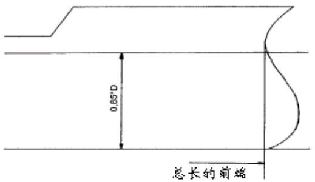
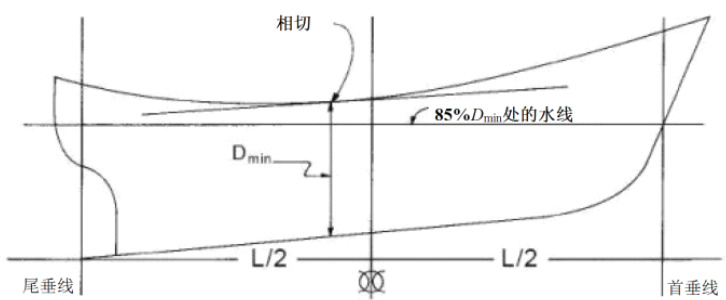
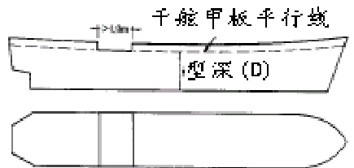
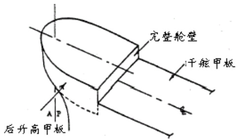
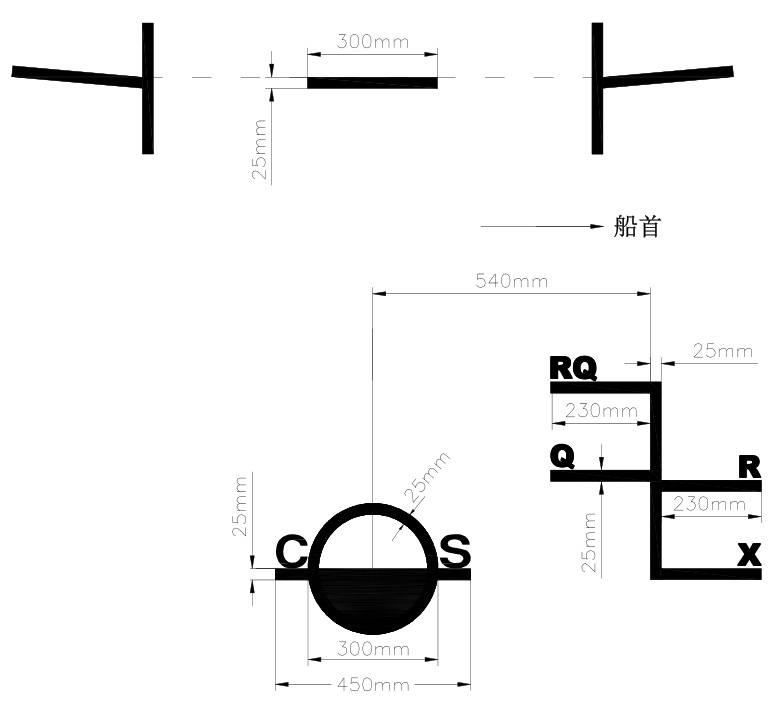
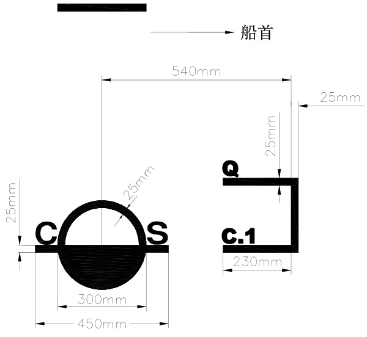
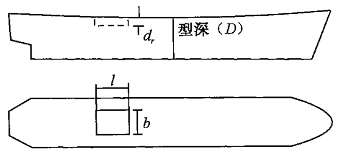
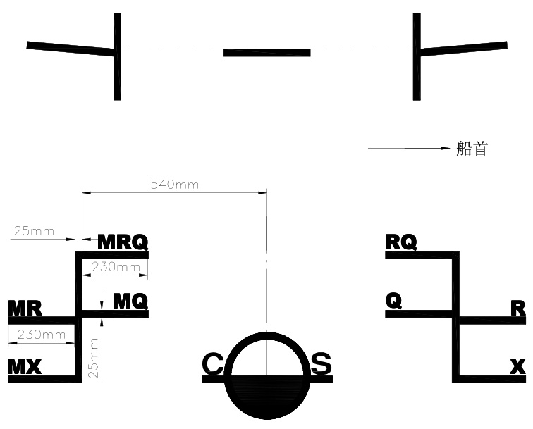
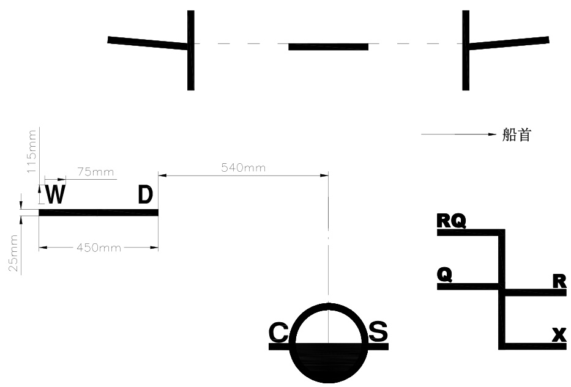

# 中华人民共和国海事局  

# 船舶与海上设施法定检验规则  

# 国内航行海船法定检验技术规则  

2020  

# 第 3 篇 载 重 线  

# 目 录  

# 第 1 章 通 则. 3-1  

第 1 节 一般规定. 3-1  
第 2 节 定 义. 3-1  
第 3 节 航行区域与季节划分. 3-4  
第 4 节 甲板线与载重线标志. 3-4  

# 第 2 章 核定干舷的条件. 3-6  

第 1 节 一般规定. .3-6  
第 2 节 开口关闭设备与密性. .3-6  
第 3 节 排水设备与船员保护设施. .. 3-12  
第 4 节 核定 A 型船舶干舷的特殊条件.. . 3-17  
第 5 节 遮蔽航区船舶的特殊规定. .3-17  
第 6 节 核定顶推船-驳船组合体干舷的特殊条件.. .3-18  

# 第 3 章 干舷计算. 3-19  

第 1 节 基本干舷.. .3-19  
第 2 节 干舷修正. .3-21  
第 3 节 最小季节干舷.. .3-26  

# 第 4 章 勘划木材载重线的特殊要求. 3-28  

第 1 节 一般规定. .3-28  
第 2 节 勘划木材载重线的条件. 3-28  
第 3 节 干舷计算.. .3-29  

# 第 5 章 半潜船的特殊要求. 3-31  

第 1 节 定 义. .3-31  
第 2 节 半潜作业状态下的储备浮力. .3-31  
第 3 节 半潜作业状态下的密性. .3-31  
第 4 节 最大沉深水线标志. 3-32  

# 第 6 章 工程船舶勘划作业吃水标志的特殊要求. 3-33  

第 1 节 一般规定. .3-33  
第 2 节 作业吃水的核定. .3-33  
第 3 节 核定挖泥船和泥驳作业吃水的特殊要求. . 3-33  
第 4 节 作业吃水标志.. .3-33  

# 附录1 A 型船舶 $K$ 值表 3-34  

# 附录2 B 型船舶 $K$ 值表. 3-36  

# 第 1 章 通 则  

# 第1 节 一般规定  

# 1.1.1 一般要求  

1.1.1.1 本篇规定不适用于高速船。  

1.1.1.2 按本篇规定勘划载重线的船舶，其强度应符合本局按规定程序认可和公布的中国船级社的适用规范的相应各项规定，其完整稳性和破损稳性应满足本法规第 4 篇的要求。如按本篇规定核定的干舷与强度、完整稳性及破损稳性所决定的干舷不一致时，取最大者。  

1.1.1.3 就本篇而言，重大改建包括：  

（1）改变船舶主尺度（船长、宽度或型深）；  

（2）A 型干舷改为 B 型干舷，或反之。  

1.1.1.4 重大改建船舶的载重线应满足现行标准。但本篇第 2 章（核定干舷的条件）内各条要求应仅适用于任何新增、更换或改装的结构和/或设备。  

# 第2 节 定 义  

1.2.1 本篇有关定义如下：  

（1）船长：  

$\textcircled{1}$ 船长（L）应取为量自龙骨板上缘的最小型深 $85\%$ 处水线总长的 $96\%$ ，或沿该水线从首柱前缘至舵杆中心的长度，取大者。  
$\textcircled{2}$ 对于无舵杆的船舶，船长（ $\smash{\ensuremath{\mathcal{L}}^{\prime}}$ ）取为最小型深 $85\%$ 处水线总长的 $96\%$ 。  
$\textcircled{3}$ 如在最小型深 $85\%$ 处水线以上的首柱外形为凹入的，则该水线总长的最前端和首柱前缘都应在该水线以上的首柱外形最后一点垂直投影在该水线上的点量起（见图 1.2.1）。  
$\textcircled{4}$ 龙骨设计成倾斜的船舶，其计量本船长的水线应和最小型深 $D_{m i n}$ 的 $85\%$ 处的设计水线平行，该水线由绘一平行于船舶（包括呆木）的龙骨线并与下图中干舷甲板型舷弧线相切的切线得到，此时最小型深为在切点处从龙骨板上缘量至干舷甲板舷侧处横梁上边的垂直距离（见图1.2.2）。  

  
图 1.2.1 船长量取示意图  

  
图 1.2.2 船长量取示意图  

（2）垂线：首尾垂线应取自船长（L）的前后两端。首垂线应与在计量船长的水线上的首柱前缘相重  

合。  

（3）船中：船中是船长（L）的中点。  

（4）宽度：除另有规定外，宽度 $(B)$ 是船舶的最大宽度，对金属船壳的船舶是在船中处量至两舷肋骨型线，其他材料的船舶在船中处量至两舷船壳的外表面。  

（5）型深：  

$\textcircled{1}$ 型深（ $D)$ ）是从龙骨板上缘量至干舷甲板舷侧处横梁上缘的垂直距离。对木质和混合材料结构船舶，从龙骨槽口的下缘量起。如船中剖面下部的形状是凹形，或装有加厚的龙骨翼板时，从船底的平坦部分向内延伸线与龙骨侧边相交之点量起。  
$\textcircled{2}$ 有圆弧形舷缘的船舶，应将舷缘视为方角，型深量到甲板和船侧型线延伸的交点。  
$\textcircled{3}$ 如干舷甲板为阶梯形且升高部分延伸到超过决定型深的点，型深应量到从该甲板较低部分甲板与升高部分相平行的基准线。  

（6）计算型深：  

$\textcircled{1}$ 计算型深（ $(D_{I}$ ）是船中处型深加干舷甲板边板的厚度。  
$\textcircled{2}$ 对于圆弧形舷缘半径大于宽度 $(B)$ 的 $4\%$ 或上部舷侧为特殊形状的船舶，计算型深 $(D_{I})$ 系取自一中剖面的计算型深，此剖面两舷上侧垂直并具有同样的梁拱，且上部剖面面积等于实际的中剖面的上部剖面面积。  

（7）方形系数：$\textcircled{1}$ 方形系数（ $C_{b}$ ）由下式确定：  

$$
C_{b}=\frac{\nabla}{L\cdot B\cdot d_{1}}
$$  

式中： $\nabla$ ——对于金属船壳的船舶是船舶的型排水体积，不包括附体；对于其他材料船壳的船舶是量到船体外表面的排水体积，两者均取自 $d_{1}$ 处的型吃水；$d_{I}$ ——最小型深的 $85\%$ 。  

$\textcircled{2}$ 计算多体船的方形系数时，应取用本条（4）定义的宽度 $(B)$ ，而不是单个船体的宽度。  

（8）干舷：核定的干舷是在船中处从甲板线的上边缘向下量至相关载重线的上边缘的垂直距离。  

（9）干舷甲板：  

$\textcircled{1}$ 干舷甲板通常是最上层露天全通甲板。干舷甲板上所有的露天开口设有永久性关闭装置，干舷甲板以下在船侧的所有开口设有永久性水密关闭装置。  
$\textcircled{2}$ 下层甲板作为干舷甲板：可将某一下层甲板指定为干舷甲板，条件是该甲板至少在机器处所与首、尾尖舱舱壁之间是全通的和永久性的前后连续甲板，并且横向也是连续的。（a）当该下层甲板为阶梯形时，甲板最低线及其平行于甲板上部的延长部分取为干舷甲板。（b）当指定某一下层甲板为干舷甲板时，就干舷的核定条件和计算而言，该干舷甲板以上的船体部分作为上层建筑处理。干舷是从这层甲板算起。（c）当指定某一下层甲板为干舷甲板时，在货舱范围内，该干舷甲板的结构应至少在舷侧和在至上甲板的每一水密舱壁处设有适当的框架结构桁材。这些桁材的宽度应方便安装，并应考虑船舶的结构和操作情况。桁材的任何布置也应能满足结构上的要求。  

$\textcircled{3}$ 不连续干舷甲板，阶梯形干舷甲板：  

（a）如果干舷甲板的凹槽延伸到两舷侧且长度超过 $\mathrm{1m}$ ，则该露天甲板的最低线及其平行于甲板上部的延伸部分取为干舷甲板（见图1.2.3）。  
（b）如果干舷甲板的凹槽未延伸到两舷侧，则甲板上部取为干舷甲板。  
（c）如果露天甲板以下的一层甲板指定为干舷甲板且其设有未从一舷侧延伸至另一舷侧的凹槽，只要露天甲板上的所有开口设有风雨密关闭装置，则该凹槽可以不计。  
（d）应适当考虑露天凹槽的排水系统和自由液面对稳性的影响。  

（e）（a）至（d）的各项规定不适用于挖泥船、开底泥驳或设有大开口舱的其他类似船舶，对这类船舶的每一种均需要单独考虑。  

  
图 1.2.3 干舷甲板选取示意图  

（10）上层建筑：  

$\textcircled{1}$ 上层建筑是在干舷甲板上的甲板建筑物，从舷边跨到舷边或其侧壁板离船壳板向内不大于船舶宽度 $(B)$ 的 $4\%$ 。  
$\textcircled{2}$ 封闭的上层建筑是一种具备下列设施的上层建筑：（a）结构坚固的封闭围壁；（b）这些围壁的出入开口（如有时）设有符合本篇第 2 章 2.2.1 规定的门；（c）上层建筑侧壁或端壁的所有其他开口设有有效的风雨密关闭装置。桥楼或尾楼不应视为封闭的，除非当端壁开口封闭时，有通道供船员随时自全通的最上层露天甲板或更高甲板上的任何一处用其他方式前往这些上层建筑内的机器处所和其他工作处所。  
$\textcircled{3}$ 上层建筑的高度是指在船侧从上层建筑甲板横梁顶到干舷甲板横梁顶的最小垂直高度。  
$\textcircled{4}$ 上层建筑的长度（ $(S)$ 是指上层建筑位于船长（L）以内部分的平均长度。  
$\textcircled{5}$ 桥楼：是指不延伸到首垂线或尾垂线的上层建筑。  
$\textcircled{6}$ 尾楼：是指自尾垂线向前延伸到首垂线后某一位置的上层建筑。尾楼可以起始于尾垂线后的某一位置。  
$\textcircled{7}$ 首楼：是指自首垂线向后延伸到尾垂线前某一位置的上层建筑。首楼可以起始于首垂线前的某一位置。  
$\textcircled{8}$ 全上层建筑：全上层建筑是最低限度自首垂线延伸到尾垂线的上层建筑。  
$\textcircled{9}$ 后升高甲板：是指自尾垂线向前延伸的上层建筑，一般而言，其高度小于标准上层建筑高度，并有完整的前舱壁（非开启式舷窗设有有效风暴盖，人孔盖用螺栓固定）（见图1.2.4）。如果前舱壁因设有门和通道开口而不是完整的，则该上层建筑应视为尾楼。  

  
图 1.2.4 后升高甲板  

（11）上层建筑甲板：上层建筑甲板是构成上层建筑上部边界的甲板。（12）平甲板船：平甲板船是指干舷甲板上没有上层建筑的船（13）风雨密：风雨密是指任何海况下水都不会透入船内。  

（14）水密：水密是指能够在任何方向上具有以适当程度抵抗所须承受的最大水压头压力而防止水透过结构的能力。  

（15）阱：阱是位于露天甲板上水能聚积起来的区域。阱视为由甲板结构的两个或多个边界围成的甲板区域。  

# 第 3 节 航行区域与季节划分  

1.3.1 国内航行海船的航行区域与季节划分如下：  

（1）汕头以北的中国沿海：季节期：热带：自 4 月 16 日至 10 月 31 日；夏季：自 11 月 1 日至 4 月 15 日。  

（2）汕头以南的中国沿海：季节期：热带：自 2 月 16 日至 10 月 31 日；夏季：自 11 月 1 日至 2 月 15 日。  

汕头港应被当作处于船舶驶来或驶往的区域内。  

# 第4 节 甲板线与载重线标志  

1.4.1 应在船舶两舷勘划甲板线和载重线标志，甲板线和载重线标志的式样及尺寸如图 1.4.1 所示。  

  
图 1.4.1 载重线标志示意图（右舷）  

1.4.2 甲板线系指长为 $300\mathrm{mm}$ 、宽为 $25\mathrm{mm}$ 的水平线，该线勘划于船中的左、右舷，其上边缘一般应经过干舷甲板的上表面向外延伸与船壳板外表面的交点。如按此勘划有困难，甲板线也可勘划在船中每舷的某一适当位置，但应对干舷作相应的修正，并在国内航行海船安全与环保证书中标明。  

1.4.3 载重线标志系由一圆环和一水平线相交组成，其圆环的中心在船中处，水平线上边缘通过圆环中心。圆环的中心至甲板线上边缘的垂直距离为夏季干舷。该水平线的下半圆部分与标志均为一色。  

在载重线圆环两侧加绘字母，当由中国船级社勘划载重线时为 CS，其他情况为 ZC。字母高 $115\mathrm{mm}$ ，宽 $75\mathrm{mm}$ 。  

1.4.4 载重线系船舶按其航行区域和季节而定的载重水线，分别以水平线段表示，勘划在载重线圆环前方。各载重线均以线段上边缘为准。  

标“X”的线段表示夏季载重线，其上边缘通过圆环中心。  

标“R”的线段表示热带载重线。  

标“Q”的线段表示夏季淡水载重线。夏季淡水载重线和夏季载重线之间的差数，也是其他各载重线在淡水中装载的允许差额。  

标“RQ”的线段表示热带淡水载重线。  

1.4.5 如船舶所核定的干舷比最小干舷大，且其载重线是勘划在相当或低于根据本篇所核定的最小干舷相应的夏季载重线位置时，可仅勘划淡水载重线。  

1.4.6 按本法规第 4 篇有关的分舱要求核定干舷的客船，应勘划淡水载重线及分舱载重线 C.1 如图1.4.6 所示。对于淡水载重线与分舱载重线之间的距离较小的船舶，若采用图 1.4.6 难以区分载重线的位置，可将分舱载重线 C.1 勘划于垂线前方。  

  
图 1.4.6 客船载重线标志示意图（右舷）  

1.4.7 载重线标志应永久性地勘划在船舷两侧，对标圈、线段和字母，当船舷为暗色底时，应漆成白色或黄色，当船舷为浅色底时，应漆成黑色。这些标志应能清晰可见，必要时应为此作出专门的安排。  

1.4.8 在认定这些标志是正确地和永久性地勘划在船舷两侧之前，不应签发国内航行海船安全与环保证书。对客船所勘划的分舱载重线也应载入国内航行海船安全与环保证书。  

1.4.9 如船舶设计为需要过桥而进行压载，且需要浸没夏季载重线标志时，其稳性和强度应经船舶检验机构批准，并在国内航行海船安全与环保证书的备注栏标注过桥作业的最大吃水、风和浪限制条件。  

# 第 2 章 核定干舷的条件  

# 第1 节 一般规定  

2.1.1 按本篇第 3 章、第 4 章核定干舷的船舶，其开口关闭设备、排水设备和船员保护设施应全部符合本章的规定。  

# 第2 节 开口关闭设备与密性  

# 2.2.1 封闭上层建筑的门  

2.2.1.1 封闭上层建筑端壁上的所有出入口，应装设钢质或其他相当材料的门，永久地和牢固地装在端壁上，并应有加强筋加强，使整个结构与完整的端壁具有同等的强度，并在关闭时保持风雨密。保证风雨密的装置应包括衬垫和夹扣装置或其他相当的装置，并应永久装固于端壁或门上，同时这些门应在端壁两面都能进行操作。  

2.2.1.2 除另有规定外，封闭上层建筑端壁上出入口的门槛高度，应高出甲板至少 $380\mathrm{mm}$ 。  

2.2.1.3 门均应向外侧开启以增加对海水冲击的保护。  

2.2.1.4 应避免采用可拆移的门槛，然而为了便于装卸笨重的备件或类似物件，可以采用可拆移的门槛，但是应满足下列条件：  

（1）在船舶离港之前，应将门槛装复；  
（2）门槛应有衬垫装置并应用间距紧密的贯穿螺栓紧固。  

# 2.2.2 舱口、升降口和通风筒的位置  

2.2.2.1 舱口、升降口和通风筒按其位置分为：  

（1）“位置 1”：在干舷甲板上和后升高甲板上，或者低于干舷甲板以上一个标准上层建筑高度的其他露天甲板上，或者位于从首垂线起 1/4 船长以前且低于干舷甲板以上两个标准上层建筑高度的露天甲板上。  

（2）“位置 2”：位于从首垂线起 1/4 船长以后，在干舷甲板以上至少一个标准上层建筑高度且低于干舷甲板以上两个标准上层建筑高度的露天甲板上。或者，位于从首垂线起 1/4 船长以前，在干舷甲板以上至少两个标准上层建筑高度且低于干舷甲板以上三个标准上层建筑高度的露天甲板上。  

上述露天甲板包括上层建筑、甲板室、升降口和其他类似甲板结构的顶部甲板。  

# 2.2.3 货舱口及其他舱口  

2.2.3.1 处于“位置 1”和“位置 2”的货舱口和其他舱口的结构及其保持风雨密的方法，至少应相当于本章 2.2.4 及 2.2.5 的要求。  

2.2.3.2 干散货船舱口盖（本条不适用于专用集装箱船）  

（1）对于 3000 总吨及以上的干散货船，应配备符合本章 2.2.5 规定的风雨密钢质舱口盖，并应采用机械动力开启和关闭舱口盖；  

（2）对于 500 总吨及以上但小于 3000 总吨的干散货船，应配备采用机械动力开启和关闭的钢质舱口盖，可通过符合本章 2.2.4 规定的舱盖布及封舱压条保证风雨密；  

（3）对于小于 500 总吨的干散货船，可配备符合本章 2.2.4 规定的活动舱盖，通过加舱盖布及封舱压条保证风雨密。  

# 2....2....4 采用活动舱口盖关闭且用舱盖布和封舱压条保证风雨密的舱口  

# 2.2.4.1 舱口围板  

以活动舱盖关闭以及用舱盖布和封舱压条来保证风雨密的舱口围板的结构应坚固，其在甲板上的最小高度在“位置 1”时，应为 $600\mathrm{mm}$ ；在“位置 $2^{\prime\prime}$ 时，应为 $450\mathrm{mm}$ 。  

# 2.2.4.2 舱口盖  

（1）舱口盖每一支承面的宽度应至少为 $65\mathrm{mm}$ ；  

（2）当舱口盖为木质时，其加工后厚度至少为 $60\mathrm{mm}$ ，且其跨距不大于 $1.5\mathrm{m}$ ；（3）如舱口盖用钢质制成，对“位置 $1^{\prime\prime}$ 的舱口，其强度应以假定负荷不小于 $17.16\mathrm{{kPa}}$ 来计算，对“位置 2”的舱口，其强度应以假定负荷不小于 $12.75\mathrm{{kPa}}$ 来计算，并且按此计算所得的最大应力与系数 4.25的乘积，应不超过材料的极限强度的最小值。舱盖的设计应使在该负荷下其挠度不大于跨距的 0.0028 倍；（4）对于船长在 $100\mathrm{m}$ 以下的船舶，上述（3）要求的假定负荷可适当降低。对于船长为 $20\mathrm{m}$ 的船舶，“位置 1”与“位置 $2^{\prime\prime}$ 的舱口上，其假定负荷可分别降低到 $9.72\mathrm{{kPa}}$ 与 $7.29\mathrm{{kPa}}$ 。对船长在大于 $20\mathrm{m}$ 且小于 $100\mathrm{m}$ 的船舶，其负荷值应用线性内插法求得。  

# 2.2.4.3 活动梁  

当支承舱口盖的活动梁为钢质时，对“位置 1”的舱口，其强度应以假定负荷不小于 $17.16\mathrm{{kPa}}$ 来计算，对“位置 $2^{\prime\prime}$ 的舱口，其强度应以假定负荷不小于 $12.75\mathrm{{kPa}}$ 来计算，并且按此计算的最大应力与系数 5 的乘积，应不超过材料的极限强度的最小值。梁的设计应使在该负荷下其挠度不大于跨距的 0.0022 倍。对船长不超过 $100\mathrm{m}$ 的船舶，应满足本章 2.2.4.2（4）的要求。  

# 2.2.4.4 箱形舱口盖  

（1）当采用代替活动梁和舱盖的箱形舱口盖是用钢质制成时，其强度应以本章 2.2.4.2（3）所规定的假定负荷来计算，并且按此计算的最大应力与系数 5 的乘积，应不超过材料极限强度的最小值。它的设计应使在该负荷下其挠度不大于跨距的 0.0022 倍。制造盖顶的钢板厚度应不小于加强筋间距的 $1\%$ 或 $6\mathrm{mm}$ ，取较大者。对于船长不大于 $100\mathrm{m}$ 的船舶，应满足本章 2.2.4.2（4）的要求。  

（2）用钢质以外的其他材料制成的箱形舱盖，其强度和刚度应相当于钢质制成者，并需经认可。  

# 2.2.4.5 舱口梁座或插座  

活动梁的梁座或插座应结构坚固，并应具有有效的装配和紧固活动梁的装置。如所使用的梁为滚动式，其装置应能保证在舱口关闭后梁能正确保持在原位上。  

# 2.2.4.6 舱口楔耳  

舱口楔耳的安装应适合楔子的斜度。楔耳宽至少应为 $65\mathrm{mm}$ ，其中心间距不大于 $600\mathrm{{mm}}$ ；沿舱口每侧或每端的楔耳距舱口转角的距离，应不大于 $150\mathrm{mm}$ 。  

# 2.2.4.7 封舱压条和楔子  

封舱压条和楔子应坚固并处于良好状态。楔子应用坚韧的木材或其他相当的材料。楔子斜度应不大于1:6，且其尖头的厚度应不小于 $13\mathrm{mm}$ 。  

# 2.2.4.8 舱口盖布  

在“位置 1”和“位置 $2^{\cdot\mathnormal{,}\mathnormal{,}}$ 的每一舱口，至少应备有两层良好的舱口盖布。舱口盖布应是防水的和有足够的强度，其材料应经认可。  

# 2.2.4.9 舱口盖的固定  

在“位置 1”和“位置 2”的所有舱口，应备有钢压条或其他相当的装置，以便在舱盖布封舱以后能有效独立地固定在舱口盖的各段。舱口盖的长度超过 $1.5\mathrm{m}$ 时，应至少用这样的 2 套紧固装置来固定。  

# 2....2....5 设有衬垫和夹扣装置的风雨密钢质舱盖或其他相当材料舱盖所封闭的舱口  

# 2.2.5.1 舱口围板  

在“位置 1”和“位置 2”的舱口，设有衬垫和夹扣装置的风雨密钢质舱盖或其他相当材料舱盖的舱口围板，在甲板以上的高度应符合本章 2.2.4.1 的规定。如确认在任何风浪条件下并不影响船舶安全，则此  

围板高度可以减小或完全取消。如设有舱口围板，则它们的结构应坚固。  

# 2.2.5.2 风雨密舱口盖  

（1）如果风雨密舱口盖是用钢质材料制成，对“位置 1”的舱口，其强度应按假定负荷不小于 17.16kPa来计算，对“位置 $2^{\prime\prime}$ 的舱口，其强度应按假定负荷不小于 $12.75\mathrm{{kPa}}$ 来计算，并且按此计算的最大应力与系数4.25 的乘积，应不超过材料的极限强度的最小值。舱盖的设计应使在假定该负荷下其挠度不大于跨距的 0.0028 倍。作为舱盖顶面的钢板，其厚度应不小于加强筋间距的 $1\%$ 或 $6\mathrm{mm}$ ，取较大者。对于船长不大于 $100\mathrm{m}$ 的船舶，应满足本章 2.2.4.2（4）的要求。  

（2）用钢质以外的其他材料制成的舱盖，其强度和刚度应相当于钢质制成者，并需经认可。  

# 2.2.5.3 保证风雨密的装置  

保证和维持风雨密的装置，应经认可。这种装置应能保证在任何风浪情况下保持密闭，为此在初次检验时，应要求作密性试验，而在定期检验和年度检验时或在较短的间隔期内，也可要求试验。  

# 2.2.6 机舱开口  

2.2.6.1 在“位置 1”和“位置 $2^{\prime\prime}$ 的机舱开口应有适当的构架，并用足够强度的钢质舱棚有效地围闭，如果舱棚没有其他结构保护，其强度要作特殊考虑。上述舱棚的出入口，应装设符合本章 2.2.1.1 规定的门，如果在“位置 1”，门槛应至少高出甲板 $600\mathrm{mm}$ ，如果在“位置 $2^{\prime\prime}$ ，应至少高出甲板 $380\mathrm{mm}$ 。在上述舱棚中的其他开口，应设有同等的罩盖，永久附装在它的适当位置上。  

2.2.6.2 对核定的干舷小于本篇第 3 章 B 型船舶 3.1.1.1 所列基本干舷的船舶，如果机舱棚没有其他结构保护，则应装设双道门（即符合本章 2.2.1.1 规定的内门和外门），且内门门槛高度应为 $230\mathrm{mm}$ ，外门门槛高度应为 $600\mathrm{mm}$ 。  

2.2.6.3 干舷甲板或上层建筑甲板上露天部分的任何机炉舱顶棚、烟囱或机舱通风筒的围板，应合理地和切实可行地高出甲板。一般情况下，须向机舱连续供风的通风筒应装设符合本章 2.2.8.3 规定的有足够高度的围板，而不必装设风雨密关闭装置。须向应急发电机舱连续供风的通风筒，如果在稳性计算中计入其浮力或视其为通向下层的防护开口，则应装设符合本章 2.2.8.3 规定的有足够高度的围板，而不必装设风雨密关闭装置。  

2.2.6.4 如因船舶大小和布置而使得本章 2.2.6.3 的规定不切合实际情况，机舱和应急发电机舱的通风筒围板可取较小的高度，但应按照本章 2.2.8.4 装设风雨密关闭装置，并且应有其他适当的布置确保不间断地为这些处所提供适当的通风。  

2.2.6.5 机炉舱顶棚开口应装设钢质的或其他相当材料的坚固罩盖，永久附装在它们的适当位置上，并能保证风雨密。  

# 2.2.7 干舷甲板和上层建筑甲板的开口  

2.2.7.1 在“位置 1”或“位置 2”，或在非封闭上层建筑内的人孔或平的小舱口，应用能达到水密的坚固罩盖关闭。除非使用间隔紧密的螺栓紧固，否则罩盖应永久地附装于开口处。  

2.2.7.2 在干舷甲板上，除舱口、机舱开口、人孔和平的小舱口以外的开口，应有封闭的上层建筑，或甲板室，或强度相当和风雨密的升降口来防护。类似地，在露天的上层建筑甲板或在干舷甲板上的甲板室顶部，通往干舷甲板以下的处所或封闭的上层建筑以内的处所的任何此种开口，应用坚固的甲板室或升降口来保护。通向或通往前往下层的梯道的上述升降口或甲板室的门口应按本章 2.2.1.1 的要求装设门。作为替代措施，如果甲板室内的梯道被封闭在设有符合本章 2.2.1.1 的规定的门的结构坚固的升降口内，则外门不必风雨密。  

2.2.7.3 后升高甲板或小于标准高度的上层建筑，如其高度等于或大于标准后升高甲板高度，则位于这些甲板上的甲板室顶部的开口应设有适当的关闭装置，不必用本条规定的坚固的甲板室或升降口来保护，但甲板室的高度至少应为一个标准上层建筑高度。对位于小于一个标准上层建筑高度的甲板室上的甲板室，其顶部的开口可以用类似方式处理。  

2.2.7.4 在“位置 1”，升降口门口的门槛，在甲板以上的高度应至少为 $600\mathrm{mm}$ ，在“位置 $2^{\prime\prime}$ ，则应至少为 $380\mathrm{mm}$ 。2.2.7.5 如果按照本篇第 1 章 1.2.1（10） $\textcircled{2}$ 在上层甲板上设有补充出入口代替干舷甲板上的出入口，则进入桥楼或尾楼的门槛高度应至少为 $380\mathrm{mm}$ 。干舷甲板上的甲板室也应按此处理。2.2.7.6 如果未在上层甲板设有出入口，则干舷甲板上甲板室门口的门槛高度应为 $600\mathrm{mm}$ 。2.2.7.7 如果上层建筑和甲板室的出入口关闭装置不符合本章 2.2.1.1 的规定，则内部甲板开口应视为露天的。  

# 2.2.8 通风筒  

2.2.8.1 在“位置 1”或“位置 2”，通往干舷甲板或封闭上层建筑甲板以下的处所的通风筒，应有钢质的或其他相当材料的围板，其结构应坚固，并且与甲板牢固地连接。如任何通风筒的围板高度超过$900\mathrm{mm}$ ，则必须有专门的支撑。  

2.2.8.2 通过非封闭的上层建筑的通风筒，应在干舷甲板上有坚固结构的钢质的或其他相当材料的围板。  

2.2.8.3 在“位置 1”的通风筒，其围板高出甲板以上 $4.5\mathrm{m}$ ；在“位置 2”的通风筒，其围板高出甲板以上 $2.3\mathrm{m}$ ；除有特殊要求外，一般不需装设关闭装置。对于沿海航区和遮蔽航区航行船舶的通风筒围板高度，对“位置 $1^{\prime\prime}$ 要求的 $4.5\mathrm{m}$ 可用本篇第 3 章表 3.2.2.1 中对应的其他上层建筑标准高度的 2 倍替代；对“位置 $2^{\prime\prime}$ 要求的 $2.3\mathrm{m}$ 可用本篇第 3 章表3.2.2.1 中对应的其他上层建筑标准高度替代。  

2.2.8.4 除本章 2.2.8.3 规定以外，通风筒的开口应具备有效的风雨密关闭设备。对船长不超过 $100\mathrm{m}$ 的船舶，其关闭设备应永久地附装于通风筒上；其他船舶，如不是这样装设的，它们应方便地贮存在指定附装的通风筒附近。在“位置 $1^{\prime\prime}$ 的通风筒，甲板以上的围板高度至少应为 $900\mathrm{mm}$ 。在“位置 2”的通风筒，甲板以上的围板高度至少应为 $760\mathrm{mm}$ 。  

# 2.2.9 空气管  

2.2.9.1 如压载水舱或其他液舱的空气管伸到干舷甲板或上层建筑甲板之上，其露出部分应结构坚固；自甲板至水可能从管口进入下面的那一点的高度，在干舷甲板上至少应为 $760\mathrm{mm}$ ，在上层建筑甲板上至少为 $450\mathrm{mm}$ 。  

2.2.9.2 空气管应装设自动关闭装置。  
2.2.9.3 液货船上可使用压力真空阀（PV 阀）。  

# 2.2.10 货舱舷门和其他类似开口  

2.2.10.1 干舷甲板以下船舷两侧的货舱舷门和其他类似开口应装设门，其设计应确保与周围外板有相同的水密性和结构完整性。除经船舶检验机构同意外，这些门均应向外开启。上述开口的数目应为符合船舶设计意图和正常工作需要的最低数目。  

2.2.10.2 除经船舶检验机构同意外，本章 2.2.10.1 中所述开口的下边缘不应低于船侧干舷甲板的平行线，该线最低点在最高载重线上边缘以上至少 $230\mathrm{mm}$ 。  

2.2.10.3 如果准许货舱舷门和其他类似开口的下边缘布置于低于本章2.2.10.2 的规定，则应另行设置专门装置保持水密完整性。  

2.2.10.4 设置同等强度和水密性的第二道门是一种可接受的布置，但在两道门之间的舱室中应设有渗漏探测器。从该舱室向舱底排水应布置为由便于使用的螺旋阀控制。外门应向外开启。  

2.2.10.5 首门及其内门、舷门、尾门及其密封的设置应满足本局按照规定程序认可和公布的中国船级社的要求或相当安全水平的适用国家标准的要求。  

# 2.2.11 泄水孔、进水孔和排水孔  

2.2.11.1 泄水孔、进水孔和排水孔布置的一般要求  

（1）除本章 2.2.11.2 规定者外，从干舷甲板以下处所或从装有符合本章 2.2.1 规定的门的干舷甲板上  
的上层建筑和甲板室内通过船壳的排水孔，均应装设坚固的和易于到达的设备，以防水浸入船内。通常每  
一独立的排水口应有一个自动止回阀，并且备有从干舷甲板上某一位置能直接关闭它的装置。如果排水管  
的船内一端位于夏季载重线以上超过 $0.01~L$ ，则排水口可以有两个自动止回阀而不需要直接关闭装置。如  
果上述垂直距离超过 $0.02L$ ，则可以使用单一的自动止回阀而不需要直接关闭装置。操纵直接关闭阀的装  
置应便于使用，并在操纵位置设有表示该阀是开或闭的指示器。（2）可允许使用一个自动止回阀和一个从干舷甲板以上控制的闸阀来代替一个自动止回阀及其在干  
舷甲板以上位置的直接关闭装置。（3）如果要求有两个自动止回阀，则为了便于在营运条件下进行检查，船内端的阀应易于到达，（即  
该船内端的阀应位于热带载重线高度以上）。如果这是不切合实际的，则只要在两个自动止回阀之间设置  
一个就地控制的闸阀，船内端的阀就不必装设在热带载重线以上。（4）如果卫生排水孔及泄水孔在机器处所范围内通过船壳排向船外，则可允许在船内端装设一个止  
回阀，同时在船壳上装设一个就地操纵的直接关闭阀，且该阀的控制设备应位于易于到达的位置。（5）当核定木材干舷时，排水孔船内端的位置应考虑夏季木材载重线。（6）对止回阀的要求仅适用于船舶正常营运时保持开启的排水孔。对在海上保持关闭的排水孔，可  
允许使用从甲板上操纵的单一螺旋阀。（7）表 2.2.11.1 给出了泄水孔、进水孔和排水孔可接受的布置。  

表 2.2.11.1  

泄水孔、进水孔和排水孔可接受的布置  

<html><body><table><tr><td colspan="8">来自干舷甲板以下或干甲板上的封闭处所排水</td><td colspan="4">从其他处所排水</td></tr><tr><td colspan="2">一般要求： 2.2.11.1,对于船内端 位于SWL以上≤</td><td rowspan="2">通过机舱的 排水口</td><td colspan="3">位于SWL以上>0.01L</td><td colspan="2">替代措施（2.2.11.1)，对于船内端 位于 SWL 以上 >0.02 L</td><td colspan="2">船外端位于干舷甲板以 下>450 mm或SWL以 上≤ 600 mm 2.2.11.4</td><td colspan="2">其他 2.2.11.5</td></tr><tr><td colspan="2">甲板</td><td colspan="4">千舵甲板</td><td colspan="2"></td><td></td><td>千舷甲板</td></tr><tr><td colspan="3">千舷甲板</td><td colspan="4"></td><td colspan="2">千舵甲板</td><td>千舷甲板</td><td></td></tr><tr><td colspan="2"></td><td>平 夏季术线</td><td colspan="4">复 热带术线</td><td>夏季水线</td><td>夏季女 水线</td><td></td><td colspan="2"></td></tr><tr><td></td><td></td><td colspan="2"></td><td>线</td><td></td><td></td><td></td><td></td><td colspan="2"></td><td>夏季术线</td></tr><tr><td colspan="10"></td><td colspan="2"></td><td></td></tr><tr><td colspan="10">符号子的船内端 √管子的船外端 管子终止在开甲板上 特别厚度 有直接关闭装置的就地控制止回阀 就地控制阀</td><td colspan="3">干遥控 正常厚度</td></tr></table></body></html>

注：表中 SWL 系指夏季载重线。  

2.2.11.2 如干舷甲板边缘在船舶左或右横倾 $5^{\circ}$ 时未被淹没，才可允许从用于载货的封闭上层建筑引出通过船壳的泄水孔。否则，泄水应引向船内。  

2.2.11.3 在人工操纵的机器处所，与机器运转有关的海水主、副进水口和排水口可以就地控制。控制设备应便于使用，并应在操纵位置设有表示阀开关状态的指示器。2.2.11.4 开始于任何水平面的泄水孔和排水管，不论是在干舷甲板以下大于 $450\mathrm{mm}$ 处，或在夏季载重水线以上小于 $600\mathrm{mm}$ 处穿过船壳，均应在船壳上设有止回阀。除本章 2.2.11.1 所要求的以外，如管系有足够厚度，此阀可以省略（见本章2.2.11.7）。2.2.11.5 由未装设符合本章 2.2.1 规定的门的上层建筑或甲板室引出的泄水孔，应通到舷外。2.2.11.6 所有外板上的附件和本条要求的阀应用钢、青铜或其他经认可的韧性材料制成。不允许采用普通铸铁或类似材料制成的阀。本条所涉及的一切管系，应用钢或经认可的其他相当材料制成。  

2.2.11.7 泄水管和排水管：  

（1）对泄水管和排水管如无足够厚度要求：$\textcircled{1}$ 对外径等于或小于 $155\mathrm{mm}$ 的管子，厚度应不小于 $4.5\:\mathrm{mm}$ ；$\textcircled{2}$ 对外径等于或大于 $230\mathrm{mm}$ 的管子，厚度应不小于 $6\mathrm{mm}$ 。外径尺寸如为中间值，厚度应由线性内插确定。  

（2）对泄水管和排水管如有足够厚度要求：  

$\textcircled{1}$ 对外径等于或小于 $80\mathrm{mm}$ 的管子，厚度应不小于 $7\mathrm{mm}$ ；  
$\textcircled{2}$ 对外径为 $180\mathrm{mm}$ 的管子，厚度应不小于 $10\mathrm{mm}$ ；  
$\textcircled{3}$ 对外径等于或大于 $220\mathrm{mm}$ 的管子，厚度应不小于 $12.5\mathrm{mm}$ 。外径尺寸如为中间值，厚度应用线性内插法确定。  

# 2.2.12 垃圾滑道  

2.2.12.1 可允许使用两个从滑道的工作甲板上控制的闸阀代替在干舷甲板以上位置直接关闭的止回阀，但应符合以下规定：  

（1）低位闸阀应从干舷甲板以上位置控制。两个阀之间应装设一个连锁系统；（2）滑道船内端应位于船舶在相应于夏季干舷的吃水处向左舷或右舷横倾 $8.5^{\circ}$ 所形成的水线以上，但应在夏季水线以上不小于 $1000\mathrm{mm}$ 。如果船内端在夏季水线以上超过 $0.01\mathrm{~L~}$ ，则只要船内的闸阀在营运情况下始终便于使用，该阀可不要求从干舷甲板上控制；（3）作为替代措施，可以在滑道的船内端设置一个铰链式风雨密盖及一个排放盖板代替上面的和下面的闸阀。风雨密盖与盖板应装设一个连锁装置，以使盖板在风雨密盖关闭前不能启动。2.2.12.2 整个滑道，包括盖，应采用有足够厚度的材料制成。2.2.12.3 闸阀的控制器和/或铰链式盖上应清楚地标明“不使用时，保持关闭”。2.2.12.4 对客船，如果滑道的船内端位于干舷甲板以下，或对适用破损稳性要求的货船，如果滑道的船内端位于平衡水线以下，则：（1）船内端铰链式盖/阀应为水密；（2）阀应为装设在最深载重线以上便于使用位置的螺旋止回阀；（3）螺旋止回阀应从舱壁甲板以上位置控制并装设有开启/关闭指示器。阀的指示器上应清楚地标明“不使用时，保持关闭”。  

# 2.2.13 舷窗，窗和天窗  

2.2.13.1 舷窗和窗连同其玻璃、窗盖 和风暴盖（如装设），应按经批准的设计，并具有坚固的结构。不允许采用非金属框架。  

2.2.13.2 舷窗的定义为面积不超过 $0.16\mathrm{m}^{2}$ 的圆形或椭圆形开口。面积超过 $0.16\mathrm{m}^{2}$ 的圆形或椭圆形开口应作为窗处理。  

2.2.13.3 窗的定义为一般呈方形的开口，在其每个角隅具有一个与方窗尺度相适应的圆弧过渡，以及  

面积超过 $0.16\mathrm{m}^{2}$ 的圆形或椭圆形开口。  

2.2.13.4 下列处所的舷窗应装设铰链式内侧窗盖：  

（1）干舷甲板以下的处所；  

（2）第一层封闭上层建筑内的处所；  

（3）在干舷甲板上保护通往下层的开口或稳性计算中计入浮力的第一层甲板室。  

窗内盖如设在干舷甲板以下，应能水密关闭和紧固，如设在干舷甲板以上，应能风雨密关闭和紧固。  

2.2.13.5 舷窗不应设在这样的位置上，即其窗槛低于船侧处的干舷甲板平行线，该线的最低点在夏季载重线（或夏季木材载重线，如已核定）以上的距离为船舶宽度 B 的 $2.5\%$ 或 $500\mathrm{mm}$ ，取较大者。  

2.2.13.6 如果要求的破损稳性计算表明，舷窗在进水的任何中间阶段或平衡水线会被淹没，则舷窗应为非开启型。  

2.2.13.7 窗不应装设在下列位置：  

（1）干舷甲板以下；  

（2）封闭上层建筑第一层的端壁或侧壁；  

（3）稳性计算中计入浮力的第一层甲板室。  

2.2.13.8 如果上层建筑保护通往下层开口的直达通道，或在稳性计算中计入浮力，则该第二层上层建筑侧壁上的舷窗和窗，应装设能够风雨密关闭和紧固的铰链式内侧窗盖。  

2.2.13.9 如果第二层上层建筑保护向下通往本章 2.2.13.4 中所列处所的直达通道，则其侧壁以内的边舱壁上的舷窗和窗应装设铰链式内侧窗盖，或如果该窗易于到达时，则应装设能够风雨密关闭和紧固的永久性附装的外部风暴盖。  

2.2.13.10 第二层或以上的上层建筑的居住舱室舱壁和门，将舷窗和窗同直接通往下层或通往在稳性计算中计入浮力的第二层上层建筑的通道分隔开，该居住舱室舱壁和门可替代装设在舷窗和窗上的窗盖或风暴盖。  

2.2.13.11 位于后升高甲板上或小于标准高度的上层建筑甲板上的甲板室，如果后升高甲板或上层建筑的高度等于或大于后升高甲板标准高度，就对于窗盖的要求而言，可视为在第二层。  

2.2.13.12 如同对舷窗和窗的要求一样，固定式或开启式天窗的玻璃厚度应与其尺寸和位置相适应。任何位置上的天窗玻璃都应予以防护以免机械损坏，如果设在“位置 1”或“位置 2”，则应装有永久性附连的窗盖或风暴盖。  

# 2.2.14 锚链管和锚链柜  

2.2.14.1 远海航区船舶的锚链管和锚链柜应水密延伸至露天甲板。若设有出入口，则应用坚固的盖关闭并用间距紧密的螺栓紧固。  

2.2.14.2 其他航区船舶的锚链管和锚链柜应水密延伸至干舷甲板，且若在干舷甲板以下的锚链管和锚链柜上设出入口，则应用坚固的盖关闭并用间距紧密的螺栓紧固。若设有上层建筑，则锚链管和锚链柜至少应自干舷甲板风雨密延伸至露天甲板，且若在该延伸的锚链管和锚链柜上设出入口，则应保持风雨密关闭。  

# 第 3 节 排水设备与船员保护设施  

# 2.3.1 排水舷口  

2.3.1.1 最小排水舷口面积应符合下列规定：  

（1）如果舷墙在干舷甲板或上层建筑甲板的露天部分形成阱，则应采取足够的措施以迅速排出甲板积水和放尽积水。  

（2）除本条（3）和本章 2.3.1.2 的规定外，如果阱处的舷弧是标准的或大于标准的，干舷甲板上每个阱内在船舶每侧的最小排水舷口面积 $(\mathbf{\nabla}_{\mathcal{A}})$ 应按下式算得。  

在上层建筑甲板上的每个阱的最小面积应为按下式算得面积的一半：  

如阱内舷墙长度为（l） $20\mathrm{m}$ 或以下：  

$$
\mathcal{A}=0.7+0.035/\mathrm{m}^{2}
$$  

如l 超过 $20\mathrm{m}$ ：  

$$
\mathcal{A}=0.07\:/\mathrm{m}^{2}
$$  

在任何情况下，所取之l 值不必大于 $0.7L$ 。  

如果舷墙平均高度大于 $1.2\mathrm{m}$ ，则所需面积对每 $0.1\mathrm{~m~}$ 的高度差，按每米阱长增加 $0.004\mathrm{m}^{2}$ 。如果舷墙平均高度小于 $0.9{\mathrm{m}}$ ，则所需面积对每 $0.1\mathrm{~m~}$ 的高度差，按每米阱长减少 $0.004\mathrm{m}^{2}$ 。  

（3）对没有舷弧的船舶，则按本条（2）算得的面积应增加 $50\%$ 。如果舷弧小于标准舷弧，此百分数应用线性内插法求得。  

（4）船中设有宽度至少为船舶横梁 $80\%$ 的甲板室且沿船侧的通道宽度不超过 $1.5\mathrm{m}$ 的平甲板船，形成两个阱。应根据各阱长度为每一个阱按要求设置排水舷口面积。  

（5）如果船中部甲板室前端设有完全横过船舶宽度的舱壁，露天甲板即分成两个阱且甲板室的宽度可没有限制。  

（6）升高甲板上的阱应作为干舷甲板上的阱处理。  

（7）设在油船露天甲板货油总管和货油管系四周，高度大于 $300\mathrm{mm}$ 的槽沟扁钢应作为舷墙处理。排水舷口应按本条规定布置。附设在排水舷口上供装卸操作时使用的关闭装置的布置应使其在海上时不会轧住。  

2.3.1.2 如设有凸形甲板的船舶不符合本篇第 3 章 3.2.2.4（5）的规定，或者如在分立的上层建筑之间设有连续或大体连续的舱口侧围板，排水舷口的最小面积应按表 2.3.1.2 计算：  

凸形甲板或舱口的排水舷口面积  
表 2.3.1.2  

<html><body><table><tr><td>舱口或凸形甲板的宽度与船舶宽度比值</td><td>排水口面积与舷墙总面积比值</td></tr><tr><td>40%或小于40%</td><td>20%</td></tr><tr><td>75%或大于75%</td><td>10%</td></tr></table></body></html>  

介于中间宽度比值的排水舷口面积，应用线性内插法求得。  

2.3.1.3 按照本章 2.3.1.1 要求的舷墙上排水面积的效能取决于横过船甲板的自由流通面积。  

甲板上自由流通面积是舱口之间、舱口与上层建筑、甲板室之间向上至舷墙实际高度的净缝隙面积。舷墙上排水舷口面积应相对于净自由流通面积按以下确定：  

（1）在假定舱口围板是连续的情况下，如自由流通面积不小于由本章 2.3.1.2 算得的排水面积，应认为由本章2.3.1.1 算得的最小排水舷口是足够的。  

（2）如自由流通面积等于或小于由本章 2.3.1.1 算得的面积，舷墙上最小排水面积应按本章2.3.1.2 确定  

（3）如自由流通面积比由本章2.3.1.2 算得的面积小，但比由本章2.3.1.1 算得的面积大，舷墙上最小排水面积应按下式确定：  

$$
F=F_{1}+F_{2}-f_{\mathrm{p}}\qquad\mathrm{m}^{2}
$$  

式中： $\mathcal{F}_{1}$ ——由本章2.3.1.1 算得的最小排水面积；$\mathcal{F}_{2}$ ——由本章2.3.1.2 算得的最小排水面积；fp ——舱口端部和上层建筑或甲板室之间向上至舷墙实际高度的通道和缝隙总的净面积。  

2.3.1.4 当船舶干舷甲板或上层建筑甲板上的上层建筑的任一端或两端都是开敞的而由开敞甲板上的舷墙形成阱时，上层建筑内的开敞处所应有适当的排水设施。  

船舶每一侧开敞上层建筑所要求的排水舷口最小面积 $(A_{\mathrm{s}}$ ）和露天阱所要求的排水舷口最小面积 $(\b{\mathcal{A}}_{\b{\nu}})$ 应按照以下步骤计算：  

（1）确定阱的总长（lt），等于舷墙围成的开敞甲板长度（lw）与开敞上层建筑内公共处所长度（ls）之和。  

（2）确定 $\mathcal{A}_{\mathrm{s}}$ ：  

$\textcircled{1}$ 按本章 2.3.1.1 并假定标准高度舷墙，计算长度为lt 的开敞阱所要求的排水舷口面积 $(\b{\mathscr{A}})$ ；  
$\textcircled{2}$ 如适用，按本章 2.3.1.1（3）对没有舷弧的船舶进行修正，乘以系数 1.5；  
$\textcircled{3}$ 对封闭上层建筑端壁开口宽度（ $\phantom{+}\cdot b_{0}$ ）调整排水舷口面积，乘以系数 $(b_{\mathrm{{o}}}/\ l)$ ；  
$\textcircled{4}$ 对阱的总长中由开敞上层建筑围成的部分调整排水舷口面积，乘以系数：$1-(\mathit{\Omega}_{\mathrm{{M}}}/\mathit{\Omega}_{\mathrm{{t}}})^{2}$ 式中： $\mathit{l}_{\mathrm{w}}$ 和lt 的定义见本条（1）；  
$\textcircled{5}$ 对阱甲板高出干舷甲板的距离，调整排水舷口面积，对于在干舷甲板以上大于 $0.5h_{\mathrm{s}}$ 者，乘以系数：$0.5\:(\:h_{\mathrm{s}}/\:h_{\mathrm{w}})$ 式中： $h_{\mathrm{w}}$ ——阱甲板高出干舷甲板的距离；hs ——一个标准上层建筑高度。  

（3）确定 $\mathcal{A}_{\mathrm{w}}$ ：  

$\textcircled{1}$ 开敞阱的排水舷口面积（ $\mathcal{M}_{\mathrm{w}}$ ）应按本条（2） $\textcircled{1}$ 计算，用 $\mathit{l}_{\mathrm{w}}$ 计算排水舷口名义面积 $(\b{\mathscr{A}}^{\prime})$ ，然后用下列面积修正方法之一（取适用者）对舷墙的实际高度 $(h_{\mathrm{b}})$ ）进行调整：对舷墙高度大于 $1.2\mathrm{m}$ ：$\mathcal{A}_{\mathrm{c}}=\mathit{l}_{\mathrm{w}}((\mathit{\Omega}\mathit{h}_{\mathrm{b}}-1.2)/0.10)(0.004)\mathit{\Omega}\mathit{\Omega}\mathit{\Omega}\mathit{\Omega}\mathit{\Sigma}\mathit{\Sigma}\mathit{\Sigma}\mathit{\Sigma}\mathit{\Sigma}\mathit{\Sigma}\mathit{\Sigma}\mathit{\Sigma}\mathit{\Sigma}\mathit{\Sigma}\mathit{\Sigma}\mathit{\Sigma}\mathit{\Sigma}\mathit{\Sigma}\mathit{\Sigma}\mathit{\Sigma}\mathit{\Sigma}\mathit{\Sigma}\mathit{\Sigma}\mathit{\Sigma}$ 对舷墙高度小于 $0.9{\mathrm{m}}$ ：$\begin{array}{r}{\mathcal{A}_{\mathrm{c}}=\mathit{l}_{\mathrm{w}}((\mathit{h}_{\mathrm{b}}-0.9)/0.10)(0.004)\qquad\mathrm{~m^{2}}}\end{array}$ ；对舷墙高度为 $1.2\mathrm{m}$ 和 $0.9{\mathrm{m}}$ 之间，不作修正（即 $\mathcal{A}\mathrm{_c}=0\dot{.}$ ）；  
$\textcircled{2}$ 然后根据本条（2） $\textcircled{2}$ 和（2） $\textcircled{5}$ 的规定，对无舷弧（如适用）和高出干舷甲板的高度，用hs和 $h_{\mathrm{w}}$ 调整经修正的排水舷口面积（ $\mathrm{\langle}A_{\mathrm{w}}=A^{\prime}+A_{\mathrm{c}})$ 。  

（4）沿开敞上层建筑范围内的开敞处所的每一侧和开敞阱的每一侧应分别提供开敞上层建筑的最终排水舷口面积 $(\boldsymbol{\mathcal{A}}_{\mathrm{s}})$ ）和开敞阱的最终排水舷口面积 $(\mathcal{A}_{\mathrm{w}})$ 。  

（5）上述关系用下列方程予以概括，其中假定 $\mathit{l}_{\mathrm{t}}$ ，即 $\mathit{l}_{\mathrm{w}}$ 和 $\mathit{l}_{\mathrm{s}}$ 之和大于 $20\mathrm{m}$ ：开敞阱的排水舷口面积 $\mathcal{A}_{\mathrm{w}}$ ：$\mathcal{A}_{\mathrm{w}}=(0.07~\mathrm{Z}_{\mathrm{w}}+\mathcal{A}_{\mathrm{c}})($ (舷弧修正) $(0.5\ h_{\mathrm{s}}/\ h_{\mathrm{w}})$ ；开敞上层建筑的排水舷口面积 $\mathcal{A}_{\mathrm{s}}$ ：$\mathcal{A}_{\mathrm{s}}=(0.07\mathit{l}_{\mathrm{t}})(\mathbb{H}\mathbb{Z}\mathbb{\breve{z}})\mathbb{I}\mathbb{1}\mathbb{1}\mathbb{\breve{z}}\mathbb{I}\mathbb{E})(\left.\delta_{\mathrm{o}}/\mathit{l}_{\mathrm{t}}\right)(1-(\mathit{l}_{\mathrm{w}}/\mathit{l}_{\mathrm{t}})^{2})(0.5\mathit{h}_{\mathrm{s}}/\mathit{h}_{\mathrm{w}})\mathrm{t}$ ；如果l 等于或小于 $20\mathrm{m}$ ，按照本章 2.3.1.1，基本的排水舷口面积为：$\mathcal{A}=0.7\dag0.035\mathrm{~/_{tc}}$ 。  

2.3.1.5 排水舷口的下边缘应尽实际可能接近甲板。所需排水舷口面积的 2/3 应分布在阱内最接近舷弧最低点的 1/2 范围内。所需排水舷口面积的 1/3 应沿剩下的阱长平均分布。在舷弧为零或舷弧很小的露天干舷甲板或露天上层建筑甲板上，排水舷口面积应沿阱长平均分布。  

2.3.1.6 舷墙上所有排水舷口，应用间距约为 $230\mathrm{mm}$ 的栏杆或铁条保护。如排水舷口设有盖板，则应有足够空隙以防堵塞。铰链的销子或轴承应用耐腐材料制成。盖板不应装设锁紧装置。  

# 2.3.2 船员保护  

2.3.2.1 作为船员起居处所的甲板室，其强度应满足要求。  

2.3.2.2 所有露天甲板四周应装设栏杆或舷墙。舷墙或栏杆的高度应至少离甲板 $\mathrm{~1~m~}$ ，当此高度妨碍船舶正常工作时，可准许采用较小的高度，但需提供适当的防护措施，并经船舶检验机构同意。  

2.3.2.3 装设在上层建筑和干舷甲板上的栏杆应至少有三档。栏杆的最低一档以下的开口应不超过230$\mathrm{mm}$ ，其他各档的间隙应不超过 $380\mathrm{mm}$ 。如船舶设有圆弧形舷缘，则栏杆支座应置于甲板的平坦部位。在其他位置上应装设至少有二档的栏杆。栏杆应符合下列规定：  

（1）应按约 $1.5\mathrm{m}$ 间距装设固定式、移动式或铰链式撑柱。移动式或铰链式撑柱应能锁定在直立位置；（2）至少每第 3 根撑柱应用肘板或撑条支持；（3）如因船舶正常工作需要，可用钢丝绳代替栏杆。钢丝绳应用螺丝扣绷紧制成；（4）如因船舶正常工作需要，可在两个固定撑柱和/或舷墙之间装设链索来代替栏杆2.3.2.4 为保护船员进出住所、机舱以及船上重要操作所需的任何其他处所，应为本章 2.3.3 要求的安  
全通道配备适当的设施（以栏杆、安全绳、步桥或甲板下通道等形式）。2.3.2.5 任何船舶所装运的甲板货物的堆装，应使在货物堆装处进出船员住所、机舱和船上重要操作  
所用的所有其他部位的任何开口能被关闭和紧固以防止进水。如在甲板上和甲板下均没有方便的通道，应  
在甲板货物以上设置栏杆或安全绳来保护船员。2.3.2.6 对顶推船-驳船组合体，应在顶推船和驳船之间设有确保任何营运状态下船员能安全通行的通  

道。  

# 2.3.3 船员安全通道  

2.3.3.1 应至少按表 2.3.3.1 规定的以下措施之一为船员提供安全通道：  

船员通道可接受的布置  
表 2.3.3.1  

<html><body><table><tr><td rowspan="2">船型</td><td rowspan="2">船内通道的位置</td><td rowspan="2">核定的 夏季干舷</td><td colspan="4">按照核定干舷的类型可接受的布置?</td></tr><tr><td>A型</td><td>B-100型 (a)</td><td>B-60型 (a)</td><td>B型 (a)</td></tr><tr><td rowspan="2">除油船、 化学品船? 和气体运 输船以外 的所有船 舶</td><td>1.1通往船中住舱的通道 1.1.1尾楼和桥楼之间，或 1.1.2 尾楼和甲板（内有属 两者兼有）之间</td><td>≤3000 mm >3000 mm</td><td>(a) (b) (e) (a) (b) (e)</td><td>(b) (e) (a) (b) (e)</td><td>(b) (c)(i) (e) (b) (c)(i) (c)(ii) (e)</td><td rowspan="3">(b) (c)(i) (c)(ii) (@i) (d)(ii) (d)(ii) (e) (f(i) (f)(ii) (f)(iv)</td></tr><tr><td>1.2通往首尾两端的通道 1.2.1尾楼和船首之间（如无 桥楼) 1.2.2桥楼和船首之间，或 1.2.3甲板室（含居住舱室或 航行设备，或两者兼 有）和船首之间，或 1.2.4若为平甲板船，船员舱 室和船舶首尾端之间</td><td>≤3000 mm >3000 mm</td><td>(a) (b) (c)(i) (e) (f(i)</td><td>(a) (b) (c)(i) (c)(ii) (e) (f() (f(i)</td><td>(f(i) (f(i) (a) (b) (c)(i) (c)(ii) (e) (fi) (f(ii)</td></tr><tr><td></td><td></td><td>(a) (b) (c)(i) (d)(i) (e) (f(i)</td><td>(a) (b) (e) (f(i) (f)(i)</td><td>(c)(i) (c)(ii) (d)(i) (d)(ii)</td><td>(a) (b) (c)(i) (c)(i) (c)(iv) (d)(i) (d)(ii) (d)(ii) (e) (f(i) (f)(ii) (f(iv)</td></tr><tr><td>油船、化</td><td>2.1通往船首的通道 2.1.1尾楼和船首之间，或≤(Ay+H) 2.1.2甲板室（含居住舱室或 航行设备，或两者兼</td><td></td><td></td><td>(a) (e) (f(i) (f(v)</td><td></td><td></td></tr></table></body></html>  

<html><body><table><tr><td rowspan="2">船型</td><td rowspan="2">船内通道的位置</td><td rowspan="2">核定的 夏季干舷</td><td colspan="4">按照核定干舷的类型可接受的布置?</td></tr><tr><td>A型</td><td>B-100型</td><td>B-60型</td><td>B型</td></tr><tr><td>学品船和</td><td rowspan="3">有）和船首之间，或 2.1.3若为平甲板船，船员舱 室和船舶首端之间</td><td rowspan="3">>(Af+ H)?</td><td colspan="3">(a) (e)</td></tr><tr><td>气体运输</td><td colspan="3">(f(i)</td></tr><tr><td rowspan="4">船?</td><td colspan="3">(f)(i)</td></tr><tr><td>2.2通往船尾的通道若为</td><td colspan="3"></td></tr><tr><td>平甲板船,船员舱室和 船端之间</td><td rowspan="2">如1.2.4中对其他船型所要求的</td><td rowspan="2"></td><td rowspan="2"></td></tr><tr><td></td></tr></table></body></html>  

注： $\textcircled{1}$ 油船、化学品船和气体运输船分别同本法规第 5 篇第 2 章 2.1.2.1（4）、第4 篇第1 章1.2.1（3）和（4）的定义。$\textcircled{2}$ Af：按 $\mathcal{A}$ 型船舶计算所得的最小夏季干舷，而不论实际核定的干舷类型。$\mathcal{H}_{s}$ ：本篇第 3 章 3.2.2.1 条规定的上层建筑标准高度。$\textcircled{3}$ 布置（a）至（f）在本章 2.3.3.2 说明。位置（i）-（v）在本章 2.3.3.3 说明。  

2.3.3.2 表 2.3.3.1 所指可接受的装置定义如下：  

（a）一条尽可能靠近干舷甲板的照明和通风良好的甲板下通道（净开口至少为 $0.8\mathrm{m}$ 宽， $2\mathrm{m}$ 高），该通道连接和通达各有关处所。（b）在上层建筑甲板面或以上的船舶中心线处或尽实际可能靠近船舶中心线处的一个结构坚固的固定步桥，用以提供一个至少宽 $0.6\mathrm{m}$ 且表面防滑的连续平台，在其全长范围内两侧装设栏杆。栏杆应至少高 $\mathrm{1m}$ ，并按本章 2.3.2.3 的要求设三个开档，其间应设档脚板。（c）一固定走道，宽度至少为 $0.6\mathrm{m}$ ，设在干舷甲板平面上，并由两排栏杆和间距不大于 $3\mathrm{m}$ 的撑柱组成。栏杆的横档数和间距按本章 2.3.2.3 要求。在 B 型船舶上，可将高度不小于 $0.6\mathrm{m}$ 的舱口围板作为走道的一侧，但在舱口之间应设有两排栏杆。（d）一直径不小于 $10\mathrm{mm}$ 的钢丝安全绳，由间距不大于 $10\mathrm{m}$ 的撑柱支持，或一附设在舱口围板上并在舱口之间延续的有支撑的单根扶手或钢丝绳。  

（e）一固定步桥：  

$\textcircled{1}$ 位于上层建筑甲板面或以上；  
$\textcircled{2}$ 位于船舶中心线处或尽实际可能靠近船舶中心线处；  
$\textcircled{3}$ 位于不至于妨碍容易穿过甲板工作区域处；  
$\textcircled{4}$ 提供一个至少宽 $\mathrm{~1~m~}$ 的连续平台；  
$\textcircled{5}$ 由阻燃和防滑材料构成；  
$\textcircled{6}$ 在其全长范围内两侧装设栏杆，栏杆应至少高 $\mathrm{1m}$ ，开档应按本章 2.3.2.3 要求，并由间距不大于 $1.5\mathrm{m}$ 的撑柱支持；  
$\textcircled{7}$ 每侧设置挡脚板；  
$\textcircled{8}$ 有开口通往甲板，如适合，配有梯子，开口间距应不大于 $40\mathrm{m}$ ；  
$\textcircled{9}$ 如果穿过的露天甲板长度超过 $70\mathrm m$ ，在步桥处应设置间距不超过 $45\mathrm{m}$ 的遮蔽设施。每个遮蔽设施应至少能容纳一人，且其结构应能在前部、左舷和右舷提供风雨密防护。  

（f）设在船舶干舷甲板面中心线处或尽可能靠近中心线处的固定走道，其技术规格和本条（e）对固定步桥所列一样，但挡脚板除外。在载运散装液货的 B 型船舶上，当舱口围板和所设舱口盖的高度相加不小于 $\mathrm{1m}$ 时，舱口围板可接受成为走道的一侧，但舱口之间应装设两排栏杆。  

2.3.3.3 如适用，上述 2.3.3.2（c）、（d）和（f）布置的横向位置为：  

（ⅰ）在或靠近船舶中心线处；或装设在位于或靠近船舶中心线处的舱口上（ⅱ）装设在船舶每一舷；  
（ⅲ）装设在船舶一舷，但每一舷应有供安装的设备；  
（ⅳ）仅装设在船舶的一舷；  

（ⅴ）装设在尽可能靠近中心线的舱口的每一侧。  

2.3.3.4 其他  

（1）如装设钢丝绳，应配置螺丝扣以保证其绷紧。  
（2）如因船舶正常工作需要，可用钢丝绳代替栏杆（3）如因船舶正常工作需要，可在两个固定撑柱之间装设链索来代替栏杆。  
（4）如设撑柱，每第 3 根撑柱应用肘板或撑条支持。  
（5）移动式或铰链式撑柱应能锁定在直立位置。  
（6）凡遇障碍物，例如管道或其他固定附件，应配置能通行的设施。  
（7）一般情况下，步桥或甲板面走道的宽度应不超过 $1.5\mathrm{m}$ 。  

2.3.3.5 对船长小于 $100\mathrm{m}$ 的液货船，分别按上述 2.3.3.2（e）或（f）装设的步桥平台或甲板面走道的最小宽度可减小至 $0.6\mathrm{m}$ 。  

# 第 4 节 核定A 型船舶干舷的特殊条件  

# 2.4.1 机舱棚  

2.4.1.1 本篇第 3 章 3.1.2 中所规定的 A 型船舶，其机舱棚应由至少为标准高度的封闭尾楼或桥楼或同等高度和相当强度的甲板室防护，但如没有从干舷甲板直接进入机器处所的开口时，机舱棚可以是露天的。在机舱棚上可装设符合本章 2.2.1 规定的一扇门，但它应通向一个与机舱棚同样坚固结构的处所或通道，同时又用另一扇钢质或其他相当材料的风雨密门与进入机器处所的梯口分开。外门的门槛高度应高出甲板至少 $600\mathrm{mm}$ ，内门的门槛高度应高出甲板至少 $230\mathrm{mm}$ 。  

# 2.4.2 步桥和出入通道  

2.4.2.1 A 型船舶，在上层建筑甲板这一平面上，在尾楼和船中部的桥楼或甲板室（如设有时）之间，应设置一条构造坚固和强度足够、贯通前后的固定步桥。为达到通行目的，在甲板之下的通道可视为与步桥同等的通道设施。  

2.4.2.2 在分离的船员舱室之间以及船员舱室和机器处所之间，步桥一层应有安全的出入通道。  

# 2.4.3 舱口  

2.4.3.1 在 A 型船舶干舷甲板和首楼甲板上或膨胀舱顶上的露天舱口，应备有钢质的或其他相当材料的有效水密舱盖。  

# 2.4.4 排水设备  

2.4.4.1 设有舷墙的 A 型船舶，至少应在露天甲板的一半长度内，设置栅栏栏杆或其他相当的排水设备。面积为舷墙总面积的 $33\%$ ，位于该舷墙下部的排水舷口可允许作为相当的排水设备。舷侧顶列板的上边缘应尽实际可能降低。  

2.4.4.2 如上层建筑之间用凸形甲板相连结，则在干舷甲板露天部分的全长范围内应设置栏杆。  

# 第 5 节 遮蔽航区船舶的特殊规定  

2.5.1 航行于遮蔽航区的船舶，其开口关闭设备超过甲板的高度可按表 2.5.1 决定。  

开口关闭设备超过甲板的高度 （单位：mm） 表 2.5.1  

<html><body><table><tr><td>开口关闭 设备项目</td><td>封闭上层建 筑与甲板室 出入口门槛</td><td>货舱口 围板</td><td>其它小 舱口围 板</td><td colspan="2">露天机舱棚 出入口门槛</td><td>升降口通 道门槛</td><td colspan="2">通风筒围板</td><td>空气 管</td></tr><tr><td>相应于本 章的条款</td><td>2.2.1.2</td><td>2.2.4.1</td><td>2.2.4.1</td><td>2.2.6.1</td><td>2.2.6.2, 2.4.1.1</td><td>2.2.7.4</td><td>2.2.8.3</td><td>2.2.8.4</td><td>2.2.9.1</td></tr><tr><td>位置1</td><td>250</td><td>450</td><td>300</td><td>300</td><td>外门300 内门150</td><td>250</td><td>超过上一层 甲板1000</td><td>450</td><td>300</td></tr><tr><td>位置2</td><td>100</td><td>300</td><td>150</td><td>150</td><td>150</td><td>100</td><td>1000</td><td>300</td><td>150</td></tr></table></body></html>  

2.5.2 仅在港内航行与作业的工程船舶，如不损害其安全作业，经批准，其开口关闭设备超过甲板的高度可以适当降低，但至少应为表 2.5.1 中“位置 2”规定的要求。  

# 第 6 节 核定顶推船-驳船组合体干舷的特殊条件  

# 2.6.1 组合体长度 $\scriptstyle L e$  

2.6.1.1 组合体长度 $\mathit{L c}$ 应以处于推航模式联结的顶推船和驳船度量。  

2.6.1.2 组合体长度 $\angle c$ 应取为如下距离（m）：在驳船最小型深的 $85\%$ 水线 $\mathcal{A}_{1}$ 处（如顶推船干舷甲板最低点位于或高于该水线 $d_{1}$ ），或在组合体设计水线 $d$ 处（如顶推船干舷甲板最低点低于该水线 $d_{1}$ ），从驳船的首柱前缘量至顶推船的舵柱或尾柱的后缘，如无舵柱或尾柱， $\angle c$ 应量至顶推船舵杆的中心线。 $\angle c$ 应取不小于驳船最小型深的 $85\%$ 水线处组合体水线总长度的 $96\%$ ，但也不必大于 $97\%$ 。  

# 2.6.2 干舷的特殊要求  

2.6.2.1 顶推船视为单独船，干舷和船首高度应不小于本篇的规定。  

2.6.2.2 驳船的干舷和船首高度应不小于以下计算值中之大者：  

（1）驳船视为单独船，干舷和船首高度不小于本篇的规定；  

（2）将组合体视为一个单独船，按本法规本篇对驳船的规定核定干舷和船首高度，此时，长度取 $\mathit{L c},$ 船舶宽度、型深取驳船数值，排水量随 $\mathit{L c}$ 取组合体的数值。  

2.6.2.3 如驳船为敞口集装箱驳船，则还应按本法规第 11 篇第 3 章进行组合体模型试验，验证：  

（1）驳船的敞口货舱上浪量不超过规定的上限；  
（2）顶推船首部无上浪（飞溅水除外）；  
（3）联结装置的设计载荷不小于测量值。  

# 第 3 章 干舷计算  

# 第 1 节 基本干舷  

# 3.1.1 基本干舷计算公式  

3.1.1.1 基本干舷 $F_{o}$ 按下式计算：  

$$
F_{o}=K D_{1}\ensuremath{\mathrm{~\textrm~{~~}~}}\ensuremath{\mathrm{mm}}
$$  

式中： $K$ ——系数，按本章 3.1.2、3.1.3 及 3.1.7 确定；$D_{1}$ ——计算型深，m。  

# 3.1.2 A 型船舶  

3.1.2.1 A 型船舶是：  

（1）专为载运散装液体货物而设计的；  
（2）露天甲板具有高度完整性，货舱仅设有小的出入口，并以钢质或等效材料的水密填料盖封闭；  

（3）载货的货舱具有较低渗透率。  

3.1.2.2 船长超过 $150\mathrm{m}$ ，其核定的干舷小于 B 型干舷的 A 型船舶，当按本章 3.1.4 装载时，如按本章3.1.5 规定的破损假定而引起任一舱或数舱浸水，且假定其渗透率为 0.95，应按本章 3.1.6 规定的平衡状态保持飘浮。这类船舶的机器处所应作为浸水舱处理，但渗透率取 0.85。  

3.1.2.3 A 型船舶的 $K$ 值应不小于按本篇附录 1 查取的值。  

# 3.1.3 B 型船舶  

3.1.3.1 凡达不到关于 A 型船舶各项规定的所有船舶，应被认为是 B 型船舶。  

3.1.3.2 B 型船舶的 $K$ 值按本篇附录2 查取。  

3.1.3.3 船长超过 $100\mathrm{m}$ 的任何 B 型船舶如满足下列条件，则其 $K$ 值可减少，减少值应不大于相应船长在附录1 与 2 表中所列数值之差的 $60\%$ ，这类船称为 $\mathrm{~B~}{-}60$ 船舶：  

（1）对船员的保护措施是足够的；  

（2）排水装置是足够的；  

（3）在“位置 1”和“位置 $2^{\prime\prime}$ 的舱盖符合本篇第 2 章 2.2.5 的规定，且具有足够的强度，并且对其密封装置和紧固装置应特别注意；  

（4）船舶当按本章 3.1.4 装载时，如按本章 3.1.5 规定的破损假定而引起任一舱或数舱进水（机器处所除外），且假定其渗透率为 0.7，应按本章 3.1.6 规定的合格平衡状态保持漂浮。船舶长度如超过 $150\mathrm{m}$ ，则机器处所应作为浸水舱处理，但渗透率取 0.85。  

3.1.3.4 船长超过 $100\mathrm{m}$ 的任何 B 型船舶如满足下列条件，则其 $K$ 值可减少，减少值可以增大到相应船长在附录 1 与 2 表中所列数值之差的 $100\%$ ，这类船称为 $\ensuremath{\mathrm{~\boldmath~\z~}}_{\mathrm{B}}-100$ 船舶：  

（1）本篇第 2 章 2.4.1、2.4.2、2.4.4 的要求；  

（2）本章 3.1.3.3 的要求；  

（3）本章 3.1.5 的要求（其中 3.1.5.7 除外），但假定在船舶全长范围内任一主横舱壁受损，从而使前后相邻的两个舱室同时浸水，但此项假定破损不适用于机器处所的限界舱壁。船舶长度如超过 $150\mathrm{m}$ ，则机器处所应作为浸水舱处理，但渗透率取 0.85。  

# 3.1.4 初始装载状态  

3.1.4.1 浸水前，船舶装载至夏季载重水线，并假定无纵倾。  

3.1.4.2 浸水前，船舶的重心高度按下列规定确定：  

（1）装载均质货物；  

（2）除下述（3）述及的情况外，所有货舱，包括拟作部分装载的货舱应认为是满载的。如装载的是液货，则每一货舱应装至 $98\%$ ；  

（3）如船舶拟在夏季载重水线营运时具有空舱，并按此种状况算得的重心高度不小于按上述（2）所算得者，则此种空舱应认为是空的；  

（4）应考虑装载每种消耗品及物料的液舱和处所的装载量为其总容量的 $50\%$ 。对每一种液体应假定至少有一对横向舱柜或一个中心线上舱柜具有最大自由液面，而需考虑的一个舱柜或舱组的自由液面影响应为最大者，每一舱柜装载物的重心应取舱柜的形心。其余舱柜应假定其为完全空舱或完全装满，而各种消耗液体在这些舱柜内的分布，应使重心在龙骨以上获得最大可能的高度；  

（5）除上述（4）所规定的装载消耗液体的舱柜外，在上述（2）规定的每一载有液货的舱柜均应考虑横倾角不大于 $5^{\circ}$ 时的最大自由液面影响；亦可采用实际自由液面影响。  

（6）应根据下列相对密度值计算重量：  

海水 1.025  
淡水 1.000  
燃油 0.950  
柴油 0.900  
滑油 0.900  

# 3.1.5 破损假定  

3.1.5.1 在一切情况下，垂向破损范围假定自基线向上无限制。  

3.1.5.2 横向破损范围等于 $B/5$ 或 $11.5\mathrm{m}$ ，取较小者，在夏季载重水线水平面上自船侧向船内垂直于中心线量取。  

3.1.5.3 如任何小于本章 3.1.5.1 和 3.1.5.2 所规定范围的破损会导致更大的横倾或稳性损失，则应假定该破损。  

3.1.5.4 除本章 3.1.3.4 另有要求外，若舱室的内部纵舱壁不位于假定破损横向范围内，则浸水应限制在相邻横舱壁间的某一单个舱室内。边舱的横向限界舱壁未延伸至船的全宽，但延伸超出本章 3.1.5.2 规定的假定破损横向范围，则应假定未受破损。  

位于本章 3.1.5.2 定义的假定破损横向范围内，如横舱壁的台阶或凹入长度不超过 $3\mathrm{m}$ ，这一横舱壁可认为是完整的，其相邻舱室可认为是单个舱浸水。然而，在假定破损的横向范围内，横舱壁有长度超过 $3\mathrm{m}$ 的台阶或凹入，则与该舱壁相邻的两个舱室应认为同时浸水。尾尖舱舱壁和舱顶所形成的台阶，就本条而言不应认为是台阶。  

3.1.5.5 如主横舱壁位于假定破损的横向范围内，并在双层底舱或边舱形成长度超过 $3\mathrm{m}$ 的台阶，则与主横舱壁台阶相邻的双层底柜或边舱应认为同时浸水。如这一边舱有通向一个或数个货舱的开口（如谷物添注孔），则此一个或数个货舱亦应认为同时浸水。同样地，在设计为载运液体货物的船上，如边舱有通向相邻舱室的开口，则这些相邻舱室应考虑作为空舱同时进水。即使这些开口设有关闭装置，此项规定仍然适用，但如舱柜间的舱壁上设有闸阀，且该阀是在甲板上操纵的，则可例外。除顶边舱上的开口使顶边舱与货舱相通的情况外，螺栓间距紧密的人孔盖被认为等效于未穿孔的舱壁。  

3.1.5.6 主横水密舱壁的间距至少应为 $L^{2/3}/3$ 或 $14.5\mathrm{m}$ ，取较小者。如横舱壁间距小于上述值，则一个或数个舱壁应假定为不存在。  

3.1.5.7 假定破损发生在船长的任一位置上，但不包括满足本章 3.1.5.6 间距要求的主横舱壁，机器处  

所也除外。  

# 3.1.6 平衡状态  

3.1.6.1 经考虑下沉、横倾及纵倾，船舶浸水后的最终水线应位于可能发生继续向下浸水的任何开口下缘的下方。这些开口应包括空气管、通风筒（即使符合本篇第 2 章 2.2.8.4 的规定）以及用风雨密门（即使符合本篇第 2 章 2.2.1 的规定）或风雨密舱盖（即使符合本篇第 2 章 2.2.5 的规定）关闭的开口。但可不包括用人孔盖与平舱盖（符合本篇第 2 章 2.2.7 的规定）以及本篇第 2 章 2.4.3 所述型式的货舱盖、遥控的滑动式水密门和永闭式舷窗（符合本篇第 2 章 2.2.13 的规定）封闭的开口。但分隔主机舱和舵机舱的水密门可为绞链速闭型门，在海上不使用时应保持关闭，且门槛应在夏季载重水线以上。  

3.1.6.2 如管子、管弄或轴隧位于本章 3.1.5.2 定义的假定破损范围以内，则应采取措施使继续浸水不能由此漫至每一破损情况计算中假定浸水舱以外的各舱室。  

3.1.6.3 由于不对称浸水而引起的横倾角不超过 $15^{\circ}$ °，如甲板任何部分未被淹没，则可允许横倾角至$17^{\circ}$ 。  

3.1.6.4 在浸水状态下的初稳性高度应为正值。  

3.1.6.5 当假定浸水舱之外的甲板任何部分被淹没时，或在任何情况下对浸水状态的稳性有怀疑时，应对其剩余稳性给予校核。如剩余复原力臂曲线在平衡位置以外的正值范围不少于 $20^{\circ}$ ，且在此范围内的最大剩余复原力臂不小于 $0.1\mathrm{m}$ ，此范围内复原力臂曲线下的面积不小于 $0.0175\mathrm{m\cdotrad}$ ，则可认为剩余稳性是足够的。  

对受保护的或不受保护的开口在剩余稳性范围内可能暂时被淹没而产生的潜在危险应加以考虑。  

3.1.6.6 浸水中间阶段应具有足够的稳性。  

# 3.1.7 无推进装置的船舶  

3.1.7.1 未设独立推进装置的各种驳船或其他非机动船舶，应按本章要求确定干舷。符合本章 3.1.2.1规定的驳船，其 K 值按本篇附录 1 查取。  

3.1.7.2 在露天甲板上装货的驳船，其 K 值应按本篇附录 2 查取。  

3.1.7.3 对不配备船员的驳船或其他不配备船员的非机动船舶，本篇第 2 章 2.3.2、2.4.2 以及本章 3.2.5的要求不适用。  

3.1.7.4 对不配备船员的驳船或其他不配备船员的非机动船舶，如在其干舷甲板上仅设有用钢质或等效材料制成的水密填料盖封闭的小型出入开口时，则其核定的干舷值可按本章要求确定的值减少 $25\%$ 。  

# 第2 节 干舷修正  

# 3.2.1 方形系数对干舷的修正  

3.2.1.1 方形系数对干舷的修正值. $\mathcal{f}_{1}$ 按下式计算：  

$$
f_{1}=0.6F_{o}(C_{b}-0.68)\ensuremath{\mathrm{~\textrm~{~~}~}}\ensuremath{\mathrm{mm}}
$$  

式中： $F_{o}$ — 基本干舷， $\mathrm{mm}$ ；按本章 3.1.1 计算；$C_{b}$ 方形系数，取不小于 0.68。  

# 3.2.1-1 干舷甲板凹槽修正  

3.2.1-1.1 如干舷甲板上有一凹槽，且其不延伸到船两侧，则未考虑该凹槽所算得的干舷应修正相应的浮力损失。该修正值应等于凹槽的体积除以 $85\%$ 最小型深处船舶的水线面面积所得之值（图 3.2.1-1.1）。  

  
图 3.2.1-1.1 干舷甲板上的凹槽  

3.2.1-1.2 修正值应加到所有其他修正完成后所得的干舷值上去，但船首高度修正除外。  

3.2.1-1.3 如上述修正了浮力损失后的干舷大于根据量至凹槽底部的型深所确定的最小几何干舷，则可以使用后者。  

$I\times b\times d_{r}$ 干舷增加的修正值等于：0.85D处的水线面面积  

# 3.2.2 上层建筑和凸形甲板对干舷的修正  

# 3.2.2.1 上层建筑标准高度  

上层建筑标准高度应按表 3.2.2.1 确定。  

上层建筑标准高度（m） 表 3.2.2.1  

<html><body><table><tr><td>船长L(m)</td><td>后升高甲板</td><td>其他上层建筑</td></tr><tr><td>L≤30</td><td>0.90</td><td>1.80</td></tr><tr><td>75</td><td>1.20</td><td>1.80</td></tr><tr><td>L≥125</td><td>1.80</td><td>2.30</td></tr></table></body></html>  

船长为中间值时，其标准高度应按线性内插法求得。  

# 3.2.2.2 上层建筑长度  

（1）除下述（2）规定以外，上层建筑长度 $S$ 应为处于船长 $\boldsymbol{L}$ 以内的上层建筑平均长度；（2）如封闭上层建筑的端壁从其与上层建筑两侧交点处向外凸出一条平顺曲线，则上层建筑的长度可在其相当的平端壁基础上予以增加。此增加量应为其前后端距离的 $2/3$ 。在确定增加量时，可以计算的曲线前后端最大距离，是在上层建筑的弯曲端与其两侧交点之间的上层建筑宽度的一半。  

3.2.2.3 上层建筑的有效长度  

（1）除下述（2）规定外，标准高度的封闭上层建筑的长度即为其有效长度；  

（2）在所有情况下，如标准高度的封闭上层建筑为本篇第 1 章 1.2.1（10）所许可的那样从船舷内缩，  
则其有效长度应为按 $b/B_{s}$ 比例修正的长度，其中b 是上层建筑长度中央的宽度， $B_{s}$ 是在上层建筑长度中  
央的船舶宽度；如上层建筑在部分长度中内缩，则此修正应仅适用于内缩部分；（3）如封闭上层建筑的高度小于标准高度，则其有效长度应按实际高度与标准高度之比例减小。如  
高度超过标准，上层建筑有效长度不予增加；（4）后升高甲板的有效长度，如它设有完整的前端壁时，应为后升高甲板的长度，最长可达到 $0.6\L{L}$ 。  
如此端壁不是完整的，则此后升高甲板应视为不及标准高度的尾楼；（5）非封闭上层建筑应当作无有效长度。  

# 3.2.2.4 有效凸形甲板  

未伸及船舷两边的凸形甲板或类似建筑，如符合下列规定，可认为是有效的：  

（1）凸形甲板至少和上层建筑一样坚固；（2）凸形甲板上的舱口、舱口围板和舱盖符合本篇第 2 章 $2.2.2{\sim}2.2.5$ 的所有规定，并且凸形甲板上  
的甲板边板的宽度范围内设有适当的步桥并具有足够的侧向加强。但是，在干舷甲板上，允许有带水密盖  
的小型出入开口；（3）凸形甲板或以坚固的固定步桥与其他上层建筑相连的分立凸形甲板，需形成前后纵通的固定工  
作平台，并设有栏杆；（4）通风筒应由凸形甲板、水密盖或其他相当装置防护；（5）在干舷甲板露天部分的凸形甲板区域内，至少应在其长度一半的范围内装设栏杆，或者，作为  
替代措施，按照本篇第 2 章 2.3.1.3 条的规定在舷墙下部设有面积为舷墙总面积的 $33\%$ 的排水舷口；（6）机舱棚需有凸形甲板，至少达到标准高度的上层建筑或有同样高度和同等强度的甲板室防护；（7）凸形甲板的宽度至少为船舶宽度的 $60\%$ ；（8）如无上层建筑，凸形甲板的长度至少为 $0.6L$ 。  

3.2.2.5 有效凸形甲板的有效长度  

（1）有效凸形甲板的有效长度，是将其全部长度按其平均宽度与船舶宽度的比例折减而得；  

（2）凸形甲板的标准高度，是上层建筑的标准高度，而不是后升高甲板高度；（3）如凸形甲板高度小于标准高度，其有效长度应按实际高度与标准高度的比例减少。如凸形甲板的舱口围板高度，小于根据本篇第 2 章 2.2.4.1 所要求的高度，则应从凸形甲板的实际高度中减去相当于实际的舱口围板高度和要求的舱口围板高度的差值。（4）如凸形甲板高度小于标准高度，且凸形甲板舱口围板高度也小于标准高度，或没有舱口围板，则因舱口围板高度不足而从凸形甲板实际高度中减去的值应取为 $600\mathrm{mm}$ 与舱口围板实际高度之差值，或当不设舱口围板时取为 $600\mathrm{{mm}}$ 。仅在凸形甲板上设有小舱口，且其围板小于标准高度时，则可不适用折减凸形甲板实际高度的要求。  

（5）在干舷计算中，如本条要求均满足，则连续的舱口可作为凸形甲板处理。本条（2）所述凸形甲板的甲板边板可按下列要求设置在凸形甲板侧壁的外侧：  

$\textcircled{1}$ 边板的设置应能在沿船的每一侧提供宽度至少为 $450\mathrm{mm}$ 的净走道；  
$\textcircled{2}$ 边板应为有效支撑和加强的坚固板；  
$\textcircled{3}$ 边板应距干舷甲板以上尽可能高。在干舷计算时，凸形甲板的高度应至少减去 $600\mathrm{mm}$ 或凸形甲板顶端与边板之间的实际差值，取其大者；  
$\textcircled{4}$ 舱口盖锁紧装置应可从边板或走道接近；  
$\textcircled{5}$ 凸形甲板的宽度应在凸形甲板两侧壁之间量取。  

（6）如干舷计算中计入的凸形甲板与上层建筑，诸如尾楼、桥楼或首楼毗邻，则凸形甲板和上层建筑的公共舱壁部分上不应布置开口，但小开口，诸如管子、电缆或用螺栓装设盖子的人孔可以例外。  

（7）在干舷计算中计入的凸形甲板的侧壁应是完整的，但可设有非开启型舷窗和螺栓型人孔盖。  

3.2.2.6 有效上层建筑和凸形甲板对干舷的修正有效的上层建筑和凸形甲板对干舷的修正值 $\mathcal{f}_{2}$ 按下式计算：  

$$
\ f_{2}=-C(80+4L)\quad\mathrm{mm}
$$  

式中： $\boldsymbol{L}$ —— 船长， $\mathfrak{m}$ ；当 $\scriptstyle{\cal L}>120\mathrm{m}$ 时，仍按 $120\mathrm{m}$ 计算；  

$$
C=(1+\frac{\cal{E}}{\cal{Z}})\frac{\cal{E}}{\cal{Z}}
$$  

其中： $\boldsymbol{\mathcal{E}}$ ——上层建筑和凸形甲板的总有效长度， $\mathrm{~m~}$ 。对首楼有效长度小于 $0.07{\cal L}$ 的 B 型船舶， $C$ 应减去按下式算得的数值：  

$$
\frac{0.07L-e}{0.7L}
$$  

其中： $e$ ——首楼有效长度，m。$\boldsymbol{\mathscr{L}}$ —— 船长，m。  

# 3.2.3 非标准舷弧对干舷的修正  

3.2.3.1 舷弧的计取：  

（1）舷弧应自甲板边线量至通过船中处舷弧线所绘的龙骨平行线；（2）设计成龙骨倾斜的船舶，舷弧应量至设计载重水线的平行线；（3）平甲板船和有分立上层建筑的船舶，舷弧量自干舷甲板；（4）对舷侧上部为非常规型的船舶，如舷侧上部为阶梯形或有中断时，舷弧应按船中处相应计算型深来考虑；（5）船舶设有标准高度的上层建筑，而且其上层建筑贯通干舷甲板的全长时，舷弧应量自上层建筑甲板。3.2.3.2 舷弧面积：（1）首垂线、尾垂线和舷弧线及通过在舷弧线船中处所的与设计水线平行的线在船舶中纵剖面上的投影所围成的面积，称为舷弧面积；（2）当干舷甲板上有全通上层建筑且其高度大于标准高度时，则首、尾舷弧面积应分别增加 ${\frac{L Z}{6}}\left(\mathrm{m}^{2}\right)$ ，其中 $\boldsymbol{L}$ 为船长， $\mathrm{(m)}$ ； $Z$ 为上层建筑实际高度与标准高度的差值（m）；（3）当封闭首楼或尾楼的高度大于标准高度时，或具有比干舷甲板舷弧为大的舷弧时，则首或尾舷弧面积应分别增加 ${\frac{\d H\mathcal{T}_{1}}{\d3}}\quad({\bf m}^{2})$ ，其中 $Y$ 为首垂线或尾垂线处上层建筑的实际高度与标准高度之差 $(\mathbf{m})$ ）； $\b{\mathscr{L}}_{1}$ 为封闭首楼或尾楼的平均长度（ $\mathbf{\dot{\Omega}}_{\mathrm{m}})$ ），但不大于 $0.5L$ ；  

（4）标准舷弧面积 $\mathcal{A}$ 如表 3.2.3.2 的规定。  

标准舷弧面积 $\pmb{A}$   
表 3.2.3.2  

<html><body><table><tr><td>L</td><td>(m)</td><td>20</td><td>30</td><td>40</td><td>50</td><td>60</td><td>70</td><td>80</td><td>90</td><td>100</td><td>110</td></tr><tr><td>A</td><td>(m²)</td><td>4.2</td><td>7.5</td><td>11.7</td><td>16.7</td><td>22.5</td><td>29.2</td><td>36.7</td><td>45.0</td><td>54.2</td><td>64.2</td></tr><tr><td>L</td><td>(m)</td><td>120</td><td>130</td><td>140</td><td>150</td><td>160</td><td>170</td><td>180</td><td>190</td><td>≥200</td><td></td></tr><tr><td>A</td><td>(m²）</td><td>75.0</td><td>86.7</td><td>99.2</td><td>112.6</td><td>126.7</td><td>141.7</td><td>157.6</td><td>174.2</td><td>191.8</td><td></td></tr></table></body></html>  

注： $\textcircled{1}$ 首舷弧面积为 $\frac{2}{3}{\mathcal{A}}$ ，尾舷弧面积为 $\frac13A$ $\textcircled{2}$ 船长为中间值时按线性内插法求得。  

3.2.3.3 非标准舷弧面积对干舷的修正：  

（1）非标准舷弧面积对干舷的修正值 $\mathcal{f}_{3}$ 按下式计算：  

$$
f_{3}=500(\frac{\ensuremath{\mathcal{A}}-a}{\ensuremath{L}})(1.5-\frac{\ensuremath{\ell}}{\ensuremath{L}})\qquad\mathrm{mm}
$$  

式中： $L$ — 船长， $\mathrm{~m~}$ ；l— 封闭上层建筑总长度， $\mathrm{~m~}$ ；  
3-24$\mathcal{A}$ — 标准舷弧面积， $\mathbf{m}^{2}$ ；  
$a$ — 实际首、尾舷弧面积之和， $\mathbf{m}^{2}$ ；  

（2）如实际尾舷弧面积大于 $\frac13A$ ，实际首舷弧面积小于 $\frac{2}{3}{\mathcal{A}}$ 时，则只计 $\frac{2}{3}{\mathcal{A}}$ 减去实际首舷弧面积所得的差数；  

（3）如实际首舷弧面积大于 $\frac{2}{3}{\mathcal{A}}$ ，当实际尾舷弧面积不小于 $\frac{1}{4}\mathcal{A}$ 时， $\frac{2}{3}{\mathcal{A}}$ 减去实际首舷弧面积所得$\frac{1}{6}\mathcal{A}$ 为 $\frac{2}{3}{\mathcal{A}}$ ；当实际尾舷弧面积处于 $\frac{1}{4}\mathcal{A}$ 和 $\frac{1}{6}\mathcal{A}$ 之间时，则 $\frac23A$ 减去实际首舷弧面积所得的差数按线性内插法求得；同时对 $\frac13A$ 减去实际尾舷弧面积所得的差数均应计取；  

（4）如舷弧不足，则增加干舷：当实际舷弧面积小于标准舷弧面积时，则按上式计算所得增加干舷；（5）如舷弧多余，则减少干舷：当实际舷弧面积大于标准舷弧面积，且船舶的封闭上层建筑处于船中前后各 $0.1\:L$ 时，则干舷可按上式计算所得减少；当船中无封闭上层建筑时，则干舷不应减少；当上层建筑处于船中前后各不及 $0.1\:L$ 时，则干舷的减少值按上式计算所得按线性内插法确定。多余舷弧的最大减少值为船长每 $100\mathrm{m}$ 减少 $125\mathrm{mm}$ 。  

# 3.2.4 甲板线位置对干舷的修正  

3.2.4.1 如量至甲板线上缘的实际型深大于或小于计算型深 $D_{1}$ 时，则其差数应加入干舷中或从干舷中减去。  

# 3.2.5 最小船首高度  

3.2.5.1 船首高度为首垂线处，自相应于核定夏季干舷和设计纵倾的水线，量到船侧露天甲板上边的垂直距离，此高度应不小于：  

$$
54L(1-\frac{L}{500})\frac{1.36}{C_{b}+0.68}\qquad\mathrm{mm}
$$  

式中： $\boldsymbol{\mathscr{L}}$ ——船长，m；$C_{b}$ — 方形系数，取不小于 0.68。  

3.2.5.2 对航行于近海航区、沿海航区和遮蔽航区的船舶，其最小船首高度可在本章 3.2.5.1 的基础上分别减小 $10\%$ 、 $20\%$ 和 $35\%$ 。  

3.2.5.3 如本章 3.2.5.1 和 3.2.5.2 所要求的船首高度是用舷弧来达到的，则该舷弧应自首垂线量起至少延伸到船长的 $15\%$ 处。如它是用设置上层建筑来达到的，则该上层建筑应自首柱延伸至首垂线以后至少$0.07{\cal L}$ 处，并应为本篇第 1 章 1.2.1（10）中所规定的封闭上层建筑。  

3.2.5.4 对遮蔽航区的 III 级客滚船和滚装货船，如全船仅设一层车辆甲板及设有首跳板门、首部每舷甲板室的平均宽度不小于0.15B 且从首垂线向后量起的长度不小于0.07L 且高度不小于上层建筑标准高度，若甲板室符合本篇第 1 章 1.2.1（10） $\textcircled{2}$ （a）、（b）和（c）的规定，且计及甲板室高度后达到的高度满足本章 3.2.5.2 的要求，则可不适用对船首高度的要求。  

3.2.5.5 对沿海航区的 III 级客滚船和滚装货船，如全船仅设一层车辆甲板及设有首跳板门、首部每舷甲板室的平均宽度不小于 0.2B 且从首垂线向后量起的长度不小于 0.07L 且高度不小于上层建筑标准高度，若甲板室符合本篇第 1 章 1.2.1（10） $\textcircled{2}$ （a）、（b）和（c）的规定，且计及甲板室高度后达到的高度满足本章 3.2.5.2 的要求，则可不适用对船首高度的要求。  

3.2.5.6 营运情况比较特殊的船舶，如甲板密性较好，且航行条件较好或航行中无人的下列船舶，可不适用对船首高度的要求：  

（1）绞吸式挖泥船；  
（2）半潜船；  
（3）甲板运输船。  
其他类似船舶，船舶检验机构可特殊考虑。  

# 第 3 节 最小季节干舷  

# 3.3.1 夏季干舷  

3.3.1.1 夏季干舷 $F$ 按下式计算：  

$$
F=\ F_{0}+\nearrow+\mathcal{f}_{2}+\mathcal{f}_{3}+\mathcal{f}_{4}
$$  

式中： $F_{0}$ ——基本干舷， $\mathrm{mm}$ ；按本章 3.1.1 规定计算；  

$\mathcal{A}$ ——方形系数对干舷的修正值， $\mathrm{mm}$ ；按本章 3.2.1 规定计算；  
$\mathcal{f}$ ——干舷甲板凹槽对干舷的修正值， $\mathrm{mm}$ ；按本章 3.2.1-1 规定计算；  
$\mathcal{f}$ ——有效的上层建筑和凸形甲板对干舷的修正值， $\mathrm{mm}$ ；按本章 3.2.2 规定计算；  
f4——非标准舷弧对干舷的修正值， $\mathrm{mm}$ ；按本章 3.2.3 规定计算。  

3.3.1.2 对于 $\mathrm{L}{\le}50\mathrm{m}$ 的 B 型船舶，由本章 3.3.1.1 确定的夏季干舷 $F$ 还应不小于下式计算值：  

$$
F{=}190+3.5L{+}0.035L^{2}\quad{\mathrm{mm}}
$$  

式中： $\boldsymbol{\mathscr{L}}$ ——船长，m。  

3.3.1.3 按本章 $3.3.1.1{\sim}3.3.1.2$ 确定的夏季干舷，如适用时应经本章 3.2.4、3.2.5 的修正。  

3.3.1.4 按本章 $3.3.1.1{\sim}3.3.1.2$ 确定的夏季干舷在未经本章 3.2.4 修正时，不应小于 $50\mathrm{mm}$ 。对“位置1”有舱口、其舱口盖不符合本篇第 2 章 2.2.4.4 及 2.2.5 规定的船舶，此干舷不应小于 $150\mathrm{mm}$ 。  

# 3.3.2 热带干舷  

3.3.2.1 热带干舷是从夏季干舷中减去夏季吃水的 $\frac{1}{48}$  

3.3.2.2 按本章 3.3.2.1 确定的海水干舷在未经本章 3.2.4 修正时，不应小于 $50\mathrm{mm}$ 。对“位置 1”有舱口、其舱口盖不符合本篇第 2 章 2.2.4.4 及 2.2.5 规定的船舶，此干舷不应小于 $150\mathrm{mm}$ 。  

# 3.3.3 淡水干舷  

3.3.3.1 船舶在相对密度为 l.000 的淡水中时，各季节干舷应从各季节相应的海水干舷减去 $\frac{\Delta}{40T}$ cm，  

其中： $\varDelta$ 为夏季载重水线时的海水排水量，t；T 为夏季载重水线处在海水中每 1cm 浸水吨数， $\mathrm{{\Omega}}_{\mathrm{{t}}}/\mathrm{{\Omega}}_{\mathrm{{cm}}}$ 。  

3.3.3.2 如在夏季水线时的排水量不能确定，减少数应为夏季吃水的 $\frac{1}{48}$ 此夏季吃水自龙骨上缘量至载重线标志的圆圈中心。  

# 第 4 章 勘划木材载重线的特殊要求  

# 第1 节 一般规定  

4.1.1 本章规定仅适用于勘划木材载重线的船舶。4.1.2 如船舶在干舷甲板或上层建筑甲板的露天部分运载木材甲板货物（不包括木质纸桨或类似货物），可按本章要求核定较本篇第 3 章要求小的干舷，并勘划木材载重线标志。4.1.3 应在载重线圆环标志中心线后方 $540\mathrm{mm}$ 处勘划木材载重线，其式样和尺寸如图 4.1.3 所示。标“MX”的线段，表示夏季木材载重线。标“MR”的线段，表示热带木材载重线。标“MQ”的线，表示夏季淡水木材载重线。标“MRQ”的线段，表示热带淡水木材载重线。上述各载重线均以线段上边缘为准。  

  
图 4.1.3 木材载重线标志示意图（右舷）  

# 第 2 节 勘划木材载重线的条件  

# 4.2.1 船舶构造  

4.2.1.1 上层建筑  

船舶应有首楼，其高度至少为标准高度，长度至少为 $0.07{\cal L}$ 。此外，如船长小于 $100\mathrm{m}$ ，尾部应有高度至少为标准高度的尾楼，或者带甲板室或坚固的钢质罩栅的后升高甲板，且其总高度至少为标准高度。  

# 4.2.1.2 双层底舱  

在船舶中部船长一半范围内设置的双层底舱，应有足够的水密纵向分隔。  

4.2.1.3 舷墙  

3-28  

船舶应装有固定舷墙，其高度至少为 $\mathrm{1m}$ ，上缘应特别加强并有与甲板连接的舷墙支架支撑，舷墙上设有必要的排水口，或者装有同样高度、结构特别加强的栏杆。  

# 4.2.2 装载  

4.2.2.1 堆装  

（1）堆装货物的露天甲板开口应可靠地关闭并紧固。通风筒和空气管应有效地予以保护；  

（2）木材甲板货至少应布及全部可使用的长度，该长度为上层建筑之间一个阱或数个阱的总长度。如堆放区域的后端无上层建筑作为围限，木材至少应延伸到最后一个货舱口的后端。木材甲板货应尽可能横向紧密装载至船舷。对栏杆、舷墙撑柱、支柱和引水员进出通道等障碍物要留有适当余地，但至船舷所留空隙不应超过平均船舶宽度的 $4\%$ 。木材应尽可能紧密装载，至少达到上层建筑（除尾升高甲板外）的标准高度；  

（3）甲板货物在露天甲板以上的高度，不应超过该船最大宽度（考虑船上固定结构的宽度）的 1／3；（4）木材甲板货应紧密地堆装、绑牢并紧固，在任何情况下，木材的堆装不应妨碍船舶航行以及妨碍船上的必要工作。  

# 4.2.2.2 立柱  

根据所运木材品种而需用的立柱，应在考虑到船舶宽度的情况下具有足够的强度；立柱强度不应超过舷墙的强度，立柱的间距应适合所运木材的长度和特点，但不应超过 $3\mathrm{m}$ 。立柱应用坚固的角钢或金属承臼或等效的设施固定。  

# 4.2.2.3 绑扎  

应根据所载木材的特性，采用绑扎系统对木材甲板货在其全长范围内进行有效的紧固②。  

# 4.2.2.4 稳性  

为了在整个航行期间保持船舶稳性在安全限度之内，应考虑到由于木材的吸水和结冰而增加的重量，以及由于燃料和物料的消耗而减少的重量。  

4.2.2.5 对船员的保护、出入机舱等  

（1）除本篇第 2 章 2.3.2.5 要求外，尚应在装货甲板舷侧设置栏杆或安全索。栏杆或安全索至少应高出货物 $\mathrm{lm}$ ，垂向间距不大于 $350\mathrm{mm}$ 。此外，还应尽可能在船中心线附近设置 1 根带拉紧螺栓的钢丝绳。支撑栏杆和安全索的支柱间的距离应以不使栏杆和安全索过分下垂为宜。如货物不平整，应在其上设置一宽度不小于 $600\mathrm{mm}$ 的安全走道面，此走道面应可靠地紧系在安全索下方或邻近；  

# 4.2.2.6 操舵装置  

操舵装置应妥为保护，避免被货物损坏，并尽可能便于检查。当甲板货有可能损坏操舵装置时，应备有可靠的设施，以便在主操舵装置发生故障时能操纵船舶。  

# 第3 节 干舷计算  

4.3.1 最小季节干舷按本篇第 3 章的各项规定计算，但本篇第 3 章 3.2.2.6 有效上层建筑和凸形甲板对干舷的修正值 $\mathcal{f}_{2}$ 计算式中的 $C$ 应以下式代替：  

$$
C=(2.24-0.06\frac{E}{L})\frac{E}{L}+0.42
$$  

式中： $\boldsymbol{L}$ ——船长，m；$\boldsymbol{E}$ ——上层建筑和凸形甲板总有效长度， $\mathrm{~m~}$ 。  

4.3.2 对减少干舷的 B 型船舶勘划木材载重线时，应按 B 型船舶计算木材载重线相对应的各季节干舷。  

# 第 5 章 半潜船的特殊要求  

# 第1 节 定 义  

5.1.1 本章有关定义如下：  

（1）半潜船：系指有较大开敞露天载货甲板，艏部或艉部有较高上层建筑或甲板室或浮箱，在装卸货物作业过程中呈半潜状态的船舶。（2）半潜状态：系指举升甲板被水淹没，仅依赖上层建筑或甲板室或浮箱提供储备浮力的状态。（3）举升甲板：系指承载货物并在装卸货物作业过程中被水淹没的开敞露天载货甲板。（4）最大沉深：系指半潜作业状态下允许下潜到的最大吃水。  

# 第 2 节 半潜作业状态下的储备浮力  

5.2.1 半潜船下潜至最大沉深时，其储备浮力比率（储备浮力与该吃水下的排水量之比）应满足下列要求：（1）最大沉深水线以上第 1 层甲板以下部分的储备浮力比率应不小于 $5\%$ ，或（2）最大沉深水线以上第 2 层甲板以下部分的储备浮力比率应不小于 $5\%$ ，但最大沉深水线以上第 1层甲板以下部分的储备浮力比率不小于 $3.5\%$ 。  

# 第3 节 半潜作业状态下的密性  

5.3.1 最大沉深水线以上第 1 层甲板以下的露天甲板、船体外板、上层建筑或甲板室或浮箱的侧壁与端壁，以及处于这些位置的所有开口关闭装置应有足够的强度保证水密。舷窗应位于最大沉深水线以上至少 $\mathrm{~1~m~}$ 。位于最大沉深水线以下的水密门应是动力滑动式水密门，并应设置第 2 道其它形式的动力水密门，在 2 道水密门之间应配备渗漏水监测装置以及相应的排水设施。  

5.3.2 最大沉深水线以上第 1 层甲板至第 2 层甲板之间的船体外板、上层建筑或甲板室或浮箱的侧壁与端壁，以及处于这些位置的上的所有开口关闭装置应有足够的强度保证风雨密。最大沉深水线以上第 1层甲板至第 2 层甲板之间的高度应不小于本篇第 3 章有关标准上层建筑高度的规定。  

5.3.3 最大沉深水线以上第 1 层甲板为露天甲板时，其上的开口应满足本篇第 2 章有关“位置 1”处开口的要求。最大沉深水线以上第 2 层甲板为露天甲板时，其上的开口应设有合适的关闭装置，其高度应满足本篇第 2 章有关“位置 2”处开口的要求。由最大沉深水线以上第 1 层露天甲板延伸而超出第 2 层露天甲板的机舱通风筒，其围板超出第 2 层露天甲板的高度可不小于 $760\mathrm{mm}$ ，但其上的开口应设有合适的关闭装置。  

5.3.4 如涉及有关向外排水的管系与阀件要求、舵与艉轴的密封以及居住处所布置的要求等，最大沉深水线应视为最高载重水线。  

# 第 4 节 最大沉深水线标志  

5.4.1 应在艏、艉部的上层建筑或甲板室或浮箱沿船侧的侧壁（左右舷）上勘划半潜作业所允许的最大沉深水线标志。最大沉深水线标志为长 $450\mathrm{mm}$ 和宽 $25\mathrm{mm}$ 的水平线段。线段上缘与最大沉深水线相齐，并在该线段上方两端以高 $115\mathrm{mm}$ 和宽 $75\mathrm{mm}$ 的字母 WD 表示作业吃水。  
5.4.2 勘划半潜船的半潜作业最大沉深水线标志前，应确认其满足了有关半潜作业的强度、本规则有关半潜作业的稳性、载重线及其它要求，并在作业载重线说明书中予以注明。  
5.4.3 作业载重线说明书应简述半潜船半潜作业中满足强度、稳性的情况并附有注明最大沉深水线标志的勘划简图。  
5.4.4 应在国内航行海船安全与环保证书的备注栏中注明最大作业吃水、风和浪限制条件。  

# 第 6 章 工程船舶勘划作业吃水标志的特殊要求  

# 第1 节 一般规定  

6.1.1 本章适用于起重船以及设有开敞泥舱而其底部还设有开启装置的挖泥船和泥驳（以下将这三种船舶简称为工程船）。  
6.1.2 工程船可按本章要求核定最大作业吃水，并勘划相应的作业吃水标志。  
6.1.3 在本法规第 4 篇第 7 章 7.3.17.2 限制海况下的作业海域，起重船起吊、装卸重物，挖泥船挖泥、挖泥船和泥驳装泥、运泥及卸泥的操作过程均视为作业状态。  
6.1.4 工程船舶在作业状态下的完整稳性应满足本法规第 4 篇第7 章 7.3.17 的要求。  

# 第 2 节 作业吃水的核定  

6.2.1 拟核定作业吃水标志的工程船舶应在经 1988 议定书修正案（IMO MSC.143（77）决议）修订的 1966 年国际载重线公约 B 型干舷相应的最小夏季干舷基础上，按照本章要求核定最大作业吃水。6.2.2 如满足本章所有要求，工程船在作业时的最大吃水可达到相应于本节 6.2.1 所述最小夏季干舷减少2/3 时的吃水。  

# 第 3 节 核定挖泥船和泥驳作业吃水的特殊要求  

6.3.1 在开敞的泥舱区域，干舷甲板两舷不应设置舷墙。  

6.3.2 开敞泥舱应设置满足下列要求之一的溢流装置：  

（1）泥舱舱口围板上的溢流口，其在每一侧的面积应不小于该侧围板面积的 $5\%$ ；（2）泥舱舱壁上的溢流管，其在每一侧的面积应不小于 $0.35(L_{\mathrm{h}})^{2}/1000\mathrm{m}^{2}$ ，或 $\mathrm{Q}/6\mathrm{m}^{2}$ ，取较大者；  
其中： $\angle_{\mathrm{h}}$ ——泥舱的长度，m；Q ——泥泵最大吸量， $\mathrm{m}^{3}/\mathrm{sec}$ 。（3）可调溢流装置，其在每一侧的面积同上述（2）。（4）舱口围板顶缘作为溢流口。6.3.3 如涉及有关向外排水的管系与阀件要求、舷窗或舷门设置位置的要求，最大作业吃水应视为最  
高载重水线或夏季载重水线。6.3.4 泥舱底部的开启装置按正常的重力排泥操作，应能在 8 分钟内使船舶从最大作业吃水降低到夏  
季载重水线。6.3.5 船上应配置吃水测量仪，并能在驾驶室显示船舶艏、艉与肿部的吃水。  

# 第4 节 作业吃水标志  

6.4.1 应在船舷两侧航行载重线圆环标志中心线后方 $540\mathrm{mm}$ 处勘划工程船作业所允许的最大作业吃  

水线标志。最大作业吃水线标志为长 $450\mathrm{mm}$ 和宽 $25\mathrm{mm}$ 的水平线段。线段上缘与最大作业吃水线相齐，并在该线段上方两端以高 $115\mathrm{mm}$ 和宽 $75\mathrm{mm}$ 的字母 WD 表示作业吃水，如图 6.4.1 所示。  

  
图 6.4.1 作业吃水线标志示意图（右舷）  

6.4.2 勘划工程船最大作业吃水标志前，应确认其满足了本章有关工程船作业的稳性和其它特殊要求，并在作业吃水标志勘划说明书中注明。  

6.4.3 应在作业吃水标志勘划说明书中明确规定工程船作业海况的限制，简述工程船作业中满足稳性和其它特殊要求的情况，并附有注明最大作业吃水线标志的勘划简图。  

6.4.4 应在国内航行海船安全与环保证书的备注栏中注明最大作业吃水、风和浪限制条件。  

# 附录 1 A 型船舶 $K$ 值表  

<html><body><table><tr><td>L (m)</td><td>K</td><td>L (m)</td><td>K</td><td>L (m)</td><td>K</td><td>L (m)</td><td>K</td></tr><tr><td>20 21 22 23 24 25 26 27 28</td><td>100.2 100.5 100.8 101.1 101.5 101.9 102.3 102.7</td><td>73 74 75 76 77 78 79 80</td><td>132.6 133.5 134.3 135.1 135.9 136.7 137.5</td><td>126 127 128 129 130 131 132 133</td><td>177.6 178.4 179.3 180.1 180.9 181.8 182.6</td><td>179 180 181 182 183 184 185</td><td>195.7 195.6 195.6 195.5 195.5 195.4</td></tr></table></body></html>  

<html><body><table><tr><td>L</td><td>K</td><td>L</td><td>K</td><td>L</td><td>K</td><td>L</td><td>K</td></tr><tr><td>(m)</td><td></td><td>(m) 85</td><td>142.5</td><td>(m) 138</td><td>186.7</td><td>(m) 191</td><td>194.8</td></tr><tr><td>32 33</td><td>105 2 105.7</td><td>86</td><td>143.4</td><td>139</td><td>187.3</td><td>192</td><td>194.7</td></tr><tr><td></td><td>106.3</td><td>87</td><td>144.2</td><td>140</td><td>187.9</td><td>193</td><td>194.6</td></tr><tr><td>34 35</td><td>106.8</td><td>88</td><td>145.0</td><td>141</td><td>188.5</td><td>194</td><td>194.4</td></tr><tr><td>36</td><td>107.4</td><td>89</td><td>145.9</td><td>142</td><td>189.0</td><td>195</td><td>194.3</td></tr><tr><td>37</td><td>108.0</td><td>90</td><td>146.8</td><td>143</td><td>189.5</td><td>196</td><td>194.2</td></tr><tr><td>38</td><td>108.5</td><td>91</td><td>147.7</td><td>144</td><td>190.0</td><td>197</td><td>194.0</td></tr><tr><td>39</td><td>109.0</td><td>92</td><td>148.5</td><td>145</td><td>190.4</td><td>198</td><td>193.8</td></tr><tr><td>40</td><td>109.7</td><td>93</td><td>149.4</td><td>146</td><td>190.8</td><td>199</td><td>193.6</td></tr><tr><td>41</td><td>110.3</td><td>94</td><td>150.3</td><td>147</td><td>191.2</td><td>200</td><td>193.5</td></tr><tr><td>42</td><td>110.9</td><td>95</td><td>151.1</td><td>148</td><td>191.6</td><td>201</td><td>193.3</td></tr><tr><td>43</td><td>111.5</td><td>96</td><td>152.0</td><td>149</td><td>191.9</td><td>202</td><td>193.1</td></tr><tr><td>44</td><td>112.1</td><td>97</td><td>152.9</td><td>150</td><td>192.2</td><td>203</td><td>192.9</td></tr><tr><td>45</td><td>112.7</td><td>98</td><td>153.7</td><td>151</td><td>192.5</td><td>204</td><td>192.7</td></tr><tr><td>46</td><td>113.3</td><td>99</td><td>154.6</td><td>152</td><td>192.8</td><td>205</td><td>192.5</td></tr><tr><td>47</td><td>114.0</td><td>100</td><td>155.5</td><td>153</td><td>193.1</td><td>206</td><td>192.3</td></tr><tr><td>48</td><td>114.6</td><td>101</td><td>156.4</td><td>154 </td><td>193.3</td><td>207</td><td>192.1</td></tr><tr><td>49</td><td>115.3</td><td>102</td><td>157.3</td><td>155</td><td>193.6</td><td>208</td><td>191.9</td></tr><tr><td>50</td><td>116.0</td><td>103</td><td>158.2</td><td>156</td><td>193.9</td><td>209</td><td>191.6</td></tr><tr><td> 51</td><td>116.6</td><td>104</td><td>159.1</td><td>157</td><td>194.1</td><td>210</td><td>191.4</td></tr><tr><td>52</td><td>117.3</td><td>105</td><td>160.0</td><td>158</td><td>194.3</td><td>211</td><td>191.2</td></tr><tr><td>53</td><td>118.0</td><td>106</td><td>160.9</td><td>159</td><td>194.5</td><td>212</td><td>191.0</td></tr><tr><td>54</td><td>118.7</td><td>107</td><td>161.7</td><td>160</td><td>194.6</td><td>213</td><td>190.7</td></tr><tr><td>55</td><td>119.4</td><td>108</td><td>162.6</td><td>161</td><td>194.8</td><td>214</td><td>190.5</td></tr><tr><td>56</td><td>120.0</td><td>109</td><td>163.5</td><td>162</td><td>195.0</td><td>215</td><td>190.3</td></tr><tr><td>57</td><td>120.7</td><td>110</td><td>164.4</td><td>163</td><td>195.1</td><td>216</td><td>190.0</td></tr><tr><td>58</td><td>121.4</td><td>111</td><td>165.3</td><td>164</td><td>195.2</td><td>217</td><td>189.7</td></tr><tr><td>59</td><td>122.1</td><td>112</td><td>166.1</td><td>165</td><td>195.3</td><td>218</td><td>189.5</td></tr><tr><td>60</td><td>122.8</td><td>113</td><td>166.9</td><td>166</td><td>195.4</td><td>219</td><td>189.2</td></tr><tr><td>61</td><td>123.6</td><td>114</td><td>167.8</td><td>167</td><td>195.5</td><td>220</td><td>188.9</td></tr><tr><td>62</td><td>124.4</td><td>115</td><td>168.6</td><td>168</td><td>195.6</td><td>221</td><td>188.7</td></tr><tr><td>63</td><td>125.1</td><td>116</td><td>169.4</td><td>16q</td><td>195.6</td><td>222</td><td>188.4</td></tr><tr><td>64</td><td>125_8</td><td>117</td><td>170.3</td><td>170</td><td>195.6</td><td>223</td><td>188.1</td></tr><tr><td>65</td><td>126.6</td><td>118</td><td>171.1</td><td>171</td><td>195.6</td><td>224</td><td>187.8</td></tr><tr><td>66</td><td>127,3</td><td>119</td><td>171.9</td><td>172</td><td>195.6</td><td>225</td><td>187.5</td></tr><tr><td>67</td><td>128.0</td><td>120</td><td>172.7</td><td>173</td><td>195.7</td><td>226</td><td>187.2</td></tr><tr><td>68</td><td>128.8</td><td>121</td><td>173.5</td><td>174</td><td>195.7</td><td>227</td><td>186.9</td></tr><tr><td></td><td></td><td></td><td></td><td></td><td></td><td></td><td></td></tr><tr><td>69</td><td>129.5</td><td>122</td><td>174.3</td><td>175</td><td>195.7</td><td>228</td><td>186.6</td></tr><tr><td>70</td><td>130.2</td><td>123</td><td>175.1</td><td>176</td><td>195.7</td><td>229</td><td>186.3</td></tr><tr><td>71 72</td><td>131.0 131.9</td><td>124 125</td><td>175.9 176.8</td><td>177 178</td><td>195.7 195.7</td><td>230</td><td>186.0</td></tr></table></body></html>  

附录 2 B 型船舶 $K$ 值表  

<html><body><table><tr><td>L</td><td>K</td><td>L</td><td>K</td><td>L</td><td>K</td><td>L</td><td>K</td></tr><tr><td>(m)</td><td></td><td>(m) 74</td><td>147.5</td><td>(m) 128</td><td>210.8</td><td>(m) 182</td><td>237.0</td></tr><tr><td>20</td><td>113.7 113.9</td><td>75</td><td>148.7</td><td>129</td><td>211_8</td><td>183</td><td>237.2</td></tr><tr><td>21</td><td>114.1</td><td>76</td><td>149.8</td><td>130</td><td>212.7</td><td>184</td><td>237.3</td></tr><tr><td>22 23</td><td>114.3</td><td>77</td><td>150.9</td><td>131</td><td>213.6</td><td>185</td><td>237.4</td></tr><tr><td>24</td><td>114.5</td><td>78</td><td>152.0</td><td>132</td><td>214.4</td><td>186</td><td>237.6</td></tr><tr><td>25</td><td>114.8</td><td>79</td><td>153.1</td><td>133</td><td>215.2</td><td>187</td><td>237.7</td></tr><tr><td>26</td><td>115.1</td><td>80</td><td>154.1</td><td>134</td><td>216.0</td><td>188</td><td>237.8</td></tr><tr><td>27</td><td>115.4</td><td>81</td><td>155.2</td><td>135</td><td>216.9</td><td>189</td><td>237.9</td></tr><tr><td>28</td><td>115.7</td><td>82</td><td>156.4</td><td>136</td><td>217.7</td><td>190</td><td>238.0</td></tr><tr><td>29</td><td>116.0</td><td>83</td><td>157.5</td><td>137</td><td>218.5</td><td>191</td><td>238.1</td></tr><tr><td>30</td><td>116.3</td><td>84</td><td>158.7</td><td>138</td><td>219.2</td><td>192</td><td>238.1</td></tr><tr><td>31</td><td>116.6</td><td>85</td><td>159.9</td><td>139</td><td>219.9</td><td>193</td><td>238.1</td></tr><tr><td>32</td><td>116.9</td><td>86</td><td>161.1</td><td>140</td><td>220.6</td><td>194</td><td>238.1</td></tr><tr><td>33</td><td>117.3</td><td>87</td><td>162.2</td><td>141</td><td>221.3</td><td>195</td><td>238.2</td></tr><tr><td>34</td><td>117.8</td><td>88</td><td>163.2</td><td>142</td><td>222.0</td><td>196</td><td>238.2</td></tr><tr><td>35</td><td>118.3</td><td>89</td><td>164.2</td><td>143</td><td>222.7</td><td>197</td><td>238.2</td></tr><tr><td>36</td><td>118.8</td><td>90</td><td>165.3</td><td>144</td><td>223.3</td><td>198</td><td>238.3</td></tr><tr><td>37</td><td>119.3</td><td>91</td><td>166.5</td><td>145</td><td>223.9</td><td>199</td><td>238.3</td></tr><tr><td>38</td><td>119.8</td><td>92</td><td>167.7</td><td>146</td><td>224.5</td><td>200</td><td>238.3</td></tr><tr><td>39</td><td>120.4</td><td>93</td><td>169.0</td><td>147</td><td>225.1</td><td>201</td><td>238.3</td></tr><tr><td>40</td><td>120.9</td><td>94</td><td>170.2</td><td>148</td><td>225.7</td><td>202</td><td>238.3</td></tr><tr><td>41</td><td>121.5</td><td>95</td><td>171.4</td><td>149</td><td>226.3</td><td>203</td><td>238.3</td></tr><tr><td>42</td><td>122.0</td><td>96</td><td>172.5</td><td>150</td><td>226.8</td><td>204</td><td>238.3</td></tr><tr><td>43</td><td>122.6</td><td>97</td><td>173.7</td><td>151</td><td>227.3</td><td>205</td><td>238.2</td></tr><tr><td>44 </td><td>123.3</td><td>98</td><td>174.9</td><td>152</td><td>227.8</td><td>206</td><td>238.2</td></tr><tr><td>45</td><td>123.9</td><td>99</td><td>176.2</td><td>153</td><td>228.3</td><td>207</td><td>238.2</td></tr><tr><td>46</td><td>124.5</td><td>100</td><td>177.5</td><td>154</td><td>228.7</td><td>208</td><td>238.1</td></tr><tr><td>47</td><td>125.1</td><td>101</td><td>178.8</td><td>155</td><td>229.2</td><td>209</td><td>238.1</td></tr><tr><td>48</td><td>125.7</td><td>102</td><td>180.0</td><td>156</td><td>229.6</td><td>210</td><td>238.0</td></tr><tr><td>49</td><td>126.3</td><td>103</td><td>181.3</td><td>157</td><td>230.0</td><td>211</td><td>237.9</td></tr><tr><td>50</td><td>126.9</td><td>104</td><td>182.6</td><td>158</td><td>230.4</td><td>212</td><td>237.7</td></tr><tr><td>51</td><td>127.5</td><td>105</td><td>183.9</td><td>159</td><td>230.8</td><td>213</td><td>237.6</td></tr><tr><td>52</td><td>128.2</td><td>106</td><td>185.2</td><td>160</td><td>231.2</td><td>214</td><td>237.5</td></tr><tr><td>53</td><td>128.9</td><td>107</td><td>186.5</td><td>161</td><td>231.3</td><td>215</td><td>237.4</td></tr><tr><td>54</td><td>129.6</td><td>108</td><td>187.8</td><td>162</td><td>231.9</td><td>216</td><td>237.4</td></tr><tr><td>55</td><td>130.4</td><td>109</td><td>189.1</td><td>163</td><td>232.3</td><td>217</td><td></td></tr><tr><td>56</td><td>131.2</td><td>110</td><td>190.4</td><td>164</td><td>232.7</td><td>218</td><td>237.3 237.2</td></tr><tr><td>57</td><td>132.0</td><td>111</td><td>191.7</td><td>165</td><td>233.0</td><td>219</td><td>237.1</td></tr></table></body></html>  

<html><body><table><tr><td>L (m)</td><td>K</td><td>L (m)</td><td>K</td><td>L (m)</td><td>K</td><td>L (m)</td><td>K</td></tr><tr><td>58</td><td>132.8</td><td>112</td><td>193.0</td><td>166</td><td>233.3</td><td>220</td><td>237.0</td></tr><tr><td>59</td><td>133.6</td><td>113</td><td>194.3</td><td>167</td><td>233.6</td><td>221</td><td>236.9</td></tr><tr><td>60</td><td>134.3</td><td>114</td><td>195.6</td><td>168</td><td>233.9</td><td>222</td><td>236.8</td></tr><tr><td>61</td><td>135.0</td><td>115</td><td>196.8</td><td>169</td><td>234.2</td><td>223</td><td>236.7</td></tr><tr><td>62</td><td>135.7</td><td>116</td><td>198.0</td><td>170</td><td>234.4</td><td>224</td><td>236.5</td></tr><tr><td>63</td><td>136.5</td><td>117</td><td>199.2</td><td>171</td><td>234.7</td><td>225</td><td>236.4</td></tr><tr><td>64</td><td>137.4</td><td>118</td><td>200.3</td><td>172</td><td>235.0</td><td>226</td><td>236.3</td></tr><tr><td>65</td><td>138.3</td><td>119</td><td>201.4</td><td>173</td><td>235.2</td><td>227</td><td>236.1</td></tr><tr><td>66</td><td>139.2</td><td>120</td><td>202.5</td><td>174</td><td>223.5</td><td>228</td><td>236.0</td></tr><tr><td>67</td><td>140.2</td><td>121</td><td>203.6</td><td>175</td><td>235.7</td><td>229</td><td>235.9</td></tr><tr><td>68</td><td>141.2</td><td>122</td><td>204.7</td><td>176</td><td>236.0</td><td></td><td></td></tr><tr><td>69</td><td>142.2</td><td>123</td><td>205.8</td><td>177</td><td>236.2</td><td></td><td></td></tr><tr><td>70</td><td>143.2</td><td>124</td><td>206.8</td><td>178</td><td>236.3</td><td></td><td></td></tr><tr><td>71</td><td>144.2</td><td>125</td><td>207.8</td><td>179</td><td>236.5</td><td></td><td></td></tr><tr><td>72</td><td>145.3</td><td>126</td><td>208.8</td><td>180</td><td>236.6</td><td></td><td></td></tr><tr><td>73</td><td>146.4</td><td>127</td><td>209.8</td><td>181</td><td>236.8</td><td></td><td></td></tr></table></body></html>  