# 中华人民共和国海事局船舶与海上设施法定检验规则国内航行海船法定检验技术规则  

2020  

# 第 5 篇 防止船舶造成污染  

# 目 录  

# 第 1 章 通 则. 5-1  

第 1 节 一般规定. 5-1第 2 章 防止油类污染规定  

第 1 节 一般规定. . 5-2  
第 2 节 对所有船舶机器处所的要求.. 5-4  
第 3 节 对油船货物区域的要求. ...... 5-15  
第 4 节 防止海上油船之间过驳货油造成污染.. .5-32  
附录 油类名单. .. 5-34  
第 3 章 控制散装有毒液体物质污染规定. ... 5-36  
第 1 节 一般规定. 5-36  
第 2 节 设计、构造、布置和设备要求. .. 5-37  
第 3 节 有毒液体物质残余物的操作性排放. .5-39  
第 4 节 防止有毒液体物质事故引起的污染... ..5-41  
附录 1 液货舱、泵及附属管路内残余物量的评定... ..5-42  
附录 2 预洗程序.. . 5-44  
第 4 章 防止海运包装的有害物质污染规定. ... 5-47  
第 1 节 一般规定... ... 5-47  
第 5 章 防止船舶生活污水污染规定.. . 5-48  
第 1 节 一般规定... ... 5-48  
第 6 章 防止船舶垃圾污染规定... .. 5-51  
第 1 节 一般规定. ... 5-51  
第 2 节 告示、垃圾管理计划和垃圾记录簿.. ... 5-52  
附录对海洋环境有害的固体散装货物分类衡准... .5-53  
第 7 章 防止船舶造成空气污染规定. .. 5-54  
第 1 节 一般规定. . 5-54  
第 2 节 船舶排放控制要求. .. 5-55  
附录 1 第 1 类、第 2 类柴油机排气污染物检验技术要求. ...5-62  
附录 2 型式检验相关信息. . 5-66  
附录 3 试验规程. .. 5-74  
附录 4 气体和颗粒物取样系统.. .. 5-79  
附录 5 测量和取样规程... . 5-96  
附录 6 标定规程. .. 5-101  
附录 7 数据确定和计算... .. 5-107  
附录 8 劣化系数的确定.. . 5-114  
附录 9 基准柴油的技术要求 1). ... 5-116  
附录 10 船机净功率测试所需安装的装备和附件. .5-118  
附录 11 型式检验结果.. .. 5-120  
附录 12 生产一致性. 5-123  
附录 13 船机大修的要求. . 5-124  
附录 14 船上焚烧炉的型式认可和操作限制. .5-126  
附录 15 加油记录单包括的资料. . 5-127  
附录 16 中国船舶排放控制区. . 5-128  
第 8 章 控制船舶有害防污底系统污染规定. 5-131  
第 1 节 一般规定. 5-131  

# 第1 章 通 则  

# 第1 节 一般规定  

# 1.1.1 适用范围  

1.1.1.1 除另有规定外，本篇规定适用于所有国内航行海船，以防止对环境造成下列污染：  

（1）油类污染；（2）散装有毒液体物质污染；（3）海运包装的有害物质污染；（4）船舶生活污水污染；（5）船舶垃圾污染；（6）船舶造成的空气污染；（7）有害防污底系统污染。1.1.1.2 船舶在有特殊防污染要求的海域航行时，还应遵守国家及地方政府的有关规定。1.1.1.3 对于转入中国籍的国内航行海船，应满足本法规现行有效的相关要求。  

# 1.1.2 例外  

1.1.2.1 属于下列情形之一，可不适用于本篇各章所规定的排放要求：  

（1）为保障船舶安全或救护海上人命所需要的排放；  
（2）由于船舶或其设备遭到意外损坏，已采取一切预防措施仍需要的排放；  
（3）经主管当局批准为特殊目的而要求的排放。  

# 第 2 章 防止油类污染规定  

# 第 1 节 一般规定  

# 2.1.1 适用范围  

2.1.1.1 除另有规定外，本章的规定适用于能产生任何含油污水的所有国内航行海船，包括非机动船。  

2.1.1.2 非油船，如设有构造为用于装载散装油类的装货处所，且其总容量为 $1000~\mathrm{m}^{3}$ 或以上，则本章关于油船的 2.1.3.1、2.2.6.2、2.3.11.4、2.3.13、2.3.14 、2.3.15 和 2.3.17 要求也适用于上述处所的构造和作业。但如总容量大于 $200\mathrm{m}^{3}$ 但小于 $1000~\mathrm{m}^{3}$ ，则应符合本章关于 150总吨以下的油船的要求。  

2.1.1.3 受本篇第 3 章的规定约束的货物，如装载于油船的装货处所，也应符合本篇第 3章的相应要求。  

2.1.1.4 任何新型船舶(近水面船艇、潜水艇等)，其结构特点使得应用本章有关构造和设备的任何规定为不合理或不可行时，如参照该船所要从事的营运情况，其构造与设备能提供对油污的同等防护，经本局同意后可免除应用这些规定。但免除的项目应在所签发的国内航行海船安全与环保证书上予以指明。  

2.1.1.5 本章 2.3.13、2.3.14 和 2.3.15 的要求不适用于装载沥青或其他油品的油船，如果这些油品的物理特性会妨碍油品和水的有效分离和监测。这种油船应将残余物留存船上并将所有污染的洗舱水排入接收设备。  

# 2.1.2 定义  

2.1.2.1 本章有关定义如下：  

（1）油类：系指包括原油、燃料油、油泥、油渣和炼制品(本篇第 3 章所规定的石油化学品除外)在内的任何形式的石油，以及不限于上述一般原则，包括本章附录中所列的物质。  

（2）油性混合物：系指含有任何油分的混合物。  

（3）燃油：系指船舶所载有并用作其推进和辅助机器的燃料的任何油类。  

（4）油船：系指建造为或改造为主要在其装货处所装运散装油类的船舶，包括全部或部分装运散装货油的其他船舶，如兼用船、“NLS 液货船”（本篇第 3 章中所定义）和液化气体船（《国际航行船舶法定检验技术规则》附则 6 第 1 章中所定义）。  

（5）兼用船：系指设计为装运散装货油或者装运散装固体货物的船舶。  

（6）原油油船：系指从事原油运输业务的油船。  

（7）成品油船：系指从事除原油以外的油类运输业务的油船。  

（8）最近陆地：系指划定其领海的基线。  

（9）油量瞬间排放率：系指任一瞬间每小时排油的升数除以同一瞬间船速节数之值。  

（10）污油水舱：系指专用于收集舱柜排出物、洗舱水和其他油性混合物的舱柜。  

（11）清洁压载水：系指这样一个舱内的压载水，该舱自上次装油后，已清洗到如此程度，以致倘使在晴天从一静态船舶将该舱中的排出物排入清洁而平静的水中，不会在水面或邻近的岸线上产生明显的痕迹，或形成油泥或乳化物沉积于水面以下或邻近的岸线上。如压载水是通过经认可的排油监控系统排出的，而根据这一系统的测定查明该排出物的含油量不超过 $15\mathrm{ppm}$ ，那么，尽管出现有明显的痕迹，仍应确定该压载水是清洁的。  

（12）专用压载水：系指装入这样一个舱内的压载水，该舱与货油及燃油系统完全隔绝并固定用于装载压载水，或固定用于装载本篇各章中所指各种油类或有毒物质以外的压载水或货  

物。  

（13）船长（L）：与本法规第 3 篇第 1.2.1（1）的定义相同。（14）首尾垂线：与本法规第 3 篇第 1.2.1（2）的定义相同。（15）船中：与本法规第 3 篇第 1.2.1（3）的定义相同。（16）船宽（B）：与本法规第 3 篇第 1.2.1（4）的定义相同。（17）载重量：与本法规第 4 篇第 1.2.1.16 的定义相同。（18）空船排水量：系指船舶在舱柜内没有货物、燃油、润滑油、压载水、淡水和锅炉给水，以及没有消耗物料，且无乘客和船员及其行李物品时的排水量(t)。（19）船内的容积和面积：在任何情况下应算至型线。（20）某一处所的渗透率：与本法规第 4 篇第 2-1.1.2.1（8）的定义相同。（21）零排放水域：系指在该水域内，船舶无论是否满足机器处所舱底水的排放要求，其机舱舱底水均不应排放。  

（22）重大改建：  

$\textcircled{1}$ 系指对船舶所作的下述改建：(a) 实质上改变了该船的尺度或装载容量；或(b) 改变了该船的类型；或(c) 这种改建的目的实际上是为了要延长该船的使用年限；或(d) 这种改建如在其他方面使该船成为一艘新船，则该船应遵守本章中不适用于在 1996 年 7 月 6 日或以前交船的船舶的有关规定。  

$\textcircled{2}$ 尽管有本定义的规定，但对在 1996 年 7 月 6 日以前交船的油船进行改建以求符合本章 2.3.5 的要求，就本章而言，不应视为构成了重大改建。  

（23）2012 年 1 月 1 日或以后交船的船舶：系指$\textcircled{1}2009$ 年 1 月 1 日或以后签订建造合同的船舶；或$\textcircled{2}$ 无建造合同，在 2009 年 7 月 1 日或以后安放龙骨或处于类似建造阶段的船舶；或$\textcircled{3}$ 在 2012 年 1 月 1 日或以后交船的船舶；或$\textcircled{4}$ 经重大改建的船舶：(a) 在 2009 年 1 月 1 日或以后签订改建合同；或(b) 无改建合同，在 2009 年 7 月 1 日或以后改建工程开工；或(c) 在 2012 年 1 月 1 日或以后改建工程完成。  

（24）在 1996 年 7 月 6 日或以后交船的油船：系指$\textcircled{1}$ 在 1993 年 7 月 6 日或以后签订建造合同的油船；或$\textcircled{2}$ 无建造合同，在 1994 年 1 月 6 日或以后安放龙骨或处于类似建造阶段的油船；或$\textcircled{3}$ 在 1996 年 7 月 6 日或以后交船的油船；或  

$\textcircled{4}$ 经重大改建的油船：  

(a) 在 1993 年 7 月 6 日或以后签订改建合同；或(b) 无改建合同，在 1994 年 1 月 6 日或以后改建工程开工；或(c) 在 1996 年 7 月 6 日或以后改建工程完成。  

（25）残油（油泥）：系指船舶正常操作过程中产生的残余废油产物，例如由主机或辅机的燃油或润滑油净化产生的残余废油产物，来自滤油设备的分离废油，滴油盘收集的废油，以及废弃液压油和润滑油。  

（26） 残油（油泥）舱：系指储存残油（油泥）的舱，通过标准排放接头和船舶检验机构认可的其他处理措施从该舱直接处理油泥。  

（27） 含油舱底水：系指可能被由机器处所中的渗漏或维护工作产生的油污染的水。进入舱底水系统（包括舱底水阱、舱底水管系、舱顶或舱底水储存柜）的任何液体被视为含油舱底水。  

（28）含油舱底水储存舱：系指在含油舱底水被排放、过驳或处理前收集含油舱底水的舱。  

# 2.1.3 油类记录簿  

2.1.3.1 凡 150 总吨及以上的油船，应备有本局规定的油类记录簿，以记录货油/压载相关作业。  

2.1.3.2 凡 150 总吨及以上的油船和 400 总吨及以上的非油船，应备有本局规定的油类记录簿，以记录机器处所的相关作业。  

# 2.1.4 船上油污应急计划  

2.1.4.1 凡 150 总吨及以上的油船和 400 总吨及以上的非油船，应备有船上油污应急计划。拖船拖带 150 总吨及以上的油驳或拖带 400 总吨及以上非油驳时，拖船应配备船上油污应急计划，油驳应配备船上油污应急计划副本。400 总吨及以上的非油驳，其辅机功率在 400 千瓦及以上的，应配备船上油污应急计划副本。  

2.1.4.2 对于也适用于本篇第 3 章 3.4.1 要求的船舶，该计划可与船上有毒液体物质污染应急计划合并，合并后计划的标题应为船上海洋污染应急计划。  

2.1.4.3 所有载重量为 5000 吨或以上的油船，均应备有岸基破损稳性和剩余结构强度快速响应电脑计算程序。  

# 第 2 节 对所有船舶机器处所的要求  

# 2.2.1 结构与设备要求  

2.2.1.1 除本条特别规定外，所有船舶（油船和非油船）机器处所应设有相应的防止油污设备和措施，并符合下列要求：  

（1）装设滤油设备；  
（2）设置残油(油泥)舱；  
（3）装设标准排放接头；  
（4）燃油舱保护。  

# 2.2.2 残油（油泥）舱  

2.2.2.1 凡 400 总吨及以上的船舶，应根据其机型和航程长短，设置一个或几个足够容量的残油（油泥）舱，以接收按照本章要求不能以其他方式处理的残油（油泥）。  

2.2.2.2 残油（油泥）可通过本章 2.2.3 所述的标准排放接头或船舶检验机构认可的其他处理措施从残油（油泥）舱进行直接处理。残油（油泥）舱：  

（1）应设置能从残油（油泥）舱抽吸残油进行处置的指定泵。该泵是指可以通过本章 2.2.3所述的标准排放接头排放残油（油泥）的任何泵，或者用于将残油（油泥）驳入其他认可的处理措施（如适于燃烧残油（油泥）的焚烧炉、辅锅炉或其他可接受措施如再生燃油或滑油）的任何泵；和  

（2）不应设置通至舱底水系统、含油舱底水储存舱、内底或滤油设备的排放连接，但可设置通往含油舱底水储存舱或舱底水阱的泄水管并通过人工操作自闭阀和布置用于沉积水的目视监控，或设置替代布置，条件是该布置不直接连接舱底水管系。但残油舱排放管系与舱底水管系之间，可允许设置仅通向本章 2.2.3 所述的油类标准排放接头的共用排放管路，但这种共用管路的连接不应将油泥驳至舱底水系统。可以通过在通向油类标准排放接头的残油舱排放管系上与通向油类标准排放接头的舱底水管系上在靠近交汇连接处各加装一个旋压式止回阀来实现。  

2.2.2.3 对于在 2014 年 9 月 1 日前安放龙骨或处于类似建造阶段的船舶，应不迟于 2016 年11 月 12 日或以后进行的首次换证检验符合上述 2.2.2.2（2）的规定。2.2.2.4 残油（油泥）舱的设计和建造，应能便利其清洗和将残油排入接收设备。2.2.2.5 除本章 2.2.3 所述的标准排放接头外，进出残油舱的管路不应直接连通舷外。  

2.2.2.6 残油(油泥)舱舱容的确定：  

（1）不用燃油舱装压载水的船舶，其最小残油舱舱容应按下式计算：  

$$
V_{1}=K_{1}C D\quad{\mathrm{m}}^{3}
$$  

式中： $K_{1}$ ——系数：  

$K_{1}{=}0.01$ ——在 2006 年 3 月 1 日之前安放龙骨或处于类似建造阶段的船舶，且主机使用净化重燃油；  

$K_{1}{=}0.015$ ——在 2006 年 3 月 1 日或之后安放龙骨或处于类似建造阶段的船舶，且主机使用净化重燃油；  

$K_{1}{=}0.005$ — 如船舶使用柴油或使用前不需净化的重燃油；  

C— —日燃油消耗量， $\mathbf{m}^{3}$ ：  

$\textcircled{1}$ 计算对象：主机取最大持续功率时的耗油量，辅机取全部辅机最大持续功率时耗油量的一半；$\textcircled{2}$ 运转时间按航区确定：遮蔽航区和相当遮蔽航区为 8h，沿海航区为 16h，近海航区及远海航区为 24h；$D$ ——航次中将油泥排放上岸的港口间最长航行时间(天)。如无确切数据，应采用 30 天；  

（2）设有均化器、油泥焚烧炉或其他已获承认的船上油泥控制设备的船舶，用以代替上述规定的最小残油舱舱容应为：$V_{I}{=}1~\mathrm{m}^{3}$ ，——适用于 400 总吨及以上但小于 4000 总吨船舶；$V_{I}{=}2\mathrm{m}^{3}$ ，——适用于 4000 总吨及以上的船舶。  

（3）拟在燃油舱装压载水的船舶，其最小残油舱舱容 $V_{_2}$ 应按下式计算：  

$$
V_{2}=V_{1}+K_{2}B\ensuremath{\mathrm{~\textrm~{~~}~}}\ensuremath{\mathrm{m}}^{3}
$$  

式中： $V_{1}$ ——上述（1）或（2）所确定的残油舱舱容， $\mathbf{m}^{3}$ ；K ——系数：$K_{_2}{=}0.01$ ——适用于重燃油舱；$K_{2}=0.005$ ——适用于柴油燃油舱；$B$ — 能兼作燃油舱的压载水舱的容量， $\mathbf{m}^{3}$ 。  

# 2.2.3 油类标准排放接头  

2.2.3.1 为了使接收设备的管路能与船上机舱舱底和残油（油泥）舱残余物的排放管路相连结，在这两条管路上均应装有符合表 2.2.3.1 的标准排放接头。  

<html><body><table><tr><td>项目</td><td>尺寸</td></tr><tr><td>外径</td><td>215mm</td></tr><tr><td>内径</td><td>按照管路的外径确定</td></tr><tr><td>螺栓节圆直径</td><td>183mm</td></tr><tr><td>法兰槽口</td><td>直径为22mm的孔6个等距分布在上述直径的螺栓 圈上，开槽口至法兰盘外沿。槽口宽22mm</td></tr><tr><td>法兰厚度</td><td>20mm</td></tr><tr><td>螺栓和螺母：数量、直径</td><td>6个，每个直径20mm，长度适当</td></tr><tr><td colspan="2">注：法兰应设计为能接受最大内径不大于125mm的管路，以钢或其他同等材料制成，表面平整。这种法兰 连同一个油密材料的垫圈，应能承受600kPa的工作压力。</td></tr></table></body></html>  

# 2.2.4 燃油舱保护  

2.2.4.1 本条适用于如本章 2.1.2.1（23）定义的在 2012 年 1 月 1 日或以后交船的燃油舱总舱容为 $600\mathrm{m}^{3}$ 及以上的船舶。  

2.2.4.2 在运用本条确定装载燃油的液舱位置时，仍应符合本章 2.3.5 的规定。  

2.2.4.3 就本条而言，适用以下定义：  

（1）燃油：系指船舶所载有并用作其推进和辅助机器的燃油的任何油类。  

（2）载重线吃水 $(d_{S})$ ）：系指自船中处的型基线至相当于船舶勘定夏季干舷吃水的水线之间的垂直距离，以 $\mathbf{m}$ 计。  

（3）空船吃水：系指与空船重量相应的船中型吃水。  

（4）部分载重线吃水 $(d_{p})$ ：系指空船吃水加上空船吃水与载重线吃水（ $\dot{}_{,d_{S}}\dot{}\dot{}$ ）之间差值的$60\%$ 。部分载重线吃水（ $(d_{p}$ ）以 $\mathbf{m}$ 计。  

（5）水线 $(d_{B})$ ：系指自船中处的型基线至相当于 $30\%$ 船深 $D_{S}$ 的水线之间的垂直距离，以$\mathbf{m}$ 计。  

（6）船宽 $(B s)$ ：系指在最深载重线吃水 $(d_{S})$ 处或下面的船舶最大型宽，以 $\mathrm{~m~}$ 计。  

（7）船宽 $(B_{B})$ ：系指在水线 $(d_{B})$ 处或下面的船舶最大型宽，以 $\mathbf{m}$ 计。  

（8）深度 $(D s)$ ：系指自船中处测量至舷侧上甲板的型深，以 $\mathbf{m}$ 计。就适用范围而言，“上甲板”系指除尾尖舱舱壁外的水密横舱壁延伸到的最高层甲板。  

（9）船长 $(L)$ ：系指量自龙骨板上缘的最小型深 $85\%$ 处水线总长的 $96\%$ ，或沿该水线首柱前缘至舵杆中心的长度，取大者。对设计为具有倾斜龙骨的船舶，计量该长度的水线应与设计水线平行，以 $\mathbf{m}$ 计。  

（10）船宽 $(B)$ ：系指船舶的最大宽度，以 $\mathrm{~m~}$ 计，对金属船壳的船舶是在船中部量至两舷肋骨型线，对船壳为任何其他材料的船舶则是在船中部量至两舷船壳的外表面。  

（11）燃油舱：系指装载燃油的液舱，但不包括在正常操作中不装燃油的液舱，如溢流柜。  

（12）小型燃油舱：系指单舱最大舱容不超过 $30\mathrm{m}^{3}$ 的燃油舱。  

（13） C：系指燃油舱充装至 $98\%$ 舱容时船舶所载燃油的总体积，以 $\mathbf{m}^{3}$ 计。  

（14）燃油容量：系指燃油舱充装至 $98\%$ 时的舱容，以 $\mathbf{m}^{3}$ 计。  

2.2.4.4 本条的规定适用于除上述 2.2.4.3(12)所定义的小型燃油舱外的所有燃油舱，但所排除的小型燃油舱的总舱容不应大于 $600\mathrm{m}^{3}$ 。  

2.2.4.5 燃油舱的单舱舱容不应超过 $2500~\mathrm{m}^{3}$ 。  

2.2.4.6 燃油舱总舱容为 $600\mathrm{m}^{3}$ 及以上的船舶，其燃油舱应布置在船底壳板型线以上且任何一处不低于按以下规定算得的高度 $h$ ：  

在舭部弯曲处或在舭部无明显弯曲的部位，燃油舱的边界线应与船中平底板线平行，如图2.2.4.6 所示。  

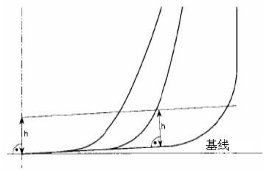  
图 2.2.4.6 燃油舱边界线  

2.2.4.7 燃油舱总舱容为 $600\mathrm{m}^{3}$ 或以上，但小于 $5000\mathrm{m}^{3}$ 的船舶，其燃油舱应布置在舷侧壳板型线内侧且任何一处与舷侧壳板的距离不小于在与舷侧壳板垂直的任何剖面处按以下规定测算的距离 $w$ （如图 2.2.4.7 所示）：  

$$
w=0.4+2.4C/20000\mathrm{m}
$$  

$w$ 最小值 $=1.0\mathrm{m}$ ，但对单舱舱容小于 $500\mathrm{m}^{3}$ 的燃油舱，该最小值为 $0.76\mathrm{m}$ 。  

2.2.4.8 燃油舱总舱容为 $5000~\mathrm{m}^{3}$ 及以上的船舶，其燃油舱应布置在舷侧壳板型线内侧且任何一处与舷侧壳板的距离不小于在与舷侧壳板垂直的任何剖面处按以下规定测算的距离 $w$ （如图 2.2.4.7 所示）：  

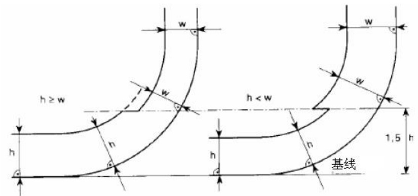  
图 2.2.4.7 燃油舱边界线  

2.2.4.9 对布置在与船底相距小于 2.2.4.6 所定义的 h 处，或与舷侧相距小于 2.2.4.7 和 2.2.4.8所定义的 $w$ 处的燃油管线，应在燃油舱内或紧邻燃油舱旁装设阀或类似的关闭装置。这些阀应能从一个易于进入的围蔽处所将其投入运行，该围蔽处所应可从驾驶室或推进机器控制站进入而不必横穿露天干舷甲板或上层建筑甲板。这些阀应在遥控系统发生故障（关闭位置故障）时关闭，并当舱内装有燃油时，除了在燃油传输作业期间可以开启外，应在航行途中任何时候保持关闭状态。  

2.2.4.10 燃油舱内的吸阱可凸入由距离 $h$ 所定义的边界线以下的双层底内，但这种吸阱应尽可能小，并且阱底与船底壳板之间的距离应不小于 $0.5h$ 。  

2.2.4.11 作为 2.2.4.6 和 2.2.4.7 或 2.2.4.8 的替代，船舶应符合以下规定的燃油意外泄漏性能标准：  

（1）在发生碰撞或搁浅时防止燃油污染的保护水平，应根据下述平均泄油量参数予以评定：  

$$
O_{M}<0.010\qquad\mathrm{C}\geqslant5,000\mathrm{m}^{3}
$$  

式中： $O_{M}$ —平均泄油量参数；$C$ —燃油总容量。  

（2）在计算平均泄油量参数时，适用下述一般假定：  

$\textcircled{1}$ 船舶应假定为装载至部分载重线吃水 $d_{p}$ 处且无纵倾或横倾。  
$\textcircled{2}$ 所有燃油舱应假定为装载至其舱容的 $98\%$ 。  
$\textcircled{3}$ 燃油名义密度 $(\rho_{n})$ 一般应取 $1000\mathrm{kg/m}^{3}$ 。若燃油密度限制为一特定的较小值，可用该较小值。  
$\textcircled{4}$ 就这些泄油量的计算而言，每个燃油舱的渗透率应取 0.99，除非证明应取其他数值。  

（3）在组合泄油量参数时，应使用下列假定：  

$\textcircled{1}$ 舷侧破损和船底破损的平均泄油量应分别进行计算，然后组合为无因次泄油量参数 $O_{M}$ 如下：  

$$
\mathrm{O_{M}}=(0.4\mathrm{O_{MS}}+0.6\mathrm{O_{MB}})/\mathrm{\Lambda}
$$  

式中：  

OMS 舷侧破损平均泄油量，以 $\mathrm{m}^{3}$ 计$O_{M B}$ 船底破损平均泄油量，以 $\mathrm{m}^{3}$ 计$C$ 燃油总容量。  

$\textcircled{2}$ 对于船底破损，应分别进行 $0\mathrm{m}$ 和 $2.5\mathrm{m}$ 潮汐条件下的平均泄油量计算，然后组合如下：  

$$
\mathrm{O_{MB}}=0.7\mathrm{O_{MB(0)}}+0.3\mathrm{O_{MB(2.5)}}
$$  

式中：  

OMB(0) $0\mathrm{m}$ 潮汐条件下的平均泄油量，和OMB(2.5) $2.5\mathrm{m}$ 潮汐条件下的平均泄油量，以 $\mathbf{m}^{3}$ 计。  

（4）舷侧破损平均泄油量 $O_{M S}$ 应按下式计算：  

$$
O_{M S}=\sum_{i}^{n}P_{S(i)}O_{S(i)}\mathrm{m}^{3}
$$  

式中：  

$i$ — 表示所计及的每个燃油舱；  
$n$ — 燃油舱的总数；  
$P_{S(i)}$ — 舷侧破损贯穿燃油舱 $i$ 的概率，按本条 2.2.4.11（6）计算；  
$O_{S(i)}$ — 燃油舱 $i$ 舷侧破损泄油量，以 $\mathbf{m}^{3}$ 计，假定相等于燃油舱 $i$ 充装至 $98\%$ 舱容时的燃油总体积。  

（5）船底破损的平均泄油量应按每种潮汐条件计算如下：  

$$
\textcircled{1}\quad{\cal O}_{M B(0)}=\sum_{i}^{n}P_{B(i)}\oslash_{B(i)}C_{D B(i)}\qquad\mathrm{m}^{3}
$$  

式中：  

$i$ 表示所计及的每个燃油舱；  
n 燃油舱的总数；  
PB(i) 船底破损贯穿燃油舱 $i$ 的概率，按本条 2.2.4.11(7)计算；  
OB(i) 燃油舱 $i$ 的泄油量，以 $\mathbf{m}^{3}$ 计，按本条 2.2.4.11(5) $\textcircled{3}$ 计算；和CDB (i) 计算本条 2.2.4.11(5) $\textcircled{4}$ 所定义的留存油量的系数。  

$$
\quad\textcircled{2}\quad O_{M B(2.5)}=\sum_{i}^{n}P_{_{B(i)}}O_{_{B(i)}}C_{_{D B(i)}}\qquad{\mathrm{m}}^{3}
$$  

式中：  

$i,~n,~P_{B(i)}$ 和 $C_{D B(i)}$ 定义同以上 $\textcircled{1}$ ；  
$O_{B(i)}-$ 潮汐变化后燃油舱 i 的泄油量，以 $\mathbf{m}^{3}$ 计。  

$\textcircled{3}$ 每个燃油舱的泄油量 $O_{B(i)}$ 应以压力平衡原理为基础按照下列假定进行计算:  

(a) 船舶应假定为搁浅且纵倾和横倾均为零，潮汐变化前的搁浅吃水等于部分载重线吃水 $d_{p}$ 。  
(b) 破损后燃油油位的计算如下：$\mathrm{h}_{\mathtt{F}}=\{(\mathrm{d}_{\mathtt{P}}+\mathrm{t}_{\mathtt{C}}-Z_{1})(\rho_{\mathtt{S}})\ \}/\rho_{\mathtt{n}}$  

式中：  

$h_{F}$ $Z_{I}$ 以上燃油的高度，以 $\mathbf{m}$ 计；  
$t_{C}$ 潮汐变化，以 $\mathbf{m}$ 计。潮汐的减少以负值表示；  
$Z_{I}$ 燃油舱内最低点在基线以上的高度，以 $\mathbf{m}$ 计；  
ρS 海水密度，取为 $1025\mathrm{kg}/\mathrm{m}^{3}$ ；和ρn— 2.2.4.11（2） $\textcircled{3}$ 所定义的燃油名义密度。  

(c) 以船底壳板为界限的任何燃油舱的泄油量 $O_{B(i)}$ 应取为不小于：  

$$
\mathrm{O}_{\mathrm{B(i)}}=\mathrm{H}_{\mathrm{W}}\cdot\mathrm{A}
$$  

式中：  

当 $Y_{B}=0$ 时， $H_{W}=1.0\mathrm{m}$   
$H_{W}=B_{B}/50$ ，但不大于 $4.0\mathrm{m}$ ，此时 $Y_{B}$ 大于 $B_{B}/5$ 或 $11.5\mathrm{m}$ ，取小者。  
$Y_{B}$ 的值超出 $B_{B}/5$ 或 $11.5\mathrm{m}$ （取小者）时， $H_{W}$ 应以线性内插法求得，  
如图 2.2.4.11 所示。  
$Y_{B}$ —在燃油舱长度方向上 $Y_{B}$ 的最小值，其中 $Y_{B}$ 在任何给定位置均为水线 $d_{B}$ 处舷侧壳板和水线 $d_{B}$ 处或以下燃油舱之间的横向距离。  

A —燃油舱舱底至 $H_{W}$ 层面的最大水平投影面积。  

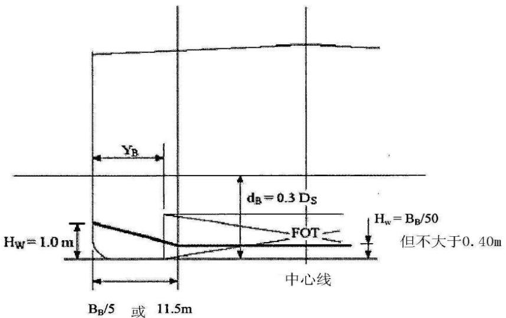  
取小者（在 $\mathbf{d}_{\mathrm{B}}$ 水平面，自舷侧向船内中心线垂直量取）  
图2.2.4.11 最小泄油量计算尺度  

(d) 在船底破损时，燃油舱泄出的一部分油可能被非载油的舱室截留。可对各燃油舱应用系数 $C_{D B(i)}$ 来约略估计这一效应。该系数应按下述规定取用：$C_{D B(i)}=0.6$ ，用于下部以非载油的舱室为界限的燃油舱；$C_{D B(i)}=1$ ，用于以船底壳板为界限的燃油舱。  

（6）舷侧破损造成的破损概率 $P_{S}$ 的计算方法如下：  

$$
P_{S}=P_{S L}\cdot P_{S V}\cdot P_{S T}
$$  

式中：  

$P_{S L}=(I-P_{S f}-P_{S a})\cdot$ ——破损延伸至由 $X_{a}$ 和 $X_{f}$ 为界限的纵向区域的概率；$P_{S V}{=({\cal{I}}-P_{S u}-P_{S l})}$ ——破损延伸至由 $Z_{I}$ 和 $Z_{u}$ 为界限的垂直区域的概率；$P s r{=}\left(l-P s_{y}\right)$ ——破损横向延伸至由 $y$ 定义的界限之外的概率；$\textcircled{2}$ $P_{S a},P_{S f},P_{S u}$ 和 $P_{S l}$ 应采用线性内插法按 2.2.4.11(6) $\textcircled{3}$ 提供的舷侧破损概率表确定，$P_{S y}$ 应按 $2.2.4.11(6)\textcircled{3}$ 提供的公式计算，式中：$P_{S a}$ — 破损全部在 $X_{a}/L$ 位置后部的概率；$P_{S f}$ — 破损全部在 $X_{f}/L$ 位置前部的概率；$P_{S I}$ — 破损全部在燃油舱以下的概率；$P_{S u}$ — 破损全部在燃油舱以上的概率；和$P_{S y}$ — 破损全部在油舱以外的概率。舱室界限 $X_{a}$ 、 $X_{f},$ 、 $Z_{I}$ 、 $Z_{u}$ 和 $y$ 应按如下方式确$X_{a}$ — 自船长 $L$ 的后端至所计及舱室的最后一点的纵向距离，以 $\mathbf{m}$ 计；$X_{f}$ — 自船长 $L$ 的后端至所计及舱室的最前一点的纵向距离，以 $\mathbf{m}$ 计；$Z_{I}$ — 自型基线至所计及舱室的最低一点的垂直距离，以 $\mathbf{m}$ 计；若 $Z_{I}$ 大于 $D_{S}$ ， $Z_{I}$ 应取为与 $D_{S}$ 等值；$Z_{u}$ — 自型基线至所计及舱室的最高一点的垂直距离，以 $\mathbf{m}$ 计；若 $Z_{u}$ 大于 $D_{S}$ ， $Z_{u}$ 应取为与 $D_{S}$ 等值；和$y$ — 在所计及舱室和船侧壳板之间垂直于中心线量取的最小水平距离，以 $\mathbf{m}$ 计①。  

$\textcircled{3}$ 舷侧破损概率表  

<html><body><table><tr><td>Xa/L</td><td>Psa</td><td></td><td>X/L</td><td>Psf</td><td></td><td>Z/Ds</td><td>Pst</td><td></td><td>ZwDs</td><td>PSu</td></tr><tr><td>0.00</td><td>0.000</td><td></td><td>0.00</td><td>0.967</td><td></td><td>0.00</td><td>0.000</td><td></td><td>0.00</td><td>0.968</td></tr><tr><td>0.05</td><td>0.023</td><td></td><td>0.05</td><td>0.917</td><td></td><td>0.05</td><td>0.000</td><td></td><td>0.05</td><td>0.952</td></tr><tr><td>0.10</td><td>0.068</td><td></td><td>0.10</td><td>0.867</td><td></td><td>0.10</td><td>0.001</td><td></td><td>0.10</td><td>0.931</td></tr><tr><td>0.15</td><td>0.117</td><td></td><td>0.15</td><td>0.817</td><td></td><td>0.15</td><td>0.003</td><td></td><td>0.15</td><td>0.905</td></tr><tr><td>0.20</td><td>0.167</td><td></td><td>0.20</td><td>0.767</td><td></td><td>0.20</td><td>0.007</td><td></td><td>0.20</td><td>0.873</td></tr><tr><td>0.25</td><td>0.217</td><td></td><td>0.25</td><td>0.717</td><td></td><td>0.25</td><td>0.013</td><td></td><td>0.25</td><td>0.836</td></tr><tr><td>0.30</td><td>0.267</td><td></td><td>0.30</td><td>0.667</td><td></td><td>0.30</td><td>0.021</td><td></td><td>0.30</td><td>0.789</td></tr><tr><td>0.35</td><td>0.317</td><td></td><td>0.35</td><td>0.617</td><td></td><td>0.35</td><td>0.034</td><td></td><td>0.35</td><td>0.733</td></tr><tr><td>0.40</td><td>0.367</td><td></td><td>0.40</td><td>0.567</td><td></td><td>0.40</td><td>0.055</td><td></td><td>0.40</td><td>0.670</td></tr><tr><td>0.45</td><td>0.417</td><td></td><td>0.45</td><td>0.517</td><td></td><td>0.45</td><td>0.085</td><td></td><td>0.45</td><td>0.599</td></tr><tr><td>0.50</td><td>0.467</td><td></td><td>0.50</td><td>0.467</td><td></td><td>0.50</td><td>0.123</td><td></td><td>0.50</td><td>0.525</td></tr><tr><td>0.55</td><td>0.517</td><td></td><td>0.55</td><td>0.417</td><td></td><td>0.55</td><td>0.172</td><td></td><td>0.55</td><td>0.452</td></tr><tr><td>0.60</td><td>0.567</td><td></td><td>0.60</td><td>0.367</td><td></td><td>0.60</td><td>0.226</td><td></td><td>0.60</td><td>0.383</td></tr><tr><td>0.65</td><td>0.617</td><td></td><td>0.65</td><td>0.317</td><td></td><td>0.65</td><td>0.285</td><td></td><td>0.65</td><td>0.317</td></tr><tr><td>0.70</td><td>0.667</td><td></td><td>0.70</td><td>0.267</td><td></td><td>0.70</td><td>0.347</td><td></td><td>0.70</td><td>0.255</td></tr><tr><td>0.75</td><td>0.717</td><td></td><td>0.75</td><td>0.217</td><td></td><td>0.75</td><td>0.413</td><td></td><td>0.75</td><td>0.197</td></tr><tr><td>0.80</td><td>0.767</td><td></td><td>0.80</td><td>0.167</td><td></td><td>0.80</td><td>0.482</td><td></td><td>0.80</td><td>0.143</td></tr><tr><td>0.85</td><td>0.817</td><td></td><td>0.85</td><td>0.117</td><td></td><td>0.85</td><td>0.553</td><td></td><td>0.85</td><td>0.092</td></tr><tr><td>0.90</td><td>0.867</td><td></td><td>0.90</td><td>0.068</td><td></td><td>0.90</td><td>0.626</td><td></td><td>0.90</td><td>0.046</td></tr><tr><td>0.95</td><td>0.917</td><td></td><td>0.95</td><td>0.023</td><td></td><td>0.95</td><td>0.700</td><td></td><td>0.95</td><td>0.013</td></tr><tr><td>1.00</td><td>0.967</td><td></td><td>1.00</td><td>0.000</td><td></td><td>1.00</td><td>0.775</td><td></td><td>1.00</td><td>0.000</td></tr></table></body></html>  

$P_{S y}$ 应如下计算：  

当 $y/B s{\leqslant}0.05$ ， $P_{S y}=(24.96-199.6y/B s)(y/B s)$   
当 $0.05<y/B_{S}<0.1$ $1,~P_{S y}=0.749+~(5-44.4~(\nu/B_{S}-0.05))~((\nu/B_{S})-0.05)$ 当 $y/B s{\ge}0.1$ ， $P_{S y}=0.888+0.56(\gamma/B_{S}-0.1)$   
$P_{S y}$ 不应取大于 1。  

（7）船底破损造成的破舱概率 $P_{B}$ 的计算方法如下：  

$\textcircled{1}$ $\mid P_{B}=P_{B L}\cdot P_{B T}\cdot P_{B V}$ 式中： $\begin{array}{r c l}{P_{B L}}&{=}&{(1-P_{B f}-P_{B a})^{-}}\end{array}$ ——破损延伸至由 $X_{\mathrm{a}}$ 和 $\mathrm{X}_{\mathrm{f}}$ 为界限的纵向区域的概率；PBT = $(1-P_{B p}-P_{B s})$ ——破损延伸至由 ${\mathrm{Y}}_{\mathfrak{p}}$ 和 $\mathrm{Y_{s}}$ 为界限的横向区域的概率；和$\begin{array}{r c l}{P_{B V}}&{=}&{(1-P_{B z})}\end{array}$ ——破损垂直延伸至由 Z 定义的界限以上的概率。  
$\textcircled{2}$ $P_{B a}$ 、 $P_{B f},\ P_{B p}$ 和 $P_{B s}$ 应采用线性内插法按 2.2.4.11（7） $\textcircled{3}$ 提供的船底破损概率表确定， $P_{B z}$ 应按 2.2.4.11（7） $\textcircled{3}$ 提供的公式计算，式中：$P_{B a}$ — 破损全部在 $X_{a}/L$ 位置后部的概率；$P_{B f}$ — 破损全部在 $X_{f}/L$ 位置前部的概率；PBp — 破损全部在燃油舱左侧的概率；$P_{B s}$ — 破损全部在燃油舱右侧的概率；和PBz — 破损全部在燃油舱以下的概率。舱室界限 $X_{a}$ 、 $X_{f}$ 、 $Y_{p}$ 、 $Y_{s}$ 和 $z$ 应按如下方式确定：$X_{a}$ 和 $X_{f}$ 的定义同 2.2.4.11（6） $\textcircled{2}$ 。$Y_{p}$ — 自位于水线 $d_{B}$ 处或以下的舱室的最左的一点至位于船舶中心线右舷$B_{B}/2$ 处的垂直平面的横向距离；Ys— 自位于水线 $d_{B}$ 处或以下的舱室的最右的一点至位于船舶中心线右舷$B_{B}/2$ 处的垂直平面的横向距离；和z— 在舱室长度方向上 $z$ 的最小值，其中 $z$ 在任何给定的纵向位置均为该纵向位置船底壳板最低点至该纵向位置舱室最低点之间的垂直距离。$P_{B z}$ 应如下计算：  
当 $z/D s\le0.1$ ， $P_{B z}=(14.5~-~67~z/D s)\:(\ z/D s)$ 当 $_{z}\langle D_{S}\rangle>0.1$ ， $P_{B z}=0.78+1.1\ \{(z/D s-0.1)\}$ $P_{B z}$ 不应取大于 1。  

$\textcircled{3}$ 船底破损概率表  

<html><body><table><tr><td>Xa/L</td><td>PBa</td><td></td><td>Xy/L</td><td>PBf</td><td></td><td>Yp/BB</td><td>PBp</td><td></td><td>Y/BB</td><td>PBs</td></tr><tr><td>0.00</td><td>0.000</td><td></td><td>0.00</td><td>0.969</td><td></td><td>0.00</td><td>0.844</td><td></td><td>0.00</td><td>0.000</td></tr><tr><td>0.05</td><td>0.002</td><td></td><td>0.05</td><td>0.953</td><td></td><td>0.05</td><td>0.794</td><td></td><td>0.05</td><td>0.009</td></tr><tr><td>0.10</td><td>0.008</td><td></td><td>0.10</td><td>0.936</td><td></td><td>0.10</td><td>0.744</td><td></td><td>0.10</td><td>0.032</td></tr><tr><td>0.15</td><td>0.017</td><td></td><td>0.15</td><td>0.916</td><td></td><td>0.15</td><td>0.694</td><td></td><td>0.15</td><td>0.063</td></tr><tr><td>0.20</td><td>0.029</td><td></td><td>0.20</td><td>0.894</td><td></td><td>0.20</td><td>0.644</td><td></td><td>0.20</td><td>0.097</td></tr><tr><td>0.25</td><td>0.042</td><td></td><td>0.25</td><td>0.870</td><td></td><td>0.25</td><td>0.594</td><td></td><td>0.25</td><td>0.133</td></tr><tr><td>0.30</td><td>0.058</td><td></td><td>0.30</td><td>0.842</td><td></td><td>0.30</td><td>0.544</td><td></td><td>0.30</td><td>0.171</td></tr><tr><td>0.35</td><td>0.076</td><td></td><td>0.35</td><td>0.810</td><td></td><td>0.35</td><td>0.494</td><td></td><td>0.35</td><td>0.211</td></tr><tr><td>0.40</td><td>0.096</td><td></td><td>0.40</td><td>0.775</td><td></td><td>0.40</td><td>0.444</td><td></td><td>0.40</td><td>0.253</td></tr><tr><td>0.45</td><td>0.119</td><td></td><td>0.45</td><td>0.734</td><td></td><td>0.45</td><td>0.394</td><td></td><td>0.45</td><td>0.297</td></tr><tr><td>0.50</td><td>0.143</td><td></td><td>0.50</td><td>0.687</td><td></td><td>0.50</td><td>0.344</td><td></td><td>0.50</td><td>0.344</td></tr><tr><td>0.55</td><td>0.171</td><td></td><td>0.55</td><td>0.630</td><td></td><td>0.55</td><td>0.297</td><td></td><td>0.55</td><td>0.394</td></tr><tr><td>0.60</td><td>0.203</td><td></td><td>0.60</td><td>0.563</td><td></td><td>0.60</td><td>0.253</td><td></td><td>0.60</td><td>0.444</td></tr><tr><td>0.65</td><td>0.242</td><td></td><td>0.65</td><td>0.489</td><td></td><td>0.65</td><td>0.211</td><td></td><td>0.65</td><td>0.494</td></tr><tr><td>0.70</td><td>0.289</td><td></td><td>0.70</td><td>0.413</td><td></td><td>0.70</td><td>0.171</td><td></td><td>0.70</td><td>0.544</td></tr><tr><td>0.75</td><td>0.344</td><td></td><td>0.75</td><td>0.333</td><td></td><td>0.75</td><td>0.133</td><td></td><td>0.75</td><td>0.594</td></tr><tr><td>0.80</td><td>0.409</td><td></td><td>0.80</td><td>0.252</td><td></td><td>0.80</td><td>0.097</td><td></td><td>0.80</td><td>0.644</td></tr><tr><td>0.85</td><td>0.482</td><td></td><td>0.85</td><td>0.170</td><td></td><td>0.85</td><td>0.063</td><td></td><td>0.85</td><td>0.694</td></tr><tr><td>0.90</td><td>0.565</td><td></td><td>0.90</td><td>0.089</td><td></td><td>0.90</td><td>0.032</td><td></td><td>0.90</td><td>0.744</td></tr></table></body></html>  

<html><body><table><tr><td>0.95</td><td>0.658</td><td></td><td>0.95</td><td>0.026</td><td>0.95</td><td>0.009</td><td></td><td>0.95</td><td>0.794</td></tr><tr><td>1.00</td><td>0.761</td><td></td><td>1.00</td><td>0.000</td><td>1.00</td><td>0.000</td><td></td><td>1.00</td><td>0.844</td></tr></table></body></html>  

（8）不与外壳板邻接的任何燃油舱，其所在位置与船底壳板的距离不应小于本条 2.2.4.6 中$h$ 的最小值，与船侧壳板的距离不应小于本条 2.2.4.7 或 2.2.4.8 中的 $w$ 的最小适用值。  

2.2.4.12 在批准按本条规定建造的船舶的设计和构造时，应充分注意通常的安全方面，包括对边舱和双层底舱或处所进行维修及检查的需要。  

# 2.2.5 滤油设备  

2.2.5.1 除本条 2.2.5.5 至 2.2.5.9 规定外，凡 400 总吨及以上但小于 10000 总吨的船舶，应装有符合本条 2.2.5.3 规定的滤油设备。凡载有大量燃油的这种船舶，应符合本条 2.2.5.2 的规定。  

2.2.5.2 除本条 2.2.5.5 至 2.2.5.9 规定外，凡 10000 总吨及以上的船舶，应装有滤油设备和当排出物的含油量超过 15ppm 时能发出报警并自动停止含油物排放的装置，并应符合本条2.2.5.4 的规定。  

2.2.5.3 本条 2.2.5.1 所述的滤油设备的设计，应经批准，而且应保证通过该系统排放入海的含油混合物的含油量应不超过 $15\mathrm{ppm}^{\textregistered}$ 。  

2.2.5.4 本条 2.2.5.2 所述的滤油设备的设计，应经批准，而且应保证通过该系统排放入海的含油混合物的含油量应不超过 $15\mathrm{ppm}$ 。该系统应装有报警装置，在不能保持这一标准时发出报警。该系统还应装有在排出物的含油量超过 $15\mathrm{ppm}$ 时能保证自动停止含油混合物排放的装置。  

2.2.5.5 对于除不载运货物的迁移航程之外固定不动的船舶，诸如旅馆船、储存船舶等以及定点作业的无推进动力浮船坞，不必安装滤油设备。这种船舶应设有足够容量的含油污水储存舱，所有含油舱底水均应留存船上，以便随后排入接收设备。储存柜的容积应至少满足下列公式计算结果：  

$$
V=T q\mathrm{m}^{3}
$$  

式中： $V$ ——机舱舱底含油污水贮存柜容积， $\mathbf{m}^{3}$ ；  

$T$ — 含油污水留存船上的时间， $\mathbf{h}$ ；根据船舶实际使用情况确定；  

q—— 假定每小时产生的舱底水量， $\mathrm{m}^{3}/\mathrm{h}$ ；  

$$
q=1.8\times10^{-5}~G T;
$$  

$G T$ ——船舶总吨位。  

2.2.5.6 对任何按本法规第 6 篇高速船要求进行检验发证，且从事定期营运且往返时间（包括这些船舶不载运旅客/货物的迁移航程）不超过 24 小时的船舶，可采用下列措施替代本条2.2.5.1 和 2.2.5.2 的要求：  

（1）船舶设有足够容量的储存柜，其容积应至少满足下列公式计算结果：  

$$
V=15T q\mathrm{m}^{3}
$$  

式中： $q=1.8\times10^{-5}~G T$ ， $\mathrm{m}^{3}/\mathrm{h}$ ； $V$ 、 $T$ 、 $q$ 、 $_{G T}$ 定义如 2.5.5；  

（2）所有含油舱底水均留存船上，以便随后排入接收设备；  
（3）船舶停靠的港口或装卸站设有足够的接收设备接收该含油舱底水；  
（4）将排放的数量、时间和港口记入本章 2.1.3.2 所述的油类记录簿内。  

$\textcircled{1}$ 在 2007 年 3 月 1 日或以后安装上船的滤油设备，参阅国际海事组织以 MEPC.107(49)号决议批准的并经MEPC.285(70)决议修订的《船舶机器处所防污染设备的导则和技术条件》。在 2007 年 3 月 1 日以前安装上船的滤油设备，参阅由国际海事组织以 A.393(X)号决议通过的《关于油水分离设备和油分计国际性能和试验技术条件的建议案》或由国际海事组织海上环境保护委员会以 MEPC.60(33)号决议批准的《船舶机器处所防污染设备的导则和技术标准》。  

2.2.5.7 对于仅在零排放水域内作业的船舶，包括临时驶离零排放水域仅为了前往零排放水域外的修船厂进行修理或者为了移到另一个零排放水域内作业的船舶，则可以不设 2.2.5.1 或2.2.5.2 要求的滤油设备，但应满足下列所有条件：  

（1）船舶仅在零排放水域内作业，且在国内航行海船安全与环保证书上予以注明；（2）将所有舱底油污水留存船上，随后排入接收设备；（3）应在油类记录簿上记录油污水排入接收设备的数量、时间和港口等；（4）应设有储存船上全部油污水的储存柜，其容积应满足下列公式计算结果：  

$$
V=15T q\ensuremath{\mathrm{~\textrm~{~~}~}}\ensuremath{\mathrm{m}}^{3}
$$  

式中： $q=1.8\times10^{-5}\ G T\ m^{3}/\mathrm{h}$ ；  

$V$ 、 $T$ 、 $q$ 、 GT 定义如 2.2.5.5。  

2.2.5.8 尽管有 2.2.5.5 至 2.2.5.7 的要求，对 400 总吨以下的所有船舶，不要求设置滤油设备，但应符合下述所有条件：  

（1）设有能储存船上全部机舱舱底含油污水的储存柜，其容积至少应满足下列公式计算结果：  

$$
V=15T q\mathrm{m}^{3}
$$  

式中： $V$ ——实取的 $V$ 值应不小于 $48\mathrm{q}$ ；对港内作业船舶，按船舶实际情况，经同意，可适当放宽，但不应小于 $0.1\mathrm{m}^{3}$ ；  

$q\mathrm{-}\mathrm{-}q=3.5\times10^{-5}\ G T\ ,\ \mathrm{\m^{3}/\mathrm{~H}}$ ；——适用于尾管轴承为水润滑；  
$q=2.1\times10^{-5}\ G T\ \mathrm{m^{3}/\ h}$ ；——适用于尾管轴承为油润滑；  
$q=1.8\times10^{-5}~G T~\mathrm{m^{3}/h}$ ；——适用于港内作业船舶。  
$V$ 、 $T$ 、 $q$ 、 $_{G T}$ 定义如 2.2.5.5。  

（2）应设有对贮存柜进行清洗和将其中的残油或含油污水排入接收设备的适当设施；  

（3）泵和管路应为固定式，如认为实际上不适当，可用其他有效形式代替；  

（4）船舶停靠港或装卸站设有足够数量的接收设备；  

（5）船上应设有本章 2.2.3 规定的标准排放接头。  

2.2.5.9 尽管有本条 2.2.5.1 至 2.2.5.8 的规定，就非机动船舶而言，可不要求设置滤油设备，但应符合下述所有条件：  

（1）设有能储存船上全部机舱舱底含油污水的储存柜，其容积至少应满足下列公式计算结果：  

$$
V~=~T q\ensuremath{\mathrm{~\textrm~{~~}~}}\ensuremath{\mathrm{m}}^{3}
$$  

式中： $\mathsf{q}{=}1.8\times10^{-5}$ GT $\mathrm{m}^{3}/\mathrm{h}$ ；  
$V$ 、 $T$ 、 $q,G T$ 定义同本条 2.2.5.5；但对于 10000 总吨及以上的非机动船，其 $V$ 应不小于 $1\mathrm m^{3}$ 。  

（2）船舶停靠港或装卸站设有足够的接收设备。  

# 2.2.6 操作性排油控制要求  

2.2.6.1 对排油的控制  

（1）对于 400 总吨及以上的所有船舶的机器处所舱底水的排放：  

$\textcircled{1}$ 船舶不在零排放水域内；  
$\textcircled{2}$ 船舶正在航行途中；  
$\textcircled{3}$ 油水混合物经过符合本章 2.2.5 要求的滤油设备处理；  
$\textcircled{4}$ 未经稀释的排出物含油量不超过 15ppm；  
$\textcircled{5}$ 油水混合物不是来自油船货泵舱的舱底；  
$\textcircled{6}$ 对油船而言，油水混合物不混有货油残余物。  

（2）对小于 400 总吨的船舶，应按本章 2.2.5.8 要求将其机器处所舱底水全部留存在船上，随后排到接收设备中，或满足 2.2.6.1（1）的排放要求，或符合下列全部要求时排放入海：  

$\textcircled{1}$ 船舶不在零排放水域内；  
$\textcircled{2}$ 船舶正在航行途中；  
$\textcircled{3}$ 船舶设有从设计上批准的设备（如图 2.2.6.1（1）和图 2.2.6.1（2）所示），且正在  

运转，以确保未经稀释的排出物含油量不超过 $15\mathrm{ppm}$ ；  

$\textcircled{4}$ 油水混合物不是来自油船货泵舱的舱底；  
$\textcircled{5}$ 对油船而言，油水混合物不混有货油残余物。  

  
图 2.2.6.1（1） 组合油水分离布置与舱底水沉淀柜– 仅用于 400 总吨以下的船舶  

注：  

1 舱底水沉淀容器（进口和出口之间）的有效容积应相当于 24 小时产生的舱底水容量。该舱底水量可参考本章 2.2.5.8 中 q 的值。  

2 舱底水泵可为动力舱底泵或手动泵，连续或间歇运转  
3 油水分离布置的构造见图 2.2.6.1（2）  
4 需有从舱底水表面除去残油并将其留存在船上的设施  

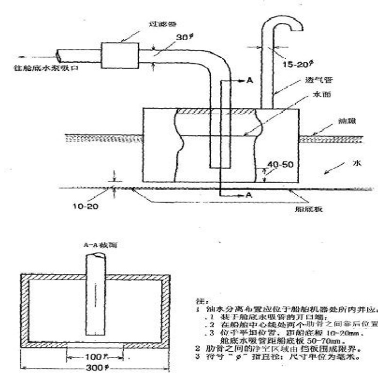  

# 图 2.2.6.1（2） 油水分离布置 – 仅用于 400 总吨以下的小船  

（3）任何含有在数量或浓度上会危害海洋环境的化学品或其他物质，或是借以回避本条所列排放条件的化学品或其他物质，均不应排放入海。（4）按照本条的规定不能排放入海的残油，应留存于船上或排入接收设备。2.2.6.2 油类与压载水的分隔和首尖舱内载油（1）除本条（2）规定者外，凡 4000 总吨及以上的非油船和 150 总吨及以上的油船，不应在任何燃油舱内装载压载水。（2）如有异常情况或需要载有大量燃油，致使必须在燃油舱中装载不清洁的压载水时，这种压载水应排入接收设备；或使用本章 2.2.5.2 规定的设备，按本章 2.2.6.1 规定排放入海，并将这一情况记入油类记录簿。  

（3）400 总吨及以上的船舶，其首尖舱或防撞舱壁之前的舱内不应装载油类。  

# 第 3 节 对油船货物区域的要求  

# 2.3.1 结构与设备要求  

2.3.1.1 油船货物区域防污染结构与设备要求包括如下内容：  

（1）专用压载舱及清洁压载舱；  
（2）专用压载舱的保护位置；  
（3）油船的双壳双底要求；  
（4）对不符合本章 2.3.6.3 要求的油船（包括油驳）的双壳双底要求；  
（5）货泵舱底部保护；  
（6）意外溢油性能；  
（7）损坏的假定；  
（8）假定的溢油量；  
（9）货油舱的尺度限制和布置；  
（10）分舱和破损稳性；  
（11）污油水舱；  
（12）泵吸、管路和排放布置；  
（13）排油监控系统和油水界面探测器；  
（14）对原油洗舱的要求。  

# 2.3.2 专用压载舱与原油洗舱  

2.3.2.1 载重量为 20000 吨及以上的原油油船及载重量为 30000 吨及以上的成品油船，均应设置专用压载舱，并相应地符合下述 2.3.2.2、2.3.2.3 及 2.3.2.4 或 2.3.2.5 的规定。  

2.3.2.2 专用压载舱容量的确定，应使该船除本条 2.3.2.3 或 2.3.2.4 所规定的情况外，可以不依靠利用货油舱装载压载水而安全地进行压载航行。但在所有的情况下，专用压载舱的容量至少能使船舶的吃水和吃水差，在航行的任何部分，不论处于何类压载情况，包括只是空载加压载水的情况在内，均应符合下列各项要求：  

（1）船中部型吃水 $d_{\mathfrak{m}}$ (不考虑任何船舶变形)应不小于：  

$$
d_{{}_{m}}=2.0+0.02L{\mathrm{m}}
$$  

（2）在首、尾垂线处的吃水，应相当于由本条（1）规定所确定的船中部吃水 $d_{{\scriptscriptstyle m}}$ ，但向尾  
纵倾的吃水差不应大于 $0.015L$ ；以及（3）尾垂线处的吃水，无论如何不应小于螺旋桨全部浸没所必需的吃水。2.3.2.3 除下述情况外，货油舱不应装载压载水：（1）在天气情况非常恶劣的少数航次，船长认为必须在货油舱中加装额外压载水以保证船  
舶安全时；（2）在例外情况下，由于油船的具体运行特性，使其必需加装超过本条 2.3.2.2 要求数量的  
压载水，但该油船的这种操作应是属于规定的例外情况的范畴内。这种额外压载水应按本章 2.3.17 的规定进行处理和排放，并应记入本章 2.1.3.1 所指的油类  
记录簿内。2.3.2.4 对于原油油船，本条 2.3.2.3 所许可的额外压载水应只装载在该船驶离卸油港或卸油  
站之前业已按本章 2.3.3 以原油清洗过的货油舱内。2.3.2.5 尽管有本条 2.3.2.2 的规定，但船长不足 $150\mathrm{m}$ 的油船，其专舱压载的情况应使船舶  
检验机构满意。2.3.2.6 可视为具有专用压载舱的油船  

（1）凡根据本章 2.3.2.1 规定不要求设置专用压载舱的油船，如符合本章 2.3.2.2 和 2.3.2.3或 2.3.2.5 的要求，可视为具有专用压载舱的油船。  

# 2.3.3 对原油洗舱的要求  

2.3.3.1 载重量为 20000 吨及以上的原油油船，均应设有使用原油洗舱的货油舱清洗系统。在这种油船首次从事原油运输后的 1 年以内或在运输适于作原油洗舱的原油的第 3 个航次结束之前(以较迟者为准)，使该系统完全符合本条的要求。除所装原油不适于作原油洗舱外，这种油船均应按该条的要求使用该洗舱系统。  

2.3.3.2 原油洗舱装置及其附属设备与布置，应符合规定的要求①。  

# 2.3.4 专用压载舱的保护位置  

2.3.4.1 载重量为 20000 吨及以上的原油油船和载重量为 30000 吨及以上的成品油船，但除本章 2.3.5 所适用的油船外，所需提供的符合本章 2.3.2.2 要求容量的位于货舱长度范围内的专用压载舱，应按本章 2.3.4.2 及 2.3.4.3 的要求进行布置，以提供一种在万一发生搁浅或碰撞时防止油类外流的保护措施。  

2.3.4.2 在货舱长度 $L_{\mathrm{}_{t}}$ 范围之内的专用压载舱以及非油舱的处所，其布置应符合以下要求：  

$$
\sum P A_{c}+\sum P A_{s}\geq J[L_{t}(B+2D)]
$$  

式中： $P A_{c}$ ——每一专用压载舱或非油舱的处所按型尺度在舷侧的投影面积， $\mathbf{m}^{2}$ ；$P A_{s}$ ——每一上述的舱或处所按型尺度在船底的投影面积， ${\mathrm{m}}^{2}$ ；$L_{\mathrm{}_{t}}$ — 货油舱区前后末端之间的长度，m；$B$ 所定义的船舶最大宽度，m；$D$ 型深，m；在船中舷侧处从龙骨板上缘量至干舷甲板横梁上缘的垂直距离。  

缘为圆弧形的船舶，型深应量至甲板型线与舷侧壳板型线延伸线的交点，即将舷缘视为方角形的设计；  
$J=0.45$ ——载重量为 20000 吨的油船；  
$J{=}0.3$ — 载重量为 200000 吨及以上的油船；对载重量为中间值时，“ $J$ ”值按线性内插法求得。  

本条所用的符号，凡在本章中出现时，其含义与本条所规定者相同。  

2.3.4.3 在确定专用压载舱及非油舱处所的“ $P A_{c}$ ”和“ $P A_{s}$ ”时，适用下述规定：  

（1）不论其是每一边舱或处所的最小宽度伸展到舷侧全深或是从甲板至双层底内底板，应不小于 $2\mathrm{m}$ 。该宽度应自舷侧向中心线垂直量取。如宽度小于 $2\mathrm{m}$ ，则在计算保护面积“ $P A_{c}$ ”时，该边舱或处所应不予以考虑；  

（2）每一双层底舱或处所的最小垂直深度，应为 $B~/~15$ 或 $2\mathrm{m}$ ，取较小者。如深度小于此值，则在计算保护面积“ $P A_{s}$ ”时，该底舱或处所应不予考虑。  

（3）对边舱及双层底舱最小宽度与深度的量取，应避开舭部，同时，对最小宽度的量取，还应避开任何圆弧形的舷缘部分。  

# 2.3.5 油船的双壳双底要求  

2.3.5.1 本条规定适用于如本章 2.1.2.1（24）定义的在 1996 年 7 月 6 日或以后交船的载重量为 600 吨及以上的油船。  

2.3.5.2 凡载重量 5000 吨及以上的油船：  

（1）如适用，应符合本章 2.3.5.3 的要求，以代替本章 2.3.4 的要求；和（2）如适用，应符合本章 2.3.12.6 的要求。  

2.3.5.3 整个货油舱长度应由下述压载舱或非载运油类的舱室处所加以保护：  

（1）边舱或处所  

边舱或处所应伸展到舷侧全深或是从双层底顶端到最上层甲板，无论船舶的舷缘是否为圆弧形。各边舱或处所应布置成使得全部货油舱皆位于这些舱或处所壳板型线的内侧面。在与舷侧壳板垂直的任何剖面处测得的距离 W 值，如图 2.3.5.3 所示，不应小于下式计算值：  

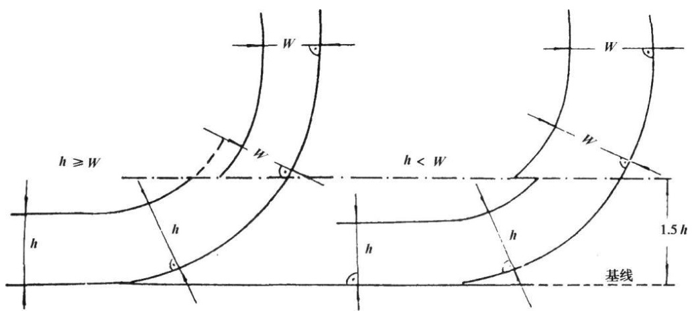  
图 2.3.5.3 货油舱边界线  

$W=0.5+{\frac{D W}{20000}}~({\mathrm{m}})_{\mathrm{\ell}}$ ，或 $W=2.0$ ，取小者。  
最小值 $\mathrm{W}{=}1.0\mathrm{m}$ 。  

（2）双层底舱或处所  

每一双层底舱或处所的任一剖面的垂直深度应为：货油舱双层底与船底壳板型线之间的垂直距离 $h$ ，如图 2.3.5.3 所示，不应小于下式计算值：  

（3）舭部弯曲区域或舭部无明显弯曲的部位当 $h$ 和W 两者距离不等时， $W$ 值应在基线以上超过 $1.5h$ 处选取，如图 2.3.5.3 所示。  

（4）各压载舱的总容量  

对载重量为 20000 吨及以上的原油油船和载重量为 30000 吨及以上的成品油油船，各边舱、双层底舱、首尖舱和尾尖舱的总容量应不小于为满足本章 2.3.2.2 所必需的专用压载舱的容量。用以满足本章 2.3.2.2 要求的各边舱或处所和双层底舱应尽可能均匀地沿货油舱长度布置。为减少船体总梁弯曲应力、船舶纵倾等，附加的专用压载舱的容量可布置在船内的任意位置。  

# （5）货油舱吸阱  

货油舱内的吸阱可以凸入到由距离 $h$ 所定义的双层底边界线下面，但这种吸阱应尽可能小，并且阱底与船底壳板之间距离应不小于 $0.5h$ 。  

# （6）压载和货油管路  

除全焊接或等效的短管外，压载管路和压载舱的测深管及空气管应不通过货油舱，货油管路和货油舱的测深管及透气管应不通过压载舱。2.3.5.4 载重量为 5000 吨以下的油船，应符合本章 2.3.5.3 的要求，或：  

（1）至少设有双层底舱或处所，其高度，即本章 2.3.5.3(2)所规定的 $h$ 距离，符合以下条件：  

在舭部弯曲区域和舭部无明显弯曲的部位，货油舱边界线应与船中部横剖面平底线平行，如图 2.3.5.4 所示；  

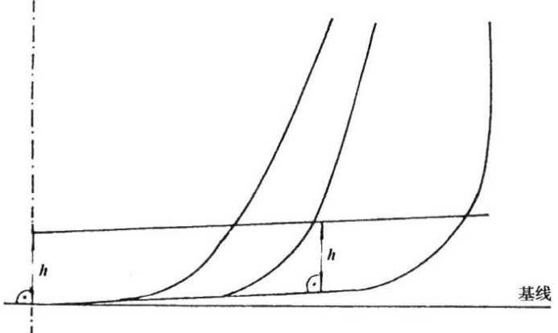  
图 2.3.5.4 货油舱边界线  

（2）各货油舱应按照每舱容积不超过 $700\mathrm{m}^{3}$ 进行布置，除非边舱或处所按照本章 2.3.5.3(1)布置并满足下列要求：  

$W=0.4+\frac{2.4D W}{20000}~\mathrm{{\m};}$ 最小值 $W=0.76\mathrm{m}$ 。  

（3）对在 2010 年 1 月 1 日及以后安放龙骨或处于相似建造阶段的载重量为600 吨及以上但小于 5000 吨的油船，应设置双层底高度 $\mathbf{h}$ 符合上述 2.3.5.4（1）要求的双层底舱，以及边舱距离 W 符合 2.3.5.4（2）要求的边舱。  

2.3.5.5 防撞舱壁前的任何处所不能载油。对于按该条规定不要求有防撞舱壁的油船，也不应在首垂线横剖面前的任何处所载油，此时该横剖面处被看作为根据该条要求的防撞舱壁。  

2.3.5.6 在批准按本条规定拟建造的油船的设计和构造时，应对各方面的安全，包括为维修及检验边舱和双层底舱或处所而必需的安全，应给予适当注意。  

# 2.3.6 对不符合本章 2.3.5.3 要求的油船（包括油驳）的双壳双底要求  

2.3.6.1 所有不符合本章 2.3.5.3 要求的载重量为 600 吨及以上的油船和油驳，应符合本条要求。  

2.3.6.2 就本条而言，适用以下定义：  

（1）“建造日期”系指：该船安放龙骨或处于相应的建造阶段的日期。如安放龙骨或处于相应的建造阶段日期不详，则按该船建成日期前一周年的日期计。  

（2）“油驳”系指：无动力推进装置的，专门用于运输散装油类货物的船舶。  

（3）“重质货油”系指：  

$\textcircled{1}$ 在 $15\mathrm{^\circC}$ 时密度大于 $900\mathrm{kg/m^{3}}$ 的原油；  
$\textcircled{2}$ 在 $15\mathrm{^\circC}$ 时密度大于 $900\mathrm{kg/m}^{3}$ 或 $50^{\circ}\mathrm{C}$ 时运动粘度大于 $180\mathrm{mm}^{2}/\mathrm{s}$ 的原油以外的其他油类；或  
$\textcircled{3}$ 沥青、焦油和它们的乳化物。  

2.3.6.3 对载重量为 5000 吨及以上的油船，应不迟于其 2011 年建造日期周年日符合本章第2.3.5.2 和 2.3.5.3 以及 2.3.5.5 和 2.3.5.6 的要求。如满足以下条件之一的，可以延期至 2015 年建造日期周年日或建造日期后的 26 周年，以较早者为准：  

（1）仅设有不用于装油的且延伸至整个货油舱长度的双层底或双边舱；（2）仅设有专用压载舱及保护位置，并通过 CAS 检验 ，且检验结果证明其符合继续营运要求；（3）设有不用于装油且延伸至整个货油舱长度的双壳体处所但不满足本章2.3.5.3 条保护距离要求。2.3.6.4 对载重量为 5000 吨及以上的油驳，应不迟于其 2012 年建造日期周年日符合本章2.3.6.3 对载重量为 5000 吨及以上的油船的要求。  

2.3.6.5 对本条 2.3.6.3 和 2.3.6.4 中要求进行 CAS 检验的油船和油驳，经 CAS 评估后，该船适于继续航行的，将发给或换发“CAS 符合证明”。  

2.3.6.6 对载重量为 600 吨及以上但小于 5000 吨且载运重质货油的油船和油驳，应不迟于下列日期符合设置符合本章 2.3.5.4（1）规定的双层底舱或处所，以及按本章 2.3.5.3（1）布置并符合 2.3.5.4（2）要求的距离 w 的边舱或处所：  

（1）2015 年建造日期周年日或建造日期后的 26 周年，以较早者为准；  

如满足以下条件之一的，可以延期至其建造日期后的 26 周年：$\textcircled{1}$ 仅设有不用于装油的且延伸至整个货油舱长度的双层底或双边舱；$\textcircled{2}$ 设有不用于装油且延伸至整个货油舱长度的双壳体处所但不满足本条保护距离要求。  

# 2.3.7 货泵舱底部保护  

2.3.7.1 本条适用于在 2009 年 1 月 1 日或以后安放龙骨或处于类似建造阶段的载重量为5000 吨及以上的油船。  

2.3.7.2 货泵舱应设有双层底且在任一横截面，各双层底舱或处所的深度应使泵舱底和船舶基线之间垂直于船舶基线量取的距离 $h$ 不小于以下规定的值：  

$h=\mathbf{B}/15$ m；或$h=2~\mathrm{m}$ ，取其小者。  

$h$ 的最小值 $\mathbf{\tau}=1\mathbf{m}$ 。  

2.3.7.3 如果泵舱的底板高出基线至少达以上 2.3.7.2 所要求的最小高度（例如平底船尾式设计），则货泵舱不需要双层底构造。  

2.3.7.4 压载水泵应予合适布置，确保有效地从双层底舱抽水。  

2.3.7.5 尽管有以上 2.3.7.2 和 2.3.7.3 的规定，但如货泵舱进水后不会使压载水或货油的泵吸系统无法运行，则不必设置双层底。  

# 2.3.8 意外溢油性能  

2.3.8.1 本条应适用于如本章 2.1.2.1（23）定义的在 2012 年 1 月 1 日或以后交船的油船。  

2.3.8.2 就本条而言，下列定义应适用：  

（1）“载重线吃水 $(d_{S})$ ”系指自船中处的型基线至船舶核定的夏季干舷对应的水线之间的垂直距离，以 m 计。尽管勘定了可能超过 $d_{S}$ 的吃水，诸如热带载重线，有关本条的计算应以吃水$d_{S}$ 为基础。  

（2）“水线 $(d_{B})$ ”系指自船中处的型基线至 $30\%$ 船深 $D_{S}$ 对应的水线之间的垂直距离，以 m 计。  

（3）“宽度 $(B s)$ ”系指在最深载重线 dS 处或下面的船舶最大的型宽，以 $\mathbf{m}$ 计。  

（4）“宽度 $(B_{B})$ ”系指在水线 $\mathbf{d}_{\mathrm{B}}$ 处或下面的船舶最大的型宽，以 $\mathbf{m}$ 计（5）“深度 $(D_{S})$ ”系指自船中处测量至舷侧上甲板的型深，以 $\mathrm{~m~}$ 计。  

（6）“长度(L)” 系指量自龙骨板上缘的最小型深 $85\%$ 处水线总长的 $96\%$ ，或沿该水线首柱前缘至舵杆中心的长度，取大者。对设计为具有倾斜龙骨的船舶，计量该长度的水线应与设计水线平行。船长（ $\boldsymbol{\cdot}$ ）以 m 计。  

（7）“载重量(DW)” 系指船舶在相对密度为 1.025 的水中处于与勘定的夏季干舷相应的载重线时的排水量和该船的空载排水量之间的差数，以吨（t）计。  

2.3.8.3 为了提供适当的在碰撞或搁浅事故中防止油污染的保护，应符合下列规定:  

（1）对于载重量为 5000 吨及以上的油船，平均泄油量参数应为：  
当 $C\leqslant200000\mathrm{m}^{3}$ 时， $O_{M}{\leqslant}0.015$   
当 $200000{\mathrm{m}}^{3}<C<4000000{\mathrm{m}}^{3}$ 时， $O_{M}{\lesssim}0.012+(0.003/200000)(400000-C)$   
当 $C\geqslant400000\mathrm{m}^{3}$ 时， $O_{M}\leqslant0.012$  

对于载重量为 5000 吨和舱容为 $200000\mathrm{m}^{3}$ 之间的兼用船，可应用该平均泄油量参数，但须送交所作计算并经批准，证明在增加兼用船的强度以后，其意外泄油状况至少等同于尺度相同且 $O_{M}{\leqslant}0.015$ 的标准双壳油船。  

当 $C{\leqslant}100000\mathrm{m}^{3}$ 时， $O_{M}{\leqslant}0.021$ 当 $100000\mathrm{m}^{3}<C\leqslant200000\mathrm{m}^{3}$ 时， $O_{M}{\lesssim}0.015+(0.006/100000)(200000-C)$  

式中：$O_{M}$ ——平均泄油量参数;$C$ —— $98\%$ 满舱时货油的总容积，以 $\mathrm{m}^{3}$ 计。  

（2）对于载重量小于 5000 吨的油船:每一货油舱的长度，不应超过 $10\mathrm{m}$ 或下列各值之一，取较大者：  

$\textcircled{1}$ 未在货油舱内设置纵向舱壁时：$(0.5\frac{b_{i}}{B}+0.1)L$ 但不超过 $0.2L$ 。  

$\textcircled{2}$ 若在货油舱内中心线上设置纵向舱壁时：  

$$
(0.25\frac{b_{i}}{B}+\:0.15)L
$$  

$\textcircled{3}$ 若在货油舱内设置两个或两个以上纵向舱壁时：  

(a) 对于边货油舱： $0.2L$ (b) 对于中间货油舱：  

○a 如果 $\frac{b_{i}}{B}\geqslant0.2$ ，则： $0.2L$   
○b 如果 $\frac{b_{i}}{B}<0.2$ ，则：未设置中心线纵向舱壁时：$(\ 0.5\frac{b_{i}}{B}+\ 0.1)\ L;$ — 设置中心线纵向舱壁时：$(\ 0.25\frac{b_{i}}{B}+\ 0.15)\ L;$  

$\textcircled{4}$ $b_{i}$ 是指在相应于勘定的夏季干舷水平面上，自舷侧向舱内垂直量取的，从船侧到相关货舱外侧纵向舱壁之间的最小距离。  

2.3.8.4 在计算平均泄油量参数时，应作下列一般的假定：  

（1）货物区域长度延伸至所有布置为载运货油的舱室（包括污油水舱）的最前端和最后端。（2）本条所指的货油舱，应理解为包括了位于货物区域长度内的所有货油舱、污油水舱和燃油舱。（3）船舶应假定为装载至载重线吃水 $d_{s}$ 处且无纵倾或横倾。（4）所有的货油舱应假定为装满其 $98\%$ 的容积。货油的名义密度 $(\rho_{n})$ 应进行如下计算：$\rho_{n}\mathrm{=}\:I O O O\left(D W\right)/C\mathrm{kg/m^{3}}$ （5）就泄油量计算而言，除另有规定外，在货物区域范围内的每一个区域，包括货油舱、压载舱和其他非载运油类区域的渗透率应取 0.99。（6）在确定舱室位置时可以不考虑吸阱，条件是这种吸阱应尽可能的小并且阱底和底部外板的距离不小于 $0.5h$ ，其中 $h$ 系指本章 2.3.5.3（2）中所定义的高度。  

2.3.8.5 在组合泄油量参数时，采用下列假定：  

（1） 舷侧破损和底部破损的平均泄油量应分别进行计算，然后按如下组合无因次泄油量参  
数 $O_{M}$ ：$O_{M}=(0.4\:O_{M S}+0.6\:O_{M B})\:/\:C$   
式中: $O_{M S}$ ——舷侧破损平均泄油量，以 $\mathbf{m}^{3}$ 计；和$O_{M B}$ ——底部破损平均泄油量，以 $\mathbf{m}3$ 计。  

（2） 对于底部破损，应分别进行 $0\mathrm{m}$ 和- $.2.5\mathrm{m}$ 潮汐条件下的平均泄油量计算，然后如下组合：  

$$
O_{M B}=0.7\ O_{M B(O)}+0.3\ O_{M B(2.5)}
$$  

式中：OMB(0)— — $0\mathrm{m}$ 潮汐条件下的平均泄油量；和OMB(2.5)——- $-2.5\mathrm{m}$ 潮汐条件下的平均泄油量，以 $\mathbf{m}^{3}$ 计。  

2.3.8.6 舷侧破损平均泄油量 $\mathrm{{{O}_{M S}}}$ 应如下计算：  

$$
\mathrm{O}_{\mathrm{{MS}}}=\mathrm{C}_{3}\sum_{\mathrm{~i~}}^{\mathrm{~n~}}\mathrm{P}_{\mathrm{{s(i)}}}\mathrm{O}_{\mathrm{{s(i)}}}\mathrm{m}^{3}
$$  

式中: $i^{-}$ ——表示所考虑的每个货油舱；$n$ —— 货油舱的总数；Ps(i)— —按本条 2.3.8.8(1)计算的贯穿货油舱 $i$ 舷侧破损的概率；$O_{s(i)}$ ——假定相等于货油舱 $i$ 在 $98\%$ 满舱时的总容积时，货油舱舷侧破损的泄油量，以 $\mathbf{m}^{3}$ 计；和$C_{3}$ —— 对于在货油舱内具有两个纵向舱壁的船舶为 0.77，条件是这些舱壁在货物区域范围内是连续的并且 $P_{s(i)}$ 系按本条的要求确定。对于所有其他的船舶或当 $P_{s(i)}$ 系按本条的要求确定时， $C_{3}$ 为 1.0。  

2.3.8.7 底部破损的平均泄油量应如下计算每一次潮汐条件：  

（1） $\mathrm{\bfO}_{\mathrm{\scriptscriptstyleMB(0)}}=\sum_{\mathrm{i}}^{\mathrm{\scriptscriptstylen}}\mathrm{\bfP}_{\mathrm{\scriptscriptstyleB(i)}}\mathrm{\bfO}_{\mathrm{\scriptscriptstyleB(i)}}\mathrm{\bfC}_{\mathrm{\scriptscriptstyleDB(i)}}\mathrm{\bfm}^{3}$ 式中: $i^{-}$ ——表示所考虑的每个货油舱；$n$ 货油舱的总数；PB(i) 按本条 2.3.8.9（1）计算的贯穿货油舱 $i$ 舷侧破损的概率；OB(i) 按本条 2.3.8.7（3）计算的货油舱 $i$ 的泄油量，以 $\mathrm{m}^{3}$ 计；和CDB(i) ——如本条 2.3.8.7（4）所述的计算留存油量的系数。  

$$
\mathrm{O}_{\mathrm{MB}(2.5)}=\sum_{\mathrm{i}}^{\mathrm{n}}\mathrm{\mathrm{P}_{\mathrm{B}(i)}\mathrm{O}_{\mathrm{B}(i)}\mathrm{C}_{\mathrm{DB}(i)}\qquad}(\mathrm{m}^{3})
$$  

式中:i， $n$ ， $P_{B(i)}$ 和 $C_{D B(I)}.$ ——定义同以上（1）；$O_{B(i)}$ ——潮汐变化后货油舱 $i$ 的泄油量，计 $\mathbf{m}^{3}$ 计。  

3） 每个货油舱的泄油量 $O_{B(i)}$ 应以压力平衡原则为基础按照下列假定进行计算:  

$\textcircled{1}$ 船舶应假定为搁浅且纵倾和横倾均为零，潮汐变化前的搁浅吃水等于载重线吃水 $d_{s}$  

$\textcircled{2}$ 损坏后货油油位的计算如下：  

$$
h_{_{c}}=\frac{(d_{s}+t_{c}-Z_{1})(\rho_{s})-\frac{1000p}{g}}{\rho_{n}}
$$  

式中:  

$h_{c}$ $Z_{I}$ 以上货油的高度，以 $\mathbf{m}$ 计；  
$t_{c}$ 潮汐变化，以 $\mathbf{m}$ 计。潮汐的减少以负值表达；  
$Z_{I}$ 在基线以上货油舱内最低点的高度，以 $\mathbf{m}$ 计；  
$\rho_{s}$ 海水密度，应取 $1.025\mathrm{kg}/\mathrm{m}^{3}$ ；  
$p$ 如安装惰性气体系统，正常的超压以 $\mathbf{kPa}$ 计，应不小于 5kPa；如未安装惰性气体系统，超压可取为 0。  
$g$ 重力加速度，应取为 $9.81~\mathrm{m}/\mathrm{s}^{2}$ ；和  
$\rho_{n}$ 按本条 2.3.8.4（4）计算的名义货油密度。  

$\textcircled{3}$ 除另有规定外，对于以船底板为界限的货油舱，泄油量 $O_{B(i)}$ 应不小于货油舱 $\mathbf{\chi}_{i}$ 所载货油总量的 $1\%$ ，以计算初次交换损失和因海流和波浪引起的动力影响。  

（4）在底部破损中，货油舱泄出的一部分油可能被非载油的舱室留存。这一结果近似于如下的每舱系数 $C_{D B(i)}$ 的应用：  

对于由下面为非载运油类舱室为界限的货油舱， $C_{D B(i)}=0.6$ ；  
对于由船底板为界限的货油舱， $C_{D B(i)}=1.0$ 。  

2.3.8.8 一舱舷侧破损的概率 $P_{s}$ 的计算如下：  

（1） $P_{S}=P_{S L}P_{S V}P_{S T}$  

式中： $P_{S L}=1-P_{S f^{-}}P_{S a^{-}}$ ——损坏延伸至由 $X_{a}$ 和 $X_{f}$ 为界限的纵向区域的概率；$P_{S V}{=}1-P_{S u^{-}}P_{S I}$ ——损坏延伸至由 $Z_{I}$ 和 $Z_{u}$ 为界限的垂直区域的概率；和$P_{S T}=1-P_{S y}$ ——损坏横向延伸超越由 $y$ 定义的界限之外的概率。  

（2） $P_{S a}$ ， $P_{S f}$ ， $P_{S I}$ ， $P_{S u}$ 和 $P_{S y}$ 应采用线性内插法从本条 2.3.8.8（3）提供的舷侧破损概率表中获取，  

式中： $P_{S a}$ ——损坏全部位于 $X_{a}/L$ 位置后部的概率；$P_{S f}$ ——损坏全部位于 $X_{f}/L$ 位置前部的概率；$P_{S I}$ ——损坏全部在油舱下面的概率；$P_{S u}$ ——损坏全部在油舱上面的概率；和  

$P_{S y}$ ——损坏全部在油舱舷外的概率。舱室界限 $X_{a}$ ， $X_{f},$ ， $Z_{I}$ ， $Z_{u}$ 和 $y$ 应按如下方式确定：  

$X_{a}$ ——自船长 $L$ 的最后端至所计及舱室的最后一点的纵向距离，以 $\mathbf{m}$ 计；  
$X_{f}$ ——自船长 $L$ 的最后端至所计及舱室的最前一点的纵向距离，以 $\mathbf{m}$ 计；  
$Z_{I}$ ——自型基线至所计及舱室的最低一点的垂直距离，以 $\mathbf{m}$ 计；  
$Z_{u}$ ——自型基线至所计及舱室的最高一点的垂直距离，以 m 计。 $Z_{u}$ 不应大于 $D_{S}$ ；  
$y$ — 在所计及舱室和船侧外板之间垂直于中心线量取的最小水平距离，以 $\mathbf{m}$ 计①。  

（3） 舷侧破损概率表  

<html><body><table><tr><td>Z/Ds</td><td>Psl</td><td>Zw/Ds</td><td>PSu</td></tr><tr><td>0.00</td><td>0.000</td><td>0.00</td><td>0.968</td></tr><tr><td>0.05</td><td>0.000</td><td>0.05</td><td>0.952</td></tr><tr><td>0.10</td><td>0.001</td><td>0.10</td><td>0.931</td></tr><tr><td>0.15</td><td>0.003</td><td>0.15</td><td>0.905</td></tr><tr><td>0.20</td><td>0.007</td><td>0.20</td><td>0.873</td></tr><tr><td>0.25</td><td>0.013</td><td>0.25</td><td>0.836</td></tr><tr><td>0.30</td><td>0.021</td><td>0.30</td><td>0.789</td></tr><tr><td>0.35</td><td>0.034</td><td>0.35</td><td>0.733</td></tr><tr><td>0.40</td><td>0.055</td><td>0.40</td><td>0.670</td></tr><tr><td>0.45</td><td>0.085</td><td>0.45</td><td>0.599</td></tr><tr><td>0.50</td><td>0.123</td><td>0.50</td><td>0.525</td></tr><tr><td>0.55</td><td>0.172</td><td>0.55</td><td>0.452</td></tr><tr><td>0.60</td><td>0.226</td><td>0.60</td><td>0.383</td></tr><tr><td>0.65</td><td>0.285</td><td>0.65</td><td>0.317</td></tr><tr><td>0.70</td><td>0.347</td><td>0.70</td><td>0.255</td></tr><tr><td>0.75</td><td>0.413</td><td>0.75</td><td>0.197</td></tr><tr><td>0.80</td><td>0.482</td><td>0.80</td><td>0.143</td></tr><tr><td>0.85</td><td>0.553</td><td>0.85</td><td>0.092</td></tr><tr><td>0.90</td><td>0.626</td><td>0.90</td><td>0.046</td></tr><tr><td>0.95</td><td>0.700</td><td>0.95</td><td>0.013</td></tr><tr><td>1.00</td><td>0.775</td><td>1.00</td><td>0.000</td></tr></table></body></html>

<html><body><table><tr><td>Xa/L</td><td>Psa</td><td>X/L</td><td>Psf</td><td>Z/Ds</td><td>Psl</td></tr><tr><td>0.00</td><td>0.000</td><td>0.00</td><td>0.967</td><td>0.00</td><td>0.000</td></tr><tr><td>0.05</td><td>0.023</td><td>0.05</td><td>0.917</td><td>0.05</td><td>0.000</td></tr><tr><td>0.10</td><td>0.068</td><td>0.10</td><td>0.867</td><td>0.10</td><td>0.001</td></tr><tr><td>0.15</td><td>0.117</td><td>0.15</td><td>0.817</td><td>0.15</td><td>0.003</td></tr><tr><td>0.20</td><td>0.167</td><td>0.20</td><td>0.767</td><td>0.20</td><td>0.007</td></tr><tr><td>0.25</td><td>0.217</td><td>0.25</td><td>0.717</td><td>0.25</td><td>0.013</td></tr><tr><td>0.30</td><td>0.267</td><td>0.30</td><td>0.667</td><td>0.30</td><td>0.021</td></tr><tr><td>0.35</td><td>0.317</td><td>0.35</td><td>0.617</td><td>0.35</td><td>0.034</td></tr><tr><td>0.40</td><td>0.367</td><td>0.40</td><td>0.567</td><td>0.40</td><td>0.055</td></tr><tr><td>0.45</td><td>0.417</td><td>0.45</td><td>0.517</td><td>0.45</td><td>0.085</td></tr><tr><td>0.50</td><td>0.467</td><td>0.50</td><td>0.467</td><td>0.50</td><td>0.123</td></tr><tr><td>0.55</td><td>0.517</td><td>0.55</td><td>0.417</td><td>0.55</td><td>0.172</td></tr><tr><td>0.60</td><td>0.567</td><td>0.60</td><td>0.367</td><td>0.60</td><td>0.226</td></tr><tr><td>0.65</td><td>0.617</td><td>0.65</td><td>0.317</td><td>0.65</td><td>0.285</td></tr><tr><td>0.70</td><td>0.667</td><td>0.70</td><td>0.267</td><td>0.70</td><td>0.347</td></tr><tr><td>0.75</td><td>0.717</td><td>0.75</td><td>0.217</td><td>0.75</td><td>0.413</td></tr><tr><td>0.80</td><td>0.767</td><td>0.80</td><td>0.167</td><td>0.80</td><td>0.482</td></tr><tr><td>0.85</td><td>0.817</td><td>0.85</td><td>0.117</td><td>0.85</td><td>0.553</td></tr><tr><td>0.90</td><td>0.867</td><td>0.90</td><td>0.068</td><td>0.90</td><td>0.626</td></tr><tr><td>0.95</td><td>0.917</td><td>0.95</td><td>0.023</td><td>0.95</td><td>0.700</td></tr><tr><td>1.00</td><td>0.967</td><td>1.00</td><td>0.000</td><td>1.00</td><td>0.775</td></tr></table></body></html>  

$P_{S y}$ 应如下计算：  
当 $y/B s{\leqslant}0.05$ ， $P_{S y}=(24.96-199.6\:y/B s)\:(y/B s)$   
当 $0.05<y/B_{S}<0.1$ ， $P_{S y}=0.749+\{5-44.4(\nu/B_{S}-0.05)\}(\nu/B_{S}-0.05)$ 当 $y/B_{S}\ge0.1$ ， $P_{S y}=0.888+0.56(\gamma/B_{S}-0.1)$   
$P_{S y}$ 应取不大于 1。  

2.3.8.9 一舱底部破损的概率 $P_{B}$ 应如下计算：  

（1） $P_{B}=P_{B L}P_{B T}P_{B V}$  

式中: $P_{B L}=1-P_{B f}–\*P_{B a}$ ——损坏延伸至由 $X_{a}$ 和 $X_{f}$ 为界限的纵向区域的概率；$P_{B T}=1-P_{B P}-P_{B S}$ —一 损坏延伸至 $Y_{p}$ 和 $Y_{S}$ 为界限的横向区域的概率；和$P_{B V}=1-P_{B Z}$ —损坏延伸至由 $Z$ 定义的界限之上的概率。  

（2） $P_{B a}$ ， $P_{B f}\mathrm{.}$ ， $P_{B P}$ ， $P_{B S}$ 和 $P_{B Z}$ 应采用线性内插法从本条 2.3.8.9（3）提供的底部破损概率表中获取，  

式中： $P_{B a}$ ——损坏全部位于 $X_{a}/L$ 位置后部的概率；$P_{B f}$ ——损坏全部位于 $X_{f}/L$ 位置前部的概率；  

$P_{B p}$ — 损坏全部在油舱左舷的概率；$P_{B s}$ 损坏全部在油舱右舷的概率；和PBz 损坏全部在油舱之下的概率。  

舱室界限 $X_{a}$ ， $X_{f},$ ， $Y_{p}$ ， $Y_{s}$ 和 $z$ 应按如下方式确定：  

$Y_{p}$ ——自位于水线 $d_{B}$ 处或下面的舱室的最左的一点至位于船舶中心线右舷 $B_{B}/2$ 垂直平面的横向距离，以 $\mathbf{m}$ 计；  
$Y_{s}$ ——自位于水线 $d_{B}$ 处或下面的舱室的最右的一点至位于船舶中心线右舷 $B_{B}/2$ 垂直平面的横向距离，以 $\mathbf{m}$ 计；和  
z—— 在舱室长度方向上 $z$ 的最小值，如果在任何结定的纵向位置上， $z$ 为该纵向位置船底板最低一点至该纵向位置舱室最低一点之间的垂直距离，以 $\mathbf{m}$ 计。  

（3） 底部破损概率表  

<html><body><table><tr><td>Yp /BB</td><td>PBp</td><td>Ys /BB</td><td>PBs</td></tr><tr><td>0.00</td><td>0.844</td><td>0.00</td><td>0.000</td></tr><tr><td>0.05</td><td>0.794</td><td>0.05</td><td>0.00%</td></tr><tr><td>0.10</td><td>0.744</td><td>0.10</td><td>0.032</td></tr><tr><td>0.15</td><td>0.694</td><td>0.15</td><td>0.063</td></tr><tr><td>0.20</td><td>0.644</td><td>0.20</td><td>0.09</td></tr><tr><td>0.25</td><td>0.594</td><td>0.25</td><td>0.133</td></tr><tr><td>0.30</td><td>0.544</td><td>0.30</td><td>0.17</td></tr><tr><td>0.35</td><td>0.494</td><td>0.35</td><td>0.21</td></tr><tr><td>0.40</td><td>0.444</td><td>0.40</td><td>0.253</td></tr><tr><td>0.45</td><td>0.394</td><td>0.45</td><td>0.29</td></tr><tr><td>0.50</td><td>0.344</td><td>0.50</td><td>0.344</td></tr><tr><td>0.55</td><td>0.297</td><td>0.55</td><td>0.394</td></tr><tr><td>0.60</td><td>0.253</td><td>0.60</td><td>0.444</td></tr><tr><td>0.65</td><td>0.211</td><td>0.65</td><td>0.494</td></tr><tr><td>0.70</td><td>0.171</td><td>0.70</td><td>0.544</td></tr><tr><td>0.75</td><td>0.133</td><td>0.75</td><td>0.594</td></tr><tr><td>0.80</td><td>0.097</td><td>0.80</td><td>0.644</td></tr><tr><td>0.85</td><td>0.063</td><td>0.85</td><td>0.694</td></tr><tr><td>0.90</td><td>0.032</td><td>0.90</td><td>0.744</td></tr><tr><td>0.95</td><td>0.009</td><td>0.95</td><td>0.794</td></tr><tr><td>1.00</td><td>0.000</td><td>1.00</td><td>0.844</td></tr></table></body></html>

<html><body><table><tr><td>Xa/L</td><td>PBa</td><td>Xf /L</td><td>PBf</td><td>Yp /BB</td><td>PBp</td></tr><tr><td>0.00</td><td>0.000</td><td>0.00</td><td>0.969</td><td>0.00</td><td>0.844</td></tr><tr><td>0.05</td><td>0.002</td><td>0.05</td><td>0.953</td><td>0.05</td><td>0.794</td></tr><tr><td>0.10</td><td>0.008</td><td>0.10</td><td>0.936</td><td>0.10</td><td>0.744</td></tr><tr><td>0.15</td><td>0.017</td><td>0.15</td><td>0.916</td><td>0.15</td><td>0.694</td></tr><tr><td>0.20</td><td>0.029</td><td>0.20</td><td>0.894</td><td>0.20</td><td>0.644</td></tr><tr><td>0.25</td><td>0.042</td><td>0.25</td><td>0.870</td><td>0.25</td><td>0.594</td></tr><tr><td>0.30</td><td>0.058</td><td>0.30</td><td>0.842</td><td>0.30</td><td>0.544</td></tr><tr><td>0.35</td><td>0.076</td><td>0.35</td><td>0.810</td><td>0.35</td><td>0.494</td></tr><tr><td>0.40</td><td>0.096</td><td>0.40</td><td>0.775</td><td>0.40</td><td>0.444</td></tr><tr><td>0.45</td><td>0.119</td><td>0.45</td><td>0.734</td><td>0.45</td><td>0.394</td></tr><tr><td>0.50</td><td>0.143</td><td>0.50</td><td>0.687</td><td>0.50</td><td>0.344</td></tr><tr><td>0.55</td><td>0.171</td><td>0.55</td><td>0.630</td><td>0.55</td><td>0.297</td></tr><tr><td>0.60</td><td>0.203</td><td>0.60</td><td>0.563</td><td>0.60</td><td>0.253</td></tr><tr><td>0.65</td><td>0.242</td><td>0.65</td><td>0.489</td><td>0.65</td><td>0.211</td></tr><tr><td>0.70</td><td>0.289</td><td>0.70</td><td>0.413</td><td>0.70</td><td>0.171</td></tr><tr><td>0.75</td><td>0.344</td><td>0.75</td><td>0.333</td><td>0.75</td><td>0.133</td></tr><tr><td>0.80</td><td>0.409</td><td>0.80</td><td>0.252</td><td>0.80</td><td>0.097</td></tr><tr><td>0.85</td><td>0.482</td><td>0.85</td><td>0.170</td><td>0.85</td><td>0.063</td></tr><tr><td>0.90</td><td>0.565</td><td>0.90</td><td>0.089</td><td>0.90</td><td>0.032</td></tr><tr><td>0.95</td><td>0.658</td><td>0.95</td><td>0.026</td><td>0.95</td><td>0.009</td></tr><tr><td>1.00</td><td>0.761</td><td>1.00</td><td>0.000</td><td>1.00</td><td>0.000</td></tr></table></body></html>

$P_{B z}$ 应如下计算：当 $_{z/D_{S}\leqslant0.1}$ ， $P_{B z}=(14.5-67\ z/D_{S})(\ z/D_{S}),$ ，当 $_{z}\langle D_{S}>~0.1$ ， $P_{B z}=0.78+1.1\ (z/D s-0.1)\$ 。$P_{B z}$ 应取不大于 1。  

2.3.8.10 本条应用了对货油舱平均泄油量因素进行归纳的简化的概率方法。对于诸如舱壁/甲板和含污油水舱壁和/或明确的船体弯曲部分的台阶/凹槽的某种设计，可以采用更多的适当的精密的计算。在这种情况下，上述 2.3.8.8 和 2.3.8.9 中的概率可以采用更为精确的假定分舱的方法进行计算①。  

2.3.8.11 下列有关管路布置的规定应适用于：  

（1）位于自舷侧量起小于 $0.30B_{s}$ 的位置或自船底量起小于 $0.30D_{s}$ 的位置的货油管路，应在其通向任何货油舱的地方安装阀门或类似的关闭装置。只要油舱装有货油，这些阀门在航行途中就应随时保持关闭状态，除非为了必要的货油作业需要将货油转驳时，才可开启。  

# 2.3.9 破损假定  

2.3.9.1 为了按照本章 2.3.10 和 2.3.11 计算从油船流出的假定油量，船侧和船底的平行六面体损坏范围的三维尺度假定如下。对于船底破损，列出了两种情况，分别适用于所述的油船部位。  

（1）舷侧破损：  

$\textcircled{1}$ 纵向范围 $|(l_{c})\colon\frac{1}{3}L^{\frac{2}{3}}$ 或 $14.5\mathrm{m}$ ，取小者；  
$\textcircled{2}$ 横向范围 $(\boldsymbol{t}_{c})\colon\frac{B}{5}$ 或 $11.5\mathrm{m}$ ，取小者，(在夏季载重线水平面，自舷侧向船内中心线垂直量取)；  
$\textcircled{3}$ 垂向范围 $(\nu_{c})$ ：自基线向上无限制。  

（2）底部破损：  

自船首垂线起 $0.3L$ 内船舶的其他部分  

$\textcircled{1}$ 纵向范围 $(l_{s})$ ： $\frac{L}{10}\frac{L}{10}$ 或 $5\mathrm{m}$ ，取小者；  
$\textcircled{2}$ 横向范围 $(l_{t})$ ： B 或 l0m，取小者，但不小于 5m，5m；  
$\textcircled{3}$ 自基线量起的垂向范围 $(\nu_{s})$ ： B 或 6m，取小者。  

2.3.9.2 本条所用的符号，凡在本章中出现时，其含义与本条所规定者相同。  

# 2.3.10 假定的流出油量  

2.3.10.1 在舷侧破损和底部破损时，如沿船长的一切可设想位置的损坏导致破舱范围达到本章 2.3.9 所规定的范围，其假定的流出油量 $O_{c}$ 与 $O_{s}$ ，应按下列公式计算：  

（1）对于舷侧破损：  

$$
O_{c}=\sum{W_{i}+\sum{K_{i}C_{i}}}\ensuremath{\mathrm{~\textrm~{~~}~}}\ensuremath{\mathrm{m}}^{3}
$$  

（2）对于底部破损：  

$$
O_{s}={\frac{1}{3}}(\sum Z_{i}W_{i}+\sum Z_{i}C_{i})\qquad{\mathrm{m}}^{3}
$$  

式中： $\boldsymbol{W}_{i}$ —— 假定由于本章 2.3.9 所规定的损坏导致破裂的一个边舱的容积， $\mathbf{m}^{3}$ ；对于专用压载舱， $\boldsymbol{W}_{i}$ 可取为 0；$C_{i}$ ——假定由于本章 2.3.9 所规定的损坏导致破裂的一个中间舱的容积， $\mathrm{m}^{3}$ ；对于专用压载舱， $C_{i}$ 可取为 0；$K_{i}=1-{\frac{b_{i}}{t_{c}}}$ ；当 $b_{i}\geq t_{c}$ 时， $K_{i}$ 应取为 0；$Z_{i}=1-\frac{h_{i}}{\nu_{s}}$ 1 hi ；当 hi ≥ v 时， Zi 应取为 0；  

$b_{i}$ ——所考虑的边舱宽度，m；在相当于勘定的夏季干舷水平面，自舷侧向船内中心线垂直量取；$h_{i}$ ——所考虑的双层底的最小深度，m；如无双层底，则 $h_{i}$ 应取为 0。本条所用的符号，凡在本章中出现时，其含义与本条规定相同。  

2.3.10.2 如果长度小于本章 2.3.9 所述 $l_{c}$ 的一个空的处所或专用压载舱，如位于两个边油舱之间， $2.3.10.1(1)O_{c}$ 中的计算，可按容积 $\boldsymbol{W}_{i}$ 等于与之相邻接的两个边舱之一的实际容积(如果它们的容量相等)或其中较小者的实际容积(如果它们的容量不等)乘以下述的 $S_{i}$ 对在该次碰撞中所涉及的所有其他边舱，则取实际的全部容积的值：  

$$
S_{i}=1-\frac{l_{i}}{l_{c}}
$$  

式中： $l_{i}$ ——所考虑的空的处所或专用压载舱的长度， m。  

2.3.10.3 计算时应注意以下条件：  

（1）对于双层底舱，只有空的或装载清洁水者，且当其上面的舱内装有货油时，才能计入其影响。  

（2）如双层底没有延伸到所涉及的舱柜的全长或全宽，则该双层底应视为不存在，底部破损区域之上的舱柜容积，即使由于这种局部双层底的设置而不认为该舱柜是破损的，其容积仍应计入 2.3.10.1(2) $O_{s}$ 中。  

（3）在核定 $h_{i}$ 值时，只要这类阱的面积不太大，在舱柜下只延伸了一个最小的距离，并且决不超过双层底高度的一半，则吸阱可以略去。如果这种阱的深度超过双层底高度一半，则 $h_{i}$ 值应等于双层底的高度减去阱的高度。用于这类阱的管路，如安装在双层底内，则应在其与舱柜的连接处装有阀门或其他关闭设备，以防管路万一损坏而流出油类。这种管路的安装应尽可能地高离船的底壳板。只要舱柜内装有货油，这些阀门在航行途中就应保持关闭状态，除非为了船舶的纵倾平衡需要将货油转驳时，才可开启。  

（4）如果底部破损同时涉及 4 个中间舱，则 $O_{s}$ 值可按下式计算：  

$$
{\cal O}_{s}=\frac{1}{4}(\sum Z_{i}W_{i}+\sum Z_{i}C_{i})\quad\mathrm{m}^{3}
$$  

（5）如果所设置的货油转驳系统在每个货油舱内有一个应急的较高吸口，能够从一个或几个破舱中将油转驳到专用压载舱或有多余舱容的货油舱(如能保证这些油舱留有充分的空间)，则可以认为该系统在底部破损时能减少油类的流出量，对于这样一种系统作用的信任，取决于在 2h 运转中其所能转驳的油量相当于所涉及的破舱中最大的一个破舱容量的一半，并且在压载舱或货油舱中能有与此相等的接收容量。这种信任应限于允许按 2.3.10.3(4)计算 $O_{s}$ 。这种吸口的管路应装在至少不小于底部破损垂向范围 $\nu_{s}$ 的高度上。  

2.3.10.4 本条不适用于如本章 2.1.2.1（25）所定义的在 2012 年 1 月 1 日或以后交船的油船。  

# 2.3.11 货油舱的尺度限制和布置  

2.3.11.1 除本条下述 2.3.11.7 规定外，150 总吨及以上的油船，应符合本条的各项规定。  

2.3.11.2 油船货油舱的尺度和布置，应能使在船长范围内的任何位置上，按照本章 2.3.10规定计算的假定泄油量 $O_{c}$ 或 $O_{s}$ 都不超过 $30000\mathrm{m}^{3}$ 或 $400\sqrt[3]{}$ 载重量，取较大值，但最大不应超过 $40000\mathrm{m}^{3}$ 。  

2.3.11.3 油船的任何一个边油舱的容积，都不应超过 2.3.11.2 中所述假定流出量限额的$75\%$ 。任何一个中间货油舱的容积不应超过 $50000\mathrm{m}^{3}$ 。但是，在本章 2.3.2 所述的专舱压载的油船中，位于两个专用压载舱(每个的长度都超过 $l_{c}$ )之间的一个边油舱，如果宽度超过 $t_{c}$ ，其所许可的容积可增至假定流出量的最大限额。  

2.3.11.4 每一货油舱的长度不应超过 $10\mathrm{m}$ 或下列各值之一，取大者：  

（1）未在货油舱内设置纵向舱壁时： $\big(0.5b_{i}/B+0.1\big)L$ ，但不超过 $0.2L$ 。  

（2）在货油舱内中心线上设置纵向舱壁时： $\big(0.25b_{i}/B+0.15\big)L$ 。  

（3）在货油舱内设置两个或两个以上纵向舱壁时：$\textcircled{1}$ 对于边货油舱： $0.2L$ $\textcircled{2}$ 对于中间货油舱：  

(a) 如 $\frac{b_{i}}{B}$ 等于或大于 $\frac{1}{5}:\ 0.2L$   
(b) $\sharp\mathbb{I}\frac{b_{i}}{B}\wedge\mp\frac{1}{5}\colon$ 未设置中心线纵向舱壁时： $\Bigg(0.5\frac{b_{i}}{B}+0.1\Bigg)L$ 设置中心线纵向舱壁时： $\Bigg(0.25\frac{b_{i}}{B}+0.15\Bigg)L$  

（4） $b_{i}$ 是指在相应于核定的夏季干舷水平面上，自舷侧向舱内中心线垂直量取的，从船侧到相关货舱外侧纵向舱壁之间的最小距离。  

2.3.11.5 为不超过本章 2.3.11.2、2.3.11.3 和 2.3.11.4 所定的容积限额，并且不论所设货油转驳系统的型式如何，当该系统连通两个或两个以上的货油舱时，应设置使各舱相互隔开的阀门或其他类似的关闭装置。当油船在航行途中时，这些阀门或装置应予关闭。  

2.3.11.6 通过货油舱的管路如位于自船侧量起小于 $t_{c}$ 的位置或自船底量起小于 $\nu_{c}$ 的位置，则应在其通向任何货油舱的地方安装阀门或类似的关闭装置。只要油舱内装有货油，这些阀门在航行途中就应保持关闭状态，除非为了船舶的纵倾平衡需要将货油转驳时，才可开启。  

2.3.11.7 本条不适用于如本章 2.1.2.1（23）所定义的在 2012 年 1 月 1 日或以后交船的油船。  

# 2.3.12 分舱和稳性  

2.3.12.1 150 总吨及以上的油船，在下述 2.3.12.2 所述的假定舷侧或底部破损之后，对于反映与船舶纵倾、强度以及货物相对密度相一致的实际部分装载状态或满载状态的任何营运吃水而言，应符合下述 2.3.12.3 中所规定的分舱和破损稳性衡准。这种损坏应适用于沿船长的一切可设想的位置，其规定如下：  

（1）对于船长超过 $225\mathrm{m}$ 的油船，在船长范围内的任何位置上；（2）对于船长大于 $150\mathrm{m}$ 但不超过 $225\mathrm{m}$ 的油船，在船长范围内的任何位置上，但船尾部  
的机器处所的后舱壁及前舱壁位置除外。机器处所应按单舱浸水处理；（3）对于船长不超过 $150\mathrm{m}$ 的油船，除机器处所外，在船长范围内相邻横向舱壁间的任何  
位置上。油船在货油舱内未载有油类（任何残油除外）时的压载状态，可不予考虑。  

2.3.12.2 关于假定损坏的范围和性质规定如下：  

（1）舷侧破损：  

$\textcircled{1}$ 纵向范围： $\frac{1}{3}L^{\frac{2}{3}}$ L 或 14.5m，取小者；  
$\textcircled{2}$ 横向范围： $\frac{B}{5}$ 或 $11.5\mathrm{m}$ ，取小者；  
(在夏季载重线水平面，自舷侧向船内中心线垂直量取)  
$\textcircled{3}$ 垂向范围 $[\nu_{c}]$ ：自中心线处的船底板型线量起，向上无限制。  

（2）船底破损：  

自船首垂线起 $0.3L$ 内 船舶其他部分  
$\textcircled{1}$ 纵向范围： 1 L 或 14.5m，取小者 1 L 或 5m，取小者  
$\textcircled{2}$ 横向范围： $\frac{B}{6}$ 或 $10\mathrm m$ ，取小者 $\frac{B}{6}$ 或 $5\mathrm{m}$ ，取小者  
$\textcircled{3}$ 垂向范围： B 或 $6\mathrm{m}$ ，取小者 B 或 $6\mathrm{m}$ ，取小者15 15自中心线处的船底板型线量 自中心线处的船底板型线量起 起  

（3）如果任何小于上述(1)和(2)规定的最大范围的损坏会造成更为严重的情况，则应对这种损坏予以考虑。  

（4）如考虑出现上述 2.3.12.1(1)和(2)中所述的涉及横向舱壁的损坏，横向水密舱壁的间距至少应等于上述 2.3.12.2(1)中所述假定损坏的纵向范围，才能被认为是有效的。如横向舱壁的间距较小，在该损坏范围内的一个或几个这种舱壁，就确定浸水舱室而言，应假定为不存在。  

（5）如考虑出现上述 2.3.12.1(3)中所述的相邻两横向水密舱壁间的损坏，主横向舱壁或形成边舱或双层底舱界限的横向舱壁，均不应假定为受损坏，除非：  

$\textcircled{1}$ 相邻舱壁的间距小于上述 2.3.12.2(1)所规定的假定损坏的纵向范围；或$\textcircled{2}$ 在横向舱壁上有 1 个长度大于 $3.05\mathrm{m}$ 的台阶或凹入部分，位于假定损坏的穿透部分。由尾尖舱舱壁和尾尖舱顶部所形成的台阶，就本条而言，不应视为台阶。  

（6）如果管路、导管或隧道位于假定的损坏范围内，则应作出安排，以使继续的浸水不致经由上述管道而延及在每一损坏情况下假定可浸舱室以外的舱室。  

2.3.12.3 油船如能满足下列要求，即应认为符合破舱稳性衡准：  

（1）考虑到下沉、横倾和纵倾的最后水线，应在可能发生继续浸水的任何开口的下缘以下。这种开口应包括空气管和以风雨密门或风雨密舱盖关闭的开口，但以水密人孔盖与平舱口盖、保持甲板高度完整性的小水密货油舱口盖、遥控水密滑动门以及永闭式舷窗等关闭的开口，可以除外；  

（2）在浸水的最后阶段，不对称浸水所产生的横倾角不应超过 $25^{\circ}$ ，但如甲板边缘无浸没现象，则这一角度最大可增至 $30^{\circ}$ ；  

（3）对浸水最后阶段的稳性应进行研究，如复原力臂曲线在平衡点以外的范围至少为 $20^{\circ}$ ，相应的最大剩余复原力臂，在 $20^{\circ}$ 范围内至少为 $0.1\mathrm{m}$ ，且在此范围内曲线下的面积应不少于$0.0175\mathrm{m}{\cdot}\mathrm{rad}$ ，则该稳性可以认为是足够的。但对于船长为 $100\mathrm{m}$ 及以下的油船，前述范围可减小，但不应小于 $10^{\circ}$ ，且在该范围内的最大剩余复原力臂应至少为 $0.05\mathrm{m}$ 。在此范围内无保护的开口不应被浸水，除非该开口所在处所是假定浸水的。在此范围内，2.3.12.3(1)列举的任何开口和其他能够风雨密关闭的开口，可以被浸水。其中，其他能够风雨密关闭的开口，不包括为使船舶能进行有效操作而必须保持开启以便向机舱或应急发电机舱提供空气的通风筒（符合第3 篇第 2 章 2.2.8 的规定），稳性计算中计入浮力或保护通向下方的开口如果也必须保持开启，也不应包括；  

（4）应确信在浸水的中间阶段稳性是足够的；  

（5）借助于机械的平衡装置，例如设有阀或横贯水平管，不应作为减少横倾角或获得剩余稳性最小范围的措施以满足上述 2.3.12.3(1)、(2)和(3)的要求，并且在使用平衡装置的所有阶段中，都应保持有足够的剩余稳性。用大横剖面导管连接的处所可认为是共通的。  

2.3.12.4 对上述 2.3.12.1 的要求应由计算加以证实，这些计算应考虑到船舶的设计特点，受损舱室的布置、形状和容量，以及液体的分布相对密度和自由液面的影响。这些计算应以下列规定为根据：  

（1）应考虑到任何空的或部分装载的舱柜所载货物的相对密度，以及受损舱室中液体的任何流出量；  

（2）由于破损而浸水的处所的渗透率如表 2.3.12.4。  

处所的渗透率 表 2.3.12.4  

<html><body><table><tr><td>处所</td><td>渗透率</td></tr><tr><td>供装载物料的处所 起居舱室 机器处所</td><td>0.60 0.95 0.85 0.95</td></tr></table></body></html>  

（3）直接位于船侧损坏范围之上的任何上层建筑的浮力，不予考虑。但是，在损坏范围以外的上层建筑未浸水部分，只要是以水密舱壁与损坏处所相分隔，并且符合上述 2.3.12.3(1)关于这些未受损坏处所的要求，则可予以考虑。可以接受在上层建筑内的水密舱壁上装设铰链水密门。  

（4）对于每一个别舱室，自由液面的影响应按 $5^{\circ}$ 横倾角来计算。对于部分装载的舱柜，可按大于 $5^{\circ}$ 横倾角来计算自由液面的修正。  

（5）在计算消耗液体的自由液面影响时，应假定对于每一类液体，至少横向有 1 对舱柜或者中心线上有 1 个舱柜具有自由液面，同时，考虑的这个舱柜或这组舱柜，应是自由液面影响最大者。  

2.3.12.5 应向本章规定适用的油船的船长和非自航油船的负责人提供经批准的下述资料：  

（1）为保证符合本条各项规定所必需的关于货物装载和分配的资料；  

（2）关于船舶遵照本条所规定破舱稳性衡准的资料，包括根据上述 2.3.12.1(3)可能已放宽的影响。  

2.3.12.6 对如本章 2.1.2.1（24）定义的在 1996 年 7 月 6 日或以后交船的载重量 20000 吨及以上的油船，本章 2.3.12.2(2)规定的破损假定中，还需补充以下假定的船底破损：  

（1）纵向范围：  

$\textcircled{1}$ 载重量 75 000 吨及以上的油船：$0.6L$ ，从首垂线量起；$\textcircled{2}$ 载重量小于 75 000 吨的油船：$0.4L$ ，从首垂线量起；（2）横向范围： $B/3$ ，船底任何部分；（3）垂向范围：外壳破裂。  

# 2.3.13 污油水舱  

2.3.13.1 除本章 3.17.4 规定外，150 总吨及以上的油船应设有下述 2.3.13.2 至 2.3.13.4 所要求的污油水舱装置。  

2.3.13.2 应有清洗货油舱和从货油舱将污压载水的残余物与洗舱水转移至经批准的污油水舱的适当设备。  

2.3.13.3 在该系统中，应有将油性废弃物以这样一种方式转移至污油水舱或一组合污油水舱的装置，即能使排入海中的任何排出物符合本章 2.3.17 的规定；  

2.3.13.4 污油水舱或一组合污油水舱的布置，应有留存洗舱后所产生的油污水、残油和污压载水残余物所必需的容量，此总容量不应小于船舶载油容量的 $3\%$ 。但下述情况可予减少：  

（1） 油船设有这样的洗舱装置：当污油水舱或一组合污油水舱装入洗舱水后，如这些水量足以用来进行洗舱，并供给喷射器(如适用时)作为驱动液，同时该系统无需再添加水，则其污油水舱或一组合污油水舱的总容量可减至不少于该船载油容量的 $2\%$ ；  

（2） 按照本章 2.3.2 设置专用压载舱，或按本章 2.3.4 设置使用原油洗舱的货舱清洗系统，污油水舱或一组合污油水舱的总容量可以减至该船载油容量的 $2\%$ 。对于这种船舶，当污油水舱或一组合污油水舱装入洗舱水后，如这些水量足以用来进行洗舱，并供给喷射器(如适用时)作为驱动液，同时该系统无需再添加水，这样的洗舱布置，其污油水舱或一组合污油水舱的总容量可进一步减至该船载油容量的 $1.5\%$ ；  

（3） 对于油类／散货两用船，倘若仅在具有平坦舱壁的舱内装载货油，污油水舱或一组合污油水舱的总容量可减至该船载油量的 $1\%$ 。这个容量还可进一步减至 $0.8\%$ ，其条件是洗舱装置应为当污油水舱或一组合污油水舱装入洗舱水后，如这些水量足以用来进行洗舱，并供给喷射器(如适用时)作为驱动液，同时该系统无需再添加水；  

2.3.13.5 污油水舱的设计，特别是其入口、出口、挡板或堰(设有时)的位置，应能避免油类的过分湍流和被带走或与水形成乳化。  

2.3.13.6 载重量为 70000 吨及以上的油船，至少应设置 2 个污油水舱。  

# 2.3.14 排油监控系统  

2.3.14.1 除本章第 2.3.17.4 规定外，150 总吨及以上的油船，应装有一个经认可的排油监控系统。  

2.3.14.2 在考虑用于该系统的油分计的设计时，应注意到国际海事组织所推荐的技术条件①。该系统应装有1 台记录器，以提供每海里排放升数和总排放量或含油量和排放率的连续记录。这种记录应能鉴别时间和日期，并至少应保存 3 年。每当有排出物排放入海时，排油监控系统即应开始工作，并应保证在油量瞬间排放率超过本章 2.3.17.1(4)的规定时，即自动停止排放任何油性混合物。排油监控系统遇到故障应停止排放，并应记入油类记录簿。应提供一个手工操作的替代方法并在出现这种故障时可以使用，但该有故障的装置应尽快予以修复。该油船在驶往修理港以前使用有故障的装置可进行一次压载航行。  

2.3.14.3 排油监控系统的设计和安装应符合有关规定①。  

2.3.14.4 这种系统的操作说明书应符合批准的操作手册，该说明书应包括人工的和自动的操作，并且旨在保证除了按照本章 2.3.17 规定的条件外决不排放油类。  

# 2.3.15 油/水界面探测器②  

2.3.15.1 除本章第 2.3.17.4 规定外，150 总吨及以上的油船，应备有经认可的有效的油水界面探测器，以便能迅速而准确地测定污油水舱中的油／水分界面，其他舱柜如需进行油水分离并拟从其中将排出物直接排放入海者，也应有这种探测器。  

# 2.3.16 油船的泵吸、管路和排放布置  

2.3.16.1 油船在其开敞甲板上两舷应设置连接接收设备的排放汇集管，以便排放污压载水或油污水。  

2.3.16.2 在 150 总吨及以上的油船中，根据本章 2.3.17 规定允许排放货舱区域的压载水或油污水入海的管路，应通至开敞甲板或通至最深压载状态水线以上的舷侧。按下述 2.3.16.5(1)至(2)所许可的方式进行作业的不同管路布置，可予接受。  

2.3.16.3 对于 150 总吨及以上的油船，除按下述 2.3.16.5 允许在水线以下排放者外，应在上甲板或上甲板以上的处所设有停止从货舱区域排放压载水或油污水入海的装置，该处所的位置应能看见上述 2.3.16.1 所述正在使用的汇集管和上述 2.3.16.2 所述管路的排放入海。如果在观察处所和排放控制处所之间有可靠的通信系统，如电话或无线电装置，则在观察处所不必设有停止排放的装置。  

2.3.16.4 凡需设置专用压载舱或装设原油洗舱系统的油船应符合下述要求：  

（1）所装设油管的设计与安装，应使管路中留存的油量减至最低限度；和  

（2）应设有能在卸货完成时将所有货油泵及货油管路泄空的装置，必要时可连接到扫舱装置。货油管和货油泵的排出物应能被排往岸上及排至一货舱或一污油水舱。排往岸上，应有为此而专设的一条小直径管路，并连接于货油汇集管阀门的向舷外的一侧。  

2.3.16.5 油船从货舱区域排放压载水或油污水应在水线以上进行，但下列情况除外：  

（1）专用压载水和清洁压载水可在水线以下排放：$\textcircled{1}$ 在港口或在近海装卸站；或$\textcircled{2}$ 在海上以重力排放；或$\textcircled{3}$ 在按照《国际船舶压载水和沉积物控制和管理公约》第 D-1.1 条规定进行压载水更换时，在海上用泵排放。  

但需在紧接排放前对压载水表面进行检查，确认未曾发生油污。  

（2）油船在海上时，除污油水舱外，来自货舱区域内各货舱的污压载水或油污水可以用重力从水线以下排放，但需有足 够的时间以便油／水产生分离，并应在紧接排放之前，用本章2.3.15 规定的油／水界面探测器对压载水进行检查，以确保分界面的高度不致使这种排放增加对海上环境的危害。  

2.3.16.6 凡如本章 2.1.2.1（23）所定义的在 2012 年 1 月 1 日或以后交船的 150 总吨及以上的油船，如果安装了一个与货油管路系统永久相连的海水箱，则应设有一个海底阀和一个舷内的隔离阀。除了这两个阀以外，当油船装货、运货或卸货时，海水箱应能用一种适当设备与货油管路系统相隔离。该适当设备是安装在管路系统中的一种装置（如盲板、盲通法兰、管端法兰、真空系统、空压或水压系统等），用以在一切情况下防止海水箱与舷内阀之间的管段进入货油。如果采用真空系统或空压或水压系统，这些系统还应设有压力计和报警装置，以便能连续监测海水箱与舷内阀之间管段的状态以及阀的完整性。  

# 2.3.17 操作性排油控制要求  

2.3.17.1 除本篇第 1 章 2.1.1.2 和 2.1.2.1 以及本条 2.3.17.2 规定外，适用本章的船舶，除非符合所有下列条件，禁止将油船货物区域的油类或油性混合物排放入海：  

（1）油船不在零排放区域内；（2）油船距最近陆地 50n mile 以上；（3）油船正在航行途中；（4）油量瞬间排放率不超过 30L/n mile；（5）排入海中的总油量，不应超过这项残油所属的该种货油总量的 1／30000；（6）油船所设本章 2.3.13 和 2.3.14 要求的排油监控系统及污油水舱装置正在运转。2.3.17.2 本条 2.3.17.1 的规定不适用于清洁压载水或专用压载水的排放。  

2.3.17.3 本章 2.3.13、2.3.14 和 2.3.15 的要求，不适用小于 150 总吨的油船。这种油船应将所有油性混合物留存船上，并随后排入接收设备。用于冲洗和流回到储存柜的全部水和油混合物应排入接收设备，除非设有适当的装置保证排放入海的流出物有足够的监测以符合 2.3.17.1的要求。  

2.3.17.4 150 总吨及以上的油船，当符合下列所有条件时，可以替代本章 2.3.13、2.3.14 和2.3.15 的要求：  

（1）该油船仅在距最近陆地 50n mile 以内且航程时间不超过 72h 的限定航区营运；  
（2）所有油性混合物留存在船上，随后排入接收设备；  
（3）油船所停靠的港口或装卸站有足够的接收设备；  
（4）在国内航行海船安全与环保证书上注明，该油船仅在限定的航区内营运；  
（5）油性混合物排入接收设备的数量、时间和港口应记入油类记录簿。  

# 第 4 节 防止海上油船之间过驳货油造成污染  

# 2.4.1 适用范围  

2.4.1.1 本节要求适用于从事海上油船间过驳货油（STS 作业）的 150 总吨及以上的油船。  

2.4.1.2 本节要求不适用于与固定式或移动式平台（包括钻井装置、用于近海采油和储油的浮式生产储存和卸货设施（FPSO）以及用于近海采油储存的浮式储存装置（FSU） 相关的油类过驳作业。  

2.4.1.3 本节要求不适用于船舶的加油作业。  

# 2.4.2 一般规定  

2.4.2.1 从事 STS 操作的任何油船应不迟于 2014 年 9 月 1 日或以后进行的船舶首次年度、中间或换证检验之日在船上备有一份规定如何进行 STS 操作的计划（STS 操作计划）。油船的STS 操作计划应经海事管理机构认可。  

2.4.2.2 STS 操作计划应根据海事管理机构接受的 STS 操作最佳方法指南包含的信息制订  

①  

2.4.2.3 受本节约束的从事 STS 操作的任何油船应符合其 STS 操作计划。2.4.2.4 在油类记录簿关于货油作业部分中应记录货油过驳操作的要求，以及 STS 操作计划要求的任何记录，并应在船上留存 3 年，以随时可供港口检查。  

# 附录 油类名单  

# 油类名单①  

沥青溶液 调合油料 屋顶用柏油 直馏渣油  

Asphalt Solutions Blending Stocks Roofers Flux Straight Run Residue  

油类   
澄清油   
原油   
含有原油混合物   
Oils   
Clarified   
Crude Oil   
Mixtures Containing Crude Oil  

# 柴油  

# Diesel Oil  

4 号燃料油   
5 号燃料油   
6 号燃料油   
残油燃料油   
铺路沥青   
变压器油   
芳烃油类(不包括植物油)   
润滑油和调合油料   
矿物油   
马达油   
渗透润滑油   
锭子油   
涡轮机油   
Fuel Oil No.4   
Fuel Oil No.5   
Fuel Oil No.6   
Residual Fuel Oil   
Road Oil   
Transformer Oil   
Aromatic Oil(excluding Vegetable Oil)   
Lubricating Oils and Blending Stocks   
Mineral Oil   
Motor Oil   
Penetrating Oil   
Spindle Oil   
Turbine Oil  

馏分油 直馏油  

# Distillates  

Straight Run   
Flashed Feed Stocks   
Gas Oil   
Cracked  

瓦斯油 裂化瓦斯油  

汽油调合料类   
烷化燃料   
重整产品   
聚合燃料   
Gasoline Blending Stocks   
Alkylates—fuel   
Reformates   
Polymer—fuel  

# 汽油类  

# Gasolines  

天然汽油   
车用汽油   
航空汽油   
直馏汽油   
1 号燃料油(煤油)   
1－D 号燃料油   
2 号燃料油   
2－D 号燃料油   
Gasinghead(natural)   
Automotive   
Aviation   
Straight Run   
Fuel Oil No.1(Kerosene)   
Fuel Oil No.1—D   
Fuel Oil No.2   
Fuel Oil No.2—D  

# 喷气燃料类  

JP－l(煤油)喷气燃料  
JP－3 喷气燃料  
JP－4 喷气燃料  
JP－5(煤油、重质)  
燃气轮机燃料  
煤油  
矿物油溶剂  

# Jet Fuels  

JP－1(Kerosene)   
JP－3   
JP－4   
JP－5(Kerosene，Heavy)   
Turbo Fuel   
Kerosene   
Mineral spirit 石脑油   
溶剂   
石油   
窄馏分油  

# Naphtha  

Solvent   
PetroleuIn   
Heartcut Distillate Oil  

# 第 3 章 控制散装有毒液体物质污染规定  

# 第 1 节 一般规定  

# 3.1.1 适用范围  

3.1.1.1 除另有规定外，本章适用于运输散装有毒液体物质的所有国内航行海船。  

3.1.1.2 如有毒液体物质船舶（NLS 船）的装货处所载有本篇第 2 章所涉及的货物，则本篇第 2 章的相应要求也应适用。  

3.1.1.3 本章所要求的控制散装有毒液体物质污染的任何附件、材料、设备或器械，如用至少同等有效的设施来代替，经检查与试验证实后，可予同意，但不应以操作方法来达到控制有毒液体物质的排放并作为等效来替代本章所规定的设计和构造特征。  

# 3.1.2 定义  

3.1.2.1 本章有关定义如下：  

（1）周年日：系指与国内航行海船安全与环保证书期满之日相对应的每年的该月该日。  

（2）附属管系：系指从货舱吸入点到岸接头用于卸货的管系，包括与卸货管线开敞式连接的船舶所有管系、泵和过滤器。  

（3）清洁压载水：系指装载入这样一个舱内的压载水，该舱自上次用于装载含有 X，Y 或Z 类物质的货物以来，已予彻底清洗，所产生的残余物也已按本章的相应要求全部排空。  

（4）专用压载水：系指装入这样一个舱内的压载水，该舱与货物和燃油系统完全隔离并固定用于装载压载水、或固定用于装载本篇各章中所定义的各种油类或有毒液体物质以外的压载水或货物。  

（5）散装化学品规则：系指由国际海事组织海上环境保护委员会以 MEPC.20（22）决议通过的并经修正的《散装运输危险化学品船舶构造和设备规则》。  

（6）国际散装化学品规则：系指由国际海事组织海上环境保护委员会以 MEPC.19（22）决议通过的并经修正的《国际散装运输危险化学品船舶构造和设备规则》。  

（7）水深：系指海图深度。  

（8）在航行途中：系指船舶在海上包括偏离最短直线航道的航行。就实际航行目的而言，会造成海上大范围实际又合乎情理的排放。  

（9）液体物质：系指在温度为 $37.8\mathrm{{^\circC}}$ 时，绝对蒸气压力不超过 $0.28\mathrm{MPa}$ 的物质。  

（10）手册：系指根据 MARPOL 附则 II 的附录 4 所给的样本编写的《程序和布置手册（11）最近陆地：系指划定其领海的基线。  

（12）有毒液体物质：系指国际散装化学品规则第 17 或 18 章污染类别一栏中所指明的或根据第 6.3 条规定经临时评定列为 X、Y 或 Z 类的任何物质。  

（13）百万分比（PPM）：系指按体积计算的每百万分水中的有毒液体物质含量。  

（14）残余物：系指任何需处理的有毒液体物质。  

（15）残余物/水混合物：系指以任何目的加入水的残余物（例如油舱清洗、加压载水、舱底含油污水）。  

（16）建造的船舶：系指已安放龙骨或处于类似建造阶段的船舶。船舶改建为化学品液货船时，不管其建造日期为何时，开始改建的日期应作为化学品液货船的建造日期。  

（17）固化物质：系指下述有毒液体物质，其：$\textcircled{1}$ 若物质的溶点低于 $15\mathrm{^\circC}$ ，在卸载时的温度高出其溶点不到 $5\mathrm{{^circC}}$ ；或$\textcircled{2}$ 若物质的溶点等于或高于 $15\mathrm{^\circC}$ ，在卸载时的温度高出其溶点不到 $10^{\circ}\mathrm{C}$ 。  

（18）非固化物质：系指不属于固化物质的有毒液体物质。（19）高粘度物质：系指在卸载温度下粘度等于或高于 $50\mathrm{mPa.s}$ 的 X 或 Y 类有毒液体物质。（20）低粘度物质：系指非高粘度物质的有毒液体物质。（21）化学品液货船：系指建造为或改造为用于散装装运国际散装化学品规则第 17 章所列液体货品的船舶。（22）NLS 船：系指建造为或改造为用于装运散装有毒液体物质货物的船舶，包括本篇第2 章的用于装运全部或部分散装有毒液体物质货物的油船。  

# 3.1.3 有毒液体物质及其他物质的分类与清单  

3.1.3.1 就本章而言，有毒液体物质应分为以下 4 类：  

（1）X 类 —— 这类有毒液体物质，如从洗舱或排除压载的作业中排放入海，将被认为会对海洋资源或人类健康产生重大危害，因而应严禁向海洋环境排放该类物质。  

（2）Y 类 —— 这类有毒液体物质，如从洗舱或排除压载的作业中排放入海，将被认为会对海洋资源或人类健康产生危害，或对海上的休憩环境或其他合法利用造成损害，因而对排放入海的该类物质的质和量应采取限制措施。  

（3）Z 类 —— 这类有毒液体物质，如从洗舱或排除压载的作业中排放入海，将被认为会对海洋资源或人类健康产生较小的危害，因而对排放入海的该列物质应采取较严格的限制措施。  

（4）其他物质：以 OS（其他物质）形式被列入国际散装化学品规则第 18 章污染类别栏目中的物质，并经评定认为不能列入本章 3.1.3.1（1）、（2）或（3）所规定的 X，Y 或 Z 类物质之内，因为这些物质如从洗舱或排除压载的作业中排放入海，目前认为对海洋资源、人类健康、海上休憩环境或其他合法的利用并无危害。排放仅含有被列为“其他物质”的物质的舱底水或压载水或其他残余物或混合物，不必符合本章要求。  

3.1.3.2 如拟散装运输尚未按本章 3.1.3.1 予以分类的液体物质，应向本局提出申请对该物质进行污染类别评估。在本局未对该货品按有关分类准则给出一个暂定的类别前，这种物质禁止装运。  

# 第 2 节 设计、构造、布置和设备要求  

# 3.2.1 设计、构造、布置和操作  

3.2.1.1 准予散装运输本章所指的 X、Y 或 Z 类有毒液体物质的船舶的设计、构造、设备和操作，应符合下列规定，以使此类物质不受控制而排放入海的情况降到最低限度：  

（1）1986 年 7 月 1 日及以后建造的化学品液货船，应符合本局《国际航行海船法定检验技术规则》附则 5 的适用要求；但在本法规生效之前已经安放龙骨或处于类似建造阶段的船舶，至少应符合原先适用的要求。  

3.2.1.2 准予限量散装运输本章所指有毒液体物质的近海供应船，其设计、构造、设备和操作应符合本法规第 10 篇相关要求。  

# 3.2.2 泵吸、管路、卸货设施和污液舱  

3.2.2.1 在 1986 年 7 月 1 日以前建造的船舶，均应设置泵吸和管路设施，以确保每一指定装运 X 或 Y 类物质的舱内及其附属管路内的残余物不超过 300 升，并确保每一指定装运 Z 类物质的舱内及其相关管路内的残余物不超过 900 升。应根据本章附录 1 进行泵吸性能试验。  

3.2.2.2 在 1986 年 7 月 1 日或以后但在 2007 年 1 月 1 日以前建造的每艘船舶，均应设置泵吸和管路设施，以确保每一指定装运 X 或 Y 类物质的舱内及其附属管路内的残余物不超过 100  

升，并确保每一指定装运 Z 类物质的舱内及其相关管路内的残余物不超过 300 升。应根据本章附录 1 进行泵吸性能试验。  

3.2.2.3 在 2007 年 1 月 1 日及以后建造的每艘船舶，均应设置泵吸和管路设施，以确保每一指定装运 X、Y 或 Z 类物质的舱内及其附属管路内的残余物不超过 75 升。应根据本章附录 1进行泵吸性能试验。  

3.2.2.4 凡在 2007 年 1 月 1 日之前建造的不符合上述 3.2.2.1、3.2.2.2 所述的载运 Z 类物质的泵吸和管路要求的非化学品液货船，对残余量的要求不适用。如果液货舱被排空到最实际可行的程度，可视为符合要求。  

3.2.2.5 上述 3.2.2.1、3.2.2.2 和 3.2.2.3 所涉及的泵吸性能试验和条件应由检验机构批准。泵吸性能试验应使用水作为试验介质。  

3.2.2.6 指定装运 X、Y 或 Z 类物质的船舶，应设有一个或几个水下排放口。  

3.2.2.7 凡在 2007 年 1 月 1 日之前建造的指定载运 Z 类物质的船舶，上述 3.2.2.6 所要求的水下排放口不是强制的。  

3.2.2.8 水下排放口应位于液货舱区域内舭部弯曲处附近，其布置应避免在船舶吸入海水时将残余物/水混合物重新吸入。  

3.2.2.9 水下排放口的布置应使得排放入海的残余物/水混合物不应通过船舶的边界层。为此，当与船壳板成直角进行排放时，排放口的最小直径由下列公式得出：  

$$
d=\frac{Q_{d}}{5L_{d}}
$$  

式中： $d=$ 排放口最小直径 $\mathrm{(m)}$  

$L_{d}=$ 从首垂线到排放口的距离(m)$Q_{d}=$ 船舶通过排放口排放残余物/水混合物的最高速率 $(\mathrm{m}^{3}/\mathrm{h})$ 。  

3.2.2.10 当排放方向与船壳板成一角度时，上述关系应加以修正，以垂直于船壳板的 $\mathrm{Q_{d}}$ 分量来替换 $\mathrm{Q_{d}}$ 。  

3.2.2.11 虽然本章并不要求配备专用污液舱，但当某些冲洗程序可能需要污液舱时。液货舱可以被用作污液舱。  

# 3.2.3 替代措施  

3.2.3.1 对于 1986 年 7 月 1 日前建造的并仅航行于由本局确定的国内限制航线的船舶，不必符合 3.2.2.1 的规定，但应符合下述全部条件：  

（1）每次含有 X、Y 或 Z 类物质或其混合物的液货舱应进行清洗或压载时，洗舱按照经批准的预洗程序进行，洗舱水排至接收设备；  

（2）随后的洗舱水或压载水排入接收设备或按本章其他规定在海上排放；  

（3）船舶所到港口或装卸站已证实有足够的接收设备；  

（4）根据本章要求的证书经签署阐明该船仅航行于此种限制航线。  

3.2.3.2 船舶由于结构和作业的特点，液货舱无需压载并仅在修理或进坞时才要求洗舱，如果符合下列所有条件，可替代本章 3.2.2 的要求：  

（1）船舶的设计、构造和设备，已按其用途予以批准；  

（2）在修理或进坞之前可能进行的洗舱所产生的任何污液排至具有足够接收能力的接收设备；  

（3）按本章要求的证书表明：  

$\textcircled{1}$ 每个被准予装运有限数量的类似物质的液货舱，无需马上清洗就可装载其他货物；  
$\textcircled{2}$ 替代的细节；  

（4）船舶备有一份经批准的操作手册。  

3.2.3.3 对仅载运本局《国际航行海船法定检验技术规则》附则 5 中第 17 章相关脚注划定为  
准予载运个别的植物油的船舶，如符合下列条件，可替代本章 3.2.1 的载运要求：（1）NLS 船应符合本局《国际航行海船法定检验技术规则》附则 5 划定为 3 型船舶的所有  
要求（液货舱位置除外）；（2）在本条中，液货舱应位于下述距离内。液货舱全长应由压载舱或除装运油类的液舱外  
的处所保护：$\textcircled{1}$ 边舱或处所应布置成液货舱位于舷侧板型线内侧不小于 $760\mathrm{mm}$ 处；$\textcircled{2}$ 双层底舱或处所应布置成液货舱双层底与船底外板型线之间在船中心线的垂直距离不小于 B/15(m)或 $2.0\mathrm{m}$ ，取较小者。最小距离应为 $1.0\mathrm{m}$ ；$\textcircled{3}$ 应在国内航行海船安全与环保证书上注明上述替代措施。  

# 3.2.4 等效要求  

3.2.4.1 凡准予装运适用于 IMO《国际散装运输液化气体船舶构造与设备规则》的有毒液体物质的液化气船，若符合所有下列条件，则其构造和设备被认为等效于本章 3.2.1 和 3.2.2 所要求的构造和设备：  

（1）按准予装运散装液化气的船舶，持有符合所适用的国内航行海船安全与环保证书；（2）国内航行海船安全与环保证书应载明气体船仅可装运适用的 IMO《国际散装运输液化气体船舶构造与设备规则》所确定和所列的有毒液体物质；（3）设有专用压载布置；（4）设有泵吸和管系布置，确保在卸货后舱内及其附属管系内的货物残余量不超过本章3.2.2.1、3.2.2.2 或 3.2.2.3 所规定的值；（5）备有一份经海事管理机构批准的手册，确保操作中没有任何货物残余物与水混合在一起，并且在使用手册中规定的通风程序后，舱内没有任何货物残余物。  

# 第3 节 有毒液体物质残余物的操作性排放  

# 3.3.1 有毒液体物质残余物的排放控制  

3.3.1.1 排放规定  

（1）应禁止把 X、Y 或 Z 类物质的残余物、或临时归为此类的残余物或含有此类物质的压载水、洗舱水或其他混合物排放入海，除非此类排放完全符合本章所规定的适用操作要求。（2）在根据本条规定进行任何预洗或排放程序前，相关的货舱应按照手册中所规定的程序最大限度地予以排空。（3）禁止装载未经分类或临时归类或本章 3.1.3 所提及的评估的物质，并禁止装载含有此类残余物的压载水、洗舱水或其他混合物，同时禁止此类物质排放入海。  

# 3.3.1.2 排放标准  

（1）如果本条规定允许将 X、Y 或 Z 类物质的残余物或临时分类的此类物质或含有此类物质的压载水、洗舱水或其他混合物排放入海，应符合下列排放标准：$\textcircled{1}$ 船舶在海上航行，如果是自航船，其速度至少在 7 节，如果是非自航船，其速度至少在 4 节；$\textcircled{2}$ 在水线以下通过水下排放口进行排放，且不超过水下排放口的最高设计速率；和$\textcircled{3}$ 排放时距离最近陆地不少于 12 n miles，水深不少于 $25\mathrm{m}$ 。  

（2）对在 2007 年 1 月 1 日之前建造的船舶，将 Z 类物质或临时归为此类物质的残余物或含有此类物质的压载水、洗舱水或其他混合物在水线以下排放入海的要求不是强制的。  

# 3.3.1.3 货物残余物的通风  

（1）若采用通风程序驱除舱内的货物残余物，此通风程序应经海事管理机构批准。驱除残余物后输进舱的任何水可被视为清洁水，并不受本章排放要求的影响。  

# 3.3.1.4 预洗替代  

（1）当船舶满足下列要求时，船长可根据情况，采用下列方式替代预洗或不预洗：  

$\textcircled{1}$ 卸完货的舱拟再装载相同物质或另一种与前者相容的物质，则该舱在装货前可不予清洗或压载；或  
$\textcircled{2}$ 卸完货的舱在海上既不清洗也不压载。按本条适用条款，可在另一港口进行预洗，但应有资料证明该港口有足够的接收设备；或  
$\textcircled{3}$ 货物残余物将通过经海事管理机构批准的通风程序予以清除。  

3.3.1.5 清洁剂或添加剂的使用  

（1）如使用水之外的清洗介质（诸如矿物油或氯化溶剂）替代水清洗液货舱，其排放应符合本篇第 2 章或本章的规定。如果该介质被作为货物装运，则这些规定适用于该介质。涉及使用这类介质的货舱清洗程序应在手册中明确规定并经批准。（2）如果为了方便货舱清洗而在水中加入少量清洁添加剂（洗涤产品）①，则含 X 类污染成分的添加剂不应使用，除非这些污染成分有生物降解功能，且其总浓度不超过清洁添加剂的$10\%$ 。  

# 3.3.1.6 X 类物质残余物的排放  

（1）已被卸完 X 类物质货物的货舱，在船舶离开卸货港口之前，应进行预洗。清洗的残余物其浓度重量处于或低于 $0.1\%$ 之前应被排入接收设备。其浓度指标由检查员从排入接收设备的残余物中提取样品进行分析后确定。当浓度达到要求后，应把舱内剩余的洗舱水继续排入接收设备，直至把该舱排空。这些作业应在货物记录簿内作相应记录，并由检查员签署。  

（2）预洗后输入舱内的任何水均可按本条 3.3.1.2 的排放标准排放入海。  

（3）若船舶符合下述所有要求时，可不必进行上述 3.3.1.6（1）中所要求的浓度测量：$\textcircled{1}$ 按本章附录 2 认可的程序对货舱进行预洗；和$\textcircled{2}$ 预洗情况写入货物记录簿并经检查员签署。  

3.3.1.7 Y 和 Z 类物质残余物的排放  

（1）关于 Y 或 Z 类物质残余物排放程序，应适用本条 3.3.1.2 的排放标准。  

（2）如果 Y 或 Z 类物质没有按手册要求进行卸载，在船舶离开卸货港口之前，应予以预洗。洗后的洗舱水应被排放至接收设备。  

（3）对于 Y 类高粘度或固化物质，应符合下列要求：$\textcircled{1}$ 应使用本章附录 2 中规定的预洗程序；$\textcircled{2}$ 预洗时产生的残余物/水混合物应被排放至接收设备，直至货舱排空；$\textcircled{3}$ 随后输入舱内的任何水可按本条 3.3.1.2 的排放标准排放入海。  

（4）压载和减压载的操作要求  

$\textcircled{1}$ 卸货后及预洗后（如有要求），可对液货舱进行压载。这类压载水的排放应符合本条 3.3.1.2 要求。  
$\textcircled{2}$ 当船舶位于距最近陆地不小于 $12\mathrm{n}$ miles 且水深不小于 $25\mathrm{m}$ 的水域中，如某液货舱已经清洗到如此程度，即随后引入该舱的压载水中所含的前次所载物质浓度小于 1ppm，则可将压载水排放入海而无需考虑其排放率、船速及排放口位置。该清洁程度可以下述方式达到：按本章附录 2 规定进行了预洗，且随后对 1994 年 7 月 1 日以前建造的船舶又用清洗机进行了整个循环的清洗，或用不小于 ${\bf k}{=}1.0$ 计算值的水量进行清洗。  

$\textcircled{3}$ 本章的要求不适用清洁或专用压载水的排放情况。  

# 3.3.2 程序和布置手册  

3.3.2.1 准予装运 X、Y、或 Z 类物质的每艘船舶应备有经海事管理机构批准的手册。3.3.2.2 手册的主要目的是为船舶高级船员确定为符合本章要求而必须遵守的与有关货物处理、洗舱、污液处理及液货舱压载和减压载的布置和操作程序。  

# 3.3.3 货物记录簿  

3.3.3.1 凡本章适用的船舶，应备有一本货物记录簿。  

3.3.3.2 在完成了下述规定的任何操作后，均应将该操作立即记入货物记录薄：  

（1）装货；  
（2）货物内部驳运；  
（3）卸货；  
（4）液货舱强制预洗；  
（5）液货舱清洗（除强制预洗外）；  
（6）洗舱水排放；  
（7）液货舱压载；  
（8）液货舱压载水排放；  
（9）其他意外排放；  
（10）检查员控制项目。  

3.3.3.3 任何有毒液体物质或含有这种物质的混合物的意外排放，均应记入货物记录簿说明这种排放的情况和理由。  

3.3.3.4 每项记录应由负责该项作业的高级船员签字以及每填完一页还应由船长签字。  

3.3.3.5 货物记录簿应存放于随时可以取来检查的地方，除了没有配备船员的被拖船只外，均应存放在船上。货物记录簿在完成最后一次记录后应保留 3 年。  

3.3.3.6 港口海事管理机构有权对适用于本章的任何船舶在港时上船检查货物记录簿，并将该记录簿中的任何记录制成副本，并要求船长证明该副本是该项记录的真实副本。该复制的副本可在任何法律诉讼中成为该项记录中所述事实的证据。  

# 第 4 节 防止有毒液体物质事故引起的污染  

# 3.4.1 船上有毒液体物质海洋污染应急计划  

3.4.1.1 每艘 150 总吨及以上的本章适用的船舶，应在船上备有一份船上有毒液体物质海洋污染应急计划。  

3.4.1.2 对于也适用于本篇第 2 章 2.1.4 要求的船舶，该计划可与船上油污应急计划合并，合并后的标题应为船上海洋污染应急计划。  

# 附录1 液货舱、泵及附属管路内残余物量的评定  

# 1 引言  

# 1.1 目的  

1.1.1 本附录的目的是提供试验液货泵吸系统效率的程序。  

# 1.2 背景  

1.2.1 液货舱泵吸系统的能力是否符合本章 3.2.2.1、3.2.2.2 或 3.2.2.3 规定，通过本附录第 3节规定的程序进行试验来确定，测得的量称之为“扫舱量”。每一液货舱的扫舱量应记录在船舶的手册中。  

1.2.2 在确定了一个液货舱的扫舱量后，如果经船舶检验机构确认该液货舱的泵吸系统是类似的，并处于正确运转状态，可将确定的量值用于其他类似的液货舱。  

# 2 设计衡准及性能试验  

2.1 液货舱泵吸系统应设计成满足本章 3.2.2 规定的每液货舱及相关管路残余物的最大数量的要求以使船舶检验机构满意。  

2.2 按照本章 3.2.2.5，液货泵吸系统应用水进行试验，以验证系统的性能。此种水试验应用测量方法表明该系统是否满足本章 3.2.2 的要求，根据本章 3.2.2.1 及 3.2.2.2 的规定，每舱的允差为 $50l_{\circ}$ 。  

# 3 水性能试验  

# 3.1 试验条件  

3.1.1 船舶的纵、横倾状态应有利于吸口处的排泄。水试验时，船舶的尾倾不应超过 $3^{\circ}$ ，横倾不应超过 $1^{\circ}$ 。  

3.1.2 水试验时选择的纵、横倾状态，应记录在案。并且应为水试验期间最小有利纵、横倾状态。  

3.1.3 在水试验时，应设有保持液货舱卸货汇集管处的背压不低于 $100\mathrm{{kPa}}$ 的设施（见图 1-1和 1-2）。  

3.1.4 应记录每个液货舱完成水试验所用的时间，它可能由于接下去的试验而需要进行修改。  

# 3.2 试验程序  

3.2.1 确保拟试验的液货舱机器相关管路已清洗干净以及能安全进入液货舱。  

3.2.2 将水注入液货舱达到卸货程序正常结束时所必须的深度。  

3.2.3 按照提出的程序对液货舱及其相关管路进行排空并排放洗舱水。  

3.2.4 将留存在液货舱机器相关管路内的水收集在经校准的容器内进行计量。除其他因素外，留存水应从下列各点收集：  

（1）液货舱吸口点及其邻近处所；  

（2）液货舱底部各汇集阱区域；  

（3）货泵的低点泄放管；和  

（4）所有液货舱相关管路的最低点泄放管直到汇集管截止阀为止。  

3.2.5 以上收集到的总的水容积确定出液货舱的扫舱量。  

3.2.6 如果一组液货舱共用一个泵或管路，则公用系统的水试验残余物可按比例分配至各液货舱，只要下述操作上的限制包含在船舶的批准手册内：“对于依次卸货的液货舱群，泵或管路在液货舱群的所有液货舱全部卸完之前不应进行清洗。”  

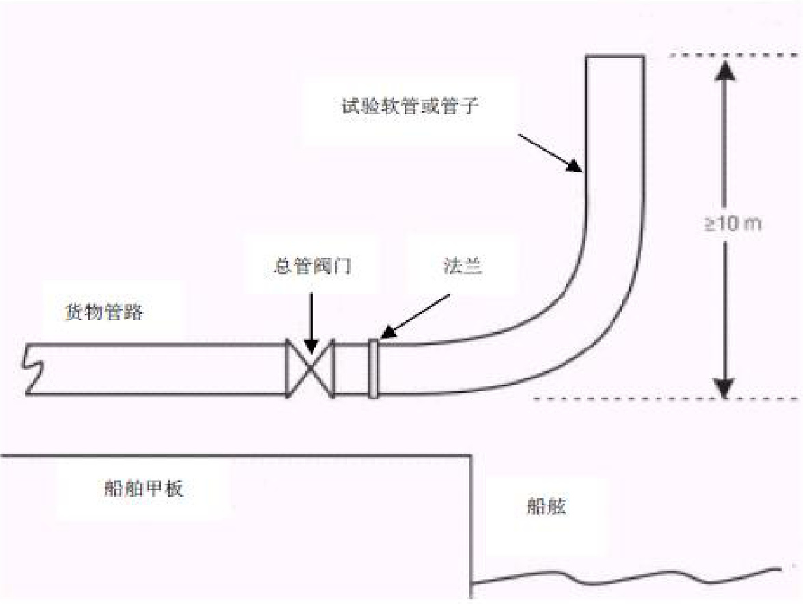  
图1-1  

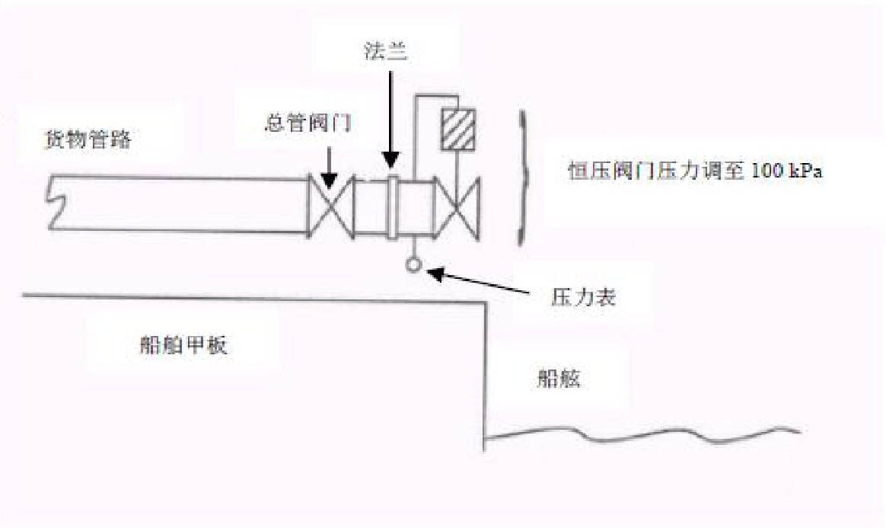  
图1-2  

上述两图说明试验设施将提供液货舱卸货总管处的背压不小于 $100\mathrm{{kPa}}$ 。  

# 附录2 预洗程序  

# A 适用 1994 年 7 月 1 日前建造的船舶  

为满足本章的某些要求，需要预洗程序。本附录解释了应如何执行这些预洗程序。  

# 非凝固物质的预洗程序  

1 液货舱应采用有足够水压力的旋转喷射水柱的方法予以冲洗，对于 X 类物质，洗舱机的运行位置应能冲洗到所有液货舱表面。对于 Y 类物质只需使用一个位置。  

2 在洗舱时，利用不断地将污液泵出并促使流向吸入点方法（顺着纵倾和横倾），将舱内水的总量减至最少。如果不能满足此条件，洗舱程序应重复三次，每次冲洗完毕进行彻底扫舱。3 粘度在 $20^{\circ}\mathrm{C}$ 时等于或大于 $50\mathrm{mPa.s}$ 的物质，应用热水（温度至少 $60^{\circ}\mathrm{C}$ ）洗舱，除非该类物质的性能使得洗舱的效果不大。4 所使用的洗舱机运转循环数应不少于表 1 的规定，洗舱机运转一个循环定义为：洗舱机处在同一方位上运转连续两次间的周期（旋转 $360^{\circ}$ ）。5 洗舱后，洗舱机应保持继续运转足够长的时间，冲洗管路、泵和滤器，并且应继续向岸上接收设备进行排放直至货舱排空。  

# 凝固物质的预洗程序  

1 液货舱在卸货后应尽早进行洗舱。如有可能，液货舱洗舱前应进行加热。2 预洗前，最好能清除舱口及人孔上的残余物。3 液货舱应采用有足够水压力的旋转喷射水柱的方法予以冲洗，同时应位于能确保所有液货舱的表面都冲洗到。4 在洗舱时，利用不断地将污液泵出并促使流向吸入点方法（顺着纵倾和横倾），将舱内水的总量减至最少。如果不能满足此条件，洗舱程序应重复三次，每次冲洗完毕进行彻底扫舱。5 液货舱应用热水（温度至少 $60^{\circ}\mathrm{C}$ ）洗舱，除非该类物质的性能使得洗舱的效果不大。6 所使用的洗舱机运转循环数应不少于表 1 的规定。洗舱机运转一个循环定义为：洗舱机处在同一方位上运转连续两次间的周期（旋转 $360^{\circ}$ ）。7 洗舱后，洗舱机应保持继续运转足够长的时间，冲洗管路、泵和滤器，并且应继续向连至岸上接收设备进行排放直至货舱排空。  

表 1——洗舱机运转在每一位置上的循环数  

<html><body><table><tr><td rowspan="2">物质类别</td><td colspan="2">洗舱机运转循环数</td></tr><tr><td>非凝固物质</td><td>凝固物质</td></tr><tr><td>X类</td><td>1</td><td>2</td></tr><tr><td>Y类</td><td>1/2</td><td>1</td></tr></table></body></html>  

B 适用 1994 年 7 月 1 日或之后建造的船舶，并建议适用 1994 年 7 月 1 日前建造的船舶为满足本章的某些要求，需要预洗程序，本附录解释了应如何来完成这些预洗程序，以及如何确定所使用的洗舱介质的最小容量。少量的洗舱介质可在验证试验的基础上使用以取得海事管理机构的满意。当批准减少容量时必须在手册中记录其影响。  

如使用除水以外的介质进行预洗，本章 3.3.1.5（1）的规定适用之。  

# 不带循环的非凝固物质的预洗程序  

1 液货舱应采用有足够水压力的旋转喷射水柱的方法予以冲洗，对于 X 类物质，洗舱机的运行位置应能冲洗到所有液货舱表面。对于 Y 类和 Z 类物质只需使用一个位置。  
2 在洗舱时，应利用不断将污液泵出并促使流向吸入点的方法，将舱内污液的总量减至最少。如果不能满足此条件，洗舱程序应重复三次，每次冲洗完毕进行彻底扫舱。  
3 粘度在 $20^{\circ}\mathrm{C}$ 时等于或大于 $50\mathrm{mPa.s}$ 的物质，应用热水（温度至少 $60^{\circ}\mathrm{C}$ ）洗舱，除非该类物质的性能使得洗舱的效果不大。  
4 所用洗舱水的数量应不少于下述 20 段中规定的数量或 21 段中确定的数量。  

5 预洗后，货舱和管路应予以彻底清扫。  

# 不带循环的凝固物质的预洗程序  

6 液货舱在卸货后应尽早进行洗舱。如有可能，液货舱洗舱前应进行加热。  
7 预洗前，最好能清除舱口及人口上的残余物。  
8 液货舱应采用有足够水压力的旋转喷射水柱的方法予以冲洗，同时应位于能确保所有液货舱的表面都冲洗到。  
9 在洗舱时，应利用不断将污液泵出并促使流向吸入点的方法将舱内污液的总量减至最少。如果不能满足此条件，洗舱程序应重复三次，每次冲洗完毕进行彻底扫舱。  
10 液货舱应用热水（温度至少 $60^{\circ}\mathrm{C}$ ）洗舱，除非该类物质的性能使得洗舱的效果不大。  
11 所用洗舱水的数量应不少于下述 20 段中规定的数量或 21 段中确定的数量。  
12 预洗后，货舱和管路应予以彻底清扫。  

# 循环利用洗舱介质的预洗程序  

13 用循环洗舱介质的方式可被采用，用以不止一个液货舱的洗舱。在确定数量时，必须适当注意液货舱中残余物的期望数量和洗舱介质的性能，以及是采用初步漂洗还是冲洗。除非提供足够数据，洗舱介质中的货物残余物的最终计算浓度应不超过基于常规扫舱数量的 $5\%$ 。  

14 循环洗舱介质应仅用于清洗含有相同或类似的物质的液货舱。15 足以连续洗舱的大量洗舱介质应加到将予以冲洗的液货舱中。16 所有液货舱表面应采用有足够水压力的旋转喷射水柱予以清洗。洗舱介质的再循环可以在予以冲洗的舱进行，也可以通过另外的舱，例如污液舱。17 洗舱应连续进行直到累积的通过量不少于 20 段中规定的对应相关数量，或 21 段中确定的数量。18 当水作为洗舱介质时，凝固物质以及那些在 $20^{\circ}\mathrm{C}$ 时粘度等于或大于 $50\mathrm{mPa.s}$ 的物质，应用热水（温度至少 $60^{\circ}\mathrm{C}$ ）洗舱。除非这些物质的性能使得洗舱效果不大。19 当循环洗舱达到 17 中规定的程度结束洗舱后，洗舱介质应排放掉并对液货舱进行彻底扫舱。此后，液货舱应进行漂洗，用干净洗舱介质，不断吸入并排入接收设备。漂洗液应至少覆盖舱底并足以冲洗管路、泵和滤器。  

# 用于预洗的最小水量  

20 预洗中所用的最小水量由舱内有毒液体物质的残余量、液货舱尺寸、货物性质、洗舱水排出物的许可浓度以及操作区域来确定。由下列公式计算最小水量：  

$$
\mathrm{Q}{=}\mathrm{k}\ \mathrm{~}(15\mathrm{r}^{0.8}{+}5\mathrm{r}^{0.7}\mathrm{x}\mathrm{V}/1000)
$$  

式中： $Q=$ 要求的最小水量， $\mathbf{m}^{3}$  

$\mathbf{r}={}$ 每液货舱的残余量， $\mathbf{m}^{3}\circ\mathbf{r}$ 值应为实际扫舱效率试验中确定的值，但对于舱容为 $500\mathrm{m}^{3}$ 及以上的液货舱，不应低于 $0.100\mathrm{m}^{3}$ ，对于舱容为 $100\mathrm{m}^{3}$ 及以下的液货舱，不应低于$0.040\mathrm{m}^{3}$ 。对舱容在 $100\mathrm{m}^{3}$ 和 $500\mathrm{m}^{3}$ 之间的液货舱，在计算中允许使用的 r 的最小值由线性插值法求得。对于 X 类物质，r 值应按照标准基于扫舱试验予以确定，注意上述给出的较低限值，或取 $0.9\mathrm{m}^{3}$ 。  
$\mathrm{V}=$ 舱容， $\mathbf{m}^{3}$ 。  
${\sf K}=$ 具有下列值的系数：X 类，非凝固低粘度物质， k = 1.2X 类，凝固物质或高粘度物质， k = 2.4Y 类，非凝固低粘度物质， k = 0.5Y 类，凝固物质或高粘度物质， k = 1.0  

下表是当 k 系数取 1 时用公式计算所得，可作为方便参考。  

<html><body><table><tr><td rowspan="2">扫舱容量（m²)</td><td colspan="3">舱容（m3)</td></tr><tr><td>100</td><td>500</td><td>3000</td></tr></table></body></html>  

<html><body><table><tr><td>≤0.04</td><td>1.2</td><td>2.9</td><td>5.4</td></tr><tr><td>0.10</td><td>2.5</td><td>2.9</td><td>5.4</td></tr><tr><td>0.30</td><td>5.9</td><td>6.8</td><td>12.2</td></tr><tr><td>0.90</td><td>14.3</td><td>16.1</td><td>27.7</td></tr></table></body></html>  

21 考虑到船舶载运的物质，对预洗容量低于上述 20 段中给定的值的批准可进行验证试验达到海事管理机构满意，以证明满足本章 3.3.1 要求。如此验证的预洗容量，对其他预洗条件，应采用上述 20 段中定义的系数 $\mathbf{k}$ 予以调整。”  

# 第 4 章 防止海运包装的有害物质污染规定  

# 第1 节 一般规定  

# 4.1.1 适用范围  

4.1.1.1 除另有规定外，本章适用于运载包装的有害物质的所有国内航行海船。对于船长小于 $20\mathrm{m}$ 的船舶，本章规定应适用于 2006 年 9 月 1 日或以后安放龙骨或处于相应建造阶段的船舶。  

4.1.1.2 除非符合本章各项规定，否则禁止装运包装有害物质。  

4.1.1.3 就本章而言，凡以前曾用于运载有害物质的空包装物，如没有采取适当预防措施保证其中已没有危害海洋环境的残余物，则应将其视为有害物质。  

4.1.1.4 本章的要求不适用于船舶用品和设备。  

# 4.1.2 定义  

4.1.2.1 本章有关定义如下：  

（1）有害物质：系指那些在《国际海运危险货物规则》（IMDG 规则）中确定为海洋污染物的物质。  

（2）包装形式：系指在 IMDG 规则中对有害物质所规定的盛装形式。  

# 4.1.3 包装  

4.1.3.1 根据其所装的特定物质，包装件应能将对海洋环境的危害减至最低限度。  

# 4.1.4 标志与标签  

4.1.4.1 盛装有害物质的包装件，应加上永久的标记或标签，以指明根据 IMDG 规则的相关规定该物质为有害物质。  

4.1.4.2 在盛装有害物质包装件上加标记和标签的方法应符合 IMDG 规则的相关规定。  

# 4.1.5 单证  

4.1.5.1 有关载运有害物质的运输信息应符合 IMDG 规则的相关规定，并应向港口当局指定的个人或组织提供。  

4.1.5.2 每艘装运有害物质的船舶，应具有一份特别清单、舱单或积载图，按 IMDG 规则的相关规定列明船上所装的有害物质及其位置。离港前应备有一份上述单证的副本，以供港口当局指定的个人或组织使用。  

# 4.1.6 积载  

4.1.6.1 有害物质应适当配载和加固，以便能对海洋环境的危害减至最低限度，且不致损害船舶和船上人员的安全。  

# 4.1.7 限量  

4.1.7.1 根据充分的科学和技术上的理由，对海洋环境危害很大的某些有害物质可能必须禁止载运，或对任一船舶可装载的数量加以限制。在限制数量时，应适当考虑船舶的大小、构造和设备，以及该物质的包装及其固有的特性。  

# 第 5 章 防止船舶生活污水污染规定  

# 第1 节 一般规定  

# 5.1.1 适用范围  

5.1.1.1 本章规定适用于下述国内航行海船：  

（1）400 总吨及以上的船舶；  
（2）小于 400 总吨但核定载运 15 人及以上的船舶。  

5.1.1.2 本章规定不适用于不设有卫生设施和医务室的船舶。  

5.1.1.3 适用于本章规定的已经投入营运的船舶应不迟于2020 年12月31 日满足本章规定，以及进行防止生活污水污染的检验。  

# 5.1.2 定义  

5.1.2.1 本章有关定义如下：  

（1）生活污水系指船舶上由人员或活的动物产生的污水，包括：  

$\textcircled{1}$ 1 任何形式的便器的排出物和其他废物；  
$\textcircled{2}$ 医务室(药房、病房等)的洗手池、洗澡盆以及这些处所排水孔的排出物；  
$\textcircled{3}$ 装有活的动物处所的排出物；  
$\textcircled{4}$ 混有上述排出物或废物的其他废水。  

（2）集污舱：系指用于收集和储存生活污水的舱柜。  

（3）最近陆地：系指划定其领海的基线。  

（4）灰水：系指厨房洗涤、洗澡、洗衣和洗脸盆的排水，但不包括本章第 5.1.2.1（1）条定义的来自便器、医务室和动物处所的排水，也不包括来自货物处所的排水。  

# 5.1.3 生活污水的排放  

5.1.3.1 除下述情况之一外，禁止将生活污水排放入海：  

（1）船舶在距最近陆地 3n mile 以外，使用经认可的设备排放经过打碎和消毒的生活污水，或在距最近陆地 12n mile 以外排放未经打碎和消毒的生活污水。但不论何种情况，不应将集污舱柜中储存的生活污水或来自装有活动物的处所的生活污水倾刻排光，而应在船舶以不少于4kn船速在航行途中，以中等速率进行排放。该排放率应按照有关标准予以批准 ；或  

（2）船上装有经认可的生活污水处理装置正在运转，且船舶在航行中，同时排出的污水在其周围的水域中不产生可见的漂浮固体，也不使变色。经生活污水处理装置处理后的排放污水应满足 5.1.4 中规定的生活污水污染物排放限值标准。  

5.1.3.2 当生活污水混有本篇其他章节所约束的废弃物或废水时，则除应满足本章规定外，还应符合其他相应章节的要求。  

# 5.1.4 生活污水污染物排放限值  

5.1.4.1 在 2012 年 1 月 1 日以前安装（含更换）生活污水处理装置 $\textcircled{2}$ 的船舶，向环境水体排放生活污水，其污染物排放控制按表 5.1.4.1 规定执行。  

# 船舶生活污水处理装置污染物排放限值（一）  

表 5.1.4.1  

<html><body><table><tr><td>序号</td><td>污染物项目</td><td>限值</td><td>污染物排放监控位置</td></tr><tr><td>1</td><td>五日生化需氧量（BODs）（mg/L)</td><td>50</td><td rowspan="3">生活污水处理装置出水口</td></tr><tr><td>2</td><td>悬浮物（SS）（mg/L)</td><td>150</td></tr><tr><td>3</td><td>耐热大肠菌群数（个/L）</td><td>2500</td></tr></table></body></html>  

5.1.4.2 在 2012 年 1 月 1 日及以后安装（含更换）生活污水处理装置 的船舶，向环境水体排放生活污水，其污染物排放控制按表 5.1.4.2 规定执行，应执行 5.1.4.3 排放控制要求的船舶除外。  

# 船舶生活污水处理装置污染物排放限值（二） 表 5.1.4.2  

<html><body><table><tr><td>序号</td><td>污染物项目</td><td>限值</td><td>污染物排放监控位置</td></tr><tr><td>1</td><td>五日生化需氧量（BODs）（mg/L)</td><td>25</td><td rowspan="7">生活污水处理装置出水口</td></tr><tr><td>2</td><td>悬浮物（SS）（mg/L)</td><td>35</td></tr><tr><td>3</td><td>耐热大肠菌群数 (个/L)</td><td>1000</td></tr><tr><td>4</td><td>化学需氧量（CODcr）（mg/L)</td><td>125</td></tr><tr><td>5</td><td>pH值 (无量纲)</td><td>6~8.5</td></tr><tr><td>6</td><td>总氯（总余氯）（mg/L)</td><td><0.5</td></tr></table></body></html>  

5.1.4.3 在 2021 年 1 月 1 日及以后安装（含更换）生活污水处理装置 的客运船舶，向内河排放生活污水，其污染物排放控制按表 5.1.4.3 规定执行。  

船舶生活污水处理装置污染物排放限值（三）  
表 5.1.4.3  

<html><body><table><tr><td>序号</td><td>污染物项目</td><td>限值</td><td>污染物排放监控位置</td></tr><tr><td>1</td><td>五日生化需氧量（BODs）（mg/L)</td><td>20</td><td rowspan="8">生活污水处理装置出水口</td></tr><tr><td>2</td><td>悬浮物（SS）（mg/L)</td><td>20</td></tr><tr><td>3</td><td>耐热大肠菌群数 (个/L)</td><td>1000</td></tr><tr><td>4</td><td>化学需氧量（CODcr）（mg/L)</td><td>60</td></tr><tr><td>5</td><td>pH值（无量纲)</td><td>6~8.5</td></tr><tr><td>6</td><td>总氯（总余氯）（mg/L)</td><td><0.5</td></tr><tr><td>7</td><td>总氮(mg/L)</td><td>20</td></tr><tr><td>8</td><td>氨氮(mg/L)</td><td>15</td></tr><tr><td>9</td><td>总磷(mg/L)</td><td>1.0</td></tr></table></body></html>  

# 5.1. 5 设备要求  

5.1. 5.1 为遵守本章 5.1.3 生活污水的排放要求，船舶应至少装有如下的设备之一：  

（1）在距最近陆地 3n mile 以内排放生活污水时，应装有经认可的生活污水处理装置③，装  

置出水口应安装生活污水取样点，并保持可用；  

（2）如仅需在距最近陆地 3n mile 以外排放生活污水，船舶应装有将生活污水进行打碎和消毒的经认可的装置；  

（3）如仅需在距最近陆地 12n mile 以外排放生活污水，可只设集污舱柜，该舱柜应考虑该船在营运期间船上人数以及其他有关的因素具有足够储存全部生活污水的容量①。集污舱柜应设有观察生活污水液位的装置。这种装置可以是液位计、观测孔、手工或自动液位测量装置等；  

（4）船上应设有便于将生活污水排往接收设备的管路，同时该管路上应装有按本章 5.1.6规定的生活污水标准排放接头。  

# 5.1.6 生活污水标准排放接头  

5.1.6.1 凡本章适用的船舶，为了使接收设备的管路能与船上生活污水的排放管路相连接，在这两组管路上应设有符合下述表 5.1.6.1 的生活污水标准排放接头：  

生活污水标准排放接头 表 5.1.6.1  

<html><body><table><tr><td>项目</td><td>尺寸</td></tr><tr><td>外径</td><td></td></tr><tr><td>内径</td><td>按管子的外径确定</td></tr><tr><td>螺栓节圆直径</td><td>170mm</td></tr><tr><td>法兰槽口</td><td>直径为18mm的孔4个等距分布在上述直径的螺栓节圆上，槽口开至法兰外沿。 槽口宽18mm</td></tr><tr><td>法兰厚度</td><td></td></tr><tr><td>螺栓和螺母：数量、直径</td><td>16mm 4个，每个直径16mm，长度适当</td></tr><tr><td colspan="2">法兰应设计为能接受最大内径不大于100mm的管子，并以钢或其他等同材料制成，表面平整，这种法兰连同 适当的垫圈应能承受600kPa的工作压力。</td></tr></table></body></html>  

5.1.6.2 对于型深为 $5\mathrm{m}$ 和小于 $5\mathrm{m}$ 的船舶，排放接头的内径可为 $38\mathrm{mm}$ 。  

5.1.6.3 对于专项营运的船舶如客船，可设有经认可的其他形式的排放接头，如快速连接接头。  

5.1.6.4 对于仅在港区内作业的船舶，当满足下述所有条件时，可替代本章 5.1.5.1(1)中所述的安装生活污水处理装置的要求：  

（1）船舶仅在港区内作业，且在国内航行海船安全与环保证书上予以备注；  

（2）将所有生活污水留存船上，随后排入接收设备；  

（3）船舶应设有足够容量的集污舱以储存全部生活污水，集污舱的设计参照本章 5.1.5.1(3)的相关要求；  

（4）船上应备有生活污水接收单位出具的接收证明，如收据等。  

# 5.1.7 排放控制附加要求  

5.1.7.1 对航行于生活污水和/或灰水禁排区域的船舶，应具有足够舱容以留存船舶在禁排区时所产生的所有生活污水和/或灰水。集污舱的容量应根据载运人数和航区等因素综合考虑。  

# 第 6 章 防止船舶垃圾污染规定  

# 第1 节 一般规定  

# 6.1.1 适用范围  

6.1.1.1 除另有规定外，本章规定适用于所有国内航行海船。  

# 6.1.2 定义  

6.1.2.1 本章有关定义如下：  

（1）垃圾：系指产生于船舶正常营运期间并需要持续或定期处理的各种食品废弃物、生活废弃物和作业废弃物、所有塑料制品、货物残余、焚烧炉灰渣、食用油、动物尸体和电子垃圾，但本篇其他章节中所规定或列出的物质除外。垃圾不包括本法规第 5 篇第5 章第 5.1.2.1（4）条定义的灰水。  

（2）最近陆地：系指划定其领海的基线。  

（3）动物尸体：系指船上作为货物载运且在航行中死亡或被实施安乐死的任何动物的躯体。  

（4）货物残余：系指本篇其他章节未涵盖、且在装载或卸载后仍留在甲板上或货舱内的任何货物的残余物，包括装载和卸载的多余货物或溢出物，无论其处于潮湿或干燥条件下或是夹带在洗涤水中，但不包括进行清扫后在甲板上残留的货物灰尘或船舶外表面上的灰尘。  

（5）食用油：系指用来或拟用来预制或烹饪食物的可食用的任何类型油或动物脂肪，但不包括用这些油预制的食物本身。  

（6）生活废弃物：系指本篇其他章节未涵盖的在船上起居处所产生的所有类型废弃物。生活废弃物不包括灰水。  

（7）在航行途中：系指船舶在海上包括偏离最短直线航道的航行。就实际航行目的而言，会造成海上大范围实际又合乎情理的排放。  

（8）食品废弃物：系指任何变质或未变质的食物，包括水果、蔬菜、乳制品、家禽、肉制品和船上产生的食物碎屑。  

（9）作业废弃物：系指本篇其他章节未涵盖的船上收集的产生于船舶正常维护或作业过程或用于货物存储和装卸的所有固体废弃物（包括泥浆）。作业废弃物也包括货舱和外部洗涤水中包含的清洁剂和添加剂。作业废弃物不包括灰水、舱底水或其他对船舶作业至关重要的类似排出物（根据 IMO 制定的指南 ）。  

（10）塑料制品：系指含一种或多种高分子聚合物作为关键成分的固体材料，其通过聚合形成（成型）或通过加热和/或加压形成成品。塑料的材料属性可为硬且脆，也可为软且有弹性。就本章而言，“一切塑料制品”系指包含或由任何形式塑料制品所组成的所有垃圾，包括合成缆绳、塑料垃圾袋和塑料制品的焚烧炉灰渣。  

（11）电子垃圾：系指用于船舶正常操作的或在生活区域内使用的电气和电子设备，包括所有零配件、半成品和耗材，其丢弃时属于设备的一部分，存在可能对人体健康、环境造成危害的物质。  

# 6.1.3 排放垃圾  

6.1.3.1 除本章 6.1.3.4 和 6.1.3.5 外，禁止一切垃圾排放入海。  

6.1.3.2 一切塑料制品，包括但不限于合成缆绳、塑料垃圾袋和塑料制品的焚烧炉灰渣，  

均禁止排放入海。  

6.1.3.3 禁止将食用油排放入海。  

6.1.3.4 船舶仅在航行途中时才应允许在尽可能远离最近陆地将下述垃圾排放入海：（1）在距最近陆地不到 3n mile 以内（含）的海域，应将食品废弃物收集并排入接受设施；（2）在距最近陆地 3n mile 至 12n mile（含）的海域，应通过粉碎机或磨碎机将食品废弃物处理后排放。这种业经粉碎或磨碎的食品废弃物，应能通过筛眼不大于 $25\mathrm{mm}$ 的粗筛；（3）在距最近陆地 $12\mathrm{n}$ mile 以外的海域，食品废弃物可以排放；（4）在距最近陆地 12n mile 以内（含）不能用通用的卸载方法回收的货物残余应收集并排入接受设施，在最近陆地 12n mile 以外的海域可以排放。根据本章附录规定的衡准，这些货物残余不应包含任何被分类为对海洋环境有害的物质；（5） 对于动物尸体应尽可能远离最近陆地排放入海，但在最近陆地 12n mile 以内（含）的海域，应收集并排入接受设施。6.1.3.5 可将货舱、甲板和外表面洗涤水中包含的清洁剂或添加剂排放入海，但根据本章附录规定的衡准，这些物质必须对海洋环境无害。6.1.3.6 经修正的《1974 年海上人命安全公约》第 VI/1-1.2 条定义的固体散装货物（谷物除外）应按本章附录分类，并由托运人申明其是否对海洋环境有害 。6.1.3.7 如果垃圾与其他被禁止排放或具有不同排放要求的物质混在一起或被其污染，则应适用其中更为严格的要求。  

# 第2 节 告示、垃圾管理计划和垃圾记录簿  

# 6.2.1 告示  

6.2.1.1 凡船长为 $12\mathrm{m}$ 及以上的船舶，应设置告示牌以便船员及乘客知道关于船舶垃圾处理的规定，告示牌应以 $12.5\mathrm{cm}$ 乘 $20\mathrm{cm}$ 的耐久材料制成，应张贴在船员工作和生活处所的显著位置以及放置垃圾收集箱的位置，对于载运旅客的船舶，还应在旅客居住和聚集场所的显著位置张贴。  

# 6.2.2 垃圾管理计划和垃圾记录簿  

6.2.2.1 凡 100 总吨及以上的船舶，以及核准载运 15 人及以上人员的船舶，应备有一份垃圾管理计划②。该计划应对垃圾收集、储藏、加工和处理以及船上设备的使用等提供书面程序，并应指定负责执行该计划的人员。  

6.2.2.2 对于 400 总吨及以上的船舶，以及核准载运 15 人及以上人员的船舶，应备有一份经本局认可的垃圾记录簿，以记录每次排放作业或焚烧作业情况。  

# 附录 对海洋环境有害的固体散装货物分类衡准  

就本章而言，货物残余，如果其根据联合国全球化学品统一分类和标签（GHS）的衡准被分类为满足下列参数的固体散装货物残余，则被视为对海洋环境有害（HME） ：  

.1 急性水中毒性种类 1；和/或.2 慢性水中毒性种类 1 或 2；和/或.3 致癌性②种类 1A 或 1B 以及非快速降解和有高生物积聚；和/或.4 致突变性②种类 1A 或 1B 以及非快速降解和有高生物积聚；和/或.5 生殖毒性②种类 1A 或 1B 以及非快速降解和有高生物积聚；和/或.6 特定目标器官毒性重复暴露②种类 1 以及非快速降解和有高生物积聚；和/或.7 含有或由合成聚合物、橡胶、塑料、或塑料原料颗粒（这包括切碎、粉碎、剁碎或浸软或类似材料）组成的固体散装货物。  

# 第 7 章 防止船舶造成空气污染规定  

# 第1 节 一般规定  

# 7.1.1 适用范围  

7.1.1.1 除本章另有规定外，本章规定适用于所有国内航行海船。7.1.1.2 在本法规生效之日前建造的 400 总吨以下的船舶，应在该日期后的第一次定期检验符合本章的适用要求。  

# 7.1.2 定义  

7.1.2.1 本章有关定义如下：  

（1）连续进料：系指当焚烧炉在正常操作条件下，燃烧室工作温度在 $850^{\circ}\mathrm{C}$ 和 $1200^{\circ}\mathrm{C}$ 之间时，无需人工辅助把废物送入燃烧室的过程。（2）排放：系指从船舶向大气或海洋释放受本章控制的任何物质。（3）装置：系指与本章 7.2.2 有关的在 2009 年 9 月 1 日或以后在船上安装的系统、设备，包括手提式灭火器、绝缘体或其他材料，但不包括对以前安装的系统、设备、绝缘体或其他材料的修理或重新灌装，或对手提式灭火器的重新灌装。（4） NOx 技术规则：系指由 IMO 以 MEPC.177（58）决议通过的并经修正的《船用柴油机氮氧化物排放控制技术规则》。（5）消耗臭氧物质：系指在应用或解释本章相关规定时有效的“1987 年消耗臭氧物质蒙特利尔议定书”第 1 条第 4 款中定义的并在该议定书附件 A、B、C 或 E 中所列的受控物质。  

在船上可能有的消耗臭氧物质包括但不限于：  

Halon1211 溴氯二氟甲烷  
Halon1301 溴三氟甲烷  
Halon2402 1，2－二溴化物－1，1，2，2－四氟乙烷（亦称作 Halon114B2）  
CFC-11 三氯氟甲烷  
CFC-12 二氯二氟甲烷  
CFC-113 1，1，2－三氯－1，2，2－三氟乙烷  
CFC-114 1，2－二氯－1，1，2，2－四氟乙烷  
CFC-115 氯五氟乙烷  

（6）残油：系指船舶正常操作过程中产生的残余废油产物，例如由主机或辅机的燃油或润滑油净化产生的残余废油产物，来自滤油设备的分离废油，滴油盘收集的废油，以及废弃液压油和润滑油。  

（7）船上焚烧：系指把船舶正常作业时产生的废物或其他物质在船上进行焚烧。  

（8）船上焚烧炉：系指以焚烧为主要目的而设计的船上设备。  

（9）液货船：系指在本篇第 2 章 2.1.2.1(4)中定义的油船或第 3 章 3.1.2.1(22)中定义的化学品液货船。  

（10）柴油机：系指本章第 7.2.3 条适用的以液体或双燃料运行的任何船用往复式内燃机，包括增压/复合系统（如适用）。此外，本法规生效之日或以后建造的船舶上安装的气体燃料发动机或在该日期或以后安装的新增气体燃料发动机或非完全相同替代的气体燃料发动机也视为船用柴油机。  

（11）第 1 类柴油机：额定功率大于或等于 37kW 并且单缸排量小于 5L 的船用柴油机。（12）第 2 类柴油机：单缸排量大于或等于 5L 且小于 30L 的船用柴油机。（13）第 3 类柴油机：单缸排量大于或等于 30L 的船用柴油机。（14）柴油机大修：对船用柴油机或船用柴油机的一部分进行拆卸、检查和/或零部件替换，重新组装船用柴油机或船用柴油机系统，提高柴油机的寿命。  

（15）柴油机重大改装：系指柴油机发生如下改变：  

$\textcircled{1}$ 柴油机由非完全相同的柴油机时 替代或新增安装附加的柴油机；或$\textcircled{2}$ 对柴油机进行了 NOx 技术规则中定义的任何实质性改变；或$\textcircled{3}$ 柴油机的最大持续额定功率相对于柴油机初始证书上的最大持续额定功率，增加超过 $10\%$ 。  

（16）安装：系指本章 7.2.3 船用柴油机的安装，包括可移动式辅助船用柴油机，只要其加油、冷却或排气系统是船舶的组成部分。加油系统只有在永久附于船上时才可视为船舶的组成部分。该定义包括用于补充或增强船舶已装动力容量并拟成为船舶组成部分的船用柴油机的安装。  

# 第 2 节 船舶排放控制要求  

# 7.2.1 一般要求  

7.2.1.1 除本篇第 1 章 1.1.2.1 条规定外，本章适用范围内的所有船舶应符合下述要求。  

# 7.2.2 消耗臭氧物质  

7.2.2.1 所有船舶应禁止故意排放消耗臭氧物质。故意排放包括在系统或设备的维护、检修、修理或处置过程中发生的排放，但不包括与消耗臭氧物质的回收或再循环相关的微量释放。  

7.2.2.2 下列船舶应禁止使用含消耗臭氧物质（氢化氯氟烃除外）的装置：  

（1）在 2009 年 9 月 1 日或以后建造的 400 总吨及以上的船舶，以及本法规生效之日或以后建造的小于 400 总吨的船舶；或  

（2）对在 2009 年 9 月 1 日以前建造的 400 总吨及以上的船舶，设备合同交付船上的日期为 2009 年 9 月 1 日或以后，或者无合同交付日期，实际设备交付船上的日期为 2009 年 9 月 1日或以后。  

（3） 对在本法规生效之日以前建造的小于 400 总吨的船舶，设备合同交付船上的日期为本法规生效之日或以后，或者无合同交付日期，实际设备交付船上的日期为本法规生效之日或以后。  

7.2.2.3 下列船舶应禁止使用含氢化氯氟烃（HCFCs）的装置：  

（1）在 2020 年 1 月 1 日或以后建造的船舶；或  

（2）对在 2020 年 1 月 1 日以前建造的船舶，设备合同交付船上的日期为 2020 年 1 月 1 日或以后，或者无合同交付日期，实际设备交付船上的日期为 2020 年 1 月 1 日或以后。  

7.2.2.4 本条所述的物质当从船上卸下时，应送到合适的接收设备中。  

7.2.2.5 设有含本条控制的消耗臭氧物质的可重新充注或更换的系统或设备的船舶，应保存一份含消耗臭氧物质的设备清单。  

7.2.2.6 设有含本条控制的消耗臭氧物质的可重新充注或更换的系统或设备的船舶，应保存一份消耗臭氧物质记录簿。  

7.2.2.7 消耗臭氧物质记录簿中的物质应按其质量单位(kg)记录，且在任何情况下都应及时记入下列内容：  

（1）含消耗臭氧物质的设备的全部或部分重新充注；  
（2）含消耗臭氧物质的设备的修理或维护；  
（3）消耗臭氧物质向大气的排放：$\textcircled{1}$ 故意排放；和$\textcircled{2}$ 非故意排放；  
（4）消耗臭氧物质向陆基接收设施的排放；和  
（5）向船舶供应消耗臭氧物质。  

# 7.2.3 柴油机排气污染物  

7.2.3.1 氮氧化物（NOx）  

（1）本条适用于每台安装在本法规生效之日及以后建造的船舶上的第 3 类柴油机和每台在  
本法规生效之日及以后经过重大改装的第 3 类柴油机。（2）本条不适用于应急柴油机以及安装在救生艇上或只在应急情况下使用的任何设备或装  
置上的柴油机。（3）对于涉及重大改装的柴油机，7.1.2.1（15） $\textcircled{1}$ 所述的柴油机应满足替代或新增柴油机  
时的适用标准。7.1.2.1（15） $\textcircled{2}$ 或 7.1.2.1（15） $\textcircled{3}$ 所述的柴油机应满足船舶建造时的适用标  
准。（4）在本法规生效之日及以后建造的所有船舶上安装的第 3 类柴油机，其 NOx 排放量（按  
总的 $\Nu{\cal O}_{2}$ 加权排放量计算）应在下列限值内：$\textcircled{1}14.4\mathrm{g/kWh}$ , 当 $\mathrm{n}{<}130\mathrm{r}/\mathrm{min}$ 时；$\textcircled{2}44.0{\times}\mathrm{n}^{(-0.23)}\mathrm{g}/\mathrm{kWh}$ ，当 $130\mathrm{r/min}{\le}\mathrm{n}{<}2000\mathrm{r/min}$ 时；$\textcircled{3}7.7\mathrm{g}/\mathrm{kWh}$ ，当 $\mathrm{n}{\geq}2000\mathrm{r}/\mathrm{min}$ 时。其中 $\mathfrak{n}$ 为柴油机额定转速（每分钟曲轴转速）。试验程序和测量方法应符合“NOx 技术规则”的要求。（5）对于在 2022 年 1 月 1 日及以后建造或进行柴油机重大改装的、进入本章附录 16 所述  
的沿海控制区海南水域和内河水域的国内航行海船，所使用的第 3 类柴油机，其 NOx 排放量（按  
总的 $\Nu{\bf O}_{2}$ 加权排放量计算）应在下列限值内：$\textcircled{1}3.4\mathrm{g}/\mathrm{kWh}$ , 当 $\mathrm{n}{<}130\mathrm{r}/\mathrm{min}$ 时；$\textcircled{2}9.0{\times}\mathrm{n}^{(-0.2)}\mathrm{{g}}/\mathrm{{k}\mathrm{{Wh}}}$ ，当 $130\mathrm{r/min}{\le}\mathrm{n}{<}2000\mathrm{r/min}$ 时；$\textcircled{3}2.0\mathrm{g}/\mathrm{kWh}$ ，当 $\mathrm{n}{\geq}2000\mathrm{r}/\mathrm{min}$ 时。  

其中 $\mathfrak{n}$ 为柴油机额定转速（每分钟曲轴转速）。  

试验程序和测量方法应符合“NOx 技术规则”的要求。  

（6）尽管有上述(4)和(5)的规定，对于不满足(4)或(5)排放要求的柴油机，也可采用经认可的排气后处理系统，将柴油机 NOx 排放量至少降低至(4)或(5)规定的限值内。  

7.2.3.2 氮氧化物（NOx）、碳氢化合物（HC）、一氧化碳（CO）、颗粒（PM）  

（1）本条适用于：  

$\textcircled{1}$ 每台安装在本法规生效之日及以后建造船舶上的单缸排量在30L 以下的柴油机；$\textcircled{2}$ 每台在本法规生效之日及以后经过本章 7.1.2.1（14）中定义的柴油机大修的第 1 类和第 2 类柴油机。（2）本条不适用于应急柴油机以及安装在救生艇上或只在应急情况下使用的任何设备或装置上的柴油机。（3）对于 7.2.3.2（1） $\textcircled{1}$ 所述的柴油机，包括新安装上船的或更换①的非完全相同柴油机，应满足柴油机新安装或更换时生效的标准。对于 7.2.3.2（1） $\textcircled{2}$ 所述的柴油机应不低于柴油机大修前对应规定的排放水平。（4）对于本条适用的第 1 类和第 2 类柴油机，其排气污染物中的一氧化碳（CO）、碳氢化合物（HC）和氮氧化物（NOx）、颗粒物（PM）的总加权排放量，乘以按照附录 8 所确定的劣化系数（安装排气后处理系统的柴油机），或加上按照附录 8 所确定的劣化修正值（未安装排气后处理系统的柴油机），其结果应不超出表 $7.2.3.2(4)\textcircled{1}$ 和表 $\ensuremath{7.2.3.2\textcircled{2}}$ 规定的限值：  

$\textcircled{1}$ 安装在 2022 年 7 月 1 日前建造船舶上的柴油机：  

柴油机排气污染物排放限值 表 $7.2.3.2(4)\textcircled{1}$   

<html><body><table><tr><td>柴油机 类型</td><td>单缸排量 (SV）（L/ 缸)</td><td>额定功率 (P) (kW)</td><td>CO (g/kWh)</td><td>HC+ NOx (g/kWh)</td><td>PM (g/kWh)</td></tr><tr><td rowspan="3">第1类</td><td>SV<0.9</td><td>P≥37</td><td>5.0</td><td>7.5</td><td>0.40</td></tr><tr><td colspan="2">0.9≤SV<1.2</td><td>5.0</td><td>7.2</td><td>0.30</td></tr><tr><td colspan="2">1.2≤SV<5</td><td>5.0</td><td>7.2</td><td>0.20</td></tr><tr><td rowspan="5">第2类</td><td colspan="2">5≤SV<15</td><td>5.0</td><td>7.8</td><td>0.27</td></tr><tr><td rowspan="2">15≤SV<20</td><td>P<3300</td><td>5.0</td><td>8.7</td><td>0.50</td></tr><tr><td>P≥3300</td><td>5.0</td><td>9.8</td><td>0.50</td></tr><tr><td colspan="2">20≤SV<25</td><td>5.0</td><td>9.8</td><td>0.50</td></tr><tr><td colspan="2">25≤SV<30</td><td>5.0</td><td>11.0</td><td>0.50</td></tr></table></body></html>  

$\textcircled{2}$ 安装在 2022 年 7 月 1 日或以后建造船舶上的柴油机：  

柴油机排气污染物排放限值 表 $\ensuremath{7.2.3.2\textcircled{2}}$   

<html><body><table><tr><td>柴 油 机 类</td><td>单缸排量(SV) (L/缸)</td><td>额定功率 (P) (kW)</td><td>CO (g/kWh)</td><td>HC+ NOx(g/kWh)</td><td> PM (g/kWh)</td></tr><tr><td rowspan="2">型 第</td><td>SV<0.9</td><td>P≥37</td><td>5.0</td><td>5.8</td><td>0.30</td></tr><tr><td colspan="2">0.9≤SV<1.2</td><td>5.0</td><td>5.8</td><td>0.14</td></tr></table></body></html>  

<html><body><table><tr><td>1 类</td><td colspan="2">1.2≤sV<5</td><td>5.0</td><td>5.8</td><td>0.12</td></tr><tr><td rowspan="10">第 2 类</td><td rowspan="3">5≤SV<15</td><td>P<2000</td><td>5.0</td><td>6.2</td><td>0.14</td></tr><tr><td>2000≤P<3700</td><td>5.0</td><td>7.8</td><td>0.14</td></tr><tr><td>P≥3700</td><td>5.0</td><td>7.8</td><td>0.27</td></tr><tr><td rowspan="3">15≤SV<20</td><td>P<2000</td><td>5.0</td><td>7.0</td><td>0.34</td></tr><tr><td>2000≤P<3300</td><td>5.0</td><td>8.7</td><td>0.50</td></tr><tr><td>P≥3300</td><td>5.0</td><td>9.8</td><td>0.50</td></tr><tr><td rowspan="2">20≤SV<25</td><td>P<2000</td><td>5.0</td><td>9.8</td><td>0.27</td></tr><tr><td>P≥2000</td><td>5.0</td><td>9.8</td><td>0.50</td></tr><tr><td rowspan="2">25≤SV<30</td><td>P<2000</td><td>5.0</td><td>11.0</td><td>0.27</td></tr><tr><td>P≥2000</td><td>5.0</td><td>11.0</td><td>0.50</td></tr></table></body></html>  

（5）对于天然气燃料发动机（包括双燃料发动机），证书申请方可以选择测量非甲烷碳氢化合物（NMHC）代替测量碳氢化合物（HC），并满足表 $7.2.3.2(4)\textcircled{1}$ 和表 $\ensuremath{7.2.3.2\textcircled{2}}$ 中的碳氢化合物限值要求。  

（6）上述船用柴油机排气污染物的试验、测量、数据确定与计算等应按照附录1-附录13的规定进行。  

（7）对于安装在本法规生效之日或以后建造船舶上的本条适用的额定功率在 $37\mathrm{kW}$ 以下的柴油机，其排气污染物中的一氧化碳（CO）、碳氢化合物（HC）和氮氧化物（ $\operatorname{NOx}$ ）、颗粒物（PM）的总加权排放量，乘以按照 GB 20891-2014 附件 BD 所确定的劣化系数（安装排气后处理系统的柴油机），或加上按照 GB 20891-2014 附件 BD 所确定的劣化修正值（未安装排气后处理系统的柴油机），结果应不超出表 7.2.3.2(7)规定的限值。试验程序和测量方法应符合 GB20891-2014 的要求。  

柴油机排气污染物排放限值（额定功率 37kW 以下） 表 7.2.3.2(7)  

<html><body><table><tr><td>额定功率 (P) (kW)</td><td>CO (g/kWh)</td><td>HC+ NOx (g/kWh)</td><td>PM (g/kWh)</td></tr><tr><td>P<37</td><td>5.5</td><td>7.5</td><td>0.60</td></tr></table></body></html>  

# 7.2.4 硫氧化物（ $\mathbf{\sigma}_{\cdot\mathbf{S}\mathbf{Ox}}\mathbf{\dot{\sigma}}_{\cdot}$ ）  

7.2.4.1 船上使用的任何燃油的硫含量不应超过 $3.5\%$ （按质量比， ${\mathfrak{m}}/{\mathfrak{m}})$ ）。  

7.2.4.2 当船舶在本章附录 16 所述的排放控制区内航行、停泊、作业时，船上使用的燃油硫含量应满足如下要求：  

（1）自 2019 年 1 月 1 日起，海船进入排放控制区内，应使用硫含量不大于 $0.50\%$ m/m 的船用燃油。  

（2）自 2020 年 1 月 1 日起，海船当进入内河排放控制区内，应使用硫含量不大于 $0.10\%\mathrm{m/m}$ 的船用燃油。  

（3）自 2020 年 3 月 1 日起，未使用硫氧化物和颗粒物污染控制装置等替代措施的海船，进入排放控制区应禁止装载和使用不符合上述（1）规定的船用燃油。  

（4）自 2022 年 1 月 1 日起，海船进入沿海控制区海南水域，应使用硫含量不大于 $0.10\%\mathrm{m/m}$ 的船用燃油。  

7.2.4.3 船上应备有证明燃油硫含量的书面证据供船舶检验人员核查。  

7.2.4.4 尽管有上述 7.2.4.1 和 7.2.4.2 的规定，船舶可采用经认可的废气清洗系统 达到7.2.4.1 和 7.2.4.2 规定硫含量燃油等效的 $\operatorname{S0x}$ 排放水平。  

7.2.4.5 船舶靠港使用岸电亦可作为使用符合硫含量要求的燃油的替代措施。  

7.2.4.6 使用不同的燃油以符合 7.2.4.2 条燃油规定的船舶，应携有一份书面程序表明燃油转换如何完成，在其靠岸停泊或进入排放控制区域之前应有足够的时间对燃油供给系统进行全面冲洗，以去除所有硫含量超过 7.2.4.2 条规定的适用硫含量的燃料。应将燃油转换作业完成时的每一燃油舱中的低硫燃油的容积以及日期、时间及船舶位置记录在主管机关规定的轮机日志等记录中。  

# 7.2.5 船上焚烧  

7.2.5.1 除本条 7.2.5.4 规定外，船上焚烧应只在船上焚烧炉中进行。  

7.2.5.2 每台在2009 年9 月1 日或以后但在本法规生效之日前安装上船的焚烧炉应满足本章附录 14 的规定，且按照相关规定 予以认可。每台在本法规生效之日或以后安装上船的焚烧炉应满足本章附录 14 的规定，且按照相关规定②予以认可。  

7.2.5.3 应禁止在船上焚烧下列物质：  

（1）本篇第 2、3 和 4 章中的货物残余物以及有关的被污染的包装材料；（2）多氯联苯（PCBs）；（3）本篇第 6 章定义的含有超过微量重金属的垃圾；（4）含有卤素化合物的精炼石油产品。7.2.5.4 船舶正常操作过程中产生的生活污水污泥和油渣可以在船舶主辅发电机的原动机或锅炉内进行焚烧，在这种情况下，应不能在码头、港口和河口内进行焚烧。7.2.5.5 禁止在船上焚烧聚氯乙稀（PVCs），但在本章 7.2.5.2 规定的焚烧炉内焚烧除外。7.2.5.6 装有 7.2.5.2 要求的焚烧炉的所有船舶应持有一份制造厂的操作手册。手册应规定如何在本章附录 14（2）所述的限制内操作焚烧炉。7.2.5.7 负责任何焚烧炉操作的人员应经过培训，并能执行制造厂操作手册中规定的指导。7.2.5.8 任何时候应对燃烧烟道烟气出口温度进行监测，在温度低于 $850^{\circ}\mathrm{C}$ 的最小许可温度时废弃物不应送入连续进料的船上焚烧炉。对于分批进料的船上焚烧炉，该装置应设计成其燃烧室的温度在起动后 5 分钟内达到 $600^{\circ}\mathrm{C}$ 。  

# 7.2.6 燃油质量  

7.2.6.1 为燃烧目的供应到船上并在船上使用的燃油应符合下列要求：  

（1）除下述（2）规定外：  

$\textcircled{1}$ 燃油应为从石油精炼产生的烃的混合物，但不排除少量用于改善某些方面性能的添加剂的混用；  
$\textcircled{2}$ 燃油应不含无机酸；  
$\textcircled{3}$ 燃油应不包含下列任何附加的物质或化学杂质：(a) 使船舶安全遭受危险或对机械性能有不利影响；(b) 对人员造成伤害；(c) 总体上增加空气污染。  

（2）以石油精炼之外的方法得到的用于燃烧的燃油应：  

$\textcircled{1}$ 不超过本章 7.2.4.1 和 7.2.4.2 规定的硫含量；  
$\textcircled{2}$ 不导致柴油机超过本章 7.2.3 规定的 $\mathbf{NOx}$ 排放限值；  
$\textcircled{3}$ 不含有无机酸；  
$\textcircled{4}$ 不会造成上述 7.2.6.1（1） $\textcircled{3}$ (a)、(b)或(c)所述的影响。  

7.2.6.2 本条不适用于核燃料。第 7.2.6.3、7.2.6.4 和 7.2.6.5 条不适用于气体燃料，如液化天然气、压缩天然气或液化石油气。交付船上并专门作为船上燃烧用的气体燃料的硫含量应由供应商提供文件证明。  

7.2.6.3 对于本章规定适用范围内的任何船舶，应以加油记录单的方式对为燃烧目的供应到船上并在船上使用的燃油的加油细节进行记录，该记录单应至少包含本章附录 15 所规定的资料。  

7.2.6.4 加油记录单应保存在船上容易取到的地方以便随时检查。加油记录单应在燃油供应上船后保存 3 年。  

7.2.6.5 加油记录单应附有一份所供燃油的代表样品。该样品应由燃油供应商代表和船长或负责加油操作的官员在完成加油操作后密封并签署①，并由船方控制直到燃油被基本消耗掉，但无论如何其保存期自加油日期算起应不少于 12 个月。  

# 7.2.7 挥发性有机化合物（VOCs）  

7.2.7.1 对于 2020 年 1 月 1 日及以后建造的 150 总吨及以上的国内航行油船，进入本章附录 16 所述的排放控制区，应配备经认可的蒸气排放收集系统②。  

7.2.7.2 载运原油的上述油船，还应备有并实施 VOC 管理计划。该计划应根据国际海事组织制定的指南③编写。该计划应至少包括：  

（1）装载、海上航行和卸货时的操作程序以确保 VOC 排放减至最低限度；  
（2）考虑到原油洗舱产生的额外 VOC 的情况；  
（3）指定负责实施该计划的人员。  

# 7.2.8 船舶靠港使用岸电要求  

7.2.8.1 以下船舶应具备船舶岸电系统船载装置：  

（1）2019 年 1 月 1 日及以后建造的中国籍公务船；  

（2）2020 年 1 月 1 日及以后建造的国内沿海航行集装箱船、邮轮、客滚船、3000 总吨及以上的客船和 50000 吨级及以上的干散货船。  

7.2.8.2 自 2019 年 7 月 1 日起，具有船舶岸电系统船载装置的现有船舶（液货船除外），在满足下述条件时，应使用岸电：  

（1）在本章附录 16 所述的沿海控制区内具备岸电供应能力的泊位停泊超过 3 小时；或者（2）在本章附录 16 所述的内河控制区内具备岸电供应能力的泊位停泊超过 2 小时；且  

（3）船舶不使用其他等效替代措施（包括使用清洁能源、新能源、船载蓄电装置或关闭辅机等）。  

7.2.8.3 自 2021 年 1 月 1 日起，邮轮在本章附录 16 所述的排放控制区内具有岸电供应能力的泊位停泊超过 3 小时，不使用其他等效替代措施的，应使用岸电。  

7.2.8.4 自 2022 年 1 月 1 日起，使用的单台船用柴油发动机输出功率超过 130 千瓦、且不满足 7.2.3.1(5)规定的氮氧化物排放限值要求的国内沿海航行公务船、集装箱船、客滚船、3000总吨及以上的客船和 50000 吨级及以上的干散货船，应加装船舶岸电系统船载装置，并在本章附录 16 所述的沿海控制区内具备岸电供应能力的泊位停泊超过 3 小时，或者在本章附录 16 所述的内河控制区内具备岸电供应能力的泊位停泊超过 2 小时，且不使用其他等效替代措施时，应使用岸电。  

# 附录 1 第 1 类、第 2 类柴油机排气污染物检验技术要求  

# 1.适用范围  

1.1 本技术要求适用于船舶装用的额定净功率大于 37kW 的第 1 类和第 2 类船机（包括主机和辅机）的型式检验、生产一致性检查和耐久性要求等。  

1.2 本标准不适用于船舶装用的应急船机、安装在救生艇上或只在应急情况下使用的任何设备或装置上的船机。  

# 2.型式检验的样机  

2.1 应向负责进行型式检验的检测机构，提交一台符合附录 2 所描述的“船机机型”（或“源机”）特性的船机，完成本标准规定的检验内容。  

# 3.型式检验使用燃料  

3.1 对于使用普通柴油的船机，应使用附录 9 规定的基准柴油。  

3.2 对于使用其他燃料的船机，应使用制造企业型式检验燃料类型的市售燃料。  

3.3 对于可以使用一种以上燃料（非混合燃料）的船机，应用每类燃料分别进行试验，且测试结果均应满足本标准规定的排放要求。对于可同时使用 GB 17411《船用燃料油》所规定的DM 级和 RM 级燃油的柴油机，应用 DM 级和 RM 级燃油分别进行试验。  

3.4 对于可以使用多种混合燃料的船机，应选用会造成排放最恶劣状态的混合燃料进行试验，且测试结果应满足本标准规定的排放要求。  

# 4. 试验规程及取样系统  

4.1 船机排气污染物的测量与取样规程按附录 5 的规定进行，试验循环按附录 3 中表3.8.1.1（1）、或表 3.8.1.1（2）、或表 3.8.1.1（3）、或表 3.8.1.1（4）、或表 3.8.1.1（5）的规定进行。  

4.2 船机的排气污染物应使用附录 4 描述的系统测定。  

如果其他系统或分析仪经认可能得到以下和附录4 规定的测试系统等效的结果，也可使用：在原始排气中测量气态污染物所应用的系统（见附录 4 图 4.1）；— 在全流稀释系统中测量气态污染物所应用的系统（见附录 4 图 4.2）；— 在全流稀释系统中测量颗粒物，使用单滤纸（在整个试验循环中使用一对滤纸）方法或多滤纸（每工况使用一对滤纸）方法取样所应用的系统（见附录 4 图 4.12）。其他系统或分析仪与本标准的某一个或几个基准系统之间的等效性，应在至少七对样本的相关性研究基础上加以确认。  

判定等效性的准则定义为配对样本均值的一致性在 $\pm5\%$ 内。对于引入本标准的新系统，其等效性应根据 GB/T 6379.2-2004 所述的再现性和重复性计算作为根据。  

# 5. 耐久性要求  

5.1 应按照附录 8 的要求进行耐久性试验，证明船机及其后处理装置在正常的工作条件下、在正常的使用寿命期内能够发挥作用。耐久性试验应通过成熟的工程方法来完成。耐久性试验过程中，可以定期进行系统维护，如更换柴油滤芯、机油滤芯等部件，这些工作必须在技术允许的范围内进行。上述系统维护的要求必须包括在用户使用手册中（其中包括制造企业对排气后处理装置耐久性的保证书）。使用说明书中与后处理装置维修、更换有关的内容摘要必须包含  

在附录 2 所描述的排放控制系统相关信息中。  

5.2 应保证船机在表 5.2 规定的有效寿命期内，排气污染物排放符合规定的限值要求，并在型式检验时给予确认。  

5.3 应在检测机构的有效监督下，按照附录 8 的要求，完成耐久性试验，并确定劣化系数（或劣化修正值）。  

# 有效寿命要求表 5.2  

<html><body><table><tr><td rowspan="2"></td><td rowspan="2">船机类型</td><td colspan="2">有效寿命1</td><td rowspan="2">允许最短试验时间 (小时)</td></tr><tr><td>时间(小时)</td><td>年限 (年)</td></tr><tr><td></td><td>第1类和第 2 类</td><td>10000</td><td>10</td><td>2500</td></tr><tr><td></td><td>第1类 (娱乐用)</td><td>1000</td><td>10</td><td>500</td></tr></table></body></html>

注 1：有效寿命小时数和年限，以先到者为准。  

# 6.在用符合性要求  

6.1 制造企业应采取措施，确保正常使用条件下的船舶所安装的船机在正常寿命期内，排放控制装置始终正常运行，在有效寿命期内排放达标。  

6.2 船机的在用符合性核查按照中国船级社《船用柴油机氮氧化物排放试验及检验指南》规定的船上核查程序进行。  

# 7、船机安装在船舶上的要求  

7.1 在船舶上安装的船机应满足该船机型式检验时的下列特征：  

7.1.1 进气压力降不应超过附录 2 附件 A.1.17 对已经型式检验的发动机规定的压力降。  

7.1.2 排气背压不应超过附录 2 附件 A.1.18 对已经型式检验的发动机规定的背压。  

7.1.3 排气后处理装置在排气管路中的位置和基准距离应满足附录 2 附件 A.2 的要求。  

# 8. 生产一致性检查  

8.1 制造企业应按照附录 12 的要求采取措施，保证生产一致性。生产一致性检查中发动机气态污染物和颗粒物的测量值应按实际劣化系数（或劣化修正值）进行校正。  

8.2 生产一致性检查的规定  

8.2.1 从正式投产的船机中随机抽取一台样机，制造企业不得对抽样后用于检验的船机进行任何调整，但可以按照制造企业的技术规范进行磨合。  

8.2.2 对抽取的样机进行外观检验，其配置应与型式检验相关信息（附录 2）的内容一致，如不一致，则判定该批产品的生产一致性不合格。  

8.2.3 若抽取的船机通过试验测得的一氧化碳、碳氢化合物、氮氧化物及颗粒物，均不超过第 7 章 7.2.2.1 规定的限值要求，则该批产品的生产一致性合格。  

8.2.4 如果从正式投产的产品中随机抽取的一台船机不能满足第 7 章 7.2.2.1 规定的限值要求，则制造厂可以要求加抽若干台船机进行生产一致性检查。制造企业应确定抽检样机的数量n（包括原来抽检的一台）。除原来抽检的那台船机以外，其余的船机也都需进行试验。然后，根据抽检的 n 台样机上测得的每一种污染物的比排放量，求出算术平均值 ${\bigl(}{\begin{array}{l}{{\overline{{x}}}}\end{array}}{\bigr)}$ 。如能满足下列条件，则该批产品的生产一致性合格，否则为不合格。  

$$
\overline{{x}}+k\cdot S\leqslant\mathrm{Li}
$$  

$$
S^{2}=\sum_{i=1}^{n}{\frac{(x_{i}-{\overline{{x}}})^{2}}{n-1}}
$$  

式中：Li—表 1 中规定的某种污染物的限值；  
k—根据抽检样机数 n 确定的统计因数，其数值见表 8.2.4；  
xi—n 台样机中第 i 台经过劣化系数（或劣化修正值）校正的试验结果；  
x—n 台样机经过劣化系数（或劣化修正值）校正的测试结果的算术平均值。  

统计因数  
表 8.2.4  

<html><body><table><tr><td>n</td><td>2</td><td>3</td><td>4</td><td>5</td><td>6</td><td>7</td><td>8</td><td>9</td><td>10</td></tr><tr><td>k</td><td>0.973</td><td>0.613</td><td>0.489</td><td>0.421</td><td>0.376</td><td>0.342</td><td>0.317</td><td>0.296</td><td>0.279</td></tr><tr><td>n</td><td>11</td><td>12</td><td>13</td><td>14</td><td>15</td><td>16</td><td>17</td><td>18</td><td>19</td></tr><tr><td>k</td><td>0.265</td><td>0.253</td><td>0.242</td><td>0.233</td><td>0.224</td><td>0.216</td><td>0.210</td><td>0.203</td><td>0.198</td></tr></table></body></html>  

如果 $\mathrm{n}{\geq}20$ ，则 $k=\frac{0.860}{\sqrt{n}}$  

# 9 确定船机系族的参数  

船机系族根据系族内船机必须共有的基本设计参数确定。在某些条件下有些设计参数可能会相互影响，这些影响也必须被考虑进去，以确保只有具有相似排放特性的船机才包含在一个船机系族内。  

同一系族的船机应共有下列基本参数和型号：  

(1)工作循环— 2 冲程— 4 冲程  

(2)冷却介质  
— 空气  
— 水  
— 油  

(3)对于燃气发动机和带后处理器的发动机：—气缸数（如果燃料供给系统为每缸单独计量燃料，则比源机缸数少的其他船机，都可属于同一发动机系族）。  

(4)单缸排量— 系族内各船机间总相差不超过 $15\%$  

(5)进气方式— 自然吸气— 增压— 增压中冷(6)燃烧室型式—分隔式燃烧室—开式燃烧室  

(7)气阀和气道—结构、尺寸和数量  
— 气缸盖  
— 气缸套  
— 曲轴箱  

(8)燃料喷射系统—组合式泵-管-嘴系统  

— 直列泵— 分配泵— 单体泵— 泵喷嘴  

(9)燃料供给系统（燃气发动机）：—混合单元—燃气吸入/喷射（单点，多点）—液态喷射（单点，多点）  

(10)点火系统（燃气发动机）  

(11)其他特性— 废气再循环— 喷水/乳化— 空气喷射— 增压中冷系统(12)排气后处理— 氧化催化器— 还原催化器— 热反应器—颗粒物捕集器—废气洗涤设备  

# 10 源机的选择  

10.1 船机系族源机的选取，应为船机系族中的排放最差机型。根据最大扭矩转速时，每行程最高燃油供油量作为首选原则；若有两台或更多的船机符合首选原则，则应根据额定转速时，每行程最大燃油供油量做为次选原则。  

10.2 如果系族内的船机还有其他能够影响排放的可变特性，那么选择源机时，这些特性也应被确定并考虑在内，可以增选一台（或几台）船机进行试验。  

# 附录 2 型式检验相关信息  

应按以下要求提供船机及其排放控制系统相关信息。  

如果有示意图，应以适当的比例充分说明细节；其幅面尺寸为 A4，或折叠至该尺寸。如果有照片，应显示其细节。如果船机机型或船机系族采用微处理计算机控制，应提供其相关的资料。  

# 源机/船机机型①：  

# 2.1 概述  

2.1.1 厂牌：  

2.1.2 源机和船机系族（如适用）名称：  

2.1.3 制造企业的名称和地址：  

2.1.4 制造企业授权的代理人(如果有)的名称和地址：  

2.1.5 船机标签的位置和固定方法：  

2.1.6 总装厂地址：  

# 2.2 附属文件  

2.2.1 船机（源机）的基本特点以及有关试验的资料。（见附件 A）  

2.2.2 船机系族的基本特点。（见附件 B）  

2.2.3 系族内的各个船机机型的基本特点。（见附件 C）  

2.2.4 源机/机型的照片和/或图纸。  

2.2.5 列出其他附属文件（如有）。  

# 2.3 日期，卷宗  

# 附件 A 船机（源机）的基本特点以及有关试验的资料①  

# A.1 船机描述  

A.1.1 制造企业：  
A.1.2 制造企业的船机型号和编号：  
A.1.3 燃烧循环：四冲程/二冲程②  
A.1.4 气缸数和排列：  
A.1.4.1 缸径：mm  
A.1.4.2 行程： mm  
A.1.4.3 发火次序：  
A.1.5 排量：cm3，L  
A.1.6 容积压缩比③：  
A.1.7 燃烧室和活塞顶图：  
A.1.8 进、排气口的最小横截面积： $\mathrm{cm}^{2}$   
A.1.9 燃烧系统的说明：  
A.1.10 中间转速：r/min  
A.1.11 额定转速：r/min  
A.1.12 燃料④：  
A.1.13 冷却系统  
A.1.13.1 液冷  
A.1.13.1.1 液体性质：  
A.1.13.1.2 循环泵：有/无②  
A.1.13.1.3 特性或厂牌和型号（如适用）：  
A.1.13.1.4 驱动比（如适用）：  
A.1.13.2 风冷  
A.1.13.2.1 风机：有/无②  
A.1.13.2.2 特性或厂牌和型号（如适用）：  
A.1.13.2.3 驱动比（如适用）：  
A.1.14 制造企业的允许温度  
A.1.14.1 液冷：冷却液出口处最高温度：K  
A.1.14.2 风冷：基准点：基准点处最高温度：K  
A.1.14.3 进气中冷器（如适用）出口处空气的最高温度：K  
A.1.14.4 排气管靠近排气歧管或增压器的出口凸缘处内的最高排气温度：K  
A.1.14.5 润滑油温度：最低 K，最高 K  
A.1.15 增压器：有/无②  
A.1.15.1 制造企业：  
A.1.15.2 型号：  
A.1.15.3 系统描述(如：最高增压压力、废气旁通阀(如有))：  
A.1.16 中冷器：有/无②  
A.1.16.1 制造企业：  
A.1.16.2 型号：  

A.1.17 进气系统  

按照 GB/T 21404-2008 规定的功率测量方法，按本标准规定的试验条件，并在船机额定转速和 $100\%$ 负荷下，允许的最大进气压力降：kPa  

A.1.18 排气系统  

按照 GB/T 21404-2008 规定的功率测量方法，按本标准规定的试验条件，并在船机额定转速和 $100\%$ 负荷下，允许的最大排气背压：kPa  

# A.2 防治空气污染的措施  

A.2.1 附加的污染控制装置（如有，而没有包含在其他项目内）  
A.2.1.1 催化转化器：有/无  
A.2.1.1.1 制造企业：  
A.2.1.1.2 型号：  
A.2.1.1.3 催化转化器及其催化单元的数目：  
A.2.1.1.4 催化转化器的尺寸、形状和体积：  
A.2.1.1.5 催化反应的型式：  
A.2.1.1.6 贵金属总含量：  
A.2.1.1.7 各贵金属间的比例：  
A.2.1.1.8 载体（结构和材料）：  
A.2.1.1.9 孔密度：  
A.2.1.1.10 催化转化器壳体的型式：  
A.2.1.1.11 催化转化器的位置（在排气管路中的位置和基准距离）：  
A.2.1.1.12 计量泵制造企业：  
A.2.1.1.13 计量泵型号:  
A.2.1.1.14 反应剂类型：  
A.2.1.1.15 反应剂浓度：  
A.2.1.1.16 NOx 传感器生产企业：  
A.2.1.1.17 NOx 传感器型号：  
A.2.1.2 氧传感器：有/无  
A.2.1.2.1 制造企业：  
A.2.1.2.2 型号：  
A.2.1.2.3 位置：  
A.2.1.3 空气喷射：有/无  
A.2.1.3.1 类型（脉动空气，空气泵，等。）：  
A.2.1.4 EGR：有/无  
A.2.1.4.1 特性（流量等）：  
A.2.1.5 颗粒物捕集器：有/无  
A.2.1.5.1 制造企业：  
A.2.1.5.2 型号：  
A.2.1.5.3 颗粒物捕集器的尺寸、形状和容积：  
A.2.1.5.4 颗粒物捕集器的型式和结构：  
A.2.1.5.5 位置（排气管道中的基准距离）：  
A.2.1.5.6 再生方法或系统，描述和/或图纸：  
A.2.1.6 废气洗涤设备：有/无  
A.2.1.7 其他系统：有/无  

A.2.1.7.1 种类和作用：  

# A.3 燃料供给  

A.3.1 输油泵压力①：kPaA.3.2 喷射系统A.3.2.1 喷油泵A.3.2.1.1 制造企业：A.3.2.1.2 型号：在全负荷供油位置，泵转速为：r/min（额定和最大扭矩）时，供油量 $\mathbb{O}$ ： $\mathrm{mm}^{3}$ /每行程（或循环）；或特性曲线（说明所用的试验方法：在船机上/在油泵试验台上）A.3.2.1.3 喷油提前A.3.2.1.3.1 喷油提前曲线①：A.3.2.1.3.2 静态喷油正时①：A.3.2.1.4 高压油管A.3.2.1.4.1 长度：mmA.3.2.1.4.2 内径：mmA.3.2.1.5 喷油器A.3.2.1.5.1 制造企业：A.3.2.1.5.2 型号：A.3.2.1.5.3 开启压力：kPa①或特性曲线①：A.3.2.1.6 调速器A.3.2.1.6.1 制造企业：A.3.2.1.6.2 型号：A.3.2.1.6.3 全负荷开始减油点的转速：r/minA.3.2.1.6.4 最高空转转速：r/minA.3.2.1.6.5 怠速转速：r/minA.3.2.2 冷起动装置A.3.2.2.1 制造企业：A.3.2.2.2 型号：A.3.2.2.3 描述：  

A.4 气阀正时A.4.1 气阀最大升程，开启和关闭角度：A.4.2 基准值和（或）设定范围：  

# 附件 B 船机系族的基本特点  

# B.1 公有参数  

B.1.1 燃烧循环：B.1.2 冷却介质：B.1.3 吸气方式：B.1.4 燃烧室型式／结构：B.1.5 气阀和气口-结构、尺寸和数量：B.1.6 燃油系统：B.1.7 船机管理系统：依据提供的表格或清单，能证明下述各项相同：增压中冷系统①：废气再循环①：喷水／乳化①：空气喷射①：B.1.8 排气后处理①：提供（有关排气后处理装置的）表格或清单：依据上述所提供的表格或清单，能证明“系统能力/每行程供油量”比率相同，或对于源机比率为最低。B.2 船机系族清单B.2.1 船机系族名称：B.2.2 此系族内船机的规格（见表 B.1）：  

表 B.1  

<html><body><table><tr><td colspan="5"></td><td>源机</td></tr><tr><td>船机机型号</td><td></td><td></td><td></td><td></td><td></td></tr><tr><td>气缸数</td><td></td><td></td><td></td><td></td><td></td></tr><tr><td>排量L</td><td></td><td></td><td></td><td></td><td></td></tr><tr><td>额定转速(r/min)</td><td></td><td></td><td></td><td></td><td></td></tr><tr><td>对应额定转速时，每行程供油量(mm)</td><td></td><td></td><td></td><td></td><td></td></tr><tr><td>额定净功率 (kW)</td><td></td><td></td><td></td><td></td><td></td></tr><tr><td>最大扭矩转速(r/min)</td><td></td><td></td><td></td><td></td><td></td></tr><tr><td>对应最大扭矩转速时，每行程供油量(mm")</td><td></td><td></td><td></td><td></td><td></td></tr><tr><td>最大扭矩 (Nm)</td><td></td><td></td><td></td><td></td><td></td></tr><tr><td>低怠速转速(r/min)</td><td></td><td></td><td></td><td></td><td></td></tr><tr><td>气缸排量(与源机相比的百分数，%)</td><td></td><td></td><td></td><td></td><td>100</td></tr></table></body></html>  

# 附件 C 系族内船机机型的基本特点①  

# C.1 船机描述  

C.1.1 制造企业：  
C.1.2 制造企业的船机代号：  
C.1.3 循环：四冲程/二冲程  
C.1.4 气缸数和排列：  
C.1.4.1 缸径：mm  
C.1.4.2 行程：mm  
C.1.4.3 着火次序：  
C.1.5 排量：cm3，L  
C.1.6 容积压缩比②：  
C.1.7 燃烧室和活塞顶图：  
C.1.8 进、排气口的最小横截面积：cm  
C.1.9 燃烧系统的说明：  
C.1.10 中间转速：r/min  
C.1.11 额定转速：r/min  
C.1.12 燃料③：  
C.1.13 冷却系统  
C.1.13.1 液冷  
C.1.13.1.1 液体性质：  
C.1.13.1.2 循环泵：有/无  
C.1.13.1.3 特性或厂牌和型式（如适用）：  
C.1.13.1.4 驱动比（如适用）：  
C.1.13.2 风冷  
C.1.13.2.1 风机：有/无  
C.1.13.2.2 特性或厂牌和型式（如适用）：  
C.1.13.2.3 驱动比（如适用）：  
C.1.14 制造企业的允许温度  
C.1.14.1 液冷：冷却液出口处最高温度：K  
C.1.14.2 风冷：基准点：基准点处最高温度：K  
C.1.14.3 进气中冷器（如适用）出口处空气的最高温度：K  
C.1.14.4 排气管靠近排气歧管或增压器的出口凸缘处内的最高排气温度：K  
C.1.14.5 润滑油温度：最低 K，最高 K  
C.1.15 增压器：有/无  
C.1.15.1 制造企业：  
C.1.15.2 型号：  
C.1.15.3 系统描述(如：最高增压压力、废气旁通阀(如有))：  
C.1.16 中冷器：有/无  
C.1.16.1 制造企业：  
C.1.16.2 型号：  
C.1.17 进气系统  

按照 GB/T 21404-2008 规定的功率测量方法，按本标准规定的试验条件，并在船机额定转速和 $100\%$ 负荷下，允许的最大进气压力降：kPa  

C.1.18 排气系统  

按照 GB/T 21404-2008 规定的功率测量方法，按本标准规定的试验条速和 $100\%$ 负荷下，允许的最大排气背压：kPa  

C.2 防治空气污染的措施  
C.2.1 附加的污染控制装置（如有，而没有包含在其他项目内）  
C.2.1.1 催化转化器：有/无  
C.2.1.1.1 制造企业：  
C.2.1.1.2 型号：  
C.2.1.1.3 催化转化器及其催化单元的数目：  
C.2.1.1.4 催化转化器的尺寸、形状和体积：  
C.2.1.1.5 催化反应的型式：  
C.2.1.1.6 贵金属总含量：  
C.2.1.1.7 各贵金属间的比例：  
C.2.1.1.8 载体（结构和材料）：  
C.2.1.1.9 孔密度：  
C.2.1.1.10 催化转化器壳体的型式：  
C.2.1.1.11 催化转化器的位置（在排气管路中的位置和基准距离）：  
C.2.1.1.12 计量泵制造企业：  
C.2.1.1.13 计量泵型号:  
C.2.1.1.14 反应剂类型：  
C.2.1.1.15 反应剂浓度：  
C.2.1.1.16 NOx 传感器生产企业：  
C.2.1.1.17 NOx 传感器型号：  
C.2.1.2 选择性催化还原后处理器（SCR 系统）：有/无  
C.2.1.2.1 计量泵制造企业：  
C.2.1.2.2 计量泵型号:  
C.2.1.2.3 反应剂类型：  
C.2.1.2.4 反应剂浓度：  
C.2.1.2.5 NOx 传感器生产企业：  
C.2.1.2.6 NOx 传感器型号：  
C.2.1.3 氧传感器：有/无  
C.2.1.3.1 制造企业：  
C.2.1.3.2 型号：  
C.2.1.3.3 位置：  
C.2.1.4 空气喷射：有/无  
C.2.1.4.1 类型（脉动空气，空气泵，等。）：  
C.2.1.5 EGR：有/无  
C.2.1.5.1 特性（流量等）：  
C.2.1.6 颗粒物捕集器：有/无  
C.2.1.6.1 制造企业：  
C.2.1.6.2 型号：  
C.2.1.6.3 颗粒物捕集器的尺寸、形状和容积：  

C.2.1.6.4 颗粒物捕集器的型式和结构：C.2.1.6.5 位置（排气管道中的基准距离）：C.2.1.6.6 再生方法或系统，描述和/或图纸：C.2.1.7 废气洗涤设备：有/无C.2.1.8 其他系统：有/无C.2.1.8.1 种类和作用：C.3 燃料供给C.3.1 输油泵压力①：kPaC.3.2 喷射系统C.3.2.1 喷油泵C.3.2.1.1 制造企业：C.3.2.1.2 型号：在全负荷供油位置，泵转速为：r/min（额定和最大扭矩）时，供油量①：mm3/每行程（或循环）；或特性曲线（说明所用的试验方法：在船机上／在油泵试验台上）C.3.2.1.3 喷油提前C.3.2.1.3.1 喷油提前曲线①：C.3.2.1.3.2 静态喷油正时①：C.3.2.1.4 高压油管C.3.2.1.4.1 长度：mmC.3.2.1.4.2 内径：mmC.3.2.1.5 喷油器C.3.2.1.5.1 制造企业：C.3.2.1.5.2 型号：C.3.2.1.5.3 开启压力①：kPa 或特性曲线①：C.3.2.1.6 调速器C.3.2.1.6.1 制造企业：C.3.2.1.6.2 型号：C.3.2.1.6.3 全负荷开始减油点的转速：r/minC.3.2.1.6.4 最高空转转速：r/minC.3.2.1.6.5 怠速转速：r/minC.3.2.2 冷起动装置C.3.2.2.1 制造企业：C.3.2.2.2 型号：C.3.2.2.3 描述：C.4 气阀正时C.4.1 气阀最大升程，开启和关闭角度：C.4.2 基准值和（或）设定范围：  

# 附录 3 试验规程  

# 1 概述  

1.1 本附录描述了船机排气污染物的测量方法。  
1.2 试验应在发动机测功机台架上进行。  

# 2 试验条件  

2.1 所有的体积和体积流量都必须折算到 273K（ $0^{\circ}\mathrm{C}$ ）和 $101.3\mathrm{{kPa}}$ 的基准状态。  
2.2 船机试验条件  

2.2.1 进气的绝对温度 Ta 用 K 表示，干空气压 $\mathbf{Ps}$ 用 $\mathbf{kPa}$ 表示，应根据下列公式计算实验室大气因子 fa：(a) 对于柴油(燃料油）船机：$f_{a}=\left(\frac{99}{P_{s}}\right)\times\left(\frac{T_{a}}{298}\right)^{0.}$ .7对于自然吸气和机械增压船机：$f_{a}=\left(\frac{99}{P_{s}}\right)^{0.7}\times\left(\frac{T_{a}}{298}\right)^{1.5}$ 5对于带或不带进气中冷的涡轮增压船机：  

(b) 对于燃气船机：  

$$
\mathrm{f_{a}}{=}\left(\frac{99}{P_{s}}\right)^{1.2}\times\left(\frac{T_{a}}{298}\right)^{0.6}
$$  

# 2.2.2 试验有效性的判定  

当实验室大气因子 fa 满足下列条件时，认为试验有效：  

$$
0.93{\leqslant}\mathrm{f}_{\mathrm{a}}{\leqslant}1.07
$$  

# 2.2.3 增压中冷系统  

必须记录增压空气的温度，在额定转速和全负荷，增压空气的温度应保持在制造企业规定的最大增压空气温度的±5K 范围内，冷却介质温度应不低于 293K（ $20^{\circ}\mathrm{C}$ ）。  

如果使用试验室系统或外部风机，增压空气温度应设定在制造企业在额定转速和全负荷规定的最大增压空气温度的 $\pm5\mathrm{K}$ 范围内。在上述设定点增压空气冷却器的冷却介质温度和冷却介质流量在整个试验过程中不应改变，增压空气冷却器的体积应建立在良好的工程经验的基础上并应是在船上应用的。  

# 2.3 进气系统  

试验船机应该装有一套进气系统，其进气压力降应为制造企业规定的上限值的 $\pm300\mathrm{{Pa}}$ 范围内：在制造企业规定的船机最大进气流量的工作条件下，由清洁的空气滤清器或进气消音器所产生的进气压力降。  

如果试验室系统可以代表实际的船机运行条件，则可以使用试验室系统。  

# 2.4 排气系统  

试验船机应该装有一套排气系统，其排气背压为制造企业规定的上限值的±650Pa 范围内：  

即在船机额定功率的工作条件下所产生的排气背压。  

如果发动机安装有排气后处理装置，排气管在包含后处理装置的膨胀部分的上游应具有至少 4 倍管径的直管段。从排气歧管法兰或涡轮增压器出口到排气后处理装置的距离应和实际应用情况相同或在制造企业的技术要求范围内。排气背压或进气阻力应遵循上述同样的标准，可以使用阀进行设定。在模拟实验和发动机标定期间，后处理装置的内容物可以去掉，用一无活性的催化器载体替代。  

# 2.5 冷却系统  

船机的冷却系统应有足够的能力使船机保持制造企业规定的正常工作温度。  

2.6 润滑油应该记录试验时所用润滑油的规格。  

2.7 试验燃料  

试验燃料应满足附录 1 第 3 条的规定。  
试验燃料的十六烷值、含硫量和密度应记录。  
喷油泵进口处的燃油温度应为 $306{\sim}316\mathrm{K}$ ( $33{\sim}43^{\circ}\mathrm{C}$ )，或符合制造企业的规定。  

# 2.8 功率  

比排放量测量以不修正的净功率为基础。试验时，应拆除某些安装在船机上、仅用于操纵船舶所需的辅件。诸如：  

制动用空气压缩机；制动转向用压缩泵；空调压缩机；— 液压驱动泵  

见附录 10 的描述。  

如上述辅件未被拆除，则应确定这些辅件在试验转速下所吸收的功率，以便按照第 2.9条的规定计算测功机的设定值。  

2.9 测功机设定值的确定  

进气压力降和排气背压的设定值应根据第 2.3 条和第 2.4 条的规定调节到制造企业规定的上限。  

为了计算规定试验工况的扭矩值，应根据试验确定规定试验转速下的最大扭矩值。对于工作范围没有覆盖全负荷扭矩特性曲线全部工况点的船机，应由制造企业确定测试转速下的最大扭矩。  

每个试验工况的船机设定值应用下列公式计算：  

$$
S=P_{_{(n)}}\times\frac{L}{100}+(P_{_{(a)}}-P_{_{(b)}})
$$  

如果 P(b)  P(a)  0.03，则(P(b)-P(a))值需检测机构认可。P（n)  

# 3 试验  

3.1 准备取样滤纸  

试验前至少一小时，每张(对)滤纸应该放在一个有盖但不密封的培养皿中，放入称重室进行稳定。稳定结束后，应称量每张(对)滤纸的净质量并记录，然后把这张(对)滤纸放置在有盖的培养皿中或滤纸保持架上直到试验需要，如果这张(对)滤纸在离开称重室的 8 小时内没有使用，在使用前必须重新稳定、称重。  

# 3.2 安装测量设备  

仪器和取样探头应根据要求进行安装。当用全流稀释系统对排气进行稀释时，排气管应与系统相连。  

# 3.3 起动稀释系统和船机  

起动并预热稀释系统和船机直到在全负荷和额定转速下所有的温度和压力达到制造企业规定的要求。  

# 3.4 背景颗粒物的测量  

对单滤纸方法(多滤纸方法选用)，应起动颗粒物取样系统并在旁通条件下运行。按照GB15097 附件 BA 规定的方法对稀释空气进行颗粒物取样，测量稀释空气的背景颗粒物值。应对稀释空气进行过滤，并在试验前、或试验中、或试验后测量背景颗粒物值。  

# 3.5 调节稀释比  

稀释空气的设定应保证每个试验工况滤纸表面温度不超过 $325\mathrm{K}(52^{\circ}\mathrm{C})$ ，总稀释比应该不低于 4。  

对全流稀释系统单滤纸方法，在所有工况下（对于没有旁通能力的系统每工况的前 10 秒除外），通过滤纸的取样质量流量与稀释排气质量流量应保持一恒定的比例，该质量流量比的偏差应控制在 $+5\%$ 以内。 对部分流稀释系统单滤纸方法，在所有工况下（对于没有旁通能力的系统每工况的前 10 秒除外），通过滤纸的取样质量流量应保持恒定，其偏差应在 $+5\%$ 以内。  

# 3.6 背景稀释空气浓度的测量  

对于通过测量 $\mathrm{CO}_{2}$ 和 $\mathsf{N O x}$ 浓度控制稀释比的系统，应在每次试验的开始和结束时测量稀释空气中 $\mathrm{CO}_{2}$ 和 $\mathsf{N O x}$ 的含量，试验前后测量的稀释空气中 $\mathrm{CO}_{2}$ 和 $\mathsf{N O x}$ 的背景浓度应分别在 $100\mathrm{ppm}$ 或 5ppm 以内。  

当使用稀释排气分析系统时，相关的背景浓度应该根据整个试验过程中采入取样袋的稀释空气确定。  

连续背景浓度测量（无取样袋）至少需要在试验前、接近试验循环中间和试验后测量三次，并求平均值。在制造企业的要求下，背景测量可以被忽略。  

# 3.7 检查分析仪  

应标定排放分析仪的零点和量距点。  

# 3.8 试验程序  

# 3.8.1 试验循环  

3.8.1.1 对于按推进特性运行的船用主机，按表 3.8.1.1（1）四工况循环进行试验。  

表 3.8.1.1（1）  

<html><body><table><tr><td>工况号</td><td>发动机转速 (额定转速的百分比)</td><td>最大净功率的百分比</td><td>加权系数</td></tr><tr><td>1</td><td>100</td><td>100</td><td>0.20</td></tr><tr><td>2</td><td>91</td><td>75</td><td>0.50</td></tr><tr><td>3</td><td>80</td><td>50</td><td>0.15</td></tr><tr><td>4</td><td>63</td><td>25</td><td>0.15</td></tr></table></body></html>  

3.8.1.2 对于使用电力驱动或调距桨装置、在恒定转速下工作的船用主机，按表 3.8.1.1（2）四工况循环进行试验。  

<html><body><table><tr><td>工况号</td><td>发动机转速</td><td>负荷百分比</td><td>加权系数</td></tr><tr><td>1</td><td>额定转速</td><td>100</td><td>0.20</td></tr><tr><td>2</td><td>额定转速</td><td>75</td><td>0.50</td></tr><tr><td>3</td><td>额定转速</td><td>50</td><td>0.15</td></tr><tr><td>4</td><td>额定转速</td><td>25</td><td>0.15</td></tr></table></body></html>

3.8.1.3 对于在非恒定转速下工作的船用辅机，按表 3.8.1.1（3）八工况循环进行试验。  

表 3.8.1.1（3）  

<html><body><table><tr><td>工况号</td><td>发动机转速</td><td>负荷百分比</td><td>加权系数</td></tr><tr><td>1</td><td>额定转速</td><td>100</td><td>0.15</td></tr><tr><td>2</td><td>额定转速</td><td>75</td><td>0.15</td></tr><tr><td>3</td><td>额定转速</td><td>50</td><td>0.15</td></tr><tr><td>4</td><td>额定转速</td><td>10</td><td>0.1</td></tr><tr><td>5</td><td>中间转速</td><td>100</td><td>0.1</td></tr><tr><td>6</td><td>中间转速</td><td>75</td><td>0.1</td></tr><tr><td>7</td><td>中间转速</td><td>50</td><td>0.1</td></tr><tr><td>8</td><td>怠速</td><td>0</td><td>0.15</td></tr></table></body></html>  

3.8.1.4 对于在恒定转速下工作的船用辅机，按表 3.8.1.1（4）五工况循环进行试验。  

表 3.8.1.1（4）  

<html><body><table><tr><td>工况号</td><td>发动机转速</td><td>负荷百分比</td><td>加权系数</td></tr><tr><td>1</td><td>额定转速</td><td>100</td><td>0.05</td></tr><tr><td>2</td><td>额定转速</td><td>75</td><td>0.25</td></tr><tr><td>3</td><td>额定转速</td><td>50</td><td>0.3</td></tr><tr><td>4</td><td>额定转速</td><td>25</td><td>0.3</td></tr><tr><td>5</td><td>额定转速</td><td>10</td><td>0.1</td></tr></table></body></html>

对于第 1 类船机（娱乐用），应按表 3.8.1.1（5）五工况循环进行  

3.8.1.5 试验。  

表 3.8.1.1（2）  
表 3.8.1.1（5）  

<html><body><table><tr><td>工况号</td><td>发动机转速 (额定转速的百分比)</td><td>最大净功率的百分比</td><td>加权系数</td></tr><tr><td>1</td><td>100</td><td>100</td><td>0.08</td></tr><tr><td>2</td><td>91</td><td>75</td><td>0.13</td></tr><tr><td>3</td><td>80</td><td>50</td><td>0.17</td></tr><tr><td>4</td><td>63</td><td>25</td><td>0.32</td></tr><tr><td>5</td><td>怠速</td><td>0</td><td>0.30</td></tr></table></body></html>  

# 3.8.2 船机的调节  

为了使船机参数稳定到制造企业的规定值，应在额定转速和 $100\%$ 负荷百分比条件下预热  

船机和系统。  

3.8.3 试验程序  

按照第 3.8.1 条中表 3.8.1.1（1）、或表 3.8.1.1（2）、或表 3.8.1.1（3）、或表 3.8.1.1）或表 3.8.1.1（5）列出的工况号的顺序，依次进行。  

试验循环中，每工况过渡阶段以后，规定的转速必须保持稳定，偏差应在额定转速的 $+1\%$ 或 $+3\mathrm{r/min}$ ，取其中较大值；怠速点应该在制造企业规定的偏差以内。规定扭矩在试验测量阶段的平均值应该保持稳定，偏差应在试验转速下最大扭矩的 $+2\%$ 以内。  

每工况最少需要 10 分钟时间，当对某台船机进行试验，为了在测量滤纸上获得足够的颗粒物质量，需要更长的取样时间时，试验工况时间可以根据需要延长。  

工况时间应该记录并写入报告中。  

在每个工况的最后 3 分钟测量气态污染物浓度值并记录。  

在船机达到稳定状态之前，不应该进行颗粒物的采样和气态污染物的测量， 稳定条件由制造企业确定。颗粒物采样和气态污染物测量的完成时间应一致。  

燃油温度应在制造企业规定的位置或在燃油喷射泵的进口测量，应记录测量点的位置。  

# 3.8.4 分析仪响应  

排气应至少在每工况的最后 3 分钟通过分析仪，分析仪的输出结果应该用磁带记录仪或等效的数据采集系统记录。如果对稀释后的 CO 和 $\mathrm{CO}_{2}$ 气体使用取样袋方式测量，排气应在每工况的最后 3 分钟进入取样袋，然后对取样袋分析并记录结果。  

# 3.8.5 颗粒物取样  

采用单滤纸方法或多滤纸方法进行颗粒物取样，由于使用不同的方法所产生的结果可能会略有不同，使用的方法必须和结果一起说明。  

对单滤纸方法，试验循环中的加权系数在取样过程中应该考虑，并据此调节取样流量和取样时间。  

必须尽可能在每个工况的最后进行取样，每工况的取样时间，对单滤纸方法最少 20 秒，对多滤纸方法最少 60 秒；对没有旁通功能的系统，每工况的取样时间，对单滤纸和多滤纸方法最少必须 60 秒。  

# 3.8.6 船机状态  

在每个工况下，当船机稳定后， 应该测量船机的速度和负荷、进气温度、燃油消耗量、进气或排气流量。  

如果不可能进行排气流量、或进气流量和燃油消耗量的测量，可以只测量燃油消耗量，然后用碳平衡方法计算排气流量。  

应记录排放结果计算所需要的测量数据。  

# 3.9 分析仪的检查  

排放试验过后，应该用零气和相同的量距气重新检查分析仪，如果试验前、后的检查结果相差不到 $2\%$ ，则认为试验有效。  

# 附录 4 气体和颗粒物取样系统  

# 4.1 气体和颗粒物取样系统（见表 4.1）  

表 4.1  

<html><body><table><tr><td>图号</td><td>描述</td></tr><tr><td>4. 1</td><td>原始排气的排气分析系统</td></tr><tr><td>4. 2</td><td>稀释排气的排气分析系统</td></tr><tr><td>4.3</td><td>部分流，等动态流，抽气泵控制，部分取样</td></tr><tr><td>4. 4 </td><td>部分流，等动态流，压气机控制，部分取样</td></tr><tr><td>4.5</td><td>部分流，CO2和NOx控制，部分取样</td></tr><tr><td>4. 6</td><td>部分流，CO2和碳平衡控制，全部取样</td></tr><tr><td>4. 7</td><td>部分流，单文丘里管和浓度测量，部分取样</td></tr><tr><td>4.8</td><td>部分流，双文丘里管或孔板和浓度测量，部分取样</td></tr><tr><td>4. 9</td><td>部分流，管路分流和浓度测量，部分取样</td></tr><tr><td>4. 10</td><td>部分流，流量控制，全部取样</td></tr><tr><td>4. 11</td><td>部分流，流量控制，部分取样</td></tr><tr><td>4. 12</td><td>全流，容积泵或临界流文丘里管，部分取样</td></tr><tr><td>4.13</td><td>颗粒物取样系统</td></tr><tr><td>4. 14 </td><td>全流稀释系统</td></tr></table></body></html>  

# 4.1.1 气态污染物的测定  

第 4.1.1.1 条图 4.1 和图 4.2 中包含推荐的取样和分析系统的详细描述，由于不同的配置能产生相同的效果，完全符合这些图没有必要。可以使用附加部件，如仪表、阀、电磁阀、泵和开关，以便提供附加的信息及协调部件系统的功能。若其他部件对于保持某些系统精确度并非必须，则可凭成熟的工程判断加以去除。  

4.1.1.1 气态污染物组分 CO， $\mathrm{C0}_{2}$ ， HC， $\mathrm{N}0_{\mathrm{x}}$  

对在原始排气和稀释排气中测定气态污染物的分析系统的描述是建立在使用以下分析仪的基础上的。  

测量 CO 和 $\mathrm{C0}_{2}$ 的 NDIR；  

—测量 HC 的 HFID；  

—测量 $\mathrm{N}0_{\mathrm{x}}$ 的 HCLD 或等效的分析仪；  

对原始排气（见图 4.1），所有组分的取样可以用一个取样探头或两个相互靠近的取样探头并在内部分流到不同的分析仪。应采取措施确保在分析系统的任何部位不发生排气组分（包括水和硫酸盐）的凝结。  

图 4.1 测量原始排气的 CO， $\mathrm{C0}_{2}$ 、 $0_{2}$ 、HC 和 $\mathrm{N}0_{\mathrm{x}}$ 分析系统流程图取样通道的所有部件必须保持各系统要求的相应温度。  

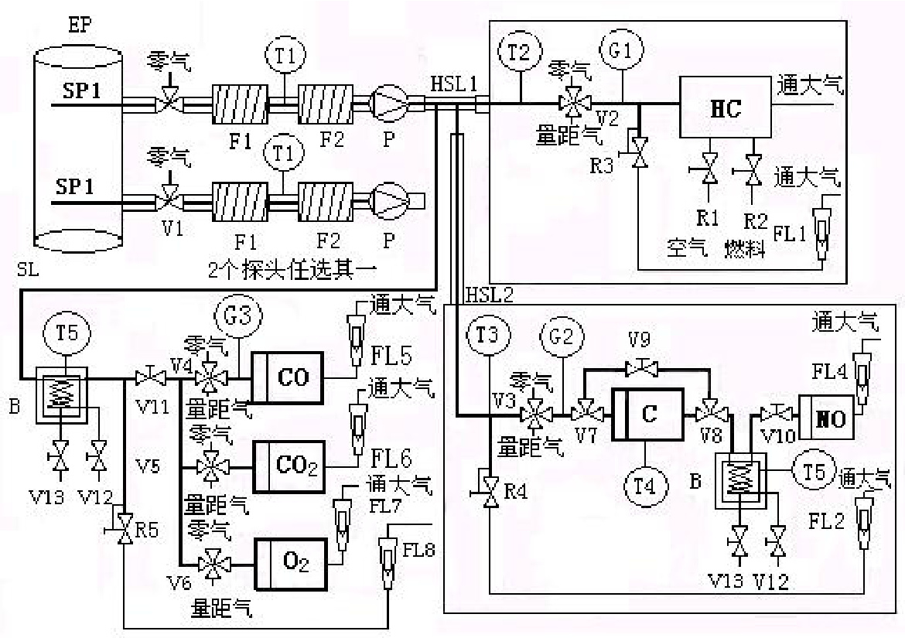  
图 4.2 测量稀释排气的 CO， $\mathrm{C0}_{2}$ 、HC 和 $\mathrm{N}0_{\mathrm{x}}$ 分析系统流程图  

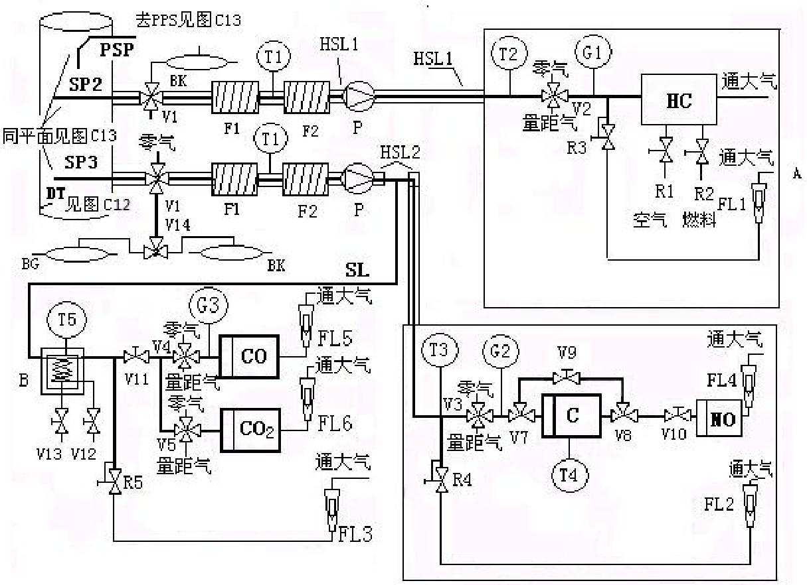  
图 4.1 和图 4.2 的描述：总则：  

(1) SP1 原始排气取样探头（只用于图 4.1）  

推荐使用顶端封闭、多孔、不锈钢直探头。内径不应该超过取样管的内径。取样探头的壁厚不应该超过 1mm，在三个不同的径向平面上，至少应有取样流量大致相同的三个孔。取样探头需延伸到排气管至少 $80\%$ 内径的地方。  

(2) SP2 稀释排气 HC 取样探头（只用于图 4.2）  

取样探头应该：  

—定义为 HC 取样管路（HSL1）前端 $254\mathrm{{mm}}$ 到 $762\mathrm{mm}$ 的部分；  

—最小内径 $5\mathrm{mm}$ ；  

—安装在稀释通道 DT（见第 1.2.1.2 条）内，稀释空气和排气充分混合的地方（如：距离排气进入稀释通道点的下游大约 10 倍管径的地方）；  

—离其他取样探头和管壁足够远（径向），以免受涡流或尾流的影响；  
—加热，使取样探头出口气流温度保持在 463K（ $190^{\circ}\mathrm{C}$ ） $+10\mathrm{K}$ 。  

(3) SP3 稀释排气 CO， $\mathrm{C0}_{2}$ ， $\mathrm{N}0_{\mathrm{x}}$ 取样探头（只用于图 2.2）  

取样探头应该：  
—位于和 SP2 相同的平面；  
—离其他取样探头和管壁足够远（径向），以免受涡流或尾流的影响；  
—在整个长度加热并绝热，以保持温度最低在 328K（ $55\mathrm{{^\circC}}$ ）以上以防止水份凝结；  

(4) HSL1 加热取样管路  

取样管把样气从取样探头输送到分流点和 HC 分析仪。  

取样管路应该：  

—最小内径 $5\mathrm{mm}$ ，最大内径 $13.5\mathrm{mm}$ ；  
—用不锈钢或聚四氟乙烯（PTFE）制造；  

—如果取样探头处的排气温度等于或低于 463K（ $190^{\circ}\mathrm{C}\cdot$ )，保持每一个控制加热部分的壁温在 463K（ $190^{\circ}\mathrm{C}$ ） $+10\mathrm{K}$ ；  

—如果取样探头处的排气温度高于 463K（ $190^{\circ}\mathrm{C}$ ），保持壁温在 453K（ $180^{\circ}\mathrm{C}$ ）以上；  
—保持加热过滤器(F2)和 HFID 前的气体温度在 463K（ $190^{\circ}\mathrm{C}$ ） $+10\mathrm{K}$ 。  

(5) HSL2 加热的 $\mathrm{N}0_{\mathrm{x}}$ 取样管路  

取样管路应该：  

—当使用冷却器时，保持到转化器前的壁温在 328K 到 473K（ $55^{\circ}\mathrm{C}$ 到 $200^{\circ}\mathrm{C}$ ）；当不使用冷却器时，保持到分析仪的壁温在 328K 到 473K（ $55^{\circ}\mathrm{C}$ 到 $200^{\circ}\mathrm{C}$ ）；  

—用不锈钢或 PTFE 制造；  

由于取样管路的加热仅仅用于防止水和硫酸盐的凝结，因此取样管路的温度取决于燃料的硫含量。  

(6) SL $\mathrm{{C0}(C0_{2})}$ 取样管路取样管路用不锈钢或 PTFE 制造。可以加热或不加热。  

(7) BK 背景取样袋(选用；仅用于图 4.2)用于测量背景浓度。  

(8) BG 取样袋(选用；仅用于图 4.2 的 CO 和 $\mathrm{C0}_{2}^{\cdot}$ )用于测量取样浓度。  

(9) F1 加热的前置过滤器(选用)温度应该和 HSL1 相同。  

(10) F2 加热的过滤器样气进入分析仪之前，过滤器应该去掉任何固体颗粒物，温度应和 HSL1 相同，过滤  

器应根据需要进行更换。  

(11) P 加热的取样泵取样泵应该加热到 HSL1 的温度。  

(12) HC测量碳氢化合物的加热型氢火焰离子化检测器(HFID)，温度应保持在 453K 到 473K( $\mathrm{180^{\circ}C}$ 到 $200^{\circ}\mathrm{C}$ )。  

(13) CO， $\mathrm{C0}_{2}$  

用于测量 CO 和 $\mathrm{C0_{2}}$ 的 NDIR 分析仪。  

(14) NO  

测量 $\mathrm{N}0_{\mathrm{x}}$ 的(H)CLD 分析仪，如果使用 HCLD 分析仪，应保持温度在 328K 到 473K( $55^{\circ}\mathrm{C}$ 到  
$200^{\circ}\mathrm{C}\mathrm{\cdot}$ )。(15) C 转化器在 CLD 或 HCLD 分析仪之前使用，把 $\mathrm{NO}_{2}$ 催化还原为 NO 的转化器。(16) B 冷凝槽为了冷凝排气气样中的水份，应通过冰或冷凝器使冷凝槽的温度保持在 273K 到 $277\mathrm{K}(0^{\circ}\mathrm{C}$   
到 $4^{\circ}\mathrm{C}$ )。如果分析仪按照附录 6 第 6.1.9.1 条和第 6.1.9.2 条测定免受水蒸气的干扰，则冷凝槽是  
可选件。不允许使用化学干燥剂除掉样气中的水分。（17）T1，T2，T3 温度传感器用来监视气流温度。（18）T4 温度传感器$\mathrm{NO_{2}}$ —NO 转化器的温度。（19）T5 温度传感器用来监视冷凝槽温度。（20）G1，G2，G3 压力表用来测量取样管路压力。（21）R1，R2 压力调节阀分别控制 HFID 空气和燃料的压力。（22）R3，R4，R5 压力调节阀控制取样管路和到分析仪气流的压力。（23）FL1，FL2，FL3 流量计用来监视样气旁通流量。（24）FL4 到 FL7 流量计(选用)用来监视通过分析仪的流量。（25）V1 到 V6 选择阀用于选择流向分析仪的样气、距气或零气。（26）V7，V8 电磁阀旁通 $\mathrm{NO_{2}}$ —NO 转化器。（27）V9 针阀平衡通过 $N0_{2}{\mathrm{-}}\mathrm{N}0$ 转化器和旁通的流量。（28）V10，V11 针阀调节到分析仪的流量。（29）V12，V13 拨钮阀排除冷凝槽 B 中的水份。  

（30）V14 选择阀选择样气取样袋或背景取样袋。  

# 4.1.2 颗粒物的测量  

第4.1.2.1 条和第4.1.2.2 条图4.3 到图4.14 包含了推荐的取样和稀释系统的详细描述。由于不同的配置能产生等效的效果，完全符合这些图是不必要的。可以使用附加部件，如仪表、阀、电磁阀、泵和开关等，用来提供附加的信息以及协调各部件系统的功能。如果其他部件对维持某些系统的准确度并非必须，可根据成熟的工程判断予以去除。  

# 4.1.2.1 稀释系统  

4.1.2.1.1 部分流稀释系统(图 4.3 到 4.11)  

本段描述了基于对部分排气气流稀释的稀释系统。排气气流的分流和随后的稀释处理可以通过不同的稀释系统类型来实现。关于随后的颗粒物收集，可以采用全部稀释排气或仅仅部分稀释排气通过颗粒物取样系统(第 4.1.2.2 条图 4.13)。第一种方法称作为全流采样型，第二种方法称作为部分流采样型。  

稀释比的计算取决于所用稀释系统的类型。  

推荐使用下列类型稀释系统：  

—等动态系统(图 4.3 和图 4.4)  

使用这些系统，进入输送管的流量与排气体积流量在气流速度和/或压力方面相似，因此在取样探头处需要获得无干扰或均匀的排气流。这通常可以采用在取样点上游使用整流器或直管段实现。分流比可以通过容易测量的管径值来计算。应该注意的是等动态仅仅和流量条件相似而不是和尺寸分布相似。后者一般是没有必要的，因为颗粒物足够小，可以随着排气流流线流动。  

—带浓度测量的流量控制系统(图 4.5 到图 4.9)  

这种系统通过调节稀释空气流量和和总稀释排气流量，从总排气流中采集样气。根据在船机排气中自然地产生的示踪气如 $\mathrm{C0}_{2}$ 和 $\mathrm{N}0_{\mathrm{x}}$ 的浓度计算稀释比。需测量稀释排气和稀释空气中示踪气的浓度，而原始排气中示踪气的浓度可以通过测量得到，如果已知燃油组分，也可根据燃油流量和碳平衡公式计算得到。系统可以由计算的稀释比控制(图 4.5 和图 4.6)或由进入输送管的流量控制(图 4.7，4.8 和 4.9)。  

—带流量测量的流量控制系统(图 4.10 和 4.11)  

这种系统通过设定稀释空气流量和和总稀释排气流量，从总排气流中采集样气。根据两流量之差进行计算稀释比。由于两流量的相对差值在高稀释比时会导致很大的误差，需要准确的相互标定两流量计(图 4.8 和上述各图)。需要时，只要保持稀释排气流量恒定而改变稀释空气流量来直接控制流量。  

为了实现部分流稀释系统的优点，必须注意避免在输送管中的损失颗粒物的问题，确保所取的样气能代表船机排气，并计算分流比。  

以上所述系统均须注意这些关键方面。  

图 4.3 带等动态探头和部分流采样的部分流稀释系统(SB 控制)  

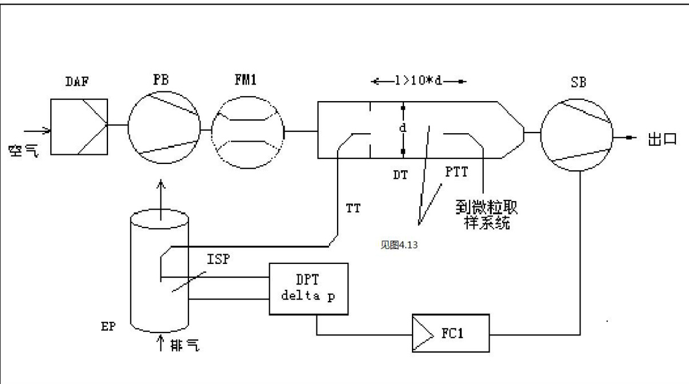  

原始排气从排气管 EP，由等动态取样探头 ISP 采样，通过输送管 TT 输送到稀释通道 DT。排气管和探头进口之间的排气压差用压力传感器 DPT 测量。这个信号传送到流量控制器 FC1，FC1 控制抽气风机 SB 使在探头末端维持零压差。在这些条件下，在 EP 和 ISP 中的排气速度是相同的，通过 ISP 和 TT 的流量相对于排气流量是一个固定的比例。分流比可以根据 EP 和 ISP的横截面面积计算。稀释空气流量用流量测量装置 FM1 测量，稀释比可以根据稀释空气流量和分流比计算。  

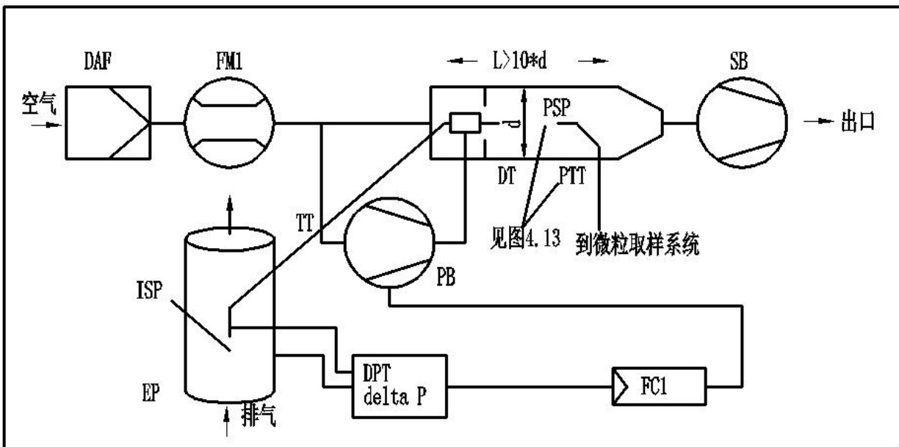  
图 4.4 带等动态探头和部分流采样的部分流稀释系统(PB 控制)  

原始排气从排气管 EP，由等动态取样探头 ISP 采样，通过输送管 TT 输送到稀释通道 DT。排气管和探头进口之间的排气压差用压力传感器 DPT 测量。这个信号传送到流量控制器 FC1，FC1 控制压力风机 PB 使在探头末端维持零压差。稀释空气流量由流量测量装置 FM1 测量，从稀释空气中取一部分稀释空气，并用一气动孔板把它送回 TT。在这些条件下，在 EP 和 ISP 中的排气速度是相同的，通过 ISP 和 TT 的流量相对于排气流量是一个固定的比例。分流比可以根据EP 和 ISP 的横截面面积计算。稀释空气是用抽气风机 SB 通过 DT 吸入，其流量用流量测量装置FM1 在 DT 进口处测量，稀释比可根据稀释空气流量和分流比计算。  

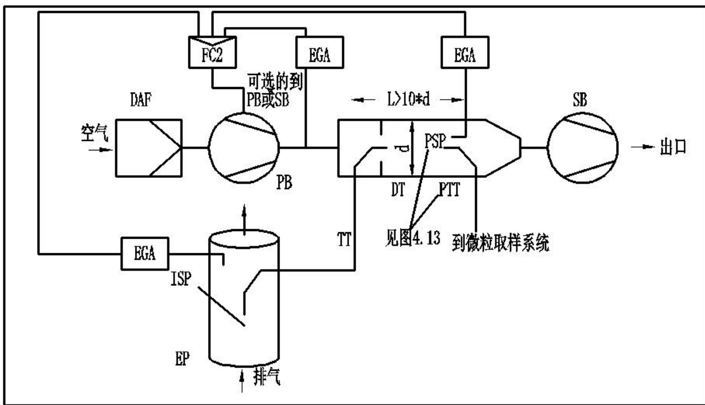  
图 4.5 带 $\mathrm{C0}_{2}$ 和 $\mathrm{N}0_{\mathrm{x}}$ 浓度测量和部分流采样的部分流稀释系统  

原始排气从排气管 EP，由取样探头 SP 采样，通过输送管 TT 输送到稀释通道 DT。原始排气、稀释排气和稀释空气中的示踪气( $\mathrm{{(0_{2}}}$ 或 $\mathrm{NO}_{\mathrm{x}},$ )的浓度用排气分析仪 EGA 测量。这些信号传送到流量控制器 FC2，FC2 控制排气风机 PB 或抽气风机 SB，以保持期望的排气分流比和 DT 中的稀释比。根据原始排气、稀释排气和稀释空气中示踪气的浓度计算稀释比。  

  
图 4.6 带 $\mathrm{C0}_{2}$ 浓度测量，碳平衡和全部取样的部分流稀释系统  
图 4.7 带单文丘里管，浓度测量，部分流取样的部分流稀释系统  

原始排气从排气管 EP，由取样探头 SP 采样，通过输送管 TT 输送到稀释通道 DT。稀释排气和稀释空气中的 $\mathrm{C0}_{2}$ 浓度用排气分析仪 EGA 测量。 $\mathrm{C0}_{2}$ 和燃油流量 $\mathrm{G}_{\mathrm{FUEL}}$ 信号传送到流量控制器FC2 或颗粒物取样系统(见图 4.13)中的流量控制器 FC3。FC2 控制压力风机 PB，而 FC3 控制颗粒物取样系统(见图 4.13)，这样即可调节进、出系统的流量，以保持期望的排气分流比和 DT中的稀释比。根据 $\mathrm{C0}_{2}$ 浓度和 $\mathrm{G}_{\mathrm{FUEL}}$ 使用碳平衡方法计算稀释比。  

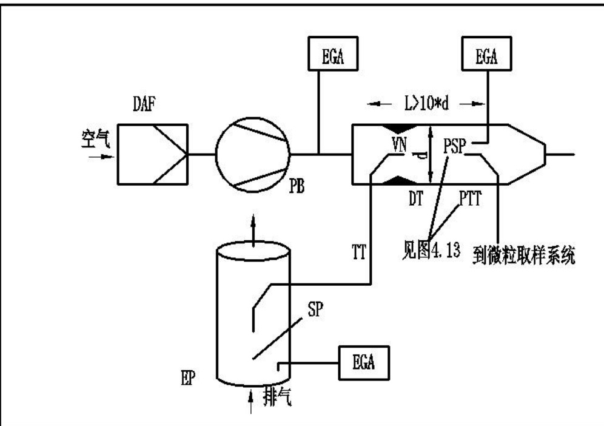  

由于在 DT 中由文丘里管 VN 产生的负压，原始排气从排气管 EP，由取样探头 SP 采样，通过输送管 TT 输送到稀释通道 DT。通过 TT 的气体流量取决于文丘里管区域的动量交换，因此受TT 出口处气体绝对温度的影响。从而在给定稀释通道气体流量下的排气分流流量不是恒定的，低负荷的稀释比稍低于高负荷的稀释比。用排气分析仪 EGA 测量原始排气、稀释排气和稀释空气中的示踪气( $\mathrm{{(0_{2}}}$ 或 $\mathrm{N0}_{\mathrm{x}}\mathrm{,}$ )的浓度，稀释比根据上述测量值计算。  

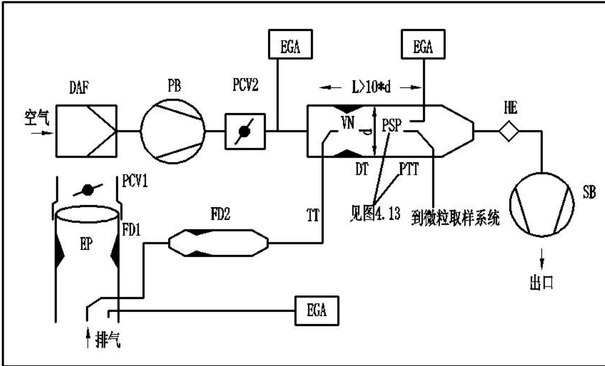  
图 4.8 带双文丘里管或双流量孔，浓度测量，部分流取样的部分流稀释系统  

通过包含一对孔板或文丘里管的流量分流器，原始排气从排气管 EP，由取样探头 SP 采样，通过输送管 TT 输送到稀释通道 DT。第一个（FD1）位于 EP 内，第二个（FD2）位于 TT 内。此外，必须有两个压力控制阀（PCV1 和 PCV2），以便通过控制 EP 中的背压和 DT 中的压力保持一个恒定的排气分流比。PCV1 位于 EP 中 SP 的下游，PCV2 位于压力风机 PB 和 DT 之间。用排气分析仪 EGA 测量原始排气、稀释排气和稀释空气中的示踪气( $\mathrm{\dot{C}0_{2}}$ 或 $\mathrm{N0}_{\mathrm{x}}\mathrm{,}$ )的浓度。为了检查排气分流比及为了实现精确的分流控制而调节 PCV1 和 PCV2，则必须测量示踪气( $\mathrm{\bar{C}0_{2}}$ 或 $\mathrm{N0}_{\mathrm{x}}\mathrm{.}$ )的浓度。根  

据示踪气浓度计算稀释比。  

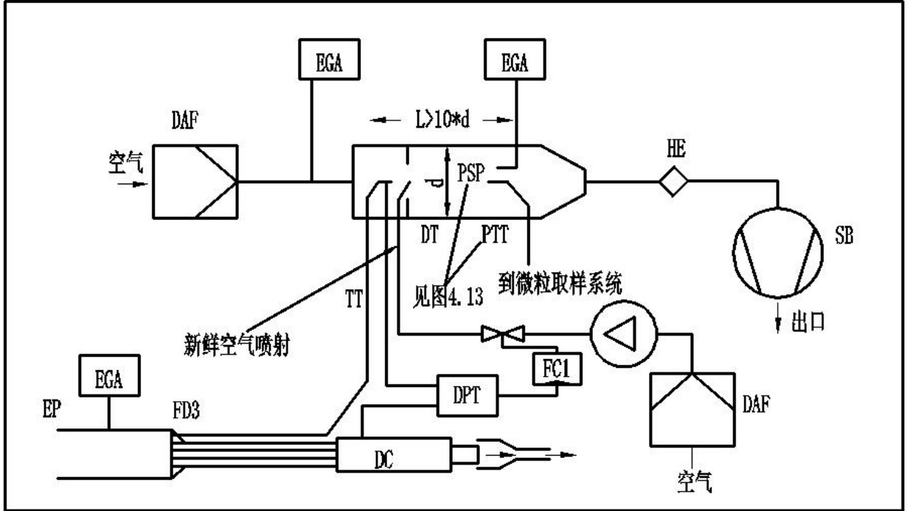  
图 4.9 带多分流管、浓度测量，部分流取样的部分流稀释系统  

通过安装在 EP 内若干相同尺寸(相同直径，长度和弯曲半径)的管子组成的流量分流器FD3，原始排气从排气管 EP，通过输送管 TT 输送到稀释通道 DT。在这些管路中，其中之一管路中的排气被引入 DT，而其余管路中的排气被引入缓冲室。因此，排气分流比是由管子总数量决定的，恒定的分流比控制要求在 DC 和 TT 出口之间的压差为零，用差压传感器 DPT 测量该压差。通过在 TT 出口处把新鲜空气喷射入 DT，实现该压差为零。用排气分析仪 EGA 测量原始排气、稀释排气和稀释空气中的示踪气( $\mathrm{{(CO_{2}}}$ 或 $\mathrm{N0}_{\mathrm{x}}\mathrm{,}$ )的浓度。为了检查排气分流比及为了实现精确的分流控制而调节喷射空气量，则必须测量示踪气( $\mathrm{{(0_{2}}}$ 或 $\mathrm{N0}_{\mathrm{x}}\mathrm{.}$ )的浓度。根据示踪气浓度计算稀释比。  

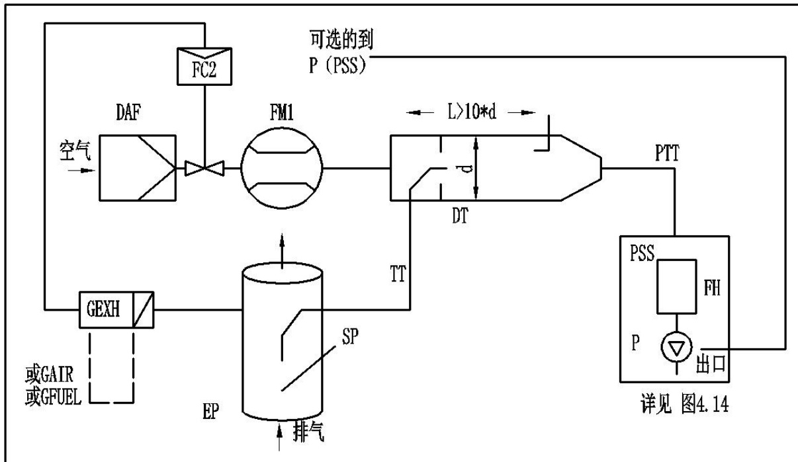  
图 4.10 带流量控制和总取样的部分流稀释系统  

原始排气从排气管 EP，由取样探头 SP 采样，通过输送管 TT 输送到稀释通道 DT。通过稀释通道的总流量由颗粒物取样系统（见图 4.15）的流量控制器 FC3 和取样泵 P 调节。稀释空气流量由流量控制器 FC2 控制，使用 $\mathrm{G}_{\mathrm{EXH}}$ 、 $\mathrm{G}_{\mathrm{AIR}}$ 或 $\mathrm{G}_{\mathrm{FUEL}}$ 作为命令信号来获得期望的排气分流。进入DT 的取样流量是总流量和稀释空气流量的差。稀释空气流量用流量测量装置 FM1 测量，总气体流量用颗粒物取样系统中（图 4.13）的流量测量装置 FM3 测量。根据这两种流量计算稀释比。  

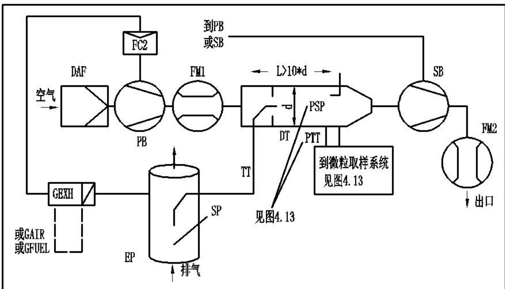  
图 4.11 带流量控制和部分流取样的部分流稀释系统  

原始排气从排气管 EP，由取样探头 SP 采样，通过输送管 TT 输送到稀释通道 DT。排气分流和进入 DT 的流量由流量控制器 FC2 控制，根据需要，FC2 调节压力风机 PB 或抽气风机 SB 的流量（或速度）。由于颗粒物取样系统的样气又返回到 DT，这种控制方式是可能的。 $\mathrm{G}_{\mathrm{EXH}}$ 、 $\mathrm{G}_{\mathrm{AIR}}$ 或 $\mathrm{G}_{\mathrm{FUEL}}$ 可以作为 FC2 的命令信号。稀释空气流量用流量测量装置 FM1 测量，总气体流量用流量测量装置 FM2 测量，根据这两种流量计算稀释比。  

# 图 4.3 到图 4.11 的描述：  

（1）EP 排气管  

可将排气管绝热。为了降低热惯量，推荐排气管的壁厚和直径之比小于或等于 0.015。柔性管路部分应该限制长度和直径之比为 12 或更小。为了减少惯性沉积应尽量少弯曲。如果系统包括一个试验台消声器，则消声器也应该绝热。  

对等动态系统，应至少在探头末端上游六倍管径和下游三倍管径的之内，排气管应免受涡流、弯曲和管径突变的影响。除了怠速工况外，取样区域的气流速度应该超过 $\mathrm{10m/s}$ ，排气管内的平均压力波动不得超过 $+500\mathrm{Pa}$ 。除船舶排气系统(包括消音器和后处理装置)外，任何降低压力波动的措施均不得改变船机的性能或引起颗粒物沉积。  

对没有使用等动态取样探头的系统，推荐在探头末端上游六倍管径和下游三倍管径之内为直管。  

# （2）SP 取样探头(图 4.5 到 4.11)  

最小内径应为 $4\mathrm{mm}$ ，排气管和探头的最小直径比应为 4。探头应为开口管，正对着排气管中心线上游，或在第 1.1.1.部分 SP1 中描述的多孔探头。  

（3）ISP 等动态取样探头（图 4.3 和 4.4）  

等动态取样探头必须安装在排气管中心线上，面向上游，EP 部分必须满足一定的流量条件，且 ISP 设计成能提供一定比例的原始排气采样。最小内径应为 $12\mathrm{mm}$ 。  

控制系统必须通过保持 EP 和 ISP 之间的压差为零，实现等动态排气分流。在这种条件下，  

EP 和 ISP 中的排气速度是相同的，通过 ISP 的质量流量是排气流量的一个恒定部分。ISP 必须与一个压差传感器相连。利用风机速度和流量控制器使得 EP 和 ISP 之间的压差为零。  

（4）FD1，FD2 分流器（图 4.8）  

一套文丘里管或流量孔板分别安装在排气管 EP 和输送管 TT 中，以提供一定比例的原始排气样气。包含两个压力控制阀 PCV1 和 PCV2 的流量控制系统是必要的，以通过控制 EP 和 DT 内的压力实现一定比例的排气分流。  

（5）FD3 分流器（图 4.9）  

在排气管 EP 中安装一组管（多管部件），以提供一定比例的原始排气样气。其中之一把排气输送到稀释通道 DT，其他管子把排气送到缓冲室 DC。这些管子必须有相同大的尺寸（相同直径、长度、弯曲半径），因此排气分流取决于总的管子数目。控制系统对比例分流是必要的，以保持进入 DC 的多管单元的出口和 TT 的出口之间的压差为零。在这种条件下，EP 和 ISP 中的排气速度是成比例的，通过 TT 的质量流量是排气流量的恒定比例。这两点必须连接到压差传感器DPT 上。由流量控制器 FC1 控制提供零压差。  

（6）EGA 排气分析仪（图 4.5 到 4.9）  

可能使用 $\mathrm{C0}_{2}$ 和 $\mathrm{N}0_{\mathrm{x}}$ 分析仪（用碳平衡方法时，只用 $\mathrm{C0}_{2}$ 分析仪）。应该按照分析仪测量气态污染物一样校准分析仪。可能使用一个或几个分析仪，以测量不同浓度。  

测量系统的精度应使 $\mathrm{G}_{\mathrm{EDFW}}$ 或 $\mathrm{V_{EDFW}}$ 的精度在 $+4\%$ 以内。  

（7）TT 输送管（图 4.3 到 4.11）  

颗粒物取样输送管应该：  

—长度应尽量短，但不超过 $5\mathrm{m}$ ；  

—直径等于或大于探头直径，但不超过 $25\mathrm{{mm}}$ ；  

—在稀释通道的中心线上排出，面向下游。  

如果管路长度小于或等于 1m，用最大导热率为 0.05W/(m.K）的材料绝缘，其径向绝缘厚度相当于探头直径。如果管路长度大于 $\ln$ ，该管必须绝热，并加热到最小壁温 523K（ $250^{\circ}\mathrm{C}$ ）。相应地，输送管的壁温需要根据标准传热计算来确定。  

# （8）DPT 压差传感器（图 4.3，4.4 和 2.9）  

压差传感器的量程应小于或等于 $+500\mathrm{Pa}$ 。  

（9）FC1 流量控制器（图 2.3，2.4 和 4.9）  

对等动态系统（图 4.3 和 4.4），需要采用流量控制器以保持 EP 和 ISP 之间的压差为零。可通过以下步骤进行调节：  

$\textcircled{1}$ 在每一工况内，控制抽气风机（SB）的速度和流量，以保持排气风机（PB）的速度稳定，或；  

$\textcircled{2}$ 调节抽气风机（SB）使稀释排气的质量流量稳定，并控制排气风机的流量，因此调节在输送管末端（TT）（图 4.4）一定区域内的排气取样流量。  

在压力控制系统中，控制回路内的误差应不超过 $+3\mathrm{Pa}$ ，稀释通道内的压力波动不应超过平均值的 $+250\mathrm{Pa}$ 。  

对多管系统（图 4.9），为了达到比例分流，必须采用流量控制器，以保持多管单元的出口和 TT 的出口之间的压差为零。通过控制 TT 出口处进入 DT 的空气流量进行调节。  

（10）PCV1，PCV2 压力控制阀（图 4.8）  

对双文丘里管或双流量孔板系统，为了达到比例分流，必须采用两个压力控制阀，以控制EP 的背压和 DT 的压力。两阀应分别安装在 EP 中 SP 的下游和在 PB 和 DT 之间。  

（11）DC 缓冲室（图 4.9）  

缓冲室应该安装在多管单元的出口，以降低排气管 EP 的压力波动。  

（12）VN 文丘里管（图 4.7）  

文丘里管安装在稀释通道 DT 中，以在输送管 TT 的出口区域产生负压。通过 TT 的气体流量是由文丘里管区域的动量交换确定的，与压力风机 PB 的流量成一定比例，导致恒定的稀释比。由于动量交换受 TT 出口温度和 EP 与 DT 之间压差的影响，实际稀释比在低负荷时比高负荷时稍低。  

（13）FC2 流量控制器（图 4.5，4.6，4.10 和 4.11，选用）  

流量控制器可以用来控制压力风机 PB 和抽气风机 SB 的流量，它可与排气流量或燃油流量信号和/或 $\mathrm{C0}_{2}$ 或 $\mathrm{N}0_{\mathrm{x}}$ 等差动放大信号连接。  

当应用压缩空气供给装置时（图 4.10），FC2 直接控制空气流量。  

（14）FM1 流量测量装置（图 4.5，4.6，4.10 和 4.11）  

使用气体流量计或其他流量测量装置测量稀释空气流量。如果 PB 经校准来测量流量，则FM1 是可选件。  

（15）FM2 流量测量装置（图 4.11）  

使用气体流量计或其他流量测量装置测量稀释空气流量。如果抽气风机 SB 经校准来测量流量，则 FM2 是可选件。  

（16）PB 压力风机（图 4.3，4.4，4.5，4.6，4.7，4.8 和 4.11）  

为了控制稀释空气流量，可把 PB 连接到流量控制器 FC1 或 FC2。当使用蝶型阀时，PB 不需要。PB 经校准后，可以用来测量稀释空气流量。  

（17）SB 抽气风机（图 4.3，4.4，4.5，4.8，4.9 和 4.11）  

仅用于部分流取样系统。SB 经校准后，可以用来测量稀释排气流量。  

（18）DAF 稀释空气过滤器（图 4.3 到 4.11）  

建议将稀释空气过滤，并用活性碳消除背景碳氢化合物。稀释空气应该保持在 298K（ $25\mathrm{^\circC}$ ）$+5\mathsf{K}$ 。应制造企业的要求，应该按照良好的工程经验取样稀释空气，以测定背景颗粒物水平，然后从稀释排气中的颗粒物测量值中扣除。  

（19）PSP 颗粒物取样探头（图 4.3，4.4，4.5，4.7，4.8，4.9 和 4.11）  

该探头是 PTT 的引导部分且：  

—应该面对上游，在稀释空气和排气充分混合的地方安装，即在稀释系统稀释通道 DT 的中心线上，在排气进入稀释通道处的下游大约 10 倍稀释通道管径处安装；  

—最小内径是 $12\mathrm{mm}$ ；  

—可通过直接加热的方法把壁温加热到不超过 325K（ $52\mathrm{{^\circC}}$ ），或只要在排气进入稀释通道前的空气温度不超过 325K（ $52^{\circ}\mathrm{C}$ ），也可通过稀释空气预热；  

—应该绝热。  

（20）DT 稀释通道（图 4.3 到 4.11）  

该稀释通道：  

—应该具有足够的长度，以使排气和稀释空气在紊流条件下充分混合；  

—应该用不锈钢制造并有：  

—对内径超过 $75\mathrm{mm}$ 的稀释通道，其厚度和直径比应小于或等于 0.025；  

—对内径小于或等于 75mm 的稀释通道，稀释通道名义壁厚不低于 $1.5\mathrm{mm}$ ；  

—对部分流取样型，其内径至少为 $75\mathrm{{mm}}$ ；  

—对全流取样型，推荐内径至少为 $25\mathrm{{mm}}$ ；  

—可通过直接加热的方法把其壁温加热到不超过 325K（ $52^{\circ}\mathrm{C}$ ），或只要在排气进入稀释通道前的空气温度不超过 325K（ $52\mathrm{{^\circC}}$ ），也可通过稀释空气预热；  

—应该绝热。  

船机排气与稀释空气应充分混合。对部分取样系统，在系统投入使用后，在船机运转状态下，用通道内的 CO2 浓度分布图（至少 4 个间距大致相等的测量点）检查混合的质量。如必要，可使用混合流量孔板。  

注：如果靠近稀释通道（DT）附近的环境温度低于 293K（ $20^{\circ}\mathrm{C}\mathrm{\i}$ ），应采取措施防止颗粒物在稀释通道上的冷壁损失。因此，在上述推荐的温度范围内，加热或绝热稀释通道。  

在船机高负荷时，可采用诸如循环风扇那样不太剧烈的方式冷却通道，只要冷却介质温度不低于 293K（ $20^{\circ}\mathrm{C}$ ）。  

（21）HE 热交换器（图 4.8 和 4.9）  

热交换器应有足够的能力，以保持在整个试验过程中，抽气风机 SB 进口的温度在所测平均工作温度的 $+11\mathrm{~K~}$ 内。  

4.1.2.1.2 全流稀释系统（图 4.12）  

所述稀释系统是基于使用定容取样（CVS）的概念，对全部排气稀释的系统。必须测量排气和稀释空气混合的总体积。可使用 PDP 或 CFV 系统。  

为进行随后的颗粒物收集，将稀释排气样气引入颗粒物取样系统（第 4.1.2.2 条图 4.13和 4.15）。如果直接这样做，则称作为单级稀释。如果把稀释样气再在次级稀释通道内稀释，则称作为两级稀释。如果使用单级稀释，其滤纸表面温度不能满足要求，则使用双级稀释。尽管双级稀释是稀释系统的一部分，因为它具有典型颗粒物取样系统的绝大部分部件，双级稀释系统可作为第 2.1.2 条图 2.14 中的颗粒物取样系统的变型。  

也可在全流稀释系统的稀释通道中测定气态污染物。所以，气态组份的取样探头在图 4.12中标明，但没有出现在描述表中。在第 4.1.1.1 条描述了其相应的要求。  

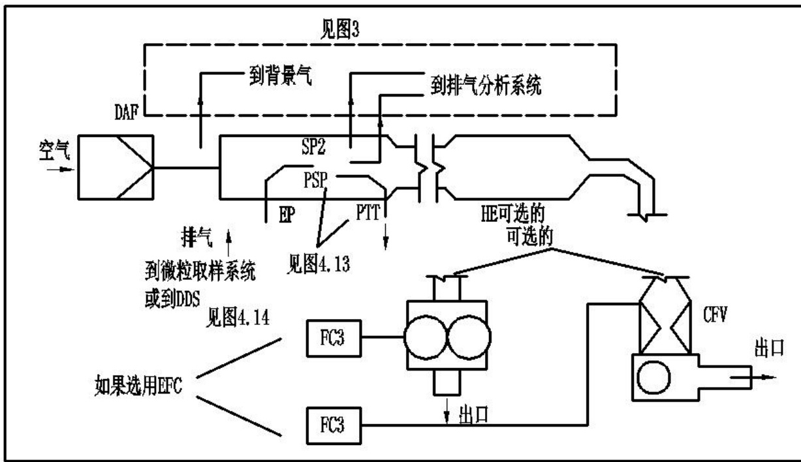  
图 4.12 全流稀释系统  

# 图 4.12 的描述：  

（1）EP 排气管  

从船机排气歧管出口、涡轮增压器出口或后处理装置到稀释通道的排气管长度不得超过$10\mathrm{m}$ 。如果系统长度超过 $4\mathrm{m}$ ，超过 4m 的部分应该绝热。使用串接烟度计时，烟度计处可除外。绝缘材料的径向厚度不少于 $25\mathrm{{mm}}$ 。绝缘材料在 673K（ $\mathrm{400^{\circ}C}$ ）时的传热率不得超过 0.1W/（m.K）。为了降低排气管的热惯量，推荐其壁厚与直径之比应小于或等于 0.015。使用的柔性部分应限制在长度和直径之比 12 或更小。  

全部原始排气需在稀释通道 DT 内与稀释空气混合。  

稀释排气流量可用容积泵（容积式泵）PDP 或临界流文丘里管 CFV 测量。可使用热交换器（HE）或电子流量补偿器（EFC），以进行比例颗粒物取样和流量测定。由于颗粒物质量测量是基于总稀释排气流量，不需要计算稀释比。  

# （2）PDP 容积泵  

PDP 根据泵的转数和排量测量总的稀释排气流量。排气系统背压不应该被 PDP 或稀释进气系统人为降低。在相同的船机转速和负荷下，连接 CVS 系统测得的静态排气背压与没有连接 CVS系统测得的静态排气背压的差值应保持在 $+1.5\mathrm{{kPa}}$ 内。  

当没使用流量补偿时，PDP 前的气体混合物的温度应为试验过程中平均工作温度的 $+6\mathrm{K}$ 以内。  

仅当 PDP 进口温度不超过 $50^{\circ}\mathrm{C}$ (323K)，才用流量补偿。  

（3）CFV 临界流量文丘里管  

通过使流动保持阻塞状态(临界流)，CFV 测量总稀释排气流量。在相同的船机转速和负荷下，连接 CVS 系统测得的静态排气背压与没有连接 CVS 系统测得的静态排气背压的差值应保持在 $+1.5\mathrm{{kPa}}$ 内。当没使用流量补偿时，CFV 前的气体混合物的温度应为试验过程中平均工作温度的 $+11\mathrm{K}$ 以内。  

（4）HE 热交换器(如果使用 EFC 时，选用)  

热交换器应有足够的能力，以保持温度在上述要求的范围内。  

（5）EFC 电子流量补偿(如果使用 HE 时，选用)  

如果 PDP 或 CFV 的进口温度没有保持在上述规定的范围内，为了连续测量流量，且在颗粒物取样系统中的进行比例取样控制，需要使用流量补偿系统。  

为达上述目的，连续测量的流量信号用于修正通过颗粒物取样系统的颗粒物取样滤纸的样气流量(见图 4.13 和 4.14)。  

（6）DT 稀释通道该稀释通道：  

—其直径应足够小，以形成紊流(雷诺数大于 4000)，其长度应足够长，以使排气和稀释空气的充分混合。可使用流量混合孔板；  

—直径至少为 $75\mathrm{{mm}}$ ；  

— 可以进行隔热处理。  

在船机排气引入稀释通道处，船机排气应面向下游且充分混合。  

当使用单级稀释系统时，来自稀释通道的样气被输送到颗粒物取样系统(见第 4.1.2.2 条图 4.13)。为了使在稀释通道初级滤纸前的稀释排气温度保持不超过 $325\mathrm{K}\left(52^{\circ}\mathrm{C}\right)$ )，PDP 或 CFV应有足够的流量能力。  

当使用双级稀释系统时，来自稀释通道的样气被输送到次级稀释通道，在此进一步稀释，然后通过取样滤纸 (见第 4.1.2.2 条图 4.14)。  

PDP 或CFV 应有足够的能力，以使在DT 取样区内的稀释排气温度保持不超过 $464\mathrm{K}\left(191^{\circ}\mathrm{C}\right)$ 。次级稀释系统应提供足够的次级稀释空气，以使在初级颗粒物取样滤纸前的双级稀释排气气流的温度保持不超过 $325\mathrm{K}\left(52^{\circ}\mathrm{C}\right)$ 。  

（7）DAF 稀释空气过滤器  

建议稀释空气被过滤并用活性碳消除背景碳氢化合物。稀释空气应该保持在 298K（ $25\mathrm{{^\circC}}$ ）$+5\mathsf{K}$ 。应制造企业的要求，应按照良好的工程经验进行稀释空气取样，以测定背景颗粒物水平，然后从稀释排气中的颗粒物测量值中扣除。  

# （8）PSP 颗粒物取样探头  

探头是 PTT 的引导部分且  

— 应面对上游，在稀释空气和排气充分混合的地方安装，即在稀释系统稀释通道 DT 的中心线上，在排气进入稀释通道处的下游大约 10 倍稀释通道管径处安装；  

— 最小内径 $12\mathrm{mm}$ ；  

— 可通过直接加热的方法把壁温加热到不超过 $325\mathrm{K}\ (52^{\circ}\mathrm{C})$ ），或只要在排气进入稀释通道前的空气温度不超过 325K（ $52\mathrm{{^\circC}}$ ），也可通过稀释空气预热；  

—可以进行隔热处理。  

4.1.2.2 颗粒物取样系统(图 4.13 和 4.14)  

为在颗粒物取样滤纸上收集颗粒物，需使用颗粒物取样系统。对部分流稀释，全部取样情况，全部稀释排气样气通过滤纸，稀释系统(见第 4.1.2.1.1 条图 4.6 和 4.10)和取样系统通常组成一个整体。对部分流稀释或全流稀释系统，部分取样情况，仅仅部分稀释排气通过滤纸 (见第 4.1.2.1.1 条图 4.3，4.4，4.5，4.7，4.8，4.9 和 4.11 和第 4.1.2.1.2 条图 4.12)，且取样系统通常为其他单元。  

全流稀释系统的双级稀释系统 DDS(图 4.14)可当作如图 4.13 所示的典型颗粒物取样系统的特定变型。双级稀释系统包括颗粒物取样系统的所有重要部件，如滤纸保持架、取样泵和其他一些稀释系统特征，如稀释空气源和二级稀释通道。  

为了避免控制循环的任何影响，推荐取样泵在整个测试循环中运转。对单滤纸方法，为了让样气在规定的时间内通过取样滤纸，应该使用旁通系统。开关过程对控制循环的影响必须最小。  

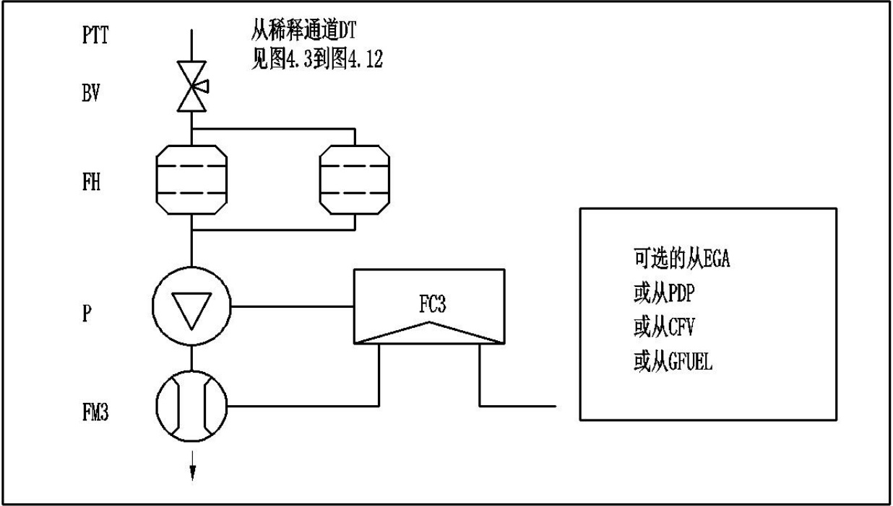  
图 4.13 颗粒物取样系统  
图 4.14 稀释系统(仅用于全流系统)  

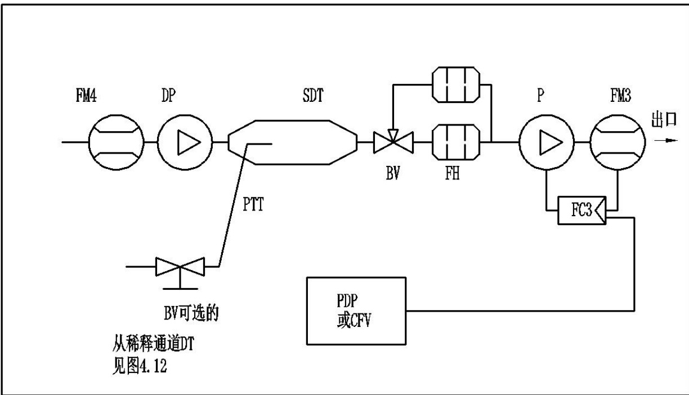  

图 4.13 和 4.14 的描述：  

（1）PSP 颗粒物取样探头（图 4.13 和 4.14）  

图示的颗粒物取样探头是颗粒物输送管 PTT 的引导部分且  

— 应该面对上游，在稀释空气和排气充分混合的地方安装，即在稀释系统稀释通道 DT 的中心线上，在排气进入稀释通道处的下游大约 10 倍稀释通道管径处安装；  

— 最小内径是 $12\mathrm{mm}$ ；  

— 可通过直接加热的方法把壁温加热到不超过 325K（ $\mathrm{52^{\circ}C}$ ），或只要在排气进入稀释通道前的空气温度不超过 325K（ $52^{\circ}\mathrm{C}\ \cdot$ ），也可通过稀释空气预热；  

— 可以进行隔热处理。  

利用取样泵 P，稀释排气样气通过颗粒物取样探头 PSP 和颗粒物输送管 PTT、稀释通道 DT从部分流或全流稀释系统中取出。样气通过包含有颗粒物取样滤纸的滤纸保持架。样气流量由流量控制器 FC3 控制。如果使用电子流量补偿器 EFC(见图 2.12)，稀释排气流量可以作为 FC3的控制信号。  

稀释排气的样气从全流稀释系统的稀释通道 DT，通过颗粒物取样探头 PSP 和颗粒物输送管PTT 传送到二级稀释通道 SDT，在那里被进一步稀释。然后，样气通过装有颗粒物取样滤纸的滤纸保持架 FH。当取样流量由流量控制器 FC3 控制时，稀释空气流量通常是稳定的。如果采用电子流量补偿装置 EFC(见图 4.12)，总稀释排气流量通常作为 FC3 的控制信号。  

（2）PTT 颗粒物输送管(图 4.13 和 4.14)  

颗粒物输送管长度不应该超过 $1020\mathrm{mm}$ ，并应尽可能短。  

该尺寸是指：  

— 部分流稀释部分取样系统和全流单稀释系统，从探头顶端到滤纸保持架；  
— 部分流稀释全取样系统，从稀释通道顶端到滤纸保持架；  
— 全流双级稀释系统，从探头顶端到二级稀释通道。  

输送管：  

— 可通过直接加热的方法把壁温加热到不超过 325K（ $.52^{\circ}\mathrm{C}\mathrm{~.~}$ ），或只要在排气进入稀释通道前的空气温度不超过 325K（ $52^{\circ}\mathrm{~C~}$ ），也可通过稀释空气预热；— 可以进行隔热处理。  

（3）SDT 二级稀释通道（图 4.14）  

二级稀释通道的直径最小应为 $75\mathrm{mm}$ ，且二级稀释通道应足够长，以对双级稀释的样气提供最小 0.25 秒的驻留时间。初级滤纸保持架 FH 应该位于 SDT 出口的 $300~\mathrm{{\mm}}$ 以内。  

二级稀释通道：  

— 可通过直接加热的方法把壁温加热到不超过 $325\mathrm{K}\ (52^{\circ}\mathrm{C})$ ），或只要在排气进入稀释通道前的空气温度不超过 325K（ $\mathrm{52^{\circ}C}$ ），也可通过稀释空气预热；  

—可以进行隔热处理。  

（4）FH 滤纸保持架（图 4.13 和 4.14）  

对初级滤纸和次级滤纸，可以使用一个滤纸过滤室或分开过滤室。需满足附录 5 第 5.6.1.3条的要求。  

滤纸保持架：  

—可通过直接加热的方法把壁温加热到不超过 325K（ $52^{\circ}\mathrm{C}$ ），或只要空气温度不超过 325K（ $\mathrm{52^{\circ}C)}$ ），也可通过稀释空气预热；—可以进行隔热处理。  

（5）P 取样泵（图 4.13 和 4.14）  

如果没有使用 FC3 进行流量修正，颗粒物取样泵应位于距通道足够远处，以便其进气温度保持恒定（ $(+3\mathrm{K})$ ）。  

（6）DP 稀释空气泵（图 4.14）（仅用于全流双级稀释系统）  

稀释空气泵应能提供温度为 298K（ $25\mathrm{{^\circC}}$ ） $+5\mathsf{K}$ 的二级稀释空气。  

（7）FC3 流量控制器（图 4.13 和 4.14）  

如果没有其他的合适措施，应使用流量控制器，以补偿由于取样路径内温度和背压的波动所造成的颗粒物取样流量波动。如果使用电子流量补偿器，则需要流量控制器 FC3（见图 4.12）。  

（8）FM3 流量测量装置（图 4.13 和 4.14）（颗粒物取样流量）如果没有使用 FC3 进行流量修正，则气体流量计或流量测量装置应位于距离取样泵足够远处，以保持进气温度恒定（ $+3\mathrm{K})$ 。  

（9）FM4 流量测量装置（图 C.14）（稀释空气，仅用于全流双级稀释）  

气体流量计或流量测量装置应位于进气温度保持稳定在 298K（ $25^{\circ}\mathrm{~C~}$ ） $+5\mathsf{K}$ 的地方。  

（10）BV 球阀（选用）  

球阀直径不应低于取样管内径，且开关时间小于 0.5 秒。  

注：如果靠近 PSP，PTT，SDT 和 FH 附近的环境温度低于 293K（ $20^{\circ}\mathrm{C}$ ），应采取措施防止颗粒物在稀释通道冷壁上的损失。因此，推荐对这些部件加热或进行隔热处理，使其温度在各自描述的范围内。也推荐在取样过程中滤纸表面的温度不低于 293K（ $\mathrm{20^{\circ}C^{\cdot}}$ ）。  

在船机高负荷，上述部件可以用非剧烈的方式冷却，如风扇冷却，只要冷却介质温度不低于 293K（ $20^{\circ}\mathrm{C}$ ）。  

# 附录5 测量和取样规程  

# 5.1 一般要求  

应使用附录 4 规定的系统来测量被提交试验的船机的排气污染物。附录 4 描述了推荐的气态污染物分析系统(见第 4.1.1 条)和推荐的颗粒物稀释和取样系统(见第 4.1.2 条)。  

# 5.2 测功机技术规格  

应使用具有合适特性的测功机完成附录 3 第 3.8.1 条表 3.8.1.1（1）、或表 3.8.1.1(2)、或表3.8.1.1(3)、或表 3.8.1.1(4)、或表 3.8.1.1(5)规定的试验循环。扭矩和转速的测量仪器通过附加的计算，使测量的轴端功率在允许的功率范围内。  

# 5.3 排气流量  

根据第 5.3.1 条 $\sim$ 第 5.3.4 条提及的方法之一测量排气流量。  

5.3.1 直接测量方法  

用流量喷嘴或等效的流量计系统 直接测量排气流量。  

5.3.2 进气空气流量和燃油消耗量的测量方法应使用符合表 5.1 规定精度的空气流量计和燃油流量计测量进气空气流量和燃油消耗量。  

排气流量按下式计算：  

5.3.3 碳平衡方法  

用碳平衡方法，根据燃油消耗量和排气浓度计算排气质量流量。(见附录 5)  

5.3.4 总稀释排气流量测量方法  

当使用全流稀释系统时，总稀释排气( $\mathrm{\dot{G}_{I O T W}}$ ， $\mathrm{\DeltaV_{\mathrm{\mathrm{T0TW}}})}$ 流量应该用 PDP 或 CFV 方式测量(见附录 2第 2.1.2.1.2 条)，测量精度应符合附录 4 第 4.2.2 条的要求。  

# 5.4 测量设备精度要求  

所有测量设备的校准应该可溯源到国家基准并满足表 5.4 条件：  

表 5.4  

<html><body><table><tr><td>序号</td><td>测量设备</td><td>精度</td><td>校准有效期限 （月）</td></tr><tr><td>1</td><td>转速</td><td>读数的土2%或发动机最大值的 ±1%，取大值</td><td>3</td></tr><tr><td>2</td><td>扭矩</td><td>读数的土2%或发动机最大值的 ±1%，取大值</td><td>3</td></tr><tr><td>3</td><td>燃油消耗量</td><td>发动机最大值的土2%</td><td>6</td></tr></table></body></html>  

①详见 ISO5167 系列标准：  

ISO 5167-1:2003 用安装在圆形截面管道中的差压装置测量流体流量-第1 部分：一般原理和要求；  
ISO 5167-2:2003 用安装在圆形截面管道中的差压装置测量流体流量-第2 部分：节流孔板；  
ISO 5167-3:2003 用安装在圆形截面管道中的差压装置测量流体流量-第3 部分：喷嘴和文氏喷嘴；  
ISO 5167-4:2003 用安装在圆形截面管道中的差压装置测量流体流量-第4 部分：文丘里管；  
ISO 5167-5:2016 用安装在圆形截面管道中的差压装置测量流体流量-第5 部分：锥形流量计；  
ISO 5167-6:2019 用安装在圆形截面管道中的差压装置测量流体流量-第6 部分：楔形流量计。  
5-96  

<html><body><table><tr><td>4</td><td>空气消耗量</td><td>读数的土2%或发动机最大值的 ±1%，取大值</td><td>6</td></tr><tr><td>5</td><td>排气流量</td><td>读数的土2.5%或发动机最大值 的土1.5%，取大值</td><td>6</td></tr><tr><td>6</td><td>温度≤600K</td><td>±2K（绝对值)</td><td>3</td></tr><tr><td>7</td><td>温度>600K</td><td>读数的±1%</td><td>3</td></tr><tr><td>8</td><td>排气压力</td><td>±0.2kPa（绝对值）</td><td>3</td></tr><tr><td>9</td><td>进气阻力</td><td>±0.05kPa（绝对值）</td><td>3</td></tr><tr><td>10</td><td>大气压力</td><td>±0.1kPa（绝对值）</td><td>3</td></tr><tr><td>11</td><td>其他压力</td><td>±0.1kPa（绝对值）</td><td>3</td></tr><tr><td>12</td><td>绝对湿度</td><td>读数的±5%</td><td>1</td></tr><tr><td>13</td><td>稀释空气流量</td><td>读数的±2%</td><td>3</td></tr><tr><td>14</td><td>稀释排气流量</td><td>读数的±2%</td><td>3</td></tr></table></body></html>  

# 5.5 气态污染物的测定  

5.5.1 分析仪的一般技术规格  

分析仪应该有适合用来测量排气组分浓度(见附录 5.5.1.1 条)所需精度的量程，推荐分析仪在满量程的 $15\%$ 到 $100\%$ 之间测量，应使测量的浓度落在此区间内。  

如果满量程值是 $155\mathrm{ppm}$ （或 ppm $\mathrm{C}_{1}$ ）或以下，或读出系统(计算机，数据记录仪)在低于满量程 $15\%$ 时能达到足够的精度和分辨率，则低于满量程 $15\%$ 的浓度测量结果也可以接受，在这种情况下，要额外增加标定点以确保标定曲线的准确度(见附录 6 第 6.1.5.5.2 条)。  

设备的电磁兼容性应达到使附加误差最小的水平。  

# 5.5.1.1 测量误差  

分析仪不应偏离名义标定点读数的 $+2\%$ 或满量程的 $0.3\%$ ，取其中较大值。  

5.5.1.2 重复性  

对某一给定标定或量距气所测10 次重复响应值标准差的2.5 倍，对超过 $155\mathrm{ppm}$ （或 ppm $\mathrm{C}_{1}$ ）的这些气体，应不超过该量程满量程浓度的 $+1\%$ ，对低于 $155\mathrm{ppm}$ （或 ppm $\mathrm{C}_{1}$ ）的这些气体，应不超过该量程满量程浓度的 $+2\%$ 。  

# 5.5.1.3 噪声  

在所有的应用量程，分析仪对零气、标定气或量距气在 10 秒期间的峰-峰响应值应不超过满量程的 $2\%$ 。  

# 5.5.1.4 零点漂移  

零点响应定义为在 30 秒的时间间隔内对零气（包括噪声在内）的平均响应。  
对所用的最低量程，1 小时期间的零点漂移不应该超过该量程满量程的 $2\%$ 。  

# 5.5.1.5 量距点漂移  

量距点响应定义为在 30 秒的时间间隔内对量距气（包括噪声在内）的平均响应。  
对所用的最低量程，1 小时期间的量距点漂移不应该超过该量程满量程的 $2\%$ 。  

# 5.5.2 气体干燥  

选用的气体干燥装置必须对所测气体的浓度影响最小，不可采用化学干燥剂除去样气中的水份。  

# 5.5.3 分析仪  

第 5.5.3.1 条～第 5.5.3.4 条描述了所用分析仪的测量原理，测量系统的详细描述见附录2。测量的气体应用下列设备进行分析，对于非线性化分析仪，允许使用线性化电路。  

5.5.3.1 一氧化碳(CO)分析仪  
一氧化碳分析仪应是不分光红外线吸收型分析仪(NDIR)。5.5.3.2 二氧化碳 $\mathrm{(CO_{2})}$ 分析仪  
二氧化碳分析仪应是不分光红外线吸收型分析仪(NDIR)。  

5.5.3.3 碳氢化合物(HC)分析仪  

碳氢化合物分析仪应是加热型氢火焰离子化分析仪（HFID），需对检测器、阀、管道等元件加热以保持气体温度在 $463\mathrm{K}\left(190^{\circ}\mathrm{C}\right)+10^{\circ}\mathrm{C}$ 。  

# 5.5.3.4 非甲烷碳氢化合物(NMHC)分析仪  

非甲烷碳氢化合物应该用气相色谱(GC)法测量：应按照第 3.5.3.3 条测量碳氢化合物，从中减去用气相色谱(GC)法在 423K( $\mathrm{.150^{\circ}C}$ )下测得的甲烷，得到非甲烷碳氢化合物。  

# 5.5.3.5 氮氧化物 $(\mathrm{N}0_{\mathrm{x}})$ 分析仪  

在干基情况下测量，氮氧化物分析仪应该选用带 $\mathrm{NO_{2}/N O}$ 转化器的化学发光检测器(CLD)或加热型化学发光检测器(HCLD)；如果在湿基情况下测量，在水熄光检查(见附录 4 第 4.1.9.2.2条)满足要求的情况下，可以使用温度保持在 $333\mathrm{K}\left(60^{\circ}\mathrm{C}\right)$ 以上的带转化器的加热型化学发光检测器（HCLD）。  

# 5.5.4 气态污染物的取样  

气态污染物取样探头必须装在离船机排气系统出口至少有 10 个排气管直径的下游处，并采取保温措施以保证在探头处的排气温度不低于 $343\mathrm{K}\left(70^{\circ}\mathrm{C}\right)$ 。  

对于具有分支排气歧管的船机，探头进口位置应位于下游足够远的地方，以保证所取气样代表了所有气缸的平均排放物。若多缸船机具有几组排气歧管，如“V 型”船机，允许从每组排气歧管单独采样，并计算平均排气排放量，也可使用与上述方法相关的其他方法。必须使用排气质量总流量计算排气排放量。  

如果排气的成分受排气后处理系统的影响，排气取样应在排气后处理系统的下游。当使用全流稀释系统测量颗粒物排放物时，气态污染物也可以根据稀释后排气测量确定。在稀释通道中，排气取样探头应该和颗粒物取样探头足够近(见附录 4 第 4.1.2.1 条中 DT 和第 4.1.2.2 条中 PSP)，CO 和 $\mathrm{C0}_{2}$ 的排放测量可以选择把样气取入样气袋中，通过测量样气袋浓度的方法确定。  

# 5.6 颗粒物的测量  

颗粒物的测量需要使用稀释系统，稀释系统分为全流稀释系统和部分流稀释系统。稀释系统的流量能力应足以完全消除水在稀释和取样系统中的凝结，并使紧靠滤纸保持架上游处的稀释排气温度不超过 $325\mathrm{K}(52^{\circ}\mathrm{C})$ 。如果空气湿度高，稀释空气在进入稀释通道前允许除湿。如果环境温度低于 $293\mathrm{K}(20^{\circ}\mathrm{C})$ ，建议将稀释空气预热超过温度上限 $303\mathrm{K}(30^{\circ}\mathrm{C})$ 。然而，将排气引入稀释通道前，稀释空气温度应不超过 $325\mathrm{K}(52^{\circ}\mathrm{C})$ 。  

对于部分流稀释系统，如附录 4 第 4.1.2.1.1 条图 $4.3\sim$ 图 4.11 中 EP 和 SP 所示，颗粒物取样探头应该紧靠并位于排气取样探头的上游，排气取样探头由附录 4 第 4.1.1.1 条定义。  

部分流稀释系统设计成把排气流分成两部分，其中一小部分被空气稀释后用于颗粒物的测量，准确的测定稀释比是非常重要的。可以使用不同的气体分流方法，使用的分流方法在很大程度上决定了所用的取样系统和取样程序(见附录 4 第 4.1.2.1.1 条)。  

测量颗粒物质量需要有颗粒物取样系统、颗粒物取样滤纸、微克天平和控制温度及湿度的称重室。  

对颗粒物取样，可以使用两种方法：  

— 单滤纸方法：在试验循环的所有工况使用一对滤纸（见第 5.6.1.3 条）。在试验的取样阶段，必须特别注意取样时间和流量。然而，在整个试验循环只需要一对滤纸。  

— 多滤纸方法：在试验循环的每个工况使用一对滤纸（见第 5.6.1.3 条），这种方法对取样程序的要求更宽但需要多对滤纸。  

# 5.6.1 颗粒物取样滤纸  

# 5.6.1.1 滤纸规格  

型式检验应使用碳氟化合物涂层的玻璃纤维滤纸或碳氟化合物为基体的膜片滤纸。对特殊应用，可以使用不同的滤纸材料。所有类型的滤纸，当气体迎面速度在 $35\mathrm{cm/s}{\sim}80\mathrm{cm/s}$ 时，对$0.3~\ensuremath{\upmu\mathrm{~m~}}$ 的 DOP（邻苯二甲酸二辛酯）应该至少有 $95\%$ 的采集效率，当在试验室之间、制造企业和检测机构之间进行比对试验时，必须使用相同质量水平的滤纸。  

# 5.6.1.2 滤纸尺寸  

颗粒物取样滤纸最小直径 $47\mathrm{mm}$ (污染面直径 $37\mathrm{mm})$ ，也可以使用更大直径的滤纸(见表3.2)  

# 5.6.1.3 初级滤纸和次级滤纸  

试验时，应该用一对串联布置的初级滤纸和次级滤纸对稀释排气进行采样，次级滤纸应该位于初级滤纸下游不超过 $100\mathrm{mm}$ 的地方并且不应该和初级滤纸接触。滤纸应该分别称重或把滤纸的污染面对置后放在一起称重。  

# 5.6.1.4 滤纸迎面速度  

气体通过滤纸的迎面速度应在 $35\mathrm{cm/s}{\sim}80\mathrm{cm/s}$ 之间。从试验开始到试验结束，压力降的增加量应不超过 $25\mathrm{{kPa}}$ 。  

# 5.6.1.5 滤纸荷重  

对单滤纸方法，推荐的最小滤纸荷重是 $0.5\mathrm{mg}/1075\mathrm{mm}^{2}$ 污染面积，对最常用的滤纸尺寸，推荐荷重见表 5.2：  

表 5.2  

<html><body><table><tr><td>滤纸直径 (mm)</td><td>推荐的污染面直径（mm）</td><td>推荐的最小荷重（mg)</td></tr><tr><td>47</td><td>37</td><td>0.5</td></tr><tr><td>70</td><td>60</td><td>1.3</td></tr><tr><td>90</td><td>80</td><td>2.3</td></tr><tr><td>110</td><td>100</td><td>3. 6</td></tr></table></body></html>  

对多滤纸方法，所有滤纸之和的推荐最小滤纸荷重应是上述对应的推荐的最小荷重和工况数的平方根的乘积。  

# 5.6.2 称重室和分析天平  

# 5.6.2.1 称重室条件  

在颗粒物取样滤纸预处理和称重期间，称重室的温度应该保持在 $295\mathrm{K}(22^{\circ}\mathrm{C})+3\mathrm{K}$ ，湿度应保持在露点温度为 $282.5\mathrm{K}(9.5^{\circ}\mathrm{C})+3\mathrm{K}$ 和相对湿度 $45\%$ 。  

# 5.6.2.2 参比滤纸的称量  

在颗粒物取样滤纸稳定过程中，称重室内应无任何可能落在滤纸上的环境污染物（如：灰尘）。允许称量室偏离第 5.6.2.1 条的条件，只要偏离持续时间不超过 30 分钟。工作人员进入称重室进行称重时，称重室应符合第 5.6.2.1 条的条件。在对取样滤纸（对）称重后的 4 小时内，应同时称重两张未经使用的参比滤纸或参比滤纸对，参比滤纸(对)的尺寸和材料应与取样滤纸相同。  

在取样滤纸两次称重期间，如果参比滤纸(对)的平均质量的改变量超过推荐滤纸最小荷重(见第 5.6.1.5 条)的 $+5\%$ (滤纸对 $+7.5\%$ )，则所有的取样滤纸做废，重做排放试验。  

如称重室不符合第 5.6.2.1 条的条件，但参比滤纸(对)称重符合上述要求，则船机制造企业可选择承认取样滤纸的质量，或否定该试验，在调整称重室控制系统后，重做试验。  

# 5.6.2.3 分析天平  

对于滤纸直径大于或等于 $70\mathrm{mm}$ 的滤纸，用来称量滤纸质量的分析天平应有 $20\upmu\up g$ 的精确度和 $10\upmu\up g$ 的分辨率。对于滤纸直径小于 $70\mathrm{mm}$ 的滤纸，分析天平的精确度和分辨率应分别为$2\upmu\up g$ 和 $1\upmu\up g$ 。  

# 5.6.2.4 消除滤纸的静电效应  

为了消除静电效应，滤纸应在称重之前中和。如，用钚中和器或有相同效果的装置进行中和。  

# 5.6.3 颗粒物测量的附加条件  

从排气管到滤纸保持架，与原始排气和稀释排气接触的稀释系统和取样系统的所有部件，必须设计成对颗粒物的附着和改变为最小。所有部件应使用不与排气成分发生反应的导电材料来制造，并必须接地以防止静电效应。  

# 附录 6 标定规程  

# 6.1 气体分析仪的标定  

6.1.1 概述  

每台分析仪都应根据需要经常标定，以满足本标准对仪器准确度的要求。对于附录 5 第5.3 条所列出的分析仪，本附件阐述了所用的标定方法。  

6.1.2 标定气必须遵守所有标定气的贮存日期。应记录制造企业规定的标定气体的失效日期。  

6.1.2.1 纯气体  

应具备下列工作气体，气体中杂质的含量不能超过下列限值要求：—纯氮气，其中杂质： $\mathrm{C_{1}}{\leqslant}1\mathrm{ppm}$ ， $\mathrm{CO}{\leqslant}1\mathrm{ppm}$ ， $\mathrm{CO}_{2}{\leqslant}400\mathrm{ppm}$ ， NO≤0.1ppm—纯氧气：纯度 ${>}99.5\%\mathrm{v}/\mathrm{v}\mathrm{O}_{2}$ —氢-氦混合气 $40+2\%$ 氢气，氦气做平衡气)，其中杂质： $\mathrm{C_{1}}{\leqslant}1\mathrm{ppm}$ ， $\mathrm{CO}_{2}{\leqslant}400\mathrm{ppm}$ —合成空气，其中杂质： $\mathrm{C_{1}}{\leqslant}1\mathrm{ppm}$ ， $\mathrm{CO}{\leqslant}1\mathrm{ppm}$ ， $\mathrm{CO}_{2}{\leqslant}400\mathrm{ppm}$ ， $\mathrm{NO}{\leqslant}0.1\mathrm{ppm}$ ；氧含量 $18\%{\sim}21\%\mathrm{v/v}$ 6.1.2.2 标定气和量距气应具备下列化学组分的混合气体：— ${\mathrm{.}}{\mathrm{C}}_{3}{\mathrm{H}}_{8}$ 和合成空气— $\mathrm{CH}_{4}$ 和合成空气—CO 和纯氮气—NO 和纯氮气(在此标定气中 $\Nu{\cal O}_{2}$ 含量不得超过 NO 含量的 $5\%$ )— ${{\mathrm O}_{2}}$ 和纯氮气— $\mathrm{CO}_{2}$ 和纯氮气  

注：允许使用其他混合气体，只要这些气体之间不互相反应。标定气和量距气的实际浓度必须在标称值的 $+2\%$ 以内，所有标定气和量距气的浓度应以体积百分比或体积 ppm 表示。  

用作标定和量距的气体也可用气体分割器获得，用纯氮气或合成空气稀释。混合装置的准确度必须使稀释标定气体的浓度误差在 $+2\%$ 以内。  

6.1.3 分析仪和取样系统的操作规程  

分析仪的操作规程应遵守仪器制造企业的起动和操作说明书。应包括第 6.1.4 条～第 6.1.9条给出的最低要求。  

# 6.1.4 泄漏试验  

应进行系统的泄漏试验。将取样探头从排气系统拆下，用塞子堵住端部，起动分析仪取样泵，初始稳定期过后，所有流量计读数应为零。如不为零，应检查取样管路并排除故障。最大允许泄漏量为系统受检部分在用流量的 $0.5\%$ 。在用流量用分析仪流量和旁通流量进行估算。  

另一种方法：在取样管路前端引入从零气到量距气的浓度阶梯增加的标气，假如经过足够长时间后，分析仪读数显示的浓度低于引入的量距气的浓度，则表示有标定或泄漏问题。  

# 6.1.5 标定规程  

# 6.1.5.1 分析仪总成  

应该标定分析仪总成，并用标定气检查标定曲线。标定气所用流量应与排气取样的流量相同。  

# 6.1.5.2 预热时间  

预热时间应按照制造企业的规定。若无规定，建议分析仪至少预热两小时。  

6.1.5.3NDIR 和 HFID 分析仪  

应按需要调整 NDIR 分析仪，并将 HFID 分析仪的燃烧火焰调至最佳(见第 6.1.8.1 条规定)。6.1.5.4 标定  

应标定通常使用的工作量程。  
应使用合成空气(或氮气)标定 CO， $\mathrm{CO}_{2}$ ， $\mathsf{N O}_{\mathrm{X}}$ ，HC 和 $\mathrm{O}_{2}$ 分析仪的零位将适当的标定气引入分析仪，记录其值，并按第 4.1.5.5 条建立标定曲线。必要时，再次检查零点标定，并重复标定规程。  

6.1.5.5 建立标定曲线  

6.1.5.5.1 总则  

分析仪的标定曲线应由至少六个尽可能均匀分布的标定点(不包括零点)组成。最高标称浓度应等于或高于满量程的 $90\%$ 。  

标定曲线应用最小二乘法计算。如所用多项式的次数大于 3，则标定点(包括零点)的数目至少应等于该多项式次数加 2。  

标定曲线与每个标定点的标称值之差不得大于 $+2\%$ ，而在零点应不大于满量程的 $+1\%$ 。  

根据标定曲线和标定点就能检验标定是否正确，应表明分析仪的不同特性参数，特别是：  

—测量范围—灵敏度—标定日期  

6.1.5.5.2 低于 $15\%$ 满量程的标定  

分析仪的标定曲线至少应由 10 个间距大致相等的标定点(不包括零点)组成，其中 $50\%$ 的标定点在满量程的 $10\%$ 以下。  

标定曲线用最小二乘法计算。  

标定曲线与每个标定点的标称值之差不得大于 $+4\%$ ，而在零点应不大于满量程的 $+0.3\%$ 。  

6.1.5.5.3 替代方法  

如果能表明替代技术(如：计算机，电子控制量程开关等)能达到同等的准确度，则可使用这些替代技术。  

6.1.6 标定的验证  

每次工作前，应按照下列程序检查每个通常使用的工作量程。  

使用零气和量距气检查标定，量距气的标称值为测量量程满量程的 $80\%$ 以上。  

如果该两点的实测值与标称值之差不大于满量程的 $+4\%$ ，则可修改调整参数。否则，应按照第 6.1.5.5 条建立新的标定曲线。  

6.1.7NOX 转化器的效率检验  

按第 6.1.7.1 条～第 6.1.7.8 条的规定，检验转化器把 $\mathrm{NO}_{2}$ 转化为 NO 的效率。  

6.1.7.1 检验装置  

利用图附录 6.1.7.1 所示的检验装置及以下程序，用臭氧发生器检验转化器的效率。  

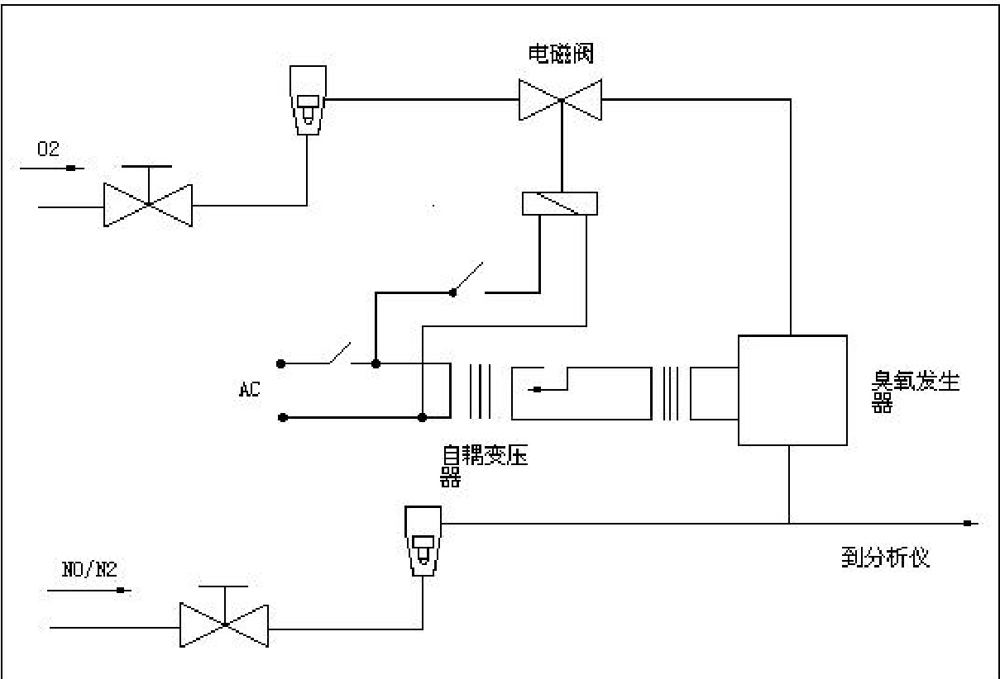  
图附录 6.1.7.1 $\mathrm{NO_{2}}$ 转换效率设备流程图  

6.1.7.2 标定  

应根据制造企业的规范，用零气和量距气在最常用工作量程标定 CLD 和 HCLD。(量距气的 NO 含量应达到工作量程的 $80\%$ 左右，混合气中的 $\Nu{\bf O}_{2}$ 浓度小于 NO 浓度的 $5\%$ )。 $\mathsf{N O}_{\mathrm{X}}$ 分析仪应置于 NO 模式，使量距气不通过转化器，记录指示浓度。  

6.1.7.3 计算  

$\mathsf{N O}_{\mathrm{X}}$ 转化器的效率按下式计算：  

a：按照第 6.1.7.6 条得到的 $\mathsf{N O}_{\mathrm{X}}$ 浓度b：按照第 6.1.7.7 条得到的 $\mathsf{N O}_{\mathrm{X}}$ 浓度c：按照第 6.1.7.4 条得到的 NO 浓度d：按照第 6.1.7.5 条得到的 NO 浓度  

6.1.7.4 加入氧气  

分析仪置于 NO 模式，通过一个 T 型接头，将氧气或合成空气连续加入气流中，直到指示浓度比第 6.1.7.2 条给出的标定浓度低 $20\%$ 左右，记录指示浓度(c)。在此过程中臭氧发生器不起作用。  

6.1.7.5 激发臭氧发生器  

分析仪置于 NO 模式，激发臭氧发生器以产生足够的臭氧，使 NO 浓度降低到约为第 6.1.7.2条给出的标定浓度的 $20\%$ (最低 $10\%$ )，记录指示浓度(d)。  

$6.1.7.6\mathrm{NO_{X}}$ 模式  

分析仪切换到 $\mathsf{N O}_{\mathrm{X}}$ 模式，使混合气(含有 NO， $\Nu{\cal O}_{2}$ ， $\mathrm{O}_{2}$ 和 $\mathbf{N}_{2}\mathbf{\dot{\Omega}}$ )通过转化器，记录指示浓度（a）。  

6.1.7.7 停止激发臭氧发生器  

分析仪置于 $\mathsf{N O}_{\mathrm{X}}$ 模式，停止激发臭氧发生器，使第 6.1.7.6 条所述的混合气通过转化器，记录指示浓度（b）。  

6.1.7.8NO 模式  

臭氧发生器停止激发的情况下，切换到 NO 模式，氧气或合成空气的气流也被切断，分析仪的 $\mathsf{N O}_{\mathrm{X}}$ 读数不应偏离按照第 6.1.7.2 条测得值 $+5\%$ 以上。  

6.1.7.9 试验间隔  

在每次标定 $\mathsf{N O}_{\mathrm{X}}$ 分析仪前均应进行转换器的效率试验。  

# 6.1.7.10 效率要求  

转化器的效率不应低于 $90\%$ ，但推荐最好超过 $95\%$ 。  

注：在分析仪最常用量程内，若臭氧发生器不能按照 6.1.7.5 使 NO 浓度从 $80\%$ 降低到 $20\%$ ，则在试验时应使用能达到此降低量的最高量程。  

# 6.1.8FID 的调整  

# 6.1.8.1 检测器响应的优化  

应按制造企业说明书的规定调整 FID。应使用合成空气作平衡气的丙烷量距气来优化最常用量程的响应。  

将 $\mathrm{H}_{2}/\mathrm{He}$ 混合气和合成空气的流量设定在制造企业的推荐值，向分析仪引入 $350\mathrm{+}75\mathrm{ppmC}_{1}$ 的量距气。应根据量距气响应与零气响应之差确定给定 $\mathrm{H}_{2}/\mathrm{He}$ 混合气流量下的响应。 $\mathrm{H}_{2}/\mathrm{He}$ 混合气流量应分别在高于和低于制造企业要求值下进行渐增调整，记录这些 $\mathrm{H}_{2}/\mathrm{He}$ 混合气流量下的量距气和零气的响应。然后将量距气和零气响应之差绘制成曲线，并将 $\mathrm{H}_{2}/\mathrm{He}$ 混合气流量调整到曲线的高响应区。  

# 6.1.8.2 碳氢化合物响应系数  

使用合成空气做平衡气的丙烷量距气和合成空气标定分析仪。  

分析仪在启用时和定期检修后，应测定响应系数。某一特定碳氢化合物的响应系数(Rf)是指 FID 的 $\mathrm{C}_{1}$ 读数与以 ppm C1 表示的气瓶气体浓度之比。  

测试气体的浓度必须能够产生满量程 $80\%$ 左右的响应。基于重量基准，用体积表示的已知浓度必须达到 $+2\%$ 的准确度。另外，气瓶应在 $298\mathrm{K}+5\mathrm{K}(25^{\circ}\mathrm{C}+5^{\circ}\mathrm{C})$ 温度下预处理 24 小时。  

所使用的测试气体和推荐的响应系数范围如下：  

甲烷和合成空气 $1.00\ \leqslant\mathrm{R}_{\mathrm{f}}\leqslant1.15$ 丙烯和合成空气 $0.90\leqslant\mathrm{R}_{\mathrm{f}}\leqslant1.10$ 甲苯和合成空气 $0.90\ \leqslant\mathrm{R}_{\mathrm{f}}\leqslant1.10$ 以上各值均指相对于丙烷和合成空气的 $\mathrm{R}_{\mathrm{f}}$ 为 1 时的响应系数。  

6.1.8.3 氧干扰检查  

分析仪在启用时和定期检修后，应检查氧干扰。  

应按第 6.1.8.2 条的规定测定响应系数，所使用的检验气体和推荐的响应系数如下：  

丙烷和纯氮气 $0.95\ \leqslant\mathrm{R}_{\mathrm{f}}\leqslant1.15$ 此值是指相对于丙烷和合成空气的 $\mathrm{\sfR}_{\mathrm{f}}$ 为 1 时的响应系数。  

FID 燃烧器中空气的氧浓度应在最近氧干扰检查时所用燃烧器中空气的氧浓度的 $+1\mathrm{mole\%}$ 以内，假如相差很大，应进行氧干扰检查，必要时应调整分析仪。  

6.1.9NDIR 和 CLD 分析仪的干扰影响  

除所分析的气体外，排气中存在的其他气体会以多种方式干扰读数。NDIR 仪器中出现的正干扰，是指干扰气体产生与被测气体的相同的作用，但影响程度较小。NDIR 仪器中出现的负干扰，是指由于干扰气体扩大了被测气体的吸收带；而在 CLD 仪器中出现的负干扰则是由于干扰气体的熄光作用。分析仪在启用前和定期检修后，应按照第 6.1.9.1 条和第 6.1.9.2 条的规定  

进行干扰检查。  

6.1.9.1CO 分析仪的干扰检查  

水和 $\mathrm{CO}_{2}$ 会干扰 CO 分析仪的性能。因此，应在室温下，将浓度为试验时所用最大工作量程 $80\%\sim100\%$ 的 $\mathrm{CO}_{2}$ 量距气从水中冒泡流出，并记录分析仪的响应值。若 CO 量程等于或高于$300{\mathrm{ppm}}\mathrm{C}_{1}$ ，分析仪的响应值应不大于满量程的 $1\%$ ，若 CO 量程低于 $300{\mathrm{ppm}}\mathrm{C}_{1}$ ，分析仪的响应值应不大于 $3\mathrm{ppm}$ 。  

$6.1.9.2\mathrm{NO_{X}}$ 分析仪的熄光检查  

对 CLD(或 HCLD)分析仪有熄光作用的两种气体是 $\mathrm{CO}_{2}$ 和水蒸气。这些气体的熄光响应与其浓度成正比，因而要求用试验方法，在试验经验认为的最高浓度下，测定熄光。  

$6.1.9.2.1\mathrm{CO}_{2}$ 熄光检查  

将浓度为最大工作量程 $80\%\sim100\%$ 满量程的 $\mathrm{CO}_{2}$ 量距气通入 NDIR 分析仪，记录 $\mathrm{CO}_{2}$ 值作为 A；然后用 NO 量距气将其稀释到 $50\%$ 左右，并通入 NDIR 和(H)CLD，记录 $\mathrm{CO}_{2}$ 和 NO 值，分别作为 B 和 C；然后切断 $\mathrm{CO}_{2}$ ，只让 NO 量距气通过(H)CLD，记录 NO 值，作为 $\mathrm{~D~}$ 。  

按下式计算的熄光应不超过 $3\%$ ：  

式中，  

A：NDIR 测定的未稀释 $\mathrm{CO}_{2}$ 浓度， $0\%$ B：NDIR 测定的稀释 $\mathrm{CO}_{2}$ 浓度， $0\%$ C：（H）CLD 测定的稀释 NO 浓度，ppmD：（H）CLD 测定的未稀释 NO 浓度，ppm6.1.9.2.2 水熄光检查  

这种检查仅适用于湿基 $\mathsf{N O}_{\mathrm{X}}$ 分析仪。水熄光计算必须用水蒸气稀释 NO 量距气，并且使混合气的水蒸气浓度达到预期在试验中出现的浓度。  

将浓度为常用工作量程 $80\%\sim100\%$ 满量程的 NO 量距气通入(H)CLD，记录 NO 值作为 D；NO 量距气从室温下的水中冒泡流出通过 NO 分析仪，记录 NO 值作为 C。测定分析仪的绝对压力和起泡器水温，分别记录作为 E 和 $\mathrm{~F~}$ 。计算对应于起泡器水温(F)的混合气饱和蒸气压力，记录作为 G，按下式计算混合气的水蒸气浓度 $(\mathrm{H},\ \%)$ ：  

$$
H=100\times\left(\frac{G}{E}\right)
$$  

按下式计算预期的稀释 NO 量距气(水蒸气中)的浓度 $\left(\mathrm{D}_{\mathrm{e}}\right)$ ：  

$$
D_{e}=D\times\left(1{-}{\frac{H}{100}}\right)
$$  

对于船机排气，假设燃料原子H：C 为1.8：1，根据未稀释 $\mathrm{CO}_{2}$ 量距气的浓度(A，按第 4.1.9.2.1条测定)，试验期间排气中预期的最大水蒸气浓度 $(\mathrm{H}_{\mathrm{m}},\ \%)$ 估算如下：  

$$
\operatorname{H}_{\mathrm{m}}{=}0.9\times\mathbf{A}
$$  

按下式计算的水熄光应不超过 $3\%$ ：  

$$
\%H_{2}O\%\mathsf{J}\mathsf{J}\mathsf{E}=100\times\left(\frac{D_{e}-C}{D_{e}}\right)\times\left(\frac{H_{m}}{H}\right)
$$  

式中，  

$\mathrm{D}_{\mathrm{e}}$ ：预期稀释 NO 的浓度，ppm  

C：稀释 NO 的浓度，ppm  

$\mathrm{H}_{\mathrm{m}}$ ：最大水蒸气浓度， $0\%$  

H：实际水蒸气浓度， $0\%$  

注：由于熄光计算中未考虑 $\Nu{\cal O}_{2}$ 在水中的吸收，所以在该检查中 NO 量距气所含 $\Nu{\cal O}_{2}$ 浓度要尽量低。  

# 6.1.10 标定周期  

至少每 3 个月按照第 6.1.5 条规定标定分析仪一次，或在系统检修、调整后可能影响标定时进行标定。  

# 6.2 颗粒物测量系统的标定  

6.2.1 概述  

为了达到本标准的精度要求，每个部件都应经常标定。本节叙述附录 5 第 5.1.5 条和附录 4中所示部件的标定方法。  

# 6.2.2 流量测量  

气体流量计或流量测量仪的标定应溯源到国际标准和/或国家标准。  

测量值的最大误差应在读数的 $+2\%$ 以内。  

如气体流量用差压流量测量法测定，流量差值的最大误差应使 GEDFW 的准确度在 $+4\%$ 以内(参见附录 2 第 2.1.2.1 条 EGA)。该值可用各仪器误差的均方根进行计算。  

# 6.2.3 检查稀释比  

当使用不带排气分析仪的颗粒物取样系统时（见附录 4 第 4.1.2.1.1 条），对每一台新安装的船机，通过运转船机及测量在原始排气或稀释排气中 $\mathrm{CO}_{2}$ 或 $\mathsf{N O}_{\mathrm{X}}$ 浓度的方法来检查稀释比。测量的稀释比应在根据测量的 $\mathrm{CO}_{2}$ 或 $\mathsf{N O}_{\mathrm{X}}$ 浓度计算的稀释比的 $+10\%$ 以内。  

# 6.2.4 检查部分流条件  

应检查排气速度和压力波动范围，如适用，根据附录 4 第 4.1.2.1.1 条中 EP 的要求进行调整。  

# 6.2.5 标定周期  

流量测量装置应定期标定，或系统发生改变可能影响标定时进行标定。  

# 附录7 数据确定和计算  

# 7.1.气态污染物数据确定  

气态污染物的确定，应将每工况最后 60 秒记录的读数取平均值。应根据记录读数的平均值和相应的校正数据确定每个工况的 HC、CO、 $\mathsf{N O}_{\mathrm{X}}$ 和 $\mathrm{CO}_{2}$ （如果使用碳平衡法）的平均浓度(conc)。如果能够确保获取等效数据，可以使用不同的记录形式。  

可以根据稀释空气取样袋的读数或连续背景读数和相应的校正数据确定平均背景浓度(concd)。  

# 7.2 颗粒物  

颗粒物排放量的确定，应该记录每工况通过滤纸的取样质量(MSAM，i)或体积(VSAM，i)。  

试验完成后，应将滤纸送回称重室稳定至少 1 小时，但不超过 80 小时，然后称重。记录滤纸的总质量并减去其净质量，颗粒物质量 $(\mathrm{M}_{\mathrm{f}}$ 对单滤纸方法，Mf i 对多滤纸方法)是在初级、次级滤纸收集的颗粒物质量之和。  

如果进行背景校正，应该记录通过滤纸的稀释空气质量 $(\mathrm{M_{DIL}})$ 或体积 $(\mathrm{V_{DIL}})$ 和颗粒物质量$\mathrm{(M_{d})}$ 。如果进行多次测量，应该计算每次测量的 $\mathbf{M}_{\mathrm{d}}/\mathbf{M}_{\mathrm{DIL}}$ 或 $\mathbf{M}_{\mathrm{d}}/\mathbf{V}_{\mathrm{DIL}}$ 并取平均值。  

# 7.3 气态污染物的计算  

应该根据下列步骤计算试验的最终结果。  

7.3.1 排气流量的确定  

应该根据附录 5 第 5.3.1 条 $\sim$ 第 5.3.3 条确定每工况的排气流量(GEXHW，VEXHW 或 $\mathrm{V_{EXHD}})$ 。当使用全流稀释系统时，应该根据附录 5 第 5.3.4 条计算每工况的总稀释排气流量(GTOTW，VTOTW)。  

# 7.3.2 干/湿基校正  

当应用 GEXHW，VEXHW，GTOTW 或 VTOTW 时，如果不是在湿基状况下测量，应该根据下列公式将干基浓度转换成湿基浓度：  

$$
\scriptstyle\mathrm{conc(wet)=K_{w}\times c o n c(d r y)}
$$  

对原始排气取样：  

$$
K_{_{w,r,1}}=\left(1-F_{_{F H}}\times\frac{G_{_{F U E L}}}{G_{_{A I R D}}}\right)-K_{_{w2}}
$$  

或  

$$
K_{w,r,2}=\left(\frac{1}{1+1.85\times0.005\times(\%C O[d r y]+\%C O_{2}[d r y]}\right)-K_{w2}
$$  

对稀释排气取样：  

$$
K_{_{w,e,1}}=\left(1-\frac{1.85\times C O_{_2}\%(w e t)}{200}\right)-K_{_{w1}}
$$  

或  

$$
{K}_{w,e,2}=\left(\frac{1-{K}_{w1}}{1+\frac{1.85\times C{O}_{2}\%(d r y)}{200}}\right)
$$  

FFH 由下面的公式计算：  

$$
F_{_{F H}}=\frac{1.969}{\left(1+\frac{G_{_{F U E L}}}{G_{_{A I R W}}}\right)}
$$  

对稀释空气：  

$$
K_{\scriptscriptstyle{w1}}=\frac{1.608\times[H_{d}\times(1-1/D F)+H_{a}\times(1/D F)]}{1000+1.608\times[H_{d}\times(1-1/D F)+H_{a}\times(1/D F)]}
$$  

式中：  

$$
H_{d}=\frac{6.22\times R_{d}\times p_{d}}{p_{B}-p_{d}\times R_{d}\times10^{-2}}
$$  

$$
H_{a}=\frac{6.22\times R_{a}\times p_{a}}{p_{B}-p_{a}\times R_{a}\times10^{-2}}
$$  

对进气(如果不同于稀释空气)：  

$$
\mathrm{K}_{\mathrm{w},\mathrm{\a}}{=}1{-}\mathrm{K}_{\mathrm{w}2}
$$  

$$
K_{_{w2}}=\frac{1.608\times H_{a}}{1000+1.608\times H_{a}}
$$  

$$
H_{a}=\frac{6.22\times R_{a}\times p_{a}}{p_{B}-p_{a}\times R_{a}\times10^{-2}}
$$  

$7.3.3\mathrm{NO_{X}}$ 湿度校正  

由于 $\mathsf{N O}_{\mathrm{X}}$ 排放与环境大气条件有关， $\mathsf{N O}_{\mathrm{X}}$ 浓度应该根据下式给出的系数 $\mathsf{K}_{\mathrm{H}}$ 进行环境温度和湿度校正, $\mathsf{N O}_{\mathrm{X}}$ 湿度校正系数公式如下:  

$$
K_{H}=\frac{1}{1+A\times(H_{a}-10.71)+B\times(T_{a}-298)}
$$  

式中：  

$$
A=0.309\times\frac{G_{F U E L}}{G_{A I R D}}-0.0266
$$  

$$
B=-0.209\times\frac{G_{F U E L}}{G_{A I R D}}+0.00954
$$  

$$
H_{a}=\frac{6.22\times R_{a}\times p_{a}}{p_{B}-p_{a}\times R_{a}\times10^{-2}}
$$  

# 7.3.4 排放物质量流量计算  

每工况的排放物质量流量应根据下式计算：  

(1) 对原始排气①)：Gasmass=u×conc×GEXHW  
或：Gasmass=v×conc×VEXHD  
或：Gasmass=w×conc×VEXHW  
(2) 对稀释排气：Gasmass=u×concc×GTOTW  
或：Gasmass=w×concc×VTOTW  
式中：  
concc：背景校正浓度。  
concc $\L=_{\L}$ conc -concd $\times$ (1-1/DF)  

FS：理论配比系数，若为柴油， $\mathrm{FS}{=}13.4$ ；若为 NG， $\mathrm{FS}{=}9.5$ 。  

应根据表 7.1 使用系数 u—质量流量计算用湿基系数，v—干基系数，w—体积流量计算用湿基系数：  

表 7.1 干、湿基系数  

<html><body><table><tr><td>气体</td><td>u</td><td>V</td><td>W</td><td>conc</td></tr><tr><td>NOx</td><td>0. 001587</td><td>0.002053</td><td>0.002053</td><td>ppm</td></tr><tr><td>CO</td><td>0. 000966</td><td>0.00125</td><td>0.00125</td><td> ppm</td></tr><tr><td>HC</td><td>0. 000479 0.000516*</td><td>一</td><td>0. 000619 0.000667*</td><td> ppm</td></tr><tr><td>CO2</td><td>15.19</td><td>19. 64</td><td>19.64</td><td>% </td></tr></table></body></html>

注\*：适用于 NG 燃料。  

# 7.3.5 比排放量的计算  

每一种组分的比排放量（ $\mathbf{\dot{\tau}}_{\mathbf{g}/\mathbf{k}\mathbf{W}\mathbf{h}}$ ）应该根据下列公式计算：  

每种气体 $\displaystyle=\frac{\displaystyle\sum_{i=1}^{n}(G a s_{m a s s,i}\times W F_{i})}{\displaystyle\sum_{i=1}^{n}(P_{(n)_{i}}\times W F_{i})}$  

在上述计算中使用的加权系数和工况号(n)按照附录 3 第 3.8.1 条的规定。  

# 7.4 颗粒物的计算  

颗粒物应该根据下列公式计算：  

7.4.1 颗粒物的湿度校正系数  

由于船机的颗粒物排放与环境大气条件有关，颗粒物质量流量应该用下式的系数 $\mathrm{K}_{\mathrm{p}}$ 对环境空气湿度进行校正，用于计算最终结果的颗粒物的质量流量 $\mathrm{PM}_{\mathrm{mass}}$ 等于测量的颗粒物的质量乘上湿度校正系数 $\mathrm{K}_{\mathrm{p}}$ 。  

$$
K_{p}=\frac{1}{1+0.0133\times(H_{a}-10.71)}
$$  

$$
H_{a}=\frac{6.22\times R_{a}\times p_{a}}{p_{B}-p_{a}\times R_{a}\times10^{-2}}
$$  

# 7.4.2 部分流稀释系统  

颗粒物的最终结果应该根据下列步骤确定。由于使用不同的稀释流量控制方式，对当量排气质量流量 GEDF 或当量排气体积流量 $\mathrm{V_{EDF}}$ 可以使用不同的计算方法。所有的计算应以各工况取样阶段的平均值为基础  

# 7.4.2.1 等动态系统  

或：  

$$
\mathrm{V_{EDFW,\i}{=}V_{E X H W,\ i}{\times}q_{i}}
$$  

式中：  

$$
q_{i}=\frac{G_{D I L W,i}+(G_{E X H W,i}\times r)}{(G_{E X H W,i}\times r)}
$$  

或：  

$$
q_{i}=\frac{V_{D I L W,i}+(V_{E X H W,i}\times r)}{(V_{E X H W,i}\times r)}
$$  

式中：  

$$
r=\frac{A_{p}}{A_{T}}
$$  

7.4.2.2 带 $\mathrm{CO}_{2}$ 或 $\mathsf{N O}_{\mathrm{X}}$ 浓度测量的系统  

或：  

$$
\mathrm{V_{EDFW,\i}{=}V_{E X H W,\ i}{\times}q_{i}}
$$  

$$
q_{i}=\frac{C o n c_{E,i}-C o n c_{A,i}}{C o n c_{D,i}-C o n c_{A,i}}
$$  

式中：  

ConcE：原始排气中示踪气的湿基浓度  
ConcD：稀释排气中示踪气的湿基浓度  
ConcA：稀释空气中示踪气的湿基浓度  
应根据第 5.3.2 条，将测得的干基浓度转换为湿基浓度。7.4.2.3 带 $\mathrm{CO}_{2}$ 测量和碳平衡法的系统  

$$
G_{E D F W,i}=\frac{206.6\times G_{F U E L,i}}{C O_{2D,i}-C O_{2A,i}}
$$  

式中：  

$\mathrm{CO}_{2\mathrm{D}}$ ：稀释排气中 $\mathrm{CO}_{2}$ 浓度，以湿基体积 $\%$ 表示  
$\mathrm{CO}_{2\mathrm{A}}$ ：稀释空气中 $\mathrm{CO}_{2}$ 浓度，以湿基体积 $\%$ 表示  
下式的计算是以碳平衡假设为依据（即：供给船机的碳原子全部以 $\mathrm{CO}_{2}$ 形式排出）。  

$$
\mathrm{G_{EDFW,\i}{=}G_{E X H W,\ i}{\times}q_{i}}
$$  

$$
q_{i}=\frac{206.6\times G_{F U E L,i}}{G_{E X H W,i}\times(C O_{2D,i}-C O_{2A,i})}
$$  

7.4.2.4 带流量测量的系统  

GEDFW，i=GEXHW， $\mathrm{_i}\times\mathrm{q\mathrm{_i}}$  

$$
q_{i}=\frac{G_{\mathit{T O T W},i}}{G_{\mathit{T O T W},i}-G_{\mathit{D I L W},i}}
$$  

# 7.4.3 全流稀释系统  

应该按照下列步骤确定颗粒物的最终结果。  
所有计算应以各工况取样阶段的平均值为依据。  

GEDFW， $\mathrm{_i=}$ GTOTW，i  

或：  

7.4.4 颗粒物质量流量计算  

颗粒物质量流量应根据如下公式计算：  

对单滤纸方法：  

$$
P M_{m a s s}=\frac{M_{f}}{M_{{}_{S A M}}}\times\frac{{(G_{{}_{E D F W}})}_{a v e r}}{1000}
$$  

或：  

$$
P M_{m a s s}=\frac{M_{f}}{V_{S A M}}\times\frac{(V_{E D F W})_{a\nu e r}}{1000}
$$  

式中：  

整个试验循环中的（GEDFW）aver, （VEDFW）aver,(MSAM)aver,(VSAM)aver 是取样过程中各工况的平均值之和。  

$$
\left(G_{_{E D F W}}\right)_{a v e r}=\sum_{i=1}^{n}G_{_{E D F W,i}}\times W F_{i}
$$  

$$
\left({{V}_{E D F W}}\right)_{a v e r}=\sum_{i=1}^{n}{{{V}_{E D F W,i}}\times W{{F}_{i}}}
$$  

$$
M_{S A M}=\sum_{i=1}^{n}M_{S A M,i}
$$  

$$
V_{S A M}=\sum_{i=1}^{n}V_{S A M,i}
$$  

式中： $\mathrm{i}{=}1$ ，…n对多滤纸方法：  

$$
P M_{m a s s,i}=\frac{M_{f,i}}{M_{S A M,i}}\times\frac{G_{E D F W,i}}{1000}
$$  

或：  

$$
P M_{m a s s,i}=\frac{M_{f,i}}{V_{S A M,i}}\times\frac{V_{E D F W,i}}{1000}
$$  

式中： $\mathrm{i}{=}1$ ，…n  

颗粒物质量流量根据下式进行背景校正：  

对单滤纸方法：  

$$
P M_{m a s s}=\left[\frac{M_{f}}{M_{_{S A M}}}-\left(\frac{M_{d}}{M_{_{D I L}}}\times\left(\sum_{i=1}^{n}\left(1-\frac{1}{D F_{i}}\right)\times W F_{i}\right)\right)\right]\times\frac{\left(G_{_{E D F W}}\right)_{a v e r}}{1000}
$$  

或  

$$
P M_{m a s s}=\left[\frac{M_{f}}{V_{S A M}}-\left(\frac{M_{d}}{V_{D I L}}\times\left(\sum_{i=1}^{n}\left(1-\frac{1}{D F_{i}}\right)\times W F_{i}\right)\right)\right]\times\frac{(V_{E D F W})_{a v e r}}{1000}
$$  

如果是多次测量,则 $\mathrm{(M_{d}/M_{D I L})}$ )或 $\mathrm{(M_{d}/V_{D L})}$ 应分别被 $(\mathrm{M_{d}/M_{D I L}})_{\mathrm{aver}}$ 和 $(\mathrm{M_{d}/V_{D I L}})_{\mathrm{aver}}$ 替代。  

FS：理论配比系数，若为柴油， $\mathrm{FS}{=}13.4$ ；若为 NG， $\mathrm{FS}{=}9.5$ 。对多滤纸方法：  

$$
P M_{m a s s,i}=\left[\frac{M_{f,i}}{M_{_{S A M,i}}}-\left(\frac{M_{d}}{M_{_{D I L}}}\times\left(1-\frac{1}{D F}\right)\right)\right]\times\frac{G_{_{E D F W,i}}}{1000}
$$  

或：  

$$
P M_{_{m a s s,i}}=\left[\frac{M_{_{f,i}}}{V_{_{S A M,i}}}-\left(\frac{M_{_{d}}}{M_{_{D I L}}}\times\left(1-\frac{1}{D F}\right)\right)\right]\times\frac{V_{_{E D F W,i}}}{1000}
$$  

如果是多次测量,则 $\mathrm{(M_{d}/M_{D I L})}$ )或 $\mathrm{Md/V_{DL}})$ )应分别被 $(\mathrm{M_{d}/M_{D I L}})_{\mathrm{aver}}$ 和 $(\mathrm{M_{d}/V_{D I L}})_{\mathrm{aver}}$ 替代。  

FS：理论配比系数，若为柴油， $\mathrm{FS}{=}13.4$ ；若为 NG， $\mathrm{FS}{=}9.5$ 。  

# 7.4.5 比排放量的计算  

颗粒物比排放量 $\mathrm{PM(g/kWh)}$ 应该根据下列公式计算①：  

对单滤纸方法：  

$$
P M=\frac{P M_{m a s s}}{\displaystyle\sum_{i=1}^{n}(P_{(n)_{i}}\times W F_{i})}
$$  

对多滤纸方法：  

$$
P M=\frac{\displaystyle\sum_{i=1}^{n}(P M_{m a s s,i}\times W F_{i})}{\displaystyle\sum_{i=1}^{n}(P_{(n)_{i}}\times W F_{i})}
$$  

# 7.4.6 有效加权系数  

对单滤纸方法，每工况的有效加权系数应根据下列公式计算：  

$$
W F_{_{E,i}}=\frac{M_{_{S A M,i}}\times(G_{_{E D F W,i}})_{a v e r}}{M_{_{S A M}}\times G_{_{E D F W,i}}}
$$  

或：  

$$
W F_{_{E,i}}=\frac{V_{_{S A M,i}}\times(V_{_{E D F W,i}})_{a\nu e r}}{V_{_{S A M}}\times V_{_{E D F W,i}}}
$$  

式中： $\mathrm{i}{=}1$ ，…n  

有效加权系数应在所列出的加权系数的 $+0.005$ （绝对值）范围内。  

# 附录 8 劣化系数的确定  

# 8.1 概述  

本附件规定了劣化系数或劣化修正值的确定方法。  

# 8.2 劣化系数或劣化修正值的确定  

8.2.1 制造企业应以良好的工程方法为基础，采用能够代表在用发动机排放性能劣化的试验循环，运行耐久性试验。耐久性时间应不少于附录 1 表 5.2 中规定的允许最短试验时间。  
8.2.2 耐久性试验可在发动机台架上进行，也可采用加速老化的耐久试验方法，相关的加速老化因子由制造企业根据良好的工程方法来确定。  
8.2.3 耐久性试验期间，除了制造企业推荐的日常维护或在检测机构的有效监督下，不能对排放关键零部件进行维护或替换。  
8.2.4 制造企业应采用良好的工程方法，确定排放耐久性试验发动机，试验发动机应能代表型式检验时采用该 DF 值的发动机系族的排放劣化特性。在合理的技术分析基础上，不同缸径、不同冲程、不同配置、不同进气管理系统和不同燃油系统的发动机可以看作排放劣化特性相同。  

下列排放控制相关的基本特性共有的船机，可以看作排放劣化特性相同：  

1）燃烧循环— 2 冲程— 4 冲程  

2）吸气方式—自然抽吸—增压  

3）空气是否冷却  

4）燃烧室—开式燃烧室—分隔式燃烧室  

5）燃油、进排气门控制方式  
—电控  
—机械控制  
6）排放后处理技术  
—SCR  
—EGR  
—DPF  
—其他  

8.2.5 应在磨合期结束时、耐久性试验结束时、耐久性试验期间选择的几个间隔点进行排放测试。  

8.2.6 排放耐久性试验和排放测试可在制造企业进行，但应在检测机构的有效监督下。  

8.2.7 应对每种污染物分别确定劣化系数或劣化修正值。对于 $\mathrm{NOx+HC}$ 的劣化修正值，应根据排放耐久性试验过程中测量的 $\mathrm{NOx+HC}$ 总量来计算确定；对于 $\mathrm{NOx+HC}$ 的劣化系数，应根据排放耐久性试验过程中测量的 $\mathrm{\DeltaNOx}$ 和 HC 分别确定劣化系数，分别计算 NOx 和 HC 有效寿命期终点的排放试验结果，最后把 NOx 和 HC 的计算排放值相加以判断是否符合标准要求。  

8.2.8 当排放耐久性试验没有覆盖整个排放耐久期时，排放耐久期结束时的排放值应根据试验期间确立的劣化趋势外插到排放耐久期结束点。  

8.2.9 应周期性记录耐久性试验期间的排放试验结果，采用“最小二乘法”确定有效寿命期 终点的排放值。  

8.2.10 对于安装排气后处理系统的发动机，各污染物的劣化系数（DFi）计算如下：  

$$
\mathrm{DF_{i}}\mathrm{=}{\frac{M_{i1}}{M_{i0}}}
$$  

式中：  

$\mathbf{M}_{\mathrm{i0}}$ —耐久性试验起点的污染物 i 的排放量， $\mathbf{g}/\mathbf{k}\mathbf{W}\cdot\mathbf{h}$ ；  
$\mathbf{M}_{\mathrm{i}1}$ —有效寿命期终点的污染物 i 的排放量， $\mathbf{g}/\mathrm{kW}\cdot\mathbf{h}.$ 。  
如果 $\mathrm{{DF}_{i}}$ 小于 1，则视为 1。  

8.2.11 对于不安装排气后处理系统的发动机，各污染物的劣化修正值（ $\mathrm{DC}_{\mathrm{i}}$ ）计算如下：  

$$
\mathrm{DC}_{\mathrm{i}}{=}M_{i1}{-}M_{i0}
$$  

式中：  

$\mathbf{M}_{\mathrm{i0}}$ —耐久性试验起点的污染物 i 的排放量， $\mathrm{g}/\mathrm{kW}\cdot\mathrm{h}$ ；  
$\mathbf{M}_{\mathrm{i}1}$ —有效寿命期终点的污染物 i 的排放量， $\mathbf{g}/\mathbf{k}\mathbf{W}\cdot\mathbf{h}.$ 。  
如果 DCi 小于 0，则视为 0。  

8.2.12 在合理的技术分析基础上，生产企业可以将已经型式检验的重型道路或非道路压燃式发动机确立的劣化系数或劣化修正值应用到相同型号的船用发动机上。  

8.2.13 对于采用已经经过验证的排放控制技术的船机，可以采用基于良好的工程实践的分析，替代耐久性试验来确定劣化系数或劣化修正值。  

# 8.3 型式检验替代用 DF 值  

8.3.1 对于不安装排气后处理系统的发动机系族，应对每种污染物或污染物组合（如：$\mathrm{NOx+HC}$ ）提供一个劣化修正值（DCi）。  

8.3.2 对于安装排气后处理系统的发动机系族，应对每种污染物或污染物组合（如：$\mathrm{NOx+HC}$ ）提供一个劣化系数（DFi）。  

8.3.3 制造企业应向检测机构提供相关信息以支持替代用 DF 值。包括排放试验结果、耐久性试验计划表，维护程序及支持发动机技术等效性判定的信息（如适用）。  

# 附录 9 基准柴油的技术要求 1)  

表 9.1 型式检验用基准柴油  

<html><body><table><tr><td rowspan="2"></td><td rowspan="2">单位</td><td colspan="2">限值”</td><td rowspan="2">试验方法</td></tr><tr><td>最小</td><td>最大</td></tr><tr><td>十六烷值”</td><td>—</td><td>46</td><td>50</td><td>GB/T 386</td></tr><tr><td>20°℃下密度</td><td>kg/m²</td><td>825</td><td>840</td><td>GB/T 1884、GB/T 1885</td></tr><tr><td>馏程 -50%点 -95%点 终馏点</td><td>℃ ℃</td><td>245 345 二</td><td>300 355 365</td><td>GB/T 6536</td></tr><tr><td>20°℃下粘度</td><td>mm² / s</td><td>3.0</td><td>8.0</td><td>GB/T 265</td></tr><tr><td>硫含量</td><td>mg/kg</td><td>0</td><td>10</td><td>GB/T 380</td></tr><tr><td>闪点</td><td>℃</td><td>60</td><td>—</td><td>GB/T 261</td></tr><tr><td>冷滤点</td><td>℃</td><td>—</td><td>-5</td><td>SH/T 0248</td></tr><tr><td>铜腐蚀</td><td></td><td>—</td><td>1级</td><td>GB/T 5096</td></tr><tr><td>10%蒸余物残碳</td><td>% (m/m)</td><td></td><td>0.3</td><td>GB/T 268</td></tr><tr><td>灰份</td><td>% (m/m)</td><td></td><td>0. 01</td><td>GB/T 508</td></tr><tr><td>水份</td><td>% (v/v)</td><td></td><td>0. 05</td><td>GB/T 260</td></tr><tr><td>中和数(强酸)</td><td>mg KOH/g</td><td>一</td><td>0.02</td><td>GB/T 258</td></tr><tr><td>氧化安定性"</td><td>mg/ml</td><td></td><td>0. 025</td><td>SH/T0175</td></tr></table></body></html>  

注：1)如果需要计算船机的热效率，燃料热量值可用下式计算：比能量(热值)(净)$\mathrm{MJ/kg{=}(46.423-8.792\times d^{2}+3.17\bullet d)\times(1-(x+y+s))+9.42\times s-2.499\times X}$ 式中：d - 288K( $\mathrm{15^{\circ}C}^{\prime}$ )的密度x - 水的质量百分比 $(\%/100)$ )y - 灰的质量百分比 $(\%/100)$ )s - 硫的质量百分比 $(\%/100)$ )  

2) 在技术规格中引用的值是“真值”，在确定这些限值时，采用了 ISO 4259“石油产品-与试验方法有关的精密数据的确定和运用”中的条款，在确定最小值时，考虑了零以上2R 的最小差值，在确定最大和最小值时，最小差值为 4R( $\mathrm{{\langleR=}}$ 再现性)  

尽管有了这个为了统计原因而采取的必要措施，然而燃料制造企业应该在规定的最大值 2R 时，瞄准零值，而在以最大和最小表示的情况下，瞄准平均值，一旦需要澄清燃料是否满足了技术规格的规定，应该使用 ISO4259 中的条款。  

3) 十六烷值的范围并不符合最小范围为 4R 的要求。但是，在燃油供应商和燃油使用者之间发生争议时，可以采用 ISO 4259 中的条款来解决这类争议，只要为达到必要的精度进行了足够数量的重复测量，就比单一判  

断来得好。  

4) 即使控制了氧化稳定性，燃油的储藏寿命也可能是有限的。应向供应商征求关于储藏条件和寿命的建议。  

# 附录 10 船机净功率测试所需安装的装备和附件  

表 10.1  

<html><body><table><tr><td>序号</td><td>装备和辅件</td><td>排放试验装用情况</td></tr><tr><td></td><td>进气系统： 进气歧管</td><td>是，装标准生产部件</td></tr><tr><td>1</td><td>曲轴箱排放控制装置 双进气歧管控制装置 进气歧管系统： 空气流量计 进气管路系统 空气滤清器</td><td>是，装标准生产部件 是，装标准生产部件 是，装标准生产部件 是） 是"</td></tr><tr><td>2</td><td>进气消声器 限速装置 进气歧管进气加热装置</td><td>是1 是，装标准生产部件，尽可能调整在 是"</td></tr><tr><td>3</td><td>排气系统: 排气净化装置 排气歧管 增压装置 连接管 消声器</td><td>最佳状态 是，装标准生产部件 是，装标准生产部件 是，装标准生产部件 是” 是”</td></tr><tr><td>4</td><td>排气制动装置 输油泵</td><td>否 是，装标准生产部件 )</td></tr><tr><td>5</td><td>燃油喷射装置: 粗滤器 滤清器 喷油泵 高压油管 喷油器 进气门 电子控制装置，空气流量计等 调速器/控制装置 全负荷自动油量限制器（根据大气状况调节</td><td>是，装标准生产部件或试验台设备 是，装标准生产部件或试验台设备 是，装标准生产部件 是，装标准生产部件 是，装标准生产部件 是，装标准生产部件 5) 是，装标准生产部件 是，装标准生产部件 是，装标准生产部件</td></tr><tr><td>6</td><td>齿条) 液体冷却装置： 散热器/热交换器 风扇 风扇防护罩 水泵</td><td>否 否，空冷器为风冷时需要安装 否 是，装标准生产部件</td></tr><tr><td>7</td><td>节温器 空气冷却装置： 导风罩</td><td>是，装标准生产部件 否）</td></tr></table></body></html>  

<html><body><table><tr><td></td><td>风扇或鼓风机 温度调节装置</td><td>否？ 否</td></tr><tr><td>8</td><td>增压装置: 压气机 (由船机直接驱动或由排气驱动) 增压控制装置 中冷器 冷却泵或风扇 (船机驱动) 冷却液流量控制装置</td><td>是，装标准生产部件 是，装标准生产部件 是，装标准生产部件或试验台设备， 否? 是，装标准生产部件</td></tr><tr><td>9</td><td>海水泵 试验台辅助风扇</td><td>是，装标准生产部件 是，需要时安装</td></tr><tr><td>10</td><td>防污染装置</td><td>是，装标准生产部件 "</td></tr><tr><td>11</td><td>机油泵</td><td>是，装标准生产部件</td></tr></table></body></html>

注：1) 如属以下情况时，应装上全部进气系统：  

- 可能对船机功率产生相当大的影响- 当制造企业提出此要求时  

在其他情况下，可以使用一等效进气系统，但应检查，确保进气压力与制造企业规定的，装有清洁空气滤清器时的进气压力上限值之差不大于 $100\mathrm{Pa}$ 。  

2) 如属以下情况时，应装上全部排气系统：  
- 可能对船机功率产生相当大的影响；  
- 当制造企业提出此要求时。  
在其他情况下，可以使用一等效排气系统，但所测压力与制造企业规定的压力上限值之差不大于 $1000\mathrm{Pa}$ 。  

3) 船机设有排气制动装置，则节流阀应固定在全开位置。  

4) 需要时燃料供给压力可以调节，以便能重新达到船机杂某一用途时所需的压力(特别在使用”燃料回流”系统时)。  

5) 进气阀是喷油泵气动调速器的控制阀，调速器或喷油装置可以装有其他可能影响喷油量的装置。  

6) 只能用船机的水泵来实施冷却液的循环。可用外循环来冷却冷却液，使该循环的压力损失和水泵进口处压力保持与原来船机冷却系统的大致相同。  

7) 当试验装有冷却风扇或鼓风机时，应将其吸收功率加到试验结果中去，风扇或鼓风机的功率应按试验所用转速，根据标定特性计算或实际试验确定。  

8)进气中冷船机应带中冷器(液冷或空冷)进行试验，但如制造企业要求，也可用台架试验系统来代替中冷器。无论那种情况，均应按照制造企业规定的船机空气在经过试验台中冷器的最大压力降和最小温度降，测量每一转速时的功率。  

这些装置包括诸如废气再循环系统(EGR)，催化转化器，热反应器，二次空气供给系统和燃油蒸发防护系统等。  

# 附录 11 型式检验结果  

11.1 概述  
11.1.1 厂牌：  
11.1.2 船机机型或船机系族的名称：  
11.1.3 制造企业的名称和地址：  
制造企业授权的代理人(如果有)的名称和地址：  
11.1.4 船机标签  
位置:  
固定方法：  
11.1.5 总装厂地址：  
11.1.6 船机装用的船舶说明：  
11.2 使用的限制条件（如果有）：  
11.2.1 船机安装到船舶上应遵守的特别条件：  
11.2.1.1 最大允许进气阻力：kPa  
11.2.1.2 最大允许排气背压：kPa  
11.3 负责进行试验的检验机构：  
11.4 检验报告日期：  
11.5 检验报告编号：  
11.6 与试验相关的信息  
11.6.1 试验用燃料①  
11.6.1.1 十六烷值：  
11.6.1.2 硫含量（ $(\mathrm{m/m})$ ）：  
11.6.1.3 密度 $(\mathrm{20^{\circ}C)}$ )：  
11.6.2 润滑油  
11.6.2.1 厂牌：  
11.6.2.2 型号：  
11.6.3 船机驱动辅件（如适用）  
11.6.3.1 列举并详述细节：  
11.6.3.2 在规定的船机转速下吸收的功率（由制造企业确定）（  

表 11.1  

<html><body><table><tr><td rowspan="2">辅件</td><td colspan="2">不同转速下辅件吸收的功率，kW</td></tr><tr><td>中间转速 (如适用)</td><td>额定转速</td></tr><tr><td></td><td></td><td></td></tr><tr><td></td><td></td><td></td></tr><tr><td></td><td></td><td></td></tr><tr><td></td><td></td><td></td></tr><tr><td>合计：</td><td></td><td></td></tr></table></body></html>  

11.6.4 船机性能  

11.6.4.1 船机转速：怠速：r/min  

中间转速（如适用）：r/min额定转速：r/min11.6.4.2 船机功率（见表 9.2）  

表 11.2  

<html><body><table><tr><td rowspan="2">条件</td><td colspan="2">不同转速下柴油机功率，kW</td></tr><tr><td>中间转速 （如适用)</td><td colspan="2">额定转速</td></tr><tr><td>试验台架上测得的功率，kW P(a) P(m)</td><td></td><td colspan="2"></td></tr><tr><td>按附录E，试验中应安装的辅件吸收的功 率，kW 一如安装 一如未安装</td><td></td><td colspan="2">0</td></tr><tr><td>按附录E，试验中应拆去的辅件吸收的功 率，kW 一如安装 P(b)</td><td colspan="2"></td><td></td></tr><tr><td>一如未安装 船机净功率P=P-P+P)</td><td colspan="2"></td><td>0</td></tr></table></body></html>  

# 11.6.5 排放水平  

11.6.5.1 测功机设定值（见表 9.3）  

表 11.3  

<html><body><table><tr><td rowspan="2">负荷百分比</td><td colspan="2">不同发动机转速下测功机设定值，kw</td></tr><tr><td>中间转速 （如适用)</td><td>额定转速</td></tr><tr><td>10（如适用)</td><td></td><td></td></tr><tr><td>25（如适用）</td><td></td><td></td></tr><tr><td>50</td><td></td><td></td></tr><tr><td>75</td><td></td><td></td></tr><tr><td>100</td><td></td><td></td></tr></table></body></html>  

11.6.5.2 试验循环及排放结果  

所应用的循环：  
CO： $\mathrm{g/kW\bulleth}$   
HC： $\mathrm{g/kW}\cdot\mathrm{h}$   
$\mathrm{N}0_{\mathrm{x}}$ ： $\mathrm{g/kW\cdoth}$   
颗粒物： $\mathrm{g/kW\bulleth}$   
11.6.5.3 用于试验的取样系统  
11.6.5.3.1 气体排放①：  
11.6.5.3.2 颗粒物①：  
11.6.5.3.3 方法①：单/多滤纸  
11.6.5.4 耐久性劣化系数/劣化修正值  
11.6.5.4.1 耐久性试验方案的描述：  
11.6.5.4.2 劣化系数/劣化修正值○2  
CO：  
${\mathrm{HC}}^{\textcircled{1}}$ ：  
${\mathrm{N}0}_{\mathrm{x}}^{\mathrm{\textregistered}}$ ：  
$\mathrm{N}0_{\mathrm{x}}+$ ${\mathrm{HC}}^{\textcircled{1}}$ ：  
颗粒物：  

# 附录 12 生产一致性  

# 12.1 总则  

为确保正式投产的船机的排放特性与型式检验的一致性，对制造企业提出了生产一致性保证的要求。  

# 12.2 生产一致性保证计划  

12.2.1 制造企业必须按照生产一致性保证计划进行生产，使其正式投产的每一船机机型（或系族）与已型式检验船机机型（或系族）一致。生产一致性保证应至少包括：  

12.2.1.1 具有并执行能有效地控制产品(系统、零部件或总成)与已型式检验船机机型（或系族）一致的规程。  

12.2.1.2 为检查已型式检验船机机型（或系族）的一致性，需使用必要的试验设备或其他相应设备。  

12.2.1.3 记录试验或检查的结果并形成的文件，该文件要在船舶检验机构批准的期限内一直保留，并可获取。  

12.2.1.4 分析试验或检查结果，以便验证和确保产品排放特性的稳定性，以及制订生产过程控制允差。  

12.2.1.5 如任一组样品或试件在要求的试验或检查中被确认一致性不符合，需进行再次取样并试验或检查。并采取必要纠正措施，恢复其一致性。  

# 12.3 监督检查  

12.3.1 船舶检验机构可随时和（或）定期监督检查制造企业生产一致性保证计划的持续有效性。  

12.3.2 若监督检查发现不满意的结果，则制造企业应采取必要措施尽快恢复生产一致性。  

# 附录 13 船机大修的要求  

13.1 本附录适用于标准适用范围船机的大修。  

13.2 应采用合理的技术手段和质量保证要求，使船机大修过程中的零部件公差、校准和规格参数等和大修前一致，以保证排放水平不低于该机型型式检验的排放水平。  

合理的技术手段应至少包含 13.2.1 条和(或)13.2.2 条列出的技术要求。  

13.2.1 船机大修时安装的零部件不管是新生产的、用过的或大修的，应确认这些零部件和大修前装用的零部件在排放控制功能方面是相同的。  

13.2.2 只有满足下述 13.2.2.1 条和 13.2.2.2 条的要求，才能对船机参数进行调整或对设计要素进行修改。  

13.2.2.1 根据船机制造企业对大修的相关要求。  

13.2.2.2 有数据表明，在发动机或类似的部件上进行这种参数调整或设计要素更改，不会对排放产生不利影响。  

13.3 当船机大修后仍然安装到相同的船上时，大修过的船机的排放水平应不低于型式检验原机的排放水平。  

# 13.4 船机大修操作实施规程  

13.4.1 实施船机大修时，应按照船机制造企业推荐的操作规程，检查、清洗、调整、维修或替换（如有必要）13.5 条中列出的所有与排放相关的关键零部件。  

13.4.2 大修后的船机安装到船上时，应按照船机制造企业推荐的操作规程检查 13.5 条中列出的所有与排放相关的关键零部件。  

13.4.3 应妥善保管实施船机大修的记录。至少包括：船机大修所需要的工时数，对船机和排放相关的关键零部件所做的工作（包括：关键零部件清单，发动机参数的调整等）。  

13.4.3.1 当大修一台船机时，应保留此台船机大修过程的记录；当在流水线上大修一个船机系族时，应保留此船机系族大修过程的记录。  

13.4.3.2 应保留大修记录，并在需要时提交给主管部门。  

13.4.4 船机大修记录应至少保留 2 年。  

# 13.5 与排放相关的关键零部件  

# 13.5.1 船机基础参数  

13.5.1.1 压缩比  

13.5.1.2 进气型式（自然吸气、罗茨风机、机械增压、涡轮增压）  

13.5.1.3 阀（进气和排气）  

阀座尺寸； 气门挺杆或执行器型式和气门间隙  

13.5.1.4 凸轮轴正时  

阀开启---进排气（TDC 或 BDC 的角度）阀关闭---进排气（TDC 或 BDC 的角度）气门重叠角  

13.5.1.5 气口---两冲程发动机（进气或排气）  

流动区域开启正时（TDC 或 BDC 的角度）关闭正时（TDC 或 BDC 的角度）  

13.5.2 进气系统  

13.5.2.1 罗茨风机/机械增压/涡轮增压标定  

13.5.2.2 增压空气冷却  

型式（空-空，空-液）液体冷却型式（发动机冷却液，专门的冷却系统）-- 性能（额定功率和另一功率段，分别在 $80^{\circ}$ F 和 $110^{\circ}\mathrm{~F~}$ 的进气条件下的 3 分  
钟和 5 分钟性能）  
13.5.2.3 温控系统标定  
13.5.2.4 最大允许进气阻力  
13.5.3 燃油系统  
13.5.3.1 总述---发动机怠速  

13.5.3.2 压燃式发动机燃油喷射---控制参数和标定---瞬态加浓系统标定---空-燃比流动标定---海拔补偿系统标定---设备工作压力---喷射正时标定  

13.5.4 发动机冷却系统  
13.5.4.1 恒温器标定  
13.5.5 排气系统  
13.5.5.1 最大允许排气背压  
13.5.6 排放控制系统  
13.5.6.1 空气喷射系统---控制参数和标定---泵流量  
13.5.6.2EGR 系统---控制参数和标定---EGR 阀流量标定  

# 13.5.6.3 催化转化系统  

---活性表面积---催化剂的体积---转化效率  

13.5.6.4 背压  
13.5.7 曲轴箱排放控制系统  
13.5.7.1 控制参数和标定  
13.5.7.2 阀标定  
13.5.8 辅助排放控制装置（AECD）  
13.5.8.1 控制参数和标定  
13.5.8.2 部件标定  

# 附录 14 船上焚烧炉的型式认可和操作限制  

（本章 7.2.5 条）  

（1）本章 7.2.5.2 所述的每一台船上焚烧炉都应持有型式认可证书。为获取该证书，焚烧炉应按照本章 7.2.5.2 所指的认可标准进行设计和制造。每一型号均应在工厂或经认可的试验设备接受规定的型式认可试验。在型式认可试验中使用下列标准燃料/废物，以确定焚烧炉的运转是否在本附录（2）规定的限制内。  

残油成分为： $75\%$ 重燃油的残油$5\%$ 废润滑油；和$20\%$ 乳化水。  
固态废物成分为： $50\%$ 食物废弃物；$50\%$ 垃圾包括：  
约 $30\%$ 纸  
约 $40\%$ 硬纸板  
约 $10\%$ 破布  
约 $20\%$ 塑料  
混合物湿度可达 $50\%$   
不燃固态物质可达 $7\%$  

（2）本章 7.2.5.2 所述的焚烧炉应在下列限制内运转：  

燃烧室中的氧气： $6\%\sim12\%$   
烟气中一氧化碳的最大平均值： $200\mathrm{mg/MJ}$   
烟灰数的最大平均值： BACHARACH 3 或RINGELMAN 1（ $20\%$ 浑浊度）  

（只有在非常短的时间内如起动时，才能接受更高的烟灰数）灰渣的不燃成分：最大 $10\%$ ，按重量计燃烧室烟气出口的温度范围： $850^{\circ}\mathrm{C}\sim1200^{\circ}\mathrm{C}$  

# 附录 15 加油记录单包括的资料  

（本章 7.2.6.3）  

接受燃油船舶的名称  

港口  
供应开始的日期  
船用燃油供应商的名称、地址和电话  
产品名称  
数量，以公吨计  
$15\mathrm{^\circC}$ 时的密度 ， $\mathrm{kg/m}^{3}$   
硫含量 $(\%\ \mathrm{m/m}$ ） ②  

1 份由燃油供应商代表签署和证明的声明，证明所供燃油符合本章 7.2.4.1 和 7.2.6.1 的规定，并且所供燃油硫含量不超过：  

□本章 7.2.4.1（1）规定的极限值；□本章 7.2.4.1（2）规定的极限值；或□购买方规定的极限值 $(\%\mathrm{m/m})$ ），由燃油供应商代表填写，且根据购买方的通知，该燃油拟：  

.1 与按本章第 7.2.4.4 条规定的等效符合性方法结合使用；或.2 如船舶为硫氧化物减排和控排技术研究而进行的试航，可进行相关免除。声明由燃油供应商代表填写，在适用框内打叉（x）。  

# 附录 16 中国船舶排放控制区  

（本章 7.2.3.1(5)、7.2.4.2、7.2.7 和 7.2.8）  

1 本章 7.2.3.1(5)、7.2.4.2、7.2.7 和 7.2.8 所指的排放控制区包括沿海控制区和内河控制区。沿海控制区范围为表 1 所列 60 个点依次连线以内海域，其中海南水域范围为表 2所列 20 个点依次连线以内海域。  
3 内河控制区范围为长江干线（云南水富至江苏浏河口）、西江干线（广西南宁至广东肇庆段）的通航水域，起止点位坐标见表 3。  

表 1 沿海控制区海域边界控制点位坐标  

<html><body><table><tr><td>序号</td><td>经度</td><td>纬度</td><td>序号</td><td>经度</td><td>纬度</td></tr><tr><td>1</td><td>124° 10' 06. 00"</td><td>39° 49' 41. 00"</td><td>31</td><td>112°50' 52. 80"</td><td>21°22' 25. 68”</td></tr><tr><td>2</td><td>122°57′14. 40"</td><td>37°22'11. 64"</td><td>32</td><td>11229' 20. 40"</td><td>21°17' 12. 48"</td></tr><tr><td>3</td><td>122057' 00. 00"</td><td>37°21′ 29. 16"</td><td>33</td><td>111°27' 00. 00"</td><td>19°51' 57. 96"</td></tr><tr><td>4</td><td>122°48' 18. 00"</td><td>36°53' 51. 36"</td><td>34</td><td>111°23' 42. 00"</td><td>19°46' 54. 84"</td></tr><tr><td>5</td><td>122°45' 14. 40"</td><td>36°48′ 25. 20"</td><td>35</td><td>110°38' 56. 40"</td><td>18°31' 10. 56"</td></tr><tr><td>6</td><td>122040′ 58. 80"</td><td>36°44' 41. 28”</td><td>36</td><td>110°37' 40. 80"</td><td>18030' 24. 12"</td></tr><tr><td>7</td><td>122924 36. 00"</td><td>36°35′ 08. 88"</td><td>37</td><td>110°15' 07. 20"</td><td>18°16' 00. 84"</td></tr><tr><td>8</td><td>121°03' 03. 60"</td><td>35°44' 44. 16"</td><td>38</td><td>110°09' 25. 20"</td><td>18°12' 45. 36"</td></tr><tr><td>9</td><td>120°12' 57. 60"</td><td>34°59' 27. 60"</td><td>39</td><td>109%45 32. 40"</td><td>17°59 03. 12"</td></tr><tr><td>10</td><td>121932' 24. 00"</td><td>33028′ 46. 20"</td><td>40</td><td>109%43' 04. 80″</td><td>17059 03. 48”</td></tr><tr><td>11</td><td>121°51' 14. 40</td><td>33°06′ 19. 08"</td><td>41</td><td>10934' 26. 40”</td><td>17057 18. 36”</td></tr><tr><td>12</td><td>122°26′ 42. 00"</td><td>31032' 08. 52"</td><td>42</td><td>10903′ 39. 60″</td><td>1803 10. 80"</td></tr><tr><td>13</td><td>123°23' 31. 20"</td><td>30°49 15. 96”</td><td>43</td><td>108°50' 42. 00"</td><td>18°08' 58. 56”</td></tr><tr><td>14</td><td>123°24′ 36. 00"</td><td>30°45′ 51. 84"</td><td>44</td><td>108°33' 07. 20"</td><td>18°21' 07. 92"</td></tr><tr><td>15</td><td>123°09' 28. 80"</td><td>30°05′ 43. 44"</td><td>45</td><td>108°31' 40. 80"</td><td>18°22' 30. 00"</td></tr><tr><td>16</td><td>122°28′ 26. 40"</td><td>28%47' 31. 56"</td><td>46</td><td>108°31' 08. 40"</td><td>18°23' 10. 32”</td></tr><tr><td>17</td><td>122007' 30. 00</td><td>28°18' 58. 32"</td><td>47</td><td>108°28′ 44. 40"</td><td>18°25' 34. 68"</td></tr><tr><td>18</td><td>122°06′ 03. 60"</td><td>28°17' 01. 68"</td><td>48</td><td>108°24' 46. 80"</td><td>18°49' 13. 44"</td></tr><tr><td>19</td><td>121°19' 12. 00"</td><td>27°21' 30. 96"</td><td>49</td><td>108°23' 20. 40"</td><td>19°12' 47. 16"</td></tr><tr><td>20</td><td>120°42' 28. 80"</td><td>26°17' 32. 64"</td><td>50</td><td>108°22' 45"</td><td>20°24' 0 5"</td></tr><tr><td>21</td><td>120°36' 10. 80"</td><td>26°04' 01. 92"</td><td>51</td><td>108°12' 31"</td><td>21°12' 35"</td></tr><tr><td>22</td><td>120°06' 57. 60"</td><td>25°18' 37. 08"</td><td>52</td><td>108°08′ 05"</td><td>21°16′ 32"</td></tr><tr><td>23</td><td>119°37' 26. 40"</td><td>24°49' 31. 80"</td><td>53</td><td>108°05′ 43. 7”</td><td>21°27' 08. 2"</td></tr><tr><td>24</td><td>118°23' 16. 80"</td><td>24°00' 54. 00"</td><td>54</td><td>108°05' 38. 8"</td><td>21°27' 23. 1"</td></tr><tr><td>25</td><td>117°50' 31. 20"</td><td>23023 16. 44"</td><td>55</td><td>108°05' 39. 9"</td><td>21°27' 28. 2”</td></tr><tr><td>26</td><td>117°22' 26. 40"</td><td>23°03′ 05. 40"</td><td>56</td><td>108°05' 51. 5”</td><td>21027' 39. 5"</td></tr><tr><td>27</td><td>117°19' 51. 60"</td><td>23001' 32. 88"</td><td>57</td><td>108°05' 57. 7"</td><td>21°27' S0. 1"</td></tr><tr><td></td><td></td><td></td><td></td><td></td><td></td></tr><tr><td>28</td><td>116°34' 55. 20"</td><td>22°45' 05. 04"</td><td>58</td><td>108°06' 01. 6”</td><td>21°28' 01. 7”</td></tr></table></body></html>  

<html><body><table><tr><td>29</td><td>115°13' 01. 20"</td><td>22°08′ 03. 12"</td><td>59</td><td>108°06' 04. 3"</td><td>2128′12. 5"</td></tr><tr><td>30</td><td>114°02'09. 60"</td><td>21°37' 02. 64"</td><td>60</td><td>北仑河主航道中心线向海侧终点</td><td></td></tr></table></body></html>  

表 2 海南水域的海域边界控制点位坐标  

<html><body><table><tr><td>序号</td><td>经度</td><td>纬度</td><td>序号</td><td>经度</td><td>纬度</td></tr><tr><td>A1</td><td>108°26'24. 88"</td><td>19°24'06. 50"</td><td>33</td><td>111°27' 00. 00"</td><td>19°51' 57. 96"</td></tr><tr><td>A2</td><td>109°20' 00"</td><td>20°07' 00"</td><td>34</td><td>111°23' 42. 00"</td><td>19°46' 54. 84"</td></tr><tr><td>A3</td><td>111°00'00"</td><td>20°18′ 32"</td><td>35</td><td>110°38' 56. 40"</td><td>18°31' 10. 56"</td></tr><tr><td rowspan="17"></td><td></td><td>36</td><td></td><td>110°37' 40. 80"</td><td>18°30' 24. 12"</td></tr><tr><td></td><td>37</td><td>110°15' 07. 20"</td><td>18°16' 00. 84"</td></tr><tr><td>38</td><td>110°09' 25.</td><td>20"</td><td>18°12' 45. 36"</td></tr><tr><td>39</td><td></td><td>109°45' 32. 40"</td><td>17°59' 03. 12"</td></tr><tr><td>40</td><td></td><td>109°43' 04. 80"</td><td>17°59' 03. 48"</td></tr><tr><td>41 42</td><td></td><td>109°34' 26. 40"</td><td>17°57' 18. 36"</td></tr><tr><td>43</td><td></td><td>109°03' 39. 60"</td><td>18°03'10. 80"</td></tr><tr><td>44</td><td></td><td>108°50' 42. 00"</td><td>18°08' 58. 56"</td></tr><tr><td>45</td><td></td><td>108°33' 07. 20"</td><td>18°21' 07. 92" 00"</td></tr><tr><td>46</td><td></td><td>108°31′ 40. 80"</td><td>18°22' 30.</td></tr><tr><td></td><td>10831' 08.</td><td>40"</td><td>18°23'10. 32"</td></tr><tr><td></td><td>47</td><td>108°28' 44. 40"</td><td>18°25' 34. 68"</td></tr><tr><td>48</td><td></td><td>108°24' 46. 80"</td><td>18°49' 13. 44"</td></tr><tr><td>49</td><td></td><td>108°23' 20. 40"</td><td>19°12' 47. 16"</td></tr></table></body></html>  

表 3 内河控制区起止点位坐标  

<html><body><table><tr><td>内河 控制区</td><td>边界 名称</td><td>地名</td><td>点位详细描述</td><td>点 位 序号</td><td>经度</td><td>纬度</td></tr><tr><td rowspan="3">长江 干线</td><td>起点</td><td>云南</td><td rowspan="2">向家坝大桥</td><td>B1</td><td>104°24'30. 60"</td><td>28°38′ 22. 38"</td></tr><tr><td></td><td>水富</td><td>B2</td><td>104°24' 35. 94" 121°18'54. 00"</td><td>28°38′ 27. 84" 31°30' 52. 00"</td></tr><tr><td>终点</td><td>江苏 浏河 口</td><td>浏河口下游的浏黑 屋与崇明岛施翘河 下游的施信杆的连 线</td><td>B3 B4</td><td>121°22'30. 00"</td><td>31°37'34. 00"</td></tr><tr><td rowspan="3">西江 干线</td><td>起点</td><td>广西 南宁</td><td>南宁民生码头</td><td>B5 B6</td><td>108°18′19. 77" 108°18′ 26. 72"</td><td>22048' 48. 60" 22°48' 39. 76"</td></tr><tr><td>终点</td><td>广东</td><td>西江干流金利下铁 线角与五顶岗涌口</td><td>B7</td><td>112°48'30. 00"</td><td>23°08' 45. 00"</td></tr><tr><td></td><td>肇庆</td><td>上咀连线</td><td>B8</td><td>112°47′19. 00"</td><td>23°08' 01. 00"</td></tr></table></body></html>  

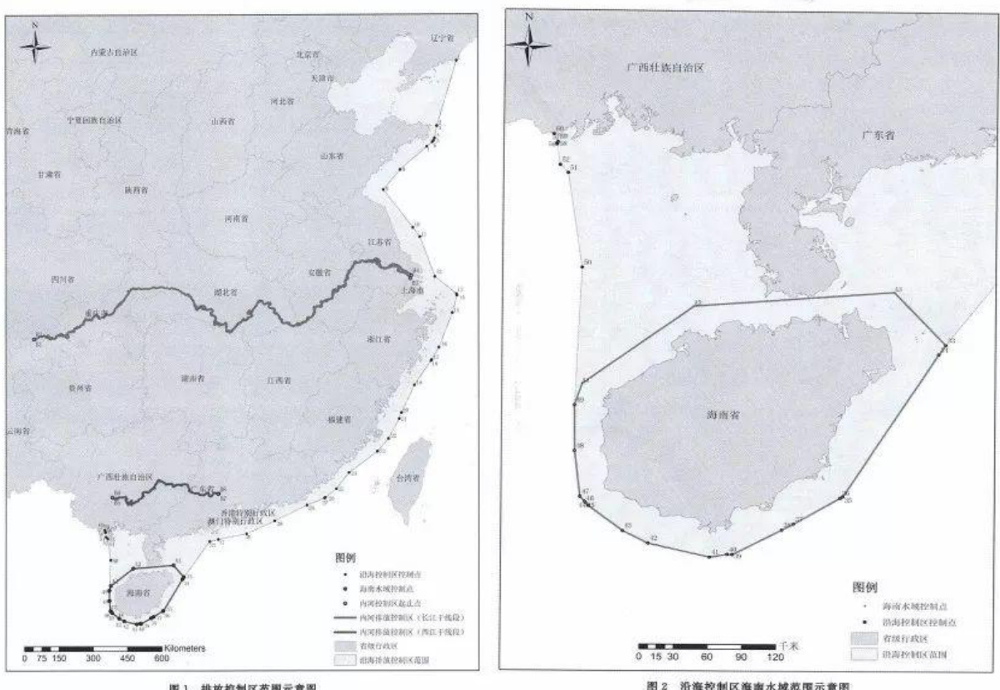  
  
图 1 中国排放控制区范围示意图 图 2 沿海控制区海南水域范围示意图  

# 第 8 章 控制船舶有害防污底系统污染规定  

# 第 1 节 一般规定  

# 8.1.1 适用范围  

8.1.1.1 本章规定适用于所有国内航行船舶。  

# 8.1.2 定义  

8.1.2.1 本章有关定义如下：  

（1）船舶：系指在水域环境中营运的任何类型的船舶，包括水翼船、气垫船、潜水器和水上艇筏。  

（2）防污底系统：系指用于船舶控制或防止不利于生物附着的涂层、油漆、表面处理、表面或装置。  

# 8.1.3 防污底系统的控制  

8.1.3.1 自 2014 年 9 月 1 日起，所有船舶不应施涂或重新施涂含有作为生物杀虫剂的有机锡化合物的防污底系统。  

8.1.3.2 对于防污底系统中含有作为杀虫剂的有机锡化合物的在2014 年9 月1 日前建造的船舶，自 2014 年 9 月 1 日后的第一次计划坞修时，应满足下述要求：  

（1）在船壳上或外部构件或表面上不得含有此类化合物；或  

（2）应具有一封闭层，形成隔离以阻挡不符合要求的有害防污底系统中此类化合物的渗出。  