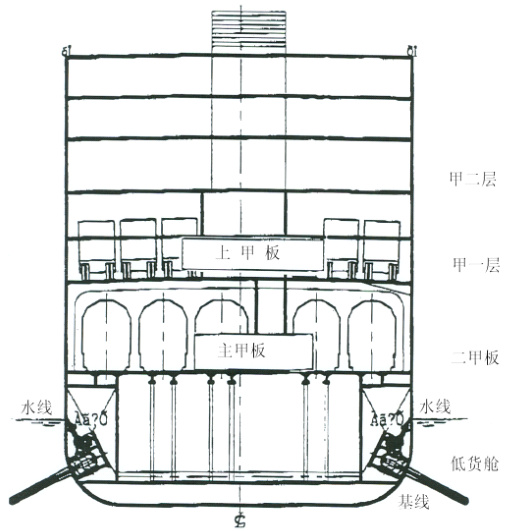
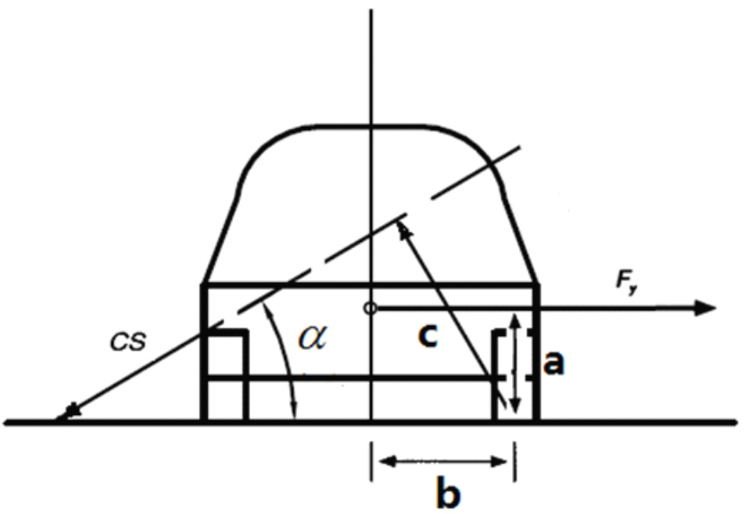
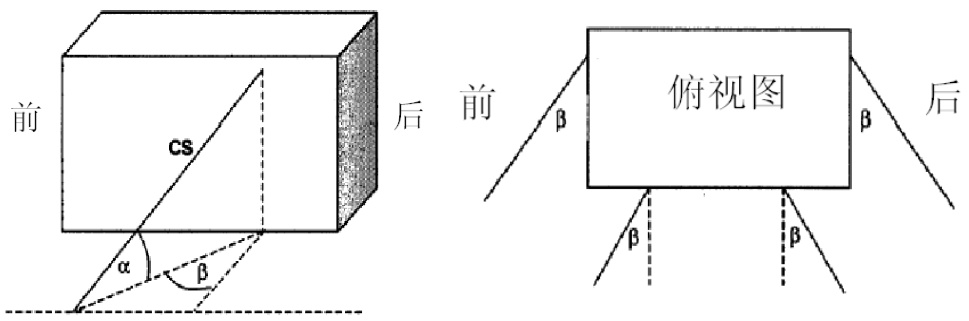

# 中华人民共和国海事局船舶与海上设施法定检验规则国内航行海船法定检验技术规则  

2020  

# 第 9 篇 客滚船附加安全要求  

# 目 录  

# 第 1 章 通 则. 9-1  

第 1 节 一般规定 .9-1  
第 2 节 定 义. .9-1  
第 3 节 车、客处所布置原则. 9-1  
第 4 节 装载车辆的处所类型. .9-1  
第 5 节 防倾和减摇措施. .9-2  
第 6 节 装载旅客列车的客滚船的月台及梯道布置.. . 9-2  
第 7 节 船舶安全操作和报警装置. 9-2  

# 第 2 章 检 验. 9-4  

第 1 节 一般规定. .9-4  
第 2 节 初次检验. .9-4  
第 3 节 年度检验及换证检验. 9-4  
第 3 章 载重线. 9-6  
第 1 节 一般规定 .9-6  
第 2 节 核定干舷的补充规定. 9-6  

# 第 4 章 船舶安全. 9-7  

第 1 节 一般规定 .9-7  
第 2 节 构造—分舱与稳性、机电设备. .9-7  
第 3 节 构造－防火、探火与灭火. .9-8  
第 4 节 救生设备.. ..9-17  
第 5 节 完整稳性. ..9-17  
第 6 节 无线电通信设备和航行设备.. .9-18  

# 第 5 章 车辆装载与系固. 9-19  

第 1 节 一般规定 .9-19  
第 2 节 系固布置. ..9-19  
第 3 节 车辆系固有效性评估. ...9-20  
第 4 节 系固设备的检验. ..9-21  
附录 车辆系固装置有效性评估方法. .9-22  

# 第 6 章 乘客定额及舱室设备 9-29  

第 1 节 一般规定 9-29  

# 第 7 章 营运要求. .9-30  

第 1 节 一般规定 .9-30  
第 2 节 船舶安全和防污染操作程序手册.. 9-30  

# 第 1 章 通 则  

# 第 1 节 一般规定  

1.1.1 除另有规定外，本篇适用于国内航行的客滚船。  
1.1.2 除另有规定外，本篇不适用于高速客滚船。  
1.1.3 客滚船的等级按本法规第 4 篇第 1 章第 3 节客船等级核定。  
1.1.4 客滚船除应符合本篇要求外，尚应符合本法规其他各篇对客船的适用要求。  

# 第2 节 定 义  

1.2.1 本篇有关定义如下：  

（1）客滚船：系指具有本法规第 4 篇第 2-2 章 2-2.1.2 所定义的滚装处所或下述（2）所定义的特种处所的客船。  

（2）特种处所：系指在舱壁甲板以上或以下用作装载在油箱内备有自用燃油的机动车辆的围蔽处所，此处所能让上述车辆驾驶进出，并设有乘客进出通道。若用于停放车辆的总净高度不超过 $10\mathrm m$ ，则一个水平区可以包括多于一层甲板的若干特种处所。  

# 第3 节 车、客处所布置原则  

1.3.1 客滚船的布置应使乘客在紧急情况下能迅速撤离至救生艇筏的登乘甲板或集合站。  

1.3.2 除非采取本篇第 4 章第 3 节规定的防火保护措施，否则起居处所、服务处所、救生艇筏的集合地点与登乘地点或撤离站不应与特种处所或滚装处所或用作滚装处所的露天甲板布置在同一层甲板上。  

1.3.3 救生艇筏的集合地点与登乘地点或撤离站①，一般应设置在起居处所和服务处所的露天甲板上，若实际布置有困难而只能设置在露天甲板的滚装处所时，则应设有从起居处所和服务处所至登乘地点或撤离站的钢质的连续遮蔽的外部脱险通道。  

1.3.4 船上脱险通道的设计和布置应满足本篇第 4 章 4.3.6 的要求。  

# 第 4 节 装载车辆的处所类型  

1.4.1 Ⅰ级客滚船，舱壁甲板上及舱壁甲板以下的装载车辆的处所应符合对闭式滚装处所或特种处所的规定；舱壁甲板以上甲板上的装载车辆的处所应符合开式或闭式滚装处所的规定。  

1.4.2 除本节 1.4.3 另有规定外，II、III 级客滚船，舱壁甲板以下的装载车辆的处所应符合对闭式滚装处所或特种处所的规定；舱壁甲板上的装载车辆的处所应符合开式或闭式滚装处所的规定，舱壁甲板以上的装载车辆的甲板处所可为开式滚装处所/露天甲板。  

1.4.3 航行于遮蔽航区的 III 级客滚船和珠江口以南的沿海航区 III 级客滚船，如全船仅设一层车辆甲板，则该装载车辆的甲板可为露天甲板。  

# 第 5 节 防倾和减摇措施  

1.5.1 为改善船舶在波浪中的摇摆性能和舒适性，可在Ⅰ级客滚船设置减摇装置。  
1.5.2 为提高船舶装卸车辆时的抗倾能力，可在装载铁路车辆的客滚船设置防倾装置。  

# 第6 节 装载旅客列车的客滚船的月台及梯道布置  

1.6.1 如果装载铁路车辆的客滚船设计为可装载旅客列车，则旅客列车所在的处所应设有月台，月台平面应与列车车厢地板在同一平面，仅面向 1 列列车的月台宽度应不小于 $900\mathrm{mm}$ ，两面均面向列车的月台宽度应不小于 $1800\mathrm{mm}$ 。  

1.6.2 除另有规定外，月台通向上层乘客处所的梯道位置应与列车车门相对应，梯道应作为脱险通道，并符合本篇第 4 章 4.3.6 的规定。此外：  

（1）乘客处所通向上述梯道平台的门口应标有明显告示：“此门在船舶航行时保持关闭，禁止乘客进入列车舱”。  

（2）包括月台、梯道出口在内的通道全线除应设应急照明外，还应设有符合本篇第 4 章 4.2.3要求的附加应急照明。  

# 第 7 节 船舶安全操作和报警装置  

1.7.1 为保障船舶航行安全，船上人员应切实遵照《船舶安全和防污染操作程序手册》、《应变部署表》和《训练手册》的规定，做好安全设备的维护保养，定期演习，合理装载，并在航行时注意气象、海况，随时掌握船内状况，做到遵章操作，谨慎驾驶。  

1.7.2 载运旅客列车的客滚船，船舶开航前，船上公共广播系统应与客列广播系统相接，以便将安全须知告知车厢内乘客。  

1.7.3 车辆（包括公路车辆和铁路车辆）应符合船舶设计对车辆长度、宽度、装载货物的重量、轴载荷及重心高度的限定。  

1.7.4 开启或未适当紧固会导致特种处所或滚装处所浸水的所有舷门、装货门和其他关闭设备应在驾驶室配备指示器。若这些门未完全关闭，或任一紧固装置未到位或完全锁好，该指示器应以听觉和视觉警报显示。在驾驶室的指示器面板上应设有“在港/航行中”这样的模式选择功能，以便当船离港时，若首门、内门、尾坡道或任何其他舷门未关闭和任何关闭装置未处于正确位置，则在驾驶室发出声响警报。  

1.7.5 应装备电视监视与水渗漏检测系统，使之能将可能通过内、外首门，尾门或任何其他舷门导致特种处所或滚装处所浸水的任何渗漏信息反馈给驾驶室与机器控制站。  

1.7.6 应采取电视监视之类的有效措施在航行途中不断地巡视或监控特种处所与滚装处所，以便探知在恶劣天气条件下任何车辆的移动和未经允许而进入这些处所的乘客以及可能的火灾，并监控船舶在港装卸车辆和上下乘客的正常进行。  

1.7.7 对Ⅲ级客滚船，如该船仅设一层车辆甲板且该甲板为开式滚装处所/露天甲板，上述1.7.4 至 1.7.6 的要求可用以下规定替代：  

（1）设置对装载车辆的处所进行监控的电视监视装置，和；（2）在驾驶室设置首、尾门未关闭或未处于正确关闭位置听觉报警装置  

1.7.8 除船上工作必要外，从车辆甲板和车辆坡道通向舱壁甲板以下处所的所有通道，在船舶开航前应予关闭并保持关闭到抵达下一个停泊地。船长应确保对这些水密门和通道的关闭和开启进行有效的监督，并将每次关闭时间记录在航海日志中。  

1.7.9 所有被认为能有效地限制聚积于车辆甲板上的海水流动的横舱壁或纵舱壁在船舶开航前应固定到位，直到抵达下一个停泊地。  

# 第 2 章 检 验  

# 第 1 节 一般规定  

客滚船的检验与发证应按本法规第 1 篇第 2 章对客船的规定实施。2.1.2 对客滚船的检验还应符合本章的规定。  

# 第 2 节 初次检验  

2.2.1 客滚船的初次检验应按本法规第 1 篇第8 章第 2 节进行。  

2.2.2 送审的图纸资料尚应增加以下项目：  

（1）系固设备配备和布置图；（2）车辆和货物系固手册；（3）全船密性分隔布置图；（4）滚装处所或特种处所排水系统布置图；（5）撤离分析计算书；（6）全船电视监视装置、首门、内门、尾坡道及任何其他舷门关闭装置、指示器及警报装置、  
水渗漏检测系统的系统说明书/系统图及布置图。2.2.3 在建造期间和安装之后的检验应按本法规第 1 篇第 8 章第 2 节进行，检验还应包括下  
列项目，并符合 2.2.2 所列图纸要求：（1）确认车辆系固装置的配备及功能；（2）确认首、尾等门关闭的有效性及其监视报警装置；（3）确认特种处所和滚装处所的排水系统和排水口防堵措施；（4）确认 AIS 的配备和试验；（5）确认滚装处所或特种处所电缆的耐火特性及敷设情况；（6）确认防倾系统和减摇装置（如设有）的试验和功能；（7）确认电视监视装置和水渗漏检测系统的有效性；（8）确认船上公共广播系统与旅客列车广播系统（如适用）连接的有效性。  

# 第 3 节 年度检验及换证检验  

2.3.1 客滚船的年度检验应按本法规第 1 篇第8 章第 3 节进行，并增加以下项目：  

（1）检查车辆系固装置；  
（2）检查首、尾门和舷门的关闭装置及其监视装置；  
（3）检查滚装处所和特种处所排水系统及其排水口防堵措施，确认其工作正常和有效；  
（4）检查 AIS 设备，确认其工作正常；  
（5）检查滚装处所或特种处所电缆的完整性；  
（6）检查防倾系统和减摇装置（如设有），确认其工作正常；  
（7）检查船上公共广播系统与旅客列车广播系统（如适用）的连接，确认其工作正常。  

2.3.2 客滚船的换证检验应按本法规第 1 篇第8 章第 4 节进行。  

# 第 3 章 载重线  

# 第 1 节 一般规定  

3.1.1 客滚船应按本法规第 3 篇规定和本章的补充规定勘划载重线。  

# 第 2 节 核定干舷的补充规定  

3.2.1 船舶车辆甲板上的泄水孔、排水孔的设计和布置除应符合第 3 篇第 2 章 2.2.11 的要求外，还应符合本篇第 4 章 4.3.9.2（5）和 4.3.9.5（1） $\textcircled{4}$ 的要求。  

3.2.2 为提高干舷甲板及以上甲板上的装载车辆处所的泄水效率，可在符合第 3 篇第 2 章2.2.11.1 要求的甲板室或上层建筑外侧设有符合本章 3.2.1 要求的排水口，但应设有风雨密关闭装置且其结构应与舷侧保持同等的强度。对在干舷甲板上由舷墙结构包围的开式滚装处所，则不必在舷墙的排水口或排水舷口设置风雨密关闭装置。  

3.2.3 对设有罩壳式或边铰链式首门的Ⅰ级客滚船，还应设置构成防撞舱壁部分的风雨密内门，且在门的后面装设固定的密封支持装置。  

# 第 4 章 船舶安全  

# 第 1 节 一般规定  

4.1.1 客滚船应符合本法规第4 篇第 2-1 章对客船的规定和本章的要求。  

# 第 2 节 构造—分舱与稳性、机电设备  

# 4.2.1 破损稳性  

4.2.1.1 客滚船的分舱与稳性应符合本法规第 4 篇第 2-1 章对客船的规定及本节的要求。  

4.2.1.2 按确定性方法计算破损稳性时，特种处所/滚装处所的渗透率按 0.9 计取。  

4.2.1.3 计算破损稳性时，车辆及其所载货物的重心高度按以下规定组合计算：  

（1）空车重心高度（假定油箱内装满燃油）按车辆设计资料确定  

（2）载货物重心高度取车辆货厢底板以上限定载货高度的 1/2 处。  

4.2.1.4 客滚船的破损预防和控制应符合本篇第 1 章 1.7.4 至 1.7.7 的规定。  

4.2.1.5 客滚船船体和上层建筑的完整性应满足以下规定：  

（1）除非根据本条（2）和（3）的规定，所有通向舱壁甲板以下处所的通道口的最低点至少应高出舱壁甲板2.5 米。  

（2）在设有通向舱壁甲板以下处所的车辆坡道的情况下，坡道开口关闭时应能保持风雨密，以防止下层处所进水，并在驾驶室设有报警与指示装置；  

（3）可以允许为船上工作需要（如机器与物料的搬运）设置通向舱壁甲板以下处所的特别通道，但该通道应为水密，并在驾驶室设有报警和指示。  

# 4.2.2 舱底排水设备  

4.2.2.1 客滚船的舱底排水设备应符合本法规第 4 篇第 2-1 章 2-1.2.4 对客船的要求。  

4.2.3 附加应急照明  

4.2.3.1 附加应急照明应符合本法规第 4 篇第 2-1 章 2-1.3.4.3 的规定。  

4.2.4 滚装处所或特种处所的电缆  

4.2.4.1 滚装处所或特种处所的电缆走向应避免遭受机械损伤，如不可避免，应采取防止机械损伤的措施。例如：加金属覆板或穿管敷设。  

4.2.4.2 在滚装处所或特种处所失火的情况下需继续工作的设备的电缆，包括其供电电缆，应采用耐火电缆或采用其他等效的防火措施。这类电缆至少应包括下列安全设备的供电电缆和控制电缆：  

（1）通用紧急报警系统；  

（2）探火和失火报警系统；  

（3）灭火系统和灭火剂施放报警系统；  

（4）公共广播系统；  

（5）指挥电话；  

（6）动力操作防火门的控制和动力系统以及所有防火门的状态指示系统；  

（7）动力操作水密门的控制和动力系统以及它们的状态指示系统；  

（8）应急照明；  

（9）低位照明系统；  
（10）有线电视监视系统；  
（11）舵机系统；  
（12）应急消防泵；  
（13）电力推进电路。  

# 第 3 节 构造－防火、探火与灭火  

# 4.3.1 一般规定  

4.3.1.1 客滚船的构造－防火、探火与灭火除应满足本法规第 4 篇第2-2 章各相应级别客船的要求外，还应满足本节的规定。  

4.3.1.2 Ⅰ级客滚船的构造－防火、探火与灭火还应满足本节的规定如下：  

（1）本章 4.3.1.4；  

（2）客滚船的起居处所、服务处所和储物舱一般不应位于滚装甲板，但若实际布置需要位于车辆甲板时，该处所面向滚装处所的限界面应至少为 A-60 级；  

（3）本章 4.3.6.3；  
（4）本章 4.3.9.2 的（5）、（6）和（7）；  
（5）本章 4.3.9.5（1）的 $\textcircled{2}$ （e）、（f）和 $\textcircled{5}$ 。  

4.3.1.3 下列载客人数的客滚船应满足高一级别的相应要求：  

（1）载客 500 人及以上的 II 级客滚船应满足 I 级客滚船的相应要求（2）载客 500 人及以上的 III 级客滚船应满足 II 级客滚船的相应要求；（3）载客 1000 人及以上的 III 级客滚船应满足 I 级客滚船的相应要求。  

4.3.1.4 任何级别的客滚船，若在开敞或露天甲板以及开式滚装处所上设有救生艇/筏（抛投式救生筏除外）和撤离装置等布置，则在船舶纵倾至 $10^{\circ}$ 范围内该布置的下方侧壁不应设置固定开口，但本法规第4 篇第 2-2 章 2-2.2.9.3 所要求的窗和舷窗除外。  

4.3.1.5 载有旅客列车的火车渡船，其公共广播系统的配置除应满足本法规第 4 篇第 2-2 章2-2.2.12.1 的要求外，还应与所载客列的广播系统相协调。  

# 4.3.2 压力水雾灭火系统  

4.3.2.1 特种处所的压力水雾灭火系统应符合本法规第 4 篇第 2-2 章 2-2.1.9.1 和 2-2.1.9.3 的规定。  

# 4.3.3 通风  

4.3.3.1 客滚船有关对特种处所通风导管的要求应满足本法规第 4 篇第 2-2 章 2-2.1.16.3 和2-2.1.16.4 对机器处所、厨房、车辆处所和滚装处所的要求。  

# 4.3.4 车辆甲板的结构保护  

4.3.4.1 客滚船的起居处所、服务处所和储物舱一般不应位于车辆甲板，但若实际布置需要位于车辆甲板时，限界面应满足本章4.3.5 和 4.3.9 的要求。  

4.3.4.2 若船上设有特种处所，则任何这种处所应符合本章4.3.9 的相应规定，且当此规定与本章的其他要求有矛盾时应以本章 4.3.9 的要求为准。  

# 4.3.5 舱壁与甲板的耐火完整性  

4.3.5.1 除应符合本章其他条文关于舱壁及甲板耐火完整性的明确规定外，舱壁和甲板应分别满足下列各表所示的最低耐火完整性要求。若某一处所因其用途的特殊性在按规定进行分类存在疑问时，则此处所应按有关类别中具有最严格的限界面要求的处所来处理。  

4.3.5.2 下列要求应作为运用下列各表的原则：  

（1）为了确定相邻处所限界面的耐火完整性标准，这些处所按其失火危险程度分为下列 $\textcircled{1}$ 至$\textcircled{1}$ 类。处所内小的围闭舱室，若其与处所相通的开口小于 $30\%$ ，应按单独一个处所考虑。这种较小舱室的限界面舱壁和甲板的耐火完整性应满足各表的规定。每一类别的名称只是典型举例，而不是限制性的。每类前面括号内的数字是指表内相应的列或行。  

$\textcircled{1}$ 控制站设有应急电源和应急照明电源的处所。驾驶室和海图室。设有船舶无线电设备的处所。消防控制站。位于推进机械处所外面的推进机械控制室。设有集中失火报警设备的处所。  
$\textcircled{2}$ 走廊乘客及船员用的走廊和门厅。  
$\textcircled{3}$ 起居处所本法规第 4 篇第 2-2 章 2-2.1.2 所定义的处所，不包括走廊。更衣室。  
$\textcircled{4}$ 梯道乘客和船员用的内部梯道、升降机、完全封闭的紧急脱险围阱、自动扶梯(完全设在机器处所内者除外)，以及通往上述处所等的环围；至于仅环围于一层甲板的梯道，应被视为未被防火门隔开的处所的一部分。  
$\textcircled{5}$ 较小失火危险的服务处所不储存易燃性液体且面积小于 $4\mathrm{m}^{2}$ 的小间和储物间。干衣室和洗衣间。用不燃材料作为隔热保温层的食品储藏或冷冻室。面积小于 $4\mathrm{m}^{2}$ 的船员更衣室（当工作服粘有油类时且储藏于该处所)。  
$\textcircled{6}$ A 类机器处所本法规第 4 篇第 2-2 章 2-2.1.2 定义的处所。  
$\textcircled{7}$ 其它机器处所电器设备间(自动电话交换机室、空调管道处所)。除 A 类机器处所外，本法规第 4 篇第 2-2 章 2-2.1.2 定义的各处所。  
$\textcircled{8}$ 装货处所包括开式滚装处所在内的所有用于装运货物的处所以及通往这些处所的围阱通道和舱口，特种处所除外。  
$\textcircled{9}$ 较大失火危险的服务处所厨房、设有烹调设备的配膳室、油漆间和灯具间、面积为 $4\mathrm m^{2}$ 及以上的小间和储物间、储存易燃液体的处所、桑拿房和不构成机器处所部分的工作间。用可燃材料作为隔热保温层的食品储藏或冷冻室。邮件室。  
面积为 $4\mathrm{m}^{2}$ 及以上的船员更衣室（当工作服粘有油类时且储藏于该处所)。  
氧气或乙炔储存室。  

$\textcircled{10}$ 开敞甲板开敞甲板处所和极少或没有失火危险的围闭游步甲板处所。如果将围闭游步甲板处所归为此类，围闭的游步甲板应不会出现大的失火危险，且其内只应设有甲板家具。此外，此类处所还应通过固定开口进行自然通风。露天处所(上层建筑和甲板室外面的处所)。  

$\textcircled{1}$ 特种处所和闭式滚装处所本篇第 1 章 1.2.1 和本法规第 4 篇第 2-2 章 2-2.1.2 定义的处所。  

（2）凡未设有符合本法规第 4 篇第 2-2 章 2-2.1.11 规定的自动喷水器系统的某一主竖区或水平区内的两个处所之间的限界面，或两个均无此种自动喷水器系统保护的主竖区或水平区之间的限界面，当运用表 4.3.5.4a 和表 4.3.5.4b 确定其所适用的耐火完整性标准时，应采用表列两个等级中的较高值。  

（3）凡设有符合本法规第 4 篇第2-2 章 2-2.1.11 规定的自动喷水器系统的某一主竖区或水平区内的两个处所之间的限界面，或两个均有此种自动喷水器系统保护的主竖区或水平区之间的限界面，当运用表4.3.5.4a 和表 4.3.5.4b 确定其所适用的耐火完整性标准时，应采用表列两个等级中的较低值。当一个装有喷水器系统区域和一个未装有喷水器系统区域在起居处所及服务处所内相接时，此两区域之间的分隔应采用表 4.3.5.4a 和表 4.3.5.4b 所列两个等级中的较高值。  

（4）连续“B”级天花板或衬板连同有关的甲板和舱壁，可以认为全部或部分地起到分隔所要求的隔热性和完整性的作用。  

4.3.5.3 II 级客滚船应满足表 4.3.5.3a 和表 4.3.5.3b 的要求。  

分隔相邻处所舱壁的耐火完整性  
表 4.3.5.3a  

<html><body><table><tr><td>处</td><td>所</td><td>①</td><td>②</td><td>?</td><td>④</td><td></td><td></td><td></td><td></td><td>9</td><td></td><td></td></tr><tr><td>控制站</td><td></td><td>A-0c</td><td>A-0</td><td>A-60</td><td>A-0</td><td>A-15</td><td>A-60</td><td>A-15</td><td>A-60</td><td>A-60</td><td>*</td><td>A-60</td></tr><tr><td>走廊</td><td>②</td><td></td><td>Ce</td><td>B-0e</td><td>A-0a B-0e</td><td>B-0e</td><td>A-60</td><td>A-0</td><td>A-0</td><td>A-0</td><td>*</td><td>A-30</td></tr><tr><td>起居处所</td><td></td><td></td><td></td><td>Ce</td><td>A-0 a B-0 e</td><td>B-0e</td><td>A-60</td><td>A-0</td><td>A-0</td><td>A-0</td><td>*</td><td>A-15</td></tr><tr><td>梯道</td><td>④</td><td></td><td></td><td></td><td>A-0a B-0e</td><td>A-0a B-0e</td><td>A-60</td><td>A-0</td><td>A-0</td><td>A-0</td><td>*</td><td>A-30</td></tr><tr><td>较小失火危险的服务处所③</td><td></td><td></td><td></td><td></td><td></td><td>Ce</td><td>A-60</td><td>A-0</td><td>A-0</td><td>A-0</td><td>*</td><td>A-0</td></tr><tr><td>A类机器处所</td><td></td><td></td><td></td><td></td><td></td><td></td><td>*</td><td>A-0</td><td>A-0 A-60g</td><td>A-60</td><td>*</td><td>A-60</td></tr><tr><td>其它机器处所 装货处所(包括开式滚装处所)</td><td></td><td></td><td></td><td></td><td></td><td></td><td></td><td>A-0b</td><td>A-0</td><td>A-0</td><td>*</td><td>A-0</td></tr><tr><td></td><td></td><td></td><td></td><td></td><td></td><td></td><td></td><td></td><td>*</td><td>A-0</td><td>*</td><td>A-0</td></tr><tr><td>较大失火危险的服务处所 @</td><td></td><td></td><td></td><td></td><td></td><td></td><td></td><td></td><td></td><td>A-0b</td><td>*</td><td>A-30</td></tr><tr><td>开甲板</td><td></td><td></td><td></td><td></td><td></td><td></td><td></td><td></td><td></td><td></td><td></td><td>A-0</td></tr><tr><td>特种处所和闭式滚装处所 ①</td><td></td><td></td><td></td><td></td><td></td><td></td><td></td><td></td><td></td><td></td><td></td><td>A-30</td></tr></table></body></html>  

分隔相邻处所甲板的耐火完整性  

<html><body><table><tr><td>甲板上处所</td><td rowspan="2">①</td><td rowspan="2">②</td><td rowspan="2">?</td><td rowspan="2">④</td><td rowspan="2"></td><td rowspan="2"></td><td rowspan="2"></td><td rowspan="2"></td><td rowspan="2"></td><td rowspan="2">#</td><td rowspan="2"></td></tr><tr><td>甲板下处所</td></tr><tr><td>控制站</td><td>A-0</td><td>A-0</td><td>A-0</td><td>A-0</td><td>A-0</td><td>A-60</td><td>A-0</td><td>A-0</td><td>A-0</td><td>*</td><td>A-60</td></tr><tr><td>走廊 ②</td><td>A-0</td><td>*</td><td>*</td><td>A-0</td><td>*</td><td>A-60</td><td>A-0</td><td>A-0</td><td>A-0</td><td>*</td><td>A-30</td></tr><tr><td>起居处所</td><td>A-60</td><td>A-0</td><td>*</td><td>A-0</td><td>*</td><td>A-60</td><td>A-0</td><td>A-0</td><td>A-0</td><td>*</td><td>A-15</td></tr><tr><td>梯道 ④</td><td>A-0</td><td>A-0</td><td>A-0</td><td>*</td><td>A-0</td><td>A-60</td><td>A-0</td><td>A-0</td><td>A-0</td><td>*</td><td>A-30</td></tr><tr><td>较小失火危险的服务处所 5</td><td>A-15</td><td>A-0</td><td>A-0</td><td>A-0</td><td>*</td><td>A-60</td><td>A-0</td><td>A-0</td><td>A-0</td><td>*</td><td>A-0</td></tr><tr><td>A类机器处所 ?</td><td>A-60</td><td>A-60</td><td>A-60</td><td>A-60</td><td>A-60</td><td>*</td><td>A-60f</td><td>A-30 A-60g</td><td>A-60</td><td>*</td><td>A-60</td></tr><tr><td>其它机器处所</td><td>A-15</td><td>A-0</td><td>A-0</td><td>A-0</td><td>A-0</td><td>A-0</td><td>*</td><td>A-0</td><td>A-0</td><td>*</td><td>A-0</td></tr><tr><td>装货处所(包括开式滚装所)③</td><td>A-60</td><td>A-0</td><td>A-0</td><td>A-0</td><td>A-0</td><td>A-0 A-60g</td><td>A-0</td><td>*</td><td>A-0</td><td>*</td><td>A-0</td></tr><tr><td>较大失火危险的服务处所 9</td><td>A-60</td><td>A-0</td><td>A-0</td><td>A-0</td><td>A-0</td><td>A-60</td><td>A-0</td><td>A-0</td><td>A-0</td><td>*</td><td>A-30</td></tr><tr><td>开甲板 #</td><td>*</td><td>*</td><td>*</td><td>*</td><td>*</td><td>*</td><td>*</td><td>*</td><td>*</td><td>*</td><td>A-0</td></tr><tr><td>特种处所和闭式滚装处所①</td><td>A-60</td><td>A-30</td><td>A-15</td><td>A-30</td><td>A-0</td><td>A-60</td><td>A-0</td><td>A-0</td><td>A-30</td><td>A-0</td><td>A-30</td></tr></table></body></html>  

注：适用于表 4.3.5.3a 和表 4.3.5.3b  

a 具体适用哪一等级，参见本法规第 4 篇第 2-2 章 2-2.2.3 和 2-2.2.6。  
b 当相邻处所为同一数字类别且右上角注有 b 时，只有不同用途的相邻处所之间才要求表中所列等级的舱壁或甲板(例如第 $\textcircled{9}$ 类)。在两个厨房之间不要求用舱壁分隔，但油漆间和厨房之间要求用 A-0 级舱壁分隔。  
c 分隔驾驶室和海图室的舱壁可以为 B-0 级。  
e 当该分隔为主竖区或水平区的限界面时,表 4.3.5.3a 中的 B-0 和 C 级应为A-0 级。  
f 若第 $\textcircled{7}$ 类机器处所被确认为极少或没有失火危险，则不必设置防火隔热层。  

g 当该处所为开式滚装处所时适用。  

\*表中的\*号是指该分隔要求用钢或其它等效材料建造，但不要求为 A 级标准。然而，除第 $\textcircled{10}$ 类处所以外，如果甲板被贯穿以布置电缆、管线和通风管道通过，应对贯穿件处进行密封，防止火焰和烟气通过。除非安装了固定式气体灭火系统，控制站(应急发电机室)和开敞甲板间的分隔可以设有不带关闭装置的空气进口开口。  

当该分隔为水平区的限界面时，表4.3.5.3a 中的\*号应被视为 A-0 级，第 $\textcircled{8}$ 和 $\textcircled{10}$ 类除外。  

对限界面的材料或完整性不作特殊要求。  

4.3.5.4 III 级客滚船应满足表 4.3.5.4a 和表 4.3.5.4b 的要求。  

表 4.3.5.3b  
分隔相邻处所舱壁的耐火完整性  
表 4.3.5.4a  

<html><body><table><tr><td>处</td><td>所</td><td>①</td><td>②</td><td></td><td>④</td><td></td><td>?</td><td></td><td></td><td></td><td>#</td><td></td></tr><tr><td>控制站</td><td></td><td>A-0 c</td><td>A-0</td><td>A-15</td><td>A-0</td><td>A-15</td><td>A-305s</td><td>A-15</td><td>A-30</td><td>A-30</td><td>*</td><td>A-30</td></tr><tr><td>走廊</td><td>②</td><td></td><td>C</td><td>B-0</td><td>A-0a B-0</td><td>B-0</td><td>A-30P A-15</td><td>A-0</td><td>A-0</td><td>A-15 A-0 d</td><td>*</td><td>A-15 A-0 d</td></tr><tr><td>起居处所</td><td>?</td><td></td><td></td><td>C</td><td>A-0</td><td>B-0</td><td>A-3053</td><td>A-0</td><td>A-0</td><td>A-15s</td><td>*</td><td>A-15</td></tr><tr><td>梯道</td><td>④</td><td></td><td></td><td></td><td>A-0a</td><td>A-0a</td><td>A-30P A-15</td><td>A-0</td><td>A-0</td><td>A-15 A-0 d</td><td>*</td><td>A-15 A-0 d</td></tr><tr><td>较小失火危险的服务处所</td><td></td><td></td><td></td><td></td><td></td><td>C</td><td>A-0</td><td>*</td><td>*</td><td>A-0</td><td>*</td><td>A-0</td></tr><tr><td>A类机器处所</td><td></td><td></td><td></td><td></td><td></td><td></td><td>*</td><td>A-0</td><td>A-0 A-30g</td><td>A-30</td><td>*</td><td>A-30</td></tr><tr><td>其它机器处所</td><td></td><td></td><td></td><td></td><td></td><td></td><td></td><td>*</td><td>*</td><td>A-0</td><td>*</td><td>A-0</td></tr></table></body></html>  

<html><body><table><tr><td>处</td><td>所</td><td>①</td><td>②</td><td></td><td>④</td><td></td><td>?</td><td></td><td></td><td></td><td>#</td><td></td></tr><tr><td>装货处所(包括开式滚装处所)③</td><td></td><td></td><td></td><td></td><td></td><td></td><td></td><td></td><td>*</td><td>*</td><td>*</td><td>A-0</td></tr><tr><td>较大失火危险的服务处所</td><td></td><td></td><td></td><td></td><td></td><td></td><td></td><td></td><td></td><td>*k</td><td>*</td><td>A-15</td></tr><tr><td>开甲板</td><td>#</td><td></td><td></td><td></td><td></td><td></td><td></td><td></td><td></td><td></td><td>一</td><td>A-0</td></tr><tr><td>特种处所和闭式滚装处所</td><td>①</td><td></td><td></td><td></td><td></td><td></td><td></td><td></td><td></td><td></td><td></td><td>A-0</td></tr></table></body></html>  

分隔相邻处所甲板的耐火完整性  
表 4.3.5.4b  

<html><body><table><tr><td>甲板上处所→</td><td rowspan="2">①</td><td rowspan="2">②</td><td rowspan="2">?</td><td rowspan="2">④</td><td rowspan="2"></td><td rowspan="2">?</td><td rowspan="2"></td><td rowspan="2"></td><td rowspan="2"></td><td rowspan="2">#</td><td rowspan="2"></td></tr><tr><td>甲板下处所↓</td></tr><tr><td>控制站 ①</td><td>A-0</td><td>A-0</td><td>A-0</td><td>A-0</td><td>A-0</td><td>A-30P A-15</td><td>A-0</td><td>A-0</td><td>A-0 *</td><td>A-15</td></tr><tr><td>走廊 ②</td><td>A-0</td><td>*</td><td>*</td><td>A-0</td><td>*</td><td>A-30P A-15</td><td>A-0</td><td>A-0</td><td>A-0 *</td><td>A-15 A-0 d</td></tr><tr><td>起居处所 ?</td><td>A-15</td><td>A-0</td><td>*</td><td>A-0</td><td>*</td><td>A-30P A-15</td><td>A-0</td><td>A-0</td><td>A-0 *</td><td>A-15 A-0d</td></tr><tr><td>梯道 ④</td><td>A-0</td><td>A-0</td><td>A-0</td><td>*</td><td>A-0</td><td>A-30P A-15</td><td>A-0</td><td>A-0</td><td>A-0 *</td><td>A-15 A-0 d</td></tr><tr><td>较小失火危险的服务处所</td><td>A-15</td><td>A-0</td><td>A-0</td><td>A-0</td><td>*</td><td>A-15</td><td>A-0</td><td>A-0</td><td>A-0 *</td><td>A-0</td></tr><tr><td>A类机器处所</td><td>A-15 A-30p</td><td>A-30P A-15</td><td>A-30P A-15</td><td>A-30P A-15</td><td>A-15</td><td>*</td><td>A-0</td><td>A-15 A-30g</td><td>A-30 *</td><td>A-30</td></tr><tr><td>其它机器处所</td><td>A-15</td><td>A-0</td><td>A-0</td><td>A-0</td><td>A-0</td><td>A-0</td><td>*</td><td>A-0</td><td>A-0 *</td><td>A-0</td></tr><tr><td>装货处所(包括开式滚装处所)③</td><td>A-30</td><td>A-0</td><td>A-0</td><td>A-0</td><td>A-0</td><td>A-0 A-30g</td><td>A-0</td><td>*</td><td>A-0 *</td><td>A-0</td></tr><tr><td>较大失火危险的服务处所</td><td>A-30</td><td>A-15 A-0 d</td><td>A-15 A-0 d</td><td>A-15 A-0 d</td><td>A-0</td><td>A-15P A-0</td><td>A-0</td><td>A-0</td><td>* *</td><td>A-15</td></tr><tr><td>开甲板 #</td><td>*</td><td>*</td><td>*</td><td>*</td><td>*</td><td>*</td><td>*</td><td>*</td><td>* *</td><td>A-0</td></tr><tr><td>特种处所和闭式滚装处所</td><td>A-30</td><td>A-1s</td><td>A-15</td><td>A-15</td><td>A-0</td><td>A-15</td><td>A-0</td><td>A-0</td><td>A-15 A-0</td><td>A-0</td></tr></table></body></html>  

注：适用于表 4.3.5.4a 和 $4.3.5.4\mathrm{b}$ 。  
a 具体适用哪一等级，参见本法规第 4 篇第 2-2 章 2-2.2.3 和 2-2.2.6。  
c 分隔驾驶室和海图室的舱壁可以为 B-0 级。  
d 参见本章 4.3.5.2(2)和(3)。  
g 当该处所为开式滚装处所时适用。  
k 只有不同用途的相邻处所才要求表列等级的舱壁和甲板。例如，在两厨房之间不要求有舱壁分隔，但油漆间和舱壁之间要有钢质或其他等效材料制成的舱壁。  
p 当用作主推进的内燃机的总输出功率大于 375kW 时的分隔等级。  
\*要求用钢质或其它等效材料制成，但不要求为 A 级标准。  
－ 对限界面的材料或完整性不作特殊要求。  

4.3.5.5 对于载客 100 人及以上的 II 级和 III 级客滚船，若位于滚装处所或特种处所上方的开敞甲板用作救生艇和救生筏的登乘区域时，该处所与相邻滚装处所和特种处所之间的甲板耐火分隔应至少为 A-30 级。  

4.3.5.6 对于载客 100 人及以上的 II 级和 III 级客滚船，若将露天甲板作为滚装处所载运车辆时，该处所前部或后部与相邻处所之间的舱壁耐火分隔应至少为A-30 级。  

# 4.3.6 脱险通道  

4.3.6.1 特种处所的脱险通道应满足下列要求：  

（1）舱壁甲板以上或以下的脱险通道的安全性一般应至少等效于本法规第 4 篇第2-2 章2-2.2.5.2（1）、（2）、（5）和（6）的规定。  

（2）船员经常使用的机器处所的脱险通道之一，应避免直接进入任何特种处所。  

4.3.6.2 通常有船员在内的滚装处所应设有 2 条脱险通道。包括装卸货期间，脱险通道应能够提供安全通向救生艇和救生筏登乘甲板的脱险，其最小净宽度为 $600\mathrm{mm}$ ，并位于该处所的首部和尾部。  

4.3.6.3 在特种处所和所载乘客能够进入的开式滚装处所，舱壁甲板以上和以下处所的脱险通道的数量和布置应满足本法规第 4 篇第2-2 章 2-2.2.5.2（1）和（2）的规定，且通向登乘甲板的通道安全性一般应等效于本法规第 4 篇第 2-2 章 2-2.2.5.2（1）、（2）、（5）和（6）的规定。此类处所还应在车辆甲板的横向设有数条通往脱险通道的宽度不小于 $600\mathrm{mm}$ 的专用过道，横向专用过道相互之间的间距不应超过 $40\mathrm{m}$ ；专用过道与两侧各设的宽度不小于 $600\mathrm{mm}$ 受保护的工作巡逻通道，组合在一起形成能够提供通往脱险通道的布置。上述专用过道和工作巡逻通道均应有明显标识。车辆的停放布置应使这些过道在任何时候都不受到阻碍。  

4.3.6.4 从船上每一通常有人的居住处所至集合站均应设有脱险通道。脱险通道的布置应能提供到达集合站的最直接通道，并标出国际海事组织（IMO）A.760（18）号决议《与救生设备和布置有关的符号》建议的识别符号。  

4.3.6.5 从舱室到梯道环围的脱险通道应尽可能笔直，尽可能少改变方向，且在船舶一舷的人应不必走到另一舷才能到达脱险通道。为了从任何乘客处所到达集合站或开敞甲板，不应向上或向下登两层以上甲板。  

4.3.6.6 应为上述 4.3.6.5 所述的开敞甲板提供一条通向救生艇、筏登乘站的外部脱险通道。  

4.3.6.7 若围蔽处所毗邻于开敞甲板时，围蔽处所开向开敞甲板的开口，在实际可行时可作为应急出口使用。  

4.3.6.8 脱险通道不应被家具和其他障碍物阻塞。除桌子和椅子可移到开敞处所外，公共处所内以及脱险通道沿线的橱、柜和其他重家具应原地紧固，以防止在船舶横摇或纵倾时发生移动。地板覆盖物亦应原地紧固。船舶航行时，脱险通道应保持通畅，其内不应有清洁车、寝具、行李和什物箱等障碍物。  

4.3.6.9 对各层甲板应编有序号，由最下层甲板或内底板数起为“1”。序号应显著地标示在楼梯平台和电梯门廊处。亦可以甲板命名，但甲板序号应与甲板名称一起标示。  

4.3.6.10 脱险通道的简明“小型”平面图应明显地张贴在每一舱室门的内侧和公共处所内。该图应显示脱险通道的方向并正确指明其在船上的方位。用“你在这儿”标出当前的位置，并用箭头标出。  

4.3.6.11 沿脱险通道的所有走廊内应设置栏杆或扶手，从而在通向集合站和登乘站通道内的每一台阶处都有牢固的扶手。该栏杆或扶手应设在宽度超过 $1.8\mathrm{m}$ 的纵向走廊和宽度超过 $\mathrm{1m}$ 的横向走廊的两侧。应特别注意能够穿过脱险通道沿线的大厅、天井和其他开敞处所。该栏杆或扶手的强度应能承受走廊或处所中心线方向 $750\mathrm{N/m}$ 的水平均布载荷以及 $750\mathrm{N/m}$ 的垂直向下的均布载荷。但这两种载荷无需同时施加。  

4.3.6.12 脱险通道沿线的舱壁和其他构成垂直分隔的舱壁的最下端 $0.5\mathrm{m}$ 区域应能承受$750\mathrm{N/m}$ 的载荷，从而在船舶处于大倾角状态时，允许在脱险通道的侧表面上通行。  

4.3.6.13 客滚船设计的早期，应按国际海事组织（IMO）MSC/Circ.1533 通函采取撤离分析对脱险通道进行评估。这种分析应能证实和消除弃船时由于乘客和船员沿着脱险通道正常移动，包括船员与乘客沿着通道相反方向移动可能造成的拥挤。此外，这种分析应证实当出现因事故引起一些脱险通道、集合站、登乘站或救生艇筏不能使用的情况时，脱险布置仍是足够富裕的。对载客100 人以下的III 级客滚船，脱险通道的布置能够满足本章 4.3.6 的相关要求，且 4.3.6.4 中所要求的脱险通道宽度至少 $600\mathrm{mm}$ ，可不要求撤离分析计算。  

4.3.7 起居处所与服务处所内梯道及电梯的保护  

4.3.7.1 Ⅱ级客滚船除满足本法规第 4 篇第 2-2 章 2-2.2.6.1 的要求外，还允许特种处所有直接通向梯道环围的出入口。  

# 4.3.8 A 级分隔上的开口  

4.3.8.1 Ⅱ级客滚船，除满足本法规第 4 篇第2-2 章 2-2.2.7.1 的要求外，还应满足以下要求：除装货处所之间、特种处所之间、储藏室之间与行李室之间的舱口以及这些处所与露天甲板之间的舱口外，一切开口均应设有永久附连于其上的关闭装置，其耐火效能至少应与其所在的分隔相等。  

# 4.3.9 特种处所和滚装处所的保护  

4.3.9.1 一般要求  

（1）本条规定的基本原则是，在特种处所和滚装处所内按常规设置的主竖区可能不切实际，那么在这类处所内根据水平区的概念，应设置有效的固定式灭火系统来提供等效的保护。根据这一概念，就本条而言，只要用于停放车辆的总体净高不超过 10 米，则一个水平区可以包括多于一层甲板的若干特种处所和滚装处所。  

（2）本法规第 4 篇第 2-2 章和本节中为了维持主竖区完整性而对通风系统、A 级分隔上的开口和A 级分隔上的贯穿件的要求应同等适用于构成水平区之间或水平区与船舶其它部分分隔限界面的甲板和舱壁。  

4.3.9.2 预防闭式滚装处所和特种处所内的易燃蒸气的引燃  

（1）通风系统  

$\textcircled{1}$ 通风系统的能力：应装设有效的通风系统，其能力至少足以达到以下换气次数：  

特种处所 每小时换气 10 次除特种处所以外的闭式滚装处所 每小时换气 6 次在装载或卸载车辆时，需适当提高换气次数。  

$\textcircled{2}$ 通风系统的性能：  

(a) 上述 $\textcircled{1}$ 所要求的动力通风系统应与其它通风系统分开，并且当该处所载有车辆时，通风系统应一直不间断工作。服务于此类装货处所的能有效封闭的通风导管应与每一此类处所分开。该系统应能从此类处所以外的位置进行控制。  

(b) 通风系统应能防止空气分层及形成气囊。  

$\textcircled{3}$ 通风系统的指示：驾驶台应设有显示所要求的通风能力任何损失的装置，这可以通过设一个报警来满足，它是靠风机的起动继电器的断开来触发的。  

$\textcircled{4}$ 关闭装置和导管：  

(a) 应设有考虑到天气和海况，在发生火灾时允许从处所外部快速关闭和有效封闭通风系统的装置。  
(b) 设在共同水平区内的通风导管，包括挡火闸应为钢质。通过其它水平区或机器处所的通风导管应为根据本法规第 4 篇第 2-2 章 2-2.1.16.3 建造的 A-60 级钢质导管。  

$\textcircled{5}$ 固定开口处所两侧、两端和舱顶天花板上的固定开口的位置应使滚装处所和特种处所内的火灾不会威胁到救生艇筏的存放区和登乘站以及装货处所上部的上层建筑和甲板室中的起居处所、服务处所和控制站。  

（2）电气设备和电缆  

$\textcircled{1}$ 除以下要求外，电气设备和电缆应为适合于在可爆炸的汽油和空气混合物中使用的型式。  
$\textcircled{2}$ 对于舱壁甲板以下特种处所以外的处所，尽管有上述 $\textcircled{1}$ 的规定，在甲板或每层车辆平台(如果设有的话)的 $450\mathrm{mm}$ 高度以上，应允许装设加以封闭并进行保护以防止火星外  

漏的电气设备作为一种替代方式，但开口尺寸足够使汽油气体向下渗透的平台除外。采取上述替代方式的条件是在船上有车辆时通风系统的设计和运转能够以每小时换气 10 次的速率对装货处所提供持续通风。  

$\textcircled{3}$ 本条要求的电气设备和电缆还应满足本章 4.2.4 的要求。  

（3）排气通风导管内的电气设备和电缆  

如果在排气通风导管内装有电气设备和电缆，这些电气设备和电缆应为经认可能在可爆炸性汽油和空气混合物中使用的型式，并且任何排气导管的出口，考虑到其它的引燃火源，应位于一个安全的位置。  

（4）其它引燃火源  

不允许使用可能构成易燃气体引燃火源的其它设备。  

（5）流水口和排水  

$\textcircled{1}$ 流水口不得通向机器处所或其它可能存在引燃火源的处所。  
$\textcircled{2}$ 甲板排水系统的布置应不造成两舷之间或一舷的水相互干扰，并能快速及时排除该处所的积水；应特别注意排水口（或吸口）的设计和布置，即应考虑有充分的流通面积和有防止被杂物堵塞或迅速疏堵的措施。  

（6）可燃材料的限制使用  

用于滚装处所和特种处所侧壁上的防撞护板以及甲板上的防滑涂层均应采用在高温下不致产生烟、毒性物质或爆炸危险的不燃材料。  

# （7）电梯围阱的保护  

若用于起居处所和服务处所的电梯穿过多层甲板且面向特种处所和滚装处所开门，则应满足以下要求：  

$\textcircled{1}$ 在任何情况下，电梯围阱内的通风机应保持一个最小正压 $25\mathrm{{Pa}}$ （风速接近 $3.5\mathrm{m/s}{\cdot}$ ）的通风，风机应不间断的工作且应至少满足特种处所和滚装处所装卸车辆时的换气次数。  
$\textcircled{2}$ 为证明特种处所和滚装处所内已经消除了易燃蒸气，应配备 1 套便携式可燃气体探测仪。  

4.3.9.3 探测和报警（1）固定式探火和失火报警系统  

除以下（3）规定的情况以外，应设有符合本法规第 4 篇第 2-2 章 2-2.1.12 要求的固定式探火和失火报警系统。固定式探火系统应能迅速探知火灾的出现。探测器的型式及其间距和位置应考虑到通风和其它相关因素的影响，以达到满意的效果。该系统在安装后，应在正常的通风条件下进行测试，且所得到的总体响应时间应达到预期的目的。  

# （2）抽烟探火系统  

闭式滚装处所可使用符合本法规第 4 篇第2-2 章 2-2.1.13 要求的抽烟探火系统，以替代上述（1）要求的固定式探火和失火报警系统。  

（3）特种处所  

$\textcircled{1}$ 在特种处所内应保持有效的巡逻制度。如果在整个航行期间能够保证由连续的消防值班保持有效的消防巡逻，则可不必要求配备固定式探火和灭火报警系统。  
$\textcircled{2}$ 手动报警按钮的布置间隔应使处所内的任何一点到手动报警按钮的距离都不超过 20m，且在靠近此类处所的每个出口处应布置一个手动报警按钮。  

4.3.9.4 结构保护  

（1）特种处所和闭式滚装处所的限界面舱壁和甲板应按本章4.3.5.2（1）中 $\textcircled{1}$ 类处所的要求，开式滚装处所应按本章4.3.5.2（1）中 $\textcircled{8}$ 类处所的要求予以隔热。特别对于载客 100 人及以上的，其特种处所和开式/闭式滚装处所的限界面舱壁和甲板均应隔热至 A-30 级标准；载客 500 人及以上的，其特种处所和闭式滚装处所的限界面舱壁和甲板应隔热至 A-60 级标准，开式滚装处所可为A-30 级标准。但如果本章 4.3.5.2（1） $\textcircled{1}$ 类开敞甲板处所（不作为脱险通道和登乘甲板）、卫生间及类似处所或极少或无失火危险的液舱、空舱及辅机处所等位于分隔的一侧，该标准可降为 A-0级。  

（2）驾驶室应设有指示器，当进出特种处所的任一防火门关闭时，这些指示器也能显示出来。  

4.3.9.5 灭火（1）固定式灭火系统  

$\textcircled{1}$ 除特种处所外，能从货物处所外部某一位置加以密封的车辆处所和滚装处所，应装设下列之一的固定式灭火系统：符合本法规第 4 篇第 2-2 章 2-2.1.4 规定的固定式气体灭火系统；符合本法规第 4 篇第 2-2 章 2-2.1.8 规定的固定式高倍泡沫灭火系统；或符合本法规第 4 篇第 2-2 章 2-2.1.9 和 2-2.3.9.5（1） $\textcircled{2}$ （a） $\sim$ （f）规定的适用于滚装处所和特种处所的固定式水基灭火系统。  

$\textcircled{2}$ 不能加以密封的车辆处所和滚装处所以及特种处所应装有符合本法规第4 篇第2-2 章2-2.1.9 规定的适用于滚装处所和特种处所的固定式水基灭火系统，该系统应保护此类处所的任何甲板和车辆平台的所有部分。该水基灭火系统应：  

(a) 在阀门总管上有一个压力表；  
(b) 在每一总管阀门上清楚标出其所服务的处所；  
(c) 在阀门间内有维护和操作阀门的说明；  
(d) 有足够数量的排水阀以确保系统的完全排水；  
(e) 喷嘴距车顶高度不小于 $0.5\mathrm{m}$ ；  
(f) 有足够数量的喷嘴备件。  

$\textcircled{3}$ 允许使用任何其他类型的固定式灭火系统（参见国际海事组织（IMO）指南①），该系统应是能用于特种处所的固定式水基灭火系统，只要此项系统业已在某一特种处所或滚装处所内作过模拟流动汽油火灾的全面试验，证明其对上述处所内可能发生火灾的控制效果并不低于压力水雾灭火系统。  

$\textcircled{4}$ 如果安装了固定式压力水雾系统，鉴于在固定式压力水雾系统工作期间有大量的水聚集在一层或几层甲板上会导致稳性的严重削弱，应满足下列要求：  

(a) 在舱壁甲板以上处所，应设有泄水孔以保证这些水能被迅速排往舷外，并满足国际海事组织（IMO）指南 的要求；当船舶在航行时应保持泄水孔的阀门处于打开状态，泄水系统应符合本法规载重线的要求。  

(b) 在舱壁甲板以下处所，除满足本法规第 4 篇第2-1 章 2-1.2.4 的要求外还需附加装设舱底泵和排水设施。在这种情况下，排水系统的尺度应能排走不低于水雾系统泵和所要求数量消防水枪的组合容量的 $125\%$ ，并满足上述（a）所述的国际海事组织（IMO）指南的要求。排水系统的阀门应能从所保护位置的外部靠近灭火系统控制的位置进行操作。污水井应具有足够的容量，并应布置在船侧，其在每一水密舱内，相互间的距离不得超过 $40\mathrm{m}$ 。  

$\textcircled{5}$ 如果闭式滚装处所和特种处所安装了固定式压力水雾灭火系统，应采取措施防止排水口的堵塞，并满足上述 $\textcircled{4}$ （a）和（b）所述的国际海事组织（IMO）指南的要求。对于 2011 年 9 月 1 日之前建造的船舶，应在不迟于 2012 年 3 月 1 日以后的第一次检验满足本条有关排水口防堵的要求。  

（2）手提式灭火器  

$\textcircled{1}$ 在载运车辆的每个货舱或舱室的每一层甲板应提供手提式灭火器，间距不超过 $20~\mathrm{m}\circ$ 此类处所的每一出入口处应至少有 1 具手提式灭火器。  
$\textcircled{2}$ 除应符合上述 $\textcircled{1}$ 的规定外，滚装处所和特种处所内还应配备以下灭火设备：(a) 至少3 具水雾枪；(b) 1 套符合本法规第 4 篇第 2-2 章 2-2.1.5.5 规定的手提式泡沫枪装置，但船上应至少备有 2 只盛装发泡液的容器用于此类特种处所和滚装处所。  

4.3.9.6 露天甲板的滚装处所  

船上若有滚装处所采用露天甲板的型式，其消防应满足本章4.3.9.7 的要求。  

4.3.9.7 对全船仅设一层车辆甲板且该甲板为露天甲板的保护  

（1）灭火  

该处所可不必设置固定式压力水雾系统，但应设有符合本法规第 4 篇第2-2 章 2-2.1.3 规定的水灭火系统。除应在车辆甲板上提供4 具水枪外，还应在车辆甲板上设有：  

$\textcircled{1}$ 符合本法规第 4 篇第 2-2 章 2-2.1.6.3 规定的水雾枪至少 2 具；  
$\textcircled{2}$ 符合本法规第 4 篇第 2-2 章 2-2.1.5.5 规定的手提式泡沫枪装置至少 2 套，但船上须备有供该处所使用的泡沫液可携式容器至少 4 具；  
$\textcircled{3}$ 符合本法规第4 篇第2-2 章2-2.1.5.1 规定的数量不少于4 具的手提式干粉或其他类型的灭火器。  

（2）其他  

$\textcircled{1}$ 该处所流水口和排水口应满足本章 4.3.9.2(5)和 4.3.9.5(1) $\textcircled{5}$ 的要求；  
$\textcircled{3}$ 排水系统应满足本章 $4.3.9.5(1)\textcircled{4}$ 的要求；  
$\textcircled{4}$ 用于滚装处所可燃材料的限制应满足本章4.3.9.2(6)的要求；  
$\textcircled{4}$ 该处所的结构保护应满足本章 4.3.9.4 的要求。  

（3）载运危险货物  

若该处所载运危险货物，应符合本法规第4 篇第 2-2 章 2-2.3.10 的相应要求，但在车辆甲板上可采用符合本法规第4 篇第 2-2 章 2-2.1.3 所规定的 4 具水枪代替固定式压力水雾系统，其布置应确保以规定的压力供水时能射到车辆甲板的任何部分。此外，在该处所还应实行有效的消防巡逻制度。  

# 第 4 节 救生设备  

4.4.1 客滚船的救生设备应按本法规第 4 篇第3 章对客船的规定和本节的规定。  

4.4.2 Ⅰ级客滚船应设有一个直升飞机搭乘区域① 。对船长为 $130\mathrm{m}$ 及以上的 I 级客滚船应设有一个直升飞机降落区域②。  

4.4.3 每个救生筏应装设符合本局《国际航行海船法定检验技术规则》第 4 篇第 3 章 13.4 要求的自浮式存放装置，并应设置符合本局《国际航行海船法定检验技术规则》第 4 篇第 3 章附录2《国际救生设备规则》4.2.4.1 或 4.3.4.1 要求（视何者适用）的登筏踏板。  

4.4.4 客滚船所用的救生筏应为自扶正或带顶蓬两面可用型。  

# 第 5 节 完整稳性  

4.5.1 客滚船的完整稳性应符合本法规第 4 篇第 7 章对客船的规定和本节的规定。4.5.2 完整稳性计算时，车辆及其所载货物的重心高度按本章 4.2.1.3 规定计取。4.5.3 客滚船任何载有车辆的装载情况下，经自由液面修正后的初稳性高度 GM 值应不小于$0.3\mathrm{m}$ 。4.5.4 全船仅设一层车辆甲板且该甲板为开式滚装处所甲板或开敞/露天甲板时，车辆甲板上的甲板室，如其门、窗均符合风雨密要求，则在计算完整稳性时可计入其浮力。  

# 第 6 节 无线电通信设备和航行设备  

4.6.1 客滚船的无线电通信设备应满足本法规第 4 篇第 4 章的要求，航行设备应满足本法规第 4 篇第5 章的要求。  

4.6.2 客滚船上配备的救生筏应每 4 只配备一个搜救定位装置。搜救定位装置应安装在救生筏中，当救生筏处于使用状态时，搜救定位装置的天线高度高出海面至少 $\mathrm{1m}$ 。对于有蓬的救生筏，搜救定位装置的位置应易于到达，并方便由人员竖起。安装有搜救定位装置的救生筏，应在其外壳上明显的标注。  

# 第 5 章 车辆装载与系固  

# 第 1 节 一般规定  

5.1.1 客滚船船舶经营人应当制定车辆和货物系固手册，并经船舶检验机构核定。5.1.2 车辆和货物系固手册应配备在客滚船上，以便于检验。5.1.3 车辆和货物系固手册为船长及船员提供车辆的装载和系固的指导，船长有责任对船上所装载的车辆，按系固手册进行有效的装载和系固，但不排除和取代船长及船员良好的航海技术和在装载和系固方面的经验。5.1.4 车辆和货物系固手册应包括系固设备的配备、车辆系固的有效性评估、系固设备强度与数量选取的指导性要求等内容。5.1.5 系固设备强度与数量选取的指导性要求应张贴在船上明显位置处。5.1.6 客滚船固定式系固设备的配备及布置要求满足本章第 2 节的相关要求。5.1.7 客滚船应按典型设计装载工况计算所需便携式系固设备的配备数量，并配备在船上。5.1.8 车辆在船上的装载与系固应能在航行全过程中防止对船舶和船上人员的损伤或危害。5.1.9 船上车辆装载的货物的包装与系固应能在航行全过程中防止对船舶和船上人员的损伤或危害。5.1.10 本法规生效之日前安放龙骨或处于类似建造阶段的客滚船，可根据本法规的要求重新制定并送审车辆和货物系固手册，并在定期检验或临时检验时确认车辆系固装置的配备及功能符合新的车辆和货物系固手册。  

# 第 2 节 系固布置  

# 5.2.1 Ⅰ、Ⅱ、Ⅲ级客滚船的系固布置  

5.2.1.1 车辆甲板上的系固点  

（1）车辆甲板上系固点的布置间距在设计时可根据预期装载典型车辆的尺寸确定，布置图及典型车辆的信息应包含在车辆和货物系固手册当中，并通过系固的有效性评估。系固点的布置一般应满足：  

车辆甲板上系固点之间的纵向距离一般不超过 $2.5\mathrm{m}$ ，横向距离应不小于 $2.8\mathrm{m}$ 但不大于 $3.0\mathrm{m}$ ，船首和船尾部位系固点之间的距离可比船中部系固点之间的距离小些。  

（2）火车车辆甲板上的系固点的布置应根据铁路车辆的尺寸给予特别考虑。  

（3）Ⅰ级客滚船每个系固点的最大系固载荷（MSL）应不小于 $\boldsymbol{\mathrm{n}}{\times}100\mathrm{kN}$ ，Ⅱ级及Ⅲ级客滚船每个系固点的最大系固载荷（MSL）应不小于 $\scriptstyle\mathbf{n}\times90\mathbf{kN}$ ， $\mathbf{\bar{n}}$ 为系固点服务的绑绳数量。  

（4）系固点应尽量布置在船体强力构件处，否则系固点区域的船体结构应作相应的局部加强。  

# 5.2.1.2 车辆上的系固点  

（1）车辆上应设有足够数量与强度的系固点，或可以通过合适的方式有效地固定在车辆甲板上。车辆上系固点的设计应能使车辆系固于船上而且穿孔应仅能穿过 1 根绑绳。系固点与穿孔应允许绑绳能通过不同方向被系固于船舶甲板上。  

（2）应根据表 5.2.1.2（2）的规定，在车辆两侧各安装不少于 2 个但不必多于 6 个的系固点，表中n 为车辆每侧系固点的总数量。  

表 5.2.1.2（2）  

<html><body><table><tr><td rowspan="2"></td><td colspan="2">车辆总毛重 GVM (t)</td><td rowspan="2">车辆每侧 系固点最 小数量</td><td colspan="3">系固点最大系固载荷 MSL(kN)</td></tr><tr><td>I级客滚船 Ⅱ级客滚船</td><td>IⅢI级客滚船</td><td>I级客滚船</td><td>Ⅱ级客滚船</td><td>IⅢI级客滚船</td></tr><tr><td>3.5≤GVM≤20</td><td>GVM≤37.5</td><td>GVM≤70.5</td><td>2</td><td rowspan="2">GVMx12 / n</td><td rowspan="2">GVMx6.4 / n </td><td rowspan="2">GVMx3.2 / n</td></tr><tr><td>20< GVM≤30</td><td>37.5<GVM≤56.25</td><td>70.5< GVM≤105.5</td><td>3</td></tr><tr><td>30< GVM≤40</td><td>56.25<GVM≤75</td><td>105.5.5< GVM≤140.5</td><td>4</td><td></td><td></td><td></td></tr></table></body></html>  

）对火车该表适用于所组成的每一车辆，例如，分别适用于机车与车厢。  

（2）该表不包括半拖车牵引车辆。应在车辆前按装系固点，其强度应能足够防止车辆前首的横向运动。前首牵引装置可以代替该 2 个系固点。  

（3）如果半拖车牵引车辆以外的牵引装置用于系固车辆，则不能更换或代替上述车辆每侧系固点的最少数量与强度。  

（3）车辆上每个系固点应涂上清楚易见的颜色。  

（4）车辆上系固点的布置应能保证用绑绳有效地限制车辆的运动。  

（5）系固点应能将作用力从绑绳转移到车辆底盘，并且绝不应该安装在保险杠或车轴上，除非系固点是专门建造而且作用力可直接转移至底盘。  

（6）系固点应位于容易和安全绑扎绑绳的地方，特别应位于车上安装侧护装置的位置。  

（7）每个系固点的穿孔内沿自由通道应不小于 $80\mathrm{mm}$ ，但是穿孔的形状不需要是圆形的。  

（8）对不符合表 5.2.1.2（2）规定的车辆，船长可根据车辆的实际状况，预计航次的天气状况与海况以及其他影响航行及系固的情况，使用等效或更优越的系固安排后，将车辆装船运输。  

# 5.2.1.3 绑绳  

（1）绑绳应包括链条或其他任何器具并由强度与延伸特性至少同链条等效的材料制成。  

（2）绑绳的设计与捆扎应有 1 个安全入口，如绑绳松动应能重新绷紧。如可行与需要，应在航程中定期检查绑绳并且在需要时加以绷紧。  

（3）应该用钩子或其他装置将绑绳捆扎在系固点，其设计应使钩子等保证在航程中一旦绑绳松动仍不会脱离系固点穿孔。  

（4）车辆上任何 1 个系固点穿孔应该仅适用 1 根绑绳捆扎。  

（5）绑绳仅应该捆扎在用于该目的的系固点上。  

（6）车辆系固点上绑绳的捆扎应使绑绳同水平面与垂直平面的角度最好介于 $30^{\circ}$ 至 $60^{\circ}$ 。  

（7）根据船舶的特点与预计航次的天气状况，船长应决定每个航次所用系固点与绑绳的数量。  

5.2.1.4 车辆装载  

（1）应限制火车的机车与车厢的悬浮装置的自由运动，使底盘尽可能保持静态。  

（2）使用起重器时，火车的机车与车厢底盘的起重点处应予以加强而且起重点的位置应清楚标明。起重点应尽量布置在船体强力构件处，否则该区域的船体结构应作相应的局部加强。  

（3）车辆应使用停车制动器并且要锁住，车轮处应使用垫块，柴油机车辆在航行中应脱离传动装置。  

# 第 3 节 车辆系固有效性评估  

# 5.3.1 一般要求  

5.3.1.1 客滚船装载车辆时的系固有效性评估计算应按本章附录或本局接受的方法进行。9-20  

5.3.1.2 应包括不同风级条件下，典型车辆在典型装载位置的系固设备的强度与数量的核定。  

# 第4 节 系固设备的检验  

# 5.4.1 最大系固负荷  

5.4.1.1 固定式、便携式系固设备应配有证明材料，以证明其最大系固负荷。  

# 5.4.2 检验与检查  

5.4.2.1 应结合客滚船的常规检验，对船舶固定式的系固设备进行必要的检验。  

# 附录 车辆系固装置有效性评估方法  

1 为防止车辆移动和翻转必需由适当装载与系固装置吸收的力，通常由横向力、纵向力和垂向力组成。  

2 使用抗横摇装置可改善船舶在风浪中的特性，在计算车辆系固受力时不应考虑。  

3 系固设备的强度可按下列要求确定：  

（1）系固设备的最大系固负荷（MSL）可根据系固设备的制造商提供的破断强度按表 3(1)确定。用于系固目的的安全工作负荷（SWL）可代替 MSL，条件是其等于或超过 MSL 定义的强度。  

由破断强度确定 MSL 表 3(1)  

<html><body><table><tr><td>系固装置</td><td>MSL</td></tr><tr><td>卸扣、环、甲板孔、低碳钢花蓝螺丝</td><td>50%破断强度</td></tr><tr><td>纤维绳</td><td>33%破断强度</td></tr><tr><td>绑扎带</td><td>50%破断强度</td></tr><tr><td>钢丝绳（一次性使用）</td><td>80%破断强度</td></tr><tr><td>钢丝绳（可重复使用）</td><td>30%破断强度</td></tr><tr><td>钢带 （一次性使用)</td><td>70%破断强度</td></tr><tr><td>链</td><td>50%破断强度</td></tr></table></body></html>  

（2）本局认可的系固设备工作负荷。该负荷应被理解为 MSL。  

（3）当系固装置由几部分连接而成时（如钢丝绳连接卸扣再连接甲板眼环），则 MSL 应是对整个绑扎装置而言。  

# 4 安全系数  

当采用平衡计算方法评定系固装置的强度时，计算强度（CS）可按下式计算：  

$$
C S=\frac{M S L}{\frac{1}{3}\frac{1}{\pm}\frac{2}{\sqrt{3}}\frac{3}{3}\frac{3}{3}\frac{3}{3}\frac{3}{3}\frac{3}{3}}
$$  

5 计算方法  

（1）作用在车辆上的纵向力 $F_{x}$ 、横向力 $F_{_{y}}$ 、垂向力 $F_{z}$ 可按下式计算:  

$$
{\begin{array}{r l}&{F_{x}=m a_{x}k_{1}k_{2}k_{3}+{\mathcal{A}}_{x}q}\\ &{F_{y}=m a_{y}k_{1}k_{2}k_{3}+{\mathcal{A}}_{y}q}\\ &{~F_{z}=m a_{z}k_{1}k_{3}~{\mathrm{~kN}}}\end{array}}
$$  

式中：m — —车辆质量，t；  

$a_{x}$ — 纵向基本加速度， $\mathrm{m}/\mathrm{s}^{2}$ ，见表 5(1)；  
$a_{\scriptscriptstyle\nu}$ — 横向基本加速度， $\mathrm{m}/\mathrm{s}^{2}$ ，见表 5(1)；  
$a_{z}$ 垂向基本加速度， $\mathrm{m}/\mathrm{s}^{2}$ ，见表 5(1)；  
$k_{1}$ — 船长 $\mathrm{~L~}$ 不等于 $100\mathrm{m}$ ，且服务航速不等于 $15\mathrm{kn}$ 的基本加速度修正系数，见表 5(2)；  
L— 垂线间长， $\mathrm{~m~}$ ；  
$k_{2}$ $.B/G M_{0}{<}13$ 时横向加速度值修正系数，见表5(3)；  
$k_{3}$ — 基本加速度值修正系数，见表 5(4)；  
$B$ — 船宽，m；  
$G M_{0}$ — —初稳性高度，m；  
$\mathcal{A}_{x}$ 纵向受风投影面积， $\mathbf{m}^{2}$ ；  
$\mathcal{A}_{\boldsymbol{y}}$ ——横向受风投影面积，m2；  
q ——风压，kN/m2，见表 5(4)。  

表 5(1)  

基本加速度值 $a_{\scriptscriptstyle\nu}$ $a_{z}$   

<html><body><table><tr><td colspan="10">横向加速度α，（m/s²) 纵向加速度αx（m/s²）</td></tr><tr><td>甲二层</td><td>7.1</td><td>6.9</td><td>6.8</td><td>6.7</td><td>6.7</td><td>6.8</td><td>6.9</td><td>7.1</td><td>7.4</td><td>3.8</td></tr><tr><td>甲一层</td><td>6.5</td><td>6.3</td><td>6.1</td><td>6.1</td><td>6.1</td><td>6.1</td><td>6.3</td><td>6.5</td><td>6.7</td><td>2.9</td></tr><tr><td>二甲板</td><td>5.9</td><td>5.6</td><td>5.5</td><td>5.4</td><td>5.4</td><td>5.4</td><td>5.6</td><td>5.9</td><td>6.2</td><td>2.0</td></tr><tr><td>低货舱</td><td>5.5</td><td>5.3</td><td>5.1</td><td>5.0</td><td>5.0</td><td>5.1</td><td>5.3</td><td>5.5</td><td>5.9</td><td>1.5</td></tr><tr><td>X/L</td><td>0.1</td><td>0.2</td><td>0.3</td><td>0.4</td><td>0.5</td><td>0.6</td><td>0.7</td><td>0.8</td><td>0.9</td><td></td></tr><tr><td colspan="11">垂向加速度α (m/s2)</td></tr><tr><td></td><td>7.6</td><td>6.2</td><td>5.0</td><td>4.3</td><td>4.3</td><td>5.0</td><td>6.2</td><td>7.6</td><td>9.2</td><td></td></tr></table></body></html>  

注：横向加速度值包括因重力、纵摇和垂荡而引起的平行于甲板的分力。垂向加速度值不包括重力分力。X 为车辆重心距 A.P 的距离， $\mathrm{~m~}$ 。  

典型的客滚船确定基本加速度时车辆装载位置见图5(1)。  

  

# 图 5(1) 车辆装载的典型布置  

（2）船长 L 不等于 $100\mathrm{m}$ ，且营运航速 $\mathbf{v}$ 不等于 $15\mathrm{kn}$ 的基本加速度修正系数 $k_{1}$ 见表 5(2)：  

修正系数 $k_{1}$ 表 5(2)  

<html><body><table><tr><td>L(m) v(kn)</td><td>50</td><td>60</td><td>70</td><td>80</td><td>90</td><td>100</td><td>120</td><td>140</td><td>160</td><td>180</td><td>200</td></tr><tr><td>9</td><td>1.20</td><td>1.09</td><td>1.00</td><td>0.92</td><td>0.85</td><td>0.79</td><td>0.70</td><td>0.63</td><td>0.57</td><td>0.53</td><td>0.49</td></tr><tr><td>12</td><td>1.34</td><td>1.22</td><td>1.12</td><td>1.03</td><td>0.96</td><td>0.90</td><td>0.79</td><td>0.72</td><td>0.65</td><td>0.60</td><td>0.56</td></tr><tr><td>15</td><td>1.49</td><td>1.36</td><td>1.24</td><td>1.15</td><td>1.07</td><td>1.00</td><td>0.89</td><td>0.80</td><td>0.73</td><td>0.68</td><td>0.63</td></tr><tr><td>18</td><td>1.64</td><td>1.49</td><td>1.37</td><td>1.27</td><td>1.18</td><td>1.10</td><td>0.98</td><td>0.89</td><td>0.82</td><td>0.76</td><td>0.71</td></tr><tr><td>21</td><td>1.78</td><td>1.62</td><td>1.49</td><td>1.38</td><td>1.29</td><td>1.21</td><td>1.08</td><td>0.98</td><td>0.90</td><td>0.83</td><td>0.78</td></tr><tr><td>24</td><td>1.93</td><td>1.76</td><td>1.62</td><td>1.50</td><td>1.40</td><td>1.31</td><td>1.17</td><td>1.07</td><td>0.98</td><td>0.91</td><td>0.85</td></tr></table></body></html>  

注：对未直接列入表中的长度/航速组合的修正系数 $k_{1}$ 按下式计算：  

$$
k_{1}=\frac{0.345\nu}{\sqrt{L}}+\frac{58.62L-1034.5}{L^{2}}
$$  

式中： $\nu$ — —航速，kn；  

$\boldsymbol{L}$ — —垂线间长， $\mathrm{~m~}$ ，该公式不适用于船长小于 $50\mathrm{m}$ 或大于 $300\mathrm{m}$ 的船舶。  

（3） $B/{G M_{0}}{<}13$ 时横向加速度值修正系数 $k_{2}$ 见表 5(3)：  

修正系数 $k_{2}$   
表 5(3)  

<html><body><table><tr><td>B/GMo</td><td>7</td><td>8</td><td>9</td><td>10</td><td>11</td><td>12</td><td>13</td></tr><tr><td>甲二层</td><td>1.56</td><td>1.40</td><td>1.27</td><td>1.19</td><td>1.11</td><td>1.05</td><td>1.00</td></tr><tr><td>甲一层</td><td>1.42</td><td>1.30</td><td>1.21</td><td>1.14</td><td>1.09</td><td>1.04</td><td>1.00</td></tr><tr><td>二甲板</td><td>1.26</td><td>1.19</td><td>1.14</td><td>1.09</td><td>1.06</td><td>1.03</td><td>1.00</td></tr><tr><td>低货舱</td><td>1.15</td><td>1.12</td><td>1.09</td><td>1.06</td><td>1.04</td><td>1.02</td><td>1.00</td></tr></table></body></html>  

（4）根据航线、船舶级别及设计条件的不同对基本加速度的修正系数及风压见表 5 (4)。  

基本加速度的修正系数 $k_{3}$ 及风压  
表 5(4)  

<html><body><table><tr><td>风级</td><td>I级客滚船</td><td>Ⅱ级客滚船</td><td>IⅢ级客滚船</td><td>风压q（kN/m²）</td></tr><tr><td>8级以上</td><td>1.0</td><td>二</td><td rowspan="4">按波高确定 (注)</td><td>1.0</td></tr><tr><td>7-8</td><td>0.9</td><td>0.7</td><td>0.4</td></tr><tr><td>5-6</td><td>0.75</td><td>0.6</td><td>0.2</td></tr><tr><td>5级以下</td><td>0.75</td><td>按波高确定 (注)</td><td>0.1</td></tr></table></body></html>  

注： $k_{3}{=}0.3{+}0.1H$ ，且不大于 0.5。式中 $H$ 为预计航程中海况预报的最大有义波高。  

（5）进行系固设备强度计算可考虑摩擦力的作用，摩擦系数 $\upmu$ 按表 5(5)选取。  

摩擦系数μ  
表 5(5)  

<html><body><table><tr><td>接触的材料</td><td>摩擦系数μ</td></tr><tr><td>潮湿或干燥的木材-木材</td><td>0.4</td></tr><tr><td>钢-木材，或钢-橡胶</td><td>0.3</td></tr><tr><td>干燥的钢-钢</td><td>0.1</td></tr><tr><td>潮湿的钢-钢</td><td>0.0</td></tr></table></body></html>  

(6)力和力矩的平衡计算按下式计算，计算图例见图 5 (6)：横向滑动平衡按下式计算： $F_{_{y}}\leq\mu m g+\sum_{i=1}^{n}C S_{1}\mathcal{f}_{1}\mathrm{kN}$ 横向翻转平衡按下式计算： $F_{\nu}a\leq b m g+\sum_{i=1}^{n}C S_{i}c_{i}\quad{\mathrm{kN}}\bullet{\mathrm{m}}$ 纵向滑动平衡按下式计算： $F_{x}\leq\mu(m g-F_{z})+\sum_{i=1}^{n}C S_{i}\mathcal{f}_{i}\quad\mathrm{kN}$  

式中： $F_{x}$ — 按 5(1)计算的纵向力， $\mathbf{kN}$ ；F — 按 5(1)计算的横向力， $\mathrm{kN}$ ；$F_{z}$ — 按 5(1)计算的垂向力， $\mathrm{kN}$ ；$n$ — 纳入计算的绑绳的根数，当垂向系固角大于 $60^{\circ}$ 时在滑动平衡计算中不计入该系  
固设备。水平系固角大于 $30^{\circ}$ 的绑绳不应纳入横向滑动平衡计算；$\mu$ — 摩檫系数，按表 5(5)选取；m — 车辆质量,t；$g$ — 重力加速度,取 $9.81\mathrm{m}/\mathrm{s}^{2}$ ；$C S$ — 系固设备的计算强度,kN， $\mathrm{CS=MSL}_{\mathrm{\Omega}}$ /安全系数，安全系数取 1.5，纵向滑动平衡  
计算时横向系索的纵向分力不应大于0.5CS；$a$ — 翻转力臂， $\mathbf{m}$ ，见图 5(6)；$b$ — 稳定力臂， $\mathrm{~m~}$ ，见图 5(6)；$c$ — 系固力臂， $\mathbf{m}$ ，见图 5(6)；$\mathcal{f}$ — µ 和垂向系固角α 的函数， f = µsinα+cosα；$\alpha$ 垂向系固角，见图 5(6)。（7）考虑到横向和纵向绑绳的分力，也可以使用下述力系平衡计算的替代方法：  
横向滑动平衡按下式计算： $F_{_{y}}\leq\mu m g+\sum_{i=1}^{n}C S_{i}{\mathcal{f}}_{_{y i}}\quad{\mathrm{kN}}$   
横向翻转平衡按下式计算： $F_{_{y}}a\leq b m g+0.9\sum_{i=1}^{n}C S_{_{i}}c_{i}{\mathrm{kN}}{\bullet}{\mathrm{m}}$   
纵向滑动平衡按下式计算： $F_{x}\leq\mu(m g-F_{z})+\sum_{i=1}^{n}C S_{1}\mathcal{f}_{x1}\quad\mathrm{kN}$ T  
式中： $F_{x}$ — 按 5(1)计算的纵向力， $\mathrm{kN}$ ；$F_{_{y}}$ — 按 5(1)计算的横向力， $\mathrm{kN}$ ；$F_{z}$ ——按 5(1)计算的垂向力， $\mathrm{kN}$ ；n — 纳入计算的系索的根数，垂向系固角 $\mathfrak{a}$ 小于 $45^{\circ}$ 且水平系固角β大于 $45^{\circ}$ 的系固装置不应  
用于横向翻转平衡计算，垂向系固角 $\mathfrak{a}$ 与水平系固角 $\upbeta$ 如图 5(7)所示；$\mu$ — 摩檫系数，按表 5(5)选取；m — 车辆质量,t；$g$ — 重力加速度,取 $9.81\mathrm{m}/\mathrm{s}^{2}$ ；$C S$ — 系固设备的计算强度, $\displaystyle{\mathrm{}\mathrm{}\mathrm{}\mathrm{}\mathrm{}\mathrm{}\mathrm{}},\mathrm{}\mathrm{}\mathrm{}\mathrm{}\mathrm{}\mathrm{}\mathrm{}\mathrm{}\mathrm{}\mathrm{}\mathrm{}\mathrm{}\mathrm{}\mathrm{}\mathrm{}\mathrm{}\mathrm{}\mathrm{}\mathrm{}\mathrm{}\mathrm{}\mathrm{}\mathrm{}\mathrm{}\mathrm{}\mathrm{}\mathrm{}\mathrm{}\mathrm{}\mathrm{}\mathrm{}\mathrm{}\mathrm{}\mathrm{}\mathrm{}\mathrm{}\mathrm{}\mathrm{}\mathrm{}\mathrm{}\mathrm{}\mathrm{}\mathrm{}\mathrm{}\mathrm{}\mathrm{}\mathrm{}\mathrm{}\mathrm{}\mathrm{}\mathrm{}\mathrm{}\mathrm{}\mathrm{}\mathrm{}\mathrm{}\mathrm{}\mathrm{}\mathrm{}\mathrm{}\mathrm{}\mathrm{}\mathrm{}\mathrm{}\mathrm{}\mathrm{}\mathrm{}\mathrm{}\mathrm{}\mathrm{}\mathrm{}\mathrm{}\mathrm{}\mathrm{}\mathrm{}\mathrm{}\mathrm{}\mathrm{}\mathrm{}\mathrm{}\mathrm{}\mathrm{}\mathrm{}\mathrm{}\mathrm{}\mathrm{}\mathrm{}\mathrm{}\mathrm{}\mathrm{}\mathrm{}\mathrm{}\mathrm{}\mathrm{}\mathrm{}\mathrm{}\mathrm{}\mathrm{}\mathrm{}\mathrm{}\mathrm{}\mathrm{}\mathrm{}\mathrm{}\mathrm{}\mathrm{}\mathrm{}\mathrm{}\mathrm{}\mathrm{}\mathrm{}\mathrm{}\mathrm{}\mathrm{}\mathrm{}\mathrm{}\mathrm{}\mathrm{}\mathrm{}\mathrm{}\mathrm{}\mathrm\mathrm{}\mathrm{}\mathrm{}\mathrm{}\mathrm\mathrm{}\mathrm{}\mathrm{}\mathrm\mathrm{}\mathrm{}\mathrm\mathrm{}\mathrm{}\mathrm\mathrm{}\mathrm{}\mathrm\mathrm{}\mathrm\mathrm{}\mathrm\mathrm{}\mathrm\mathrm{}\mathrm\mathrm{}\mathrm\mathrm{}\mathrm\mathrm{}\mathrm\mathrm{}\mathrm\mathrm{}\mathrm\mathrm{}\mathrm\mathrm\mathrm{}\mathrm\mathrm{\mathrm\mathrm{}\mathrm\mathrm{}\mathrm\mathrm\mathrm{}\mathrm\mathrm{}\mathrm\mathrm\mathrm{}\mathrm\mathrm\mathrm{}\mathrm\mathrm\mathrm{\mathrm\mathrm{}\mathrm\mathrm\mathrm{}\mathrm\mathrm\mathrm\mathrm{}\mathrm\mathrm\mathrm\mathrm{\mathrm}\mathrm\mathrm\mathrm{\mathrm\mathrm\mathrm{}\mathrm\mathrm\mathrm\mathrm{}\mathrm\mathrm\mathrm\mathrm\mathrm{\mathrm\mathrm}\mathrm\mathrm\mathrm{\mathrm\mathrm\mathrm\mathrm{}\mathrm\mathrm\mathrm\mathrm\mathrm\mathrm{\mathrm\mathrm\mathrm\mathrm\mathrm{}\mathrm\mathrm\mathrm\mathrm\mathrm\mathrm\mathrm\mathrm{\mathrm\mathrm\mathrm\mathrm\mathrm\mathrm\mathrm{}\mathrm\mathrm\mathrm\mathrm\mathrm\mathrm\mathrm\mathrm\mathrm\mathrm\mathrm{\mathrm\mathrm\mathrm\mathrm\mathrm\ a\ a\ a\ a\ a\ a\ s\ s\ m\ s\ m$ ， $\scriptstyle\mathrm{CS=MSL},$ /安全系数，安全系数取 1.35；$a$ — 翻转力臂， $\mathbf{m}$ ，见图 5(6)；$b$ — 稳定力臂， $\mathbf{m}$ ，见图 5(6)；$c$ — 系固力臂， $\mathrm{~m~}$ ，见图 5(6)；$\mathcal{f}_{x}$ — $\mu$ 和垂向系固角 $\alpha$ 与水平系固角 $\beta$ 的函数， $f_{x}=\cos\alpha$ sin $\beta+\mu$ sin $\alpha$ ；$\mathcal{f}_{\boldsymbol{y}}$ — $\mu$ 和垂向系固角 $\alpha$ 与水平系固角 $\beta$ 的函数， $\mathcal{f}_{y}=\cos\alpha$ cos $\beta+\mu$ sin $\alpha$ ；$\alpha$ — 垂向系固角，见图 5(7)；$\beta$ — 水平系固角，见图 5(7)。  

  
图 5(6) 计算图例  

  

# 图 5(7) 垂向系固角 $\alpha$ 和水平系固角 $\beta$  

（8）对于高速客滚船，作用在车辆上的纵向力 $F_{x}$ 、横向力 $F_{_{y}}$ 、垂向力 $F_{z}$ 可按下式计算：  

$$
\begin{array}{r}{\begin{array}{r l}{F_{x}=m a_{x}}&{{}\mathrm{kN}}\\ {F_{y}=m a_{y}}&{{}\mathrm{kN}}\end{array}}\\ {F_{z}=m a_{z}}&{{}\mathrm{kN}}\end{array}
$$  

式中：m — 车辆质量，t；$a_{x}$ 纵向加速度， $\mathrm{m}/\mathrm{s}^{2}$ ；$a_{\scriptscriptstyle\textsl{y}}$ — 横向加速度， $\mathrm{m}/\mathrm{s}^{2}$ ；$a_{z}$ 垂向加速度， $\mathrm{m}/\mathrm{s}^{2}$ ；  

垂向加速度 $a_{z}$ 按高速船的设计加速度确定。  

横向加速度 按下式计算：  

$$
a_{_{y}}=\left({\frac{6.28}{T_{_{R}}}}\right)^{2}\theta_{_{r}}r_{_{r}}~m/s^{2}
$$  

式中： $T_{R}$ — 横摇周期，s，按下式计算：  

$$
{\it T}_{R}=\frac{\sqrt{\it L}}{1.05+0.175\frac{\it V}{\it\sqrt{\it L}}}\quad\mathrm{~\its~}
$$  

$\boldsymbol{V}$ — 最大航速， $\mathrm{kn}$ ， $\frac{V}{\sqrt{L}}$ 取值不必大于4；  

$\boldsymbol{L}$ — 垂线间长， $\mathbf{m}$ ；  

$\theta_{\mathfrak{r}}$ — 最大横摇角，按下式计算：  

$$
\theta_{_{r}}={\frac{1.57\lambda_{_{w}}}{L}}\quad r a d
$$  

$h_{\scriptscriptstyle{w}}\mathrm{~-~}70\%$ 最大航速时的波高， $\mathbf{m}$ ，但取值不得小于 $0.6C_{\scriptscriptstyle{w}}$  

$C_{\nu}~=0.08\mathrm{L}$ $\mathrm{L}{\leq}100\mathrm{m}$ 时；  
$C_{\scriptscriptstyle\textsl{w}}=6{+}0.02\mathrm{L}$ $\mathrm{L}{>}100\mathrm{m}$ 时。  

$r_{r}$ — 计算点距横摇转动轴之上的垂直高度， $\mathbf{m}$ 。横摇转动轴距基线的垂直高度，按如下确定：单体船取在 1/2 型深处；双体船取在水线处。  

当在横摇转动轴以上时，横向加速度应增加 ${{g}\times\sin\theta_{{\scriptscriptstyle r}}}$ ， $g$ 取 $9.81\mathrm{m}/\mathrm{s}^{2}$ 。上述 $C_{\nu}$ 按航区折减系数见表 5(8)1  

表 5(8)1  

$C_{\nu}$ 按航区折减系数  

<html><body><table><tr><td></td><td>近海航区</td><td>沿海航区</td><td>遮蔽航区</td></tr><tr><td>折减系数</td><td>10%</td><td>20%</td><td>40%</td></tr></table></body></html>  

纵向加速度 $a_{x}$ 应按下式计算：  

$$
a_{x}=2.5\frac{C_{w}}{L}\Bigg(0.85+0.25\frac{V}{\sqrt{L}}\Bigg)^{2}g\mathrm{m}/\mathrm{s}^{2}
$$  

式中： $C_{\nu}$ 、 $\boldsymbol{\mathscr{L}}$ 、 $\boldsymbol{V}$ 、 $g$ 同上；  

在船前半部的纵向加速度可与向下的垂向加速度同时考虑。对两栖气垫船装运车辆时，进行车辆系固强度校核的加速度按表5(8)2 确定， $g$ 取 $9.81\mathrm{m}/\mathrm{s}^{2}$ 。  

表 5(8)2  

碰撞加速度  

<html><body><table><tr><td></td><td>前向</td><td>后向</td><td>横向</td><td>垂向</td></tr><tr><td>碰撞设计加速度</td><td>6g</td><td>3g</td><td>3g</td><td>3g</td></tr></table></body></html>  

系固设备强度的评估按上述(6)或(7)的力的平衡计算方法进行。对两栖气垫船装运车辆进行系固设备强度校核时，系固设备的安全系数取 1。  

（9）对于其他确定运动加速度及平衡计算的方法，应提供资料并经认可。  

# 第 6 章 乘客定额及舱室设备  

# 第 1 节 一般规定  

6.1.1 客滚船的乘客定额与舱室设备除应符合本法规第 8 篇的规定外，还应符合下列要求：（1）应为每一乘客在客舱内设有固定的座位或卧铺；（2）公共处所（如餐厅、娱乐处所等）内的座位不应计入乘客座位定额。  

# 第 7 章 营运要求  

# 第 1 节 一般规定  

7.1.1 客滚船上应备有本法规规定的船舶证书，还应备有下列文件：  

（1）应变部署表；（2）训练手册；（3）船舶安全和防污染操作程序手册。7.1.2 如发生事故，船员应立即使用船上设施消除或控制事故后果，并向所在港或基地港报告，必要时准备疏散乘客。  

# 第 2 节 船舶安全和防污染操作程序手册  

7.2.1 船舶安全和防污染操作程序手册至少应包括下列资料：  

（1）船舶的主要要素；（2）船舶及其设备的说明；（3）救生艇筏及吊放、登乘装置的说明和操作；（4）探火和灭火设备的说明和操作；（5）灭火设备布置图；（6）结构防火及脱险通道布置图；（7）无线电通信设备与航行设备的说明和操作；（8）特殊气象及大风浪中安全航行操作，包括减摇、侧推装置、操舵等的使用、加强车辆舱  
巡视、航向、航速、锚位的选择等；（9）相关设备，包括救生和降落设备、探火与灭火设备、舷门、装货门及其关闭设备的维护  
保养须知；（10）滚装操作程序和限制、包括最大营运重量、重心位置和载荷分配，包括根据操作限制最  
坏情况而要求的货物或车辆系固布置和程序；（11）防污染操作程序，包括加装燃油、垃圾及污水处理等；（12）指示危急情况或危及安全的故障报警方式与应采取的对策（包括弃船的撤离程序）；（13）船员上岗及在岗培训程序。  